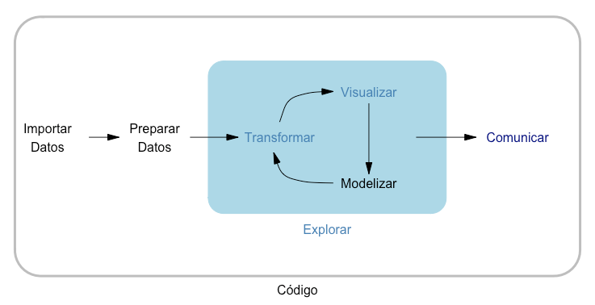

# R para ciencia de datos {#ch-110003}

*Emilio L. Cano*

Universidad Rey Juan Carlos


## Introducción

\index{R}
\index{internet of things}
\index{big data}


El análisis estadístico de datos es una tarea fundamental 
en la transformación digital de las empresas y organizaciones. 
Siempre ha estado ahí, pero
en la actualidad la disponibilidad de datos, la cantidad de los mismos, 
y la velocidad con la que se requieren resultados, está haciendo
necesario el capacitar a los profesionales
para su análisis con nuevas herramientas. Nuevas tendencias (muchas veces
malinterpretadas) como Inteligencia Artificial, _Big Data_, Industria 4.0, _Internet of Things_ (IoT), 
o _Data Science_, aumentan el interés por parte de las empresas, los profesionales 
y los investigadores en estas técnicas.

El tratamiento de datos y su análisis requiere el uso de
software avanzado. Aunque algunas tareas como, por ejemplo, mecanizar y almacenar datos, se pueden realizar
eficazmente con programas de hoja de cálculo \index{hoja de cálculo}
como Excel, 
se debería
utilizar software especializado para el análisis de datos. Existen distintos 
paquetes estadísticos comerciales, como SPSS, Statgraphics, Stata, SAS, JMP o Minitab. En los últimos 
años se ha abierto camino como alternativa el [software estadístico y lenguaje de
programación **R**](http://www.r-project.org) [@R-base]. Hay otras alternativas que, en su mayoría, o son parciales, referidas a un 
ámbito concreto, o son más lenguajes de programación que software estadístico, como Python. 
**R** es software libre, pero su gratuidad sólo es una
de sus ventajas, como se verá a lo largo del libro. Su gran inconveniente
es la curva de aprendizaje: no es tan fácil de aprender y usar como un
software de ventanas, ya que el uso de **R** se basa en expresiones que
hay que ejecutar desde _scripts_ (archivos de código).\index{script} 


**R** es un 
sistema para **computación estadística**: software de **análisis de datos** y
**lenguaje de programación**. Ha sido ampliamente utilizado en investigación y docencia, 
y actualmente también 
en las empresas y organismos públicos. Es la evolución del trabajo de los laboratorios Bell con el 
lenguaje S [@venables2002modern],
llevado al mundo del software libre por Ross Ihaka y Robert Gentleman en los años 90 [@ihaka1996r].
La version R 1.0.0 se publicó el 29 de febrero de 2000.


\index{paquete}

Uno de los aspectos más espectaculares de **R** es la cantidad de **paquetes**
disponibles. Un paquete (_package_) de **R** es un componente con funcionalidad adicional que se puede
instalar en el sistema para ser utilizado por **R**. En el momento de 
compilar este libro, el número de paquetes disponibles en el repositorio oficial 
es de 19725.  


Una vez conocido el mundo de **R**, se plantea la siguiente pregunta: ¿y por qué
utilizar **R**? Es imposible dar un único motivo. A continuación se enumeran
algunos de ellos:

- Es Free and Open Source Software (FOSS). Gratis y libre. En inglés se suele decir _free as in free beer, and free as in free speech_.
- Tiene una amplia comunidad de usuarios que proporciona recursos.
- Es multiplataforma.
- Se usa cada vez en más empresas e instituciones.
- Es posible obtener soporte comercial, por ejemplo a través de Posit Software PBC[^nota-posit].
- Se ha alcanzado una masa crítica de usuarios que lo hace confiable.
- Es extensible (desde pequeñas funciones, hasta paquetes).
- Se puede implementar la innovación inmediatamente. En software comercial hay que esperar a nuevas versiones, en el mejor de los casos.
- Posee características de "investigación reproducible". En el Cap. \@ref(120007-informes) se tratará
qué implica este enfoque. En contextos distintos a la investigación, se puede hablar de informes reproducibles y trazabilidad del análisis.

[^nota-posit]: https://posit.co, antes RStudio PBC.

Por otra parte, el uso de **R** en las empresas está **creciendo exponencialmente** debido, principalmente, a la necesidad de analizar y visualizar datos con herramientas potentes para explotar todo su potencial. Grandes empresas de todos los sectores llevan tiempo utilizándolo, si bien la popularización del software y su conocimiento entre los nuevos titulados está facilitando que empresas de todo tipo y tamaño aprovechen esta herramienta en su estrategia digital. Así, además de la **visualización y presentación efectiva** de los datos, equipos bien formados pueden descubrir relaciones entre variables clave, realizar **predicciones**, tomar mejores decisiones o **mejorar sus procesos** gracias al análisis avanzado de datos más allá de la hoja de cálculo.


## La sesión de **R** {#110003-bases}


**R** es una aplicación de análisis estadístico 
y representación gráfica de datos, y además un lenguaje de programación. 
**R** es **interactivo**, en el sentido de que
responde a través de un "intérprete" a las **entradas** que recibe
a través de la **consola**.

La interfaz de usuario de **R** (R GUI, _Graphical User Interface_) cumple las funciones básicas para
interactuar con **R**, pero es muy pobre a la hora de trabajar con ella. En su lugar,
es más conveniente utilizar el entorno de desarrollo [RStudio Desktop](http://www.rstudio.org) (o su versión en la nube https://posit.cloud/), 
que es como un
"envoltorio" del sistema **R** con más funcionalidades y ayudas, pero
manteniendo el mismo nivel de interacción: consola y _scripts_[^nota-estilo]. Al igual que **R**, RStudio es una aplicación de software libre, pero, en este caso, desarrollada y mantenida por la compañía privada Posit PBC. 

[^nota-estilo]: Lo importante
es seguir un estilo consistente en cuanto a nombres de objetos, espacios
en blanco y el uso de delimitadores y tabulación en el _script_. Véase por ejemplo
la [guía de estilo de Hadley Wickam](http://adv-r.had.co.nz/Style.html)
[@wickham2015advanced].

::: {.infobox data-latex=""}
Una cosa muy importante en **R** es que las expresiones son **sensibles a mayúsculas**,
y por tanto los objetos `datos` y `Datos` son distintos.
:::


## Instalación de **R**

Durante todo el libro se utiliza la interfaz RStudio. Pero, como se avanzó anteriormente, RStudio
es solo un "envoltorio" de **R**, por lo que previamente hay que tener instalado
en el ordenador el sistema "base" de **R**. **R** está disponible para sistemas
Windows, MacOS y Linux. Por cuestiones de espacio, no se incluyen detalles en este libro, pero la instalación es sencilla siguiendo las instrucciones en sus correspondientes websites:


1. Instalación de **R**: http://www.r-project.org 
2. Instalación de RStudio: https://posit.co 

Para completar la instalación de **R**, se muestra cómo instalar[^nota-install-pack] los paquetes del `tidyverse`[^nota-tv] mediante expresiones en la consola o _script_ con la función `install.packages()`: 


```r
install.packages(pkgs = "tidyverse")
```

Una vez instalado el paquete, se cargará con la instrucción `library("nombre_paquete")` en la sesión de **R** donde se quiera utilizar. 


```r
library("tidyverse")
```

A veces resulta útil usar directamente
la función que se va a utilizar en vez de cargar todo el paquete. Esto se hace con el operador `::`, es decir, `nombre_paquete::funcion()`. La siguiente expresión serviría para usar
la función `select()` del paquete `dplyr` sin cargar el paquete entero.

```r
dplyr::select()
```

[^nota-install-pack]: Una vez instalado un paquete no hay que volver a instalarlo.

[^nota-tv]: El _tidyverse_ es un conjunto de paquetes que se irán describiendo a medida que se utilicen, especialmente en la Sec. \@ref(110003-tidyverse).


## Trabajar con proyectos de RStudio {#110003-proyectos}
\index{proyectos}

La manera más eficiente de trabajar con **R**, es mediante **proyectos**
de RStudio. Esto permite abstraerse de los detalles de la sesión de **R** 
(espacio de trabajo, directorio de trabajo, _environment_), ya que al abrir
un proyecto estará todo preparado para seguir el trabajo donde se dejó,
o empezar de cero si se acaba de crear.
Para crear un proyecto de RStudio, se despliega el menú de proyectos a la derecha en la barra de herramientas y se selecciona "New Project..." También se puede hacer en el menú "File/New Project...". 

Es aconsejable crear siempre una estructura
de carpetas que permita tener todo organizado desde el principio,
porque al final los proyectos crecen. La estructura perfecta no existe,
y depende del proyecto particular. Las siguientes carpetas pueden ser
útiles en un amplio abanico de proyectos, y 
las tres primeras se pueden usar prácticamente en cualquier proyecto:

- `<svg aria-hidden="true" role="img" viewBox="0 0 512 512" style="height:1em;width:1em;vertical-align:-0.125em;margin-left:auto;margin-right:auto;font-size:inherit;fill:currentColor;overflow:visible;position:relative;"><path d="M0 96C0 60.7 28.7 32 64 32H196.1c19.1 0 37.4 7.6 50.9 21.1L289.9 96H448c35.3 0 64 28.7 64 64V416c0 35.3-28.7 64-64 64H64c-35.3 0-64-28.7-64-64V96zM64 80c-8.8 0-16 7.2-16 16V416c0 8.8 7.2 16 16 16H448c8.8 0 16-7.2 16-16V160c0-8.8-7.2-16-16-16H286.6c-10.6 0-20.8-4.2-28.3-11.7L213.1 87c-4.5-4.5-10.6-7-17-7H64z"/></svg>`{=html} `data`: en esta carpeta se tienen los archivos de
datos, tanto aquellos orígenes de datos que se quieran importar, como los
que se puedan guardar desde un _script_.
- `<svg aria-hidden="true" role="img" viewBox="0 0 512 512" style="height:1em;width:1em;vertical-align:-0.125em;margin-left:auto;margin-right:auto;font-size:inherit;fill:currentColor;overflow:visible;position:relative;"><path d="M0 96C0 60.7 28.7 32 64 32H196.1c19.1 0 37.4 7.6 50.9 21.1L289.9 96H448c35.3 0 64 28.7 64 64V416c0 35.3-28.7 64-64 64H64c-35.3 0-64-28.7-64-64V96zM64 80c-8.8 0-16 7.2-16 16V416c0 8.8 7.2 16 16 16H448c8.8 0 16-7.2 16-16V160c0-8.8-7.2-16-16-16H286.6c-10.6 0-20.8-4.2-28.3-11.7L213.1 87c-4.5-4.5-10.6-7-17-7H64z"/></svg>`{=html} `R`: para los _scripts_. Es posible que solamente haya un _script_
en nuestro proyecto, pero si hubiera más se pueden guardar en esta carpeta.
- `<svg aria-hidden="true" role="img" viewBox="0 0 512 512" style="height:1em;width:1em;vertical-align:-0.125em;margin-left:auto;margin-right:auto;font-size:inherit;fill:currentColor;overflow:visible;position:relative;"><path d="M0 96C0 60.7 28.7 32 64 32H196.1c19.1 0 37.4 7.6 50.9 21.1L289.9 96H448c35.3 0 64 28.7 64 64V416c0 35.3-28.7 64-64 64H64c-35.3 0-64-28.7-64-64V96zM64 80c-8.8 0-16 7.2-16 16V416c0 8.8 7.2 16 16 16H448c8.8 0 16-7.2 16-16V160c0-8.8-7.2-16-16-16H286.6c-10.6 0-20.8-4.2-28.3-11.7L213.1 87c-4.5-4.5-10.6-7-17-7H64z"/></svg>`{=html} `inform`: aquí se pueden guardar los archivos Quarto o R Markdown
que se utilicen para generar informes o presentaciones.
- `<svg aria-hidden="true" role="img" viewBox="0 0 512 512" style="height:1em;width:1em;vertical-align:-0.125em;margin-left:auto;margin-right:auto;font-size:inherit;fill:currentColor;overflow:visible;position:relative;"><path d="M0 96C0 60.7 28.7 32 64 32H196.1c19.1 0 37.4 7.6 50.9 21.1L289.9 96H448c35.3 0 64 28.7 64 64V416c0 35.3-28.7 64-64 64H64c-35.3 0-64-28.7-64-64V96zM64 80c-8.8 0-16 7.2-16 16V416c0 8.8 7.2 16 16 16H448c8.8 0 16-7.2 16-16V160c0-8.8-7.2-16-16-16H286.6c-10.6 0-20.8-4.2-28.3-11.7L213.1 87c-4.5-4.5-10.6-7-17-7H64z"/></svg>`{=html} `img`: si en nuestro proyecto se utilizan imágenes
de cualquier tipo, es una buena idea tenerlas en una carpeta aparte.
- `<svg aria-hidden="true" role="img" viewBox="0 0 512 512" style="height:1em;width:1em;vertical-align:-0.125em;margin-left:auto;margin-right:auto;font-size:inherit;fill:currentColor;overflow:visible;position:relative;"><path d="M0 96C0 60.7 28.7 32 64 32H196.1c19.1 0 37.4 7.6 50.9 21.1L289.9 96H448c35.3 0 64 28.7 64 64V416c0 35.3-28.7 64-64 64H64c-35.3 0-64-28.7-64-64V96zM64 80c-8.8 0-16 7.2-16 16V416c0 8.8 7.2 16 16 16H448c8.8 0 16-7.2 16-16V160c0-8.8-7.2-16-16-16H286.6c-10.6 0-20.8-4.2-28.3-11.7L213.1 87c-4.5-4.5-10.6-7-17-7H64z"/></svg>`{=html} `test`: si se quieren separar los _scripts_ que se utilicen para 
pruebas y no se quieren mezclar con los "buenos" en la carpeta `R`.
- `<svg aria-hidden="true" role="img" viewBox="0 0 512 512" style="height:1em;width:1em;vertical-align:-0.125em;margin-left:auto;margin-right:auto;font-size:inherit;fill:currentColor;overflow:visible;position:relative;"><path d="M512 416c0 35.3-28.7 64-64 64H64c-35.3 0-64-28.7-64-64V96C0 60.7 28.7 32 64 32H192c20.1 0 39.1 9.5 51.2 25.6l19.2 25.6c6 8.1 15.5 12.8 25.6 12.8H448c35.3 0 64 28.7 64 64V416zM232 376c0 13.3 10.7 24 24 24s24-10.7 24-24V312h64c13.3 0 24-10.7 24-24s-10.7-24-24-24H280V200c0-13.3-10.7-24-24-24s-24 10.7-24 24v64H168c-13.3 0-24 10.7-24 24s10.7 24 24 24h64v64z"/></svg>`{=html} `aux`, `tmp`, `util`, `notas`, `doc`, ...: 
este tipo de carpetas vienen bien cuando
hay información que está relacionada o es útil para un proyecto, pero el archivo no es 
del proyecto de análisis de datos en sí. Por ejemplo, unas especificaciones de
un producto o servicio, un artículo científico, fotografías de una fábrica, 
comunicaciones con clientes, etc.
- `<svg aria-hidden="true" role="img" viewBox="0 0 512 512" style="height:1em;width:1em;vertical-align:-0.125em;margin-left:auto;margin-right:auto;font-size:inherit;fill:currentColor;overflow:visible;position:relative;"><path d="M512 416c0 35.3-28.7 64-64 64H64c-35.3 0-64-28.7-64-64V96C0 60.7 28.7 32 64 32H192c20.1 0 39.1 9.5 51.2 25.6l19.2 25.6c6 8.1 15.5 12.8 25.6 12.8H448c35.3 0 64 28.7 64 64V416zM232 376c0 13.3 10.7 24 24 24s24-10.7 24-24V312h64c13.3 0 24-10.7 24-24s-10.7-24-24-24H280V200c0-13.3-10.7-24-24-24s-24 10.7-24 24v64H168c-13.3 0-24 10.7-24 24s10.7 24 24 24h64v64z"/></svg>`{=html} `ejercicios`, `practicas`, ...: si nuestro proyecto
forma parte de una asignatura, curso, o similar.


::: {.infobox data-latex=""}
Un aspecto importante cuando se trabaja en proyectos colaborativos es el control de versiones. Este tema se aborda en el Cap. \@ref(github).
:::


## Tratamiento de datos con **R**

En este apartado se van a empezar a utilizar expresiones de **R**. Las expresionesse escribirn en _scripts_, que pueden contener "comentarios" (texto que no se ejecutará) utilizando el símbolo "almohadilla" (`#`). Muchas de las expresiones que se usan son llamadas a funciones[^nota-espacio]. La ayuda de cualquier función se puede obtener en la consola usando la expresión `?function`, donde `function` es el nombre de la función u objeto del que se quiere obtener ayuda.

[^nota-espacio]: Por motivos de espacio´, no se incluyen mayores explicaciones de las mismas, pero se anima al lector a explorar la ayuda de cada una de ellas para comprender mejor su funcionamiento.

### Estructuras y tipos de datos {#110003-estructuras}

Las estructuras y tipos de datos más frecuentes con las que se trabaja en **R** son las que se detallan a continuación.

**Tablas de datos**. Son colecciones de variables numéricas y/o atributos
organizadas en columnas,
en las que cada fila se corresponde con algún elemento en el que se han
observado las características que representan las variables. La forma más común
es el `data.frame`. Cada columna del `data.frame` es, en realidad, otra estructura de datos, en concreto, un `vector`. Un ejemplo de `data.frame` es el conjunto de datos `tempmin_data` del paquete `CDR` que se analiza en el Cap. \@ref(datos-espaciales) y del que se muestran a continuación las primeras tres filas con la función `head()`.\index{data.frame}


```r
library("CDR")
head(tempmin_data, 3)
#>        fecha indicativo tmin  longitud  latitud
#> 1 2021-01-06      4358X -4.7 -5.880556 38.95556
#> 2 2021-01-06      4220X -7.0 -4.616389 39.08861
#> 3 2021-01-06      6106X  4.7 -4.748333 37.02944
```

Un `data.frame` es un objeto de datos en dos dimensiones, en el que las filas
son la dimensión 1 y las columnas la dimensión 2. Los datos se pueden "extraer" 
de un `data.frame` por filas, por columnas o por celdas. Para extraer una
de las variables del `data.frame` se suele utilizar el operador `$` después del
nombre del `data.frame`, y a continuación el nombre de la variable.

El operador `<-` asigna al "símbolo" que hay a su izquierda el resultado
de la expresión que hay a su derecha, y lo guarda con ese nombre
en el espacio de trabajo[^nota-igual]. Por ejemplo, la siguiente expresión extrae todas las filas de la
columna `tmin` o, dicho de otra forma, el vector con todas las temperaturas mínimas registradas y lo guarda en el objeto `temp_min`.

[^nota-igual]: También se puede utilizar el símbolo igual (`=`) para realizar asignaciones. No obstante, en el marco de este libro se recomienda el uso del operador específico `<-`.


```r
temp_min <- tempmin_data$tmin
```

\index{vector}\index{matriz}
**Vectores y matrices**. Ya se ha visto que una columna de una tabla de datos es un vector. También se pueden crear vectores con la función `c()` y los elementos del vector separados por comas. Una matriz es un vector organizado en filas y columnas. A modo de ejemplo, la primera de las siguientes expresiones crea un vector llamado `nombres` con dos cadenas de texto, y la segunda crea una matriz numérica llamada `coordenadas` a partir de las columnas 4 y 5 del conjunto de datos `tempmin_data`. Nótese que la extracción de valores de un conjunto de datos o de una matriz se puede realizar también por sus índices de filas y columnas entre corchetes separados por una coma. En este caso se extraen todas las filas (pues no se especifica ninguna en la dimensión 1) de las columnas 4 y 5.


```r
nombres <- c("longitud", "latitud")
coordenadas <- as.matrix(tempmin_data[, 4:5])
```


\index{factor}
**Factor**. Es un tipo especial de vector para representar variables categóricas (también denominadas atributos o factores). En general, una variable categórica suele tomar un número reducido
de valores diferentes (categorías), identificados con etiquetas (_labels_) y que se llaman
**niveles** del factor (_levels_).
Un ejemplo es el dataset `dp_entr` del paquete `CDR` que se analiza en el Cap. \@ref(cap-arboles). La columna `ind_pro11` es un indicador que toma los valores `S` y `N`, mientras que `des_nivel_edu` toma tres posibles valores.


```r
dp_entr[1:5, c(1, 17)]
#>     ind_pro11 des_nivel_edu
#> 1           S         MEDIO
#> 497         N         MEDIO
#> 265         N        BASICO
#> 534         N         MEDIO
#> 415         N        BASICO
levels(dp_entr$des_nivel_edu)
#> [1] "ALTO"   "BASICO" "MEDIO"
```

\index{lista}
**Listas**. Son estructuras de datos que contienen una
colección de elementos indexados que, además, pueden tener un
nombre.
Pueden ser heterogéneas,
en el sentido de que cada elemento de la lista puede ser
de cualquier tipo. 


A modo de ejemplo, se muestran los nombres  del objeto `tempmax_data` del paquete `CDR`, que contiene 6 elementos de distintas clases.


```r
names(tempmax_data)
#> [1] "ESP"             "ESP_utm"         "grd_sf"          "grd_sp"         
#> [5] "temp_max_utm_sf" "temp_max_utm_sp"
```

\index{fechas}
**Fechas**. Son un tipo de datos especial que algunas veces provoca problemas
al compartir datos entre programas. El conjunto de datos `tempmin_data` contiene la columna `fecha`, que puede convertirse de manera inmediata a tipo fecha (`Date`) porque viene en un formato estándar (véase la ayuda de `strptime` para especificar otros formatos). El paquete `lubridate` del _tidyverse_ contiene funciones para hacer más fácil el trabajo con fechas.


```r
tempmin_data$fecha<- as.Date(tempmin_data$fecha)
class(tempmin_data$fecha)
#> [1] "Date"
```

\index{cadenas de caracteres}\index{strings}
**Cadenas de texto**. Son estructuras de datos que aparecen en forma de vector de caracteres. La columna `indicativo` del conjunto de datos `tempmin_data` es un ejemplo de este tipo de datos. La ayuda de `?regexpr` proporciona la información necesaria sobre cómo extraer texto con expresiones regulares, y la de `?paste` para aprender a unir cadenas de texto. El paquete `stringr` del _tidyverse_ contiene funciones para facilitar el trabajo con cadenas de texto. 


```r
head(tempmin_data$indicativo)
#> [1] "4358X" "4220X" "6106X" "9698U" "4410X" "1331A"
```


### Importación de datos {#110003-importacion}

\index{importar datos}
En el apartado anterior se han utilizado tablas de datos que están incluidas en un paquete de **R**. Pero lo habitual es que los datos se tengan que importar de fuentes externas, como ficheros. A continuación, se describen algunas de las formas de importar los tipos de ficheros más habituales[^nota-datafolder].

[^nota-datafolder]: Para poder reproducir los ejemplos, se debe tener una carpeta `data` en el directorio de trabajo.


**Excel**. Sin duda una forma muy popular de organizar los datos en ficheros es
mediante **hojas de cálculo como Microsoft Excel**. 
Hay varios paquetes con los que se puede trabajar con archivos de Excel. En este libro se utiliza
el paquete `readxl` del _tidyverse_. Con la siguiente expresión se puede descargar un archivo Excel de ejemplo[^nota-dl].

[^nota-dl]: La función `download.file()` permite descargar cualquier archivo disponible en la `url` que se indique. Es obligatorio indicar el archivo de destino con el argumento `destfile`. Si el archivo no es de texto plano, se debe indicar `mode = "wb"`.


```r
download.file(url = "http://emilio.lcano.com/b/adr/p/datos/RRHH.xlsx",
              destfile = "data/RRHH.xlsx",
              mode = "wb")
```


Una vez el archivo está en el directorio de trabajo de la sesión de **R**, se puede importar su contenido al espacio de trabajo con la siguiente expresión:


```r
rrhh <- readxl::read_excel("data/RRHH.xlsx")
```

**Texto**. Los **archivos de texto** son el formato más utilizado y conveniente para compartir datos. Es también
muy común que el equipamiento o el software genere datos en formato de texto. Estos
archivos suelen tener extensión `.csv` (_comma separated values_) o `.txt`, aunque
pueden tener cualquier otra, o incluso no tener extensión. A modo de ejemplo, con la siguiente expresión se puede descargar un archivo csv.


```r
download.file(url = "http://emilio.lcano.com/b/adr/p/datos/ejDatos.csv",
              destfile = "data/ejDatos.csv")
```

Si el archivo tiene extensión `.csv`, como el anterior, vendrá
ya con una especificación muy concreta, pudiéndose usar directamente las funciones
`read.csv()` o `read.csv2()` para tener la tabla de datos en el espacio de trabajo. 


```r
merma <- read.csv2("data/ejDatos.csv")
```

La función genérica de **R** para importar datos de texto es `read.table()`, que puede importar cualquier especificación cambiando los argumentos adecuados.
Por ejemplo, la siguiente expresión tendría el mismo resultado que se ha
obtenido con la función `read.csv2`[^nota-rt]:


```r
merma <- read.table(file = "data/ejDatos.csv",
                    header = TRUE,
                    sep = ";",
                    dec = ",",
                    fileEncoding = "utf-8")
```


[^nota-rt]: Con el argumento `header` se indica si la primera fila tiene encabezados (`TRUE`) o no (`FALSE`, opción por defecto). También hay que especificar el separador de columnas `sep` y el símbolo decimal `dec`. `fileEncoding` es la especificación de la codificación de texto; las más habituales son `utf-8` y '`latin1`.

::: {.infobox data-latex=""}
Para saber cómo importar datos desde sistemas gestores de bases de datos véase el
Cap. \@ref(datos-sql).
:::

Hay infinidad de otras fuentes de las que se pueden importar datos a **R**. Por ejemplo, el paquete `rvest`, que forma parte
del _tidyverse_, se puede utilizar para obtener datos de páginas web y otras fuentes de Internet, lo que se suele llamar _web scraping_. Por ejemplo, supóngase que se quiere importar la tabla con los datos de comunidades y ciudades autónomas españolas del enlace https://www.ine.es/daco/daco42/codmun/cod_ccaa_provincia.htm. 
Las siguientes expresiones importan esta tabla al conjunto de datos `ccaa_ine`. 


```r
library("rvest")
url <- "https://www.ine.es/daco/daco42/codmun/cod_ccaa_provincia.htm"
ccaa_ine <- url |> 
  read_html() |> 
  html_node(xpath = '//*[@id="contieneHtml"]/table') |> 
  html_table(fill = TRUE)
```

La ruta o "xpath" se puede obtener usando las herramientas de desarrollo del navegador, y puede que una vez importada la tabla se requiera algún post-procesamiento antes de poder analizar los datos.

### Exportación de datos y archivos de datos específicos de R

En algunos proyectos es necesario guardar algunos datos que se han ido creando o
transformando, bien para compartir con otras partes interesadas, bien para
ser utilizados en el mismo u otros proyectos. 
Para exportar los datos a Excel, se utiliza la función `write.xlsx()` del paquete `openxlsx` (si no está instalado, se instala de la forma habitual).
Si lo que se quiere es exportarlo a texto, se pueden utilizar los equivalentes
a las funciones de importación `write.csv()`, `write.csv2()` o `write.table()`.

La siguiente expresión exporta la tabla de datos `tempmin_data` a ficheros Excel y csv (formato en inglés).


```r
openxlsx::write.xlsx(x = tempmin_data, 
                     file = "data/temp_min_Filomena.csv")
write.csv(x = tempmin_data, file = "data/temp_min_Filomena.csv")
```


También se pueden guardar los datos en formato "nativo" de **R**. Los archivos `.RData` almacenan un espacio de trabajo entero, y por tanto
pueden guardar varios objetos en el mismo archivo. Cuando posteriormente se importe,
los objetos estarán en el espacio de trabajo con su nombre original.
Se guardan con la función `save()` y se restauran con la función `load()`, como en el siguiente ejemplo.


```r
save(tempmin_data, tempmax_data, 
     file = "data/datos_temperaturas.RData")
load("data/datos_temperaturas.RData") #carga de nuevo el objeto
```

Los archivos `.rds` almacenan un único objeto en un archivo. Cuando posteriormente se quieran importar,
hay que asignar el resultado al nombre que se quiera. Se guardan con la
función `writeRDS()` y se restauran con la función `readRDS()`, como en el siguiente ejemplo.


```r
saveRDS(object = tempmin_data, 
        file = "data/datos_temperaturas.rds")
nuevo_objeto <- readRDS(file = "data/datos_temperaturas.rds")
```


El paquete `foreign` de **R** base y otros paquetes especializados pueden
exportar datos a otros formatos de archivo, que no se tratan
en detalle en este capítulo. 


## Organización de datos con el _tidyverse_ {#110003-tidyverse}

### El _tidyverse_ y su flujo de trabajo

\index{tidyverse}
El _tidyverse_ es, según se define en su propia [página web](http://tidyverse.org)[^note-tidy-opin],
un conjunto de paquetes de **R** "opinables" diseñados para ciencia de datos.
Las principales ventajas (opinables) de utilizar el _tidyverse_ son tres:

[^note-tidy-opin]: "_... an opinionated collection of R packages designed for data science_". Incluye actualmente 30 paquetes, véase la lista con `tidyverse::tidyverse_packages(include_self = TRUE)` y la ayuda de cada paquete para saber más. Los que se vayan usando en el libro se irán explicando oportunamente.

1. Utiliza una gramática, estructuras de datos y filosofía de diseño común.
2. El flujo de trabajo es más fluido y, una vez se comprenden las ideas principales, más intuitivo.
3. Para la mayoría de las operaciones, es computacionalmente más eficiente.


Uno de los paquetes más populares del _tidyverse_ es `ggplot2`, que proporciona una "gramática de gráficos"
[@Wickham2016] y es una pieza clave del _tidyverse_ actual, junto con los paquetes `dplyr` (gramática para la manipulación de datos) y `tidyr` (herramienta para crear datos _tidy_). 
El flujo de trabajo propuesto por el _tidyverse_ se describe en el libro
"R for Data Science" [@wickham2016r] y se sintetiza en la Fig. \@ref(fig:ch-110003-flujods).


<div class="figure" style="text-align: center">

<p class="caption">(\#fig:ch-110003-flujods)Flujo de trabajo en Ciencia de Datos propuesto por el tidyverse (fuente: Wickham, H. and Grolemund, G. (2016))</p>
</div>

Además del mencionado libro, la web del _tidyverse_ (http://tidyverse.org) contiene
toda la documentación de los paquetes, incluidos artículos para tareas concretas,
que merece la pena leer alguna vez. En la web están también las conocidas como _cheatsheets_,
algunas de ellas disponibles también
en la ayuda de RStudio (menú
_Help/Cheatsheets_).


Dentro del flujo de trabajo de la Fig. \@ref(fig:ch-110003-flujods), ya se ha tratado
la primera etapa (_Import_) en la Sec. \@ref(110003-importacion). Es importante
señalar que, al utilizar las funciones del _tidyverse_, los datos se organizan
en objetos de clase `tibble`, que es una extensión del `data.frame` de **R** base.
Las principales diferencias son:

- Permite una representación compacta en la consola al mostrar la tabla de datos.
- La selección con corchetes simples de una única variable siempre devuelve
otro `tibble` (a diferencia de un `data.frame`, que devuelve un vector).

Se puede forzar a que una tabla de datos sea de un tipo u otro con las funciones `as.data.frame` (de tibble a data.frame) y `as_tibble` (de data.frame a tibble).

Siguiendo con el esquema de la Fig. \@ref(fig:ch-110003-flujods), en este apartado se verán
algunas tareas de las etapas _Tidy_ (organizar) y _Transform_ (transformar), que 
serán ampliadas en los Cap. \@ref(130009) y \@ref(chap-feature). La visualización
(_Visualise_) se tratará específicamente en el Cap. \@ref(120006-aed) y transversalmente en muchos otros. La modelización (_Model_) se trata extensamente en los capítulos de las partes IV a IX, y la comunicación (_Communicate_) se verá
en los capítulos de la Parte X.
Una de las características de la forma en que están programados los paquetes del
_tidyverse_ es que se puede trabajar[^estilo-tidy] con _pipes_. 


[^estilo-tidy]: Existe una guía de estilo del _tidyverse_, que se puede consultar en https://style.tidyverse.org. Hay incluso una serie de _Addins_ en RStudio para
comprobar y aplicar esta guía de estilo a través del paquete `styler`. Los _Addins_ son menús adicionales en RStudio para usar la funcionalidad de algunos paquetes de forma interactiva.

El _pipe_ es, básicamente, un operador compuesto de dos caracteres, `|>`,
que se puede obtener con el atajo de teclado `CTRL+MAYUS+M`. El operador
se pone en medio de dos expresiones de **R**. Sean `lado_izquierdo`
y `lado_derecho` las expresiones que se ponen a izquierda y derecha
del _pipe_. Entonces se utiliza de la siguiente manera:


```r
lado_izquierdo |> lado_derecho
```


::: {.infobox data-latex=""}
El operador _nativo_ de **R**, `|>`, apareció en la versión R-4.1.0. Hay un operador alternativo que proviene del paquete `magrittr`, `%>%`, que había que usar antes de esta versión, y mucha literatura y documentación está escrita usándolo. Hay diferencias, pero a los efectos de este capítulo ambos operadores se pueden utilizar indistintamente.
:::

La expresión `lado_izquierdo` debe producir un valor, que puede
ser cualquier objeto de **R**.
La expresión `lado_derecho` debe ser una función, que tomará como primer
argumento el valor producido en la parte izquierda. 
Si se desea guardar el resultado final, se debe asignar el resultado
a algún nombre de objeto para que se almacene en el espacio de trabajo.
La siguiente expresión sería un ejemplo de uso.


```r
nombre_objeto <- lado_izquierdo |>
  lado_derecho
```

La ventaja de usar los _pipes_ es que se pueden encadenar, de forma que el resultado de cada operación pasa a la siguiente expresión del _pipeline_ (secuencia de operaciones con _pipe_), como en el siguiente ejemplo:


```r
library("dplyr")
contam_mad |> colnames() |> length()
#> [1] 12
```


### Transformación de datos con `dplyr`


En la gramática del _tidyverse_, dentro del paquete `dplyr` se dispone de una
serie de "verbos" (funciones) para una sola tabla, que se pueden
agrupar en tres categorías: para trabajar con filas, para trabajar con
columnas y para resumir datos.


#### Operaciones con filas

\index{filtrar datos}
Los verbos definidos para estas operaciones son:

-  **`filter()`**: elige filas en función de los valores de la columna.


```r
pm10 <- contam_mad |> 
  filter(nom_abv == "PM10")   # se filtra por PM10
```

\index{ordenar datos}
-  **`arrange()`**: cambia el orden de las filas con algún criterio.


```r
zonas<- contam_mad |>
  arrange(desc(zona), daily_mean)
```

\index{extraer datos}
-  **`slice()`**: extrae filas por su índice. También hay una serie de funciones
"asistentes" (_helpers_) para obtener los índices que se utilizan con
frecuencia. Por ejemplo:

  - `slice_head()` y `slice_tail()` obtienen las primeras y últimas filas
respectivamente (por defecto, una). Se puede especificar `n` (número) o `prop`
(proporción) de filas.
  - `slice_sample()` obtiene una muestra aleatoria de `n` filas (o proporción `prop`).
  - `slice_min()`, `slice_max()` obtienen las filas que contienen los menores o mayores
valores respectivamente de la variable indicada en el argumento `order_by`. Si no
se especifica `n` o `prop`, se obtienen sólo las filas que contienen el mínimo o el máximo. Nótese
que puede haber más de una fila que cumpla la condición. 

Véase el resultado de los siguientes ejemplos:


```r
pm10 |> slice(10:15) # extrae filas desde la 10 a la 15
pm10 |> slice_tail(n = 3) # extrae las tres últimas filas
pm10 |> slice_max(order_by = daily_mean) # día con mayor valor medio de PM10
set.seed(1) # Para que la muestra aleatoria sea reproducible
pm10 |> slice_sample(n = 4) # muestra 4 registros
```


#### Operaciones con columnas

Los verbos definidos para estas operaciones son:

\index{seleccionar columnas}
- **`select()`**: indica cuando una columna se incluye o no. Se pueden utilizar _helpers_ para seleccionar columnas que cumplan cierta condición (por ejemplo, ser numéricas) y también para "quitar" columnas de la selección (con el signo menos (`-`)).


```r
pm10 |> select(longitud, latitud, daily_mean, tipo)
pm10 |> select(where(is.numeric))
pm10 |> select(-c(id:latitud))
```


En cuanto a la **modificación** de datos, existen múltiples posibilidades. Algunas de ellas son: 

- **`rename()`**: cambia el nombre de la columna.

- **`mutate()`**: cambia los valores de las columnas y crea nuevas columnas. La función `transmute()` funciona igual que `mutate()`, pero la tabla de datos
resultante sólo contiene las nuevas columnas creadas.


- **`relocate()`**: cambia el orden de las columnas.


```r
pm10 |> rename(zona_calidad_aire = zona)
pm10 |> relocate(fecha, .before = estaciones)
pm10_na <- pm10 |> mutate(isna = is.na(daily_mean))
```

En este punto, es importante señalar que dentro de la función `mutate()`
se puede usar cualquier función vectorizada para transformar las
variables. Por ejemplo, se podría transformar una columna con las funciones
`as.xxx` que se vieron en la Sec. \@ref(110003-estructuras), aplicar formatos
a fechas o usar funciones del paquete `lubridate` para trabajar con este
tipo de datos. A medida que se avance en el libro irán apareciendo aplicaciones
que ahora, quizás, no sean tan evidentes.


#### Operaciones de resumen y agrupación

La primera operación de resumen que puede surgir es
"contar" filas. La función `tally()`  devuelve el número de filas totales
de un `data.frame`. La función `count()` proporciona también este número; si, además, se pasa como argumento alguna variable, lo que devuelve es el número
de filas para cada valor diferente de dicha/s variable/s. Estos recuentos se
pueden añadir a la tabla de datos con las funciones `add_count()` y `add_tally()`,
lo que permite calcular frecuencias absolutas y relativas fácilmente.


```r
pm10 |> tally()
#>       n
#> 1 53794
pm10 |> count(zona)
#>            zona     n
#> 1: Interior M30 20690
#> 2:      Noreste 12414
#> 3:     Noroeste  4138
#> 4:      Sureste  8276
#> 5:     Suroeste  8276
```


La función `summarise()` (o, equivalentemente, `summarize()`) aplica alguna
función de resumen a la/s variable/s que se especifiquen (`mean()`, `max()`, etc.). 
El paquete `dplyr` tiene algunas funciones de resumen adicionales, como
`n()` (número de filas), `n_distinct()` (número de filas con valores distintos) y
`first()`, `last()`, `nth()` (primero, último y _n_-ésimo valor, en el orden en el que se encuentran, respectivamente).

En muchas ocasiones, las operaciones de análisis se realizan en grupos
definidos por alguna variable de agrupación. La función `group_by()`
"prepara" la tabla de datos para realizar operaciones de este tipo.
Una vez agrupados los datos, se pueden añadir operaciones de
resumen como las vistas anteriormente. A veces hay que "desagrupar" los
datos, para lo que se utiliza la función `ungroup()`.

A continuación, se muestra una expresión un poco más compleja que las anteriores. 
En el conjunto de datos `contam_mad` del paquete `CDR`, se filtra por el 
nombre de contaminante "NOx". Después se agrupan los datos por zona y se 
calculan algunos estadísticos resumen para cada zona. 


```r
contam_mad |>  
  filter(nom_abv == "NOx") |> # se filtra por N0x
  group_by(zona) |>
  summarize(
    min = min(daily_mean, na.rm = TRUE),
    q1 = quantile(daily_mean, 0.25, na.rm = TRUE),
    median = median(daily_mean, na.rm = TRUE),
    mean = mean(daily_mean, na.rm = TRUE),
    q3 = quantile(daily_mean, 0.75, na.rm = TRUE),
    max = max(daily_mean, na.rm = TRUE)
  )
#> A tibble: 5 × 7
    zona            min    q1 median  mean    q3   max
    <chr>         <dbl> <dbl>  <dbl> <dbl> <dbl> <dbl>
#> 1 Interior M30 0.0833  32.4   54.1  72.9  90.0  759.
#> 2 Noreste      1       23.8   39.6  56.2  68.9  516.
#> 3 Noroeste     0       12.0   20.3  29.7  34.5  352.
#> 4 Sureste      0       29.1   45.4  64.6  77.2  453 
#> 5 Suroeste     0.667   33.5   59.6  90.5 114.   666.
```


### Combinación de datos

En el apartado anterior se han tratado los "verbos" de una tabla.
Es muy común que haya que combinar datos de distintas
tablas, para lo cual se utilizan lo que el _tidyverse_
considera _two tables verbs_. En esencia, para combinar
tablas que contienen información relacionada, hay que
saber cuáles son las columnas que se refieren a lo mismo,
para hacer las uniones (_joins_) utilizando esas
columnas. Hay cuatro tipos de uniones que se pueden realizar,
usando las siguientes funciones:

- `inner_join()`: se incluyen las filas de ambas tablas para las que coinciden las variables de unión.
- `left_join()`: se incluyen todas las filas de la primer tabla y sólo las de la segunda donde hay coincidencias.
- `right_join()`: se incluyen todas las filas de la segunda tabla y sólo las de la primera donde hay coincidencias.
- `full_join()`: se incluyen todas las filas de las dos tablas.

Las funciones requieren como argumentos dos tablas de datos y
la especificación de las columnas coincidentes. Si no se especifica,
hace las uniones por todas las columnas coincidentes en ambas tablas. Para
las filas que sólo están en una de las tablas, se añaden valores `NA`
donde no haya coincidencias.

A modo de ejemplo, las siguientes expresiones unen dos datasets para combinar datos de municipios con su renta. En el Cap. \@ref(130009) se verán estas uniones en la práctica.


```r
library("sf")
munis_renta <- municipios |>
  left_join(renta_municipio_data) |> 
  select(name, cpro, cmun, `2019`) 
#> Joining, by = "codigo_ine"
```


Otra forma de unir tablas es, simplemente, añadiendo columnas (que tengan el mismo
número de filas) o filas (que tengan el mismo número de columnas). Para ello se usan
las funciones `bind_cols()` y `bind_rows()`, respectivamente. 
Otra forma conveniente de añadir nuevas filas o columnas son las funciones
`add_row()` y `add_column()`. Se pueden añadir antes o después de una fila/columna
especificada con el argumento `.before`, y pasando los valores como pares "variable = valor" para cada variable en el conjunto de datos.


Como comentario final del paquete `dplyr`, una característica importante es que
se pueden usar las funciones vistas sobre
tablas de una base de datos, sin necesidad de utilizar sentencias SQL y con
la ventaja de que las operaciones se realizan en el motor de la base de datos. 
En el Cap. \@ref(datos-sql) se tratarán las cuestiones relacionadas con los gestores de bases de datos y SQL.


### Reorganización de datos

\index{extender datos}\index{apilar datos}
A lo largo del capítulo se ha visto la importancia de disponer los
datos de forma rectangular, de forma que se tenga una columna para
cada variable y una fila para cada observación. Algunas veces es
conveniente reorganizar los datos más "a lo ancho" o más
"a lo largo" de lo que se encuentran.

Para estas operaciones se utilizan las funciones `pivot_longer()` y
`pivot_wider()` del paquete `tidyr` del _tidyverse_  de la siguiente forma:

- `pivot_longer()`: el argumento `names_to` asigna el nombre
de la nueva variable que va a indicar de qué columna vienen los datos; y el
argumento `values_to` asigna el nombre de la nueva variable que va a contener
el valor de la tabla original.

- `pivot_wider()`: el argumento `names_from` indica el nombre
de la variable que contiene los nombres de las nuevas columnas a crear a lo ancho; y el argumento `values_from` indica el nombre de la variable que contiene los
valores en la tabla original. Las observaciones deben estar identificadas de forma
única por varias variables. Si no es el caso, se puede aplicar una función
al estilo de las tablas dinámicas de las hojas de cálculo con el argumento `values_fn`.

::: {.infobox data-latex=""}
Las funciones `pivot_longer()` y `pivot_wider()` admiten otros argumentos
`names_xx` y `values_xx` para personalizar la forma de reestructurar los datos.
En la mayoría de las
ocasiones será suficiente con las comentadas (`xx_from` y `xx_to`). Si fuera necesario, se recomienda consultar la ayuda
de las funciones, o la lectura del [artículo sobre _pivoting_](https://tidyr.tidyverse.org/articles/pivot.html).

:::

A modo de ejemplo, el conjunto de datos `contam_mad` tiene los datos "mezclados" de varias variables medioambientales en la columna `daily_mean`. La columna `nom_abv` contiene el parámetro al que se refiere la columna de datos. Entonces, interesa "extender" la tabla para tener cada parámetro en una columna, de forma que se pueda hacer un análisis de datos adecuado, como en el siguiente código:


```r
library("tidyr")
extendida <- contam_mad |>
  pivot_wider(names_from = "nom_abv",
              values_from = "daily_mean",
              values_fn = mean)
colnames(extendida)
#>  [1] "estaciones" "id"         "id_name"    "longitud"  
#>  [5] "latitud"    "nom_mag"    "ud_med"     "fecha"     
#>  [9] "zona"       "tipo"       "BEN"        "SO2"       
#> [13] "NO2"        "EBE"        "CO"         "NO"        
#> [17] "PM10"       "PM2.5"      "TOL"        "NOx"
```

Se deja como ejercicio volver a obtener la tabla original usando la función `pivot_longer()` a partir del objeto `extendida`.


El paquete `tidyr` también contiene funciones para reorganizar las columnas
de la tabla uniendo columnas con la función `unite()`, o separando una columna
en dos o más con la función `separate()` (véanse los detalles en la ayuda de las funciones).

\index{missing}\index{valores perdidos}
Para terminar este apartado de reorganización de datos, se da una
primera aproximación al tratamiento de valores perdidos, que se tratará en el 
Cap. \@ref(130009). En **R**, un valor
perdido se representa por el valor especial `NA` (_not available_). Brevemente,
las funciones más utilizadas en este campo son:

- `drop_na()` del paquete `tidyr`: permite
eliminar las filas que tienen valores perdidos en ciertas variables
(o en cualquiera, si no se especifica ninguna). 

- `replace_na()`: sustituye los valores perdidos en cada variable por el valor
especificado. 

- `fill()`: permite "rellenar" valores perdidos con los últimos encontrados. 

Los datos de contaminación a menudo tienen muchos valores perdidos. La siguiente expresión elimina las filas del conjunto de datos `contam_mad` con valores perdidos y, después, cuenta las filas.


```r
contam_mad |>  
  drop_na() |> # se omiten los NAs para el análisis
  count()
#>         n
#> 1: 505773
```

::: {.infobox_resume data-latex=""}
### Resumen {-}

- **R** es software libre y gratuito, mantenido por una enorme comunidad.
- La forma de interactuar con **R** es mediante expresiones, que se escriben en _scripts_, y al ejecutarlas se obtienen los resultados.
- Los objetos de datos que se vayan a usar deben estar en el espacio de trabajo.
- RStudio es un "envoltorio" de **R**, y por tanto **R** tiene que estar instalado
en el sistema para poder usar RStudio.
- Los paquetes se instalan una sola vez, y deben cargarse con `library()` para usar sus funciones.
- La tabla de datos o `data.frame` es la estructura de datos más adecuada para análisis de datos y cada columna es un `vector`.
- El _tidyverse_ es un conjunto de paquetes que facilita las tareas de análisis de datos.
- El operador _pipe_, `|>`, permite "pasar" valores a funciones de forma encadenada.
- Las operaciones básicas con una tabla son filtrado, selección y resumen.
- Para crear nuevas columnas en las tablas de datos se usa la función `mutate`.
- Para combinar tablas con columnas comunes se usan las funciones `xx_join`.
:::


