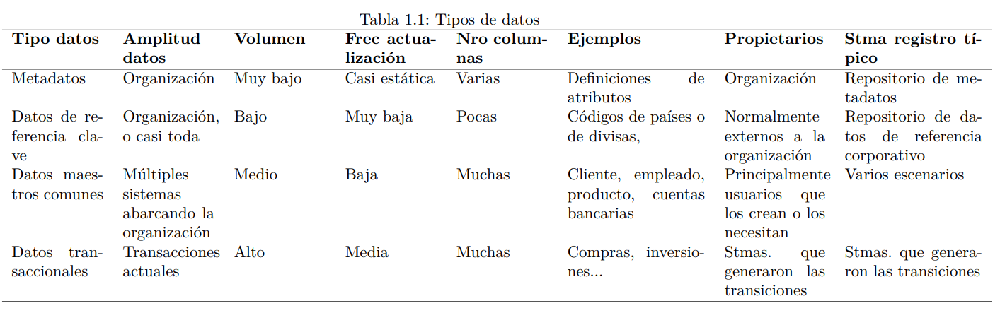

# (PART) Bienvenidos a la jungla de datos  {-}

# Gestión de bases de datos relacionales {#datos-sql}

*Ismael Caballero*$^{a}$, *Ricardo Pérez del Castillo*$^{a}$ y *Fernando Gualo*$^{a,b}$

$^{a}$Universidad de Castilla-La Mancha  
$^{b}$DQTeam SL


## Introducción 

\index{entidad} \index{atributo}
El mundo real en el que estamos inmersos es puramente analógico: está lleno de **entidades** que se relacionan entre ellas o consigo mismas a través de unos determinados eventos que representan determinados **hechos**. Tanto **entidades** como **hechos** tienen una colección de características observables (normalmente llamadas **atributos**[^SQL1] en el ámbito del diseño de bases de datos), que pueden ser de interés en el contexto de una determinada aplicación. 

[^SQL1]: Es importante resaltar que, en el ámbito de la Estadística, **atributo**  es una denominación reservada para las variables cualitativas.

Para estas aplicaciones que demandan el uso de datos del mundo real, es preciso realizar **observaciones** de esos **atributos** de las **entidades** y de los **hechos** que son relevantes. Al conjunto de entidades y hechos del mundo real que son relevantes para una aplicación se les conoce como **Universo del Discurso** [@Piattinietal2006]. Para poder tener éxito en las aplicaciones, es importante capturar la semántica del Universo del Discurso mediante los modelos correspondientes.

Los datos que son de interés para una determinada aplicación deben ser capturados mediante un **proceso de observación y digitalización** de los valores de los atributos relevantes de las entidades y hechos del mundo real. Durante el proceso de observación y captura se pueden producir errores que pueden derivar en problemas relacionados con la calidad de los datos [@price2004semiotic]. Por ejemplo, supóngase que las observaciones requieren una determinada frecuencia mínima de observación en relación con la velocidad en la producción de los hechos; si esta frecuencia no es adecuada, la cantidad de observaciones realizada será insuficiente para modelar el hecho, llevando a un estado inconsistente entre lo sucedido y lo observado.

Una vez capturados estos datos, pueden ser usados en los procesos de negocio para una tarea determinada, o bien ser analizados para producir un conocimiento del mundo real que hasta ahora no se tenía [@davenport2017competing].


## Concepto de base de datos

\index{base de datos}
Para poder habilitar el procesamiento o los  análisis de forma automática mediante las potentes técnicas tratadas en el resto de capítulos de este manual, es necesario almacenar previamente los datos en algún lugar como `repositorios` o `bases de datos`, donde los datos se puedan añadir, borrar, recuperar o modificar fácilmente. 

De acuerdo con @Piattinietal2006, una **base de datos (BD)** es una colección o depósito de datos integrados, almacenados en soporte secundario (no volátil) y con redundancia controlada. En una base de datos, los valores correspondientes a los atributos que han de ser compartidos por diferentes usuarios y aplicaciones deben mantenerse independientes de ellos, y su definición (estructura de la base de datos), única y almacenada junto con los datos, se ha de apoyar en un modelo de datos. Este modelo debe captar las interrelaciones y restricciones existentes en las entidades y hechos del mundo real al que representan. Existen diferentes tipos de modelos que permiten estructurar y representar la semántica de los datos, como, por ejemplo, el modelo relacional [@codd1970relational], que es el fundamento de las bases de datos relacionales en las que se centra este capítulo.

\index{sistema gestor de bases de datos} \index{sistema gestor de bases de datos!relacionales} \index{sistema gestor de bases de datos!NoSQL}
En el ámbito de los Sistemas de Información, se han desarrollado programas que dan soporte a todo el proceso de creación y explotación de las bases de datos. A estos programas se los conoce como **Sistemas Gestores de Bases de Datos (SGBD)**. Como ejemplos de estos SGBD se pueden citar Microsoft Access, Microsoft SQL Server, Oracle Server, MySQL, MariaDB, Informix, MongoDB... En cualquier caso, como se verá más adelante en este capítulo, los SGBD más utilizados son los conocidos como **relacionales (SGBDR)**, aunque, con el auge del *Big Data* y del *Machine Learning*, esta tendencia está cambiando y empiezan a desplegarse cada vez más SGBD conocidos como  _not only structured query language_, **NoSQL** (no solo lenguaje estructurado de consulta) (véase Cap. \@ref(cap-nosql)). Para evitar confusiones, es importante diferenciar entre la base de datos propiamente dicha (como una colección de datos almacenada en un fichero de datos) y el software SGBD específico, ya sea relacional o NoSQL: una misma base de datos, con las correspondientes adaptaciones, puede ser gestionada usando diferentes tipos de SGBD. Habitualmente, los tipos de SGBDR más usados son los que tienen capacidades multiproceso/multiusuario, ya que permiten acceder a datos compartidos mediante el uso de interfaces de datos para ejecutar diferentes tipos de análisis, empleando lenguajes de programación más potentes --o versátiles--, como **R** software o Python, que los lenguajes típicos de programación.


### Gestión de los datos en una base o repositorio de datos


Las organizaciones usan datos para sus procesos de negocio. La Tabla \@ref(tab:TablaTiposDatos) muestra la tipología de datos sugerida por @Mahanti2019.


<!-- Para compilar en HTML -->
<!-- tabla-html -->



\index{base de datos} \index{datos!repositorio}

\begin{sidewaystable}[]
\caption{\label{tab:TablaTiposDatos}Tipos de datos}
\begin{tabular}{p{2cm}p{2cm}p{2cm}p{2cm}p{2cm}p{3cm}p{2.2cm}p{3cm}}
\hline
\textbf{Tipo datos}    & \textbf{Amplitud datos}                 & \textbf{Volumen} & \textbf{Freccuencia de actualización} & \textbf{Número de columnas} & \textbf{Ejemplos}                                & \textbf{Propietarios}                                 & \textbf{Sistemas registro típico}              \\ \hline
Metadatos & Organización & Muy bajo & Casi estática & Varias & Definiciones de atributos & Organización & Repositorio de metadatos \\
Datos de referencia clave & Organización, o casi toda & Bajo & Muy baja & Pocas & Códigos de países o de divisas & Normalmente externos a la organización & Repositorio de datos de referencia corporativo \\
Datos maestros comunes & Múltiples sistemas abarcando la organización & Medio & Baja & Muchas & Cliente, empleado, producto, cuentas bancarias & Principalmente usuarios que los crean o los necesitan & Varios escenarios \\
Datos transaccionales & Transacciones actuales & Alto & Media & Muchas & Compras, inversiones... & Sistemas que generaron las transiciones & Sistemas que generaron las transiciones \\  \hline     
\end{tabular}
\end{sidewaystable}


Para poder usar estos datos, las aplicaciones pueden realizar los siguientes cuatro tipo de operaciones (normalmente conocidas como "operaciones CRUD"): \index{operaciones CRUD} 

1.    **Crear datos (*Create*)**: inserta datos en el repositorio de datos.
2.    **Leer datos (*Read*)**: recupera datos del repositorio para aprovisionar el proceso de negocio, o bien para realizar alguna operación de análisis específica.
3.    **Actualizar datos (*Update*)**: modifica el valor de los atributos correspondientes a los hechos o entidades para actualizarlos a nuevas observaciones.
4.    **Borrar datos (*Delete*)**: elimina en bloque o selectivamente los datos almacenados en el repositorio de los datos.

En cualquier caso, estos procedimientos de inserción, actualización, recuperación y borrado deben garantizar siempre la seguridad del conjunto de los datos, de modo que solo sean accesibles por aquellos usuarios que estén autorizados a trabajar con ellos, y siempre para el propósito establecido para los datos [@Piattinietal2006].
\index{SQL}
La forma de implementar estas operaciones depende fuertemente del formato (modelo lógico) en el que estén almacenados los datos. Aunque existen diferentes modelos (estructurados, semiestructurados, no estructurados), en este capítulo el énfasis se pone en el modelo relacional [@codd1970relational], ya que es el más ampliamente usado en el ámbito organizacional y el que implementan los SGBDR. Para poder dar soporte a las operaciones CRUD anteriormente citadas en bases de datos relacionales, se desarrolló un lenguaje llamado "lenguaje estructurado de consulta" (_structured query language_, **SQL**), que se aborda en la siguiente sección.

\index{base de datos!relacionales}

## SQL: el lenguaje estructurado de consulta 

Los principios de SQL están establecidos en el estándar internacional [ISO/IEC 9075:1989](https://www.iso.org/standard/16662.html)[^SQL2] como un mecanismo para identificar y regular las expresiones necesarias que permiten manejar bases de datos relacionales. Al ser un estándar, es importante señalar que cada fabricante de SGBDR, como Oracle con [Oracle Database Manager Server](https://www.oracle.com/database/)[^SQL4] o con [MySQL](https://www.mysql.com/products/enterprise/database/),[^SQL5] Microsoft con [SQL Server](https://www.microsoft.com/es-es/sql-server/),[^SQL6] IBM con [DB2](https://www.ibm.com/es-es/db2)[^SQL7]..., implementa en sus productos su propia versión del estándar SQL. Y aunque son prácticamente iguales, hay ligeros matices que les permiten diferenciarse de la competencia y que, por tanto, deben ser conocidos cuando se utilicen los correspondientes productos comerciales. No obstante, existen en el mercado algunas soluciones *open source* como [MariaDB](https://mariadb.org/)[^SQL8] o [PostgreSQL](https://www.postgresql.org/).[^SQL9] En este capítulo, todos los ejemplos que se han desarrollado trabajan contra un servidor [MySQL 8](https://www.mysql.com/products/).[^SQL10]

[^SQL2]: <https://www.iso.org/standard/16662.html>

[^SQL4]: <https://www.oracle.com/database/>

[^SQL5]: <https://www.mysql.com/products/enterprise/database/>

[^SQL6]: <https://www.microsoft.com/es-es/sql-server/>

[^SQL7]: <https://www.ibm.com/es-es/db2>

[^SQL8]: <https://mariadb.org/>

[^SQL9]: <https://www.postgresql.org/>

[^SQL10]: <https://www.mysql.com/products/>


\index{base de datos!SQL}

SQL tiene diferentes tipos de sentencias o instrucciones que dan soporte a los diferentes aspectos de las interacciones con la base de datos. Cualquier manual de SQL permite tratar en profundidad todos los elementos sintácticos del lenguaje, pero es importante señalar que los detalles específicos de la sintaxis específica dependerán fuertemente del SGBDR empleado. Para los ejemplos propuestos en este libro, puede consultarse el [manual de referencia de SQL de MySQL v8.0](https://dev.mysql.com/doc/refman/8.0/en/sql-statements.html).[^SQL11] Las siguientes secciones proporcionan una visión global de dichos grupos de sentencias.

[^SQL11]: <https://dev.mysql.com/doc/refman/8.0/en/sql-statements.html> 


### SQL como lenguaje de definición de datos

Una base de datos relacional tiene una organización en forma de tabla y su concepto fundamental es el de "relación", que no es el que el lector se puede imaginar a primera vista. Una "relación" representa un conjunto de entidades con las mismas propiedades y se compone de filas (o registros; también denominadas tuplas) cuyos valores dependen de los atributos que se representen en las columnas. Por ejemplo, una relación puede ser el conjunto de equipos de fútbol de la primera división española, siendo los atributos su presupuesto, nombre del entrenador, número de jugadores españoles... 

Las bases de datos relacionales se caracterizan por utilizar el lenguaje de consulta estructurado (SQL) y, por ello, son también denominadas bases de datos SQL. En particular, SQL se utiliza para definir todos los elementos necesarios para crear y modificar las tablas de datos. Se tienen tres tipos de instrucciones básicas para gestionar las tablas como estructuras de datos:

-   ***Create***: permite crear un componente de la base de datos, tal como la base de datos propiamente dicha, una tabla, una vista... En el siguiente ejemplo, se crea, usando instrucciones SQL, primero una base de datos llamada `Biblioteca`, y luego una tabla `Autor` con seis atributos (`CodAtutor`, `Nombre`, `Apellido1`, `Apellido2`, `Pseudonimo` y `Nacionalidad`), donde se podrán almacenar los valores correspondientes a dichos atributos, conformando así la base de datos:

 
 ```r
        create database Biblioteca
         create Table Autor (
           CodAutor nvarchar (20) primary key,
           Nombre    nvarchar(40) not null,
           Apellido1 nvarchar(50) not null,
           Apellido2 nvarchar(50), 
           Pseudonimo nvarchar(50),
           Nacionalidad nvarchar (50)
         );
 ```

-   ***Alter***: permite modificar la estructura de un componente, añadiendo, por ejemplo, atributos a una tabla, restricciones a un atributo o modificando el tipo de datos de algún atributo existente; también permite eliminar un atributo de una tabla existente. Siguiendo el ejemplo anterior, con la siguiente instrucción se añade un nuevo atributo, `LocalidadNacimiento`, a la tabla `Autor`:

 
 ```r
    alter table Autor add LocalidadNacimiento nvarchar(50) not null
 ```
-   ***Drop***: sirve para eliminar un componente específico, como una tabla, una vista... pero no sirve para eliminar los valores almacenados en una tabla. En el siguiente ejemplo, se eliminan las tablas `Escribe`, `Autor` y `Libro`: 

 
 ```r
    drop table Escribe;
    drop table Autor;
    drop table Libro;
 ```


### SQL como lenguaje de manipulación de datos

En esta sección se describen las instrucciones más importantes de SQL para el soporte a las operaciones CRUD anteriormente introducidas. Existen, por tanto, cuatro tipos de sentencia para manipular los datos:

-   ***Create***: implementada mediante la instrucción `insert`,  sirve para insertar registros (también llamados **tuplas**) en una base de datos. En los ejemplos siguientes se insertan diversas tuplas en varias tablas, siguiendo el mismo orden en el que se especificaron los atributos cuando se creó la tabla. Así, por ejemplo, se crean los códigos "dbrown" (como valor para el atributo `CodAutor`) para "Dan Brown" y "cdv" (como valor para el atributo `CodLibro`) para su libro "El Código da Vinci". El siguiente código SQL muestra las instrucciones necesarias:

 
 ```r
     insert into Autor values ('dbrown', 'Dan', 'Brown', '', '', 'EstadoUnidense');
     insert into Libro values ('cdv', 'El Código da Vinci', 'Random House', '2003-04-23');
     insert into Escribe values ('dbrown', 'cdv');
 ```
-   ***Read***: implementada mediante la instrucción `select`, permite hacer consultas a la base de datos. En los siguientes ejemplos se escribe el código que selecciona $(i)$ el nombre y primer apellido de los autores con nacionalidad española, ordenados por orden alfabético del `Apellido1` y $(ii)$ la lista todos los libros que haya escrito el autor "Pérez Reverte" (cuyo `CodAutor` es "perezreverte").

 
 ```r
    Select Nombre, Apellido1 from Autor where Nacionalidad like 'Español' order by Apellido1;
 
    Select Libro.Título from Autor, Escribe, Libro where ( Libro.CodLibro = Escribe.CodLibro and Autor.CodAutor = Escribe.CodAutor) and (Escribe.CodAutor ='perezreverte');
 ```
-   ***Update***: permite actualizar los valores de las tuplas seleccionadas. En el siguiente ejemplo, se actualiza el valor del atributo `pseudonimo` al valor "El Manco de Lepanto" para el autor "Miguel de Cervantes", con `CodAutor` "mcervantes":

 
 ```r
    update Autor set pseudonimo="El Manco de Lepanto" where CodAutor='mcervantes';
 ```
-   ***Delete***: su principal objetivo es eliminar, en bloque o de forma selectiva, una o varias tuplas o registros de datos que cumplan una determinada condición. En el siguiente código SQL se borra(n) la(s) tupla(s) que contiene(n) datos del autor cuyo `CodAutor` es "perezreverte".

 
 ```r
    delete from Autor where CodAutor ='perezreverte';
 ```
 
 
 
 
### SQL como lenguaje de administración de datos

SQL también puede usarse para administrar los usuarios de una base de datos. Esto implica crear usuarios de la base de datos y asignarles diferentes tipos de permisos para realizar los diferentes tipos de operaciones vistos anteriormente sobre los distintos componentes de datos. Por ejemplo, para crear un usuario llamado `Ismael.Caballero` que tenga por contraseña `LibroMDSR` se puede usar la siguiente instrucción:
 

```r
    create user 'Ismael.Caballero' identified by 'LibroMDSR';
```

y la siguiente instrucción se usa para asignar al usuario `Ismael.Caballero` los permisos necesarios para el acceso, lectura, selección, inserción, actualización y borrado de los valores de la base de datos `Biblioteca`, así como para poder modificar la estructura de los componentes de la base de datos `Biblioteca` creada anteriormente:

 
 ```r
    GRANT SELECT, INSERT, UPDATE, DELETE, CREATE, DROP, ALTER ON biblioteca.*  TO 'Ismael.Caballero'@'%'; 
    FLUSH PRIVILEGES;
 ```
Recuérdese que los ejemplos mostrados han sido realizados para MySQL 8, aunque la sintaxis no debería ser muy diferente para otros SGBDR.

## Acceso y explotación de bases de datos desde **R**
\index{RMySQL} \index{DBI}

Como el propósito de este manual es aprender los fundamentos de la ciencia de datos usando **R**, en las siguientes secciones se explicará cómo implementar las operaciones CRUD usando sentencias de paquetes específicos de **R**. Dado que en este capítulo se usa MySQL, se utiliza el  *driver* específico de `RMySQL` [@RMySQL2022]. En caso de que se hubiese usado otro sistema gestor de bases de datos, se habría tenido que recurrir al paquete específico que contuviera el *driver* correspondiente. En las siguientes secciones se explica cómo conectarse a una base de datos usando las funciones correspondientes y cómo se implementan las operaciones CRUD con funciones del paquete `RMySQL`.

### Conexión a una base de datos

Antes de poder realizar ninguna operación con las bases de datos gestionadas por MySQL es preciso tener instalado el paquete `RMySQL` y cargar los paquetes necesarios:


```r
install.packages("RMySQL")

library("RMySQL")
library(DBI)
```

Es necesaria también la librería `DBI` [@DBI2022] porque proporciona la infraestructura común para todos los _drivers_ de acceso a base de datos. Además del mencionado `RMySQL`, otros ejemplos de _drivers_ son `RPostgres` [@RPostgres2022], `RMariaDB` [@RMariaDB2022], `odbc` [@odbc2022] o `RSQLite`[@RSQLite2022], por citar algunos.

Para desarrollar las explicaciones, se usa una base de datos llamada `classicmodels`, implementada en MySQL v8.0 y desplegada en un servidor con dirección IP 172.20.48.118 que está escuchando en el puerto 3306. El usuario que se conecta a la base de datos es `Ismael.Caballero`, siendo su contraseña `MdsR.2022`. Otros usuarios tendrían que modificar los parámetros correspondientes para realizar  las conexiones a sus propias bases de datos. Se almacenan todos estos datos en variables para hacer más sencillo el mantenimiento de los scripts. Con `dbConnect()` se realiza la conexión. Con `summary()` o con `dbGetInfo()` se pueden mostrar los resultados de la conexión en caso de que esta se haya realizado con éxito.
Una vez terminadas todas las tareas con la base de datos, debería desconectarse mediante la instrucción `dbDisconnect()`. 


```r
usuario   =   'Ismael.Caballero' 
passwd    =   'MdsR.2022#'
nombrebd  =   'classicmodels'

servidor  =   '172.20.48.118' 
puerto    =   3306

mibbdd = dbConnect(MySQL(), user=usuario, password=passwd, dbname=nombrebd, 
                   host=servidor, port= puerto)
summary (mibbdd)
dbGetInfo(mibbdd)
dbDisconnect (mibdd)
```

### Operaciones de lectura / consulta/ selección (*read*) de datos

Entre las operaciones más frecuentes en cualquier tipo de bases de datos están las de lectura o consulta (*read*), implementadas en SQL con las sentencias de tipo `select`. El _driver_ `RMySQL` ofrece distintas alternativas para realizar consultas de selección en **R**. La elección de la mejor operación dependerá de la complejidad de las consultas que se quieran realizar. Se listan a continuación:

1.    `dbReadTable()`, que permite leer una tabla entera de una base de datos MySQL. Es recomendable usar este método si la tabla no es excesivamente grande. Se pueden almacenar los resultados en un `data.frame` para hacer operaciones con ellos después. La ventaja es que, sabiendo manejar `data.frames` en **R**, no se necesita aprender mucho más detalle del lenguaje [SQL](https://www.w3schools.com/sql/)[^SQL13] como lenguaje de manipulación de datos (LMD); sin embargo, la desventaja es que se acaba perdiendo parte del potencial expresivo de SQL para hacer algunas operaciones más fáciles y eficientes. En el siguiente ejemplo se muestra cómo cargar toda la tabla `customers` en un `data.frame` llamado `tblCustomers`, obteniéndose los resultados con la instrucción `summary()`:

[^SQL13]: <https://www.w3schools.com/sql/>


```r
tblCustomers <- dbReadTable(mibbdd, "customers")
summary (tblCustomers)
```

2.    `dbGetQuery()`, que tiene más flexibilidad que `dbReadTable()` porque permite, mediante una sentencia SQL `select` (véase más información en [el tutorial de SQL en W3C](https://www.w3schools.com/mysql/mysql_select.asp)[^SQL14] o en la página oficial de ["select" sobre MySQL](https://dev.mysql.com/doc/refman/5.7/en/select.html),[^SQL15]) particularizar la consulta a la base de datos. Esto puede implicar la selección de atributos específicos o incluso el uso de filtros sobre los atributos seleccionados. Por ejemplo, si se quisieran recuperar el número y el nombre de los clientes de Madrid, se podría personalizar la consulta añadiendo las condiciones correspondientes en la cláusula `where`,[^SQL16] como se muestra en siguiente código. Por comodidad, se escribe aparte la consulta SQL, en una variable, para poder manejar más fácilmente la operativa en **R**. Escribir esta consulta puede ser lo que entrañe más dificultad. A continuación, se ejecuta la consulta con `dbGetQuery()` y se almacenan los resultados en un `data.frame` para su uso posterior. Nuevamente, se comprueba el resultado con la instrucción `summary()`.

[^SQL14]: <https://www.w3schools.com/mysql/mysql_select.asp>

[^SQL15]: <https://dev.mysql.com/doc/refman/5.7/en/select.html>

[^SQL16]: <https://www.mysqltutorial.org/mysql-where/>. 


```r
SentenciaSQL_Nombres_Clientes ="Select CustomerNumber, CustomerName from customers where city = 'Madrid'"

Consulta_Clientes_Madrid = dbGetQuery (mibbdd, SentenciaSQL_Nombres_Clientes)
summary (Consulta_Clientes_Madrid)
```

Teniendo los resultados en `data.frames`, ya es posible procesarlos en **R** como si fuesen cualquier otro tipo de datos.

Obsérvese que las instrucciones siguientes serían equivalentes:

```r
dbReadTable(mibbdd,"customers") 
dbGetQuery (mibbdd, "select * from customers")
```

3.    `dbSendQuery()` combinado con `dbFetch()`. La principal diferencia entre `dbSendQuery()` y `dbGetQuery()` es que la primera no recupera datos de la base de datos y hay que traerlos explícitamente con la función `dbFetch()`. En el siguiente fragmento de código se muestra la utilización de ambas funciones con un resultado exactamente igual que en el apartado anterior.


```r
SentenciaSQL_Nombres_Clientes ="Select CustomerNumber, CustomerName from customers where city = 'Madrid'"

Consulta <- dbSendQuery(mibbdd, SentenciaSQL_Nombres_Clientes);
dbGetInfo(Consulta)
#> $statement
#> [1] "Select CustomerNumber, CustomerName from customers where city = 'Madrid'" 
#>
#> $isSelect
#> [1] 1
#>
#> $rowsAffected
#> [1] -1
#>
#> $rowCount
#> [1] 0
#>
#> $completed
#> [1] 0
#>
#> $fieldDescription
#> $fieldDescription[[1]]
#> NULL

print(paste("Consulta realizada:", dbGetStatement(Consulta)) )

Consulta_Clientes_Madrid_condbSendQuery <-  dbFetch(Consulta, n=-1)
print( paste("Número de elementos devueltos en la consulta",dbGetRowCount(Consulta)))

summary (Consulta_Clientes_Madrid_condbSendQuery)
```
    
    
<!-- En el ejemplo anterior se muestra cómo leer los datos de la tabla `customers` combinando   `dbSendQuery()` con `dbFetch()`. De forma análoga, la sentencia SQL es la misma pero la recuperación de los datos se lleva a cabo de forma diferente, con la función `dbSendQuery()` (el resultado se almacena en el `data.frame` `Consulta`). Con `dbFetch` se recuperan los resultados de las consulta desde la base de datos y se almacenan en la variable `Consulta_ClientesMadrid_condbSendQuery`. Con `dbGetInfo()` se muestran los metadatos de la consulta.   -->

En cualquier caso, para considerar la opción más adecuada deben tenerse en cuenta los siguientes aspectos:

  -   La información de la consulta generada con `dbSendQuery()` puede mostrarse con la función `dbGetInfo()`.
  
  -   Es posible recordar la consulta SQL que se utilizó en `dbSendQuery()` mediante la función `dbGetStatement()`.
    
  -   La función `dbFetch()` tiene dos argumentos: la consulta y el número de registros a recuperar; si se quieren recuperar todos los registros que haya podido producir la consulta, debe pasarse el argumento `n=-1`.
    
  -   Si se quiere saber el número de elementos que se han traído con la función `dbFetch()` se puede usar la función `dbGetRowCount()`.

  La principal ventaja de `dbSendQuery()` combinado con `dbFetch()` es que el filtro se hace en el sistema gestor de bases de datos y solo llegan a la memoria de **R** los datos que se van a utilizar, que es mejor que descargar toda la tabla a la memoria de **R** y, después, hacer el filtro.

  Para extraer información de los resultados de la consulta, se puede usar la función `dbColumnInfo()`:


```r
dbColumnInfo(Consulta)
#> name Sclass type length
#> 1 CustomerNumber integer INTEGER 11
#> 2 CustomerName character VAR_STRING 200
```
    
  
  El _driver_ `RMySQL` no proporciona funciones para conocer directamente el tipo y tamaño de los atributos de una tabla. Mediante la función `dbSendQuery()` y `dbColumnInfo()` se puede obtener esta información haciendo una consulta que incluya los atributos en los cuales se está interesado. Por ejemplo, para conocer el tipo de datos y tamaño de los atributos de la tabla `Employees` se podría usar el siguiente fragmento de código:


```r
SentenciaSQL_Tabla_Employees = "Select * from employees"
Consulta_Employees <- dbSendQuery(mibbdd,SentenciaSQL_Tabla_Employees)

dbColumnInfo(Consulta_Employees)

#> name Sclass type length
#> 1 employeeNumber integer INTEGER 11
#> 2 lastName character VAR_STRING 200
#> 3 firstName character VAR_STRING 200
#> 4 extension character VAR_STRING 40
#> 5 email character VAR_STRING 400
#> 6 officeCode character VAR_STRING 40
#> 7 reportsTo integer INTEGER 11
#> 8 jobTitle character VAR_STRING 200

dbClearResult(Consulta_Employees)
#> [1] TRUE
```

Con `dbColumnInfo()` se muestran los metadatos de implementación (operativos) de los atributos de la tabla `Employees`. Finalmente, con la instrucción `dbClearResult(ConsultaEmployees)` se pueden limpiar los resultados de la consulta para optimizar el sistema.

### Operaciones de inserción (*create*) y actualización (*update*) de datos

Antes de almacenar los datos en la base de datos, es necesario crear las estructuras necesarias, que, como se avanzó anteriormente, son las tablas y los atributos. Para ello se utilizan instrucciones especiales SQL como lenguaje de definición de datos (LDD); esto incluye instrucciones para crear tablas ([`create table`](https://dev.mysql.com/doc/refman/8.0/en/creating-tables.html)),[^SQL17] para modificarlas ([`alter table`](https://dev.mysql.com/doc/refman/8.0/en/alter-table.html))[^SQL18] o para borrarlas ([`drop table`](https://dev.mysql.com/doc/refman/8.0/en/drop-table.html)).[^SQL19]


[^SQL17]: <https://dev.mysql.com/doc/refman/8.0/en/creating-tables.html>
[^SQL18]: <https://dev.mysql.com/doc/refman/8.0/en/alter-table.html>
[^SQL19]: <https://dev.mysql.com/doc/refman/8.0/en/drop-table.html> 

Para poder hacer operaciones con los datos, es preciso crear usuarios y asignarles los privilegios adecuados sobre las tablas y atributos. Ello también requiere las instrucciones especiales SQL como lenguaje de administración de datos (LAD), que incluye instrucciones para crear usuarios ([`create user`](https://dev.mysql.com/doc/refman/8.0/en/create-user.html)),[^SQL20] modificar ciertos aspectos de los mismos ([`alter user`](https://dev.mysql.com/doc/refman/8.0/en/alter-user.html))[^SQL21] y borrarlos ([`drop user`](https://dev.mysql.com/doc/refman/5.6/en/drop-user.html)).[^SQL22]

[^SQL20]: <https://dev.mysql.com/doc/refman/8.0/en/create-user.html>
[^SQL21]: <https://dev.mysql.com/doc/refman/8.0/en/alter-user.html>
[^SQL22]: <https://dev.mysql.com/doc/refman/5.6/en/drop-user.html>

Un usuario de la base de datos que tenga privilegios suficientes sobre las estructuras creadas puede crear ([`insert`](https://dev.mysql.com/doc/refman/8.0/en/insert.html))[^SQL23] o modificar ([`update`](https://dev.mysql.com/doc/refman/8.0/en/update.html))[^SQL24] registros de datos usando las instrucciones específicas de SQL como lenguaje de manipulación de datos (LMD) [(véase cómo otorgar privilegios a un usuario para crear tablas)](https://dev.mysql.com/doc/refman/5.7/en/grant-tables.html).[^SQL25]

[^SQL23]: <https://dev.mysql.com/doc/refman/8.0/en/insert.html>
[^SQL24]: <https://dev.mysql.com/doc/refman/8.0/en/update.html>
[^SQL25]: <https://dev.mysql.com/doc/refman/5.7/en/grant-tables.html>

No obstante, y dado que el software en el que se centra este manual es en **R**, se deja fuera del alcance de este capítulo el uso de los aspectos LDD, LMD y LAD de SQL, y se cubrirán mediante la instrucciones `dbWriteTable()` de `RMySQL` los aspectos de inserción y de actualización de los registros. `dbWriteTable()` se usa, por tanto, para exportar datos de **R** a una base de datos MySQL, y puede ser usado para las acciones que se exponen a continuación, siempre y cuando el usuario que ejecute las acciones tenga suficientes permisos en el sistema gestor de bases de datos para realizarlas. 

#### Crear una nueva tabla con datos
La creación de una nueva tabla de datos se lleva a cabo a partir de un `data.frame` que se puebla con datos iniciales y que tendrá tantas columnas como atributos tenga la tabla. Por ejemplo, a continuación se crea un `data.frame` llamado `dfDatos_Prueba` con dos columnas, una de tipo numérico llamada `CodPrueba` y otra de tipo texto llamada `DatosPrueba`. En este ejemplo, y a modo ilustrativo, los datos son completamente arbitrarios. Después, se construye el `data.frame` `dfDatos_Pruebas` y mediante `dbListTables()` se comprueba que la tabla no existe en la conexión a la base de datos. Finalmente, con `dbWriteTable()`, se crea la nueva tabla. Es importante tener en cuenta las posibles conexiones simultáneas a la base de datos porque se podrían generar problemas. Con `dbWriteTable()` se puede comprobar si la tabla se ha creado correctamente.


```r
CodPrueba <- c(1:26)
Nombre_Prueba <- c(letters[1:26])
dfDatos_Prueba <- data.frame(CodPrueba, Nombre_Prueba)
dbListTables(mibbdd)
#> [1] "Autor" "DatosPrueba_16" "DatosPrueba_22" "Datos_Prueba_01",
#> [5] "Make" "Pelicula" "customers" "employees",
#> [9] "offices" "orderdetails" "orders""payments",
#> [13] "productlines" "products"

dbWriteTable(mibbdd, "DatosPrueba", dfDatos_Prueba, overwrite = TRUE, row.names =FALSE )
#> [1] TRUE
#> 
dbListTables(mibbdd)
#> [1] "Autor" "DatosPrueba" "DatosPrueba_16" "DatosPrueba_22",
#> [5] "Datos_Prueba_01" "Make" "Pelicula" "customers" ,
#> [9] "employees" "offices" "orderdetails","orders" ,
#> [13] "payments" "productlines" "products"
```
Es interesante pensar en la utilidad de este método para duplicar tablas en caso necesario.


#### Sobreescribir una tabla existente con datos actualizados

Cuando se trata de actualizar algunos valores de los atributos de la tabla o de añadir nuevos registros a la tabla, la operación es básicamente la misma que antes, pero primeramente habrá que leer la tabla y convertirla en un `data.frame` para actualizar en él los valores o añadir los nuevos valores (en este caso se añade una nueva fila); una vez hecho esto, se vuelve a utilizar el comando `dbWriteTable()` añadiendo los parámetros `overwrite = TRUE` (para sobrescribir toda la tabla) y `row.names = FALSE`. En el siguiente ejemplo se actualizan los valores de una tupla específica.


```r
dfDatos_Prueba <- dbReadTable(mibbdd, "DatosPrueba")

dfDatos_Prueba$NombrePrueba[25] <- "en un lugar de la mancha"

dbWriteTable(mibbdd, "DatosPrueba", dfDatos_Prueba, overwrite = TRUE, 
             row.names =FALSE  )
#> [1] TRUE

dfDatos_Prueba_Modificado <- dbReadTable(mibbdd, "DatosPrueba")
```
#### Añadir nuevos registros a una tabla
Existen dos estrategias para añadir registros a una tabla. La primera es utilizar la técnica de sobreescritura descrita anteriormente. Para ello, se procede como antes: se carga la tabla en un 
`data.frame` (en este caso `dfDatos_Prueba`), se añaden nuevas filas (registros) al `data.frame` (cargadas previamente en el `data.frame` `dfNuevoRegistro`) usando `rbind()`, y a continuación se sobreescribe la tabla usando `dbWriteTable()`. En el siguiente fragmento de código se muestra cómo añadir nuevos registros a una tabla sobreescribiéndola completamente.


```r
dfDatos_Prueba <- dbReadTable(mibbdd, "DatosPrueba")

dfNuevo_Registro <- as.list(dfDatos_Prueba)

dfNuevo_Registro$CodPrueba <- c(27)
dfNuevo_Registro$NombrePrueba <- c("Un Valor Nuevo")

dfDatos_Prueba <- rbind (dfDatos_Prueba, dfNuevo_Registro)

dbWriteTable(mibbdd, "DatosPrueba", dfDatos_Prueba, overwrite = TRUE, row.names =FALSE)
#> [1] TRUE
```
La opción anterior puede ser interesante si la tabla no tiene muchos registros y el coste computacional no es muy grande. Pero si se tienen muchos registros es preferible usar otra estrategia para añadir un nuevo registro a la tabla. En este caso, se puede hacer creando un `data.frame` compatible con la estructura de la tabla, y ejecutar la instrucción `dbWriteTable()` poniendo el parámetro `append = TRUE`. Esto añadirá el nuevo registro al final de la tabla. El siguiente fragmento de código muestra cómo realizar esta operación.

```r
dfDatos_Prueba_Nuevos <- as.list(dfDatos_Prueba)

dfDatos_Prueba_Nuevos$CodPrueba <- 28
dfDatos_Prueba_Nuevos$NombrePrueba <- "Otro valor nuevo"

dfDatos_Prueba_Nuevos <- data.frame (dfDatos_Prueba_Nuevos)

dbWriteTable(mibbdd, "DatosPrueba", dfDatos_Prueba_Nuevos, append = TRUE, row.names =FALSE)
#> [1] TRUE
```


#### Inserción con consulta SQL usando la instrucción `dbSendQuery()`

Una última forma de insertar valores en una tabla es mediante la instrucción `dbSendQuery`, utilizando una consulta de inserción `insert`. En el siguiente ejemplo se muestra cómo insertar tuplas o registros mediante `dbSendQuery()`; en este caso, se añaden datos completamente arbitrarios a modo de ejemplo.


```r
SentenciaSQL_Insercion ="insert into DatosPrueba value (29, 'Una tercera forma')"
 
dbSendQuery (mibbdd, SentenciaSQL_Insercion)
#> <MySQLResult:-365007472,0,23>
```


### Operaciones de borrado de datos (*delete*)

Finalmente, se describen las operaciones de borrado. Análogamente a como se hacían las operaciones de inserción, se puede proceder de dos formas:

1. **Borrado de valores usando `dbWriteTable()` con sobreescritura**: esto implica extraer todos los datos de la tabla, borrar el registro o los registros correspondientes y sobreescribir nuevamente la tabla en la base de datos mediante la instrucción `dbWriteTable()` con la opción `overwrite = TRUE`; para ver el resultado se puede usar la función `summary()`. El siguiente fragmento de código muestra cómo hacerlo:


```r
dfDatos_Prueba <- dbReadTable(mibbdd, "DatosPrueba")
dfDatos_Prueba <- dfDatos_Prueba[dfDatos_Prueba$CodPrueba < 25, ]

dbWriteTable(mibbdd, "DatosPrueba", dfDatos_Prueba, overwrite = TRUE, row.names =FALSE)
#> [1] TRUE
```

2. **Borrado de registros con consulta SQL en `dbSendQuery()`**: se puede llevar a cabo utilizando una sentencia SQL de borrado [`delete`](https://dev.mysql.com/doc/refman/8.0/en/delete.html)[^SQL26] con la instrucción `dbSendQuery()` para borrar registros de la base de datos. El siguiente fragmento de código muestra cómo hacerlo:

[^SQL26]: <https://dev.mysql.com/doc/refman/8.0/en/delete.html>


```r
# Se usa una sentencia SQL de borrado. El criterio de borrado es completamente arbitrario a efectos ilustrativos.
SentenciaSQL_Eliminación ="delete from DatosPrueba where CodPrueba > 10"
dbSendQuery (mibbdd, SentenciaSQL_Eliminación)
#> <MySQLResult:1,0,30>
```
Finalmente, si fuera necesario eliminar toda la tabla, se podría usar una sentencia [drop table](https://dev.mysql.com/doc/refman/8.0/en/drop-table.html):[^SQL27]

[^SQL27]: <https://dev.mysql.com/doc/refman/8.0/en/drop-table.html>


```r
dbSendQuery(mibbdd, "drop table DatosPrueba")
#> <MySQLResult:0,0,31>
dbDisconnect(mibbdd)
#> [1] TRUE
```


::: {.infobox_resume data-latex=""}
### Resumen {-}

En este capítulo se han presentado los fundamentos de las bases de datos relacionales. Es importante tener presentes los siguientes aspectos:

-   Los datos en las bases de datos se corresponden a valores de atributos relevantes de entidades del mundo real.

-   Los datos de una base de datos son una percepción u observación del mundo real.

-   Los datos son la materia prima de los procesos de negocio.

-   Los sistemas de información dan soporte a los procesos de negocio.

-   Los datos son un elemento fundamental de los sistemas de información.

-   SQL  es el lenguaje más comúnmente utilizado en operaciones sobre el modelo físico de bases de datos relacionales.

-   SQL se puede utilizar como Lenguaje de Definición de Datos (LDD), como Lenguaje de Manipulación de Datos (LMD) y como Lenguaje de Administración de Datos (LAD).

-   La sintaxis de SQL depende fuertemente del sistema gestor de bases de datos relacionales que lo implemente.

-   **R** software, a través del _driver_ específico, permite manejar bases de datos implementando las operaciones CRUD.
:::
