# Análisis exploratorio de datos {#cap-120006-aed}

*Emilio L. Cano*

Universidad Rey Juan Carlos

## Introducción

\index{análisis!exploratorio de datos}
\index{visualización}


El análisis exploratorio de datos (AED), y en particular su visualización,
es el primer análisis que se debe hacer sobre cualquier conjunto de datos.
El AED se realiza mediante dos herramientas: los resúmenes numéricos 
y las visualizaciones gráficas.
La "historia" que nos esté contando el gráfico de los datos nos guiará
hacia las técnicas de aprendizaje estadístico más adecuadas. Incluso,
en muchas ocasiones será suficiente el AED para tomar
una decisión sobre el problema en estudio. 


### El cuarteto de Anscombe
\index{cuarteto de Anscombe}

Un ejemplo clásico de la importancia del **AED** y, concretamente, de las representaciones gráficas es el "cuarteto de Anscombe" [@Anscombe1973],
el cual está compuesto por 11 filas de 8 variables numéricas que conforman 4 conjuntos de datos (disponibles en el objeto `anscombe`), con los mismos resúmenes estadísticos pero con propiedades muy distintas, lo que se ve fácilmente cuando se representan en forma gráfica. Si se calculan, por ejemplo, la media y la desviación típica de cada variable, se observa que son prácticamente iguales. Incluso los coeficientes de correlación de cada $X$ con su $Y$ son también prácticamente idénticos.


```r
library("dplyr")
anscombe |> summarise(across(.fns = mean))
#>  x1 x2 x3 x4       y1     y2     y3     y4
#>  9  9  9  9    7.5009  7.5009  7.5   7.5009
anscombe |> summarise(across(.fns = sd))
#>    x1    x2       x3       x4     y1      y2    y3      y4
#> 3.316  3.316   3.316   3.316   2.031   2.031   2.030   2.030
```

Sin embargo, la Fig. \@ref(fig:ch-120006-anscombeuni) muestra que, a pesar de tener medias y desviaciones típicas prácticamente iguales, los datos son muy diferentes.

<div class="figure" style="text-align: center">
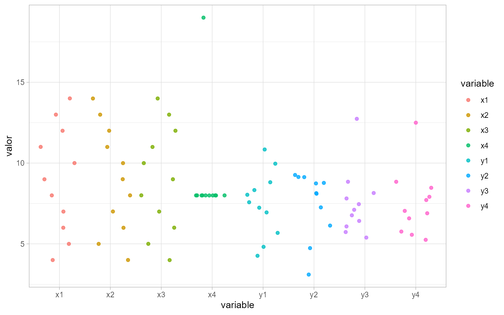
<p class="caption">(\#fig:ch-120006-anscombeuni)Representación de las variables del cuarteto de Anscombe.</p>
</div>


Si en el análisis por separado ya se ve la necesidad de hacer un gráfico,
esta es más evidente cuando se analizan las variables conjuntamente. La
Fig. \@ref(fig:ch-120006-anscombelm) muestra los cuatro gráficos que constituyen
"el cuarteto de Anscombe" y que se puede obtener de la propia ayuda del
conjunto de datos (`example(anscombe)`). La línea de regresión que se ajusta
es prácticamente la misma, y los coeficientes de correlación entre las variables *X* e *Y* de los cuatro gráficos, idénticos: 0,8163. 
Es evidente que la relación entre las variables es muy distinta en cada uno
de los casos, y si no se visualizan los datos para elegir el mejor modelo
de regresión y después interpretarlo, se pueden tomar decisiones
erróneas. El cuarteto de Anscombe es muy ilustrativo, al igual que  _The Datasaurus Dozen_ [@Matejka2017] en https://www.autodeskresearch.com/publications/samestats.


<div class="figure" style="text-align: center">
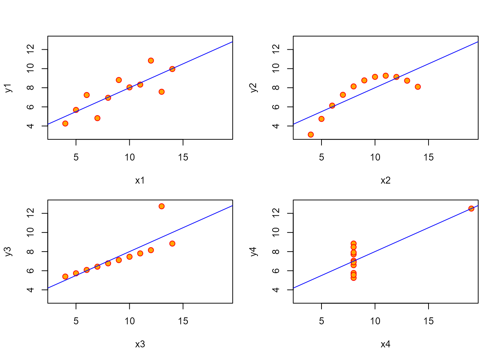
<p class="caption">(\#fig:ch-120006-anscombelm)Los cuatro gráficos que constituyen el cuarteto de Anscombe junto con un ajuste lineal.</p>
</div>


### Conceptos generales
\index{población}\index{muestra}\index{estadística!descriptiva}
\index{estadística!descriptiva}
\index{inferencia!estadística}

Muy brevemente, se presenta una serie de conceptos esenciales para la mejor 
comprensión de este manual.[^nota-bib-ed] Los datos que se analizan
provienen de una determinada **población**, y no son más que
una **muestra**, es decir, un subconjunto de toda la población. 
La **Estadística Descriptiva** se ocupa del AED en sentido amplio, que se aplica 
sobre los datos concretos de la muestra. La
**Inferencia Estadística** (véase Cap. \@ref(Fundainfer)) hace referencia a los métodos mediante los cuales, a través de los datos muestrales, se toman decisiones, se analizan relaciones o se hacen predicciones sobre la población. Para ello, se hace uso de la **Probabilidad** aplicando el modelo adecuado (véase Cap. \@ref(Funda-probab)). Además, es muy importante considerar el método de obtención de la muestra (véase Cap. \@ref(muestreo)) que, en términos generales, debe ser representativa de la población para que las conclusiones sean válidas.
La Fig. \@ref(fig:ch-120006-dogma1) representa la esencia de la Estadística y sus métodos.

[^nota-bib-ed]: Para un análisis extenso de los conceptos aquí expuestos puede consultarse, por ejemplo, @lorenzo2007estadistica. 

<div class="figure" style="text-align: center">
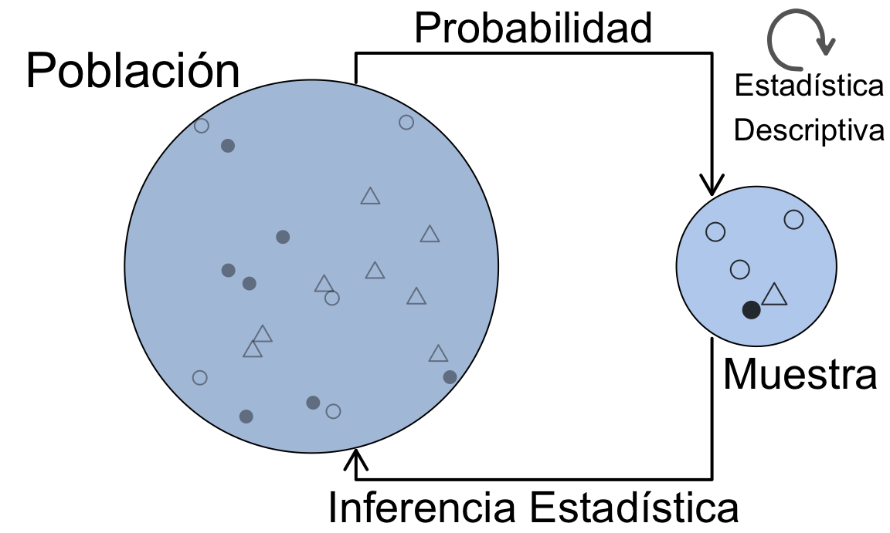
<p class="caption">(\#fig:ch-120006-dogma1)La esencia de los métodos estadísticos.</p>
</div>


Las características a observar en los elementos de una población pueden dar lugar a diferentes tipos de datos o variables. El análisis a realizar dependerá del tipo de variable, que puede ser:

1. **Cuantitativa** (se puede medir o contar). Se denomina **variable cuantitativa** a cualquier característica observable que pueda expresarse en valores numéricos. Se clasifican como **variables discretas** (se puede _contar_ el número de valores que toma) y **continuas** (pueden tomar cualquier valor en un intervalo dado). \index{variable!cuantitativa}
    
2. **Cualitativa** (no se puede expresar como un número). Se denomina **variable cualitativa, atributo o factor** a cualquier característica observable que indica una *cualidad* o *atributo*. Estas pueden tener varios niveles (politómicas) o solo dos (dicotómicas). Si en una variable categórica se pueden *ordenar* las categorías, entonces se denomina **variables ordinales**.
\index{variable!cualitativa}

### Componentes de un gráfico y su representación en **R**
\index{grafico\@{gráfico}}

De los diferentes sistemas que tiene **R** para representar gráficos [los "base", paquete `graphics`, y los "grid", paquete `lattice` @lattice],
este capítulo se centra en el paquete `ggplot2` [@Wickham2016], que forma parte del _tidyverse_, por su amplio uso y popularidad.

El flujo de trabajo con `ggplot2` se puede resumir en los siguientes pasos:

1. Proporcionar una **tabla de datos** a la función `ggplot`. Es el primer argumento (`data`) y 
se puede utilizar el operador _pipe_.

2. Proporcionar las **columnas** de la tabla de datos que serán representadas en el gráfico. 
Este será el segundo argumento (`mapping`) de la función  `ggplot`, y se 
especifica con la función `aes` (_aesthetics_)
como una lista de pares _aesthetic = variable_, de forma que el elemento especificado
como _aesthetic_ será "mapeado" a los valores de la variable. Esta especificación 
se puede hacer también en las funciones que añaden capas, que se explican a continuación.
Los _aesthetics_ más comunes (para muchos tipos de gráficos obligatorios) son `x` e `y`,
es decir, las columnas que se usarán para el eje horizontal y el eje vertical respectivamente.
Además, se pueden especificar columnas para el color, el tamaño, el símbolo de los puntos,
el tipo de línea, el texto, y otros específicos del tipo de gráfico. Los _aesthetics_ se
pueden especificar también de forma "fija" (sin depender de ninguna variable) fuera de
la función `aes`.

3. Añadir las **capas** del gráfico con los _geoms_, es decir, los objetos geométricos que representan a cada variable. Esto se indica con el operador `+ `, como si se "sumasen" componentes al gráfico mediante funciones `geom_xxx`.

4. Añadir otras capas al gráfico: por ejemplo, una capa de etiquetas del gráfico
(función `labs`); de ejes, para modificar los ejes y leyendas creados por defecto
(funciones `scale_*_xxx`); de estadísticos, para crear nuevas variables a representar basadas en los datos (funciones  `stat_xxx`).

5. Añadir un tema al gráfico: por ejemplo, en blanco y negro, o con especificaciones
concretas, como el posicionamiento de la leyenda.

6. Añadir "facetas" (_facets_). De esta forma se divide el gráfico en varios subgráficos
basándose en los valores de una o más variables discretas (normalmente categóricas).

En las secciones que siguen se verán ejemplos de todo el proceso. El siguiente es un ejemplo de una expresión que contiene los elementos anteriores. Se anima al lector a que los identifique con dicha lista:


```r
ggplot(data, aes(x = variable)) + geom_histogram() + 
  labs(title = "Título") + theme_bw() + facet_wrap(~factor)
```


## Análisis exploratorio de una variable {#sec-120006-aeduni}

### Variables cualitativas
\index{variable!cualitativa}\index{factor}\index{atributo}

El resumen numérico de variables cualitativas se muestra en la tabla de frecuencias,
la cual se puede representar con un gráfico de barras o con un gráfico
de sectores.[^sectores] Las frecuencias absolutas son el número de observaciones en cada categoría y las frecuencias relativas son la proporción de observaciones en cada categoría con respecto al total. Por ejemplo, el conjunto de datos `accidentes2020_data`
disponible en el paquete `CDR` describe los datos de accidentes de tráfico 
con víctimas y/o daños al patrimonio en la ciudad de Madrid registrados por la Policía Municipal. Entre sus variables, contiene la variable cualitativa de tipología del accidente `tipo_accidente`. Un resumen puede obtenerse tanto con la función `table()` 
como con el paquete `dplyr`, como se vio en la Sec. \@ref(sec-110003-tidyverse). 
En variables cualitativas, la categoría más frecuente se denomina **moda** de la variable.[^nota-orden]

[^sectores]: El gráfico de sectores no es recomendable, ya que proporciona la misma 
información que el gráfico de barras y para el ojo
humano es mucho más difícil distinguir ángulos que alturas.

[^nota-orden]: Nótese que el orden por defecto que utiliza **R** es el alfabético. Se puede cambiar este comportamiento reordenando los niveles del factor; por ejemplo, para poner "Otro" en la última posición.

\index{tabla!de frecuencias}


```r
library("CDR")
library("dplyr")
accidentes2020_data |>
  count(tipo_accidente) |>
  mutate(porc = 100 * n / sum(n))
#>                  tipo_accidente    n       porc
#>  1:                      Alcance 7294 22.4936010
#>  2:           Atropello a animal   75  0.2312887
#>  3:          Atropello a persona 2127  6.5593487
#>  4:                        Caída 2118  6.5315940
#>  5: Choque contra obstáculo fijo 4667 14.3923274
#>  6:             Colisión frontal  899  2.7723810
#>  7:      Colisión fronto-lateral 8081 24.9205909
#>  8:             Colisión lateral 4386 13.5257656
#>  9:            Colisión múltiple 2231  6.8800691
#> 10:                Despeñamiento    2  0.0061677
#> 11:                         Otro  251  0.7740463
#> 12:        Solo salida de la vía  151  0.4656613
#> 13:                       Vuelco  145  0.4471582
```

Para representar el gráfico de barras con la  función `ggplot()`, se añade la capa de geometría con la función `geom_bar()` (véase Fig. \@ref(fig:ch-120006-geombar)).

```r
library("ggplot2")
library("CDR")
accidentes2020_data |>
  ggplot() +
  geom_bar(aes(y=tipo_accidente), fill = "pink")
```

<div class="figure" style="text-align: center">
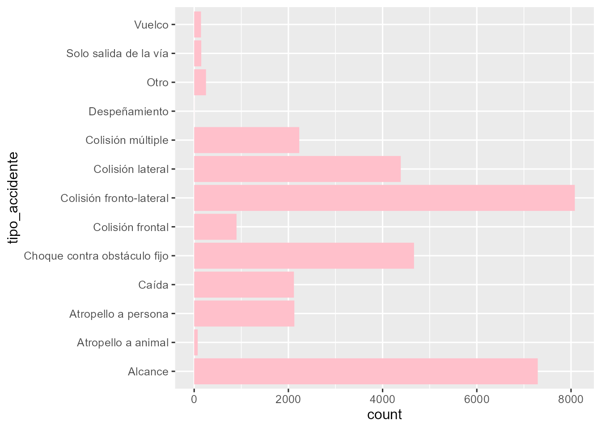
<p class="caption">(\#fig:ch-120006-geombar)Gráfico de barras con ggplot2.</p>
</div>

\index{grafico\@{gráfico}!de barras}


::: {.infobox data-latex=""}
**Nota**

El código anterior es la forma más básica de hacer un gráfico con `ggplot2`.
Opciones más avanzadas pueden encontrarse en @wickham2016r. 
:::

Ya se ha comentado que los gráficos de sectores no se recomiendan a menos que se incluya en ellos información numérica. El paquete `ggstatsplot` realiza gráficos que incluyen análisis estadísticos. Por ejemplo, la función `ggpiestats()` proporciona un gráfico de sectores con algunos tests estadísticos (véase la ayuda de la función) y podría utilizarse para determinar en qué medida un conjunto de 80 ayuntamientos de distinto signo político presta o no un determinado servicio `serv` (véase el conjunto de datos en el paquete del libro `?CDR::ayuntam`). El siguiente código produce el gráfico de la Fig. \@ref(fig:ch-120006-ggs). 


```r
library("ggstatsplot")
ayuntam |>
  ggpiestats(x = serv)
```

<div class="figure" style="text-align: center">

<p class="caption">(\#fig:ch-120006-ggs)Gráfico de sectores con tests. Prestación o no de un determinado servicio X en ayuntamientos de distinto signo político.</p>
</div>


Una alternativa a los gráficos de sectores son los _waffle charts_ (gráficos de gofre o de tableta de chocolate). La siguiente expresión produce de la Fig. \@ref(fig:ch-120006-gofre) usando el paquete `waffle`. Con el argumento `use_glyph` se pueden incluir iconos en vez de cuadrados.


```r
library("waffle")
freq <- ayuntam |> 
  count(serv)
m <- setNames(freq$n, freq$serv)

waffle(m, rows = 4, colors = c("red", "green"))
```

<div class="figure" style="text-align: center">
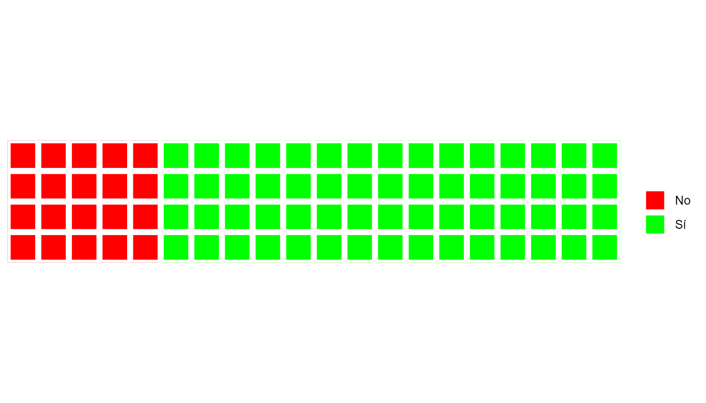
<p class="caption">(\#fig:ch-120006-gofre)Gráfico waffle. Prestación o no de un determinado servicio $X$ en 80 ayuntamientos de distinto signo político.</p>
</div>


### Variables cuantitativas
\index{variable!cuantitativa} \index{variable!continua} \index{variable!discreta}

Los estadísticos descriptivos más importantes que se utilizan en un AED 
se dividen en tres grandes grupos: 

- **Medidas de posición**, que su vez se dividen en (i) centrales: media (`mean()`), mediana (`median()`) y moda y (ii) no centrales: cuantiles `quantile()`, mínimo (`min()`) y máximo (`max()`). 
\index{media}\index{mediana}\index{moda}\index{minimo@mínimo}\index{maximo@máximo}

- **Medidas de dispersión**. Las más importantes son: varianza (`var()`), desviación típica (`sd()`), rango intercuartílico (`IQR()`), desviación absoluta mediana (`mad()`) y coeficiente de variación (`sd(x)/mean(x)`).
\index{varianza}\index{desviación!típica}\index{rango!intercuartílico}\index{desviación!absoluta mediana}\index{coeficiente!de variación}

- **Medidas de forma**: asimetría (_skewness_) y apuntamiento (_kurtosis_).
\index{coeficiente!de asimetría}\index{coeficiente!de apuntamiento}\index{kurtosis}\index{asimetría}

La función `summary()` de **R** base es una función de las llamadas "genéricas"
y solo aborda las medidas de posición.


```r
summary(renta_municipio_data$`2019`)
#>    Min. 1st Qu.  Median    Mean 3rd Qu.    Max.    NA's 
#>    4053    9914   11595   12247   13690   32183    5697
```

Sin embargo, los estadísticos descriptivos suelen presentarse juntos "describiendo" el conjunto de datos. Existen distintos paquetes, como `summarytools`, que proporcionan un resumen completo de un vector numérico con la función `descr()`, así como de un conjunto de datos completo (ver opciones del paquete).


```r
library("summarytools")
renta_municipio_data |>
  select(`2019`) |>
  descr()

#>Descriptive Statistics  
#>2019  
#>N: 55273  
#>                        2019
#>----------------- ----------
#>             Mean   12246.84
#>          Std.Dev    3562.94
#>              Min    4053.00
#>               Q1    9914.00
#>           Median   11595.00
#>               Q3   13690.50
#>              Max   32183.00
#>              MAD    2742.81
#>              IQR    3776.25
#>               CV       0.29
#>         Skewness       1.82
#>      SE.Skewness       0.01
#>         Kurtosis       5.77
#>          N.Valid   49576.00
#>        Pct.Valid      89.69
```


A continuación se proporciona una breve definición de las anteriores medidas y su fórmula matemática, como referencia general y por su uso en otras partes del libro. En las fórmulas siguientes, $x_i$ representa cada valor de la variable en la muestra y $n$ es el número de observaciones en dicha muestra. 

* Media (_Mean_), $\overline{x}$: es el centro de gravedad de los datos, en torno al cual varían.

$$\bar{x}= \frac{\sum\limits_{i=1}^n x_i}{n}.$$

* Desviación típica (_std. dev_), $s$: es la raíz cuadrada de la varianza, $s^2$. Representa la variación promedio alrededor de la media, en las unidades de la variable y en sus unidades al cuadrado, respectivamente. La siguiente fórmula corresponde a la varianza muestral, dividiendo por $n-1$. Para la varianza poblacional, se dividiría por el tamaño de la población $N$. Para calcular la desviación típica, bastaría con hacer la raíz cuadrada.

$$s^2= \frac{\sum\limits_{i=1}^n (x_i- \bar{x})^2}{n-1}.$$


* El mínimo (_Min_) y el máximo (_Max_) son los extremos de los datos.

* La mediana (_Median_) es el segundo cuartil $Q_2$. Es el punto central de los datos, dejando la mitad de las observaciones por abajo y la otra mitad por arriba. Los cuartiles $Q_1$ y $Q_3$ dividen los datos dejando por debajo de su valor el 25% y el 75%, respectivamente.

* La desviación absoluta mediana (MAD,  por sus siglas en inglés) es la mediana de las desviaciones a la mediana.

* El rango intercuartílico es la diferencia entre el tercer y el primer cuartil. Es decir, el rango del 50% de las observaciones centrales:

$$IQR = Q_3-Q_1.$$

* El coeficiente de variación es el cociente entre la desviación típica y la media (en valor absoluto). Es una medida de variabilidad relativa muy útil para comparar la variabilidad de distintas muestras o poblaciones.

$$CV = \frac{s}{|\overline{x}|}.$$

* Coeficiente de asimetría (_Skewness_). En variables simétricas es nulo. Si es mayor de cero, los datos presentan asimetría positiva (una cola a la derecha, en los valores altos con respecto a la media) y si es menor de cero, los
datos presentan asimetría negativa (una cola a la izquierda, en valores bajos con respecto a la media).

$$g_1 = \frac{\frac{1}{n}\sum\limits_{i=1}^n(x_i-\bar x ) ^3}{s^3}.$$

* Coeficiente de apuntamiento (_Kurtosis_). Si los datos presentan un apuntamiento similar al de la distribución normal, será próximo a cero. Cuanto más grande, más apuntado, y cuanto más pequeño, más aplanado.

$$g_2 = \frac{\frac{1}{n}\sum\limits_{i=1}^n(x_i-\bar x ) ^4}{s^4}-3.$$

Los otros tres valores que aparecen en la salida de la función `descr()` son el error típico del coeficiente de asimetría (_SE. Skewness_), el número total de valores válidos (_N. Valid_) y el porcentaje respecto al total de datos (_Pct. Valid_). El complementario de este último, por tanto, es el porcentaje de valores perdidos (_missing_). 

\index{histograma}

La representación gráfica de la tabla de frecuencias de una variable cuantitativa
es el **histograma**.[^nota-hist-disc]
Para representarlo, se cuenta el número de observaciones (frecuencia) por intervalo (_bin_). Una posible regla sería el método de Sturges,[^nota-sturges] que se puede hallar con la función `nclass.Sturges()`. 

[^nota-hist-disc]: En el caso de las variables discretas con un número de posibles valores pequeños, 
es mejor proceder igual que si fuera una variable cualitativa, obteniendo una tabla de frecuencias y un gráfico de barras, con la diferencia de que el orden de los posibles valores será el numérico.

[^nota-sturges]: Este es el método que utiliza por defecto la función `hist`
de **R** base, que además redondea la amplitud del intervalo para facilitar la
interpretación. Otra regla muy sencilla es tomar como número de intervalos
en torno a la raíz cuadrada del número total de datos. 

\index{tabla!de frecuencias}

Para obtener la tabla de frecuencias de la renta neta per cápita en 2019
usando el número de intervalos con la regla de Sturges se procede como sigue:


```r
renta_municipio_data |>
  mutate(clases_sturges_renta = cut(`2019`,
    breaks = nclass.Sturges(`2019`)
  )) |>
  count(clases_sturges_renta)
```


Sin embargo, esta regla no siempre es la más apropiada,
como se verá en la Sec. \@ref(no-mentir), 
pues debe estudiarse bien la naturaleza de la variable a analizar. 


El histograma proporciona mucha información sobre la variable: ($i$) si es aproximadamente simétrica, ($ii$) si tiene forma de campana (se parece a la distribución normal), ($iii$) si hay valores extremos y cómo son de frecuentes,
y ($iv$) si puede haber mezcla de poblaciones (más de una moda).

La función `geom_histogram()` del paquete `ggplot2` añade una capa con un
histograma al gráfico. El color de las barras se controla con el _aesthetics_ `fill` y la altura puede representar las frecuencias absolutas (recuentos) o 
relativas (proporciones). El número de intervalos se indica con el argumento
`bins`, o alternativamente, la anchura de intervalo con `bin_width`, véase la Fig. \@ref(fig:ch-120006-plot-hist-bins).


```r
p <- renta_municipio_data |>
  drop_na() |>
  ggplot(aes(`2019`))

h1 <- p + geom_histogram(color = "yellow", fill = "pink")
h2 <- p + geom_histogram(
  color = "yellow", fill = "pink",
  bins = nclass.Sturges(renta_municipio_data$`2019`)
)
h3 <- p + geom_histogram(color = "yellow", fill = "pink", bins = 20)

library("patchwork")
h1 + h2 + h3
```

<div class="figure" style="text-align: center">
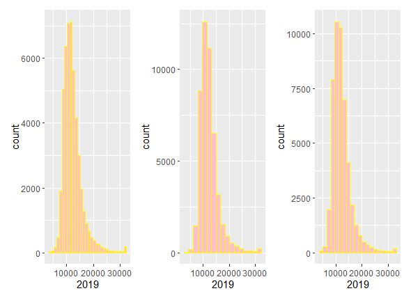
<p class="caption">(\#fig:ch-120006-plot-hist-bins)Histogramas de la renta neta per cápita en 2019 con distintos $bins$. Izquierda: $bins$ por defecto (n = 30); Centro: $bins$ con la regla de Strurges; Derecha: $bins$ = 20.</p>
</div>

\index{grafico\@{gráfico}!de densidad}

Una representación alternativa al histograma es la línea de densidad, que sustituye
las barras por una línea continua, generalmente suavizada. A continuación, se añade 
la línea de densidad a uno de los histogramas de la Fig. \@ref(fig:ch-120006-plot-hist-bins) y el 
resultado se puede ver en la Fig. \@ref(fig:ch-120006-hist-density).


```r
p <- renta_municipio_data |>
  tidyr::drop_na() |>
  ggplot(aes(`2019`))
p + geom_histogram(aes(y = after_stat(density)), 
                   position = "identity", 
                   color = "yellow", fill = "pink") +
  geom_density(lwd = 1, colour = 4)
```

<div class="figure" style="text-align: center">
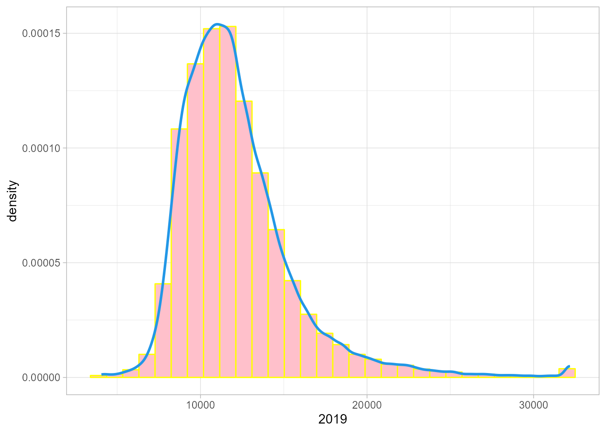
<p class="caption">(\#fig:ch-120006-hist-density)Histograma y línea de densidad de la renta neta per cápita española en 2019.</p>
</div>


\index{grafico\@{gráfico}!de cajas} \index{grafico\@{gráfico}!de violín}

Otras representaciones gráficas muy útiles de las variables continuas son el 
gráfico de **caja y bigotes** y el **diagrama de violín**, que se obtienen fácilmente combinando en `ggplot()` las capas `geom_boxplot()` y `geom_violin()`, respectivamente (véase Fig.  \@ref(fig:ch-120006-plot-boxplot-violin)).


```r
p <- renta_municipio_data |>
  tidyr::drop_na() |>
  ggplot(aes(x=0, y= `2019`)) 
boxplot <- p + geom_boxplot(color = "yellow", fill = "pink")
violin <- p + geom_violin(aes(), color = "yellow", fill = "pink")
boxplot + violin
```

<div class="figure" style="text-align: center">

<p class="caption">(\#fig:ch-120006-plot-boxplot-violin)Diagrama de caja y bigotes y diagrama de violín de la renta neta per cápita en 2019.</p>
</div>


Otra visualización básica para una variable numérica es la visualización
secuencial de las observaciones, bien a través de puntos (`geom_point()`) o a través de líneas (`geom_line()`). El orden de las observaciones puede indicar cuándo se ha producido un cambio u otros patrones.


## Análisis exploratorio de varias variables {#sec-120006-aedmulti}
\index{tabla!de contingencia}

En la Sec. \@ref(sec-120006-aeduni) se ha realizado un AED de
variables aisladas, pero lo usual es incluir las relaciones entre variables 
en el AED. 
Las herramientas estadísticas utilizadas son: ($i$) las tablas de frecuencias conjuntas, que, en el caso de dos atributos, son tablas de doble entrada, 
con un atributo en filas y el otro en columnas, para determinar si existe asociación entre dichos atributos, como se verá en el Cap. \@ref(tablas-contingencia); 
($ii$) los resúmenes numéricos, como la covarianza, el coeficiente de correlación, coeficientes de asociación, etc. y ($iii$) los gráficos en los que se puede representar más de una variable. 


### Variables cualitativas

El resumen numérico sigue siendo la tabla
de frecuencias, en este caso conjuntas para las distintas combinaciones de los niveles
de las variables. Este tipo de tablas se denomina **tablas de contingencia** (véase Cap. \@ref(tablas-contingencia)). Para dos atributos, se puede representar en
forma de tabla de doble entrada. 

El resultado de la función `table()` se puede utilizar dentro de las funciones `prop.table()` y `addmargins()` para obtener las frecuencias relativas, añadir los totales marginales, o ambas cosas. Para el ejemplo de la prestación de un servicio *X* o no por parte de 80 ayuntamientos, `table()` podría utilizarse para dar respuesta a la siguiente pregunta: ¿La prestación pública del servicio *X* es independiente del signo político del ayuntamiento o depende de dicho signo?


```r
table(ayuntam$signo_gob , ayuntam$serv)
#>             
#>              No Sí
#>   Avanzados  14 28
#>   Ilustrados  6 32
```

No obstante, la representación gráfica más habitual sigue siendo los gráficos de barras, como se muestra en la Fig. \@ref(fig:ch-120006-barras-ayunt) producida con el siguiente código: 


```r
p <- ayuntam |>
  ggplot(aes(signo_gob, fill = serv))

frecuencias <- p + geom_bar() 
proporciones <- p + geom_bar(position = position_fill())

frecuencias + proporciones
```

<div class="figure" style="text-align: center">
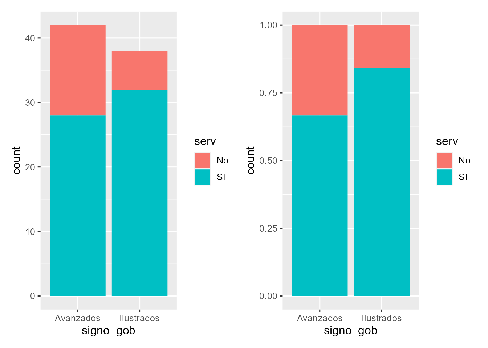
<p class="caption">(\#fig:ch-120006-barras-ayunt)Gráfico de barras de la prestación pública del servicio $X$ por parte de 80 ayuntamientos de distinto signo político. Izquierda: frecuencias absolutas. Derecha: frecuencias relativas.</p>
</div>

Una visualización interesante de tablas de doble entrada son los gráficos en los que
se representan las frecuencias conjuntas por medio de puntos cuya área es proporcional a la frecuencia. La Fig. \@ref(fig:ch-120006-balloonplot-eda-ayunt) muestra gráficamente la tabla de frecuencias conjunta de los atributos `signo_gob` y `serv` del conjunto de datos `ayuntam`. 


```r
library("gplots")
balloonplot(table(ayuntam$signo_gob , ayuntam$serv))
```

<div class="figure" style="text-align: center">
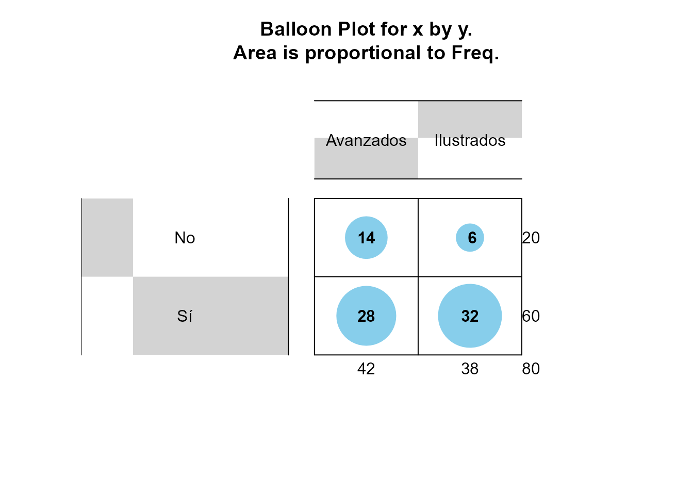
<p class="caption">(\#fig:ch-120006-balloonplot-eda-ayunt)Representación gráfica de tabla de frecuencias.</p>
</div>


Para representar dos o más factores a la vez en un único gráfico, se dispone de los gráficos de mosaico con la función `mosaicplot()` de **R** base, o bien el paquete
`ggmosaic`, que incluye una función `geom_mosaic()` para usar en gráficos `ggplot2`. El siguiente ejemplo produce el gráfico de la Fig. \@ref(fig:ch-120006-mosaico-accidentes):


```r
library("ggmosaic")
accidentes2020_data |>
ggplot() +
  geom_mosaic(aes(x = product(tipo_accidente, sexo), 
                  fill=sexo)) 
```

<div class="figure" style="text-align: center">
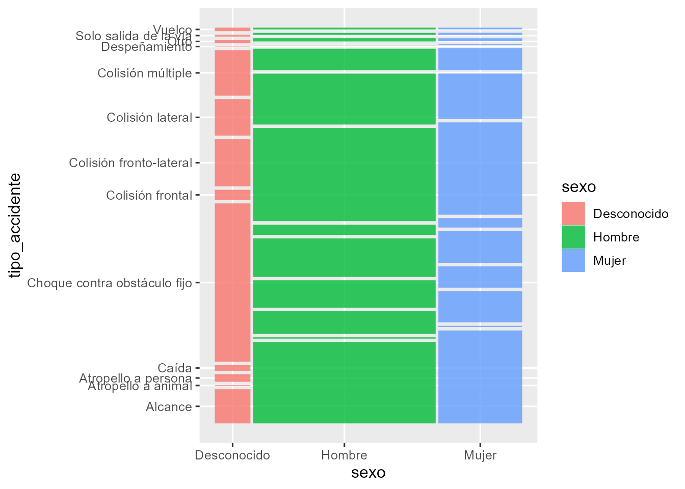
<p class="caption">(\#fig:ch-120006-mosaico-accidentes)Gráfico de mosaico para relacionar el tipo de accidente y el sexo en los datos de accidentes.</p>
</div>

\index{facetas}

En cualquier caso, se pueden representar más variables creando "subgráficos" o
facetas (_facets_). Basta con añadir una capa al gráfico `ggplot2`
con la función `facet_wrap()` y el argumento `facets` una lista de variables 
(categóricas o discretas) para cuyos valores se quiere hacer un gráfico
distinto. Con el siguiente código[^nota-facet] se construye un gráfico para cada nivel del factor
`tipo_accidente`. Cada uno de estos gráficos es una "faceta" del gráfico, que se 
muestra en la Fig. \@ref(fig:ch-120006-acc-3vbles).

[^nota-facet]: Una sintaxis alternativa para especificar las facetas en la función `facet_wrap()` sería la siguiente: `facet_wrap(~tipo_accidente)`.


```r
niveles <- levels(factor(accidentes2020_data$tipo_accidente))
etiquetas <- set_names(str_wrap(niveles, width = 20), 
                       niveles)
accidentes2020_data  |>
  ggplot(aes(sexo, fill = estado_meteorológico)) +
  facet_wrap(vars(tipo_accidente), 
             labeller = as_labeller(etiquetas)) +
  geom_bar() +
  labs(fill = "Estado Meteorológico") +
  theme(axis.text.x  = element_text(angle = 90))
```

<div class="figure" style="text-align: center">
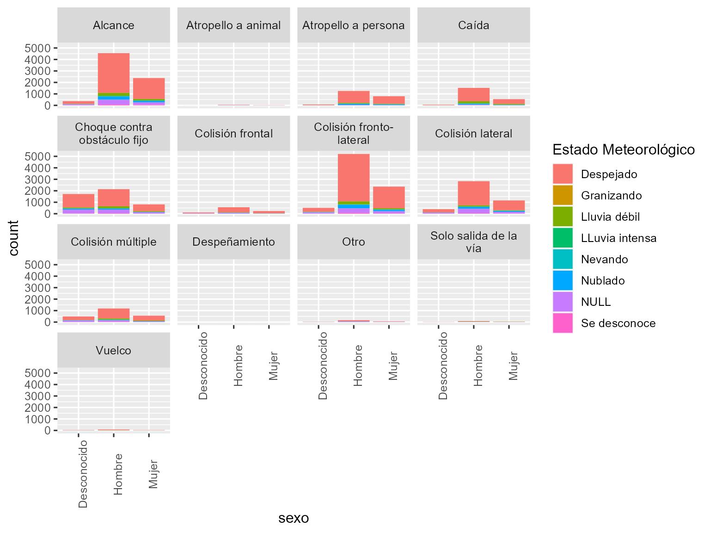
<p class="caption">(\#fig:ch-120006-acc-3vbles)Representación de tres atributos mediante gráficos de barras conjuntos y facetas.</p>
</div>


### Variables cuantitativas

\index{covarianza}\index{coeficiente!de correlación}\index{correlación}
\index{matriz! de varianzas-covarianzas}\index{matriz! de correlaciones}

La descripción conjunta de variables numéricas se
puede resumir con el vector de medias (medias de cada variable) y la
matriz de varianzas-covarianzas. La covarianza $s_{xy}$ (función `var()`) es una medida 
del grado de dependencia lineal entre dos variables numéricas.
Si la covarianza es cero, no hay relación lineal (pero podría
haber otro tipo de relación, recuérdese el cuarteto de Anscombe).
Pero la covarianza es una medida que depende de la escala
de las variables, por lo que es más fácil interpretar el coeficiente de correlación lineal $r_{xy}$ (función `cor()`), que está acotado entre $-1$ y 1. Cuanto más se acerque a 1, en valor absoluto,
más fuerte será la dependencia lineal. Las fórmulas para calcular ambos estadísticos son 
las siguientes:

$$s_{xy} = \frac{1}{n-1} \sum\limits_{i=1}^n(x_i-\bar x)(y_i-\bar y),$$

$$r_{xy}=\frac{s_{xy}}{s_x \cdot s_y}.$$

Además, la matriz de correlación suele ser un punto de partida
en las técnicas de reducción de la dimensionalidad (véanse los Cap. \@ref(acp), \@ref(af) y \@ref(mds)). Si, por ejemplo, se desea 
calcular la matriz de correlaciones del conjunto de datos `TIC2021`,
que presenta las estadísticas de uso de las TIC en la Unión Europea en 2021,
se puede utilizar el paquete `corrplot`, que proporciona una forma elegante y versátil de representarla (véase la Fig. \@ref(fig:ch-120006-correlacion)).[^nota-corrplot] 

[^nota-corrplot]: Una gran cantidad de ejemplos puede verse ejecutando `example(corrplot)`. 


```r
library("corrplot")
mcor_tic <- cor(TIC2021)  
corrplot.mixed(mcor_tic, order = 'AOE')
```

<div class="figure" style="text-align: center">

<p class="caption">(\#fig:ch-120006-correlacion)Representación gráfica de la matriz de correlaciones entre las variables del conjunto de datos TIC2021.</p>
</div>


La matriz de correlaciones se puede representar mediante "mapas de calor"
(_heatmap_), es decir, un cuadrado que representa las filas y columnas de 
la matriz de correlaciones (variables) y donde el color de las celdas es
una gradación que depende del valor de las mismas. Un mapa de calor de la matriz de correlaciones guardada anteriormente, `mcor_tic`,
puede obtenerse con la expresión `heatmap(mcor_tic)`.

\index{grafico\@{gráfico}!de dispersión}

En cuanto a los resúmenes gráficos, el **diagrama de dispersión** es el gráfico más popular. La función `geom_point()` de `ggplot2` añade una capa con los puntos (x, y), que ya nos da una idea de la relación entre las variables, y permite interpretarla
conjuntamente con el coeficiente de correlación. Se puede añadir una línea de regresión, incluida una banda de confianza, por diversos métodos (función `geom_smooth()` por defecto, una curva _loess_ o _gam_ dependiendo del número de filas).
Alternativamente a los puntos como objeto geométrico, se pueden representar líneas (`geom_line()`).


Por ejemplo, antes de llevar a cabo un ajuste lineal, o de otro tipo, con los datos `airquality`, tal y como se hará en los Cap. \@ref(cap-lm) a \@ref(cap-sparse), se podría hacer un AED 
previo entre las variables `Ozone` y `Temp` con el gráfico de la Fig. \@ref(fig:ch-120006-scatter-ozono).


```r
airquality |>
  #select(Ozone,Temp) |>
  ggplot(aes( x= Temp, y=Ozone)) +
  geom_point() +
  geom_smooth()
```

<div class="figure" style="text-align: center">
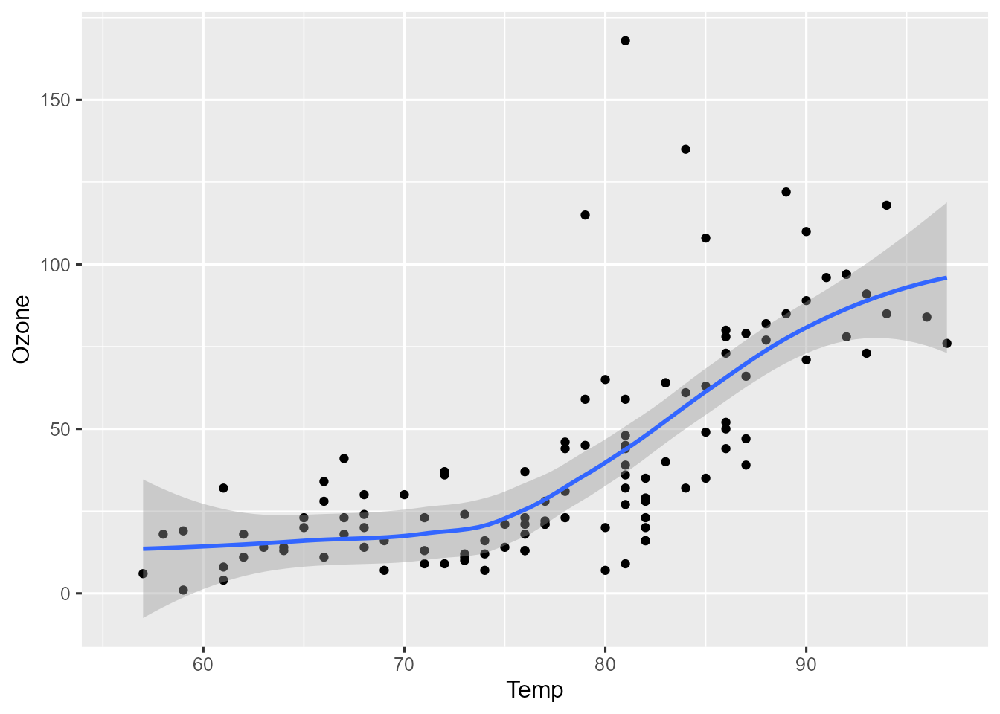
<p class="caption">(\#fig:ch-120006-scatter-ozono)Gráfico de dispersión del ozono frente a la temperatura.</p>
</div>

\index{serie temporal}

Un caso particular es cuando la variable explicativa es el tiempo. En este caso, se tiene una serie temporal, y la representación con líneas es más adecuada (véase la Fig. \@ref(fig:ch-120006-nox-time)).


```r
library("dplyr")
contam_mad |>  
  filter(nom_abv == "NOx") |> 
  group_by(fecha, nom_mag) |>
  summarise(media_estaciones = mean(daily_mean, na.rm = TRUE))|>
  ggplot(aes(x = fecha, y = media_estaciones)) +
  geom_line(aes(color = nom_mag)) +
  geom_smooth(linewidth = 0.5, color = "black", se = TRUE) +
  theme(legend.position = "none") 
```

<div class="figure" style="text-align: center">
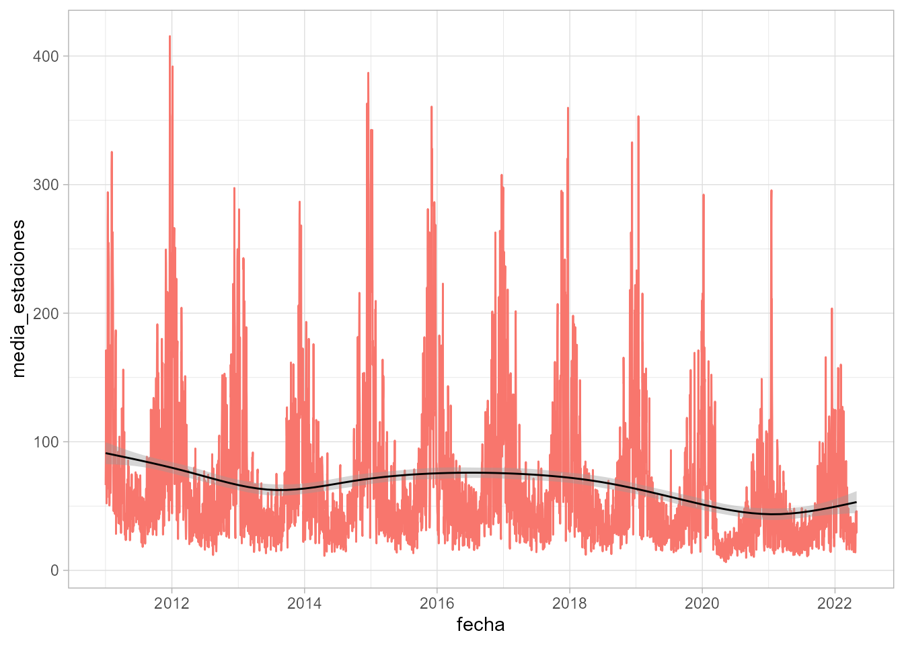
<p class="caption">(\#fig:ch-120006-nox-time)Concentración media semanal de NOx en las estaciones de medición de Madrid (enero 2011 - marzo 2022).</p>
</div>


### Variables cualitativas y cuantitativas

Cuando se trabaja en un proyecto de ciencia de datos, lo normal es tener tanto variables cualitativas como cuantitativas. 
Para representar conjuntamente ambos tipos de variables 
existen múltiples posibilidades, algunas
de las cuales se enumeran a continuación, con el tipo
de gráfico adecuado:

- Una variable numérica y una variable categórica: gráficos de cajas o de violín
para cada nivel de la categórica (Fig. \@ref(fig:ch-120006-plot-violin-zonas)), o bien gráficos de densidad para cada categoría (Fig. \@ref(fig:ch-120006-plot-ridges-tipos)).


```r
contam_mad |>  
  na.omit() |>  
  filter(nom_abv == "PM10") |> 
  filter(between(fecha, left = as.Date("2022-03-10"), right = as.Date("2022-03-20"))) |>
  ggplot(aes(zona, daily_mean)) +
  geom_violin() +
  geom_jitter(height = 0, width = 0.01) +
  aes(x = zona, y = daily_mean, fill =zona)
```

<div class="figure" style="text-align: center">
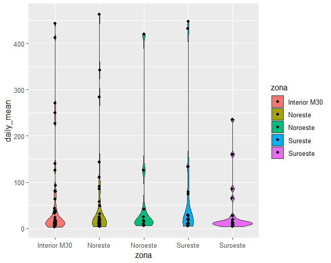
<p class="caption">(\#fig:ch-120006-plot-violin-zonas)Comparación de los niveles de PM10 en las zonas de la ciudad de Madrid a efectos de calidad del aire durante la calima de marzo de 2022.</p>
</div>


```r
library("ggridges")
contam_mad |>
  filter(nom_abv == "NOx") |>
  ggplot(aes(x = daily_mean, y = tipo, fill = tipo)) +
  geom_density_ridges() 
```

<div class="figure" style="text-align: center">
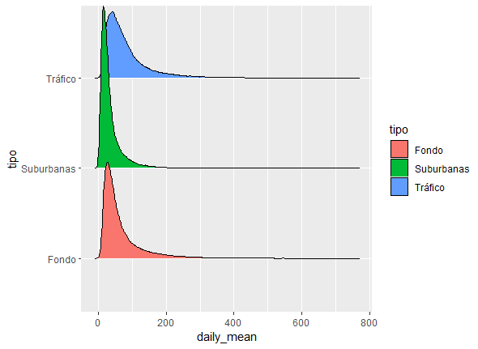
<p class="caption">(\#fig:ch-120006-plot-ridges-tipos)Comparación de concentraciones de NOx por tipo de estación de medición.</p>
</div>


- Dos variables numéricas y varias variables categóricas: gráfico de dispersión
para las numéricas y mapeado del color, tamaño y símbolo por cada nivel de las categóricas, 
como en la Fig. \@ref(fig:plot-dispersion-conjunta-alarma).


```r
pm10_nox_mad <- contam_mad |>
  na.omit() |>
  filter(nom_abv %in% c("PM10", "NOx")) |>
  # período del estado de alarma
  filter(between(fecha,left=as.Date("2020-03-14"), right=as.Date("2020-06-30"))) |> 
  select(estaciones, zona, tipo, nom_abv, daily_mean, fecha) |>
  pivot_wider(names_from = "nom_abv", values_from = "daily_mean", values_fn = mean)
```


```r
pm10_nox_mad |>
ggplot(
  aes(x = PM10, y = NOx, colour = tipo, size = zona )) +
geom_point()
```


<div class="figure" style="text-align: center">
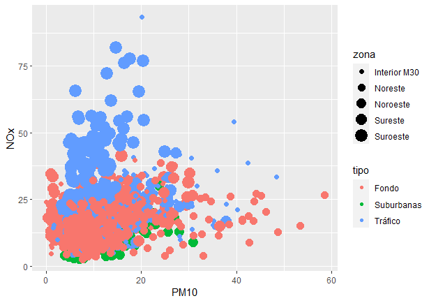
<p class="caption">(\#fig:plot-dispersion-conjunta-alarma)Gráfico de dipersión de las variables 'NOx', 'PM10', 'zona' y 'tipo' (de emplazamiento) durante el estado de alarma en la ciudad de Madrid (todas las estaciones de medición).</p>
</div>


- Más de dos variables numéricas y más de una categórica: gráfico de dispersión
y mapeado de las otras variables a otros _aesthetics_. Combinación de geometrías
y _aesthetics_. Por ejemplo, añadir puntos con efecto _jitter_ a un gráfico de cajas.


En todos los casos anteriores se pueden crear "facetas" para hacer un gráfico
por cada combinación de variables categóricas, de forma que se tenga un buen número de
variables representadas en un mismo "lienzo", como en la Fig. \@ref(fig:ch-120006-plot-dispersion-ms-conjunta-alarma).


```r
pm10_nox_mad |>
  drop_na() |>
  ggplot(aes(y=NOx, x= PM10, colour = tipo, shape = zona)) +
  geom_point() +
  geom_smooth() +
  facet_wrap(vars(estaciones)) 
```


<div class="figure" style="text-align: center">

<p class="caption">(\#fig:ch-120006-plot-dispersion-ms-conjunta-alarma)Gráfico de dipersión de las variables 'NOx', 'PM10', 'zona' y 'tipo' (de emplazamiento) por estación de medición durante el estado de alarma en la ciudad de Madrid.</p>
</div>


::: {.infobox_resume data-latex=""}

### Resumen {-}

_Análisis exploratorio de una variable_

- El análisis exploratorio es una tarea fundamental antes de abordar cualquier otra técnica estadística.

- Las variables cualitativas se resumen con tablas de frecuencias y gráficos de barras.

- Las variables cuantitativas discretas se pueden resumir también con tablas de frecuencias y gráficos de barras, pero si hay muchos valores distintos también pueden ser apropiados los histogramas.

- Las variables cuantitativas continuas se pueden resumir con tablas de frecuencias por intervalos, medidas de posición y de dispersión, histogramas y gráficos de cajas.

- Los gráficos de caja sirven, además, para identificar valores atípicos.


_Análisis exploratorio de varias variables_

- Las variables cualitativas se pueden resumir con tablas de frecuencias conjuntas y su 
representación gráfica y con combinaciones de gráficos de barras. 

- La principal medida conjunta de dos variables cuantitativas es el coeficiente de correlación. Más de dos variables se suelen representar en forma de matriz.

- El gráfico de dispersión es la representación básica para dos variables cuantitativas. Se pueden representar estos gráficos por pares en forma de matriz de gráficos.

- Para añadir más variables, se pueden "mapear" variables a _aesthetics_ (tamaño, color, etc.), añadiendo más objetos geométricos, o bien añadiendo "facetas" (subgráficos) para cada variable o para cada posible valor de una variable cualitativa.
:::
