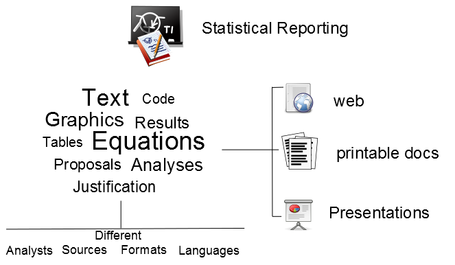
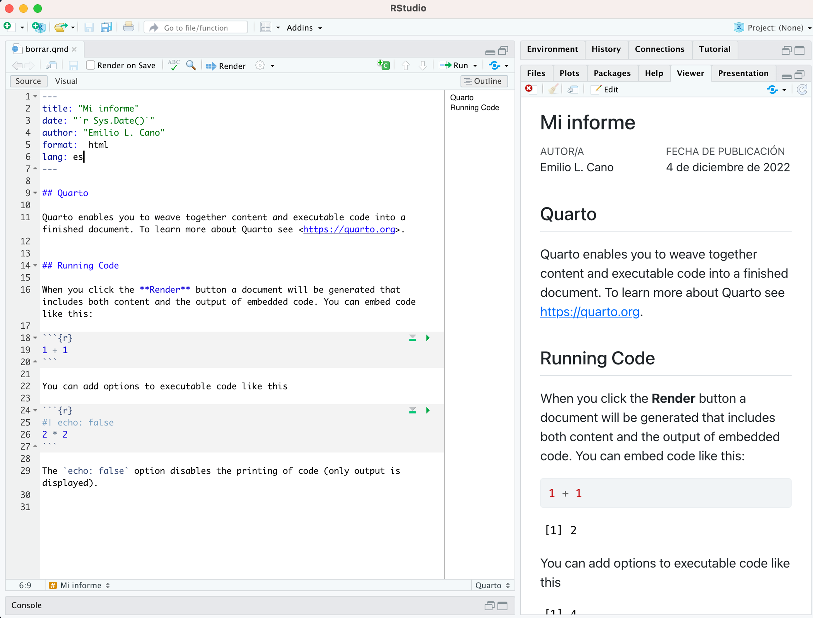
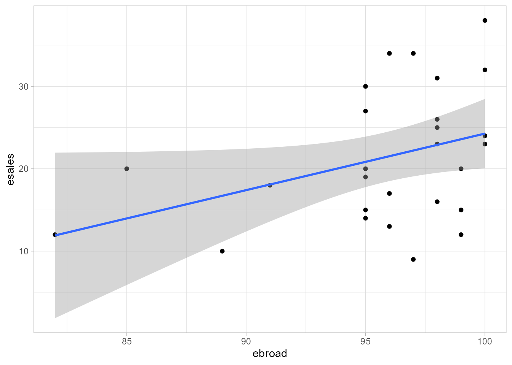

# (PART) Comunica y colabora  {.unnumbered}

# Informes reproducibles con R Markdown y Quarto {#cap-120007-informes}
 

*Emilio L. Cano*

Universidad Rey Juan Carlos

## ¿Por qué informes reproducibles?

\index{reproducibilidad}
\index{informes}\index{Markdown}
\index{Quarto}\index{R Markdown}
\index{informes!reproducibles}

El resultado final de un proyecto de análisis de datos termina
comunicándose a distintos niveles, tanto "aguas arriba" como "aguas abajo". 
Esta comunicación es "la última milla" del flujo de análisis que se
esquematiza en la Fig. \@ref(fig:problem2). Se llama genéricamente 
**informe** a cualquiera de estos resultados que se pueden producir en 
distintos formatos de destino. Estos informes estarán compuestos de múltiples elementos como
texto, gráficos, resultados numéricos, tablas, etc. Además, es posible que haya
que generarlos en distintos formatos (por ejemplo, HTML o PDF, entre otros) para diferentes destinos, como la web, documentos imprimibles o
presentaciones. Finalmente, como es muy probable que intervengan varias personas en el proceso, la **trazabilidad** (reproducibilidad) del análisis
mejorará el proyecto de forma global. 

<div class="figure" style="text-align: center">

<p class="caption">(\#fig:problem2)Esquema del proceso de información de análisis de datos.</p>
</div>

La forma típica de abordar el problema es mediante un enfoque "corta-pega",
en el que primero se realiza todo el análisis de datos con el software
estadístico y después se utilizan
los resultados del análisis como base de un informe escrito, posiblemente
con algunas iteraciones del proceso si el proyecto tiene cierta envergadura.
El software estadístico comercial suele incluir formas de generar resultados listos para integrar en un informe, pero habitualmente bajo este paradigma de incluir el
resultado *a posteriori* [@leisch2002sweave].

Esta forma de trabajar genera un alto coste de mantenimiento (debido a la regeneración manual del informe) a la vez que 
provoca inconsistencias (por ejemplo, entre unos grupos y otros,
entre diferentes analistas, etc.), errores, contenidos desactualizados o no
reproducibles. Este enfoque es propenso a fallos de organización y gestión de un proyecto, 
lo que se traduce en 
vulnerabilidades especialmente en la ejecución de software, simulaciones, etc.
Además, cada vez que hay que hacer un cambio, debe hacerse en muchos
sitios, con la consiguiente pérdida de tiempo y posibles errores.


El enfoque de la **investigación reproducible** supera muchos de los obstáculos a la hora de preparar informes de análisis de datos. El objetivo es
vincular instrucciones para análisis de datos con datos experimentales de forma que
los resultados se puedan $(i)$ volver a obtener automáticamente, $(ii)$ entender mejor y $(iii$) verificar [@rrtaskview].

\index{programación!literaria}
Un concepto muy relacionado que se utiliza en **R** es la **programación
literaria**,[^Note-inform-1] mediante la cual se combina un lenguaje de programación como **R** con documentación de todo tipo (por ejemplo, comentarios en el
código fuente o inclusión de ficheros _readme_).

[^Note-inform-1]: La programación literaria es una metodología que combina un lenguaje de programación con un lenguaje de documentación [@knuth1984literate].

Con el enfoque de la investigación reproducible lo que se hace es darle la vuelta
al enfoque "corta-pega", de forma que se escribe el informe a la vez que se realiza
el análisis, incrustando el código dentro del propio informe. Obviamente, es necesario
un sistema que consolide el informe con los resultados del código, y esto es lo
que permiten **R** y **RStudio** mediante archivos **R Markdown** y su evolución reciente a **Quarto**. El desarrollo de **Quarto** está patrocinado por la empresa Posit PBC,
anteriormente creado por **R Markdown**, que compartía los mismos objetivos, pero estaba dirigido principalmente a usuarios del lenguaje **R**. 
El mismo equipo central trabaja tanto en **R Markdown** como en **Quarto**.[^Note-inform-2] 

[^Note-inform-2]: https://quarto.org/about.html.

Las ventajas de utilizar un enfoque reproducible se pueden resumir en:

- si el mismo analista tiene que volver al análisis en el futuro, los
resultados se pueden obtener automáticamente de nuevo fácil y comprensiblemente;

- en el caso de que en el proyecto participen más analistas, toda la explicación
está a mano;

- cualquier cambio en un punto del análisis (por ejemplo, añadir una
variable a un modelo) se puede realizar de una sola vez y los cambios
en los resultados y gráficos se actualizarán automáticamente,

- los resultados se pueden verificar por terceros en caso necesario. Un
caso paradigmático fue el escándalo de los ensayos de cáncer en Duke en 2011.[^Note-inform-3] 
No obstante, es un tema que cada vez se demanda más en otros campos
fuera de la investigación clínica (por ejemplo, en publicaciones de
cualquier tipo).

[^Note-inform-3]: http://www.nytimes.com/2011/07/08/health/research/08genes.html.

El flujo de trabajo es el siguiente: los contenidos se encuentran en ficheros
de texto plano, con código y texto explicativo. Estos ficheros fuente se compilan y producen los materiales en los
formatos necesarios. Los cambios se hacen una vez y todos los materiales se
actualizan adecuadamente.


A continuación se aborda el enfoque reproducible. Para el otro enfoque (corta-pega), simplemente basta copiar los resultados de la consola y los gráficos de la pestaña _Plots_
del panel inferior derecho en cualquier editor de documentos. 

### Markdown, R Markdown, Quarto y RStudio

**Markdown** es un lenguaje de marcas ligero que fue creado con la intención de ser más legible y fácil de escribir que el código HTML, aunque actualmente se utiliza para otros formatos de salida.
Al ser ficheros de texto plano se pueden leer bajo
cualquier circunstancia, con una sintaxis muy sencilla que permite leerlos
directamente por las personas o ser convertidos por un ordenador 
en otro formato más elaborado, como por ejemplo HTML
(página web), PDF o Microsoft Word. En **RStudio**, se pueden crear ficheros **R Markdown**[^Note-inform-4]
utilizando esta sintaxis para
las explicaciones del análisis e incluir dentro "trozos" (_chunks_) de
código, de forma que, al generar el informe, el resultado de ese código queda
incluido en el documento de salida. Así, si una vez terminado el informe se ha olvidado,
por ejemplo,
incluir un gráfico, solo hay que añadir las líneas de código que lo crean y
volver a generar el informe.

[^Note-inform-4]: https://rmarkdown.rstudio.com.

**R Markdown** ha evolucionado a un nuevo formato denominado **Quarto**,[^Note-inform-5] que extiende aún más la funcionalidad de Markdown y está pensado para ser usado con otros lenguajes de programación. En esencia, y a los efectos de este capítulo, hay pocas diferencias.

[^Note-inform-5]: https://quarto.org.

Para poder utilizar las capacidades de **R Markdown** y **Quarto**, es necesario tener instalado
el paquete `knitr` [@xie2017dynamic], que utiliza también otros paquetes como `rmarkdown`.
Aunque `knitr` no forma parte del `tidyverse`, sí es un enfoque moderno de **R**
que vino a hacer más fácil la generación de documentos que se hacían en **R** base
con la función `Sweave` [@leisch2002sweave]. Para usar **Quarto** se necesita también el paquete `quarto` [@R-quarto] y tener instalado el software **Quarto** en el ordenador.[^Note-inform-6]

[^Note-inform-6]: La instalación es trivial para cualquier sistema desde la web de Quarto, https://quarto.org.

Para crear un nuevo documento **Quarto**, se selecciona _Quarto Document..._ en el
icono `<svg aria-hidden="true" role="img" viewBox="0 0 384 512" style="height:1em;width:0.75em;vertical-align:-0.125em;margin-left:auto;margin-right:auto;font-size:inherit;fill:currentColor;overflow:visible;position:relative;"><path d="M320 464c8.8 0 16-7.2 16-16V160H256c-17.7 0-32-14.3-32-32V48H64c-8.8 0-16 7.2-16 16V448c0 8.8 7.2 16 16 16H320zM0 64C0 28.7 28.7 0 64 0H229.5c17 0 33.3 6.7 45.3 18.7l90.5 90.5c12 12 18.7 28.3 18.7 45.3V448c0 35.3-28.7 64-64 64H64c-35.3 0-64-28.7-64-64V64z"/></svg>`{=html} "New file" de la barra de herramientas o en el menú _File_. Entonces
se abre el cuadro de diálogo _New Quarto Document_. Hay varios
tipos de archivos que se pueden crear, que producirán formatos diferentes: _Document_ (documento),
_Presentation_ (presentación de diapositivas) e _Interactive_ (aplicación web interactiva con Shiny u Observable JS). De momento se verán los documentos. Se puede crear un archivo **Quarto** vacío si no se quiere crear la estructura. Para que se cree con una estructura mínima,
se necesita un título del documento y un autor, que después se podrán cambiar. También se selecciona un formato de salida por defecto, que puede ser HTML (para ver en el navegador), PDF o Word. Esto también se podrá cambiar después, por lo que la forma más eficiente de trabajar es empezar con HTML, cuya previsualización es más rápida, y cuando esté el resultado final generar el archivo en el formato deseado. \index{Python}

En la  _Engine_ se puede seleccionar _knitr_ (**R**) o _Jupyter_ (**Python**). También se puede elegir si se quiere utilizar el editor visual (por defecto). Con el editor visual se pueden utilizar menús para editar el texto y dar el formato Markdown sin esfuerzo. Al hacer clic en el botón _Create_ de la ventana _New Quarto Document_, se abre en 
el editor de **RStudio** un documento Quarto (extensión .qmd) con una estructura básica a modo de plantilla. Los elementos principales de un archivo **Quarto** aparecen en esta plantilla:

- **Encabezado YAML**: constituye la configuración del documento y controla, sobre todo, las opciones del formato de salida, es decir, cómo se verá el resultado final. Este encabezado se encuentra entre dos líneas con tres guiones (`---`),
donde se expresan las opciones como `opcion: valor`, y estos valores además se pueden anidar. Dispone de ayuda contextual, de forma que pulsando la combinación de teclas CTRL+ESPACIO aparecen las opciones que se pueden configurar y los posibles valores. Esta parte del documento constituye el **formato** del documento. \index{YAML}

- **Texto formateado**: con una sintaxis muy sencilla, se puede dar formato al texto, como negritas, listas, etc. En el editor visual se puede hacer con los menús y botones de la barra de herramientas del editor. 

- **Fragmentos de código (_chunks_)**: al generar el documento, se ejecutará el código dentro de estos
fragmentos, y en el documento resultante se mostrará el resultado. En cada fragmento de código aparecen dos botones que sirven para ejecutar todos los _chunks_ anteriores y para ejecutar el _chunk_ actual. Junto con el texto formateado, constituyen el **contenido** del documento. \index{chunk@\textit{chunk}}

La barra de herramientas del editor ofrece algunas opciones:

- El botón _Render_ convierte ("renderiza" en lenguaje informático) el documento **Quarto** produciendo el archivo de salida configurado. Se puede desplegar un menú para cambiar el formato de salida y otras opciones. Al crear el documento solo aparece el formato de salida elegido, pero se puede cambiar el encabezado para poder convertir el documento a distintos formatos. Por ejemplo, si se cambia el encabezado que se ha creado por defecto por el siguiente, se puede generar el archivo de salida en HTML o Word, seleccionando la opción en la lista desplegable junto al botón _Render_:

      ---
      title: "Título del informe"
      format: 
      html: default
      docx: default
      editor: visual
      ---
     
- El botón de opciones permite cambiar la forma en que se mostrarán las salidas al ejecutar el código desde el editor.

- El botón _Insert a new code chunk_ permite insertar un nuevo fragmento de código. 

- Las flechas de navegación permiten moverse entre los _chunks_ del 
documento. También
se puede usar el selector de esquema en la parte inferior para ir a un fragmento de código o 
apartado concreto del documento.

- Desde el menú _Run_ se puede ejecutar el código de los distintos _chunks_.

- El menú _Publish_ permite publicar el documento en algún servicio como [_RPubs_](https://rpubs.com).

- El botón _Outline_ muestra un esquema para navegar por el documento, donde aparecerán los encabezados formateados con Markdown.

- Se puede cambiar entre el editor visual y el del código fuente con los botones _Source_ y _Visual_ en la parte superior del editor. \index{Microsoft Word}\index{LibreOffice}

Para generar el documento, se guarda el archivo en cualquier carpeta del proyecto y se utiliza el icono de conversión ("renderizado"). La Fig. \@ref(fig:ch-120007-captura-quarto) muestra en el panel izquierdo el archivo fuente en el editor visual, con alguna opción adicional añadida a la plantilla por defecto, y en el panel derecho, el informe renderizado. Si en vez de pulsarlo directamente se selecciona el
triángulo de la derecha, se puede seleccionar el formato de salida (HTML, PDF o Word)
si se han incluido esos formatos en el encabezado YAML como se ha indicado. 
El formato PDF requiere tener instalada una
distribución del sistema de edición libre LaTeX.[^Note-inform-7] 
El archivo de destino, con extensión .html, .pdf o .docx, según el caso,
quedará guardado en la carpeta donde se encuentre el archivo Quarto.
Dependiendo de las opciones configuradas, el archivo se abrirá automáticamente
en una ventana nueva de **RStudio** (por defecto) 
en la pestaña _Viewer_ del panel inferior derecho o en el visor de PDF
integrado en **RStudio** (PDF). Para poder abrir archivos .docx será necesario tener
instalado **Microsoft Word** o algún otro programa que pueda abrirlo, como **LibreOffice**.

[^Note-inform-7]: Se puede instalar una distribución 
ligera de LaTeX con el paquete `tinytex` ejecutando `tinytex::install_tinytex()`
habiendo instalado previamente dicho paquete.

<div class="figure" style="text-align: center">

<p class="caption">(\#fig:ch-120007-captura-quarto)Informe Quarto y el documento de salida que produce su conversión (renderizado) con algunas opciones adicionales.</p>
</div>

\index{Pandoc}

Se puede compilar el informe tantas veces como se quiera con el icono _Render_.
Para el trabajo en curso, se recomienda ir previsualizando en formato HTML, y una vez
sea definitivo, generar el formato de destino final. Para la conversión de 
formatos, **RStudio** integra la aplicación
[pandoc](https://pandoc.org)https://pandoc.org. 


Hay una guía rápida de
Markdown (_Markdown Quick Reference_) disponible en el menú de ayuda de **RStudio**, así como enlaces a dos
_cheatsheets_: _R Markdown Cheatsheet_ y _R Markdown Reference Guide_. Esta última es
la más completa y donde se encuentran todas las opciones disponibles (que sirven 
para los documentos **Quarto** aunque en la propia web de **Quarto** hay una documentación más completa). En los siguientes
apartados se revisan las opciones más habituales que cubren un amplio
abanico de proyectos.

\index{cheatsheet@\textit{cheatsheet}}

## Documentos Quarto

En esta sección se detalla cómo añadir contenido y configuración a un documento Quarto con algunas de las opciones más interesantes para la ciencia de datos reproducible.

### Encabezado YAML y configuración

Las opciones de configuración del documento se establecen en este encabezamiento.
Al crear el documento con la plantilla, se crea el siguiente 
encabezado:

    ---
    title: "Título del informe"
    format: html
    editor: visual
    ---

Ya se ha visto cómo se pueden añadir más formatos, poniendo uno en cada línea e "indentando" con el tabulador las distintas opciones. Cada formato a su vez puede incluir opciones, que de nuevo se indican con nuevas líneas que se "indentan" debajo del formato. 

\index{indentación}

::: {.infobox data-latex=""}
**Nota**

La "indentación" se refiere al número de espacios en blanco (o tabulaciones)
al principio de cada línea. Las opciones que estén "dentro" de otra deben tener la misma "indentación" (el mismo número de espacios en blanco al principio de la línea). Véase un ejemplo más completo debajo.
Una  "indentación" incorrecta en el encabezado YAML puede provocar errores al generar el informe. 
:::

Además del título (opción `title`), se pueden incluir autor (opción `author`) y fecha (opción `date`).
Estos elementos son cadenas de texto que aparecerán al principio del documento
de salida. Se debe cuidar que estén entre comillas para evitar
posibles errores. El elemento `format` indica el formato de salida. 

\index{informes!bibliografía}\index{informes!plantilla}

La cantidad de opciones que se pueden incluir en el encabezado YAML es enorme y no tiene cabida en este capítulo. Algunas de las más utilizadas son `lang` para indicar el idioma del documento ("es" para español),
`bibliography` para indicar un fichero bibtex de bibliografía, o `toc` para incluir una tabla de contenidos. Algunas son específicas del formato. Por ejemplo, una muy útil es `reference-doc` para documentos de Word, con la que se puede indicar una plantilla personalizada para usar colores corporativos u otras opciones de diseño del informe.[^Note-inform-8] Para documentos html se puede incluir una hoja de estilos con la opción `css`. La lista completa para cada uno de los formatos soportados por **Quarto** se puede consultar en la guía de referencia en https://quarto.org/docs/reference/.

[^Note-inform-8]: La plantilla se debe crear a partir de un archivo generado con **Quarto**, modificando los estilos del documento y añadiendo elementos como encabezados y pies de página.

El siguiente encabezado YAML fijaría el ancho y el alto de las figuras (en pulgadas) para el formato de salida html, además de las otras opciones comentadas:

    ---
    title: "Título del informe"
    format: 
      html:
        fig-width: 8
        fig-height: 6
        css: estilos.css
      docx: 
        toc: true
        reference-doc: plantilla.docx
      pdf: default
    lang: "es"
    bibliography: bibliografia.bib
    ---

Una explicación detallada del uso de hojas de estilo CSS queda fuera del alcance de este libro. Un ejemplo sencillo para formatear bloques con identificador (nombres precedidos por `#`) y bloques con clase (nombres precedidos por `.`) sería el siguiente:

    #parrafoazul {
       color: blue;
    }
    
    .enfatizar {
       font-size: 1.2em;
    }


### Formateado de texto

Incluir títulos, énfasis en el texto y listas 
es muy sencillo, y a menudo no se necesita mucho más para realizar un informe.
En el informe que se crea con la plantilla ya se ven algunas opciones:

- Los encabezados se crean poniendo al principio de la línea tantos símbolos
almohadilla (`#`) como nivel de título se desee (dos almohadillas, apartado, tres
almohadillas, subapartado, etc.) Una almohadilla sería para el título del
informe, si no se especificara en el encabezado.

- Para poner texto en **negrita**, se incluye entre dos asteriscos a cada lado: `**negrita**`.

- Para poner texto en formato `monoespaciado`, tipo código, se pone entre tildes 
graves (_backticks_, `` ` `` ): `` `monoespaciado` ``.

- Los [enlaces](#) se crean con: `[texto del enlace](http://ejemplo.com)`.

Existen otras opciones sencillas que se pueden ver en la _Markdown Quick Reference_
del menú _Help_: 

* _Cursiva_ rodeando el texto con un solo asterisco a cada lado (o guión bajo): `_cursiva_`. 

* Listas poniendo al principio de la línea un asterisco, guion o signo más:

````
    * Primer elemento de la lista
    * Segundo elemento de la lista
      + Primer elemento dentro del segundo
      + Segundo elemento dentro del segundo
    * ...
````    

* Listas ordenadas poniendo un número y un punto al principio de la línea:

````
    1. Primer elemento
    2. Segundo elemento
    3. ...
````
    
* Imágenes de cualquier tipo como: ``.

* Superíndices^sup^ y subíndices~sub~ con el texto entre símbolos `^` y `~` respectivamente.

* Ecuaciones en formato `LaTeX`, por ejemplo $\sum x_i$ sería `$\sum x_i$`.

* Saltos de línea (añadiendo más de dos espacios al final de la línea) y saltos de página (tres o más asteriscos, `*`, o guiones medios, `-`,  en una línea).

* Tablas, usando guiones medios y barras verticales para separar filas y columnas:


````
    Primer encabezado      | Segundo encabezado
    ---------------------- | ---------------------
    Contenido de la celda  | Contenido de la celda
    Contenido de la celda  | Contenido de la celda
````

Con estas opciones se cubren las necesidades de la práctica totalidad de
proyectos de análisis. No obstante, dependiendo del formato de salida, se
pueden añadir otras opciones de formato. 


### Inclusión de código en el documento

Se pueden crear archivos **Quarto** sin incluir nada de código, simplemente
para generar documentos editables fácilmente. Sin embargo, la verdadera potencia
de **Quarto** es la posibilidad de incluir código de **R** (y también de otros
lenguajes) en los documentos. Como ya se avanzó, el código se incluye, principalmente,
en forma de _chunks_ o bloques de código.

\index{script}

Un _chunk_ consta de unos marcadores
de inicio y final del _chunk_, entre los cuales se insertan expresiones de **R** que se
ejecutarán al generar el documento de salida. El marcador de inicio son tres
símbolos de tilde grave seguidos de unas llaves con la letra `r`
dentro. El marcador de cierre del _chunk_ son de nuevo
tres tildes graves, sin más. Y dentro del _chunk_ se pueden poner expresiones de **R** de la misma forma en que se trabaja con los scripts. Al convertir ("renderizar") el documento, el código se ejecutará con las opciones que se indiquen, como se explica más adelante, y el archivo de salida incluirá el resultado de la ejecución del _chunk_. El siguiente sería un ejemplo de código para incluir gráficos en el informe.


```r
    ```{r}
    library("CDR")
    library("corrplot")
    mcor_tic <- cor(TIC2021)
    corrplot.mixed(mcor_tic, order = 'AOE')
     ```
```


En todo caso, no hay que escribir los marcadores de inicio y final, ya que
se dispone del atajo de teclado `CTRL+ALT+I` que lo hace automáticamente o,
alternativamente, el icono _Insert a new code chunk_ de la barra de herramientas del
editor.
Una vez se tiene el cursor dentro de un _chunk_, se puede ejecutar una expresión
 del mismo modo que se hace en un script (`CTRL+ENTER`), o el _chunk_ completo
(`MAYUS+CTRL+ENTER`).

A veces es necesario incluir algún resultado de **R** en medio del texto
y no como un bloque. En esos casos se puede insertar un bloque en línea
poniendo, entre dos tildes graves, la letra `r` como primer carácter,
y después una expresión de **R** que se pueda "imprimir" como cadena de texto:


````markdown
`r expresion_de_R `
````

\index{informes!parámetros}

Una opción muy interesante de los informes de **Quarto** es la parametrización.
Esta opción es muy útil para informes automatizados que pueden
cambiar dependiendo de algún valor, por ejemplo del fichero de datos, la fecha
o cualquier otro valor. Estos parámetros se crean como elementos del encabezado
YAML de la forma:

    params:
      parametro: valor

que después se pueden usar en los _chunks_ de código como `params$parametro`.
La verdadera potencia de esta característica es cuando se convierte el documento
desde un script en el que los parámetros son resultados de algún tipo de
operación en los datos (por ejemplo, un informe de análisis de inventario solo de una
tienda donde se han producido roturas de *stock* el día x).
En vez de utilizar el botón _Render_, en estos casos se usa la función `quarto_render()`,
una de cuyas opciones es `execute_params`, donde se pasarían los valores de los parámetros en forma
de lista cuyos elementos tienen el nombre de los parámetros.


### Opciones de los bloques de código (_chunks_)

Al renderizar un informe que contiene _chunks_ sin configurar ninguna opción,
el informe mostrará por defecto el código de entrada y las salidas
(textos y gráficos), así como todos los mensajes que se pueden producir.

Opcionalmente, justo después del marcador de inicio del _chunk_ se pueden añadir opciones del mismo mediante líneas que comienzan por el llamado _hashpipe_, que es una almohadilla seguida de la barra vertical, `#|`,  a continuación de la cual se puede escribir la opción y su valor, de la misma forma que se hacía en el encabezado YAML para las opciones del documento, es decir, `opcion: valor`.

El _chunk_ que se muestra a continuación tiene como identificador "ejemplo"
y como opciones `echo: false` y `fig.align: 'center'`, lo que indica que el código
no se mostrará en el informe final y que el gráfico producido se alineará en el centro
del texto.


```r
    ```{r}
    #| label: "Ejemplo"
    #| echo: false
    #| fig-align: 'center'
    plot(cars)
     ```
```

Las opciones de _chunk_ se pueden incluir de forma global en el documento estableciéndolas en el encabezado YAML del mismo, por ejemplo para mantener las opciones anteriores en todos los _chunks_ por defecto:

    ---
    title: "Mi documento"
    format: html
    knitr:
      opts_chunk:
        echo: false
        fig-align: 'center'
    ---

Es importante señalar que las opciones establecidas en los _chunks_ tienen prioridad sobre las opciones establecidas en el documento.

Hay varias opciones de _chunk_ que tienen que ver con la presentación en la salida. Por defecto, si se produce un error, el proceso se detiene y no se genera
el archivo de destino. Este comportamiento, y otras muchas opciones,
se pueden configurar como opciones del _chunk_. Las más habituales son: `error: true` para mostrar los errores y no detener la generación del documento; `warning: false` y `message: false` para no mostrar _warnings_ ni mensajes, respectivamente; `include: false` para ejecutar el código, pero no mostrar ningún tipo de salida; `eval: false` para no ejecutar el código; `results: "hide"` para indicar que no se muestren los resultados (otras opciones son `asis`,  `hold` o `markup`); `comment: simbolo` para cambiar el símbolo que se usará como comentario del *output* (a veces es conveniente simplemente no poner comentario, es decir, `" "`). Estas opciones del _chunk_ se pueden incluir a nivel global en el encabezado YAML como se ha indicado anteriormente. La lista completa de opciones se encuentra en la _R Markdown reference guide_
que está disponible en el menú _Help/Cheatsheets_, o en la [documentación de Quarto sobre opciones de ejecución](https://quarto.org/docs/computations/execution-options.html).^[https://quarto.org/docs/computations/execution-options.html]


La ayuda contextual resulta muy cómoda al escribir las opciones del _chunk_. Al comenzar a escribir, o pulsando la combinación de teclas `CTRL+ESPACIO`, se
muestran las opciones disponibles, y al seleccionar una opción, si tiene
varios posibles valores, aparecen también para seleccionar uno de ellos.


### Referencias cruzadas y formateo de tablas

\index{tabla!formateada}

La salida tabular por defecto de la consola normalmente no es adecuada para un informe. En su lugar, lo que se desea es tener una tabla formateada adecuadamente para el formato de salida. En los informes de **Quarto** se pueden incluir tablas formateadas de calidad. Para ello, se debe utilizar alguna función que formatee la tabla de acuerdo al formato de salida (HTML, PDF, Word) y, a veces, configurar la opción `results` del _chunk_ como `'asis'`. Muchas de estas funciones preparan automáticamente el formato según el fichero de salida que se está generando.
Por ejemplo, el siguiente _chunk_ generaría una tabla en cualquiera de los formatos de salida usando la función `kable` del paquete `knitr`:


```r
    ```{r}
     knitr::kable(TIC2021)
     ```
```

Hay otros paquetes con multitud de opciones de formato y presentación para las tablas, como `xtable`, `flextable`, `kableExtra`, `DT` y `gt`. Se anima al lector a consultar la documentación de estos paquetes para aprender a crear tablas de calidad que comuniquen adecuadamente los resultados de los análisis.

\index{informes!referencias cruzadas}\index{informes!gráficos}

Tanto las tablas como las figuras se deben referenciar adecuadamente en los informes. Para ello se utilizan las **referencias cruzadas** de los informes **Quarto**. Para poder referenciar un gráfico creado en un _chunk_, es necesario: $(i)$ que el _chunk_ tenga una etiqueta (`label: 'etiqueta'`) y $(ii)$ que el _chunk_ tenga una opción `fig-cap` para el título de la figura. Entonces el gráfico se puede referenciar en cualquier lugar del documento **Quarto** simplemente escribiendo `@etiqueta`. Por ejemplo, el siguiente _chunk_ genera el gráfico de la Fig. \@ref(fig:ch-120007-ref-fig), y en el texto se referenciaría como "`Figura @fig-tic`".


```r
    ```{r}
    #| label: "fig-tic"
    #| fig-cap: "Ventas $vs.$ porcentaje de empresas con banda ancha."
    library("ggplot2")
    library("CDR")
    TIC2021 |>
      ggplot(aes(ebroad, esales)) +
      geom_point() +
      geom_smooth(method = "lm")
     ```
```


<div class="figure" style="text-align: center">

<p class="caption">(\#fig:ch-120007-ref-fig)Ventas $vs.$ \% de empresas con banda ancha.</p>
</div>


En cuanto a las tablas, también el _chunk_ que las crea debe tener una etiqueta. El título de la tabla en este caso lo proporciona la propia función que la crea. A modo de ejemplo, el siguiente _chunk_ crea la Tabla \@ref(tab:ch-120007-ref-tab) ya formateada con la función `flextable()` del paquete homónimo [@R-flextable], y en el texto se referenciaría como "`Tabla @tab-tic`".


```r
    ```{r}
    #| label: "tab-tic"
    #| fig-cap: "Contaminación media NOx según tipo de estación"
    library(dplyr)
    library(flextable)
    contam_mad |>
      filter(nom_abv == "NOx") |>
      group_by(tipo) |>
      summarise(Media = mean(daily_mean, na.rm = TRUE), n = n(),
                Desv.Tip = sd(daily_mean, na.rm = TRUE),
                Perdidos = sum(is.na(daily_mean))) |>
      flextable() |>
      set_caption("Contaminación media NOx según tipo de estación") |>
      autofit()
     ```
```


```{=html}
<div class="tabwid"><style>.cl-8e2ed182{}.cl-8e2529ac{font-family:'Arial';font-size:11pt;font-weight:normal;font-style:normal;text-decoration:none;color:rgba(0, 0, 0, 1.00);background-color:transparent;}.cl-8e28bcde{margin:0;text-align:left;border-bottom: 0 solid rgba(0, 0, 0, 1.00);border-top: 0 solid rgba(0, 0, 0, 1.00);border-left: 0 solid rgba(0, 0, 0, 1.00);border-right: 0 solid rgba(0, 0, 0, 1.00);padding-bottom:5pt;padding-top:5pt;padding-left:5pt;padding-right:5pt;line-height: 1;background-color:transparent;}.cl-8e28bce8{margin:0;text-align:right;border-bottom: 0 solid rgba(0, 0, 0, 1.00);border-top: 0 solid rgba(0, 0, 0, 1.00);border-left: 0 solid rgba(0, 0, 0, 1.00);border-right: 0 solid rgba(0, 0, 0, 1.00);padding-bottom:5pt;padding-top:5pt;padding-left:5pt;padding-right:5pt;line-height: 1;background-color:transparent;}.cl-8e28d23c{width:1.109in;background-color:transparent;vertical-align: middle;border-bottom: 1.5pt solid rgba(102, 102, 102, 1.00);border-top: 1.5pt solid rgba(102, 102, 102, 1.00);border-left: 0 solid rgba(0, 0, 0, 1.00);border-right: 0 solid rgba(0, 0, 0, 1.00);margin-bottom:0;margin-top:0;margin-left:0;margin-right:0;}.cl-8e28d246{width:0.922in;background-color:transparent;vertical-align: middle;border-bottom: 1.5pt solid rgba(102, 102, 102, 1.00);border-top: 1.5pt solid rgba(102, 102, 102, 1.00);border-left: 0 solid rgba(0, 0, 0, 1.00);border-right: 0 solid rgba(0, 0, 0, 1.00);margin-bottom:0;margin-top:0;margin-left:0;margin-right:0;}.cl-8e28d247{width:0.752in;background-color:transparent;vertical-align: middle;border-bottom: 1.5pt solid rgba(102, 102, 102, 1.00);border-top: 1.5pt solid rgba(102, 102, 102, 1.00);border-left: 0 solid rgba(0, 0, 0, 1.00);border-right: 0 solid rgba(0, 0, 0, 1.00);margin-bottom:0;margin-top:0;margin-left:0;margin-right:0;}.cl-8e28d248{width:0.888in;background-color:transparent;vertical-align: middle;border-bottom: 1.5pt solid rgba(102, 102, 102, 1.00);border-top: 1.5pt solid rgba(102, 102, 102, 1.00);border-left: 0 solid rgba(0, 0, 0, 1.00);border-right: 0 solid rgba(0, 0, 0, 1.00);margin-bottom:0;margin-top:0;margin-left:0;margin-right:0;}.cl-8e28d249{width:1.109in;background-color:transparent;vertical-align: middle;border-bottom: 0 solid rgba(0, 0, 0, 1.00);border-top: 0 solid rgba(0, 0, 0, 1.00);border-left: 0 solid rgba(0, 0, 0, 1.00);border-right: 0 solid rgba(0, 0, 0, 1.00);margin-bottom:0;margin-top:0;margin-left:0;margin-right:0;}.cl-8e28d24a{width:0.922in;background-color:transparent;vertical-align: middle;border-bottom: 0 solid rgba(0, 0, 0, 1.00);border-top: 0 solid rgba(0, 0, 0, 1.00);border-left: 0 solid rgba(0, 0, 0, 1.00);border-right: 0 solid rgba(0, 0, 0, 1.00);margin-bottom:0;margin-top:0;margin-left:0;margin-right:0;}.cl-8e28d250{width:0.752in;background-color:transparent;vertical-align: middle;border-bottom: 0 solid rgba(0, 0, 0, 1.00);border-top: 0 solid rgba(0, 0, 0, 1.00);border-left: 0 solid rgba(0, 0, 0, 1.00);border-right: 0 solid rgba(0, 0, 0, 1.00);margin-bottom:0;margin-top:0;margin-left:0;margin-right:0;}.cl-8e28d251{width:0.888in;background-color:transparent;vertical-align: middle;border-bottom: 0 solid rgba(0, 0, 0, 1.00);border-top: 0 solid rgba(0, 0, 0, 1.00);border-left: 0 solid rgba(0, 0, 0, 1.00);border-right: 0 solid rgba(0, 0, 0, 1.00);margin-bottom:0;margin-top:0;margin-left:0;margin-right:0;}.cl-8e28d252{width:1.109in;background-color:transparent;vertical-align: middle;border-bottom: 1.5pt solid rgba(102, 102, 102, 1.00);border-top: 0 solid rgba(0, 0, 0, 1.00);border-left: 0 solid rgba(0, 0, 0, 1.00);border-right: 0 solid rgba(0, 0, 0, 1.00);margin-bottom:0;margin-top:0;margin-left:0;margin-right:0;}.cl-8e28d25a{width:0.922in;background-color:transparent;vertical-align: middle;border-bottom: 1.5pt solid rgba(102, 102, 102, 1.00);border-top: 0 solid rgba(0, 0, 0, 1.00);border-left: 0 solid rgba(0, 0, 0, 1.00);border-right: 0 solid rgba(0, 0, 0, 1.00);margin-bottom:0;margin-top:0;margin-left:0;margin-right:0;}.cl-8e28d25b{width:0.752in;background-color:transparent;vertical-align: middle;border-bottom: 1.5pt solid rgba(102, 102, 102, 1.00);border-top: 0 solid rgba(0, 0, 0, 1.00);border-left: 0 solid rgba(0, 0, 0, 1.00);border-right: 0 solid rgba(0, 0, 0, 1.00);margin-bottom:0;margin-top:0;margin-left:0;margin-right:0;}.cl-8e28d25c{width:0.888in;background-color:transparent;vertical-align: middle;border-bottom: 1.5pt solid rgba(102, 102, 102, 1.00);border-top: 0 solid rgba(0, 0, 0, 1.00);border-left: 0 solid rgba(0, 0, 0, 1.00);border-right: 0 solid rgba(0, 0, 0, 1.00);margin-bottom:0;margin-top:0;margin-left:0;margin-right:0;}</style><table data-quarto-disable-processing='true' class='cl-8e2ed182'>

```

<caption style="display:table-caption;margin:0pt;text-align:center;border-bottom: 0.00pt solid transparent;border-top: 0.00pt solid transparent;border-left: 0.00pt solid transparent;border-right: 0.00pt solid transparent;padding-top:3pt;padding-bottom:3pt;padding-left:3pt;padding-right:3pt;line-height: 1;background-color:transparent;">(\#tab:ch-120007-ref-tab)<span>Contaminación media de NOx según el tipo de estación</span></caption>

```{=html}

<thead><tr style="overflow-wrap:break-word;"><th class="cl-8e28d23c"><p class="cl-8e28bcde"><span class="cl-8e2529ac">tipo</span></p></th><th class="cl-8e28d246"><p class="cl-8e28bce8"><span class="cl-8e2529ac">Media</span></p></th><th class="cl-8e28d247"><p class="cl-8e28bce8"><span class="cl-8e2529ac">n</span></p></th><th class="cl-8e28d246"><p class="cl-8e28bce8"><span class="cl-8e2529ac">Desv.Tip</span></p></th><th class="cl-8e28d248"><p class="cl-8e28bce8"><span class="cl-8e2529ac">Perdidos</span></p></th></tr></thead><tbody><tr style="overflow-wrap:break-word;"><td class="cl-8e28d249"><p class="cl-8e28bcde"><span class="cl-8e2529ac">Fondo</span></p></td><td class="cl-8e28d24a"><p class="cl-8e28bce8"><span class="cl-8e2529ac">64.11108</span></p></td><td class="cl-8e28d250"><p class="cl-8e28bce8"><span class="cl-8e2529ac">49,656</span></p></td><td class="cl-8e28d24a"><p class="cl-8e28bce8"><span class="cl-8e2529ac">61.48603</span></p></td><td class="cl-8e28d251"><p class="cl-8e28bce8"><span class="cl-8e2529ac">70</span></p></td></tr><tr style="overflow-wrap:break-word;"><td class="cl-8e28d249"><p class="cl-8e28bcde"><span class="cl-8e2529ac">Suburbanas</span></p></td><td class="cl-8e28d24a"><p class="cl-8e28bce8"><span class="cl-8e2529ac">32.87574</span></p></td><td class="cl-8e28d250"><p class="cl-8e28bce8"><span class="cl-8e2529ac">12,414</span></p></td><td class="cl-8e28d24a"><p class="cl-8e28bce8"><span class="cl-8e2529ac">32.13426</span></p></td><td class="cl-8e28d251"><p class="cl-8e28bce8"><span class="cl-8e2529ac">39</span></p></td></tr><tr style="overflow-wrap:break-word;"><td class="cl-8e28d252"><p class="cl-8e28bcde"><span class="cl-8e2529ac">Tráfico</span></p></td><td class="cl-8e28d25a"><p class="cl-8e28bce8"><span class="cl-8e2529ac">81.27392</span></p></td><td class="cl-8e28d25b"><p class="cl-8e28bce8"><span class="cl-8e2529ac">33,104</span></p></td><td class="cl-8e28d25a"><p class="cl-8e28bce8"><span class="cl-8e2529ac">68.13974</span></p></td><td class="cl-8e28d25c"><p class="cl-8e28bce8"><span class="cl-8e2529ac">83</span></p></td></tr></tbody></table></div>
```


## Otros formatos

\index{LaTeX}

El formato **Quarto** es solo uno de los que se pueden utilizar
para aplicar la reproducibilidad que motiva este capítulo. Como se ha comentado, es la nueva generación de **R Markdown**, archivos que pueden seguir creándose con **RStudio**.  En **R** base
se pueden crear archivos `Sweave`, con sintaxis LaTeX para la
narrativa y bloques de código **R**. También es posible crear archivos **R** HTML,
con la narrativa en HTML. Los identificadores de los bloques son ligeramente
distintos, así como las opciones disponibles, aunque la filosofía es la misma.
**R Markdown**, y ahora **Quarto**, han ido desplazando estos otros formatos al ser más versátiles (pueden
generar cualquiera de los otros formatos y además otros como .docx).

En cuanto a los formatos de salida, hay una cantidad de opciones muy interesante
que queda fuera de los objetivos de este libro. A continuación se relacionan
algunos de ellos, si bien se puede consultar el libro de @xie2019r y la documentación de **Quarto** para obtener más información.

- **Notebooks**: es un tipo especial de salida HTML, más indicado cuando
se quieren ir probando cosas guardando el resultado parcial de lo ejecutado en el html.

- **Presentaciones**: es posible crear presentaciones PowerPoint y usar una plantilla,
como se vio con los documentos de Word. Se utiliza una sintaxis muy sencilla
y se pueden incluir código y resultados igual que en un informe. Otros formatos de
presentaciones son Reveal JS y beamer (LaTeX) y con **Quarto**, además, ioslides, slidify y xaringan (HTML).

- **Tableros** (_dashboards_): pueden ser estáticos, usando el paquete `flexdashboard`,
útiles para comunicar resultados en un par de pantallazos. \index{dashboard@\textit{dashboard}}

- **Shiny**: aplicaciones web interactivas que responden a *inputs* del usuario (_reactive_). Estas aplicaciones se tratan en detalle en el Cap. \@ref(shiny). \index{Shiny}

- ***Websites***: *websites* sencillos con páginas enlazadas en el mismo directorio.

- **Blog**: directamente como proyecto **Quarto**, o con el paquete `blogdown`, se pueden generar sitios web completos al estilo de un blog con páginas.

- **Libros**: directamente como proyecto **Quarto**, o con el paquete `bookdown`, se pueden crear libros en varios formatos. El material de este libro está creado con `bookdown`.

- **Tutoriales**: aparecieron en **RStudio** 1.3; se pueden crear documentos interactivos con preguntas y navegación usando sintaxis **R Markdown**.

- **Tufte Handouts**: un tipo especial de documento con anotaciones al margen
que comunica muy bien.

\index{blog}


::: {.infobox_resume data-latex=""}

### Resumen {-}

- En la comunicación de resultados, es esencial seguir un enfoque reproducible.
- **R Markdown**, y su evolución **Quarto**, es el formato más versátil para crear informes reproducibles que
permitan una trazabilidad de los análisis.
- **RStudio** permite trabajar eficientemente con **R Markdown** y **Quarto** a través de ayuda y opciones.
- El encabezado YAML del informe contiene la configuración global, que puede incluir parámetros para automatización.
- La narrativa del informe se escribe en Markdown con una sintaxis extremadamente sencilla.
- El código se puede incluir en forma de bloques (_chunks_) o en línea.
- En las opciones del _chunk_ se puede personalizar
la forma en que se ejecutará y mostrará en el informe.
- Los informes **R Markdown** y **Quarto** se pueden generar en formatos HTML, PDF y Word, entre otros.
- En los informes **Quarto** se pueden hacer referencias cruzadas a tablas, figuras y otros elementos del documento.
- Hay otros formatos más elaborados que merece la pena explorar.

:::


