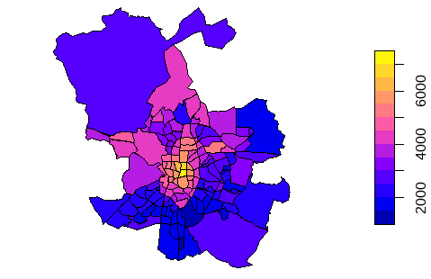
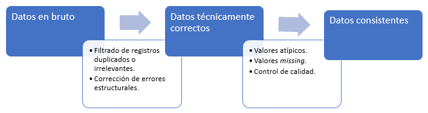
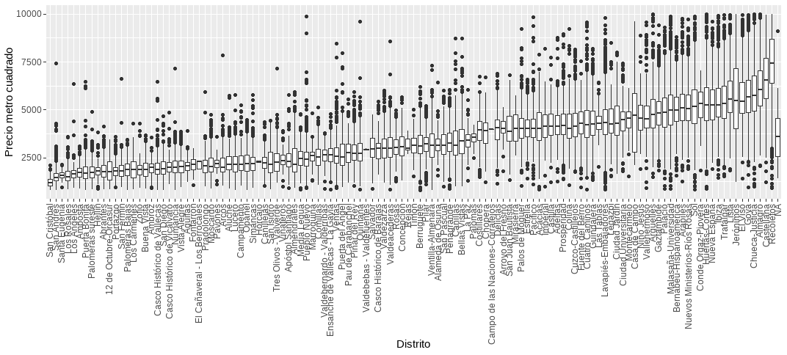
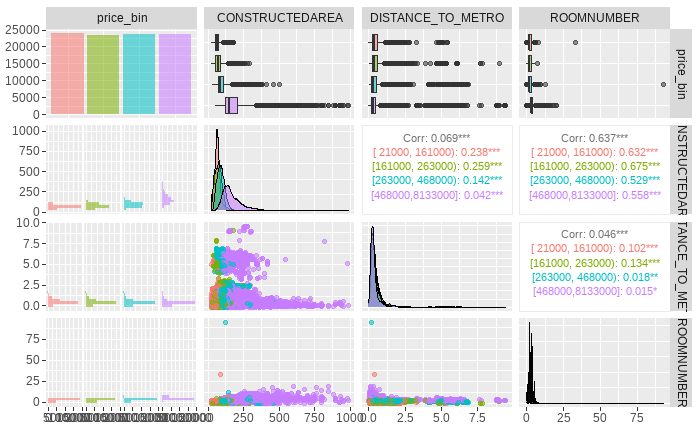
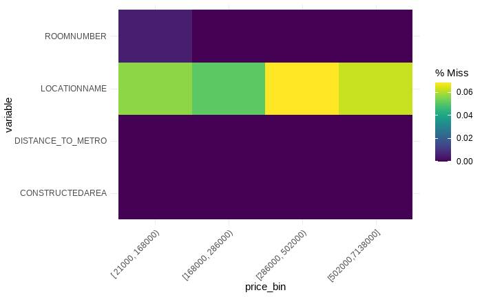

# Integración y limpieza de datos {#cap-130009}
  
*Jorge Velasco López*$^{a}$ y *José-María Montero*$^{b}$

$^{a}$Instituto Nacional de Estadística de España  
$^{b}$Universidad de Castilla-La Mancha
  
## Introducción

En los proyectos de ciencia de datos, generalmente es necesario realizar un **preprocesamiento** (o **preparación**) de los datos antes de iniciar las fases de modelado. Las labores de preprocesamiento son específicas para cada conjunto de datos, para los objetivos del proyecto y para las técnicas de modelización que se van a utilizar. Sin embargo, hay una serie de tareas comunes, como las de **integración** (combinación de datos de distintas fuentes) a partir de los datos en bruto (o sin procesar) y **limpieza** (identificación y corrección de posibles errores en los datos). Otras tareas que se suelen incluir en el proceso de preparación de datos son: la transformación de la variable objetivo, para cambiar su distribución de probabilidad (normalmente para hacerla gaussiana), la transformación de variables predictoras (o clasificadoras, en su caso) (*feature engineering*), la normalización y la reducción de la dimensionalidad. Estas tareas se abordarán en el Cap. \@ref(chap-feature).
\index{datos!brutos}
\index{preprocesamiento}

En **R**, existen varios paquetes para llevar a cabo estos trabajos: `tidyverse`, para la manipulación de ficheros y variables que se han ilustrado en el Cap. \@ref(ch-110003); `dlookr` [@staniak2019landscape]; `validate`, `errorlocate` y `dcmodify` [@van2019data], para realizar validaciones y transformaciones a los datos; `caret` [@kuhn2008building], para imputar los datos faltantes o perdidos (*missing data*); `sf` [@pebesma2018simple], para el manejo de conjuntos de datos espaciales; y `GGally` [@schloerke2021ggally] y `naniar` [@tierney2018expanding] para labores de visualización.

## Integración de datos \index{datos!integración}
La **integración** es un conjunto de procesos técnicos y de negocio que se utilizan para combinar información proveniente de diferentes fuentes. En términos generales, se puede decir que consiste en acceder a los datos desde todas las fuentes y localizaciones, tanto en entorno local como en la nube o en una combinación de ambos, de modo que los registros de una fuente de datos enlacen con los registros de otra. 

Para ilustrar el proceso de integración, a continuación se integran, por separado,[^Note_Jorge_1-1] el conjunto de datos `Madrid_Sale` (incluido en el paquete `idealista18`), que contiene el identificador de las viviendas en venta en el municipio de Madrid, y 41 variables relativas a dichos inmuebles (como su antigüedad y precio, por ejemplo) con otros dos conjuntos de datos del mismo paquete: `Madrid_POIS`, donde se listan, entre otras, las coordenadas de las estaciones de metro de la ciudad de Madrid; y `Madrid_Polygons`, que contiene los polígonos (en este caso, distritos) del municipio. Ello redundará en un enriquecimiento de los análisis que se lleven a cabo, al disponer en un mismo conjunto de datos un número mayor de variables relativas al problema a solucionar. A modo de ejemplo, la integración de `Madrid_Sale` con `Madrid_POIS` permitirá determinar el número de estaciones de metro a menos de 500 metros de la vivienda y la distancia de cada vivienda a la estación de metro más cercana;  la integración de `Madrid_Sale` y `Madrid_Polygons` permitirá la construcción de un mapa de precios medios del metro cuadrado de vivienda por distritos. Ambos ejemplos se ilustrarán con detalle en las dos subsecciones siguientes.

[^Note_Jorge_1-1]: Podría parecer que lo lógico es integrar todos los ficheros en un solo conjunto de datos. Sin embargo, en muchas ocasiones es conveniente realizar integraciones parciales de los ficheros, para llevar a cabo distintas tareas en cada una de ellas, o, simplemente, por cuestiones de rendimiento.

La función `glimpse()` permite mostrar la estructura de los tres conjuntos de datos incluidos en el paquete `idealista18`.


```r
library("tidyverse")
# install.packages("devtools")                    # descomentar para instalar 
# devtools::install_github("paezha/idealista18")  # descomentar para instalar
library("idealista18")
library("sf")
library("GGally")
library("dlookr")
library("Hmisc")

glimpse(Madrid_Sale)
glimpse(Madrid_POIS)
glimpse(Madrid_Polygons)
```

    
La combinación de conjuntos de datos se realiza, fundamentalmente, con las funciones de unión. En el Cap. \@ref(ch-110003) se mostraban las cuatro funciones de unión principales del paquete `tidyverse`: `left_join(), inner_join(), right_join() y full_join()`. Sin embargo, también merece la pena mencionar las uniones de filtrado entre dos objetos $x$ e $y$, que se llevan a cabo mediante las siguientes funciones: \index{uniones de filtrado}


- `semi_join()`: devuelve todas las filas de $x$ con una coincidencia en $y$.
- `anti_join()`: devuelve todas las filas de $x$ que no tengan una coincidencia en $y$.
- `nest_join()`: devuelve todas las filas y columnas de $x$ con una nueva columna anidada, que contiene todas las coincidencias de $y$. 

### Integración de los ficheros `Madrid_Sale` y `Madrid_POIS`

Como se avanzó anteriormente, dos resultados interesantes que se podrían obtener mediante la integración  de estos conjuntos de datos son: $(i)$ la determinación del número de estaciones de metro a menos de 500 metros de la localización de la vivienda de interés, y $(ii)$ la distancia a la estación de metro más cercana. Para la integración entre los dos ficheros, se utiliza la función `st_join()`, función de unión para datos espaciales, del paquete `sf`.[^Note_Jorge_1-2]

[^Note_Jorge_1-2]: Téngase en cuenta que la vivienda es un bien anclado a una localización geográfica.


```r
vivs_madrid <- Madrid_Sale |>
  st_join(Madrid_Polygons, left = TRUE)
```

Para proceder a la integración de ambos ficheros, en primer lugar se crean las variables que indican cuál es el sistema de referencia de coordenadas (SRC) que se va a utilizar y que permite determinar la posición de un punto en relación a otro en base a líneas imaginarias (en el ejemplo que nos ocupa, permite representar la ubicación de las viviendas en la superficie de la Tierra). En este caso, la asignación de coordenadas se realiza a través de las variables `projcrc_src` y `projcrs_dest`, en las que se establecen los parámetros de:

- Nombre de la proyección (`proj`). 
- Zona UTM (`zone`) donde se ubica el conjunto de viviendas. 
- Nombre del elipsoide (`ellips`). La Tierra no es una esfera y tiene accidentes geográficos, por lo cual hay que trabajar con elipsoides y explicitar los parámetros que definen su forma. 
- Nombre del datum (`datum`). Define el origen y la orientación de los ejes de coordenadas, es decir, proporciona la información necesaria para dibujar el sistema de coordenadas en el elipsoide. El World Geodetic System (WGS84) es un estándar en la industria a nivel mundial; no obstante, existen algunas variantes locales (la más famosa es el North American Datum (NAD83).
- Tipo de unidades (`units`); en este caso, metros. 

Seguidamente, se indica la distancia (en este caso en metros) que se va a usar como radio en la variable `radius_meters`. Finalmente, se lleva a cabo un procesamiento específico para datos espaciales: se crea un objeto espacial, se proyecta a plano para pasar de tres a dos dimensiones (hasta ahora se ha trabajado en la representación de la Tierra en tres dimensiones; sin embargo, estamos acostumbrados a ver mapas, es decir, a ver dos dimensiones), se cambia la geometría y, finalmente, se vuelve al sistema de coordenadas no proyectadas.


```r
projcrs_src <- "+proj=longlat +datum=WGS84 +no_defs"
projcrs_dest <- "+proj=utm +zone=30 +ellps=WGS84 +datum=WGS84 +units=m +no_defs"
radius_meters <- 500 # Se marca la distancia que interesa.
pois_metro <- Madrid_POIS$Metro |>
  st_as_sf(coords = c("Lon", "Lat"), crs = projcrs_src) |> # Crear objeto espacial sf
  st_transform(crs = st_crs(projcrs_dest)) |> # Proyectar al plano (st_crs recupera la referencia de la coordenada y st_transform realiza la transformación)
  st_buffer(dist = radius_meters) |> # Cambiar la geometría de punto a polígono (círculo)
  st_transform(crs = st_crs(projcrs_src)) # Volver al sistema de coordenadas no proyectadas (Ángulos)
```
A continuación, para cada una de las viviendas, se calcula el número de estaciones de metro a menos de 500 metros (variable `N_METRO_STOPS_500_M`). Para ello, primero se realiza el cálculo del objeto `sf` `metro_count`, seleccionando la variable `pois_metro` y cruzando con la geometría.

```r
metro_count <- vivs_madrid |>
  select(ASSETID) |>
  st_join(pois_metro,
    join = st_intersects,
    left = FALSE
  )
# Se elimina la geometría para evitar ralentizar el cálculo
st_geometry(metro_count) <- NULL
```
Los valores de `N_METRO_STOPS_500_M` se obtienen con el siguiente código:

```r
metro_count <- metro_count |>
  group_by(ASSETID) |>
  summarise(N_METRO_STOPS_500_M = n()) |>
  ungroup()
```

Al cruzar `metro_count` con `vivs_madrid`, se observa que hay casi 25.000 registos que no cruzan (25.000 viviendas que no tienen ninguna estación de metro a menos de 500 metros). En consecuencia, se retiran del análisis puesto que el objetivo de la integración de estos dos conjuntos de datos es  $(i)$ la determinación del número de estaciones de metro a menos de 500 metros de la localización de las viviendas incluidas en el fichero `Madrid_Sale`.


```r
vivs_madrid <- vivs_madrid |>
  inner_join(metro_count, by = "ASSETID")
```
Posteriormente, se determina la estación más cercana a cada vivienda a la venta con la función `st_nearest_feature()`.


```r
pois_metro <- Madrid_POIS$Metro |>
  st_as_sf(coords = c("Lon", "Lat"), crs = projcrs_src) # Crear objeto espacial

mascercano_metro_stops <- pois_metro[st_nearest_feature(vivs_madrid, pois_metro), ] # Cálculo de las paradas cercanas
```
Por último, con la función `st_distance()`, se calcula la distancia de cada vivienda a la estación de metro más cercana, creándose la variable `METRO_STOP_MASCERCANO_DISTANCIA`.

```r
vivs_madrid <- vivs_madrid |>
  mutate(METRO_STOP_MASCERCANO_DISTANCIA = as.numeric(st_distance(mascercano_metro_stops, geometry, by_element = T)))
```


### Integración de los ficheros `Madrid_Sale` y `Madrid_Polygons`

\index{datos!integración}

En esta subsección se muestran los detalles para construir un mapa de precio medio del metro cuadrado de la vivienda en la ciudad de Madrid, por distritos, tras la integración de los conjuntos de datos `Madrid_Sale` y `Madrid_Polygons`. 

Para proceder a la integración de ambos ficheros, en primer lugar se realiza la conversión del conjunto de datos `Madrid_Polygons` a objeto espacial y se le asocia la coordenada de referencia (de forma similar a como se hizo en la integración de los ficheros `Madrid_Sale` y `Madrid_POIS`): 


```r
# Se convierten a objetos sf
Madrid_Polygons_sf <- sf::st_as_sf(Madrid_Polygons, wkt = "WKT") # WKT (Well-known text) es un formato de vectores geométricos
Madrid_Sale_sf <- st_as_sf(Madrid_Sale, coords = c("LONGITUDE", "LATITUDE"))
# se asocia la coordenada de referencia del objeto
st_crs(Madrid_Sale_sf) <- "+proj=longlat +datum=WGS84 +no_defs"
st_crs(Madrid_Polygons_sf) <- "+proj=longlat +datum=WGS84 +no_defs"
```

A continuación, se lleva a cabo la unión entre el objeto espacial de `Madrid_Polygons_sf` y `Madrid_Sale_sf` para calcular su precio por metro cuadrado (`preciopm2`) y el área de la geometría (`tract_area`). 


```r
Madrid_Sale_Polygons <- Madrid_Polygons_sf |>
  dplyr::mutate(tract_area = st_area(WKT)) |>
  sf::st_join(Madrid_Sale_sf) |>
  dplyr:: group_by(LOCATIONNAME) |>
  dplyr:: summarize(tract_area = unique(tract_area), 
                    preciopm2 = mean(PRICE / CONSTRUCTEDAREA))
```

A partir del resultado de esta integración, se construye la Fig. \@ref(fig:madrid), que muestra un mapa del precio medio del metro cuadrado de las viviendas a la venta en Madrid, a escala de distrito, lo que da una visión clara de las zonas más o menos económicas.


```r
plot(Madrid_Sale_Polygons["preciopm2"])
```
<div class="figure" style="text-align: center">

<p class="caption">(\#fig:madrid)Precio por metro cuadrado de viviendas a la venta en Madrid por distrito.</p>
</div>

## Limpieza de datos
\index{datos!problemas de calidad} \index{datos!limpieza}

Es más habitual de lo deseable que algunas variables presenten problemas en la calidad de sus datos. En el Cap. \@ref(DGDQM), se mencionaban una serie de causas y la posibilidad de realizar el perfilado para tener una medición de la calidad de los datos. Si los datos no tienen el nivel de calidad adecuado, deben realizarse tareas de limpieza para transformarlos en datos consistentes, corrigiendo datos incorrectos, corruptos, con formato incorrecto, duplicados o incompletos. 

En la Fig. \@ref(fig:limpieza) se muestra un proceso general de limpieza de datos. Cada rectángulo azul representa datos en un estado determinado, mientras que cada flecha representa las actividades necesarias para pasar de un estado a otro. En el primer estado están los datos tal y como se recogen (**datos en bruto** o **sin procesar**). Pueden carecer de encabezados, contener tipos de datos incorrectos, etiquetas de categoría incorrectas, codificación de caracteres desconocida o inesperada, etc. Una vez realizadas las correcciones necesarias, los datos pueden considerarse **datos técnicamente correctos**. Es decir, en este estado, los datos se pueden leer en un `data.frame` de **R**, con los nombres, tipos y etiquetas correctos. Sin embargo, esto no significa que los valores estén libres de errores o completos. Los **datos consistentes** son aquellos que están preparados para las fases de modelado. 
<div class="figure" style="text-align: center">

<p class="caption">(\#fig:limpieza)Flujo del proceso de limpieza de datos.</p>
</div>


Si bien las técnicas utilizadas para la limpieza de datos pueden variar según el tipo de datos que se esté procesando, en general, se pueden dividir en cinco grupos:

- Corrección de errores estructurales.
- Filtrado de registros duplicados o irrelevantes.
- Gestión de valores atípicos.
- Gestión de valores faltantes (*missing*).
- Validación y control de la calidad de los datos.

\index{datos!faltantes}

### Corrección de errores estructurales 
\index{error!estructural}
Los **errores estructurales** ocurren cuando se observan formatos erróneos, estructuras incorrectas o errores tipográficos que pueden dar lugar a categorías o clases mal etiquetadas. Por tanto, puede haber errores estructurales a nivel de conjunto de datos (`data.frame` , `sf`, `tibble`,...) y a nivel de variable.

#### A nivel de conjunto de datos {#madridsaleint}
\index{error!estructural!a nivel de conjunto de datos}

Los **cambios estructurales a nivel de conjunto de datos** consisten en modificar el tipo de objeto o eliminar o agregar variables.
Por ejemplo, a continuación se genera el conjunto de datos `Madrid_Sale_int`, con estructura de `data.frame`, a partir del conjunto de datos `vivs_madrid` (de tipo `sf`), fruto del proceso de integración anterior. Además, para este objeto, se elimina la variable `geometry`, que no se va a usar en adelante y ralentiza la computación.

```r
Madrid_Sale_int <- as.data.frame(vivs_madrid) |> select(-geometry)
```
También se crea un segundo conjunto de datos reducido, `Madrid_Sale_red`, con una selección de variables que se consideran de interés para ilustrar las tareas de limpieza que se exponen en este capítulo. 

```r
Madrid_Sale_red <- select(Madrid_Sale_int, ASSETID, PRICE, UNITPRICE, CONSTRUCTEDAREA, ROOMNUMBER, CONSTRUCTIONYEAR, HASNORTHORIENTATION, HASSOUTHORIENTATION, HASEASTORIENTATION, HASWESTORIENTATION, CONSTRUCTIONYEAR, DISTANCE_TO_METRO, METRO_STOP_MASCERCANO_DISTANCIA)
```
Por último, se añade la variable `LOCATIONID1`, que indica el código de localización, al conjunto de datos `Madrid_Polygons`.


```r
Madrid_Polygons$LOCATIONID1 <- substr(Madrid_Polygons$LOCATIONID, 1, 10)
```

En la siguiente sección, a partir de estos conjuntos de datos, se lleva a cabo un proceso de diagnosis y exploración.


#### A nivel de variable

\index{error!estructural!a nivel de variable}

Los **errores estructurales a nivel de variable** se centran fundamentalmente en el tipo de dato de las variables. 

En primer lugar, se visualizan los datos con la función `diagnose()` de `dlookr`. 

::: {.infobox data-latex=""}
**Nota**
  
El paquete `dlookr` se usa para tareas de diagnosis y exploración, y es de utilidad para la localización de valores duplicados, faltantes, atípicos, tipología de datos, etc.  La función `overview()` permite obtener una visión genérica del conjunto de datos, y la función `diagnose()` proporciona información a nivel de variable, como el tipo de dato (*type*), y sobre valores faltantes y únicos. Otras funciones útiles son `diagnose_numeric()` y `diagnose_category()`, que proporcionan información específica para valores numéricos y categóricos, respectivamente.
:::


```r
diagnose(Madrid_Sale_red)
```
Al ejecutar la función, se comprueba que todas las variables, excepto el identificador `ASSETID`, son de tipo numérico (o *integer*), lo que es correcto. En caso de tener que modificar el tipo de dato, por considerarse un error estructural, o porque sea conveniente para las fases de modelado, debería hacerse usando las funciones `as.factor(), as.numeric()` y `as.character()`, según el caso.

Corregir **errores estructurales tipográficos de variables categóricas** es especialmente relevante en algunas áreas de la ciencia de datos, como la minería de textos o *text mining* (que se verá con más profundidad en el Cap. \@ref(mineria-textos)), donde la limpieza de textos consiste en eliminar todo aquello que no aporte información sobre su temática, estructura o contenido. A continuación, se muestra una función creada a partir del paquete `stringr` que permite realizar una limpieza básica de un texto, y que se ejecuta sobre la variable `Madrid_Polygons$LOCATIONNAME`, generando la variable `LOCATIONNAME1`.

```r
library("stringr")
limpieza_textos <- function(texto) {
  # El orden de la limpieza no es arbitrario
  # Se convierte todo el texto a minúsculas
  nuevo_texto <- tolower(texto)
  # Eliminación de páginas web (palabras que empiezan por "http." seguidas
  # de cualquier cosa que no sea un espacio)
    nuevo_texto <- str_replace_all(nuevo_texto, "http\\S*", "")
  # Eliminación de signos de puntuación
  nuevo_texto <- str_replace_all(nuevo_texto, "[[:punct:]]", " ")
  # Eliminación de números
  nuevo_texto <- str_replace_all(nuevo_texto, "[[:digit:]]", " ")
  # Eliminación de espacios en blanco múltiples
  nuevo_texto <- str_replace_all(nuevo_texto, "[\\s]+", " ")
  return(nuevo_texto)
}
```


```r
Madrid_Polygons$LOCATIONNAME1 <- limpieza_textos(texto = Madrid_Polygons$LOCATIONNAME)
glimpse(Madrid_Polygons)
#> $ LOCATIONNAME <fct> Conde Orgaz-Piovera, Pinar del Rey, Timón, Palacio,
#> ...
#> $ LOCATIONNAME1 <chr> "conde orgaz piovera", "pinar del rey", "timón",
```


### Eliminación de observaciones duplicadas o irrelevantes

\index{datos!duplicados}
Las **observaciones duplicadas** aparecen frecuentemente durante la recogida de datos e integración de las bases de datos, por lo que dichas duplicidades deben ser eliminadas en esta fase de limpieza.

A continuación, se usa la función `overview()` del paquete `dlookr` sobre el conjunto de datos `Madrid_Sale_int`, obtenido en la Sec. \@ref(madridsaleint).

```r
head(overview(Madrid_Sale_int), n = 9)
#>      division                  metrics         value
#> 1        size             observations         70059
#> 2        size                variables            46
#> 3        size                   values       3222714
#> 4        size              memory size      21931336
#> 5  duplicated    duplicate observation             0
#> 6     missing     complete observation         26394
#> 7     missing      missing observation         43665
#> 8     missing        missing variables             7
#> 9     missing           missing values         48653
```
Entre otra información, como la existencia de valores faltantes (*missing*) en siete variables, se puede observar que no hay valores duplicados después del proceso de integración. En caso contrario, se podrían usar las funciones `base` de **R** para $(i)$ localizarlos, con `duplicated()`, y $(ii)$ extraer los registros únicos, con `unique()`. También se puede usar `distinct()`, del paquete `dplyr`, para eliminar los registros duplicados de un `data.frame`. 

Las **observaciones irrelevantes** son aquellas  que no encajan en el problema específico que se está analizando. Por ejemplo, si el objeto de estudio son datos de Madrid, se pueden eliminar las observaciones que no correspondan a dicho municipio. 
A continuación, se puede advertir que todas las observaciones de `Madrid_Polygons$LOCATIONID1` empiezan por el código correspondiente a Madrid (`0-EU-ES-28`) y, por tanto, no es necesario filtrar registros. 

```r
head(table(Madrid_Polygons$LOCATIONID1))
#>
#> 0-EU-ES-28
#> 135
```
En caso necesario, se pueden filtrar todos los registros de Madrid en el objeto `Madrid_Polygons1` haciendo:

```r
Madrid_Polygons1 <-
  Madrid_Polygons |> filter(substr(Madrid_Polygons$LOCATIONID, 1, 10) != "0-EU-ES-28")
```
### Gestión de valores atípicos no deseados
\index{datos!atípicos} \index{outlier@\textit{outlier}}
A menudo, hay observaciones distintas que, aparentemente, no encajan en los datos que se están analizando. Si existe una razón coherente para eliminar un valor atípico (un *outlier*), como una entrada de datos incorrecta, hacerlo mejorará el rendimiento que proporcionan los datos con los que se está trabajando. Sin embargo, el hecho de que exista un valor atípico no significa que sea incorrecto. Si un valor atípico resulta ser irrelevante para el análisis, o es un error, debe considerarse su eliminación.
El número de posibles valores atípicos en el conjunto de datos `Madrid_Sale_red` se determina con el siguiente código, que avisa de la posibilidad de que existan para cada una de las variables.

```r
diagnose_numeric(Madrid_Sale_red)
```
Otra manera de localizar datos atípicos es a través de la **visualización**. Por ejemplo, en la Fig. \@ref(fig:idealistagraf1) se relaciona el precio de la vivienda por metro cuadrado con su localización, y se observa que la zona más cara es Recoletos y la más barata es San Cristóbal. La simple observación aconsejaría un análisis de los casos extremos (muy baratos o caros en cada uno de los distritos).
\index{visualización}


```r
ggplot(Madrid_Sale_int, aes(x = reorder(LOCATIONNAME, PRICE / CONSTRUCTEDAREA, na.rm = TRUE), y = PRICE / CONSTRUCTEDAREA)) +
  geom_boxplot() +
  theme(axis.text.x = element_text(angle = 90, vjust = 0.5, hjust = 1)) +
  labs(x = "Distrito", y = "Precio metro cuadrado")
```
<div class="figure" style="text-align: center">

<p class="caption">(\#fig:idealistagraf1)Precio medio del metro cuadrado por distritos.</p>
</div>


Los *box-plots* y gráficos de dispersión de variables, para las categorías dadas de otra, así como las  correlaciones entre dichas variables, también pueden utilizarse para detectar valores atípicos. Por ejemplo, se puede considerar la relación del precio del metro cuadrado de la vivienda con otras variables, como la superficie construida, la distancia al metro y el número de habitaciones. Para ello, primeramente se crea el conjunto de datos `Madrid_Sale_red2` con la variable derivada `price_bin` (de tipo factor), cuyas categorías o clases (o *bins*) son los cuartiles de la variable `PRICE`.


```r
Madrid_Sale_red2 <- mutate(Madrid_Sale_int, price_bin = cut2(PRICE, g=4)) |>
  select(price_bin, CONSTRUCTEDAREA, DISTANCE_TO_METRO, ROOMNUMBER, LOCATIONNAME)
```

A partir del conjunto de datos `Madrid_Sale_red2` se puede crear la Fig. \@ref(fig:idealistagraf2).


```r
ggpairs(Madrid_Sale_red2,
  column = 1:4, aes(color = price_bin, alpha = 0.5),
  upper = list(continuous = wrap("cor", size = 2))
)
```


<div class="figure" style="text-align: center">

<p class="caption">(\#fig:idealistagraf2)Distribuciones y correlaciones cruzadas algunas variables de $Madrid$-$Sale$-$red$.</p>
</div>


En dicha figura, la diagonal descendente muestra la función de cuantía (para precio medio del metro cuadrado) y las funciones de densidad de `CONSTRUCTEDAREA`, `DISTANCE_TO_METRO` y `ROOMNUMBER`. Los tres últimos paneles de la primera columna muestran los histogramas de estas tres últimas variables. Los tres últimos paneles de la primera fila proporcionan los *box-plots* de estas variables para los cuatro *bins* de la variable `price_bin` (primer cuartil en rosa, segundo en verde, tercero en azul y cuarto en morado). Los paneles del triángulo lateral derecho muestran sus correlaciones, mientras que los del triángulo inferior izquierdo presentan sus gráficos de dispersión.  Dicho lo anterior, por ejemplo, en la primera fila se observa que las viviendas más económicas suelen tener menos superficie construida (segunda columna), que suelen estar ligeramente más alejadas del metro (tercera) y suelen tener menos habitaciones. Sin embargo, se aprecian algunas cuestiones que llaman la atención. Por ejemplo, que hay una vivienda muy alejada (a casi 400 kilómetros) de la estación de metro más cercana, lo cual distorsiona algunas de las figuras e impide ver la información que contienen; o que hay  viviendas cuyo precio por metro cuadrado pertenece a la primera categoría de la variable `price_bin` (las más económicas) con muchas habitaciones o con mucha superficie construida.  A continuación, por ejemplo, se filtran las viviendas con 30 o más habitaciones (aunque la lógica sería válida para muchas menos). Se observa que la superficie construida es de menos de 120 metros, lo que, sin mayor conocimiento del conjunto de datos, no parece ser coherente y podrían excluirse (filtrarse) del conjunto de datos, o tratar de recabar la información correcta. 


```r
Madrid_Sale_red2 |> filter(price_bin == "[ 21000, 168000)", ROOMNUMBER > 30)
#>            price_bin CONSTRUCTEDAREA DISTANCE_TO_METRO ROOMNUMBER LOCATIONNAME
#>   1 [ 21000, 168000)              90         0.3826137         33 Almendrales
```


<!-- ::: {.infobox data-latex=""} -->
<!-- **Nota** -->
  
Finalmente, detectados los valores atípicos, por cualquiera de los procedimientos anteriormente expuestos, el paquete `dlookr`, a través de la función `imputate_outlier()`, permite llevar a cabo sofisticadas imputaciones de los mismos, si bien solo en el caso de variables numéricas. Los métodos de imputación que se contemplan son: media, mediana, moda y *capping* (imputar los valores atípicos superiores con el percentil 95, y los inferiores con el percentil 5). Por ejemplo, se podría imputar la variable `CONSTRUCTEDAREA_imp` a partir de `CONSTRUCTEDAREA` con el método media (*mean*): `CONSTRUCTEDAREA_imp <- imputate_outlier(Madrid_Sale_red2, CONSTRUCTEDAREA, method = "mean")`.
<!-- ::: -->

Otra opción es poner los valores atípicos como valores no disponibles  (*not available*, `NA`) y proceder a imputar dichos `NA` tal y como se muestra en el epígrafe siguiente.


```r
Madrid_Sale_red2$ROOMNUMBER[Madrid_Sale_red2$ROOMNUMBER >= 30 & Madrid_Sale_red2$price_bin == "[ 21000, 168000)"] <- NA
```


### Gestión de datos faltantes (*missing*) {#imputacion}

\index{datos!missing @\textit{missing}}

Los datos pueden faltar por multitud de razones, aunque generalmente se suelen agrupar en dos categorías: **valores faltantes informativos** [@kuhn2013applied] y **valores faltantes aleatorios** [@little2019statistical]. Los informativos implican una causa estructural, ya sea por deficiencias en la forma en que se recopilaron los datos o por anomalías en el entorno de observación. Los aleatorios son aquellos que tienen lugar independientemente del proceso de recopilación de datos.

Dependiendo de si los valores faltantes son de uno u otro tipo, se procederá de una u otra manera. A los informativos, en general, se les puede asignar un valor concreto (por ejemplo,
“Ninguno”), ya que este valor puede afectar a los resultados de las predicciones. Los aleatorios pueden manejarse mediante la eliminación o la imputación. Además, los diferentes algoritmos de aprendizaje automático manejan la falta de información de manera diferente. De hecho, la mayoría de los algoritmos no incorporan mecanismos para manejarlos (por ejemplo, modelos lineales generalizados y derivados, redes neuronales y *support vector machine*) y, por lo tanto, requieren que se traten previamente. Solo unos pocos modelos (principalmente basados en árboles) tienen procedimientos incorporados para tratar los valores faltantes.

Como se avanzó anteriormente, en **R**, los valores nulos se representan con el símbolo `NA`. Es importante distinguirlos de los valores indefinidos (p. ej., dividir entre cero), que se representan con el símbolo `NaN` (*Not a Number*).
Para visualizar los patrones de datos *faltantes* de la variable `price_bin` del conjunto de datos `Madrid_Sale_red2`, se ejecuta el siguiente código. 

```r
library("naniar")
gg_miss_fct(x = `Madrid_Sale_red2`, fct = price_bin)
```
<!-- # También puede visualizarse de otra manera con la siguiente opción -->
<!-- gg_miss_var(Madrid_Sale_red2, show_pct = TRUE, facet = price_bin) -->

En la Fig. \@ref(fig:missing1)  se puede observar claramente que hay datos faltantes en la variable `LOCATIONNAME`, sobre todo en los dos primeros cuartiles (*bins*). Concretamente, hay 42 valores faltantes. No obstante, aunque el degradado del color morado apenas permite apreciarlo, también hay un valor faltantes en  `ROOMNUMBER`.
<div class="figure" style="text-align: center">

<p class="caption">(\#fig:missing1)Visualización de valores faltantes.</p>
</div>

La gestión de los valores faltantes debe hacerse considerando la problemática que se quiera resolver. Una primera opción a considerar sería excluirlos, si bien se estaría eliminando información. Para filtrar los registros faltantes, se podría utilizar la función `is.na()`. En el caso de `ROOMNUMBER`:

```r
Madrid_Sale_red3 <- Madrid_Sale_red2
Madrid_Sale_red3 |>
  filter(!is.na(ROOMNUMBER))
```
También se puede optar por reemplazarlos, por ejemplo por un 0, de la siguiente manera:

```r
Madrid_Sale_red3[is.na(Madrid_Sale_red3)] <- 0
# También puede usarse la función `replace_na()`, que sustituye los valores perdidos en cada variable por el valor especificado.
```
No obstante, estas dos opciones no son acciones recomendables en primera instancia, porque eliminar los registros con valores faltantes o introducir valores que podrían no respetar la semántica de los datos puede ocasionar un alto impacto negativo en los niveles globales de calidad de datos del conjunto de datos.

Se puede ir más allá de la eliminación de valores faltantes. A través de diversos métodos se pueden imputar valores que, con mayor o menor probabilidad, podrían ser los que realmente correspondieran a estos valores faltantes. Estos métodos se conocen como **métodos de imputación de valores**. Para imputar valores faltantes se pueden usar diversas alternativas, como la función `preProcess()` del paquete `caret` o la función `imputate_na()` del paquete `dlookr`. 
A continuación, se imputan los valores faltantes del conjunto de datos `Madrid_Sale_red2` con dos métodos. En primer lugar, con el algoritmo de KNN ($k$ vecinos más cercanos), que sustituye el valor faltante por la media de los valores de los $k$ vecinos más próximos. Después de realizar el preprocesamiento, se comprueba que las imputaciones han sido realizadas.


```r
library("caret")
# Se realiza el preprocesamiento:
pre_knn <- preProcess(Madrid_Sale_red2, method = "knnImpute", k = 2)
# Se obtienen los datos
imputed_knn <- predict(pre_knn, Madrid_Sale_red2)
# Se comprueba que se ha imputado el valor faltante de la variable ROOMNUMBER
diagnose(imputed_knn)
```
A continuación, la imputación se realiza con la mediana (que suele ser preferible a imputar la media, puesto que el promedio puede verse afectado por *outliers*).  

```r
# Se realiza el preprocesamiento:
pre_median <- preProcess(Madrid_Sale_red2, method = "medianImpute")
# Se obtienen los datos
imputed_median <- predict(pre_median, Madrid_Sale_red2)
# Se comprueba que se ha imputado el valor faltante de la variable ROOMNUMBER
diagnose(imputed_median)
```

::: {.infobox data-latex=""}
**Nota**
  
El paquete `dlookr`, a través de la función `imputate_na()`, permite imputar valores faltantes. El predictor admite variables numéricas y categóricas. Los métodos que utiliza son: para numéricas `media, moda, KNN, rpart` y `mice`; y para categóricas: `mode, rpart` y `mica`.
El paquete `recipes` también es recomendable. Por ejemplo, para la imputación de los valores faltantes con la media de la variable se usaría `step_meanimpute(all_numeric())`.
:::
  
### Validación y control de calidad
  \index{control!de calidad del dato} \index{validación}
Al final del proceso de limpieza de datos, estos deberían ser consistentes y seguir las reglas apropiadas para su campo de negocio. De no ser así, los modelos que se estimen en base a ellos no representarán convenientemente la realidad objeto de estudio y las conclusiones que se obtengan de dichos modelos no serán de utilidad para dicha realidad.

La verificación de si los datos son o no consistentes y si siguen o no las reglas del campo de negocio del cual proceden se puede llevar a cabo con el paquete `tidyverse`, que permite hacer selecciones, filtrados o tablas de frecuencias, entre otras acciones. A modo de ejemplo, en el caso del precio medio del metro cuadrado de los distritos de la ciudad de Madrid, se puede usar la función `count()` para obtener la distribución de frecuencias de la variable `METRO_STOP_MASCERCANO_DISTANCIA` y comprobar si es consistente con el conocimiento que se tiene de esa variable y del conjunto de datos. Se muestran las distancias a la estación más cercana para las viviendas correspondientes a los seis primeros registros.

```r
head(count(as.data.frame(Madrid_Sale_red), METRO_STOP_MASCERCANO_DISTANCIA))
#> METRO_STOP_MASCERCANO_DISTANCIA n
#> 1                      1.413845 1
#> 2                      1.414032 1
#> 3                      2.586694 1
#> 4                      3.156593 1
#> 5                      4.013776 1
#> 6                      4.128947 1
```


Una opción más sofisticada es el paquete `validate`, donde se pueden introducir las reglas de negocio dentro del propio código o bien desde un fichero externo. A continuación, se realiza un ejemplo con las reglas incrustadas en el propio código. Estas reglas pueden ser avisos o normas que indican error en esos datos. En este ejemplo, se han definido siete reglas: por ejemplo,  `PRICE`$\ge$ 0, o que la suma de las variables `HASNORTHORIENTATION`, `HASSOUTHORIENTATION`  `HASEASTORIENTATION` y `HASWESTORIENTATION` sea la unidad. La salida que se obtiene se presenta a continuación. A modo de ejemplo, la regla `HASNORTHORIENTATION + HASSOUTHORIENTATION + HASEASTORIENTATION + HASWESTORIENTATION = 1` es la número 3, que, como se puede ver, no se cumple en 48.446 ocasiones. 

```r
library("validate")

Madrid_Sale_int |>
  check_that(
    HASLIFT >= 0,
    PRICE >= 0,
    HASNORTHORIENTATION + HASSOUTHORIENTATION + HASEASTORIENTATION + HASWESTORIENTATION == 1,
    is.numeric(PRICE),
    UNITPRICE * CONSTRUCTEDAREA == PRICE,
    if (ROOMNUMBER > 3) PRICE > 100000,
    nrow(.) >= 20000
  ) |>
  summary()
#> name items passes fails NA error warning
#> 1 V1 70059 70059     0   0 FALSE FALSE
#> 2 V2 70059 70059     0   0 FALSE FALSE
#> 3 V3 70059 21613 48446   0 FALSE FALSE
#> 4 V4     1     1     0   0 FALSE FALSE
#> 5 V5 70059 15280 54779   0 FALSE FALSE
#> 6 V6 70059 70041    18   0 FALSE FALSE
#> 7 V7     1     1    0    0 FALSE FALSE
```

::: {.infobox data-latex=""}
**Nota**
  
El proceso de validación puede ser más o menos complejo, según afecte a una única variable en un mismo registro, a más de una variable de un mismo registro o a más de una variable en más de un registro. En el último caso, además, se puede validar en un solo conjunto de datos o en más de uno.
:::


En un esquema tradicional de validación, además de las reglas de validación aportadas por los expertos en el tema del que se trate, debe incluirse también un listado de reglas de corrección (igualmente aportado por los expertos en la materia) que indique cómo hay que corregir un registro cuando no cumple con una determinada regla de validación. Este modo de proceder, además de suponer un doble esfuerzo, puede conducir a inconsistencias o validaciones cíclicas. 

El Método de Fellegi y Holt[^Note_Jorge_1-3] (MFH) da una solución a este problema, evitando dichas inconsistencias, proporcionando un procedimiento que genera un conjunto completo de reglas de validación, incorporando reglas implícitas a las formuladas por los expertos de manera explícita. 

[^Note_Jorge_1-3]: El MFH es un estándar internacional en la revisión de la integridad de la información de encuestas y censos.

En breves palabras, dicho método asegura el cumplimiento de las siguientes tres premisas: 

- Minimizar el número de campos a corregir en un registro para hacerlo pasar todas las validaciones.
- Mantener, en la medida de lo posible, la distribución conjunta original del conjunto de datos. 
- Derivar las reglas de corrección, directamente y de forma implícita, de las reglas de validación. Por tanto, dichas reglas de corrección no son propuestas por el experto o, en su caso, por el validador.

Los detalles sobre el MFH pueden verse en @boskovitz2003logical.


El MFH no está exento de limitaciones. La primera es el incremento del coste computacional, que puede llegar a constituir un problema en caso de que el número de reglas implícitas sea muy elevado, lo cual es muy frecuente. De hecho, hay casos en los que hay más reglas implícitas que registros. Para solucionar este problema, denominado "problema de localización del error", que consiste, básicamente, en determinar el conjunto mínimo de variables a corregir para cada validación, se han propuesto varias alternativas, que incluyen métodos de investigación de operaciones, árboles binarios y metaheurísticas como algoritmos genéticos y similares.


A efectos prácticos, el MFH se puede aplicar con la función `locate_errors()` del paquete `errorlocate`, determinándose así cuáles son las variables a corregir para solventar los errores 
en las reglas de negocio establecidas (objeto `rules`). Por ejemplo, en el conjunto de datos `Madrid_Sale_red2` (donde se definía la variable `price_bin`), se establecen ahora unas reglas básicas algo más laxas (específicamente una: más de 10 habitaciones los tres primeros cuartiles), obteniéndose que habría que depurar la variable `ROOMNUMBER` en dos ocasiones para que el conjunto de datos quedase totalmente limpio (o depurado).


```r
library("errorlocate")

rules <- validator(if (ROOMNUMBER >= 10) price_bin == "[502000,7138000]")
el <- locate_errors(Madrid_Sale_red2, rules) |>
  summary(el)
el
# el$variable
#   names              errors missing
#   price_bin               0       0
#   ROOMNUMBER              2       1
#   CONSTRUCTEDAREA         0       0
#   DISTANCE_TO_METRO       0       0
#   LOCATIONNAME            0      42
```

¿Y qué se debe hacer con los registros que no cumplen las normas de validación? La respuesta es, como norma, "siempre que se disponga de información de negocio, esta debe preponderar sobre cualquier tipo de imputación".
A partir de este punto se puede proceder a realizar imputaciones determinísticas para solucionar los problemas detectados.

En el ejemplo anterior, se propone imputar el valor `ROOMNUMBER=5` a los casos de los tres primeros cuartiles (todos menos el más caro) que tengan más de 10 habitaciones. Para ello, se utiliza la función `modify_so()` del paquete `dcmodify`. Para comprobar que la imputación se ha llevado a cabo con éxito, se pueden comparar los conjuntos de datos antes y después de la imputación con la función `compare()`, comprobándose que tal imputación se ha realizado exitosamente en los 2 registros que presentaban problemas con la regla `ROOMNUMBER >= 10`.


```r
library("dcmodify")
out <- Madrid_Sale_red2 |>
  modify_so(if (ROOMNUMBER >= 10 & price_bin != "[502000,7138000]") ROOMNUMBER <- 5)
rules <- validator(if (ROOMNUMBER >= 10) price_bin == "[502000,7138000]")
compare(rules, raw = Madrid_Sale_red2, modified = out)
#> Object of class validatorComparison:
#> compare(x = rules, raw = Madrid_Sale_red2, modified = out)
# Status                 raw modified
#   validations        70059    70059
#   verifiable         70058    70058
#   unverifiable           1        1
#   still_unverifiable     1        1
#   new_unverifiable       0        0
#   satisfied          70056    70058
#   still_satisfied    70056    70056
#   new_satisfied          0        2
#   violated               2        0
#   still_violated         2        0
#   new_violated           0        0
```


::: {.infobox_resume data-latex=""}
### Resumen {-}
  
- En un proyecto de ciencia de datos deben realizarse procesos de integración y limpieza previos a la fase de modelización para asegurar niveles adecuados de calidad. Por ello, tras las labores iniciales de depuración, debe comprobarse si los datos son o no consistentes, y si siguen o no las reglas del campo de negocio del cual proceden. En este capítulo se abordan las cuestiones relativas a la integración de conjuntos de datos, su limpieza y depuración, y se proponen procedimientos para la validación de los mismos. 

- El conjunto de datos utilizado en este capítulo está disponible en el paquete `idealista18`; en concreto, se utilizan los datos de Madrid.

 - A partir de estos datos, se muestra un ejemplo de integración de datos espaciales y se diseña un marco de limpieza genérico basado en una serie de pasos básicos.

- Para la realización de estas funciones de integración y limpieza de datos, se proponen distintas funciones de los paquetes `tidyverse` (para la manipulación de ficheros y variables) y `caret` (para la imputación de valores perdidos).

-  Para el tratamiento de datos espaciales se utiliza el paquete `sf`. La visualización de los mismos  se lleva a cabo con `GGAlly` y `naniar`.

- Finalmente, se utiliza la función `locate_errors()`, del paquete `errorlocate`, para determinar cuáles son las variables con errores, de acuerdo a las reglas establecidas y `dcmodify` para realizar imputaciones determinísticas.
:::
