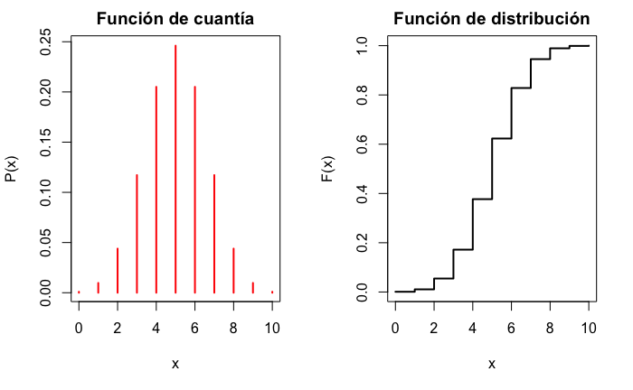
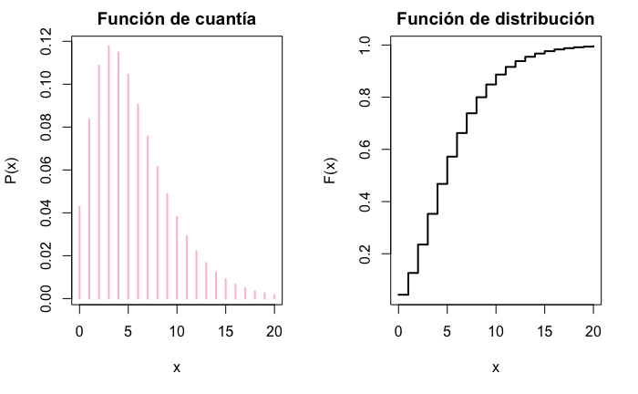
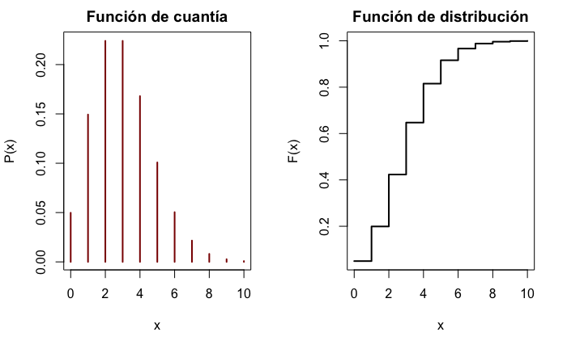
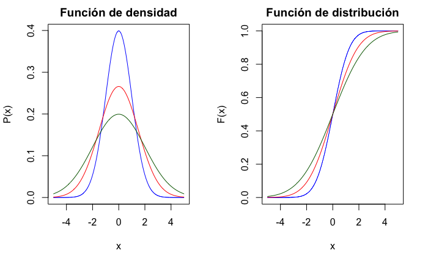
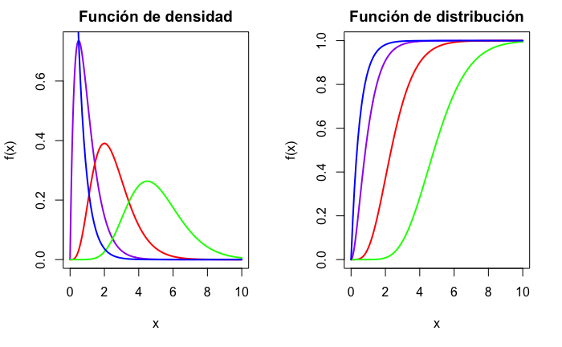
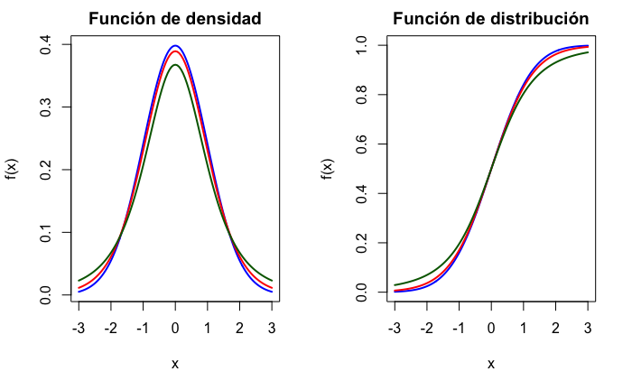
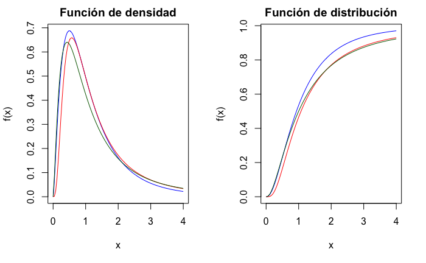
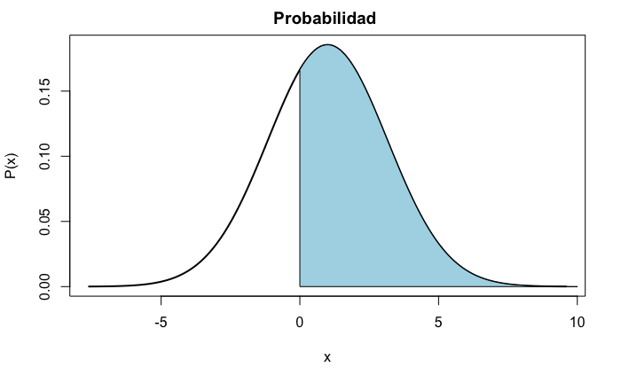

# (PART) Fundamentos de estadística {-}

# Probabilidad {#Funda-probab}

*Mª Leticia Meseguer Santamaría*$^{a}$ y *Manuel Vargas Vargas*$^{a}$

$^{a}$ Universidad de Castilla-La Mancha

## Introducción a la probabilidad

La incertidumbre\index{incertidumbre} es inevitable en muchos campos científicos, producto de la imposibilidad de predeterminar el resultado de un fenómeno repetido bajo idénticas condiciones, el desconocimiento de todas o algunas causas que pueden influir en él, o una información limitada sobre los condicionantes que rigen su comportamiento. De hecho, gran parte del avance científico consiste en reducir o controlar el nivel de incertidumbre, mejorando el proceso de obtención e interpretación de datos o estableciendo **modelos** que expliquen los resultados.

Producto de la **incertidumbre**, las decisiones que se toman (o la validez de los resultados que se obtienen) conllevan un **riesgo**, que puede concretarse en enunciados equivocados, modelos con escaso poder predictivo o decisiones con resultados no deseados. Sin embargo, no se prescinde de tomar decisiones en ambientes de incertidumbre, sino que se intenta evaluar y minimizar los riesgos asociados.

Así pues, resulta importante poder "**medir**" la incertidumbre, es decir, cuantificar su magnitud y establecer reglas de medida que permitan su tratamiento --la estimación de riesgo-- y ayuden a la toma de decisiones. La **teoría de la probabilidad**\index{probabilidad} se puede entender como un ente que proporciona reglas de comportamiento que ayudan a conseguir los objetivos anteriores, siendo el campo de aplicación tan amplio que puede cubrir cualquier rama de las ciencias sociales, técnicas y naturales.

El concepto de probabilidad apareció en la antiguedad, asociado a los juegos de azar, y se ha ido refinando y formalizando a lo largo de la historia. Sin embargo, la mayoría de las definiciones tradicionales presenta limitaciones que impiden su uso riguroso en cualquier situación. Aún así, siguen estando en el subconsciente colectivo, de forma que se entienden expresiones como "es muy probable que llueva mañana", "es improbable que me toque la lotería de Navidad", o "es probable que se obtenga en breve una vacuna contra cierta enfermedad", cuando responden a conceptualizaciones diferentes y, en muchos casos, vagas e imprecisas. 

Aunque sigue habiendo debates filosóficos y epistemológicos sobre el concepto de probabilidad [véase, por ejemplo, @Hajek2016], su uso generalizado en muchos campos científicos está más relacionado con el desarrollo de su carácter de **medida de la incertidumbre** que con un tratamiento matemático que permite su aplicación práctica [véase, por ejemplo, @Ross2012; @Morin2016; o @Balakrishnanetal2019]. Es este enfoque el que se desarrolla sucintamente en este capítulo.

## Probabilidad: elementos básicos, definición y teoremas

El desarrollo del concepto de probabilidad, entendido como medida de la incertidumbre sobre la ocurrencia de un evento, precisa de algunos requisitos previos que permitan una aplicación operativa.

En primer lugar, es necesario definir en qué situaciones se puede aplicar. Se entenderá por **experimento** cualquier acción u observación de la realidad que pueda repetirse varias veces en idénticas condiciones, dando lugar a resultados identificables y conocidos antes de ser realizado. Cuando, dadas las condiciones, se conoce qué resultado se producirá, se dice que el experimento es **determinista**; en caso contrario, si dadas las condiciones, no se puede saber cuál de los posibles resultados ocurrirá, el experimento se denomina **aleatorio** o **estocástico**. Así pues, solo se puede hablar de **probabilidad** sobre **experimentos aleatorios**\index{experimentos aleatorios}.

Ahora, dado un experimento aleatorio ($E$) y el conjunto de posibles resultados, denominados genéricamente **sucesos** ($\Omega$), se define **probabilidad** como una medida del grado de creencia en la ocurrencia de cada posible suceso, $S \in \Omega$. Como se ve, la definición es muy amplia, por lo que precisa de algún requisito para evitar que una asignación concreta de grados de creencia produzca inconsistencias. Dicho requisito supone el cumplimiento de una estructura (matemática) concreta, que se adopta de forma axiomática. La más conocida, debida a Andrei Kolmogorov, se puede formalizar de la siguiente forma:

**Axiomática de Kolmogorov**: se considera un experimento aleatorio $E$, el conjunto de posibles sucesos $\Omega$, y una función real $P$ que asigna a cada suceso un número real. Se dice que $P$ es una medida de probabilidad si cumple:

  - 1. $P(S)\geq 0 , \forall S \in \Omega$.
  - 2. $P(\Omega)=1$.
  - 3. Dada una sucesión numerable de sucesos $\left\{ S_i \right\}$ disjuntos dos a dos, es decir $S_i \cap S_j = \emptyset\ \forall i,j$ (donde $\emptyset$ es el suceso imposible), la probabilidad del suceso unión es la suma de sus probabilidades: 
$P \left( \underset {i}{\cup} S_i \right) = \underset{i}{\sum} P(S_i)$.

Así, una probabilidad es una medida que cumple esta axiomática, asignando a cada suceso un número real (entre 0 y 1) que expresa el grado de creencia en la ocurrencia de dicho suceso, entendiendo que 0 indica que se cree que no ocurre nunca y 1 que ocurre seguramente [véase, por ejemplo @deFinetti2017 para su fundamentación].

Algunas consecuencias que se derivan de la axiomática de Kolmogorov de forma inmediata son:

- $P(\emptyset)=0$.

- Denominando $\bar S$ al suceso complementario,  $P(\bar S)=1-P(S)$.

- Dados dos sucesos cualesquiera, $P(S_1 \cup S_2)=P(S_1)+P(S_2)-P(S_1 \cap S_2)$.

Sin embargo, esta definición es formal, en el sentido de que indica qué requisitos debe cumplir para evitar inconsistencias, pero no determina qué valor concreto de probabilidad asignar a cada suceso. Históricamente, se han propuesto varias concepciones para resolver este problema:

- **Concepción clásica (o de Laplace)**: dado un experimento aleatorio $E$ con $n$ posibles resultados elementales mutuamente excluyentes e igualmente verosímiles, la probabilidad de un suceso $S_i$ es:
\begin{equation}
P(S_i)=\frac {\text{casos favorables a la ocurrencia de } S_i}{\text{casos posibles}}=\frac{n_i}{n}=f_i.
\end{equation}

Por "igualmente verosímiles" se entiende que "no hay razón para afirmar que uno suceda más veces que otro", conocido como "principio de razón insuficiente". Es fácilmente comprobable que esta regla cumple la axiomática de Kolmogorov e interpreta la probabilidad como la **frecuencia** de ocurrencia de cada suceso. A pesar de sus limitaciones (utiliza la equiprobabilidad de los sucesos elementales para definir la probabilidad y asume un conjunto finito de ellos), su fácil comprensión y utilidad en casos sencillos hace que esta regla sea muy utilizada (e incluso confundida con una "definición" de probabilidad).

- **Concepción frecuentista**: se consideran $n$ repeticiones de un experimento aleatorio, manteniendo idénticas condiciones. Sea $n_i$ el número de veces que se presenta el suceso $S_i$; entonces se le asigna la probabilidad:
\begin{equation}
P(S_i)=\underset {n \to \infty}{lim} \frac {n_i}{n}. 
\end{equation} 
Esta concepción extiende la versión clásica, identificando la probabilidad con la frecuencia relativa de cada suceso cuando el experimento se repite un gran número de veces. 

El siguiente paso es formalizar cómo influye la ocurrencia de un suceso sobre la probabilidad de que ocurran otros. Así, dado un suceso $A$ con $P(A)>0$, la probabilidad de que ocurra otro, $B$, condicionado a que ha ocurrido $A$, $P(B/A)$, se calcula como:
\begin{equation}
(\#eq:probcondi)
P(B/A)= \frac {P(B \cap A)}{P(A)},
\end{equation}
es decir, la probabilidad de que ocurran simultáneamente ambos dividida entre $P(A)$ para que $P(\Omega / A)=1$.

Esta nueva medida se denomina **probabilidad condicionada**[^Prob1] y permite obtener resultados fundamentales para el cálculo de probabilidades:

[^Prob1]: Esta definición cumple la axiomática de Kolmogorov y es la forma de introducir "información" en la determinación de probabilidades. Su versión para distribuciones de probabilidad es muy utilizada en inferencia estadística.

- **Independencia de sucesos**: dos sucesos, *A* y *B*, se dicen independientes si $P(A/B)=P(A) \Rightarrow P(A \cap B)=P(A)P(B)$.

- **Teorema de la probabilidad total**: dado un conjunto de sucesos $\left \{  A_i \right\}$ disjuntos y cuya unión es $\Omega$ (denominado **partición** de $\Omega$), la probabilidad de cualquier suceso $B$ compatible con los $A_i$ es:
\begin{equation}
P(B)= \underset {i}{\sum} P(B/A_i)P(A_i).
(\#eq:probtotal)
\end{equation}
Este teorema permite determinar la probabilidad de un suceso $B$, que puede tener varias causas, o darse bajo diversas alternativas, $A_i$, mediante la suma de las probabilidades de que aparezca $B$ condicionada a cada una de las causas ponderadas por la probabilidad de cada causa o alternativa.

- **Teorema de Bayes**: dada una partición de $\Omega$, y un suceso $B$ con $P(B)>0$, la probabilidad de cada elemento de la partición condicionada a que ha ocurrido $B$ es:
\begin{equation}
(\#eq:bayes)
P(A_i/B)={P(A_i\cap B) \over P(B)} = {P(B/A_i)P(A_i) \over \underset {j}{\sum} P(B/A_j)P(A_j)}.
 \end{equation}
Este teorema, aplicación directa de la definición de probabilidad condicionada y del teorema de la probabilidad total, es un resultado tan importante que su uso ha dado nombre a una rama entera de la estadística, la conocida como **estadística bayesiana**.[^Prob2] También es utilizado en la moderna **inteligencia artificial**, en técnicas como Naive Bayes (véase Cap. \@ref(cap-naive-bayes))

[^Prob2]: $P(A_i)$ se denominan **probabilidades** ***a priori***, $P(B/A_i)$ **verosimilitudes** y $P(A_i/B)$ **probabilidades** ***a posteriori***. El teorema establece cómo se modifican las probabilidades cuando se introduce información en forma de verosimilitudes, siendo muy utilizada su versión para distribuciones de probabilidad.

## Variable aleatoria y su distribución de probabilidad

Una limitación operativa de la probabilidad, tal como se ha utilizado hasta ahora, es que hace referencia a sucesos y operaciones entre conjuntos, lo que dificulta su tratamiento. Sin embargo, en muchos casos los sucesos están caracterizados por valores numéricos, por lo que podrían ser utilizados en sustitución de los primeros para facilitar los cálculos. A esta idea corresponde la noción de **variable aleatoria**\index{variable aleatoria} (v.a.), que es una función que asigna un valor numérico a cada suceso de un experimento aleatorio. Para trabajar con probabilidades sobre números, a cada uno se le asigna la probabilidad de los sucesos que están caracterizados por dicho valor.[^Prob3]

[^Prob3]: Matemáticamente, una variable aleatoria es una función $X: \Omega \longrightarrow \mathbb R$ que, para cada valor real, cumple $X^{-1}(x) \in \Omega$, de forma que se pueda asignar $P(x)=P \left ( X^{-1}(x) \right )$.

Dada una v.a. $X$, su **función de distribución** asigna a cada número real $x$ la probabilidad de que la variable tome un valor menor o igual que $x$,

\begin{equation}
(\#eq:funcdistrib)
F_X (x) = P(X \leq x).
\end{equation}

Una variable se dice **discreta** si solo puede tomar un conjunto finito (o infinito  numerable) de valores con probabilidad positiva. A ese conjunto de valores y sus probabilidades $\left\{ x_i  ;  P(X=x_i) \right\}$ se le denomina **función de cuantía**.

Una variable se denomina **continua** si su función de distribución es continua y existe su primera derivada y es continua. Como consecuencia, la probabilidad en un valor concreto siempre será cero, $P(X=x_i)=0$, por lo que solo habrá probabilidades positivas sobre intervalos. Se denomina **función de densidad** a la derivada de la función de distribución 
$f(x)=F^{\prime}(x)=\frac{dF(x)}{dx}$.[^Prob4]

[^Prob4]: La función de densidad es el equivalente continuo de la función de cuantía, indicando, de forma intuitiva, dónde se "concentra" la probabilidad de observar valores de $X$. De hecho, no es raro que se utilice el término general de "densidad" independientemente del tipo de variable que sea.

Dado que una v.a. $X$ está caracterizada por su distribución de probabilidad (a través de la función de distribución o de la de cuantía-densidad), se han desarrollado **modelos de distribución de probabilidad** que permiten modelizar el comportamiento aleatorio de las v.a. y calcular probabilidades de forma sencilla. 

## Modelos de distribución de probabilidad

En esta sección se presentan los modelos más utilizados en la práctica, distinguiendo entre modelos discretos y continuos, según la naturaleza de la v.a. Para una visión completa, se puede consultar, por ejemplo, @JohnsonKempKotz2008. 

### Modelos discretos

Los modelos de distribución discretos más populares son el binomial, el binomial negativo y el de Poisson. Los dos primeros se asientan sobre el **fenómeno de Bernoulli** con independencia, que, de manera general, consiste en un experimento dicotómico (o que puede considerarse dicotómico), es decir, que se consideran solo dos posibles resultados (uno identificado con el **éxito** del experimento, cuya probabildad se denota por $p$, y el otro con el **fracaso**, con probabilidad $q=(1-p)$) tal que los resultados producidos por el experimento son independientes de los precedentes.

- **Distribución binomial,** **B****(*****n***, ***p*****)**

La distribución binomial $(n,p)$ es una distribución de probabilidad discreta que asigna probabilidades al número de éxitos en una secuencia de *n* experimentos independientes de Bernoulli con una probabilidad fija de éxito $p$. Puede tomar los valores $x=0,1,...,n$ y su función de cuantía es:
\begin{equation}
P(X=x)=\binom{n}{x}p^xq^{n-x} \equiv \frac {n!}{x!(n-x)!} p^xq^{n-x}.
\end{equation}
Su esperanza, valor esperado o media es $E(X)=\mu=np$, y su varianza $Var(X)=\sigma^2=npq$.

La representación gráfica de las funciones de cuantía y distribución se muestra en la Fig. \@ref(fig:150014binomd).


```r
par(mfrow = c(1, 2))
x <- 0:10
dens <- dbinom(0:10, size = 10, prob = 0.5)
plot(x, y = dens, type = "h", xlab = "x", ylab = "P(x)", main = "Función de cuantía", col = "red", lwd = 2)
plot(x, pbinom(x, 10, 0.5), ylab = "F(x)", xlab = "x", type = "s", main = "Función de distribución", lwd = 2)
```

<div class="figure" style="text-align: center">

<p class="caption">(\#fig:150014binomd)Función de cuantía y de distribución para una variable B(10;0,5).</p>
</div>

En el **caso particular** de que *n*=1, B(1, *p*), se denomina **distribución de Bernoulli, B(*p*)**.

- **Distribución binomial negativa o de Pascal,** **BN****(*****r*****, *****p*****)**

La distribución binomial negativa surge en el contexto de una serie de experimentos de Bernoulli independientes, con probabilidad constante de éxito $p$, donde la v.a. $X$ denota el número de experimentos fracasados ($x$) hasta que se produce un número determinado de éxitos ($r$). Puede tomar los valores $x=0,1,...$ y su función de cuantía es:
\begin{equation}
P(X=x)=\binom{x+r-1}{x}q^xp^r \equiv \frac {(x+r-1)!}{(r-1)!x!}q^xp^r,
\end{equation}
con media $E(X)=r\frac{q}{p}$ y varianza $Var(X)=r\frac{q}{p^2}$.

La representación gráfica de las funciones de cuantía y distribución se muestra en la Fig. \@ref(fig:150014nbin).


```r
par(mfrow = c(1, 2))
x <- 0:20
plot(x, dnbinom(x, 3, 0,35), type = "h", ylab = "P(x)", xlab = "x", main = "Función de cuantía", col = "pink", lwd = 2)
plot(x, pnbinom(x, 3, 0,35), ylab = "F(x)", xlab = "x", type = "s", main = "Función de distribución", lwd = 2)
```

<div class="figure" style="text-align: center">

<p class="caption">(\#fig:150014nbin)Función de cuantía y de distribución para una variable BN(3; 0,35).</p>
</div>

En el **caso particular** de que $r=1$, BN(1, $p$), se denomina **distribución geométrica, G($p$)**.

- **Distribución de Poisson, ****P**($\bf{\lambda}$**)**

Se denominan **fenómenos de Poisson** a aquellos en los que la ocurrencia de un suceso se encuentra distribuida a lo largo de un tiempo (o espacio) dado, cumpliendo que el proceso es estable, con una media de ocurrencias $\lambda$ por unidad de tiempo, ocurrencias que se presentan de forma aleatoria e independiente. La variable que mide el número $x$ de ocurrencias puede tomar los valores $x=0,1,2,...$ y se dice que sigue una distribución de Poisson, con función de cuantía:
\begin{equation}
P(X=x)=\frac{e^\lambda\lambda^x}{x!}.
\end{equation}
Su media es $E(X)=\lambda$ y su varianza $Var(X)=\lambda$.

La representación gráfica de las funciones de cuantía y distribución se muestra en la Fig. \@ref(fig:150014poisson).


```r
par(mfrow = c(1, 2))
x <- 0:10
plot(x, dpois(x, 3), type = "h", ylab = "P(x)", xlab = "x", main = "Función de cuantía", col = "darkred", lwd = 2)
plot(x, ppois(x, 3), ylab = "F(x)", xlab = "x", type = "s", main = "Función de distribución", lwd = 2)
```

<div class="figure" style="text-align: center">

<p class="caption">(\#fig:150014poisson)Función de cuantía y de distribución para una variable P(2,5).</p>
</div>

### Modelos continuos

Los modelos de distribución para variables continuas más habituales son el normal, el gamma, el Chi-cuadrado ($\chi ^2_n$), el $t$--Student y el $F$ de Snedecor.

- **Distribución normal,** **N****(**$\bf\mu$**,** $\bf\sigma$**)**

La distribución normal\index{distribución normal}, de Gauss o gaussiana tiene una gran importancia debido a que un gran número de fenómenos aleatorios se puede modelizar a partir de ella  (véase la Sec. \@ref(tcl) sobre el teorema central del límite). Además, es la distribución que se toma como supuesto y en la que se basan muchas de las técnicas estadísticas que se ven en este libro.

Una v.a. se dice que sigue una distribución normal de parámetros $\mu$ y $\sigma$ si puede tomar cualquier valor real y su función de densidad es de la forma:

\begin{equation}
f(x)=\frac{1}{\sigma\sqrt{2\pi}}e^{-\frac{1}{2}\left(\frac{x-\mu}{\sigma}\right)^2}.
\end{equation}
Su media es $E[X]=\mu$ y su varianza, $Var(X)=\sigma^2$. Por ello, se suele decir que la normal está caracterizada por su media y su desviación típica.

La gráfica de la función de densidad tiene forma de campana (conocida como **campana de Gauss**) y es simétrica respecto de la media, con mayor probabilidad en las colas conforme aumenta la desviación típica, como muestra la Fig. \@ref(fig:150014norm).


```r
par(mfrow = c(1, 2))
x <- seq(-5, 5, 0.01)
plot(x, dnorm(x, 0, 1), ylab = "P(x)", xlab = "x", main = "Función de densidad", type = "l", col = "blue")
curve(dnorm(x, 0, 1.5), ylab = "P(x)", add = TRUE, type = "l", col = "red")
curve(dnorm(x, 0, 2), ylab = "P(x)", add = TRUE, type = "l", col = "darkgreen")
plot(x, pnorm(x, 0, 1), ylab = "F(x)", xlab = "x", type = "s", main = "Función de distribución", col = "blue")
curve(pnorm(x, 0, 1.5), ylab = "P(x)", add = TRUE, type = "l", col = "red")
curve(pnorm(x, 0, 2), ylab = "P(x)", add = TRUE, type = "l", col = "darkgreen")
```

<div class="figure" style="text-align: center">

<p class="caption">(\#fig:150014norm)Función de densidad y de distribución de variables normales, con media 0 y desviación típica 1 (azul), 1,5 (rojo) y 2 (verde).</p>
</div>

Una característica importante de la distribución normal es que verifica la 
**propiedad aditiva o reproductiva**, es decir, que las combinaciones lineales de distribuciones normales independientes siguen siendo distribuciones normales. Si se consideran $n$ variables aleatorias independientes con distribuciones $N(\mu_i,\sigma_i)$, cualquier combinación lineal cumple:
\begin{equation}
\beta_0+\beta_1X_1+...+\beta_nX_n=\beta_0 + \sum_{i=1}^{n}\beta_iX_i \sim N \left( \beta_0+\sum_{i=1}^{n}\beta_i\mu_i, \sqrt{\sum_{i=1}^{n}\beta_i^2\sigma_i^2} \right).
\end{equation}

En particular, si $X\sim N(\mu,\sigma)$, la variable  $Z=\frac{X-\mu}{\sigma} \sim N(0,1)$, y se conoce como **normal estándar** o **normal tipificada**.[^Prob5]

[^Prob5]: También es posible interpretar que toda distribución normal es una transformada de la distribución $Z$, ya que $X=\mu+\sigma Z$.

- **Distribución gamma**, $\bf\Gamma$**(**$\bf\alpha$**, **$\bf\beta$**)**

La **distribución gamma** es útil en el contexto de los fenómenos de Poisson o cuando se trata de asignar probabilidades al tiempo de espera (o la vida útil) hasta que ocurre un número determinado de sucesos  ($\alpha$), suponiendo que $\beta$ es el tiempo medio entre ocurrencias de un suceso.

Esta distribución toma valores positivos y su función de densidad viene dada por la expresión:
\begin{equation}
f(x) = \frac {1}{\beta^\alpha \Gamma (\alpha)}x^{\alpha-1}e^{-x/\beta},
\end{equation}
donde $\Gamma( \alpha)= \int_0^\infty x^{\alpha-1}e^{-x}dx=(\alpha -1)!$ si $\alpha$ es un número natural.

Su media es $E(X)=\alpha\beta$ y su varianza, $Var(X)=\alpha\beta^2$. El parámetro $\alpha$ es conocido como **parámetro de forma**; si $\alpha\leq1$, la función de densidad tiene forma de "L"; si $\alpha>1$, la distribución es campaniforme, con asimetría positiva, y conforme va aumentando, el centro de la distribución se desplaza hacia la derecha. **$\beta$** se conoce como **parámetro de escala** y determina el alcance de la asimetría positiva. La Fig. \@ref(fig:150014gamma) muestra la representación gráfica de las funciones de densidad y distribución para varias combinaciones de valores de los parámetros ($\beta=2$; $\alpha=1$ [azul], $\alpha=2$ [morado], $\alpha=5$ [rojo] y $\alpha=10$ [verde]).


```r
par(mfrow = c(1, 2))
x <- seq(0, 10, 0.01)
plot(x, dgamma(x, 2, 2), type = "l", ylab = "f(x)", main = "Función de densidad", col = "purple", lwd = 2)
curve(dgamma(x, 5, 2), type = "l", add = TRUE, col = "red", lwd = 2)
curve(dgamma(x, 10, 2), type = "l", add = TRUE, col = "green", lwd = 2)
curve(dgamma(x, 1, 2), type = "l", add = TRUE, col = "blue", lwd = 2)
plot(x, pgamma(x, 2, 2), type = "l", ylab = "f(x)", main = "Función de distribución", col = "purple", lwd = 2)
curve(pgamma(x, 5, 2), type = "l", add = TRUE, col = "red", lwd = 2)
curve(pgamma(x, 10, 2), type = "l", add = TRUE, col = "green", lwd = 2)
curve(pgamma(x, 1, 2), type = "l", add = TRUE, col = "blue", lwd = 2)
```

<div class="figure" style="text-align: center">

<p class="caption">(\#fig:150014gamma)Función de densidad y de distribución de variables gamma.</p>
</div>

El **caso particular** de que $\alpha=1$ se denomina **distribución exponencial** de parámetro $\beta$.

- **Distribución Chi--cuadrado de Pearson**,  $\bf \chi_n ^2$

Sean $X_1, X_2, ....,X_n$ v.a. independientes, todas distribuidas según una $N(0,1)$. La suma de sus cuadrados sigue una distribución $\Gamma (\frac {n}{2} , 2 )$, que se denomina **distribución Chi--cuadrado**:[^Prob6]
\begin{equation}
\sum_{i=1}^n X_i^2 \sim \chi^2_n \equiv \Gamma (\frac {n}{2} , 2 ).
\end{equation}

[^Prob6]: Como se verá en la Sec. \@ref(pobnormales), esta distribución aparece en el muestreo de poblaciones normales, en concreto al trabajar con varianzas, y también resulta fundamental en el Cap. \@ref(tablas-contingencia). Además de otras aplicaciones, estos dos casos justifican su interés.

Al parámetro $n$ se le llama **grados de libertad**. Su media es $E(X)=n$ y su varianza es $Var(X)=2n$ y la forma funcional de su densidad y distribución son casos particulares de la gamma. De hecho, la Fig. \@ref(fig:150014gamma) corresponde a distribuciones $\chi^2_n$ con *n*= 2, 4, 10 y 20.

- **Distribución** ***t***--**Student**

La distribución *t*--Student surge, entre otros contextos, en el muestreo de poblaciones normales (véase la Sec. \@ref(pobnormales)), asociada al uso de medias. Se dice que una v.a. $X$ sigue una distribución *t*--Student con $n$ **grados de libertad** si es el cociente entre una distribución normal estándar y la raíz de una $\chi^2_n$ dividida entre sus grados de libertad, ambas independientes: $X \sim \frac{N(0,1)}{\sqrt{\chi^2_n /n}}$.

Su función de densidad viene dada por:
\begin{equation}
f(x)=\frac{\Gamma((n+1)/2)}{\sqrt{n\pi}\Gamma(n/2)}(1+x^2/n)^{-(n+1)/2},
\end{equation}
con media $E(X)=0$ y varianza $Var(X)=\frac{n}{n-2}$, siendo $n>2$. Su densidad tiene forma acampanada, simétrica respecto a cero y parecida a la de la normal, pero con mayor probabilidad en las colas. En la Fig. \@ref(fig:150014student) se muestran las funciones de densidad y distribución para tres *t*--Student.[^Prob7]

[^Prob7]: Para valores de $n$ mayores que 30, la distribución *t*--Student y la $N(0,1)$ prácticamente coinciden.


```r
par(mfrow = c(1, 2))
x <- seq(-3, 3, 0.01)
plot(x, dt(x, df = 100), type = "l", ylab = "f(x)", main = "Función de densidad", col = "blue", lwd = 2)
curve(dt(x, df = 10), type = "l", add = TRUE, col = "red", lwd = 2)
curve(dt(x, df = 3), type = "l", add = TRUE, col = "darkgreen", lwd = 2)
plot(x, pt(x, df = 100), type = "l", ylab = "f(x)", main = "Función de distribución", col = "blue", lwd = 2)
curve(pt(x, df = 10), type = "l", add = TRUE, col = "red", lwd = 2)
curve(pt(x, df = 3), type = "l", add = TRUE, col = "darkgreen", lwd = 2)
```

<div class="figure" style="text-align: center">

<p class="caption">(\#fig:150014student)Función de densidad y de distribución de variables *t*--Student, con 3 (verde), 10 (rojo) y 100 (azul) grados de libertad.</p>
</div>

- **Distribución** ***F*** **de Snedecor**

Este modelo también está asociado al muestreo sobre poblaciones normales, en este caso, a la comparación de varianzas. Se define una distribución $F$ de Snedecor con $n$ y $m$ grados de libertad como el cociente de dos distribuciones $\chi^2$ independientes divididas entre sus grados de libertad, $F_{n,m} = \frac {\chi^2_{n}/n}{\chi^2_{m}/m}$.

La función de densidad $F_{n,m}$ viene dada por:
\begin{equation}
f(x)=\frac{\Gamma(\frac{n+m}{2})}{\Gamma(\frac{n}{2})\Gamma(\frac{m}{2})}\left(\frac{n}{m}\right)^{\frac{n}{2}}\frac{x^{\frac{n-2}{2}}}{(1+\frac{nx}{m})^{\frac{n+m}{2}}}
\end{equation}
con media $E(X)=\frac{m}{m-2}$, siendo $m>2$ y varianza $Var(X)=\frac{2m^2(n+m-2)}{n(m-2)^2(m-4)}$, cuando $m>4$.

La gráfica de la función de densidad es parecida a la de la $\chi_n^2$. Así, solo está definida para el semieje positivo y su apariencia variará según los grados de libertad. La Fig. \@ref(fig:150014FSnedecor) muestra las funciones de densidad y distribución para varias distribuciones $F$ de Snedecor.


```r
par(mfrow = c(1, 2))
x <- seq(0, 4, 0.01)
plot(x, df(x, 5, 10), type = "l", ylab = "f(x)", main = "Función de densidad", col = "blue")
curve(df(x, 10, 5), type = "l", add = TRUE, col = "red")
curve(df(x, 5, 5), type = "l", add = TRUE, col = "darkgreen")
plot(x, pf(x, 5, 10), type = "l", ylab = "f(x)", main = "Función de distribución", col = "blue")
curve(pf(x, 10, 5), type = "l", add = TRUE, col = "red")
curve(pf(x, 5, 5), type = "l", add = TRUE, col = "darkgreen")
```

<div class="figure" style="text-align: center">

<p class="caption">(\#fig:150014FSnedecor)Función de densidad y de distribución de variables $F$ de Snedecor, en azul con (5, 10) grados de libertad, en rojo con (10, 5) y en verde con (5, 5).</p>
</div>


## Teorema central del límite  {#tcl}

  A veces es difícil encontrar la distribución muestral de algunos estadísticos o estimadores, o, incluso, es imposible determinar la distribución de la variable de interés; entonces es útil aplicar algunos teoremas de convergencia, en especial el **Teorema Central del Límite (TCL)**.

  El TCL permite, bajo ciertas condiciones, usar la distribución normal para aproximar otras distribuciones o para modelizar el comportamiento de variables de las que se desconozca su distribución. 

  **Teorema central del límite**:  si $X_1,..., X_n$ son v.a. independientes e idénticamente distribuidas ($iid$) con media $\mu$ y desviación típica $\sigma$, entonces $\sum_{i=1}^n X_i$ tiene asintóticamente una distribución normal de media $n\mu$ y desviación típica $\sqrt{n}\sigma$,
\begin{equation}
  \frac{\sum_{i=1}^n X_i-n\mu}{\sqrt{n}\sigma} \underset {n\rightarrow \infty}\longrightarrow N(0,1).
\end{equation}
  El TCL indica que la distribución de la suma de $n$ variables aleatorias independientes tiende a una distribución normal cuando $n$ es muy grande. Es decir, aunque cada uno de los efectos sea raro o difícil de estudiar, si lo que se quiere estudiar es la suma de los mismos, se sabe que, bajo ciertas condiciones y siempre que sean independientes, esta se comportará como una distribución normal. Así se explica el hecho constatado de que muchas distribuciones de variables observadas en la naturaleza o en experimentos físicos sean aproximadamente normales; por ejemplo, las medidas del cuerpo humano, altura, peso, longitud de los dedos, etc.

## Distribuciones de probabilidad en **R** {#distprobR}

En **R** están implementadas las distribuciones de probabilidad más importantes, de tal forma que, en el paquete `Rlab`, se aplica a cada nombre del modelo un determinado prefijo para calcular una función específica: *d* para la función de cuantía o densidad, *p* para la función de distribución, *q* para los cuantiles (o percentiles) y *r* para generar muestras pseudoaleatorias.

En la Tabla \@ref(tab:distribuciones) se exponen los modelos de distribución vistos, indicando el tipo, con su notación y la función utilizada en **R** para su cálculo:

Table: (\#tab:distribuciones) Funciones de distribución en **R**

Distribución|Tipo de modelo |Notación | Función en **R**
:----------:|:---------:|:---------:|:----:
Binomial | discreto | $B(n, p)$| `binom()`
Binomial negativa | discreto |$BN(r, p)$| `nbinom()`
Geométrica | discreto | $G(p)$| `geom()` 
Poisson | discreto | P($\lambda$)| `pois()`
Normal | continuo | $N(\mu, \sigma)$| `norm()`
Gamma | continuo  | $\Gamma(\alpha,\beta)$ | `gamma()`
Exponencial | continuo | $exp (\beta)$| `exp()` 
Chi--cuadrado | continuo | $\chi^2_n$ |`chisq()`
*t*--Student | continuo | $t_n$ | `t()`
*F* de Snedecor | continuo  | $F_{n,m}$ | `f()`

A continuación se realizan dos ejemplos con **R**, uno para modelos discretos y otro para la normal. La adaptación a cualquier otro modelo de probabilidad consiste, básicamente, en sustituir las funciones de **R**.


### Ejemplo de distribuciones discretas con **R**

Sea un algoritmo de identificación que trata un número muy elevado de imágenes, teniendo acreditada una tasa de error del 20% en caso de personas y del 5% para el resto de imágenes. Supóngase que las imágenes de personas son el 25% del total de imágenes.

a) Si se analizan 10 imágenes de personas, calcúlese la probabilidad de que identifique correctamente siete.

Denominando $X$ al número de imágenes de personas correctamente clasificadas, se tiene que $X \sim B(10;0,8)$. Se pide $P(X=7)$:

```r
dbinom(7, size = 10, prob = 0.8)
#> [1] 0.2013266
```
b) Para el resto de imágenes, calcúlese la probabilidad de que identifique correctamente como mucho 50 hasta que se produzca el segundo error.

Denominando $Y$ al número de imágenes correctamente identificadas hasta el segundo error, se tiene que $Y \sim BN(2;0,05)$. Se pide $P(Y \leq 50)$:

```r
pnbinom(50, size = 2, prob = 0.05)
#> [1] 0.7405031
```
c) Históricamente, el número medio diario de imágenes incorrectamente clasificadas es de 7. Calcular la probabilidad de que un día seleccionado al azar clasifique incorrectamente entre 6 y 9 imágenes.

Denominando $T$ al número de imágenes incorrectamente identificadas en un día, se tiene que $T \sim P(\lambda = 7)$. Se pide $P(6 \leq T \leq 9) = P(T \leq 9) - P(T \leq 5)$:

```r
ppois(9, 7, lower.tail = TRUE) - ppois(5, 7, lower.tail = TRUE)
#> [1] 0.5297877
```
d) Calcúlese la probabilidad de que en un lote de 20 imágenes del mismo tipo todas sean correctamente clasificadas.

Como no se especifica el tipo de imágenes, hay que calcular dicha probabilidad condicionada a cada grupo y utilizar el teorema de la probabilidad total: $$P(acierto)=P(acierto/personas)\cdot P(personas)+P(acierto/otras) \cdot P(otras)$$.

```r
acierto_personas <- dbinom(0, 20, 0.2)
acierto_otras <- dbinom(0, 20, 0.05)
acierto_total <- acierto_personas * 0.25 + acierto_otras * 0.75
acierto_total
#> [1] 0.2717467
```
e) Si se han clasificado correctamente las 20 imágenes del lote, calcúlese la probabilidad de que correspondan a imágenes de personas.

En este caso hay que utilizar el teorema de Bayes: $P(personas/acierto)= \frac {P(acierto/personas)*P(personas)}{P(acierto)}$.


```r
acierto_personas * 0.25 / acierto_total
#> [1] 0.01060658
```


### Ejemplo de una distribución normal con **R**

Las calificaciones (de 0 a 10) en un curso de estadística siguen una de distribución normal $N(6; 1,25)$, $X \sim N(6; 1,25)$. Calcúlese:

a) La probabilidad de que una persona obtenga una calificación inferior a 4.


```r
pnorm(4, mean = 6, sd = 1.25)
#> [1] 0.05479929
```

b) El número esperado de personas que obtendrán sobresaliente (9 o más) en un grupo de 60 personas.


```r
p <- pnorm(9, 6, 1.25, lower.tail = FALSE)
p
#> [1] 0.008197536
# En un grupo de 60 personas, redondeando a un número entero
round(60 * p)
#> [1] 0
```


c) la nota mínima para estar en el 30% de personas con mejores calificaciones.


```r
qnorm(0.7, 6, 1.25)
#> [1] 6.655501
```

d) En un curso de informática las calificaciones siguen una de distribución normal $N(5; 1,75)$, independientes de las de estadística. Calcular la probabilidad de que una persona matriculada en ambos cursos saque mayor calificación en estadística. 

Llamando $X=C_e-C_i$ a la diferencia entre las calificaciones en estadística ($C_e$) y en informática ($C_i$), ambas normales e independientes, la distribución de $X$ será $X \sim N \left (6-5, \sqrt{1.25^2+1.75^2} \right )$. Se pide $P(X>0)$, que se representa en la Fig. \@ref(fig:150014graf).


```r
pnorm(0, mean = 1, sd = sqrt(1.25^2 + 1.75^2), lower.tail = FALSE)
#> [1] 0.6790309
```


```r
media <- 1
desv <- sqrt(1.25^2 + 1.75^2)
area_n <- function(media, desv, lb, ub, ...) {
  x <- seq(media - 4 * desv, media + 4 * desv, 0.05)
  if (missing(lb)) {
    lb <- min(x)
  }
  if (missing(ub)) {
    ub <- max(x)
  }
  plot(x, dnorm(x, media, desv), ylab = "P(x)", xlab = "x", main = "Probabilidad ", type = "l", lty = 1, lwd = 2)
  # Nueva rejilla de valores para x2, para el área.
  x2 <- seq(0, 10, 0.05)
  y <- dnorm(x2, media, desv)
  polygon(c(0, x2, 10), c(0, y, 0), col = "lightblue")
}
area_n(media, desv, 0, 10)
```

<div class="figure" style="text-align: center">

<p class="caption">(\#fig:150014graf)$P(X>0)$ representada como el área bajo la función de densidad de $X$.</p>
</div>

::: {.infobox_resume data-latex=""}
### Resumen {-}

La teoría de la probabilidad proporciona reglas de comportamiento que permiten la ordenación y toma de decisiones en situaciones donde prevalecen condiciones de incertidumbre.

Los modelos de distribución de probabilidad más usuales en la práctica son:

+ Para variables discretas, el binomial, el binomial negativo y el Poisson (junto a sus casos particulares). 

+ Para el caso de variables continuas, los modelos más frecuentes son el normal, el gamma, el *t*-Student, el Chi--cuadrado y el $F$ de Snedecor (así como sus casos particulares). 

Estos modelos facilitan el cálculo de probabilidades en, prácticamente, cualquier proyecto de las ciencias sociales, técnicas y naturales.
:::
