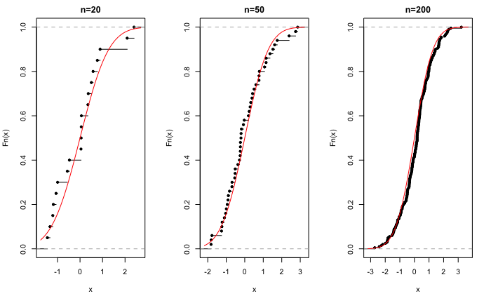
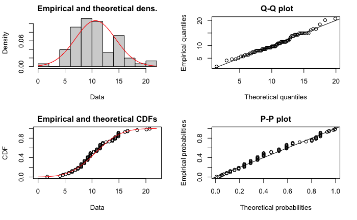
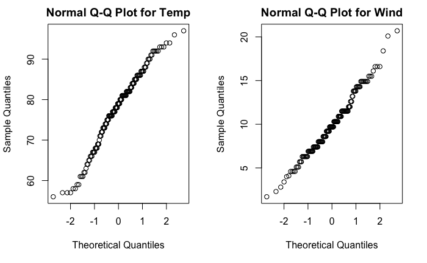

# Inferencia estadística {#Fundainfer}

*Mª Leticia Meseguer Santamaría*$^{a}$ y *Manuel Vargas Vargas*$^{a}$

$^{a}$ Universidad de Castilla-La Mancha

## Introducción {#introinfer}

Cuando se estudian fenómenos mediante variables aleatorias, el objetivo estadístico básico es determinar cuáles son las distribuciones probabilísticas que rigen dichas variables o algunas características determinadas por ellas. Es este comportamiento aleatorio el que permite hacer predicciones con unos márgenes de error conocidos, analizar y cuantificar la relación entre variables, evaluar si hipótesis o modelos teóricos son congruentes con los datos disponibles, etc. Así, en la práctica, cuando se estudia una variable $X$, lo habitual es que se desconozca su distribución probabilística, $F(x)$, pero que se disponga de un conjunto de realizaciones $(x_1,...,x_n)$, también llamado muestra, valores concretos de dicha variable a partir de los cuales "aproximar" la distribución desconocida.

La inferencia estadística proporciona las herramientas y técnicas que permiten, a partir de la información muestral, extrapolar resultados a la distribución poblacional con márgenes de error conocidos. Un primer objetivo (más detallado en el Cap. \@ref(muestreo)) es analizar qué condiciones debe cumplir la muestra para que su información sea válida y extrapolable a toda la población (es la conocida como **teoría de muestreo**). Un segundo objetivo es establecer los mecanismos que permitan dicha extrapolación manteniendo controlados los errores de muestreo.

Es habitual que se conozca (o se asuma) que la distribución poblacional $F(x)$ pertenezca a alguna familia paramétrica, es decir, que se asuma su forma funcional pero que dependa de algunos parámetros (lo más frecuente es que se asuma la normalidad, pero podría ser cualquiera de los modelos paramétricos existentes). Se habla entonces de **inferencia paramétrica**, ya que se usa la información muestral para determinar los "mejores" valores (bajo algún criterio) de los parámetros que rigen la distribución poblacional, existiendo tres planteamientos básicos: estimación puntual\index{estimación!puntual} (Sec. \@ref(estimpuntual)), por intervalo\index{intervalos de confianza} (Sec. \@ref(estimintervalos)) y contraste de hipótesis\index{contraste!de hipótesis} (Sec. \@ref(contrhip)).
\index{estimación!por intervalos}

También hay situaciones en las que la forma funcional de la distribución poblacional es desconocida, o se duda de que la familia paramétrica considerada sea adecuada. En estos casos, bajo el nombre genérico de **inferencia no paramétrica**, se plantean contrastes que buscan determinar cuándo es posible asumir un modelo concreto de distribución, entre los que destacan, por su frecuente uso, los contrastes de normalidad (Sec. \@ref(contrnormalidad)). Otra alternativa que permite aproximar características poblacionales sin asumir ninguna distribución poblacional concreta es el **remuestreo**, fundamentalmente el denominado *bootstrap* (se aborda en el Cap. \@ref(muestreo)).

## Muestreo aleatorio simple {#mas}

Al estudiar una variable poblacional, $X$, de la que se desconoce su distribución, llamada **distribución poblacional, $F(x)$**, se utiliza la información suministrada por una **muestra** obtenida por algún método de muestreo probabilístico que garantice que sea representativa de la variable poblacional. 

En la mayoría de los casos y técnicas estadísticas se asume que la muestra está obtenida mediante el método básico de muestreo, conocido como **muestreo aleatorio simple**, consistente en seleccionar totalmente al azar y con reemplazo a los individuos de la muestra, por lo que todos tienen la misma probabilidad de formar parte de ella. De esta forma, dada una distribución poblacional $F(x)$, una muestra aleatoria simple (m.a.s.)\index{muestra!aleatoria simple} es una realización de un conjunto de $n$ variables aleatorias independientes e idénticamente distribuidas $X=(X_1,...,X_n)$, denominadas **variables muestrales** y cuya **distribución conjunta** es de la forma:

\begin{equation}
F(X_1,...,X_n)=F_{X_1}(x_1)...F_{X_n}(x_n)=F(x_1)...F(x_n).
(\#eq:distrconjunta)
\end{equation}

Una herramienta básica para la inferencia es la **distribución empírica de la muestra**, definida como:

\begin{equation}
(\#eq:distrempirica)
\hat{\mathbb{F}}_n (x)= {1 \over n} \sum_{i=1}^n \mathbb{I}_{(-\infty ,x]}(X_i),
\end{equation}

donde $\mathbb{I}_{(-\infty ,x]}(X_i)$ es una función indicadora que toma el valor 1 si $X_1 \leq x$ y 0 en caso contrario.[^Infe1]

[^Infe1]: Es decir, la distribución empírica de la muestra indica, para cada valor *x*, la proporción de elementos de la muestra que toman un valor menor o igual que él.

La gran ventaja del muestreo aleatorio simple consiste en que, dada una m.a.s. $(X_1,..., X_n)$:

\begin{equation}
(\#eq:glivenko)
\underset {n \rightarrow \infty}{lim} \ E \left [ {\left ( \hat{\mathbb{F}}_n (x)- F(x) \right )^2} \right ] = 0,
\end{equation}

expresión conocida como **teorema de Glivenko-Cantelli**. Este resultado es fundamental en inferencia, pues garantiza que el muestreo aleatorio simple produce muestras representativas de la población, ya que, a medida que aumenta el tamaño muestral, la distribución empírica de la muestra se aproxima cada vez más a la distribución poblacional (véase Fig. \@ref(fig:150015distrempir)).[^Infe2] Así, cualquier característica (media, varianza...) de una distribución poblacional puede ser aproximada por su equivalente en la distribución empírica.

[^Infe2]: Un tema que se abordará en el Cap. \@ref(muestreo) es la determinación del tamaño muestral necesario para que la aproximación tenga un error menor que uno prefijado.


```r
par(mfrow = c(1, 3))
set.seed(196)
x1 <- rnorm(20)
plot.ecdf(x1, main = "n=20")
curve(pnorm, add = TRUE, col = "red")
x2 <- rnorm(50)
plot.ecdf(x2, main = "n=50")
curve(pnorm, add = TRUE, col = "red")
x3 <- rnorm(200)
plot.ecdf(x3, main = "n=200")
curve(pnorm, add = TRUE, col = "red")
```

<div class="figure" style="text-align: center">

<p class="caption">(\#fig:150015distrempir)Distribución empírica para muestras de diferente tamaño de una distribución normal.</p>
</div>

Es muy frecuente que, a efectos de inferencia, no se estudie el comportamiento aleatorio de toda la muestra (su distribución conjunta), sino que interese el comportamiento de una función de la muestra que no dependa de ningún valor desconocido, $T(X)=T(X_1,...,X_n)$, llamada genéricamente **estadístico muestral**; dicho comportamiento vendrá determinado por la **distribución en el muestreo** del estadístico $T(X)$. El hecho de utilizar una m.a.s. permite establecer resultados de interés sobre los estadísticos o, en algunos casos, incluso obtener la distribución en el muestreo exacta de los estadísticos más usuales (Sec. \@ref(pobnormales)).

Así, dadas una variable poblacional $X$ con varianza finita y una m.a.s., se define la **media muestral** (aleatoria) como:

\begin{equation}
(\#eq:mediamuestral)
\bar X = \frac {X_1, + ... + X_n}{n}.
\end{equation}

El hecho de utilizar una m.a.s. garantiza que:

\begin{equation}
E[\bar X] = E[X] \ \text{;} \ Var(\bar X)=\frac{Var(X)}{n}.
\end{equation}

Este resultado es muy útil, ya que indica que la variabilidad de la media muestral es más pequeña que la variabilidad de la variable poblacional, siendo inversamente proporcional al tamaño muestral.

Otro estadístico muy utilizado es la **varianza muestral**,^[La varianza muestral, como estadístico, también es aleatorio.] que se define como:

\begin{equation}
(\#eq:varmuestral)
S^2 = {\sum_{i=1}^n \left ( X_i - \bar X \right ) ^2 \over n}.
\end{equation}

En este caso, su esperanza es:

\begin{equation}
E[S^2] = \frac {n-1}{n} Var[X],
\end{equation}

que no coincide con la varianza poblacional. Para evitar este hecho, se define la **cuasivarianza muestral** (aleatoria):

\begin{equation}
(\#eq:cuasivarmuestral)
S_c^2 = {\sum_{i=1}^n \left ( X_i - \bar X \right ) ^2 \over {n-1}},
\end{equation}

estadístico para el que sí se cumple que $E[S_c ^2] = Var[X]$, ya que existe una relación de proporcionalidad entre ambos estadísticos $nS^2 = (n-1)S_c ^2$.[^Infe3]

[^Infe3]: Muchos textos, sobre todo anglosajones, no hacen esta distinción, sino que denominan directamente "varianza muestral" a la cuasivarianza. En **R**, por ejemplo, las funciones `var()` o `sd()` proporcionan la cuasivarianza y cuasidesviación típica muestrales respectivamente, matiz que hay que tener siempre presente.

## Estimación puntual {#estimpuntual}
\index{estimación!puntual}
Sea una población caracterizada por una distribución poblacional, $F (x,\theta)$, de una familia paramétrica de la que se desconoce el valor del parámetro $\theta \in \Theta$, donde $\Theta$ es el espacio paramétrico (conjunto de posibles valores de $\theta$). Dada una m.a.s. $X=(X_1,...,X_n)$, se considera como *estimador* de $\theta$ a un estadístico muestral cuyo resultado sea un posible valor del parámetro:

\begin{equation}
(\#eq:estimador)
\hat{\theta}=T(X)=T(X_1,...,X_n) \in \Theta.
\end{equation}

La siguiente expresión corresponde al **error cuadrático medio** de un estimador:

\begin{equation}
(\#eq:ecm)
ECM_\theta (\hat{\theta})=E_\theta \left[ { \left ( \hat{\theta}-\theta \right ) ^2 } \right],
\end{equation}

que proporciona un valor medio del error que se comete al "aproximar" el verdadero valor $\theta$ por el resultado del estimador $\hat{\theta}$.
Así, el criterio de "mínimos cuadrados"\index{estimador!de mínimos cuadrados} propone utilizar el estimador que minimiza el error cuadrático medio:

\begin{equation}
\hat{\theta}_{MC}= \underset {\hat{\theta}} {min} E_\theta \left[ {\left ( \hat{\theta}-\theta \right )^2} \right].
\end{equation}

Desarrollando la expresión del ECM (\ref{eq:ecm}), este se puede reexpresar como:

\begin{equation}
ECM_\theta (\hat{\theta})=Var_\theta (\hat{\theta}) + \left ( E_{\theta}(\hat{\theta}) - \theta \right ) ^2  = Var_\theta (\hat{\theta}) + b_\theta ^2 (\hat{\theta}),
\end{equation}

donde $b_\theta(\hat{\theta}) =\left ( E_{\theta}(\hat{\theta}) - \theta \right )$ se conoce como **sesgo** del estimador (*bias*, en inglés). Así, el ECM de un estimador depende de su varianza y de su sesgo al cuadrado.

Por tanto, la determinación del "mejor" estimador, bajo el criterio de mínimos cuadrados, se puede llevar a cabo en dos pasos:

- Seleccionar estimadores "insesgados", es decir, de sesgo cero, o sea, $E(\hat{\theta})=\theta$ (el valor medio del estimador coincide con el parámetro).

- De entre los estimadores inesgados, seleccionar el de varianza mínima,  $Var(\hat{\theta}_{MC})= \underset {\hat{\theta}} {min} Var(\hat{\theta})$.

Queda fuera del objetivo de este capítulo plantear la obtención del estimador de mínimos cuadrados para cualquier distribución poblacional y parámetros, que el lector interesado puede encontrar en cualquier texto teórico de inferencia estadística [@martin2007fundamentos; @CasellaBerger2007; @Blais2020; @Almudevar2021].

Otro planteamiento para encontrar estimadores puntuales se basa en la función de densidad conjunta de la muestra, que depende de esta y del parámetro que caracteriza a la distribución poblacional:

\begin{equation}
(\#eq:verosimilitud)
f(x_1,...,x_n;\theta)=f(x_1;\theta)...f(x_n;\theta)=L(\theta;x_1,...,x_n).
\end{equation}

Considerando el parámetro como fijo, la función se interpreta como la densidad de probablilidad de la muestra. Sin embargo, si se considera que la muestra está dada, entonces se puede interpretar como una función del parámetro que mide la **verosimilitud** (*likelihood*, en inglés) de cada valor del parámetro en función de la muestra obtenida. Así, el criterio para determinar el "mejor" estimador puede ser seleccionar aquel que maximiza la función de verosimilitud; se obtiene entonces el conocido como **estimador máximo verosímil**: \index{estimador!máximo verosímil}

\begin{equation}
\hat{\theta}_{MV}= \underset {\theta} {max} L(\theta;x_1,...,x_n).
\end{equation}

Para el cálculo del estimador máximo verosímil no se suele utilizar la función de verosimilitud, sino su logaritmo (que alcanza los máximos y mínimos en los mismos puntos), derivando respecto al parámetro e igualando a cero (ecuación de verosimilitud).

Este método suele proporcionar estimadores con buenas propiedades estadísticas y, en muchos casos, suele conducir al mismo resultado que el método de mínimos cuadrados.[^Infe4] En las distribuciones usuales, es relativamente sencillo obtener la ecuación de verosimilitud y resolverla, por lo que se dispone de estimadores máximo verosímiles conocidos. En modelos más elaborados, la resolución de la ecuación de verosimilitud se puede complicar, hasta el extremo de que haya que recurrir a métodos numéricos de aproximación.

[^Infe4]: En las distribuciones usuales es así, salvo que el estimador de máxima verosimilitud sea sesgado, como es el caso de estimar la varianza en una distibución normal.

Una alternativa computacionalmente más sencilla es la basada en el conocido como **método de los momentos**. El planteamiento básico es expresar el parámetro en función de los momentos poblacionales (esperanza, varianza, etc.) y utilizar como estimador la misma función pero de los momentos muestrales (media muestral, varianza muestral, etc.). En las distribuciones más usuales, los parámetros suelen ser momentos poblacionales o transformaciones simples de estos, por lo que el método de los momentos es muy sencillo. Como contrapartida, es más difícil evaluar las propiedades estadísticas de estos estimadores, salvo que coincidan con los de mínimos cuadrados o de máxima verosimilitud.

En **R**, el paquete `fdistrplus` dispone de la función `fitdist()`, que permite la obtención de los estimadores para las distribuciones usuales por diversos métodos, incluidos el de máxima verosimilitud (`mle`) y el de los momentos (`mme`).


## Estimación por intervalos {#estimintervalos}
\index{intervalos de confianza}
Dado que todo estimador es una variable aleatoria, su valor concreto, la "estimación" del parámetro $\hat\theta$, depende de la muestra. Esta variación muestral ocasiona incertidumbre sobre la estimación. Una forma de incluir esta variabilidad en la estimación puede consistir en sustituir la estimación puntual por un intervalo de valores en el que se tenga un cierto nivel de confianza de que contenga al verdadero valor del parámetro.

El método más extendido para obtener **intervalos de confianza** consiste en utilizar un estimador puntual y su distribución en el muestreo para construir un intervalo que contenga, con cierta probabilidad $(1-\alpha)$, el verdadero valor $\theta$:

\begin{equation}
(\#eq:interconfianza)
IC_{(1-\alpha)}=[LIC , LSC] \ \text{tal que} \ P \left ( LIC \leq \theta \leq LSC  \right ) = (1-\alpha),
\end{equation}

donde los límites inferior (LIC) y superior (LSC) de confianza, denominados **valores críticos**, dependen de la desviación típica del estimador y de constantes asociadas a su distribución y al nivel de confianza $(1-\alpha)$. En esta ecuación, tanto el LIC como el LSC son variables aleatorias; cuando se utilizan los datos de una muestra, se convierten en valores reales, por lo que no se puede hablar de "probabilidad de que el parámetro esté dentro del intervalo", sino que se habla de "confianza en que el intervalo contenga el valor del parámetro". 

En **R**, el paquete `Rlab` permite obtener los valores críticos de las distribuciones usuales a través de los cuantiles, anteponiendo *q* al nombre de la distribución (véase la Tabla \@ref(tab:distribuciones)); por ejemplo, usando las funciones `qbinom()`, `qnorm()`, `qt()`, `qf()`, etc. Igualmente, el paquete `DescTools` dispone de funciones para calcular intervalos de confianza en poblaciones normales para la media (`MeanCI()`), la diferencia de medias (`MeanDiffCI()`), la mediana (`MedianCI()`), cualquier cuantil (`QuantileCI()`) o la varianza (`VarCI()`). Por último, en el caso de no conocer la distribución en el muestreo del estimador, se puede recurrir al remuestreo por *bootstrap*, que se detallará en el Cap. \@ref(muestreo), indicando el método `boot` en las funciones anteriores.


## Contrastes de hipótesis {#contrhip}
\index{contraste!de hipótesis}
Hay situaciones donde no interesa tanto estimar el valor de un parámetro, sino decidir si la información muestral es congruente con algún valor concreto del parámetro. En estos casos, se puede establecer como **hipótesis** que el parámetro toma un valor concreto y **contrastar** si es verosímil haber obtenido el resultado muestral dado. Este planteamiento se conoce como **contrastes de significación**.

Así, se establece una hipótesis, históricamente conocida como **hipótesis nula**, que determina un valor del parámetro:

\begin{equation}
H_0 \equiv \theta = \theta_0.
\end{equation}

Suponiendo cierta la hipótesis nula, la distribución muestral del estimador permite obtener la probabilidad de observar un valor del estimador más "distante" del valor del parámetro fijado en la hipótesis nula que el obtenido en la muestra, probabilidad conocida como **$\bf{\textit{p}}-$valor**: si es muy pequeño, es muy poco probable que se observe el valor obtenido en la muestra cuando la hipótesis es cierta, por lo que la evidencia empírica no es congruente con ella; si no es pequeño, dicho valor es probable que se observe (bajo la hipótesis nula), por lo que no habría evidencia empírica "en contra" de ella.

\index{p@\textit{p}-valor}

Se habla de **$\bf{\textit{p}}-$valor bilateral** o "a dos colas" cuando la distancia se considera tanto por la derecha como por la izquierda de la distribución del estimador bajo la hipótesis nula. En caso de que se considere solo por la izquierda o por la derecha, se habla de **$\bf{\textit{p}}-$valor unilateral** (a la izquierda o a la derecha, respectivamente) o "a una cola". La comparación (distancia) entre el valor del parámetro establecido en la hipótesis nula y el del estimador de dicho parámetro puede llevarse a cabo por diferencia (tal es el caso del contraste de medias) o por cociente (caso de los contrastes de varianzas).

Habitualmente, se considera que un $p-$valor por debajo de 0,05 ya indica que la evidencia empírica no permite asumir como cierta la hipótesis nula, expresándose como que el valor del parámetro es "significativamente distinto (menor o mayor)" que $\theta_0$. También es posible interpretar el $p-$valor como "la probabilidad máxima de cometer el error de rechazar la hipótesis nula cuando es cierta", abreviado como "tamaño del error si se rechaza la hipótesis nula".

Estos contrastes de significación, originalmente desarrollados por Ronald Fisher, fueron incluidos en un esquema de toma de decisiones por Jerzy Neyman y Egon Pearson, planteando que, de no ser cierta la hipótesis nula, se debe plantear una hipótesis alternativa $H_1$. La decisión de qué hipótesis resulta más congruente con los datos se basa en la comparación por cociente de las verosimilitudes de la muestra bajo cada una de ellas, decidiendo el rechazo de la hipótesis nula a favor de la alternativa cuando dicho cociente es, en probabilidad, inferior a un valor prefijado, $\alpha$, conocido como **nivel de significación**. Dependiendo de la estructura de las hipótesis (simples, si solo determinan un valor del parámetro, o compuestas, si determinan más de uno; a su vez, unilaterales si los valores son todos menores, o mayores, que uno dado, o bilaterales en caso contrario) la regla de decisión del contraste resulta más o menos compleja de obtener.

Cuando se adopta el planteamiento decisional de Neyman-Pearson, el nivel de significación permite evaluar la probabilidad de rechazar la hipótesis nula cuando es cierta (conocida también como **probabilidad de error de tipo I**, $\alpha$), pero también la probabilidad de aceptar como cierta $H_0$ cuando es más correcta $H_1$ (denominada **probabilidad de error de tipo II**, $\beta$) o, equivalentemente, su complementario: la probabilidad de rechazar $H_0$ cuando $H_1$ es más correcta, probabilidad conocida como **potencia del contraste**, $(1-\beta)$. Si la hipótesis alternativa es simple, es posible evaluar la potencia, por lo que se tiene una medida probabilística de la magnitud de ambos errores (de tipo I y de tipo II), lo cual permite una valoración completa del resultado de la regla de decisión (contraste de hipótesis). Sin embargo, si la hipótesis $H_1$ es compuesta, la magnitud de la potencia es una función evaluada en el rango de valores que establezca dicha hipótesis. En este caso, se dispone de una medida probabilística del error de tipo I pero no del error de tipo II, puesto que depende de valores concretos del parámetro que no son especificados en la hipótesis alternativa, $H_1$.

Computacionalmente, dada la información muestral, es más fácil calcular el *p*--valor que plantear el esquema de decisión de Neyman-Pearson, por lo que es la estrategia utilizada en la práctica. 

Dado el carácter breve e introductorio de este capítulo, no se profundizará más en este esquema de decisión, que puede consultarse, por ejemplo, en @CasellaBerger2007, @Blais2020 o @Almudevar2021, entre otros muchos.


## Inferencia estadística paramétrica sobre poblaciones normales {#pobnormales}

Como consecuencia del teorema central del límite (Sec. \@ref(tcl)), el supuesto de que la distribución poblacional es una normal es el caso más habitual en la práctica, siendo requisito básico en muchísimas técnicas estadísticas. En este caso, las distribuciones muestrales de los estimadores de los parámetros poblacionales, tanto de la media $\mu$ como de la varianza $\sigma^2$, son conocidas, lo que facilita la construcción de intervalos de confianza y contrastes de hipótesis.

Así, dada una distribución poblacional normal y una m.a.s. de tamaño $n$, 

- Para estimar la varianza poblacional, $\sigma ^2$, el estimador máximo verosímil es la varianza muestral \@ref(eq:varmuestral), que es sesgado. El estimador insesgado es la cuasivarianza muestral \@ref(eq:cuasivarmuestral). Sus distribuciones en el muestreo, en el caso habitual de que la media poblacional sea desconocida, son:

\begin{equation}
{n S^2 \over \sigma^2} = {(n-1) S_c^2 \over \sigma^2} \sim \chi^2_{n-1}.
\end{equation}

Así, el intervalo de confianza a nivel $(1-\alpha)$ es:

\begin{equation}
IC_{(1-\alpha)} =\left [ {n s^2 \over {\chi^2_{n-1,\alpha /2}}} , {n s^2 \over {\chi^2_{n-1, 1-\alpha /2}}}  \right ],
\end{equation}

o, equivalentemente, usando la proporcionalidad entre varianza y cuasivarianza muestrales:

\begin{equation}
IC_{(1-\alpha)} = \left [ {(n-1) s_c^2 \over {\chi^2_{n-1,\alpha /2}}} , {(n-1) s_c^2 \over {\chi^2_{n-1, 1-\alpha /2}}}  \right ],
\end{equation}

donde $\chi ^2 _{n-1,\alpha / 2}$ representa el cuantil en la distribución.^[Nótese que en los IC se utilizan los valores observados del estimador,  $s^2$ o $S_c^2$, según se haya utilizado como estimador la varianza o la cuasivarianza. Lo mismo ocurre en los demás intervalos.] 

Para el contraste de $H_0 \equiv \sigma^2 = \sigma_0^2$, la "distancia" es ${n s^2 \over \sigma^2_0} = {(n-1) s_c^2 \over \sigma_0^2}$, lo que permite calcular los *p*--valores mediante una distribución $\chi^2_{n-1}$.^[Nótese que la "distancia" no involucra solo al valor observado del estimador y el valor del parámetro bajo la hipótesis nula, sino también una constante (en este caso $n$ o $n-1$). Ello se hace porque así el valor de esta "distancia" puede compararse directamente con el facilitado por las tablas de la distribución probabilística correspondiente (en este caso una Chi-cuadrado).]

Para el caso de querer estimar la desviación típica, basta con calcular la raíz cuadrada del estimador de la varianza, o si se busca un intervalo de confianza, la raíz de los extremos del intervalo para la varianza. Los contrastes de hipótesis son equivalentes, ya que $\sigma^2=\sigma_0^2 \equiv \sigma = \sigma_0$.

- Para estimar el parámetro $\mu$ se utiliza el estimador media muestral $\hat{\mu} = \bar X$, en el que coinciden los métodos de mínimos cuadrados, de máxima verosimilitud y de los momentos, siendo insesgado y de varianza mínima.

Si la varianza poblacional es conocida, la distribución en el muestreo de la media muestral es:

\begin{equation}
\bar X \sim N \left ( \mu , {\sigma \over {\sqrt{n}}} \right ) \equiv {\bar X - \mu \over {\sigma / \sqrt n}} \sim N(0,1).
\end{equation}

El intervalo de confianza a nivel $(1-\alpha)$ es:

\begin{equation}
IC_{(1-\alpha)} =\left [ \bar x - z_{\alpha / 2} {\sigma \over \sqrt n} , \bar x + z_{\alpha / 2} {\sigma \over \sqrt n}  \right ],
\end{equation}

donde $z_{\alpha/2}$ representa el cuantil en una distribución normal estándar.

Para el contraste de $H_0 \equiv \mu = \mu_0$, la "distancia" es $\bar X - \mu_0 \over \sigma / \sqrt n$, lo que permite calcular los $p-$valores, directamente, mediante una distribución $N(0,1)$.

Si la varianza poblacional es desconocida, se sustituye por su estimación, por lo que la distribución en el muestreo de la media muestral es:

\begin{equation}
{\bar X - \mu \over {S / \sqrt {n-1}}} \equiv {\bar X - \mu \over {S_c / \sqrt n}} \sim t_{n-1}.
\end{equation}

El intervalo de confianza a nivel $(1-\alpha)$ es:

\begin{equation}
IC_{(1-\alpha)} =\left [ \bar x - t_{n-1,\alpha / 2} {s \over \sqrt {n-1}} , \bar c + t_{n-1, \alpha / 2} {s \over \sqrt {n-1}}  \right ],
\end{equation}

o, equivalentemente:

\begin{equation}
IC_{(1-\alpha)} = \left [ \bar x - t_{n-1,\alpha / 2} {s_c \over \sqrt n} , \bar x + t_{n-1, \alpha / 2} {s_c \over \sqrt n}  \right ],
\end{equation}

donde $t_{n-1,\alpha/2}$ representa el cuantil de la distribución *t*--Student.

Para el contraste de $H_0 \equiv \mu = \mu_0$, la "distancia" es ${\bar X - \mu_0 \over S / \sqrt {n-1}} = {\bar X - \mu_0 \over S_c / \sqrt n}$, lo que permite calcular los *p*--valores mediante una distribución $t_{n-1}$.

A continuación, el interés se centra en la comparación de dos poblaciones normales independientes, X e Y, a partir de muestras $(X_1,...,X_n)$ y $(Y_1,...,Y_m)$:


- Para la comparación de las varianzas poblacionales (una es mayor que la otra, o al revés; y que se lleva a cabo mediante el cociente de las correspondientes varianzas o cuasivarianzas muestrales), se tiene que: 

\begin{equation}
{{{m S_Y^2} \over {(m-1)\sigma_Y^2}} \over {{n S_X^2} \over {(n-1)\sigma_X^2}}} \equiv {S_{cY}^2 / \sigma_Y^2 \over S_{cX} ^2 / \sigma_X^2} \sim F_{m-1,n-1},
\end{equation}

lo cual permite calcular intervalos de confianza de forma idéntica a la expuesta en los casos anteriores pero con la distribución $F$. Un caso muy frecuente es querer contrastar si ambas varianzas poblacionales son iguales (el cociente entre ellas es la unidad).

- Para la comparación de las medias poblacionales (que se lleva a cabo mediante la diferencia de las correspondientes medias muestrales), el caso más común es asumir que las varianzas (aunque desconocidas) son iguales, por lo que el estimador es:

\begin{equation}
{(\bar X - \bar Y)-(\mu_X - \mu_Y) \over \sqrt{{nS_X^2+mS_Y^2} \over n+m-2} \sqrt{{1\over n} + {1 \over m}}} \sim t_{n+m-2},
\end{equation}

si se utiliza la varianza muestral como estimador de su homónima poblacional, o:

\begin{equation}
{(\bar X - \bar Y)-(\mu_X - \mu_Y) \over \sqrt{{(n-1)S_{cX}^2+(m-1)S_{cY}^2} \over n+m-2} \sqrt{{1\over n} + {1 \over m}}} \sim t_{n+m-2},
\end{equation}
si se utiliza la cuasivarianza muestral.

Al utilizarse distribuciones *t*--Student, los intervalos de confianza y contrastes de hipótesis son similares a los del caso de una única población con las correcciones pertinentes.

## Inferencia sobre poblaciones normales con **R** {#ejemplopobnorm}

Los datos sobre calidad del aire en la ciudad de Nueva York (`airquality`) incluyen la variable `Wind`, que recoge, en mph, la velocidad del viento entre el día 1 de mayo y el 30 de septiembre de 1973. Los datos de dicha variable se dividen en dos variables $X=\text{Velocidad del viento hasta el 15 de julio}$ e $Y=\text{Velocidad del viento desde el 16 de julio}$. Asumiendo que las distribuciones poblacionales son normales, se propone:

a) Obtener una estimación de la velocidad media y de la desviación típica de ambas variables, usando el método de máxima verosimilitud.


```r
library("Rlab")
library("fitdistrplus")
x <- airquality$Wind[1:76]
y <- airquality$Wind[77:153] # Se particiona la muestra en los dos períodos
mle_x <- fitdist(x, distr = "norm", method = "mle")
mle_y <- fitdist(y, distr = "norm", method = "mle")
mle_x
#> Fitting of the distribution ' norm ' by maximum likelihood 
#> Parameters:
#>       estimate Std. Error
#> mean 10.640789  0.4274723
#> sd    3.726618  0.3022685
mle_y
#> Fitting of the distribution ' norm ' by maximum likelihood 
#> Parameters:
#>      estimate Std. Error
#> mean 9.283117  0.3581657
#> sd   3.142891  0.2532613
```

El resultado muestra las estimaciones de la media y la desviación típica de la velocidad del viento (junto al "error estándar" o desviación típica de los estimadores respectivos) para las dos variables anteriormente creadas.

La orden `plot(mle_x)` permite visualizar la congruencia entre la muestra y la distribución probabilística basada en las estimaciones realizadas; por ejemplo, optando por el primer período, se obtiene la Fig. \@ref(fig:150015mle), que representa el histograma de los valores muestrales junto a la distribución teórica construida con las estimaciones.


```r
plot(mle_x)
```

<div class="figure" style="text-align: center">

<p class="caption">(\#fig:150015mle)Resultados gráficos de la estimación por máxima verosimilitud.</p>
</div>

b) Construir un intervalo de confianza para la velocidad media del viento hasta el 15 de julio, con un nivel de confianza del 95%.


```r
library("DescTools")
MeanCI(x, conf.level = 0.95)
#>      mean    lwr.ci    upr.ci 
#> 10.640789  9.783563 11.498016
```

c) Calcular un intervalo de confianza para la desviación típica de la velocidad del viento desde el 16 de julio, con un nivel de confianza del 90%.


```r
sqrt(VarCI(y, conf.level = 0.9))
#>      var   lwr.ci   upr.ci 
#> 3.163501 2.795147 3.655468
```

d) ¿Se puede considerar que las varianzas poblacionales en ambos períodos son iguales, con un nivel de significación del 1%?


```r
var.test(x, y, conf.level = 0.99, alternative = "two.sided")
#> 
#> 	F test to compare two variances
#> 
#> data:  x and y
#> F = 1.4062, num df = 75, denom df = 76, p-value = 0.1406
#> alternative hypothesis: true ratio of variances is not equal to 1
#> 99 percent confidence interval:
#>  0.7727136 2.5616496
#> sample estimates:
#> ratio of variances 
#>           1.406197
```

El estadístico *F* de Snedecor de contraste arroja un valor de 1,4062, con un $p-$valor de 0,1406. Como este $p-$valor no es pequeño (es superior al nivel de significación prefijado), no hay suficiente evidencia empírica como para rechazar la hipótesis nula de igualdad de varianzas.

e) Teniendo en cuenta los resultados del apartado anterior, ¿se puede afirmar que la velocidad media del viento en el primer período es mayor que la del segundo, con un nivel de significación del 1%?


```r
t.test(x, y, conf.level = 0.99, alternative = "greater", var.equal = TRUE)
#> 
#> 	Two Sample t-test
#> 
#> data:  x and y
#> t = 2.4212, df = 151, p-value = 0.008328
#> alternative hypothesis: true difference in means is greater than 0
#> 99 percent confidence interval:
#>  0.03918338        Inf
#> sample estimates:
#> mean of x mean of y 
#> 10.640789  9.283117
```

Un *p*--valor tan bajo (0,008, inferior al nivel de significación prefijado) indica que existe suficiente evidencia empírica como para rechazar la hipótesis nula de igualdad de medias; en otros términos, la evidencia empírica no es suficiente para rechazar, con un nivel de confianza del 99%, que la velocidad media del viento en el primer período es superior a la del segundo.


## Inferencia estadística no paramétrica: contrastes de normalidad {#contrnormalidad}

Hasta ahora, se ha supuesto que la distribución muestral del estimador era "funcionalmente" conocida, aunque dependiente de un parámetro (o varios). Sin embargo, hay situaciones donde no se conoce cómo se distribuyen los datos, debiendo decidir qué distribución los ha generado. Es lo que se conoce como **inferencia estadística no paramétrica**. En este capítulo no se aborda un planteamiento sistemático de esta rama, sino que se presenta la situación más habitual en la práctica, que es decidir si se puede mantener que una muestra proviene de una distribución normal, supuesto básico en muchas técnicas estadísticas.

Posiblemente el test más potente para contrastar la normalidad sea la prueba de Shapiro-Wilks,\index{Shapiro-Wilks} que asume como hipótesis nula que los datos están generados por una distribución normal. Un rechazo de esta hipótesis ($p-$valor muy bajo) debería hacer reflexionar sobre la adecuación de muchas técnicas y la interpretación de los resultados. En **R**, la función `shapiro.test()` proporciona dicho contraste de normalidad.

Una alternativa es el uso del test de Kolmogorov-Smirnov, diseñado para comparar las distribuciones de dos muestras, fijando que una de ellas sea la distribución normal (este test puede ser igualmente utilizado para cualquier otra distribución usual). La función `ks.test()` permite en **R** obtener los resultados de este contraste.

Para ilustrar el uso del test de Shapiro-Wilk en **R** se recurre de nuevo a los datos sobre calidad del aire en la ciudad de Nueva York del ejemplo anterior (Sec. \@ref(ejemplopobnorm)) y se contrasta si se puede asumir que las variables `Temp` y `Wind` están generadas por distribuciones normales:


```r
shapiro.test(airquality$Temp)
#> 
#> 	Shapiro-Wilk normality test
#> 
#> data:  airquality$Temp
#> W = 0.97617, p-value = 0.009319
shapiro.test(airquality$Wind)
#> 
#> 	Shapiro-Wilk normality test
#> 
#> data:  airquality$Wind
#> W = 0.98575, p-value = 0.1178
```

Para la variable `Temp` el *p*--valor (0,0093) es muy bajo en comparación con los niveles de significación habituales (0,01; 0,05), por lo que hay suficiente evidencia empírica como para rechazar que dicha variable tenga una distribución normal. Por el contrario, en el caso de la variable `Wind`, el *p*--valor (0,1178) no es pequeño, por lo que no hay suficiente evidencia como para rechazar que esté generada por una distribución normal. La Fig. \@ref(fig:150015qqplots) muestra la comparación entre los cuantiles empíricos de ambas variables y los teóricos de una distribución normal.


```r
par(mfrow = c(1, 2))
qqnorm(airquality$Temp, main = "Normal Q-Q Plot for Temp")
qqnorm(airquality$Wind, main = "Normal Q-Q Plot for Wind")
```

<div class="figure" style="text-align: center">

<p class="caption">(\#fig:150015qqplots)Gráficos Q-Q normales para las variables Temp (izq.) y Wind (dcha.).</p>
</div>

::: {.infobox_resume data-latex=""}
### Resumen {-}

+ La inferencia estadística permite estimar la distribución poblacional de una variable a partir de la información suministrada por una muestra. Se abordan los métodos de estimación puntual de los principales parámetros poblacionales y la construcción de intervalos de confianza para ellos, así se implementan y resuelven una serie de contrastes de significación sobre diversas hipótesis.

+ Para el caso de poblaciones normales, se desarrollan las expresiones operativas de los métodos anteriores. 

+ Igualmente, en el ámbito de la inferencia no paramétrica, se presenta un contraste de normalidad que permite decidir cuándo el supuesto de normalidad es adecuado o no.

:::
