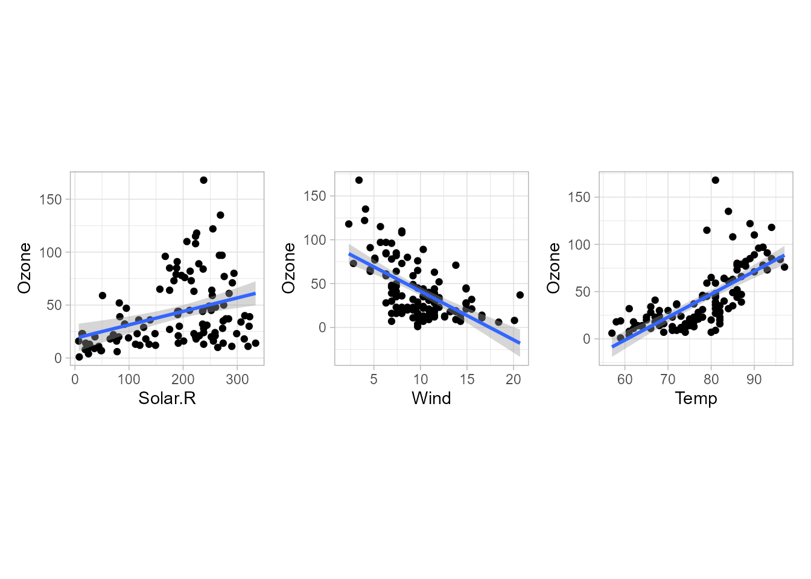
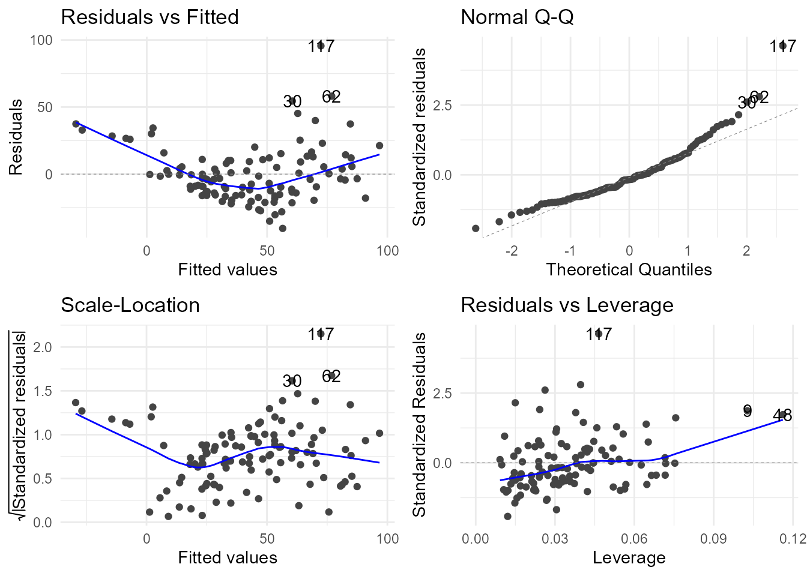
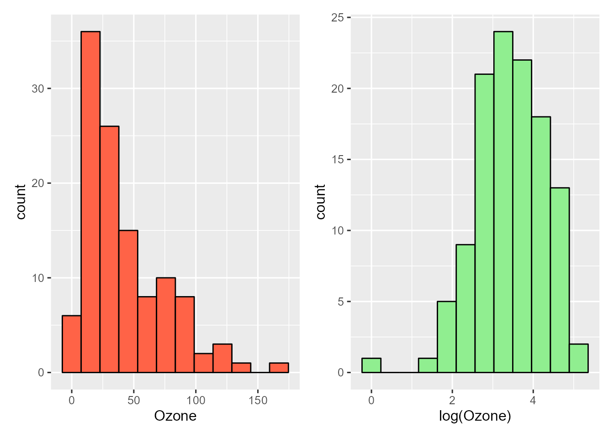
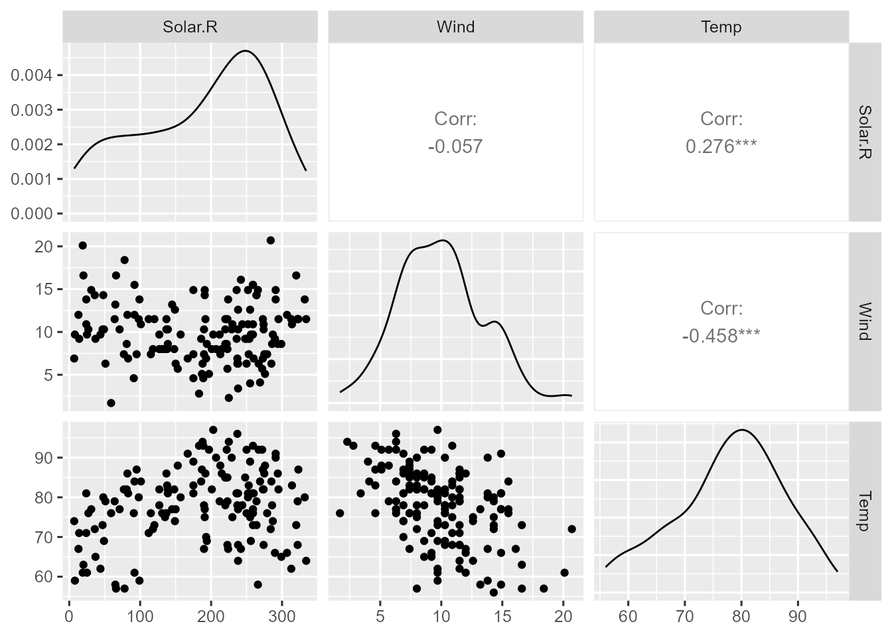

# (PART) Modelización estadística {-}

# Modelización lineal {#cap-lm}

*Víctor Casero-Alonso*$^{a}$ y 
*María Durbán*$^{b}$

$^{a}$Universidad de Castilla-La Mancha  
$^{b}$Universidad Carlos III de Madrid


## Modelización

Se acude a los **modelos de regresión** \index{modelo!de regresión} para intentar explicar la relación entre dos o más variables. Para ello se predefine un modelo que pretende explicar el comportamiento de la variable **respuesta** \index{variable!respuesta} **o dependiente**, denotada por *Y*, utilizando la información proporcionada por las **variables explicativas**\index{variable!explicativa}, también llamadas independientes o predictoras, denotadas por $X_1,\ldots,X_p$. 
Pero dichas variables pueden ser de distinto tipo. Si la variable respuesta es continua, más concretamente, si se puede asumir que sigue una **distribución de probabilidad normal**\index{distribución!normal}, y al menos una de las variables explicativas es también continua, se puede acudir a la **modelización lineal** que se desarrolla en este capítulo. Sin embargo, si la variable respuesta fuese de otro tipo, por ejemplo, dicotómica, la modelización lineal no sería adecuada. En el Cap. \@ref(cap-glm), en el que se aborda el **modelo lineal generalizado**, \index{modelo!lineal generalizado, GLM} quedará más clara esta distinción.

El primer paso en el proceso de modelización es intentar explicar una variable respuesta, que de aquí en adelante se supone continua y con distribución normal, a partir de una sola de las variables explicativas, de forma *lineal* (**modelo lineal simple**). Dicho modelo probablemente no será "bueno", no explicará bien el comportamiento de la variable respuesta si la realidad que se pretende explicar es compleja, pero podría ser *suficiente* para el propósito del estudio.^[La capacidad de explicación la proporciona el coeficiente de **bondad de ajuste** o coeficiente de determinación lineal, $R^2$ (véase la Sec. \@ref(Bondad)).]

::: {.infobox data-latex=""}
**Nota** 

Se entiende por **modelo lineal**\index{modelo!lineal} aquel cuya relación entre las variables viene determinada por una combinación *lineal* de los parámetros, por ejemplo: 

- $Y = \beta_0 + \beta_1 X + \epsilon$.
- $Y = \beta_0 + \beta_1 X_1 + \beta_2 X_2 + \beta_3 X_3 + \epsilon$.
- $Y = \beta_0 + \beta_1 X_1 + \beta_2 X_1^2 + \beta_3 X_2 + \epsilon$.

El último ejemplo refleja un modelo lineal en los parámetros, pero no lineal en las variables, por el término $X_1^2$. Ejemplos de **modelos no lineales**\index{modelo!no lineal} en los parámetros son:

- $Y = \beta_0\cdot e^{\beta_1 X_1} + \epsilon$.
- $Y = \beta_0 + X_1^{\beta_1} + \epsilon$.

:::


Por ejemplo, se sabe que el peso de una persona está relacionado con muchos factores, pero uno de los más determinantes es la altura. 
Si se recogen datos de pesos y alturas de un conjunto de personas se puede ajustar el modelo y obtener una explicación *suficiente*, aunque parcial, del peso de una persona a partir de su altura. 
Es claro que la inclusión de otras variables en el modelo puede ayudar a *explicar* mejor la variable respuesta. Se llega así al denominado **modelo de regresión lineal múltiple**\index{modelo!de regresión lineal múltiple} que se puede expresar matemáticamente como:
\begin{equation}
Y_i = \beta_0 + \beta_1 X_{1i} + \ldots + \beta_p X_{pi} + \epsilon_i, \quad \epsilon_i \sim N(0, \sigma^2), \hspace{0,2cm} i=1,\ldots,N.
(\#eq:lm)
\end{equation}
donde: 

- $\beta_0$ es el **término independiente**\index{termino@término independiente} o **constante** del modelo,
- $\beta_1, \ldots, \beta_p$ son los **coeficientes de regresión**\index{coeficientes de regresión} o **parámetros** del modelo, que se estimarán a partir de los datos observados $(x_{1i}, \ldots, x_{pi},y_i)$ y reflejan la magnitud del efecto *lineal* (constante) sobre la variable explicada *Y* de incrementos unitarios en las variables explicativas $X_j$. 
- y $\epsilon_i$ es el **término de error** del modelo\index{error!del modelo}, la parte de *Y* que no es capaz de explicar la parte determinista del mismo ($\beta_0 + \beta_1 X_{1i} + \ldots + \beta_p X_{pi}$), que se supone sigue una distribución de probabilidad normal, con media 0 y varianza constante $\sigma^2$;
- además, se asume que las **observaciones** son **independientes**\index{observaciones independientes}.

Siguiendo con el ejemplo del peso, añadir alguna variable genética, el sexo u otras, ayudará a mejorar la "bondad" del modelo lineal.
Otro ejemplo consiste en pretender explicar el salario en un determinado sector económico en función de los años de experiencia, la formación, la situación familiar, el sexo, etc., de los trabajadores.
Nótese que entre las variables explicativas sí puede haber variables de distinto tipo: continuas, categóricas, etc.^[Conviene mencionar la estrecha relación entre regresión lineal múltiple y **ANOVA con varios factores**\index{ANOVA} (véase la Sec. \@ref(anova)).] 
Ahora bien, la interpretación de los coeficientes dependerá del tipo de variable al que van asociados, como se verá en los casos prácticos (Sec. \@ref(Casos)).

Un par de referencias para ampliar conocimientos sobre este tema utilizando **R** son @faraway2002practical y  @james2013introduction.

## Procedimiento de modelización

### Estimación del modelo {#Bondad}

Los datos recogidos u observados sirven para **especificar** la relación predefinida de antemano, mediante la **estimación** de los coeficientes $\beta_i$ que mejor ajustan dicha relación, utilizando el método de **mínimos cuadrados**\index{metodo@método! de mínimos cuadrados}. 
Además, los correspondientes contrastes permiten decidir si cada coeficiente es **significativamente distinto de 0**, esto es, si tiene un *efecto* significativo\index{significativo} sobre la respuesta,^[Desde el punto de vista estadístico, la influencia/efecto sobre la respuesta no es fruto del azar.] en cuyo caso tiene sentido mantener en el modelo la variable a la que va asociado. 
En la práctica, el coeficiente estimado es *significativo* si su *p*--valor\index{p@\textit{p}-valor} (definido en la Sec. \@ref(contrhip)) asociado es suficientemente pequeño.

::: {.infobox data-latex=""}
**Nota** 

Se acepta, mayoritariamente, como "suficientemente pequeño" un *p*--valor inferior a 0,05, lo que supone un nivel de confianza en las estimaciones del 95%. 
Pero dicho valor es arbitrario y podrían considerarse otros valores de referencia. Por ejemplo, en las salidas de **R** aparecen otros tres niveles de referencia: 0,1, 0,01 y 0,001. En general, cuanto menor sea el *p*--valor más confianza se tendrá en las conclusiones.
:::

Como se avanzó anteriormente, si algún coeficiente no es significativo, procede eliminar del modelo la variable explicativa asociada. 
En tal caso, se vuelven a estimar los coeficientes de las variables que se mantienen hasta llegar a un modelo con todos los coeficientes significativos, iterando las veces necesarias.^[El proceso debe basarse en la relación entre las variables predefinidas de antemano (por ejemplo, en la formulación teórica del modelo). Por ello, a pesar de la no significatividad estadística de algún coeficiente, en ocasiones, la variable asociada se mantiene en el modelo.] Para facilitar esta labor, se han desarrollado métodos automáticos de selección de variables, basados en la comparación de la varianza residual (haciendo uso del test $F$), mediante el estadístico AIC (criterio de información de Akaike), etc.^[Consúltese el Cap. 10 de @faraway2002practical.] 
Junto con los contrastes, se pueden aportar los intervalos de confianza de los coeficientes, que, si son significativos, no contendrán el valor 0.


A la par del contraste de significación de cada coeficiente, se obtiene el **contraste de significación global del modelo**. 
La hipótesis nula es que todos los coeficientes $\beta_1, \ldots, \beta_p$ son 0. Dicho de otro modo, que el conocimiento de las variables $X_1, \ldots, X_p$ no aporta información alguna para explicar los valores de $Y$. 

También se ha de obtener la **bondad del ajuste**\index{bondad del ajuste} del modelo, normalmente medida por el **coeficiente de determinación lineal**, $R^2$\index{R cuadrado} (adimensional, que toma valores entre 0 y 1). 
Para comparar entre diferentes modelos, se utiliza el $R^2$ **ajustado/corregido**, que tiene en cuenta la composición/complejidad del modelo (número de variables, etc.).
Cuanto mejor ajuste el modelo los datos observados, más próximo a 1 será el valor de $R^2$ (1 indica una relación lineal perfecta entre la variable respuesta y las predictoras).  Por el contrario, un $R^2$ cercano a 0 indica que el modelo estimado ajusta mal los datos.   

Es habitual valorar conjuntamente la significación global del modelo, su bondad de ajuste y la significación de cada uno de los coeficientes, considerándose apropiados aquellos modelos que son globalmente *significativos* y tienen la suficiente "bondad", aunque tengan coeficientes no significativos.

### Validación del modelo{#sec-valida-lm}

Aunque el modelo sea significativo se debe **validar**, es decir, se deben someter a contraste los supuestos estadísticos que subyacen al modelo. Para ello se utilizan los **residuos**\index{residuos} del modelo, la parte de *Y* que no explica la regresión estimada o, en otros términos, la diferencia entre los valores observados y los estimados. Matemáticamente,
$$e_i = y_i - \hat{y}_i = y_i - (\hat{\beta}_0 +\hat{\beta}_1 x_{1i} + \ldots + \hat{\beta}_p x_{pi}), \hspace{0,2cm} i = 1, \ldots, N.$$ 

Los supuestos a contrastar son: 

-	Los residuos han de tener **varianza constante** (por definición tienen **media cero**). 
-	Los residuos han de seguir la **distribución** de probabilidad **normal**.
- Las observaciones tienen que ser **independientes**.
- La **relación** entre la variable respuesta y las explicativas se supone **lineal**.
-	Las variables explicativas son linealmente independientes: ninguna puede ser explicada como combinación lineal de las otras. En caso contrario, se tendría el conocido problema de la **multicolinealidad**\index{multicolinealidad} y debería quitarse del modelo la variable explicada por el resto.


### Interpretación de los coeficientes {#Sec:interp}

Una vez validado el modelo, se procede a la interpretación de los coeficientes significativos. 
Teniendo en cuenta la expresión del modelo de regresión lineal múltiple (Eq. \@ref(eq:lm)), la regla general de interpretación de cada uno de los coeficientes de regresión estimado $\hat{\beta}_j$ es simple y directa: el cambio/impacto *medio* en el valor de la variable respuesta $Y$ ante un cambio unitario de una variable explicativa cuantitativa o ante un cambio de categoría (desde la que se toma como referencia) si la variable es categórica. Y ello *ceteris paribus*, esto es, manteniendo constante el valor de las demás variables explicativas.


Habrá que tener en cuenta la magnitud de cada variable porque la influencia real en la respuesta podría ser de poca magnitud (quizá por las unidades o escala utilizada), pero estadísticamente significativa. 

### Predicción

La utilidad del modelo estimado (especificado) queda plasmada en su utilización para **predecir**\index{predicción! del modelo lineal} nuevos valores, $\hat{y_i}$, a partir del conocimiento/asignación de nuevos valores de las variables explicativas, $\{x_{1i}, \ldots, x_{pi}\}$. No obstante, dichas predicciones son valores *esperados* (*medios*), pudiéndose construir sus correspondientes intervalos de confianza.


## Procedimiento con **R**: la función `lm()`

**R** tiene implementada la función `lm()` para ajustar/estimar modelos de regresión lineal múltiple: 


```r
lm(formula, data = ..., ...)
```

El argumento mínimo necesario es `formula`, donde se predeterminará la relación entre las variables respuesta y explicativas de una forma bastante intuitiva:

- `Y ~ X` es la fórmula a utilizar para definir un modelo simple donde `Y` denota la variable respuesta y `X` la variable explicativa: $Y = \beta_0 + \beta_1 X + \epsilon$. 
- `Y ~ X1 + X2` define un modelo lineal múltiple con 2 variables explicativas: $Y = \beta_0 + \beta_1 X_1 + \beta_2 X_2 + \epsilon$.
- `Y ~ X1 + X2 + X3 - 1` elimina el término independiente, $\beta_0$, del modelo lineal múltiple de 3 variables explicativas.
- Y así sucesivamente.

En el segundo argumento, `data`, se indica el conjunto de datos donde se encuentran las variables de trabajo. No es necesario especificarlo si están en el `Environment`. 

Hay que hacer notar que **R** considera, por defecto, las variables explicativas como cuantitativas. Si se tienen variables categóricas codificadas con números hay que indicarle que las trate como categóricas, usando la función `factor()`.^[Si no está ya definida como `factor()` en el conjunto de datos.] De no hacerlo, la función las consideraría numéricas, con el consecuente error de interpretación de los coeficientes asociados.

A partir de los datos disponibles de $Y, X_1, ..., X_p$, la función `lm()` estima los coeficientes $\hat{\beta}_j$ asociados a cada variable $X_i$, mediante el **método de mínimos cuadrados**\index{metodo@método! de mínimos cuadrados}, y calcula sus errores estándar, con los que obtiene sus estadísticos de contraste (de la $t-$Student)^[Con los errores estándar también se pueden obtener los intervalos de confianza de los coeficientes.] y su significación. En el objeto `lm` que se genera también se almacenan los valores ajustados, residuos, etc., que se pueden mostrar a través de funciones genéricas disponibles en **R**. Algunas de ellas son:

- `print()`: muestra un breve resumen.
- `summary()`: proporciona un resumen completo.
- `coef()`: proporciona las estimaciones de los coeficientes del modelo.
- `confint()`: construye intervalos de confianza para los coeficientes.
- `fitted.values()`: muestra los valores ajustados del modelo (para cada observación del `data.frame`).
- `residuals()`: calcula los residuos del modelo (también para cada observación del `data.frame`).


## Casos prácticos {#Casos}

En esta sección se utilizan los datos `airquality`,^[Conjunto de datos incluido con la instalación `base` de **R**. Más información ejecutando `?airquality`.] 
que consisten en 154 medidas (de 6 variables) de calidad del aire en Nueva
York. Las variables consideradas aquí son las cuatro siguientes:

-   `Ozone`: Concentración media de ozono en la atmósfera (en ppb, partes por billón).
-   `Solar.R`: Radiación solar (en Ly, Langleys).
-   `Wind`: Velocidad media del viento (en mph, millas por hora).
-   `Temp`: Temperatura máxima diaria (en grados Fahrenheit).

El objetivo es establecer la relación entre la concentración de ozono en la atmósfera, variable respuesta, y las variables meteorológicas `Solar.R`, `Wind` y `Temp`, variables explicativas. 
Los valores disponibles de las cuatro variables permiten considerarlas como variables continuas.

<div class="figure" style="text-align: center">

<p class="caption">(\#fig:lm-airQlmsimples)Gráficos de dispersión de las variables explicativas frente a la variable respuesta.</p>
</div>

Antes de proceder con el ajuste múltiple se pueden realizar los ajustes simples, individuales.
La Fig. \@ref(fig:lm-airQlmsimples) representa 3 regresiones lineales simples de la variable respuesta `Ozone` sobre cada una de las 3 variables explicativas.
Cada gráfico muestra un **diagrama de dispersión**\index{diagrama!de dispersión} de solo dos variables, la explicativa en el eje $X$ y la respuesta en el eje $Y$, obteniéndose la comúnmente denominada **nube de puntos**. 
En tales diagramas se puede ver si entre las variables hay relación lineal, o no, y en caso de que la haya, si es positiva/directa (a mayores valores de $X$, mayores valores de $Y$) o negativa/inversa. 
En cada gráfico se ha añadido la correspondiente recta de regresión lineal (con su  correspondiente intervalo de confianza), que podría no ser la más apropiada, como parece que ocurre en las regresiones de `Ozone` sobre `Wind` y sobre `Temp`. En ambos casos, la relación parece más bien no lineal, aunque una recta podría ser suficiente (en función del interés del estudio) para explicar relativamente bien el comportamiento del nivel de concentración de ozono. El código para el obtener el primer gráfico es:

```r
library("ggplot2")
ggplot(airquality, aes(Solar.R, Ozone)) +
  geom_point() +
  theme(aspect.ratio = 1) +
  geom_smooth(method = "lm")
```


En regresión lineal múltiple no es posible visualizar en un solo gráfico la relación entre la variable respuesta y varias variables explicativas, salvo si son solo 2, en cuyo caso se tendría un gráfico en 3 dimensiones, generalmente difícil de visualizar.


### Estimación de los coeficientes

Se comienza ajustando el siguiente modelo lineal múltiple:^[Más adelante se introducirá una variable categórica para enriquecer el análisis.]
$$Ozone = \beta_0 + \beta_1 Solar.R + \beta_2 Wind + \beta_3 Temp  + \epsilon$$

La definición en **R** del modelo se puede ver como primer argumento de la función `lm()`. El objeto que genera la función `lm()` se guarda bajo el nombre de `airq_lm` y, a continuación, se muestra su resumen con `summary()`:


```r
airq_lm <- lm(Ozone ~ Solar.R + Wind + Temp, data = airquality)
summary(airq_lm)
#> 
#> Call:
#> lm(formula = Ozone ~ Solar.R + Wind + Temp, data = airquality)
#> 
#> Residuals:
#>     Min      1Q  Median      3Q     Max 
#> -40.485 -14.219  -3.551  10.097  95.619 
#> 
#> Coefficients:
#>              Estimate Std. Error t value Pr(>|t|)    
#> (Intercept) -64.34208   23.05472  -2.791  0.00623 ** 
#> Solar.R       0.05982    0.02319   2.580  0.01124 *  
#> Wind         -3.33359    0.65441  -5.094 1.52e-06 ***
#> Temp          1.65209    0.25353   6.516 2.42e-09 ***
#> ---
#> Signif. codes:  0 '***' 0.001 '**' 0.01 '*' 0.05 '.' 0.1 ' ' 1
#> 
#> Residual standard error: 21.18 on 107 degrees of freedom
#>   (42 observations deleted due to missingness)
#> Multiple R-squared:  0.6059,	Adjusted R-squared:  0.5948 
#> F-statistic: 54.83 on 3 and 107 DF,  p-value: < 2.2e-16
```

La salida del `summary()` proporciona las estimaciones de los coeficientes del modelo (columna `Estimate`).
El término independiente aparece como `(Intercept)` y toma el valor $\beta_0$ = -64,3421, el coeficiente asociado a `Solar.R` es $\beta_1$ = 0,05982, etc. 
También aparecen sus *p*--valores asociados (columna `Pr(>|t|)`), pudiéndose comprobar que los 4 coeficientes son significativos al 5%.
Según la leyenda `Signif. codes`, a mayor número de asteriscos, mayor significación del coeficiente (menor *p*--valor). Así, los coeficientes de `Temp` y `Wind` son más significativos que el de `Solar.R`. 

También se pueden apreciar (penúltima línea) dos medidas de la bondad del ajuste del modelo considerado: el R cuadrado múltiple y el R cuadrado múltiple ajustado. En el ejemplo, el $R^2$(ajustado) es 0,5948, que se podría considerar "suficiente" o no en función del objetivo del estudio, aunque, en este caso, está claro que el modelo no explica suficientemente bien la concentración de ozono. 

En la última línea de la salida aparece información sobre el contraste global del modelo: valor del estadístico $F$, grados de libertad y *p*--valor asociado. Como se aprecia, el modelo es globalmente significativo (*p*--valor del orden de $10^{-16}$). 

### Validación 

Lo anterior carece de **validez** si no se satisfacen las hipótesis del modelo mencionadas en la Sec. \@ref(sec-valida-lm), principalmente las relativas a varianza constante (homocedasticidad) y normalidad. Para ello se realiza un análisis de residuos. La función `autoplot()` del paquete `ggfortify` proporciona los gráficos que se muestran en la Fig. \@ref(fig:lm-residuosOzone).

\index{contraste!de Shapiro-Wilk}

```r
library("ggfortify")
autoplot(airq_lm) +
  theme_minimal()
```

<div class="figure" style="text-align: center">

<p class="caption">(\#fig:lm-residuosOzone)Gráficos de residuos.</p>
</div>

Por un lado, el gráfico de residuos frente a valores ajustados (*fitted*) muestra cierta heterocedasticidad (varianza cambiante con el valor en el eje X) y no linealidad (ya apreciable de forma individual en la Fig. \@ref(fig:lm-airQlmsimples)).
Por su parte, el gráfico normal Q-Q, que enfrenta los residuos estandarizados con los cuantiles de la distribución normal, indica que los residuos presentan desviaciones de la normalidad en ambas colas. 

Para completar el análisis gráfico se puede acudir a contrastes de hipótesis vistos en la Sec. \@ref(contrhip). El más habitual para contrastar normalidad es el de **Shapiro-Wilk**, que se implementa en **R** con la función `shapiro.test()`.^[Se pueden encontrar otros contrastes de normalidad en el paquete `nortest`.] Para contrastar la homocedasticidad se puede utilizar alguno de los tres tests implementados para tal fin en el paquete `lmtest()`: el de Breusch-Pagan `bptest()`, el de Goldfeld-Quandt `gqtest()` o el de Harrison-McCabe `hmctest`.
\index{contraste!de breusch-Pagan@de Breusch-Pagan}


```r
shapiro.test(airq_lm$residuals)
#> 
#> 	Shapiro-Wilk normality test
#> 
#> data:  airq_lm$residuals
#> W = 0.91709, p-value = 3.618e-06
lmtest::bptest(airq_lm)
#> 
#> 	studentized Breusch-Pagan test
#> 
#> data:  airq_lm
#> BP = 5.0554, df = 3, p-value = 0.1678
```

<div class="figure" style="text-align: center">

<p class="caption">(\#fig:lm-histogramas)Histogramas de las variables $Ozone$ y $log(Ozone)$.</p>
</div>
El contraste de homocedasticidad lleva a no rechazar tal supuesto (*p*-valor > 0,05), pero el contraste de Shapiro-Wilk confirma la falta de normalidad (*p*--valor < 0,05). 
A este respecto, en la Fig. \@ref(fig:lm-histogramas) se muestra el histograma de la variable `Ozone`, apreciándose que los datos recogidos presentan asimetría incompatible con la normalidad, asumida por defecto para la variable respuesta. 
Una posible solución sería el uso de una transformación logarítmica, que produce cierta simetría en la distribución de la variable, acercándola, por tanto, a la normalidad.

Para el análisis de colinealidad se pueden representar gráficos 2 a 2 de las variables explicativas, para comprobar si están o no correlacionadas (Fig. \@ref(fig:lm-airQpairs)). 

```r
library("GGally")
ggpairs(airquality[, 2:4])
```

<div class="figure" style="text-align: center">

<p class="caption">(\#fig:lm-airQpairs)Gráfico de dispersión por pares de las variables explicativas.</p>
</div>

Pero este es un análisis parcial, puesto que una de las variables explicativas podría venir explicada por el resto o varias de ellas. Por si este fuera el caso, conviene calcular también los **factores de inflación de la varianza** (VIF), que indican el incremento de la varianza estimada del coeficiente de regresión de una determinada variable explicativa como consecuencia de la colinealidad con las demás [para más detalle, véase el Cap. 3 de @james2013introduction].

El mínimo valor de VIF es 1, no existiendo límite superior. Una regla general para interpretar los VIF es la siguiente: si el VIF de una variable explicativa $X_j$ es 1, no hay correlación entre ella y cualquier otra variable explicativa del modelo. Si está entre 1 y 5, la correlación es moderada y no provoca graves problemas. Si es mayor que 5, la correlación es fuerte y, probablemente, las estimaciones de los coeficientes y los *p*--valores resultantes de la estimación del modelo no sean confiables.


Los VIF se pueden obtener mediante la función `vif()` del paquete `car`:

```r
car::vif(airq_lm)
#>  Solar.R     Wind     Temp 
#> 1.095253 1.329070 1.431367
```

En la Fig. \@ref(fig:lm-airQpairs) se aprecia que los gráficos de dispersión muestran ausencia de correlación entre `Solar.R` y `Wind`; sin embargo, la correlación entre `Wind` y `Temp` no parece despreciable. No obstante, todos los VIF son prácticamente unitarios, por lo que se puede concluir que el modelo no presenta multicolinealidad.


### Interpretación de los coeficientes

De acuerdo con lo dicho en la Sec. \@ref(Sec:interp) se tiene que: 

- Un incremento en `Temp` de un grado Fahrenheit, manteniéndose constantes los valores de `Wind` y `Solar.R`,^[Si estos cambian, tendrán su correspondiente impacto en el nivel de concentración de ozono.] provoca un aumento (por ser positivo el coeficiente) promedio en el nivel de concentración de ozono en el aire de 1,6521 ppb.
- El coeficiente de `Wind` es negativo, por lo que un  aumento en la variable `Wind`, *ceteris paribus*, reduce la concentración de ozono. En concreto, dicha reducción es de 3,3336 ppb por cada milla por hora que se incremente la variable `Wind`. 
- La influencia de `Solar.R` en el nivel de concentración de ozono en la atmósfera es positiva, como la de `Temp`, pero de mucha menor magnitud (por las unidades de una y otra). Concretamente, por cada langley (Ly) que se incremente `Solar.R` el nivel de concentración de ozono se eleva, *ceteris paribus*, en 0,0598 ppb.

Por tanto, el impacto promedio de un incremento unitario en la magnitud de las variables explicativas depende de la variable y de la magnitud de su coeficiente.

Conviene mencionar que las interpretaciones realizadas no deben extrapolarse a valores fuera del rango que toman las variables explicativas porque en esas regiones podrían darse otros efectos distintos del lineal que presupone el modelo estimado.

### Predicción

Aunque el modelo estimado no es adecuado, por la falta de normalidad, linealidad, etc., detectadas, a continuación se ilustra cómo obtener predicciones con la función `predict()`.
Para ello, se asignan los valores de interés a las variables explicativas del modelo, con formato `data.frame`, obteniéndose predicciones del valor medio de la variable respuesta, junto con sus intervalos de confianza o predicción, según se proporcione al argumento `interval` los valores `confidence` o `prediction`, respectivamente. 
En el siguiente ejemplo se obtienen predicciones de niveles de concentración de ozono para un par de casos elegidos arbitrariamente (el primero corresponde a `Solar.R`=50, `Wind`=5 y `Temp`=62):


```r
nueva_meteo <- data.frame(
  Solar.R = c(50, 300),
  Wind = c(5, 17),
  Temp = c(62, 90)
)
predict(airq_lm, newdata = nueva_meteo, interval = "confidence")
#>        fit      lwr      upr
#> 1 24.41075 11.01412 37.80739
#> 2 45.62141 31.46838 59.77444
predict(airq_lm, newdata = nueva_meteo, interval = "prediction")
#>        fit        lwr      upr
#> 1 24.41075 -19.662967 68.48448
#> 2 45.62141   1.311914 89.93090
```
Como se puede observar, en ambos casos la predicción puntual (`fit`) es la misma y se obtiene sustituyendo en el modelo estimado los valores de las variables explicativas para los cuales se desea realizar la predicción. 
Sin embargo, los intervalos de confianza son distintos. Con `confidence` se obtienen intervalos de confianza para el valor medio de las predicciones correspondientes a los días en los que los valores de las variables predictoras sean unos dados. Con `prediction`, el intervalo de confianza es para la predicción de un valor individual, es decir, para la predicción de un día concreto con esas condiciones meteorológicas. Los intervalos de predicción consideran tanto la incertidumbre de la estimación de un valor (debida a la estimación de los parámetros desconocidos) como la variación aleatoria de los valores individuales muestreados (las observaciones muestrales son variables aleatorias). Esto significa que el intervalo de predicción es siempre más ancho que el intervalo de confianza.


### Nuevo ajuste con `log(Ozone)`

Ante los problemas de falta de normalidad de la variable `Ozone`, se ajusta un nuevo modelo con la variable $\log(Ozone)$ como respuesta (véase Sec. \@ref(trans-vble-obj)). 
Se aprovecha para introducir una variable *dicotómica* para explicar su interpretación. 
Se define `Temp_f` dicotomizando `Temp` (tomando solo dos valores): 1, si la temperatura está por encima de su mediana; y 0, si está por debajo.


```r
mediana <- median(airquality$Temp)
Temp_f <- factor(as.numeric(airquality$Temp > mediana))
lairq_lm <- lm(log(Ozone) ~ Wind + Solar.R + Temp_f, data = airquality)
summary(lairq_lm)
#> 
#> Call:
#> lm(formula = log(Ozone) ~ Wind + Solar.R + Temp_f, data = airquality)
#> 
#> Residuals:
#>      Min       1Q   Median       3Q      Max 
#> -2.55347 -0.29689  0.02409  0.37171  1.18373 
#> 
#> Coefficients:
#>               Estimate Std. Error t value Pr(>|t|)    
#> (Intercept)  3.3879872  0.2232099  15.178  < 2e-16 ***
#> Wind        -0.0885666  0.0161038  -5.500 2.61e-07 ***
#> Solar.R      0.0030723  0.0005973   5.143 1.23e-06 ***
#> Temp_f1      0.6999123  0.1158384   6.042 2.25e-08 ***
#> ---
#> Signif. codes:  0 '***' 0.001 '**' 0.01 '*' 0.05 '.' 0.1 ' ' 1
#> 
#> Residual standard error: 0.5572 on 107 degrees of freedom
#>   (42 observations deleted due to missingness)
#> Multiple R-squared:  0.5972,	Adjusted R-squared:  0.5859 
#> F-statistic: 52.89 on 3 and 107 DF,  p-value: < 2.2e-16
```

Al redefinirse la variable respuesta y una variable explicativa del modelo, las estimaciones de los coeficientes cambian respecto al modelo anterior. 
Todos los coeficientes siguen siendo significativos al 5% (incluso al 0,1%), el modelo global también es significativo y el $R^2$(ajustado) es similar al del modelo anterior.
En el Cap. \@ref(cap-gam), en el que se abordan los modelos aditivos generalizados, se verá cómo se puede modelar la relación entre `Ozone` y el resto de variables de una forma más satisfactoria.
No obstante, este segundo modelo puede ser útil para ilustrar la relación entre las variables, sin olvidar que se ha de comprobar su validez. 
Para ello, se haría de nuevo el análisis de residuos (que se deja como tarea al lector, al obtenerse de manera idéntica al anterior).
En los gráficos de residuos se observará mayor homocedasticidad, linealidad y normalidad que en el caso anterior.


### Coeficientes de variables categóricas

A continuación, se aborda la interpretación de coeficientes asociados a variables categóricas. `Temp_f` toma los valores 0 y 1, según la temperatura sea menor o mayor que la mediana, respectivamente.
En la salida anterior de **R** solo aparece `Temp_f1`. 
El 1 final indica que el coeficiente está asociado a la categoría 1 de `Temp_f`. 
Para los cálculos con estas variables categóricas, **R** toma una categoría como referencia^[La primera "alfanuméricamente", si no se especifica expresamente el orden con el argumento `levels` en la función `factor()`.] y proporciona un coeficiente para cada una de las restantes categorías, que representa el cambio *medio* al pasar desde la categoría de referencia a cada una de ellas (técnicamente utiliza variables *dummy*) o diferencia entre la media de la variable respuesta en las observaciones correspondientes a una categoría específica y a la categoría que sirve de referencia. 
La categoría de referencia está considerada en los cálculos del término independiente del modelo. 
Por lo tanto, el coeficiente de `Temp_f1` indica que, *ceteris paribus*,
la concentración media de ozono de los días con temperaturas por encima de la mediana (categoría 1) es 0,6999 ppb mayor que la de los días con temperaturas inferiores a ella (categoría 0). 


#### Comparativa: regresión frente a ANOVA{#anova}

En la Fig. \@ref(fig:lm-airQlmsimples) se pueden apreciar regresiones simples *puras* (variable continua sobre variable continua).
Si se regresa la variable `Ozone` sobre la variable categórica `Temp_f`, no se obtendrá un gráfico similar.^[`ggplot(airquality, aes(Temp_f, Ozone)) +  geom_point() `.]
No obstante, el gráfico ayudará a comparar visualmente las medias de la variable respuesta en cada categoría.
En realidad, al incluir un **factor**  en el modelo se está realizando un contraste *t*--Student para averiguar si existen diferencias entre la media de la variable respuesta para cada categoría con respecto a la categoría de referencia. 
Técnicamente, tales contrastes dos a dos son equivalentes al contraste ANOVA (análisis de la varianza), aunque este permite comparar si las medias de la variable respuesta en todas las categorías son iguales o no. 
El **ANOVA**\index{ANOVA} es un caso particular de regresión lineal en los parámetros, concretamente, cuando todas las variables explicativas son categóricas.


## Comentarios finales

En capítulos posteriores se abordarán modelizaciones más complejas, como, por ejemplo, los modelos lineales generalizados, GLM (Cap. \@ref(cap-glm)), los modelos aditivos generalizados, GAM (Cap. \@ref(cap-gam)) y los modelos mixtos (Cap. \@ref(cap-mxm)). También se verán modelos *sparse* y métodos penalizados de regresión (Cap. \@ref(cap-sparse)), como la regresión *ridge*, que permite manejar los problemas que genera la presencia de multicolinealidad.

Queda fuera de este capítulo la "consideración" de variables de confusión. Ejemplos típicos de tal tipo de variables son la edad y el sexo.  De ser incluidas en el modelo, la magnitud e interpretación de las estimaciones de los coeficientes, las predicciones, etc., pueden ser erróneas, pues el efecto de las variables de confusión puede mezclarse con el de otras variables explicativas incluidas en el modelo (por ejemplo, la influencia de la edad/sexo en enfermedades). Si se incluyen, se podrá obtener el efecto de cualquier variable $X_i$ en la respuesta *Y*, _ceteris paribus_, es decir, independientemente de los valores y/o categorías de las variables de confusión (edad, sexo, etc.).

También podrían haberse considerado interacciones entre variables, que se suelen interpretar como sinergias o antagonismos. Pero dada la limitación de espacio y el carácter introductorio de este capítulo no se ha considerado oportuno, pues, además, la interpretación de dichas interacciones suele ser compleja. En el Cap. 3 de @james2013introduction puede encontrarse un ejemplo.


::: {.infobox_resume data-latex=""}
### Resumen {-}

En este capítulo se introduce el modelo de regresión lineal. En particular:

- Se presenta el modelo de regresión lineal múltiple indicando los pasos del análisis de regresión: estimación, validación, interpretación y predicción. La regresión lineal simple se plantea como un caso particular de la múltiple. 

- Se muestra el uso de **R** para el ajuste de este tipo de modelos.

- Se presentan diversos casos prácticos para ilustrar la interpretación de los coeficientes de regresión, tanto asociados a variables continuas como a categóricas, la interpretación de las predicciones y el resto de análisis.

- Se mencionan distintos problemas de modelización que el análisis ayuda a detectar, proponiendo a su vez soluciones para solventarlos. 


:::
