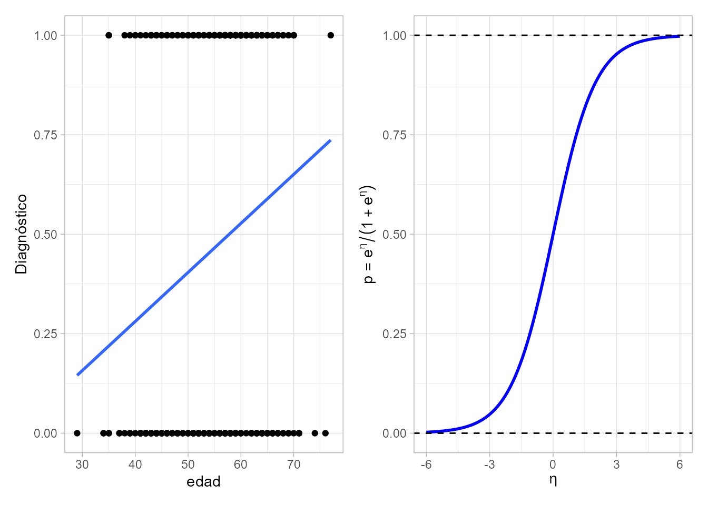
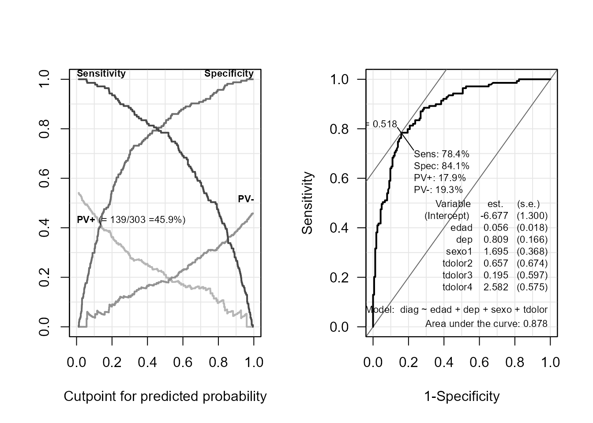
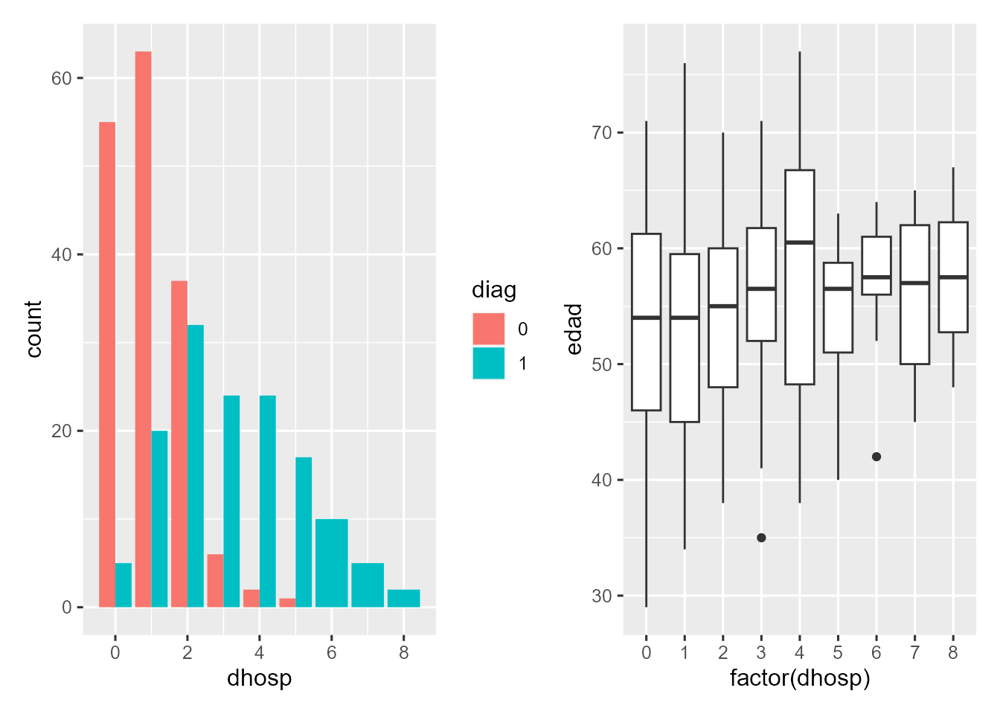
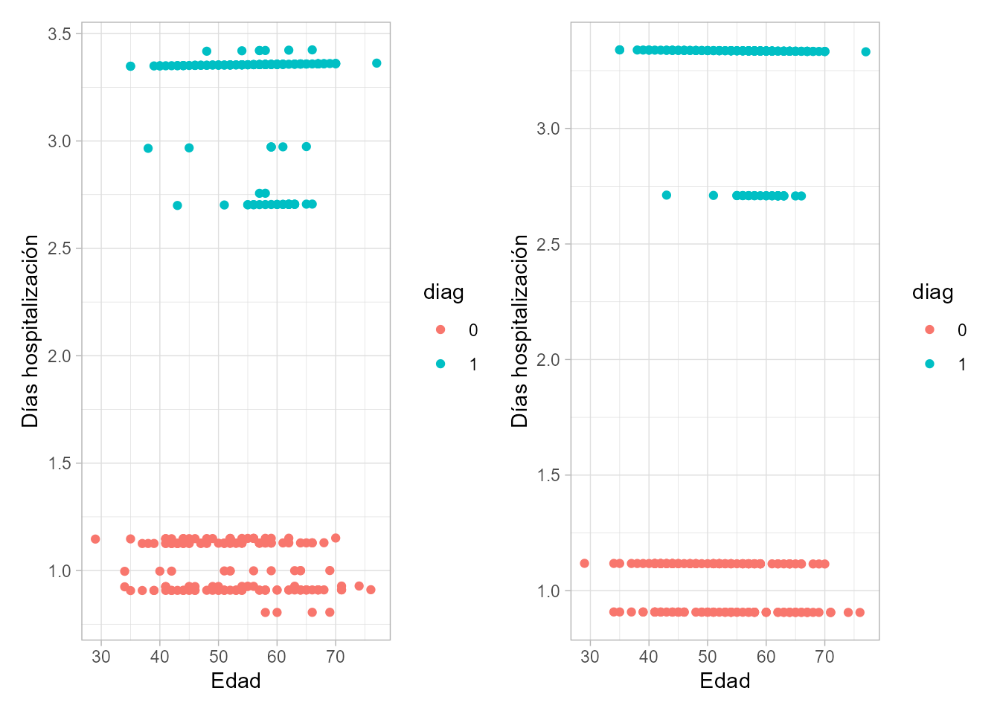

# Modelos lineales generalizados  {#cap-glm}

*Víctor Casero-Alonso*$^{a}$ y 
*María Durbán*$^{b}$

$^{a}$Universidad de Castilla-La Mancha  
$^{b}$Universidad Carlos III de Madrid


## Introducción

Como se ha mencionado en el Cap. \@ref(cap-lm) de modelización lineal, el objetivo detrás del uso de modelos es el de intentar explicar el comportamiento de una variable en función del comportamiento de otras que se cree que influyen en ella. Por ejemplo, podría interesar **predecir**:

* si un empleado abandonará la empresa, o no, en función de sus años de experiencia, su formación, etc.;
o si un paciente sufrirá, o no, una enfermedad en función de su edad, sexo, nivel de colesterol, etc.,

* el número de días que un empleado puede estar de baja laboral en función del tipo de enfermedad, su antigüedad, salario, etc.; 
o el número de días que un paciente puede estar hospitalizado en función de la dolencia por la que acude a urgencias, su edad, sexo, etc.

Estos casos no pueden analizarse correctamente con el modelo de regresión lineal múltiple visto en el Cap. \@ref(cap-lm) porque la **variable respuesta**\index{variable!respuesta}, la que interesa predecir en cada ejemplo, no sigue una distribución de probabilidad normal (supuesto necesario para utilizar la regresión lineal) o ni siquiera es continua. Concretamente: 

* abandonar, o no, la empresa o sufrir, o no, una enfermedad se puede modelizar mediante una variable **dicotómica/binaria** asignando los valores 0 y 1 a las dos posibles respuestas, lo que encaja perfectamente con una distribución de probabilidad de Bernoulli (muy distinta de la normal, ya que es discreta, aunque podría parecerse; véase Cap. \@ref(Funda-probab),

* el número de días de baja (en empleados), de hospitalización (en pacientes)... son variables de tipo **recuento**\index{recuento} (solo cero o valores positivos) modelizables mediante una variable discreta que podría seguir una distribución de Poisson (que es también distinta a la normal, por ser discreta, aunque también podría parecerse).   

En este capítulo se aborda el **modelo lineal generalizado** (GLM)\index{modelo!lineal generalizado, GLM}, que generaliza el caso en que la variable respuesta sea normal a cualquier tipo de distribución de probabilidad perteneciente a la familia exponencial y que permite varianzas no constantes en los errores. En concreto, se centra en la regresión logística y la regresión de Poisson, casos particulares de este modelo, que permiten modelizar correctamente los dos casos planteados anteriormente. Un buen libro de referencia para este capítulo es @james2013introduction.


## El modelo y sus componentes

El **modelo lineal generalizado**^[*Generalized linear model*, por su denominación en inglés. Cuidado: general y generalizado no son sinónimos en este contexto.]\index{modelo!lineal generalizado, GLM} se puede escribir como:
$$\mu = g^{-1}(\eta),$$
en el que se tienen los siguientes componentes:

1. $\mu=E(Y)$, el **componente aleatorio**: la **media** de la variable respuesta *Y*, que puede seguir cualquier distribución de probabilidad de la familia exponencial. Entre ellas están las más habituales: la normal (por tanto, el modelo de regresión lineal es un caso particular del GLM), la Bernoulli/binomial (utilizada en la regresión logística), la Poisson, la gamma, etc.

2. $\eta = X \beta$, el **componente sistemático**, el **predictor lineal**, la "estructura" que aportan las variables explicativas/predictoras $X=(X_1, \ldots , X_p)$, que intentan explicar el comportamiento de la variable respuesta, donde $\beta=(\beta_1, \ldots , \beta_p)$ es el vector de coeficientes (parámetros) a estimar del modelo.

3. $g(\cdot)$, la novedad de los GLM, la denominada **función de enlace**\index{función!de enlace}, que relaciona los dos componentes anteriores. Esta función puede tomar distintas formas, como se verá en la siguiente sección.

Igual que en el modelo lineal, las dos partes o etapas fundamentales del análisis de un GLM son:

1.	La **especificación** de la relación o estructura predefinida de antemano, mediante la *estimación* de los *coeficientes* que mejor ajustan dicha relación, utilizando el **método de máxima verosimilitud**^[A diferencia de la regresión lineal múltiple, que utiliza el de mínimos cuadrados.].\index{metodo@método! de máxima verosimilitud} 
Más adelante se verá cómo se interpretan tales coeficientes y cómo se puede comprobar la adecuación del modelo.
2.	La utilización del modelo estimado (especificado) para **predecir**\index{predicción! del modelo} nuevas respuestas, según sea el caso: valores, probabilidades de ocurrencia, etc.

Para la correcta aplicación de los GLM es crucial la elección tanto de la variable respuesta como de las explicativas (que podrían ser de distinto tipo: numéricas --continuas o discretas-- o categóricas/cualitativas --dicotómicas o politómicas--^[En este contexto, las variables numéricas y categóricas se denominan **factores**\index{factor} y **covariables**\index{covariable}, respectivamente.]), así como de la distribución de probabilidad más apropiada para la respuesta. 
Como se adelantó en el Cap. \@ref(cap-lm), como muestra sirva percatarse de que una misma variable podría ser explicativa o respuesta, por ejemplo "diabetes" (sí o no), según se tenga interés en explicar la influencia de la diabetes en otra variable o la influencia de otras variables en la diabetes. 
También una misma variable podría considerarse y utilizarse como variable de distinto tipo; por ejemplo, la edad puede considerarse como variable discreta (años cumplidos) o como categórica ordinal (grupos de edad), aunque es una variable continua (puede tomar cualquier valor en un intervalo).

### Función enlace 
\index{función!de enlace}

Cada distribución de probabilidad tiene asociada una **función de enlace canónica**:^[Podrían considerarse otras para cada distribución, pero esta cuestión excede el nivel de este capítulo.]

 * Para la normal es la identidad: $g(\mu)=\mu$.
 * Para la de Bernoulli, es la función logit: $g(\mu)=logit(\mu)=log (\mu / (1-\mu))$.
 * Para la Poisson, es el logaritmo: $g(\mu)=log(\mu)$.
 * Para la gamma es la inversa: $g(\mu)=1/\mu$, ...
 
Tanto en el caso de la regresión logística (variable respuesta tipo Bernoulli) como en la regresión de Poisson aparece el logaritmo (neperiano) en la función de enlace, lo que conduce a efectos **multiplicativos**\index{efectos!multiplicativos} de los factores o covariables $X_i$ sobre la respuesta, como se verá más claramente en la Sec. \@ref(SECCinterp). Este es un punto que las distingue de la regresión lineal, en la que los efectos son **aditivos**\index{efectos!aditivos}.

## Procedimiento con **R**: la función `glm()` 

En el paquete `stats` (de la distribución *base* de **R**) se encuentra la función `glm()` que se utiliza para llevar a cabo el ajuste de un GLM:

```r
glm(formula, family = ..., data = ..., ...)
```

* `formula`: para definir el *predictor lineal*; por ejemplo, `Y ~ X1 + X2 + X3`.
* `family`: para indicar la distribución de la variable respuesta (`gaussian`, `binomial`, `poisson` ...) que determina la función de enlace (`binomial` $\rightarrow$ `logit`, etc.; consúltese `?family` o `?glm` para más detalles).

Las "herramientas" utilizadas para `lm()` también se pueden usar para `glm()` (aunque algunas interpretaciones varían). Así, se puede usar `summary()` para detectar los predictores importantes, `fitted()` para obtener los valores ajustados, etc. 

## Regresión logística {#reg-logistica}

La **regresión logística** es el caso más "famoso" de GLM, de gran relevancia en distintos contextos: Medicina, Economía, etc. 
Se utiliza cuando la **variable respuesta** es **dicotómica**, del tipo pertenencia, o no, a un determinado grupo (fumadores, enfermos, morosos, ...). 
Habitualmente se considera que toma el valor $Y=1$ si la observación pertenece al grupo de interés e $Y=0$ en caso contrario. 
Tal tipo de variable se puede modelizar con una **distribución de Bernoulli**, caracterizada por un parámetro $p$ que indica la probabilidad de pertenecer al grupo de interés.  

El objetivo principal suele ser predecir el grupo al que pertenece un nuevo individuo/elemento, sobre la base de la información sobre dicho elemento/individuo que proporcionan las variables explicativas. Para ello, se estima el modelo con los datos disponibles, determinándose qué variables influyen **significativamente** en la variable respuesta.^[Desde el punto de vista estadístico, la influencia/efecto no es fruto del azar.] 


**¿Por qué no tiene cabida aquí el uso del modelo de regresión lineal múltiple?** Al ajustar un modelo del tipo: $Y=\beta_0 + \beta_1 X_1 + \ldots + \beta_p X_p + \epsilon,$
las estimaciones $\hat{Y}$ serán números reales que rara vez 
coincidirán con 0 o 1 (que son los valores admisibles de la variable respuesta). 
Dicho de otro modo, si solo se tuviese una variable explicativa, al ajustar el modelo de regresión lineal simple, la recta sobrepasaría, o no alcanzaría, los valores posibles de respuesta (0 o 1), como ocurre en la Fig. \@ref(fig:glm-dispersionYlogit) (izquierda) obtenida a partir de los datos del ejemplo de enfermedad coronaria que se manejará en la Sec. \@ref(secEJreglog).

El **modelo de regresión logística múltiple** se define como: \index{regresión!logística}
\begin{equation} 
   \text{logit}(p)=\log{ \Big(\dfrac{p}{1-p}  \Big)}=\beta_0 + \beta_1 X_1 + \ldots + \beta_p X_p + \epsilon,
   (\#eq:eta)
\end{equation}
que permite estimar la ratio entre 
la probabilidad de pertenecer al grupo de interés, $p$, 
y la de no pertenecer a dicho grupo, $1-p$. 
Utilizando la función de enlace se puede transformar el predictor lineal $\eta=\beta_0 + \beta_1 X_1 + \ldots + \beta_p X_p$ para obtener valores admisibles para una probabilidad. 
La función logística, definida como 
\begin{equation}
  p = \frac{e^\eta}{1+e^\eta}
  (\#eq:logit)
\end{equation}
y representada en la Fig. \@ref(fig:glm-dispersionYlogit) (derecha), es la más habitual, y por ello da el nombre a la regresión logística. Con ella se obtiene la probabilidad de pertenecer al grupo de interés, $p = P[Y = 1]$, e inmediatamente la de no pertenecer a dicho grupo, $1-p = P[Y = 0]$. 

<div class="figure" style="text-align: center">

<p class="caption">(\#fig:glm-dispersionYlogit)Gráfico de dispersión del diagnóstico frente a la edad para el ejemplo de enfermedad coronaria (izquierda) y función logística (derecha).</p>
</div>

La ventaja del modelo logístico es que la función logística tiende a cero por la izquierda y a uno por la derecha, por lo que la predicción será 
siempre un valor válido para una probabilidad. Como contrapartida, a medida que las probabilidades se acercan a cero o a uno la relación entre el predictor y la probabilidad deja de ser lineal, lo que complica la interpretación de los coeficientes.

### Procedimiento de ajuste

A partir de los datos disponibles de las variables *predictoras* y *respuesta*: 

1. Se estiman los coeficientes\index{estimación!de coeficientes} $\beta_j$ del modelo, para especificar la relación entre las variables, contrastando si tales estimaciones, $\hat\beta_j$, son o no significativas.\index{significativo}
2. Se valora la eliminación de variables no significativas, atendiendo a la significación global del modelo, al modelo teórico subyacente, etc.
4. Se comprueba la adecuación del modelo final obtenido.
5. En caso afirmativo, se interpretan los coeficientes y el modelo queda listo para hacer **predicciones**\index{predicción! del modelo logístico} de probabilidades o para **clasificar**\index{clasificación} individuos/elementos.

::: {.infobox data-latex=""}
**Nota** 

Como se menciona en el Cap. \@ref(cap-lm), un coeficiente es **significativo** cuando su *p*--valor \index{p@\textit{p}-valor} asociado es lo **suficientemente pequeño** (como norma general, inferior a 0,05). No obstante, pueden tomarse otros valores de referencia; por ejemplo, en las salidas de **R** aparecen otros tres niveles de referencia, 0,1, 0,01 y 0,001. 
:::


### Adecuación del modelo {#secADECUACION}
\index{deviance@\textit{deviance}}
Para comprobar si el modelo estimado es adecuado, se compara con el modelo más simple, el que solo incluye el término independiente. 
Para ello, se pueden utilizar distintos contrastes basados en la ***deviance***,^[En ocasiones traducida como _devianza_, aunque es habitual no traducirla.] una medida que juega el papel de la suma de cuadrados de los residuos. 
En el modelo de regresión logística, la _deviance_  de un modelo es menos dos veces el logaritmo de la **verosimilitud** de dicho modelo. 
La diferencia entre la _deviance_ de un modelo más elaborado y el simple se distribuye como una $\chi^2$ con tantos grados de libertad como restricciones impuestas a los parámetros, lo que permite contrastar cuál de los dos modelos ajusta mejor los datos. 
*P*--valores bajos indican que el modelo ajustado es inadecuado, debiendo investigarse otras posibles variables predictoras, si se incumple la hipótesis de linealidad o existe sobredispersión (por ejemplo, por exceso de ceros).

Adicionalmente, se puede aplicar el contraste de la **razón de verosimilitudes**. Este test contrasta la significación de cada cada variable predictora, basándose en la *deviance* que se genera al añadir cada variable secuencialmente al modelo que contiene las anteriores, lo que ayuda a decidir si mantenerla o eliminarla del modelo. 

Para contrastar la bondad de ajuste del modelo, el contraste más popular en la literatura es el de Hosmer-Lemeshow, aplicable a modelos con al menos una variable cuantitativa. *P*--valores bajos indican falta de ajuste.

Continuando con las medidas de bondad de ajuste, en el modelo de regresión logística no tiene sentido calcular el coeficiente de determinación lineal, $R^2$, pero existen varias alternativas equivalentes para hacerse una idea de la variabilidad de la respuesta explicada por el modelo. 
Las tres más populares son el pseudo $R^2$ de McFadden, el $R^2$ de Cox y Snell (que por construcción no puede alcanzar el 1)
y el $R^2$ de Nagelkerke (una corrección del de Cox y Snell).


### Interpretación de resultados{#SECCinterp}

La interpretación de los coeficientes no es tan directa y sencilla como en el modelo lineal. 
A partir de las estimaciones del predictor lineal $\hat{\eta}$, modelo \@ref(eq:eta), se puede estimar la probabilidad de que un individuo pertenezca al grupo de interés utilizando la expresión \@ref(eq:logit). Alternativamente se puede estimar el _odds_, con la siguiente expresión, que se deduce de \@ref(eq:eta):
\begin{equation}
\mathit{odds} = \frac{\hat{p}}{1-\hat{p}} =  e^{\hat{\eta}} = e^{\hat{\beta}_0 + \hat{\beta}_1 X_1 + \ldots + \hat{\beta}_p X_p}. 
(\#eq:odds)
\end{equation}
El _odds_ se puede explicar como cuántas veces es más probable pertenecer al grupo de interés ($Y=1$) que al otro grupo ($Y=0$). 
Por ejemplo, si $\hat{p} = 0.75$ el _odds_ es $0.75/0.25=3$, entonces es tres veces más probable pertenecer al grupo de interés que no pertenecer.^[Por esto se traduce _odds_ como _ventaja_. Pero cuidado con su uso: si $Y=1$ es tener un accidente, no parece muy adecuado hablar de ventaja. Por esto mismo, a $p$ tampoco se le denomina aquí probabilidad de éxito.] 

La ecuación \@ref(eq:odds) se puede expresar, equivalentemente, como:
\begin{equation}
\mathit{odds}=e^{\hat{\beta}_0} \cdot e^{\hat{\beta}_1 X_1} \cdot \ldots \cdot e^{\hat{\beta}_p X_p}.  
(\#eq:modds1)
\end{equation}
La interpretación de los $\hat{\beta}_j$ carece de sentido. Lo interpretable son los $e^{\hat\beta_j}$, denominados ***odds ratios*** (OR). \index{odds@\textit{odds} ratio} 
Como el modelo \@ref(eq:modds1) es multiplicativo (sus términos aparecen multiplicando, no sumando), por lo que valores de $e^{\hat{\beta}_j}$ inferiores a 1 implican disminución en el valor del *odds* --se reduce la probabilidad de pertenecer al grupo de interés respecto a la de no pertenecer-- y valores por encima de 1 implican incremento del valor del *odds*, *ceteris paribus*.^[Manteniendo constante el valor de las demás variables.] En concreto, $100(e^{\hat{\beta}_j}-1)$ indica la variación porcentual en el $odds$ ante un incremento unitario en la variable explicativa $X_i$, mientras que $100(e^{-\hat{\beta}_j}-1)$ indica el cambio porcentual que se opera en el $odds$ debido a un decremento unitario de dicha variable explicativa, $ceteris \hspace{0,1cm} paribus$.

El modelo de regresión logística se puede acompañar del denominado **riesgo relativo**\index{riesgo!relativo} (RR, _relative risk_). Es una razón de
probabilidades como el _odds_, pero en vez de comparar la probabilidad de pertenecer a un grupo
o a otro de la variable respuesta, compara las probabilidades de pertenecer al grupo de referencia ($Y=1$) según los valores del predictor categórico $X_i$. 
El riesgo relativo es similar al OR de la variable $X_i$ solo cuando la probabilidad de $Y=1$ es pequeña; se suele dar como referencia que sea inferior al 10%. Por lo tanto, OR y RR no coinciden siempre.

### Predicción. Curva ROC y AUC

Como se ha mencionado anteriormente, el uso habitual de la regresión logística es la predicción, no tanto de probabilidades, sino de la clasificación en un grupo u otro de futuros individuos/elementos en base a la información conocida de ellos a través de las variables explicativas. 
La regla de clasificación en los grupos depende de la elección del punto de corte de la probabilidad, por ejemplo $\hat{Y}=1$ si $\hat p>0,7$ e $\hat{Y}=0$ en otro caso. 
Para seleccionar dicho punto de corte, se acude al análisis de los casos clasificados correctamente o no por el modelo ajustado: análisis de la sensibilidad y la especificidad del modelo, a su visualización más popular, la **curva ROC**\index{curva ROC} (*receiver operating characteristic*) y la medición del área bajo dicha curva, AUC (*area under the curve* ROC); véase Cap. \@ref(chap-feature). 

La **sensibilidad**\index{sensibilidad}, o tasa de verdaderos positivos, se define como el cociente entre estos y la suma de los verdaderos positivos y los falsos negativos. 
La **especificidad**\index{especificidad}, o tasa de verdaderos negativos, es el cociente entre estos y la suma de los verdaderos negativos y los falsos positivos. Por consiguiente, la sensibilidad es una medida de la probabilidad de que un caso real positivo ($Y=1$) sea clasificado correctamente como positivo por el modelo ($\hat{Y}=1$). Equivalentemente, la especificidad es la probabilidad de clasificar correctamente casos negativos. 

Gráficamente, se pueden obtener los valores de la sensibilidad y especificidad para distintos puntos de corte (entre 0 y 1).
La Fig. \@ref(fig:glm-roc) (izquierda) muestra este gráfico para uno de los casos prácticos.^[La interpretación del gráfico se hace en la sección donde aparece la figura.]
Pero la forma más popular de analizar la sensibilidad y la especificidad es 
mediante la curva ROC, que representa, para los distintos puntos de corte considerados, la **sensibilidad** frente a la tasa de falsos positivos, esto es la **1-especificidad** (Fig. \@ref(fig:glm-roc) [derecha]).
Su AUC sirve para comparar distintos modelos de regresión logística (u otros modelos con el mismo fin).^[Véase el Cap. \@ref(chap-feature).] 
Cuanto mayor poder discriminante tenga el modelo, más próxima a la unidad estará la AUC.
Un clasificador aleatorio presentaría la curva ROC coincidente con la diagonal, con una AUC de 0,5. 


## Regresión de Poisson
\index{regresión!de Poisson}

Se utiliza cuando la **variable respuesta** es **discreta**, solo toma valores no negativos y su distribución de probabilidad es modelizable mediante la **distribución de Poisson**. Por ejemplo, las variables de tipo "número de", como la del ejemplo del principio: número de días de hospitalización. 
El parámetro que caracteriza la distribución de Poisson es $\lambda$, que representa tanto la media como la varianza de la variable aleatoria (a nivel teórico).

Dados los anteriores condicionantes, en esta tesitura tampoco tiene cabida el modelo de regresión lineal, principalmente porque las estimaciones $\hat{Y}$ podrían arrojar valores negativos.

De nuevo el objetivo suele ser la predicción: en el ejemplo, el número de días que un (nuevo) paciente estará hospitalizado ($0, 1, 2, \ldots$), en base a la información proporcionada por las variables explicativas.
Previo a la predicción, se estima el modelo, a partir de los datos disponibles, para determinar las variables explicativas que influyen significativamente sobre la variable respuesta. Y, nuevamente, los efectos serán **multiplicativos**, dado que la función de enlace es de tipo logarítmico, como se ha visto en la Sec. \@ref(SECCinterp). Por ello, todo lo visto anteriormente para la regresión logística es válido para la regresión de Poisson. 

## Casos prácticos 

### Ejemplos de regresión logística {#secEJreglog}

Para llevar a cabo estos ejemplos, se utiliza el conjunto de datos `cleveland` incluido en el paquete `CDR` que acompaña este libro. Se quiere explicar la variable `diag` (diagnóstico; dicotómica: 1, ha sufrido una enfermedad coronaria; 0, no la ha sufrido) a partir de otras  variables. La variable respuesta `diag` ya aparece como factor en la base de datos.

**Estimación**  
 Primeramente, se considera un primer modelo con  dos variables explicativas continuas `edad` y `dep` (depresión en el segmento ST):

```r
library("CDR")
reg_log <- glm(diag ~ edad + dep, 
               family = "binomial", data = cleveland)
summary(reg_log)
#> 
#> Call:
#> glm(formula = diag ~ edad + dep, family = "binomial", data = cleveland)
#> 
#> Coefficients:
#>             Estimate Std. Error z value Pr(>|z|)    
#> (Intercept) -3.08080    0.81939  -3.760  0.00017 ***
#> edad         0.03738    0.01476   2.532  0.01134 *  
#> dep          0.86851    0.13791   6.298 3.02e-10 ***
#> ---
#> Signif. codes:  0 '***' 0.001 '**' 0.01 '*' 0.05 '.' 0.1 ' ' 1
#> 
#> (Dispersion parameter for binomial family taken to be 1)
#> 
#>     Null deviance: 417.98  on 302  degrees of freedom
#> Residual deviance: 350.64  on 300  degrees of freedom
#> AIC: 356.64
#> 
#> Number of Fisher Scoring iterations: 4
```

En la salida se muestran las estimaciones de los coeficientes del modelo (columna `Estimate`) y su significatividad (columna `Pr(>|z|)`). En este ejemplo, los dos coeficientes de interés (los correspondientes a `edad` y  `dep`) son significativos (a un nivel de significación del 5%).

Puede observarse que dicha salida también incluye la _null deviance_ y la _residual deviance_. La primera indica lo "bien" que predice el modelo sin variables explicativas (tan solo con el término independiente o intercepto); la segunda indica lo "bien" que predice el modelo con variables explicativas. Como se avanzó anteriormente, un contraste Chi-cuadrado permitirá dilucidar si el modelo con variables explicativas predice significativamente mejor que el que solo tiene un término independiente y su predicción, sea cual sea el valor de las variables explicativas, es siempre la media de los valores de la variable respuesta. 

Se completa el modelo anterior añadiendo variables categóricas --concretamente, `tdolor` (politómica, tipo de dolor) y `sexo` (dicotómica)-- para poder incluir más adelante la interpretación de los coeficientes asociados a este tipo de variables. 
Para su correcta interpretación, se deben introducir en el predictor como variables de tipo `factor`.^[ En este caso ya están definidas como `factor` en el `data.frame`.] De lo contrario, el procedimiento las considera numéricas, obteniéndose una salida que llevaría a una interpretación errónea.


```r
reg_log2 <- update(reg_log, ~ . + sexo + tdolor)
```

**Adecuación del modelo**  
Para evaluar la bondad de ajuste de los modelos se lleva a cabo el contraste  de Hosmer-Lemeshow:

```r
library("ResourceSelection")
hoslem.test(reg_log$y, reg_log$fitted.values)
#> 
#> 	Hosmer and Lemeshow goodness of fit (GOF) test
#> 
#> data:  reg_log$y, reg_log$fitted.values
#> X-squared = 5.631, df = 8, p-value = 0.6885
hoslem.test(reg_log2$y, reg_log2$fitted.values)
#> 
#> 	Hosmer and Lemeshow goodness of fit (GOF) test
#> 
#> data:  reg_log2$y, reg_log2$fitted.values
#> X-squared = 4.8171, df = 8, p-value = 0.7769
```
En ambos casos, los *p*--valores son "altos", indicando un ajuste suficiente.

Para realizar el test de la razón de verosimilitudes con **R** se acude a la función `anova()`: 

```r
anova(reg_log2, test = "Chisq")
#> Analysis of Deviance Table
#> 
#> Model: binomial, link: logit
#> 
#> Response: diag
#> 
#> Terms added sequentially (first to last)
#> 
#> 
#>        Df Deviance Resid. Df Resid. Dev  Pr(>Chi)    
#> NULL                     302     417.98              
#> edad    1   15.447       301     402.54 8.487e-05 ***
#> dep     1   51.894       300     350.64 5.858e-13 ***
#> sexo    1   23.982       299     326.66 9.726e-07 ***
#> tdolor  3   62.153       296     264.51 2.037e-13 ***
#> ---
#> Signif. codes:  0 '***' 0.001 '**' 0.01 '*' 0.05 '.' 0.1 ' ' 1
```
Las *deviances* correspondientes a añadir secuencialmente cada variable o factor al modelo que contiene los anteriores permite concluir que dicha inclusión secuencial de tales variables predictoras es significativa respecto a los modelos que no las incluyen.

Para completar, se podría contrastar también el efecto de una variable sobre la respuesta comparando la *deviance* del modelo con dicha variable y sin ella: 

```r
## se elimina edad del segundo modelo
reg_log3 <- update(reg_log2, ~ . - edad)
anova(reg_log3, reg_log2, test = "Chisq")
#> Analysis of Deviance Table
#> 
#> Model 1: diag ~ dep + sexo + tdolor
#> Model 2: diag ~ edad + dep + sexo + tdolor
#>   Resid. Df Resid. Dev Df Deviance Pr(>Chi)   
#> 1       297     274.45                        
#> 2       296     264.51  1   9.9488  0.00161 **
#> ---
#> Signif. codes:  0 '***' 0.001 '**' 0.01 '*' 0.05 '.' 0.1 ' ' 1
```
El resultado indica que la variable `edad` se considera un predictor significativo en el modelo. 
Se deja al lector realizar este ejercicio con las restantes variables, que le llevarán a concluir que todas son predictores significativos.

El valor del pseudo $R^2$ de McFadden se obtiene como sigue:

```r
null <- glm(diag ~ 1, family = "binomial", data = cleveland)
1 - logLik(reg_log) / logLik(null)
#> 'log Lik.' 0.1611088 (df=3)
1 - logLik(reg_log2) / logLik(null)
#> 'log Lik.' 0.3671819 (df=7)
```
Para el primer modelo el pseudo $R^2$ de McFadden es 0,16, mientras que para el segundo es 0,37.


**Interpretación de los coeficientes**  
A continuación se muestran los coeficientes estimados del segundo modelo y sus correspondientes OR (sus exponenciales) que son los interpretables: 

```r
summary(reg_log2)
#> 
#> Call:
#> glm(formula = diag ~ edad + dep + sexo + tdolor, family = "binomial", 
#>     data = cleveland)
#> 
#> Coefficients:
#>             Estimate Std. Error z value Pr(>|z|)    
#> (Intercept) -6.67669    1.30016  -5.135 2.82e-07 ***
#> edad         0.05621    0.01828   3.075   0.0021 ** 
#> dep          0.80890    0.16597   4.874 1.10e-06 ***
#> sexo1        1.69477    0.36801   4.605 4.12e-06 ***
#> tdolor2      0.65668    0.67357   0.975   0.3296    
#> tdolor3      0.19465    0.59654   0.326   0.7442    
#> tdolor4      2.58230    0.57549   4.487 7.22e-06 ***
#> ---
#> Signif. codes:  0 '***' 0.001 '**' 0.01 '*' 0.05 '.' 0.1 ' ' 1
#> 
#> (Dispersion parameter for binomial family taken to be 1)
#> 
#>     Null deviance: 417.98  on 302  degrees of freedom
#> Residual deviance: 264.51  on 296  degrees of freedom
#> AIC: 278.51
#> 
#> Number of Fisher Scoring iterations: 5
exp(coef(reg_log2))[-1]
#>      edad       dep     sexo1   tdolor2   tdolor3   tdolor4 
#>  1.057824  2.245432  5.445391  1.928371  1.214880 13.227480
```

Los coeficientes asociados a las variables continuas son significativos y positivos, por tanto sus OR son significativamente superiores a 1.
Indican que, *ceteris paribus*,

  * por cada año más, el *odds* de padecer la enfermedad frente a no padecerla se incrementa^[Por ser el coeficiente mayor que 1.] un 5,78% (al ser el valor del OR asociado a la edad 1,0578). ¿Y cuál sería el incremento en el *odds* ante un aumento de la edad en 20 años? En tal caso, el *odds* ser multiplicaría por $e^{\hat{\beta}_1 \cdot 20}$ = 3,078, es decir, se ha más que triplicado. Se debe ser cuidadoso con la interpretación: no se triplica la probabilidad sino el *odds*.
  * ante un aumento de una unidad en la variable _dep_ se multiplica más del doble el _odds_ del paciente, pues su OR es 2,2454.

::: {.infobox data-latex=""}
**Nota**

En regresión lineal, que un coeficiente sea significativo quiere decir que es significativamente distinto de cero, por el hecho de que el modelo considera *efectos aditivos* de las variables. El modelo de regresión logística es de *efectos multiplicativos* y, por ello, el valor "neutro" es el 1. Por tanto, un coeficiente significativo se interpreta  como significativamente distinto de 1.
:::

¿Y cómo se interpretan los coeficientes asociados a las variables categóricas? 
¿Qué significan los valores de `sexo1`, `tdolor2`...? Representan el cambio (promedio) en la variable respuesta al pasar de la categoría de referencia a la mostrada.^[En las variables definidas como `factor` **R** toma como referencia la primera categoría al ordenarse los valores de la variable, bien alfabéticamente (a, b, c...) o bien numéricamente, de menor a mayor, salvo que se haya especificado otro orden. De ahí que `sexo=0` sea la categoría de referencia, porque esta variable toma los valores 0 y 1, y solo aparezca en las estimaciones `sexo1`, reflejando el cambio medio en la variable respuesta al pasar de la categoría de referencia a la categoría 1. Para `tdolor`, al tomar los valores 1, 2, 3 y 4, la categoría de referencia es `tdolor=1`, apareciendo coeficientes para `tdolor=2`, `tdolor=3` y `tdolor=4`.]

  * el de `sexo1` significa que el *odds* de padecer la enfermedad en los hombres (`sexo=1`) es más de 5 veces superior  que en las mujeres (`sexo=0`).
  * el de `tdolor4` indica que los individuos con este tipo de dolor (asintomáticos) presentan un *odds* 13 veces superior al de los de `tdolor=1` (angina típica).^[Los coeficientes de `tdolor2` y `tdolor3` no son significativos.]


Nótese que no se muestra $e^{\beta_0}$, pues su interpretación carece de sentido práctico: sería el OR de las personas de 0 años, `dep=0`, `sexo=0` y `tdolor=1`.


**Predicciones**  
Una vez estimado el modelo y comprobada su bondad, se puede usar para obtener predicciones. 
Para ello, se deben asignar valores a las variables explicativas: `edad`, `dep`, `sexo` y `tdolor` (se han escogido arbitrariamente).


```r
individuo <- data.frame(edad = 50, dep = 3, 
                        sexo = "1", tdolor = "4" #entre comillas por ser factores
                        ) 
```

Con la función `predict()` se puede obtener tanto el valor predicho para el predictor lineal (valor no interpretable), $\eta$, como directamente la probabilidad de que dicho individuo sufra la enfermedad coronaria, $p$:

```r
#(eta <- predict(reg_log2, individuo))
(p <- predict(reg_log2, individuo, type = "response"))
#>         1 
#> 0.9446843
```
A partir del valor de $p$  (o de $\eta$) se puede obtener el *odds* correspondiente:

```r
p / (1 - p) # exp(eta)
#>        1 
#> 17.07805
```
Es decir, un individuo con 50 años, `dep=3`, `sexo=1` (hombre) y `tdolor=4` (asintomático) tiene una probabilidad de padecer la enfermedad en cuestión 17 veces mayor que de no padecerla.


**Riesgo relativo**  
Se ha visto que el OR para la categoría hombre en el segundo modelo es  5,45.  El riesgo relativo de sufrir la enfermedad, en el caso de los varones, para un paciente de 50 años, valor `dep=3` y `tdolor=4` (asintomático) es:


```r
hom <- data.frame(edad = 50, dep = 3, sexo = "1", tdolor = "4")
muj <- data.frame(edad = 50, dep = 3, sexo = "0", tdolor = "4")
(ph <- predict(reg_log2, hom, type = "response"))
#>         1 
#> 0.9446843
(pm <- predict(reg_log2, muj, type = "response"))
#>         1 
#> 0.7582346
ph / pm # riesgo relativo hombre/mujer
#>      1 
#> 1.2459
```
El riesgo relativo de sufrir la enfermedad, en el caso de los varones, es $RR$= 0,9447/0,7582 = 1,2459, es
decir, un varón tiene un 24,6% más de posibilidades de tener la enfermedad que una mujer con sus mismos valores o categorías en las variables que se usan como predictores. En este caso, el OR y el RR no son valores cercanos; ello es debido a que el diagnóstico 1 es frecuente (concretamente lo presentan el 45,9% de los pacientes de la base de datos).


**Curva ROC**  
El análisis de sensibilidad y especificidad del modelo, así como la curva ROC y su AUC, para este ejemplo, se pueden obtener con el siguiente código:


```r
par(mfrow = c(1, 2))
library("Epi")
ROC(
  form = diag ~ edad + dep + sexo + tdolor, data = cleveland,
  plot = "sp"
)
ROC(
  form = diag ~ edad + dep + sexo + tdolor, data = cleveland,
  plot = "ROC", las = 1
)
```

<div class="figure" style="text-align: center">

<p class="caption">(\#fig:glm-roc)Gráfico de sensibilidad y especificidad según puntos de corte de discriminación (izquierda) y curva ROC (derecha) para el segundo modelo de regresión logística.</p>
</div>

La Fig. \@ref(fig:glm-roc) (izquierda) muestra que tomando como punto de corte una probabilidad cercana a 0,45 se obtienen valores de sensibilidad y especificidad alrededor de 0,8. No obstante, se deben evaluar los costes y riesgos de una mala clasificación (por ejemplo, dar tratamiento cuando no hace falta y no darlo cuando es necesario).

La Fig. \@ref(fig:glm-roc) (derecha) representa la curva ROC de `reg_log2`. La curva está por encima de la diagonal, con lo que es mejor que un clasificador aleatorio. La AUC es de 0,878, con una sensibilidad de 78,4% y una especificidad de 84,1%. 
Si se realiza el análisis para `reg_log` se comprobará que la AUC es de 0,759, por lo que el segundo modelo es mejor para discriminar. 
Además, el gráfico también indica el valor del **punto de corte óptimo**, 0,518 (el que proporciona la mayor AUC, 0,878) junto con los correspondientes valores de sensibilidad, especificidad, etc. También muestra las estimaciones y los errores estándar (*standar error*, s.e.) de los coeficientes del modelo considerado.

\index{punto!de corte}

### Ejemplo de regresión de Poisson

A partir del mismo conjunto de datos, `cleveland`, ahora se considera como variable a explicar, variable respuesta, `dhosp`, el número de días de hospitalización de un paciente. 
Como variables explicativas se seleccionan las siguientes: `diag`, `edad`, `sexo` y `tdolor`, que son de distinto tipo, lo que permitirá ilustrar sus distintas interpretaciones.  

**Visualización ilustrativa**

```r
p1 <- ggplot(cleveland, aes(dhosp, fill = diag)) +
  geom_bar(position = "dodge")
p2 <- ggplot(cleveland, aes(x = factor(dhosp), y = edad)) +
  geom_boxplot()
library("patchwork")
p1 + p2
```

<div class="figure" style="text-align: center">

<p class="caption">(\#fig:glm-grafpois)Gráfico de barras de $dhosp$ según tipo de diagnóstico (izquierda) y gráficos de cajas de $edad$ según el número de días de hospitalización (derecha).</p>
</div>
A la vista de los gráficos de la Fig. \@ref(fig:glm-grafpois), generados con las sentencias anteriores, `diag` parece ser una buena variable predictora del número de días de hospitalización, mientras que `edad` no tiene una influencia tan clara. 

**Ajuste e interpretación** 

```r
reg_pois <- glm(dhosp ~ diag + edad + sexo + tdolor,
  data = cleveland, family = "poisson")
```

Al especificar `family = "poisson"`, la función `glm()` selecciona automáticamente la función de enlace   apropiada: el logaritmo (efectos multiplicativos).

```r
summary(reg_pois)$coef
#>                  Estimate  Std. Error     z value     Pr(>|z|)
#> (Intercept) -0.2230728726 0.332125111 -0.67165314 5.018045e-01
#> diag1        1.0902902179 0.109731744  9.93595999 2.903654e-23
#> edad         0.0001026277 0.004877904  0.02103931 9.832143e-01
#> sexo1        0.2160286255 0.103297627  2.09132226 3.649919e-02
#> tdolor2      0.1408464230 0.205232539  0.68627725 4.925383e-01
#> tdolor3      0.1217757202 0.189404790  0.64293897 5.202637e-01
#> tdolor4      0.1215388103 0.178729482  0.68001546 4.964947e-01
exp(coef(reg_pois))[-1]
#>    diag1     edad    sexo1  tdolor2  tdolor3  tdolor4 
#> 2.975137 1.000103 1.241138 1.151248 1.129501 1.129233
```

De todas las variables introducidas en el modelo, solo `diag` y `sexo` son significativas (al 5%). Se confirma así lo visto en la Fig. \@ref(fig:glm-grafpois) (derecha): que `edad` no influye en la respuesta. Al ser las dos variables significativas de tipo dicotómico, su interpretación, como en la regresión logística, se hace en función de la categoría de referencia, y *ceteris paribus* (esto en cualquier caso):

* El coeficiente de `diag` es 1,0903 pero se le debe aplicar la exponencial para tener como unidades de medida días. 
Así, el número medio de días de estancia en el hospital es 2,98 veces mayor con `diag=1` que con `diag=0` (categoría tomada como referencia).

* Algo similar se puede decir para `sexo`: un hombre (`sexo=1`) se espera que esté en el hospital, de media, 1,24 días por cada día que esté una mujer. 

* De la misma manera se interpretarían los coeficientes asociados a `tdolor`, si bien no son significativos: cada uno de ellos expresaría la diferencia con los pacientes del grupo `tdolor=1`. 

* Aunque el coeficiente asociado a `edad` tampoco es significativo, y su magnitud es ínfima, se da su interpretación, al ser la única variable continua:
por cada año que aumenta la `edad`, el número medio de días en el hospital se ve multiplicado por 1,0001 (ínfimo).^[Si el incremento fuese de 20 años (como en el ejemplo de regresión logística), el incremento en los días de hospitalización seguiría siendo despreciable: 0,0021 días.]


Para posteriores comparaciones, se considera otro modelo en el que se elimina `tdolor` (por no ser significativa):


```r
reg_pois2 <- glm(dhosp ~ diag + sexo + edad,
  data = cleveland,   family = "poisson")
```

**Adecuación**  
En los ajustes `reg_pois` y `reg_pois2` hay información sobre la *null* y la *residual deviance*, con las que se puede realizar el contraste de comparación de modelos (el simple frente al elaborado) mencionado en la Sec. \@ref(secADECUACION). 

```r
pchisq(reg_pois$deviance, reg_pois$df.residual, lower.tail = F)
#> [1] 0.1325654
pchisq(reg_pois2$deviance, reg_pois2$df.residual, lower.tail = F)
#> [1] 0.155157
```

Al ser los *p*--valores superiores a 0,05, se puede considerar que ambos modelos explican "mejor" que el modelo nulo, el que únicamente contiene la constante y el término aleatorio.

**Predicción**  
Con los modelos ajustados, y comprobada su adecuación, se puede predecir valores, que en este caso son el número medio de días de hospitalización. 

```r
pacientes <- data.frame(
  diag = c("1", "1", "0", "0"),
  edad = c(50, 50, 50, 50),
  sexo = c("1", "0", "1", "0"),
  tdolor = c("4", "4", "4", "4"))
predict(reg_pois, pacientes, type = "response")
#>         1         2         3         4 
#> 3.3532035 2.7017171 1.1270752 0.9080983
```
Se han escogido, arbitrariamente, valores de las variables explicativas para 4 `pacientes`: los pacientes 1 y 2 presentan la enfermedad coronaria (`diag=1`) mientras que los pacientes 3 y 4 no; los pacientes 1 y 3 son hombres (`sexo=1`), mientras que el 2 y el 4 son mujeres; los cuatro tienen 50 años y  son asintomáticos (`tdolor=4`).
Las predicciones obtenidas indican que el paciente 1 (hombre con enfermedad coronaria) estará hospitalizado más días, de media, que el resto, aunque le sigue de cerca la paciente 2 (mujer con enfermedad coronaria).

También se pueden dibujar las predicciones modelo `reg_pois` de todo el conjunto de datos, que `glm()` ha guardado como `fitted.values`.


```r
cleveland$hat <- reg_pois$fitted.values
g1 <- ggplot(cleveland, aes(x = edad, y = hat, colour = diag)) +
  geom_point() +
  labs(x = "Edad", y = "Días hospitalización")
cleveland$hat2 <- reg_pois2$fitted.values
g2 <- ggplot(cleveland, aes(x = edad, y = hat2, colour = diag)) +
  geom_point() +
  labs(x = "Edad", y = "Días hospitalización")
g1 + g2
```

<div class="figure" style="text-align: center">

<p class="caption">(\#fig:glm-predictPois)Predicciones de todo el conjunto de datos del modelo $regpois$ (izquierda) y $regpois2$ (derecha).</p>
</div>


La Fig. \@ref(fig:glm-predictPois) muestra las predicciones del número de días (promedio) de hospitalización para los 303 individuos considerados en el conjunto de datos y para cada uno de los dos modelos de regresión de Poisson considerados. Cabe recordar que en el primer modelo se consideran las variables `diag`, `edad`, `sexo` y `tdolor`, mientras que en el segundo se ha eliminado la variable `tdolor`. Lo primero que hay que destacar es que los puntos se "ordenan" en forma de líneas de puntos horizontales dispuestas verticalmente. Ello se debe a que (*i*) en el eje de abscisas figura la variable `Edad`, que no influye significativamente en los días de hospitalización (líneas horizontales); y (*ii*) las demás variables son categóricas, por lo que desplazan las líneas verticalmente, sin modificar su pendiente. El desplazamiento vertical diferenciado por colores, mediante la variable `diag`, es claro: la predicción del número de días (promedio) de hospitalización para personas con `diag=1` es un valor en torno a 3, mientras que para aquellos con `diag=0` es un valor en torno a 1.
En ambos gráficos no se ha incluido identificación para la variable sexo, podría hacerse añadiendo apropiadamente `facet_wrap(vars(sexo))`, lo que permitiría ver que es el sexo el que genera las diferencias verticales (significativas, porque la variable `sexo` es significativa) de las dos líneas horizontales tanto en torno a `hosp=3` como a `hosp=1` (apreciables claramente en el gráfico de la derecha).
Por último, como la diferencia entre el gráfico de la izquierda y el de la derecha es la inclusión o no de `tdolor`, queda claro que es dicha variable la que genera las distintas líneas horizontales de puntos (gráfico de la izquierda) con poca variabilidad vertical (por no ser significativa).


::: {.infobox_resume data-latex=""}
### Resumen {-}

En este capítulo se introduce el modelo de regresión lineal generalizado, indicado cuando las respuestas no son gaussianas (normales). En particular:

- Se introduce la función de enlace, que juega un papel importante en estos modelos.

- Se describen los casos particulares de regresión logística y de regresión de Poisson.

- Se muestra el uso de **R** para el ajuste de estos  modelos.

- Se ilustra la interpretación de los coeficientes, tanto asociados a variables cuantitativas como a categóricas, y los demás resultados obtenidos con **R**, mediante casos prácticos. 

- Se incluye el uso de la regresión logística como clasificador y se dan indicaciones al respecto mediante la curva ROC y la AUC.

:::


