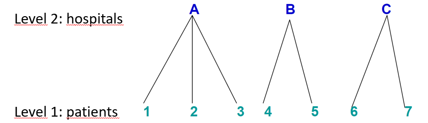
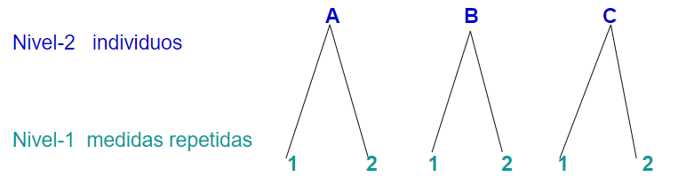
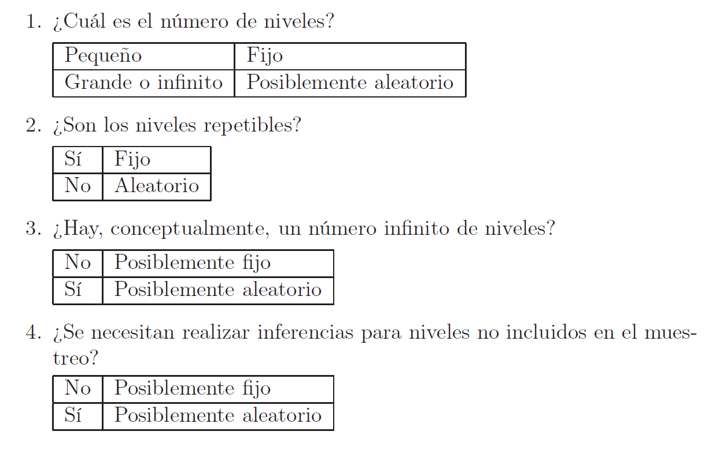
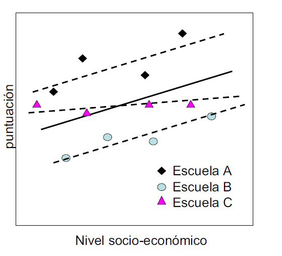
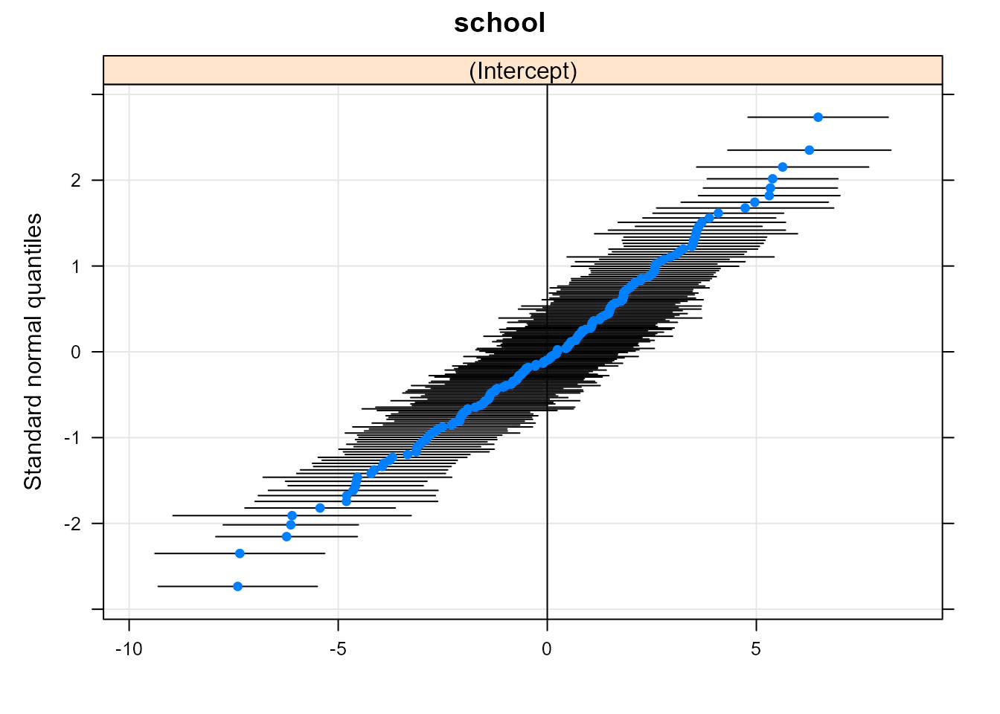

# Modelos mixtos {#cap-mxm}

*María Durbán*$^{a}$ y *Víctor Casero-Alonso*$^{b}$

$^{a}$Universidad Carlos III de Madrid  
$^{b}$Universidad de Castilla-La Mancha  


## Conceptos básicos

Los **modelos mixtos** (MM) para variables de respuesta continuas son
modelos estadísticos en los que los residuos siguen una distribución
normal pero puede que no sean independientes o no tengan varianza
constante. Son necesarios en muchas situaciones, sobre todo en
experimentos donde se realiza algún tipo de muestreo:

1.  Estudios con datos agrupados, como, por ejemplo, alumnos en una
    clase, individuos en una ciudad.
2.  Estudios longitudinales o de medidas repetidas, donde un elemento o individuo
    es medido repetidamente a lo largo del tiempo o bajo condiciones
    distintas.

Este tipo de estudios se pueden encontrar en diferentes áreas como
medicina, biología, ciencias experimentales y sociales.


### Tipo y estructura de los datos

La estructura de los datos con la que se trabaja es el factor
determinante para saber si se han de utilizar modelos mixtos, y en su
caso, qué tipo de modelo.

#### Datos jerárquicos (o agrupados) 
\index{datos!jerárquicos}

En este tipo de datos, la variable dependiente (de respuesta, de interés)
se mide una sola vez en cada unidad de análisis (individuos, objetos,  elementos ...), y los
individuos[^150019_mm-1]
están agrupados (o anidados) en unidades mayores. Muchos tipos
de datos tienen una estructura jerárquica: alumnos en escuelas, personas
en municipios, pacientes en hospitales, plantas en una parcela...

[^150019_mm-1]: En adelante nos referiremos a las unidades de análisis como individuos.

Las jerarquías son una forma de representar la relación de dependencia
que hay entre los individuos y los grupos a los que pertenecen. Por
ejemplo, supóngase que se quiere hacer un estudio sobre el tiempo de
recuperación en pacientes hospitalizados por COVID-19 en diferentes
hospitales. Se tiene la siguiente estructura con dos niveles:

-   Muchos individuos en el nivel $1$ (pacientes).
-   Agrupados en unas pocas unidades en el nivel $2$ (hospitales).


Las estructuras multinivel pueden aparecer también como consecuencia del
diseño del estudio que se está llevando a cabo. Por ejemplo, una
encuesta sobre el estado de salud puede dar lugar a un diseño a tres
niveles: primero se muestrean regiones, luego distritos y después
individuos.

En cada nivel de la jerarquía se pueden medir variables. Algunas estarán
medidas en su nivel *natural*; por ejemplo, en el nivel "hospital" se
podría medir el tamaño y en el  nivel "pacientes", situación socioeconómica. Además, se pueden mover las variables de un
nivel a otro mediante agregación o desagregación:

-   **Agregación**:\index{agregación} la variable correspondiente al nivel más bajo se mueve a un nivel
    más alto; por ejemplo, se puede asociar a cada hospital la media
    del nivel socioeconómico de sus pacientes.
-   **Desagregación**:\index{desagregación} mover las variables a un nivel más bajo; por
    ejemplo, asignarle a cada paciente una variable que indique el
    tamaño de su hospital de referencia.

#### Medidas repetidas y datos longitudinales

En este tipo de datos, la variable dependiente se mide más de una vez en
un mismo individuo [@Singer03]. Por ejemplo, se miden los niveles de
glucosa de un enfermo antes y después de haberle inyectado insulina.
Este tipo de datos también puede ser considerado como datos multinivel
(o jerárquicos) donde el nivel 2 representa a los individuos y el nivel
1,  a las diferentes medidas tomadas. Dado que las medidas se
toman a un mismo individuo, es probable que  no sean
independientes, por lo que utilizar un modelo lineal ordinario no sería
apropiado.



Por **datos longitudinales**\index{datos!longitudinales} se entienden datos en los que la variable
dependiente se ha medido en distintos instantes de tiempo en cada una de
las unidades de análisis. En algunos casos, cuando la variable
dependiente se mide a lo largo del tiempo, puede ser difícil identificar
si los datos son medidas repetidas o datos longitudinales. Desde el
punto de vista del análisis de los datos mediante MM esta distinción no
es un elemento crítico. Lo importante es que en ambos tipos de datos la
variable dependiente se ha medido repetidas veces en la misma unidad de
análisis, y que, por tanto, las observaciones no son independientes.


### ¿Efectos fijos o aleatorios?

En un modelo mixto la clave se encuentra en la distinción entre efectos
fijos y aleatorios [@Snijers03]. Esto es importante porque la inferencia y
el análisis de ambos efectos es distinta.

Los **efectos fijos**\index{efectos!fijos} son variables en las cuales el investigador ha
incluido solo los niveles (o tratamientos) que son de su interés. Por
ejemplo, en un experimento se puede estar interesado en comparar dos
grupos, uno al que se le aplica un tratamiento y otro de control. En
este caso, el  estudio compara los grupos y no interesa
generalizar los resultados a otros tratamientos que podrían haber sido
incluidos. Otro ejemplo sería el caso en el que se hace una encuesta y se
eligen 10 ciudades. Si solo interesan los resultados para esas 10
ciudades y no se quieren generalizar  al resto de ciudades
que podrían haber sido seleccionadas, la variable 'ciudad' es un
efecto fijo. Si se eligen las ciudades de forma aleatoria de una
población grande de ciudades, la variable 'ciudad' es un **efecto aleatorio**\index{efectos!aleatorios}.

Una cantidad se considera aleatoria cuando cambia sobre las unidades de
una población. Cuando un efecto en un modelo estadístico es considerado
aleatorio, se está asumiendo que se quieren extraer conclusiones sobre
la población de la cual se han elegido las unidades observadas, y no se
tiene interés en esas unidades en particular. En este contexto se habla
de **intercambiabilidad**\index{intercambiabilidad}, en el sentido de que se podría cambiar una
unidad de la muestra por otra de la población y sería indiferente. Este
es el caso de los factores de agrupamiento o diseño, como  las
parcelas en un experimento agrícola, o los días cuando un experimento se
lleva a cabo en días distintos, o el técnico de laboratorio cuando hay
varios haciendo el experimento; también lo serían los sujetos en un
diseño de medidas repetidas o las localizaciones donde se recogen
muestras en un río, si el objetivo es generalizar a todo el río.

Los métodos estándar utilizados para construir tests e intervalos de
confianza para los efectos fijos no son válidos para los efectos
aleatorios, pues en este último caso los efectos observados son solo una muestra de todos
los posibles efectos.

La clave para distinguir, estadísticamente hablando, entre efectos fijos
y aleatorios, es si los niveles de la variable se pueden interpretar como
extraídos de una población con una cierta distribución de probabilidad.
En el caso de un efecto fijo, normalmente interesa comparar los
resultados de la variable dependiente para los distintos niveles de la
variable explicativa, es decir, interesa la diferencia entre las
medias. En el caso de efectos aleatorios, no interesa específicamente
comparar si las medias son distintas, sino cómo el efecto aleatorio
explica la variabilidad en la variable dependiente. Por lo tanto, para
que un efecto pueda considerarse aleatorio, es necesario que la variable
dependiente presente cierta variabilidad no explicada asociada con las
unidades del efecto aleatorio.

La Fig. \@ref(fig:tab1) puede  ayudar a determinar si un efecto es fijo
o aleatorio:

<div class="figure" style="text-align: center">

<p class="caption">(\#fig:tab1)Cuestiones para determinar si un efecto es fijo o aleatorio.</p>
</div>

Por ejemplo, en un estudio sobre satisfacción en el trabajo (variable
dependiente) de los empleados (unidades observadas) de un cierto número
de empresas (efecto aleatorio), si el nivel de satisfacción de los
empleados de unas empresas es mayor que el de otras y el investigador no
lo tiene en cuenta, habrá una cierta variabilidad residual asociada con
el efecto 'empresa'. Si esta variabilidad fuera próxima a cero, no sería
necesario incluir el efecto aleatorio asociado con la empresa.

**¿Por qué hay que utilizar modelos mixtos?**

Cuando las observaciones están agrupadas en niveles o siguen una cierta
jerarquía, las unidades se ven afectadas por el grupo al que pertenecen.
Las jerarquías (o niveles) permiten representar la relación de
dependencia entre los individuos y los grupos a los que pertenecen. Los
alumnos que están en una misma escuela se parecen más entre sí que si se
hubieran seleccionado aleatoriamente de entre toda la población de
alumnos. Los modelos mixtos permiten tener en cuenta que las
observaciones no son independientes.


## Formulación del modelo con efectos aleatorios o modelos mixtos

El nombre de **modelos mixtos lineales**\index{modelos!mixtos lineales} viene del hecho de que estos
modelos son lineales en los parámetros y en las covariables y pueden
implicar efectos fijos o aleatorios. Son, por lo tanto, una extensión de
los modelos lineales de regresión.

### Formulación general 

La formulación general de un modelo mixto tiene la siguiente forma:

\begin{equation} 
 \bf{y} = \bf{X} \boldsymbol{\beta} + \bf{Z} \bf{u} + \boldsymbol{\epsilon}, \quad \bf{u}\sim N(0, \bf{G}), \quad \boldsymbol{\epsilon} \sim N(0, \bf {R}),
 (\#eq:mm1)
 \end{equation}
donde:

-   $\bf{X}$ es una matriz $n \times p_1$ ($p_1$ es el número de efectos fijos).
-   $\bf {Z}$ es una matriz $n \times p_2$ ($p_2$ es el número de efectos
    aleatorios).
- $\boldsymbol{\beta}$ es el vector de efectos fijos y $\boldsymbol{u}$ el de efectos aleatorios.
-   $\bf {G}$ es la matriz de varianzas-covarianzas de los efectos aleatorios, 
    con dimensión $p \times p$.
-   $\bf{R}$ es la matriz de varianzas-covarianzas del error.


#### Estimación de $\boldsymbol{\beta}$ y $\boldsymbol{u}$

Se hace mediante las llamadas **ecuaciones de Henderson**\index{ecuaciones de Henderson} [@Henderson1953]. Permiten
obtener el mejor estimador lineal insesgado de $\boldsymbol{\beta}$ y el mejor
predictor lineal insesgado de $\boldsymbol{u}$. Se obtienen maximizando la densidad
conjunta de $\boldsymbol{y}$ y $\boldsymbol{u}$: 

\begin{equation}
f(\bf{y},\bf {u}) = f(\bf {y} |\bf{u})f(\bf{u}), \quad \bf{y} | \bf{u} \sim
    N(\bf{X}\boldsymbol{\beta} + \bf{Z}\bf{u}, \bf{R})\quad \bf{u}\sim N(0, \bf{G}).
    (\#eq:mm2)
    \end{equation}
Derivando  con respecto a $\boldsymbol{\beta}$ y $\boldsymbol {u}$ e igualando a cero se obtienen las ecuaciones de
Henderson, cuya solución es:
\begin{eqnarray}
\hat{\boldsymbol{\beta}}&=& \left ( \bf{X}^\prime\bf{V}^{-1}\bf{X} \right )^{-1} \bf{X}^\prime\bf{V}^{-1} \bf {y} \\ 
\hat{\bf{u}} &=&\bf{G}\boldsymbol{Z}^\prime\bf{V}^{-1} ( \bf{y} -\bf{X} \hat{\boldsymbol{\beta}}),
(\#eq:mm3)
\end{eqnarray}


donde $\bf{V} =\bf{Z}\bf{G}\bf{Z}^\prime +  \bf{R}$. Sin embargo, $\bf{V}$ depende de los parámetros de la
varianza en el modelo, que forman parte de $\bf{G}$ y $\bf{R}$ y que es necesario
estimar, como se muestra a continuación.

#### Estimación de los componentes de la varianza

Los métodos más comunes para la estimación de los parámetros de las
matrices de covarianzas son: máxima verosimilitud (ML) y máxima
verosimilitid restringida (REML). No existe una solución cerrada para los estimadores, y se estiman de forma
numérica o mediante algoritmos iterativos. REML tiene en cuenta los grados de libertad utilizados para estimar los
efectos fijos en el modelo. Si $n$ es pequeño, REML dará mejores
estimaciones que ML; si $n$ es grande, no habrá prácticamente ninguna
diferencia. El método preferido es REML.
   


### Inferencia y selección del modelo

#### Contrastes de hipótesis para los efectos fijos, $\boldsymbol{\beta}$

Utilizando la distribución aproximada:
$$\hat{\boldsymbol{\beta}} \sim N \left ( \boldsymbol{\beta}, \underbrace{(  \bf{X}^\prime \hat{ \bf{V}}^{-1} \bf{X} )^{-1}}_{Var(\hat{\boldsymbol{\beta}})} \right ),$$

-   Si se contrastan parámetros individuales, se utiliza el t-test para
    un solo efecto. 
-   Si se contrasta un conjunto de parámetros, se utiliza el F-test para
    más de un efecto. 
-   También se pueden comparar modelos usando el test de la razón de
    verosimilitud, LRT por sus siglas en inglés:
    
\begin{equation} 
LRT = -2\left [ ln(l_{H_0})- ln(l_{H_1}) \right ]\approx \chi^2_{df}.
(\#eq:LRT)
\end{equation} 

::: {.infobox data-latex=""}

**Nota** 

En este caso hay que utilizar ML para estimar los parámetros de la varianza.
:::

#### Contrastes de hipótesis para los parámetros de varianza

Al usar el test LRT  (ecuación \@ref(eq:LRT)) se ha de tener en cuenta
que la distribución asintótica del estadístico del test depende de si el
valor del parámetro bajo la hipótesis nula ($H_0$) está o no en la frontera del
espacio paramétrico.[^150019_mm-2] 

[^150019_mm-2]: El espacio paramétrico es el conjunto de posibles valores del parámetro. Los valores que están en la frontera son los valores que están en el límite inferior (el mínimo) o el superior (máximo) del conjunto de valores posible. Dado que la varianza es positiva, si se contrasta si el valor es cero, estaría tomando un valor en la frontera.


-   **Caso 1**: El valor de los parámetros de varianza bajo $H_0$ no
    está en la frontera del espacio paramétrico (por ejemplo, al
    contrastar si los parámetros de varianza de dos efectos aleatorios
    son iguales o no). En ese caso se utiliza el test normalmente.

-   **Caso 2**: El valor de los parámetros de varianza bajo  $H_0$
    está en la frontera del espacio paramétrico (por ejemplo, si se
    quiere contrastar si la varianza del efecto aleatorio es cero o
    no). La distribución asintótica del estadístico del test es una
    mixtura entre $\chi^2_p$ y $\chi^2_{p-1}$, 
    concretamente $0,5 \chi^2_p + 0,5\chi^2_{p-1}$, 
    donde $p$ es el número de parámetros de la varianza que se hacen 
    cero bajo la $H_0$.

### Diagnosis del modelo

En el caso de modelos mixtos, se ha de contrastar la hipótesis de
normalidad tanto para los residuos al nivel más bajo como para los efectos aleatorios.

En este tipo de modelos se utilizan los residuos
condicionales, que son la diferencia entre los valores observados y el
valor predicho condicional:
$$\boldsymbol {\hat\epsilon} = \bf y-\bf X \boldsymbol{\hat \beta} -\bf Z \bf\hat u.$$
Estos residuos tienden a estar correlacionados y sus varianzas pueden cambiar
de un grupo a otro, aunque en el verdadero modelo los residuos están
incorrelacionados y tienen varianza constante. Para solucionar este problema se
pueden escalar los residuos por sus desviaciones estándar (o las
estimaciones de estas), dando lugar a los **residuos estandarizados**\index{residuos!estandarizados} (si
las desviaciones estándar son conocidas), o a los **residuos studentizados**\index{residuos!studentizados} (si son desconocidas y se utilizan estimaciones de las
mismas). Con estos residuos se hace un análisis similar al caso de los
modelos de regresión lineal.


## Procedimiento con **R** para ajustar modelos mixtos

Hay varios paquetes de **R** para el ajuste de modelos mixtos. Los más usados son `nlme` y `lme4`. El segundo es una versión del primero que
incluye modelos más generales y mejora los gráficos. A continuación se
describe la función principal del paquete `lme4`.

### La función `lmer()`

Esta función permite el uso de efectos aleatorios anidados y de errores
correlacionados y/o heterocedásticos dentro de los grupos. En general, para
definir un modelo mixto se necesita especificar la estructura de la
media y de la parte aleatoria del modelo, incluidos los factores de
agrupamiento, así como la estructura de correlación (si la hay).

También se puede especificar el método de estimación: `REML` o `ML`.

La parte aleatoria del modelo se incluye entre paréntesis en la ecuación y "$|$" separa las variables de agrupamiento de las
predictoras. Si no hay variables predictoras para la parte aleatoria se pone un 1. 

La función `VarCorr()` aplicada a un objeto `lmer` proporciona información sobre la estructura de componentes de varianza.


## Caso práctico 

En esta sección se comienza viendo cómo construir diferentes modelos con efectos aleatorios según a qué nivel estén medidas las variables explicativas y se termina dando una guía de construcción de estos modelos en la práctica. Los datos con los que se va a trabajar se encuentran en el `data.frame` `Hsb82` del paquete `mlmRev` y provienen de un estudio titulado *High School and Beyond*. Los datos corresponden a 7.185 estudiantes repartidos en 160 escuelas, 
el número de alumnos por escuela varía entre 14 y 67. 
La variable de interés, `mAch`, es el nivel estandarizado alcanzado en
    matemáticas. Una cuestión inicial que se puede plantear es si el nivel socioeconómico (`cses`)
del alumno predice las diferencias en el nivel de matemáticas. Para ello
se ajusta el modelo:
$$y_i = \beta_0 + \beta_1x_i + \epsilon_i, $$
que ignora que los alumnos provienen de distintos centros (por
eso solo aparece el subíndice $i$, que es el que representa a las unidades
de nivel más bajo, en este caso, a los alumnos).


```r
library("mlmRev")
Hsb82$school = factor(Hsb82$school, ordered=F)
multi0 <- lm(mAch ~ cses, data = Hsb82)
summary(multi0)
#> 
#> Call:
#> lm(formula = mAch ~ cses, data = Hsb82)
#> 
#> Residuals:
#>      Min       1Q   Median       3Q      Max 
#> -17.8660  -5.1165   0.2966   5.3880  14.8705 
#> 
#> Coefficients:
#>             Estimate Std. Error t value Pr(>|t|)    
#> (Intercept) 12.74785    0.07933  160.69   <2e-16 ***
#> cses         2.19117    0.12010   18.24   <2e-16 ***
#> ---
#> Signif. codes:  0 '***' 0.001 '**' 0.01 '*' 0.05 '.' 0.1 ' ' 1
#> 
#> Residual standard error: 6.725 on 7183 degrees of freedom
#> Multiple R-squared:  0.04429,	Adjusted R-squared:  0.04415 
#> F-statistic: 332.8 on 1 and 7183 DF,  p-value: < 2.2e-16
```


La ordenada en el origen es 12,75 y la pendiente 2,19, lo que indica que
por cada unidad que aumenta el nivel socioeconómico, la puntuación del
test aumenta en 2,19 unidades; además, se puede ver que el coeficiente es
significativo.

Supóngase que ocurre la situación mostrada en la Fig. \@ref(fig:rectas1):

<div class="figure" style="text-align: center">

<p class="caption">(\#fig:rectas1)Ilustración de posibles escenarios para dos escuelas.</p>
</div>

Los alumnos de la escuela A (rombos negros) sacan, en promedio, mejores notas que las
que le asigna el modelo ajustado; con la escuela B (círculos azules) ocurre lo
contrario. El gráfico indica que la ordenada en el origen (el intercepto) no debería ser
la misma para todos los centros, sino que debería ser distinta para
distintos centros. Es decir, el valor predicho debe ajustarse hacia
arriba o hacia abajo. Eso se puede conseguir permitiendo que cada escuela
tenga su propia ordenada en el origen:
$$y_{ki} = \beta_{0k} + \beta_1x_{ki} + \epsilon_{ki}.$$

Este modelo es similar al anterior añadiendo el subíndice $k$ para
identificar el centro al que pertenece cada alumno. En realidad, se
utiliza una variable categórica con tantas categorías como escuelas.


```r
multi1 <- lm(mAch ~ cses + school, data = Hsb82)
```

Se están considerando las escuelas como un efecto fijo y no aleatorio, 
es decir, implícitamente se está suponiendo que solo interesan estas
escuelas en particular.

La situación se pueden complicar más: es posible que el efecto del nivel
socioeconómico sea distinto para cada centro, es decir, que un aumento
de una unidad en ese nivel pueda dar lugar a un aumento distinto en la
nota del test en cada centro. En la Fig. \@ref(fig:rectas2) se ve como la
pendiente de la recta para la escuela C es distinta a la dos
anteriores.

<div class="figure" style="text-align: center">

<p class="caption">(\#fig:rectas2)Ilustración de posibles escenarios para tres escuelas.</p>
</div>

El modelo que permite tener en cuenta esta situación es:
$$y_{ki} = \beta_{0k} + \beta_{1k}x_{ki} + \epsilon_{ki},$$
donde aparece ahora el subíndice $k$ también en la pendiente, lo que indica que cada centro
tiene una pendiente diferente.


El código 


```r
multi2 <- lm(mAch ~ cses*school, data = Hsb82)
```

generaría 159 coeficientes más (uno por cada escuela), que son los que se incluirían con
la interacción. Pero no interesan  estas escuelas en
concreto, sino la población de la que estas escuelas son una muestra.


Con un modelo con efectos aleatorios, sin embargo, se pueden contestar preguntas como: ¿Cuáles
son las causas de esta variabilidad? ¿Qué variables pueden explicarla?

### Modelo con ordenada en el origen aleatoria

Es el modelo mixto más sencillo. Se considera que los datos tienen
una estructura con dos niveles: los alumnos están en el nivel 1 y están
agrupados en escuelas, nivel 2. Se empieza suponiendo que no se
dispone de ninguna variable explicativa, y que por lo tanto el
único interés es la diferencia entre las notas medias del test de
matemáticas en los distintos centros. 

Los dos niveles del modelo son:
$$\text{Nivel 1: } y_{ki} = \beta_{0k} + \epsilon_{ki},$$
donde:

-   El subíndice $i$ corresponde a alumnos y el $k$ a escuelas, si se
    considera a las escuelas como un efecto aleatorio,
-   $\beta_{0k}$ (la media de cada escuela) vendría dada por:
    $$\text{Nivel 2: } \beta_{0k} = \beta_{0} + u_{k},$$
-   $\beta_{0}$ es la media de todos los alumnos,
-   $u_{k}$ es la desviación de la media de la escuela $k$ respecto de la media de todas las escuelas.

Poniendo las dos ecuaciones juntas:

\begin{equation}
y_{ki} = \beta_{0} + u_{k} + \epsilon_{ki}, \quad k = 1, \ldots, m, \quad i = 1, \ldots n_m,
(\#eq:b0aleat)
\end{equation}
tal que:

-   La media de $y$ para el grupo $k$ es $\beta_0 + u_k$,
-   Los residuos a nivel individual $\epsilon_{ki}$ son la diferencia
    entre el valor de la variable respuesta del individuo $i$ y la media
    del grupo al que pertenece,
-   $u_k\sim N( 0, \sigma^2_u )$, $\epsilon_{ki}\sim N(0, \sigma^2 )$, y
    ambos son independientes, es decir, las observaciones que provienen
    de distintas escuelas son independientes.

En el ejemplo de las escuelas:

```r
library("lme4")
Modelo0 <- lmer(mAch ~ 1+(1 | school), data = Hsb82)
Modelo0
#> Linear mixed model fit by REML ['lmerMod']
#> Formula: mAch ~ 1 + (1 | school)
#>    Data: Hsb82
#> REML criterion at convergence: 47116.79
#> Random effects:
#>  Groups   Name        Std.Dev.
#>  school   (Intercept) 2.935   
#>  Residual             6.257   
#> Number of obs: 7185, groups:  school, 160
#> Fixed Effects:
#> (Intercept)  
#>       12.64
```

-   La media total estimada es 12,64,
-   La media  estimada para la escuela $k$ es 12,64 + $\hat u_k$, donde $\hat u_k$ es el efecto aleatorio predicho para dicha escuela.

Para obtener los valores predichos de los efectos aleatorios, y ver si siguen una distribución normal, se utiliza la función `ranef()`. 


La Fig. \@ref(fig:plot-qqmath) permite ver los efectos aleatorios junto con sus intervalos de
confianza (las escuelas han sido ordenadas atendiendo a su media para
apreciar mejor la variabilidad entre las mismas). Para ello se ajusta el modelo con la función `lmer()`:


```r
library("lattice")
qqmath(ranef(Modelo0, condVar = TRUE))$school
```

<div class="figure" style="text-align: center">

<p class="caption">(\#fig:plot-qqmath) Efectos aleatorios junto con  sus intervalos de confianza.</p>
</div>


Una primera aproximación para contrastar si hay o no diferencias entre
los grupos sería calcular el intervalo de confianza para $\sigma_u$:


```r
confint(Modelo0)
#>                 2.5 %    97.5 %
#> .sig01       2.594729  3.315880
#> .sigma       6.154803  6.361786
#> (Intercept) 12.156289 13.117121
```

pudiéndose apreciar que el intervalo  para sig01 no contiene al cero. Sin embargo, la forma más correcta de hacerlo
sería utilizando el LRT (véase \@ref(eq:LRT)) con:
$$\begin{array}{ll}
 H_0: \quad \sigma^2_u = 0 \Rightarrow y_{ki} = \beta_0 + \epsilon_{ki} \\
 H_1: \quad \sigma^2_u\neq 0 \Rightarrow y_{ki} = \beta_0 + u_k + \epsilon_{ki}.
\end{array}$$

El resultado del test se compara con el valor de una
mixtura de distribuciones Chi-cuadrado $0.5 \chi^2_0$ + $0.5\chi^2_1$,  concretamente $0.5 \chi^2_p$ + $0.5\chi^2_{p-1}$, donde $p$ es el número de parámetros de la varianza que se hacen cero bajo $H_0$.


```r
Modelo_NULL <- lm(mAch ~ 1, data = Hsb82)
test = -2*logLik(Modelo_NULL, REML = T) + 2*logLik(Modelo0, REML = T)
mean(pchisq(test, df = c(0, 1), lower.tail = F))  
#> [1] 9.320673e-217
```

Conclusión: el efecto aleatorio es necesario en el modelo.

El siguiente paso sería introducir las variables explicativas (en este caso solo hay una), ya estén al nivel 1 o al 2.

#### Variables explicativas en el nivel $1$ (individuos)

Como la variable explicativa está medida al nivel 1, se introduce en la
ecuación del nivel 1:

-   $\text{Nivel 1:}\quad y_{ki} = \beta_{0k} + \beta_1x_{ki} + \epsilon_{ki}$.
-   $\text{Nivel 2:} \quad \beta_{0k} = \beta_0 + u_k$.


Si $X$ es una variable continua, este modelo asume que la pendiente de
la recta es la misma para todas las escuelas (por eso $\beta_1$ no lleva
el subíndice $k$). Poniendo las dos ecuaciones juntas:
$$y_{ki} = \underbrace{\beta_0 + \beta_1x_{ki}}_{\text{efectos fijos}} + 
\underbrace{u_{k} + \epsilon_{ki}}_{\text{efectos aleatorios}}.$$

En este modelo, la relación global entre $Y$ y $X$ viene representada
por la línea recta con ordenada en el origen $\beta_0$ y pendiente
$\beta_1$. Sin embargo, la ordenada en el origen para una determinada
escuela $k$ viene dada por $\beta_0 + u_k$. Será mayor o menor que que la
ordenada en el origen global $\beta_0$ en una cantidad $u_k$. Aunque la
ordenada en el origen varía de grupo a grupo, la pendiente es la misma
para todos los grupos. Todas las líneas rectas ajustadas para cada grupo
son paralelas.

En el ejemplo de las escuelas, se introduce como variable explicativa
`cses` (nivel socioeconómico centrado en su media):


```r
Modelo1 <- lmer(mAch ~ cses+(1 | school), data = Hsb82)
Modelo1
#> Linear mixed model fit by REML ['lmerMod']
#> Formula: mAch ~ cses + (1 | school)
#>    Data: Hsb82
#> REML criterion at convergence: 46724
#> Random effects:
#>  Groups   Name        Std.Dev.
#>  school   (Intercept) 2.945   
#>  Residual             6.084   
#> Number of obs: 7185, groups:  school, 160
#> Fixed Effects:
#> (Intercept)         cses  
#>      12.636        2.191
```

Ahora se tienen dos efectos fijos:
$$\begin{array}{l}
 \hat \beta_0 = 12.64\\
 \hat \beta_1 = 2.19,\\
\end{array}$$

donde $\hat \beta_0$ es la nota media para alumnos con nivel socieconómico
medio (la variable está centrada). La recta media vendría dada por:
$$E[y | cses] = 12.64 + 2.19~cses.$$

Para contrastar si la variable `cses` es significativa, se utiliza el
LRT \@ref(eq:LRT). Primero se tienen que
ajustar de nuevo los modelos que se quieren comparar usando máxima
verosimilitud (en vez de REML). Si se utiliza la función `lmer()` para
ajustar el modelo no es necesario reajustar con ML, pues la función `anova`
lo hará automáticamente, mientras que si se usa la función `lme()` sí será necesario hacerlo.


```r
anova(Modelo0, Modelo1)
#> Data: Hsb82
#> Models:
#> Modelo0: mAch ~ 1 + (1 | school)
#> Modelo1: mAch ~ cses + (1 | school)
#>         npar   AIC   BIC logLik deviance Chisq Df Pr(>Chisq)    
#> Modelo0    3 47122 47142 -23558    47116                        
#> Modelo1    4 46728 46756 -23360    46720 395.4  1  < 2.2e-16 ***
#> ---
#> Signif. codes:  0 '***' 0.001 '**' 0.01 '*' 0.05 '.' 0.1 ' ' 1
```

Por lo tanto, el nivel socioeconómico afecta a los resultados escolares.
Comparado con el modelo sin la variable explicativa (Modelo0), la
inclusión del nivel socioeconómico (Modelo1) ha reducido la
variabilidad a nivel del alumno en un 2,8% (6,084 - 6,257)/6,257 = -0,028).


#### Variables explicativas en el nivel $2$ (grupos)

Si las variables explicativas se miden al nivel 2, entonces:
$$\begin{array}{l}
 \text{Nivel 1:}\quad y_{ki} = \beta_{0k} + \epsilon_{ki} \\
 \text{Nivel 2:}\quad \beta_{0k} = \beta_0 + \beta_{2}s_{k} + u_{k}\\
 \\
y_{ij} = \underbrace{\beta_0 + \beta_2s_{k}}_{\text{efectos fijos}}+\underbrace{u_{k} + \epsilon_{ki}}_{\text{efectos aleatorios}}.\\
\end{array}$$

En nuestro ejemplo, la variable utilizada es `sector` (público o
católico):
$$mAch = \beta_0 + \beta_2~sector + u_{k} + \epsilon_{ki}.$$

Se ajusta el modelo usando la función `lmer()`:

```r
Modelo2 <- lmer(mAch ~ sector + (1 | school), data = Hsb82)
Modelo2
#> Linear mixed model fit by REML ['lmerMod']
#> Formula: mAch ~ sector + (1 | school)
#>    Data: Hsb82
#> REML criterion at convergence: 47080.13
#> Random effects:
#>  Groups   Name        Std.Dev.
#>  school   (Intercept) 2.584   
#>  Residual             6.257   
#> Number of obs: 7185, groups:  school, 160
#> Fixed Effects:
#>    (Intercept)  sectorCatholic  
#>         11.393           2.805
```
$$E[y | sector] = 11.39 + 2.8~sector,$$
o equivalentemente
$$\begin{array}{l}
E[y | sector = 0] = 11.39\\
E[y | sector = 1] = 11.39 + 2.8 = 14.19.\\
\end{array}$$
La nota de un alumno en una escuela católica se espera que sea 2,8 unidades
mayor que la de un alumno en una escuela pública (este resultado no solo es válido para las escuelas de la muestra, sino que se puede generalizar a todas las escuelas,
pues se asume que las escuelas son un efecto aleatorio). La varianza del
efecto aleatorio de nivel 2, $\sigma^2_u$, ha
descendido: $(2.935^2-2.584^2)/2.935^2 =$ $0.22$, es decir, al introducir
la variable sector la variabilidad a nivel de escuela se ha reducido en
un $22 \%$.


Para contrastar si la variable sector es significativa se usa de nuevo el test LRT:

```r
anova(Modelo0, Modelo2)
#> Data: Hsb82
#> Models:
#> Modelo0: mAch ~ 1 + (1 | school)
#> Modelo2: mAch ~ sector + (1 | school)
#>         npar   AIC   BIC logLik deviance  Chisq Df Pr(>Chisq)    
#> Modelo0    3 47122 47142 -23558    47116                         
#> Modelo2    4 47087 47115 -23540    47079 36.705  1  1.374e-09 ***
#> ---
#> Signif. codes:  0 '***' 0.001 '**' 0.01 '*' 0.05 '.' 0.1 ' ' 1
```

Por lo tanto, el hecho de que la escuela sea pública o católica influye
en el resultado académico de los alumnos.


### Modelo con pendiente aleatoria

En este tipo de modelos se supone que la relación entre la variable
respuesta y las variables explicativas es distinta para las
distintas unidades de nivel 2, es decir, la relación puede cambiar de un
centro educativo a otro. Por ejemplo, el efecto del nivel socioeconómico en las
notas puede ser distinto en distintos centros, de modo que se puede
relajar el modelo anterior, en el que la pendiente era la misma para
todos los grupos, permitiendo que la pendiente varíe aleatoriamente
entre los grupos:
$$\begin{array}{ll}
 \text{Nivel 1:} &\quad y_{ki} = \beta_{0k} + \beta_{1k}x_{ki} + \epsilon_{ki} \\
 \text{Nivel 2:} & \quad \beta_{0k} = \beta_0 + u_{k}\\
& \quad \beta_{1k} = \beta_{1} + v_{k}. \\
\end{array}$$
Poniendo las dos ecuaciones juntas:
$$y_{ki} = \underbrace{\beta_0 + \beta_{1}x_{ki}}_{\text{efectos
 fijos}} + 
\underbrace{u_{k} + v_{k}x_{ki} + \epsilon_{ki}}_{\text{efectos aleatorios}}, \quad  \left (\begin{array}{c} u_{k}\\ v_{k}\\
  \end{array}\right ) \sim N(0, {\bf{G}}_{k}), \quad {\bf{G}}_{k} = \left
 ( \begin{array}{cc}
 \sigma^2_{u} &\\
 \sigma_{uv}& \sigma^2_{v}\\
 \end{array}\right ),$$

donde $\sigma_{uv}$ es la covarianza entre las ordenadas en el
origen y las pendientes de los grupos ($\beta_{0k}$ y $\beta_{1k}$, respectivamente). Un valor positivo de la
covarianza implica que los grupos con un valor del efecto de grupo $u_k$
elevado tienden a tener valores elevados de $v_k$, o equivalentemente, 
centros educativos con ordenada en el origen alta, tienen pendiente alta.


El modelo en **R** sería:


```r
Modelo3 <- lmer( mAch~ cses + (cses | school), data = Hsb82)
Modelo3
#> Linear mixed model fit by REML ['lmerMod']
#> Formula: mAch ~ cses + (cses | school)
#>    Data: Hsb82
#> REML criterion at convergence: 46714.23
#> Random effects:
#>  Groups   Name        Std.Dev. Corr
#>  school   (Intercept) 2.9464       
#>           cses        0.8331   0.02
#>  Residual             6.0581       
#> Number of obs: 7185, groups:  school, 160
#> Fixed Effects:
#> (Intercept)         cses  
#>      12.636        2.193
```

El efecto del nivel socieconómico en la escuela $k$ se estima como
$2.19 + \hat u_k$, y la varianza de las pendientes para las escuelas es
$0.833^2 = 0.694$. Para la *escuela promedio* se predice un aumento de
$2.19$ en la puntuación cuando el nivel socioeconómico aumenta en una
unidad.

Ahora se tienen las siguientes estimaciones de los parámetros de varianza: $\hat \sigma^2_{u}$ = 8,68; $\hat \sigma^2_{v}$ = 0,694; $\hat \sigma_{uv} = \rho \sigma_{u} \sigma_{v}$ = 0,051 y $\hat \sigma^2$ = 36,7. La varianza de la ordenada en el origen estimada, $8.68$, se interpreta como
la variabilidad (de la nota) entre las escuelas para un nivel socioeconómico medio (valor nulo de la variable por estar centrada).

El parámetro de covarianza estimado es $\sigma_{uv}=0.051$, por lo que se puede plantear si es necesario o no.

Para comprobarlo, el contraste de hipótesis sería en este caso:
$$H_0:
\sigma_{uv} = 0 \quad \text{ y } \quad H_1: \sigma_{uv}\neq 0.$$

```r
Modelo3.1 <- lmer(ses ~ cses + (cses || school), data = Hsb82)
```
Cuando se quiere que haya un efecto aleatorio para la ordenada en el
origen y para la pendiente, pero que estén incorrelacionados, en la función
 solo hay que poner doble barra en vez
de simple.

En este caso no es necesario utilizar la mixtura de distribuciones Chi-cuadrado para contrastar $H_0:$
$\sigma_{uv} = 0$, pues $\sigma_{uv}$ puede tomar cualquier valor.


```r
anova(Modelo3.1, Modelo3)
#> Data: Hsb82
#> Models:
#> Modelo3.1: ses ~ cses + ((1 | school) + (0 + cses | school))
#> Modelo3: mAch ~ cses + (cses | school)
#>           npar     AIC     BIC logLik deviance Chisq Df Pr(>Chisq)
#> Modelo3.1    5 -225629 -225595 112820  -225639                    
#> Modelo3      6   46723   46764 -23355    46711     0  1          1
```

Por lo tanto, se puede suponer que la covarianza es 0.

El siguiente paso sería contrastar si es necesario que las rectas tengan
pendientes diferentes, es decir, $H_0$: $\sigma^2_v = 0$, $H_1$:
$\sigma^2_v>0$. En este caso sí se necesita la aproximación:


```r
test <- -2 * logLik(Modelo1, REML = T) + 
         2 * logLik(Modelo3.1, REML = T)
mean(pchisq(test, df = c(0, 1), lower.tail = F)) 
#> [1] 0
```

Por lo tanto, la pendiente es diferente en las distintas escuelas.

Además, se puede usar algún criterio de información para comparar los
modelos:


```r
AIC(logLik(Modelo3)) 
#> [1] 46726.23
AIC(logLik(Modelo3.1))  
#> [1] -225580.8
AIC(logLik(Modelo1)) 
#> [1] 46732
```

A veces la covariable medida a nivel 2 (a nivel de grupo, en este caso
escuelas) puede explicar tanto la variabilidad de la ordenada en el
origen como de la pendiente:
$$\begin{array}{ll}
  \text{Nivel 1:} &\quad y_{ki}=\beta_{0k}+\beta_{1k}x_{ki}+\epsilon_{ki} \\
 \text{Nivel 2:} & \quad \beta_{0k}=\beta_0+\beta_{2}s_k+u_{k}\\
& \quad \beta_{1k}=\beta_{1}+\beta_{3}s_k +v_{k} \\
\end{array}$$
$$y_{ki} = \underbrace{\beta_0 +\beta_1x_{ki} + \beta_{2}s_{k}+\beta_{3} x_{ki}s_k}_{\text{efectos fijos}} + 
\underbrace{u_{k} +v_kx_{ki}+ \epsilon_{ki}}_{\text{efectos aleatorios}}.$$


Al introducir la variable medida al nivel 2, la parte fija se modifica
(con respecto al Modelo 3), pero no la parte aleatoria:


```r
Modelo4 <- lmer(mAch ~ cses*sector + (cses || school), 
                     data = Hsb82)
Modelo4
#> Linear mixed model fit by REML ['lmerMod']
#> Formula: mAch ~ cses * sector + ((1 | school) + (0 + cses | school))
#>    Data: Hsb82
#> REML criterion at convergence: 46648.85
#> Random effects:
#>  Groups   Name        Std.Dev.
#>  school   (Intercept) 2.5971  
#>  school.1 cses        0.5182  
#>  Residual             6.0580  
#> Number of obs: 7185, groups:  school, 160
#> Fixed Effects:
#>         (Intercept)                 cses       sectorCatholic  
#>              11.393                2.784                2.805  
#> cses:sectorCatholic  
#>              -1.346
```

Los centros católicos tienen una nota media más alta que los públicos
(2,81 puntos más), y una pendiente más suave que la de dichos centros públicos
(-1,35). Esto último indica que en un colegio católico la mejora de la nota con respecto al
nivel socioeconómico es más lenta que un colegio público.


### ¿Cómo construir el modelo en la práctica?

1.  Se ajusta el modelo con todos los efectos fijos y aleatorios
    posibles.


```r
Modelo5 <- lmer(mAch ~ cses * sector+(cses | school), data = Hsb82)
```

2.  Se contrasta qué efectos aleatorios son significativos, sin mover
los efectos fijos.

Primero se contrasta si la covarianza entre efectos fijos y aleatorios es cero
o no:


```r
#Se ajusta el modelo con covarianza = 0
Modelo5.1 <- lmer(ses ~ cses * sector+(cses||school),
                 data = Hsb82)
anova(Modelo5.1, Modelo5)
#> Data: Hsb82
#> Models:
#> Modelo5.1: ses ~ cses * sector + ((1 | school) + (0 + cses | school))
#> Modelo5: mAch ~ cses * sector + (cses | school)
#>           npar     AIC     BIC logLik deviance Chisq Df Pr(>Chisq)
#> Modelo5.1    7 -218835 -218786 109424  -218849                    
#> Modelo5      8   46650   46705 -23317    46634     0  1          1
```

Como lo es, no se tendría que contrastar nada más. Los efectos
aleatorios son los que se han incluido en el `Modelo5`. Si no hubiera sido
significativa, se continuaría contrastando si la pendiente aleatoria es
significativa y si la ordenada en el origen lo es.

3. Una vez elegidos los efectos aleatorios que se mantienen en el modelo, 
se eligen los efectos fijos: 


```r
Modelo6 = update(Modelo5, . ~ .-cses:sector)
anova(Modelo6, Modelo5)
#> Data: Hsb82
#> Models:
#> Modelo6: mAch ~ cses + sector + (cses | school)
#> Modelo5: mAch ~ cses * sector + (cses | school)
#>         npar   AIC   BIC logLik deviance  Chisq Df Pr(>Chisq)    
#> Modelo6    7 46678 46726 -23332    46664                         
#> Modelo5    8 46650 46705 -23317    46634 29.983  1  4.358e-08 ***
#> ---
#> Signif. codes:  0 '***' 0.001 '**' 0.01 '*' 0.05 '.' 0.1 ' ' 1
```

Dado que la interacción es significativa, se opta por dejar los efectos fijos `cses` y `sector` en el modelo (en aras de facilitar las interpretaciones), por lo que no sería necesario contrastar su significatividad  y este sería el modelo final.


::: {.infobox_resume data-latex=""}
### Resumen {-}

En este capítulo se introducen los modelos mixtos o modelos con efectos aleatorios. En particular:

- Se dan las claves para distinguir entre efectos fijos y aleatorios.

- Se presenta la formulación del modelo y se indica cómo llevar a cabo la estimación del mismo.

- Se explican las etapas del  proceso a seguir para el ajuste de este tipo de modelos.

- Se muestra el uso de **R** para ajustar estos  modelos.

- Se ilustra el análisis de modelos multinivel como caso particular de un modelo con efectos aleatorios.


:::


