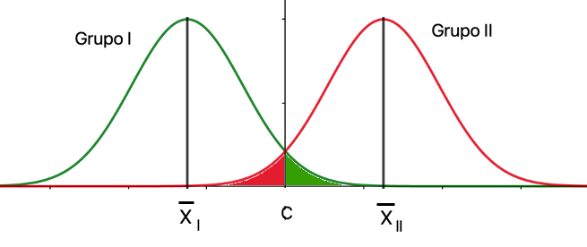
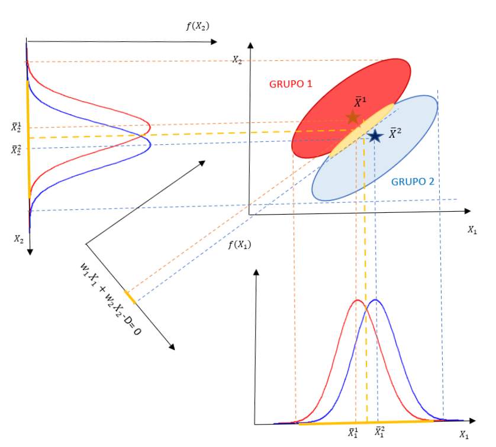
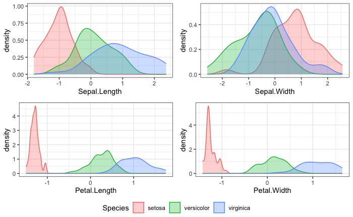
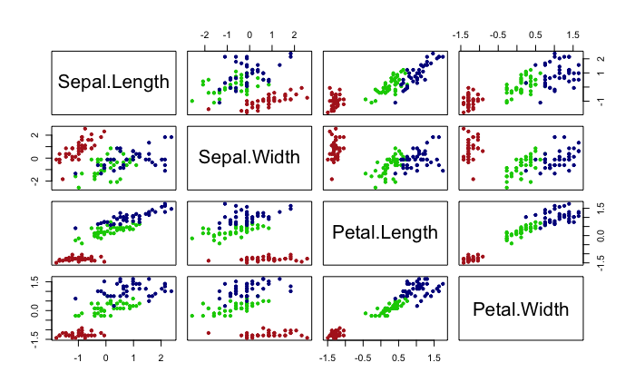
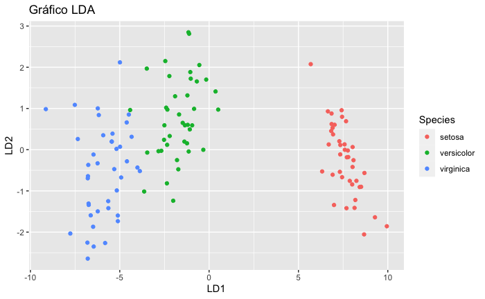
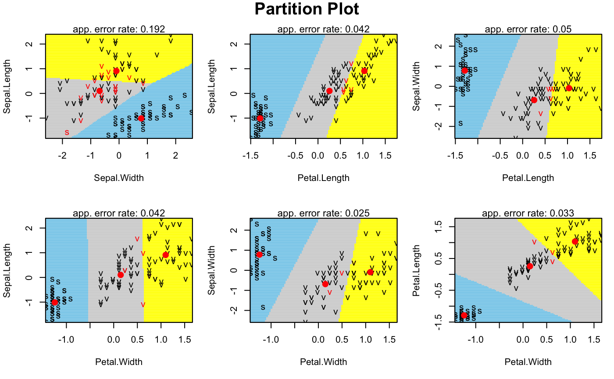
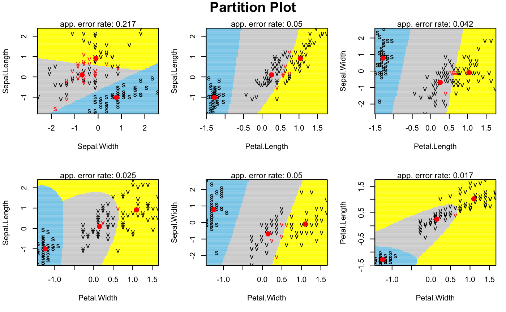

# Análisis discriminante {#cap-discriminante}

*Mª Leticia Meseguer Santamaría*$^{a}$ y *Manuel Vargas Vargas*$^{a}$

$^{a}$Universidad de Castilla-La Mancha

## Introducción

El **análisis discriminante**\index{análisis!discriminante} (AD) es una técnica de dependencia orientada a la clasificación de individuos en grupos (o poblaciones) preexistentes y con ciertas características conocidas, utilizando para ello la información proporcionada por un conjunto de variables clasificadoras.[^discri1] La clasificación se realiza mediante **funciones discriminantes**, combinaciones de las clasificadoras originales y que se emplean como criterio para asignar cada individuo a un grupo o población. 

[^discri1]: La referencia a individuos es en sentido amplio, entendiéndose por individuos no solo personas, sino también objetos, entes, elementos, casos, etc.

De esta forma, en el análisis discriminante se identifican dos **finalidades**: la descriptiva, caracterizando la separación entre grupos al proporcionar la contribución de cada variable clasificadora a dicha separación; y la predictiva, estableciendo el criterio de clasificación de un individuo nuevo en alguno de los grupos a partir de sus valores para las variables clasificadoras.

El problema de la **discriminación** puede plantearse de diversas formas y aparece en numerosas áreas de investigación. El AD se incluye en los modelos denominados **supervisados**, puesto que se conoce *a priori* a qué grupo o población está asignado cada individuo de la muestra, y se utiliza en campos tan diferentes como los sistemas automáticos de concesión de créditos bancarios (*credit scoring*), clasificación de pacientes en función de pruebas diagnósticas, atribución de obras literarias o pictóricas a autores, o en control de calidad, cuando la información es muy costosa o requiere la destrucción de las unidades; entre otros. En el campo de la ingeniería, la discriminación se conoce como *reconocimiento de patrones* (*pattern recognition)* y es utilizada para el diseño de máquinas de clasificación automática (reconocimiento de billetes o monedas, sonidos, etc.).

Aunque existen varios enfoques diferentes, en este capítulo se adoptará el enfoque clásico de Fisher, que asume la normalidad multivariante de las variables clasificadoras. Como punto de partida, para un AD se considera:

- Un conjunto de *N* individuos, de los que se conoce su grupo de pertenencia. Esta información se resume en una variable categórica $Y$ cuyas categorías son los distintos grupos.

- Un conjunto de *k* grupos ($k \geq 2$) con, al menos, dos individuos en cada uno de ellos.

- Un conjunto de *p* variables, medidas en intervalo o razón. Estas variables no deben presentar multicolinealidad, es decir, ninguna clasificadora puede ser combinación lineal de otras clasificadoras. Además, dado el enfoque adoptado, se asume que estas variables siguen una distribución normal multivariante.[^discri2] 

[^discri2]: Este supuesto garantiza que el método clásico propuesto por Fisher es óptimo. En la práctica, el AD es robusto frente a incumplimientos de la normalidad *p*-dimensional, por lo que también se aplica en muchos casos donde no se puede garantizar este requisito.

El número de variables discriminantes debe ser inferior en más de dos al número de individuos ($p<N-2$) para poder identificar los parámetros de las funciones discriminantes. Además, en la práctica, es útil disponer de algún criterio o método que permita seleccionar qué variables se considerarán clasificadoras. Una alternativa pueden ser los métodos de jerarquización de variables desarrollados en análisis de regresión o la selección de variables (*feature selection*,  véase Cap. \@ref(chap-feature)). Como punto inicial, es frecuente que se considere que una variable puede ser clasificadora si presenta diferencias en su distribución entre los grupos, utilizando para ello un *ANOVA*.


Así, el AD busca determinar un criterio o *regla discriminante* que clasifique a cada individuo, $i, \hspace{0,2cm}i=1,..., N$, en uno de los $k$ grupos conociendo las observaciones de cada una de las $p$ variables $X_j$, es decir, el vector ${\bf{x}}_i=(x_{1i},x_{2i}, ... , x_{pi})'$. Estas reglas discriminantes están basadas en la información muestral y en los supuestos que sobre esta se hacen; en el planteamiento clásico de Fisher, al asumir la normalidad de las variables, se basan en el comportamiento, en los $k$ grupos, de los vectores de medias y de las matrices de varianzas-covarianzas (véase Sec. \@ref(120006-aedmulti)). Por ello, se suelen distinguir varios casos que conducen a distintos métodos de obtención de reglas discriminantes, por lo que reciben nombres diferentes:

- El caso más sencillo (e históricamente el más antiguo), además de la normalidad, supone que las matrices de varianzas-covarianzas son iguales en todos los grupos (supuesto de **homocedasticidad**). El método se conoce como **análisis discriminante lineal** (*linear discriminant analysis* o LDA). En este caso, detallado en la Sec. \@ref(150025lda), la diferencia en la distribución de las variables entre los grupos se produce en los vectores de medias, y la función discriminante obtenida es una combinación lineal de las variables clasificadores que minimiza los errores de clasificación. \index{análisis!discriminante!lineal}

- Otra posibilidad es que se asuma la normalidad pero no que todos los grupos tengan la misma matriz de varianzas-covarianzas. En este caso, la función discriminante es una función cuadrática, por lo que el método se conoce como **análisis discriminante cuadrático** (*quadatric discriminant analysis* o QDA), detallado en la Sec. \@ref(150025qda). \index{análisis!discriminante!cuadrático}


Sea cual sea el método elegido, las *reglas discriminantes* que se obtengan para clasificar a un individuo en uno de los grupos deben determinarse minimizando los errores de clasificación, que pueden ser evaluados probabilísticamente al disponer de la distribución de probabilidad de las variables en cada grupo. Así, para cada individuo $i$ y sus valores de las variables clasificadoras ${\bf{x}}_i=(x_{1i},x_{2,i}, ... , x_{pi})'$,  se dispone de las verosimilitudes para cada uno de los $k$ grupos, $L_m\left( {\bf{x}}_i;{\bf{\theta}}_m \right )\ ,1\leq m \leq k$, donde en el vector ${\bf{\theta}}_m$ se recogen los parámetros de la distribución probabilísitica de las variables (en el caso de normalidad, dichos parámetros son la media y la desviación típica).


Conociendo la probabilidad *a priori* de pertenencia de un individuo a cada grupo,[^discri3] $\pi_m \, \ 1 \leq m \leq k$, se puede aplicar el teorema de Bayes (véase \@ref(eq:bayes)) y calcular la probabilidad de que el individuo pertenezca a cada uno de los  grupos $G_m,\hspace{0,2cm} m=1,...,k$. Por ejemplo, para el *m*-ésimo grupo:

[^discri3]: Lo habitual es que la probabilidad *a priori* de pertenencia de un individuo a un grupo
sea $\pi _m = {{1}\over{k}},\hspace{0,2cm} m=1,...,k$, cualquiera que sea el grupo, o bien proporcional al tamaño del grupo.

\begin{equation}
(\#eq:probclas)
P(G_m/ {\bf{x}}_i) = \frac {L_m({\bf{x}}_i;{\bf{\theta}} _m) \pi _m} {\sum_{m=1}^{k} L_i ({\bf{x}}_i;{\bf{\theta}} _m) \pi _m}, \hspace{0,5cm} m \in [1,...,k].
\end{equation}


A partir de esta ecuación, la *regla discriminante* consiste en asignar el individuo al grupo más probable. Dado que el denominador de \@ref(eq:probclas) es constante para todos los grupos, la regla equivale a asignar el individuo al grupo donde sea *ponderadamente* más verosímil. Es decir, el *i*-ésimo individuo se clasifica en el *m*-ésimo grupo si:

\begin{equation}
(\#eq:veroclas)
 L_m({\bold {x}}_i;{\bold{\theta}}_m) \pi_m = \underset {m=1,...,k}{\max} L_m({\bf{x}}_i;{\bold {\theta}}_m) \pi_m,
\end{equation}

ecuación que se simplifica en el caso de igual probabilidad *a priori*, resultando la *regla discriminante* en asignar a cada individuo al grupo más verosímil.


En general, se pueden cometer dos tipos de error: no clasificar al individuo en un grupo cuando realmente pertenece a él o clasificarlo en un grupo al que realmente no pertenece. Si no se conocen los costes de cometer dichos errores (o son iguales), no afectan a la **regla discriminante**; sin embargo, si son conocidos y han de ser tenidos en cuenta, la regla se modificaría, ponderando cada verosimilitud $L_m({\bf{x}}_i;{\bf{\theta}}_m) ,\hspace{0,2cm} m=1,...,k,$ por el coste de clasificar erróneamente un individuo perteneciente al *m*-ésimo grupo.

En las secciones siguientes se abordarán ambos modelos de AD que, aunque no son los únicos, sí representan la gran mayoría de las aplicaciones prácticas.

## Análisis discriminante lineal {#150025lda}

Es un modelo de *AD* basado en los supuestos generales expuestos en el epígrafe anterior ($N$ individuos, $k$ grupos y $p$ variables clasificadoras con distribución normal y sin multicolinealidad) y caracterizado por la **igualdad de las matrices de varianza-covarianza** de las variables en todos los grupos. Para la exposición de la metodología, se presenta el caso más sencillo, con solo dos grupos y probabilidades *a priori* iguales, para generalizarlo posteriormente al caso general de $k$ grupos. 

### Dos grupos y una variable clasificadora
  
Es el caso más simple posible, donde se han de clasificar $N$ individuos en dos grupos (I y II) a partir de la información de una única variable clasificadora, $X$. En este caso, las distribuciones de probabilidad de $X$ en los grupos I y II solo difieren en la media, como se muestra en la Fig. \@ref(fig:150025img01).

<div class="figure" style="text-align: center">

<p class="caption">(\#fig:150025img01)LDA: dos grupos y una variable clasificadora.</p>
</div>

La **regla discriminante** consistirá en asignar cada individuo al grupo con mayor verosimilitud \@ref(eq:veroclas). Como se aprecia, esta regla divide la recta real en dos partes, a la izquierda y a la derecha de $C$, que es el el valor de la recta correspondiente al corte entre las funciones de densidad de los grupos I y II:

\begin{equation}
C=\frac{\overline{x}_I+\overline{x}_{II}}{2},
\end{equation}

quedando la asignación de cada individuo como sigue:[^discri4]

\begin{equation}
\text{si } x_i<C \in \text{ Grupo I y si } x_i>C \in \text{ Grupo II}.
\end{equation}  

[^discri4]: De forma intuitiva, se asigna cada individuo al grupo cuya media está más cercana al valor de la variable. Esta interpretación se generaliza a más variables clasificadoras, asignando cada individuo al grupo cuyo centroide esté más cercano a él. Si la probabilidad *a priori* fuese proporcional al tamaño de los grupos, el punto de corte se calcularía como $C=\frac{n_I\bar{x}_I+n_{II}\bar{x}_{II}}{N}$.

Las probabilidades de los errores que se pueden cometer en la asignación corresponderían a las áreas resaltadas en rojo (individuo asignado al grupo I cuando realmente pertenece al grupo II) y en verde (individuo asignado al grupo II cuando realmente pertenece al grupo I), constituyendo la zona de error de clasificación.[^discri5bis]

[^discri5bis]: Nótese que el menor error de clasificación se obtiene para el punto de corte correspondiente a la intersección de las distribuciones de los dos grupos; sobre la Fig. \@ref(fig:150025img01) se intuye que cualquier desplazamiento del punto de corte reduce uno de los dos errores, pero aumenta en mayor medida el otro.

### Dos grupos y dos variables clasificadoras 

Si, bajo los mismos supuestos, se dispone de dos variables clasificadoras, $X_1$ y $X_2$, se proyectan los elipsoides de ambos grupos sobre las dos variables y se obtiene la Fig. \@ref(fig:150025img02):

<div class="figure" style="text-align: center">

<p class="caption">(\#fig:150025img02)LDA: dos grupos y dos variables clasificadoras.</p>
</div>

Se obtienen, sobre cada variable, zonas de error de clasificación amplias (marcadas en amarillo) que conllevarán errores de clasificación grandes. Sin embargo, si se proyectan ambos elipsoides sobre un nuevo *eje*, obtenido como una combinación lineal de ambas variables clasificadoras ($w_1X_1 + w_2X_2 - D = 0$), es posible reducir la zona de error de clasificación y, como consecuencia, la probabilidad de error de clasificación.

El problema de la obtención de la combinación lineal que minimiza la probabilidad de error de clasificación fue resuelto por Fisher buscando la **función discriminante** que maximiza la separación entre ambos grupos, maximizando la distancia entre sus centroides y minimizando la variabilidad dentro de cada grupo. El procedimiento se detalla para el caso general de $p$ variables.

### Dos grupos y *p* variables clasificadoras 
  
El objetivo es encontrar una **regla discriminante** que permita **separar** ambos grupos. En otros términos, el objetivo es encontrar la **función discriminante de Fisher**, que se plantea como una combinación lineal de las $p$ variables clasificadoras:
\index{función!discriminante de Fisher}

\begin{equation}
D=w_1X_1+w_2X_2+...+w_pX_p,
\end{equation}

que asigna al individuo *i*-ésimo una **puntuación discriminante** $D_i=w_1X_{1i}+w_2X_{2i}+...+w_pX_{pi}$; expresando matricialmente estas puntuaciones en diferencias respecto a las medias, se tiene que:

\begin{equation}
(\#eq:discr)
\begin{pmatrix} D_1 - \bar{D} \\ D_2 - \bar{D} \\ \vdots \\ {D}_N - \bar{D} \end{pmatrix} = \begin{pmatrix} X_{11} - \bar{X}_1 & X_{21} - \bar{X}_2 & \cdots & X_{p1} - \bar{X}_p \\ X_{12} - \bar{X}_1 & X_{22} - \bar{X}_2 & \cdots & X_{p2} - \bar{X}_p \\ \vdots & \vdots & \ddots & \vdots \\ X_{1N} - \bar{X}_1 & X_{2N} - \bar{X}_2 & \cdots & X_{pN} - \bar{X}_p \\ \end{pmatrix} \ \begin{pmatrix} w_1 \\ w_2 \\ \vdots \\ w_p \\ \end{pmatrix}.
\end{equation}

donde $\bar{D}= w_1\bar{X}_1+ w_2\bar{X}_2+...+w_p\bar{X}_p$, por ser $D$ una combinación lineal de variables normales. En notación abreviada, la ecuación \@ref(eq:discr) se puede expresar como ${\bf{d}}^{*}={{\bf{X}}^{*}}\bf{w}$.

La suma de cuadrados de las desviaciones de la función discriminante respecto a su media quedaría entonces como:


\begin{equation}
(\#eq:discrm)
{\bf{d}}^{*\prime} {\bf{d}}^{*}= {\bf{w}}^{\prime} {\bf{X}}^{*\prime} \bf{X}^{*}\bf{w},
\end{equation}

donde ${\bf{X}}^{*\prime} {\bf{X}}^{*}$ es la matriz simétrica de las desviaciones cuadráticas de las variables clasificadoras respecto a sus medias (o matriz **suma de cuadrados y productos cruzados**, SCPC). Esta matriz se puede descomponer en la suma de dos matrices: la SCPC **entregrupos** o **intergrupos**, $\bf{F}$, y la SCPC **residual** o **intragrupos**, $\bf{U}$, por lo que la ecuación \@ref(eq:discrm) se puede reexpresar como:

\begin{equation}
(\#eq:discrp)
{\bf{d}}^{*\prime} {\bf{d}}^{*}={\bf{w}}^{\prime} \bf{Fw}+ {\bf{w}}^{\prime} \bf{Uw}.
\end{equation}

Fisher propuso determinar el vector de pesos, $\bf{w}$, buscando que se produzca la máxima discriminación entre los grupos, maximizando la variabilidad entre grupos respecto a la variabilidad intragrupos, es decir:


\begin{equation}
(\#eq:discanova)
\max \frac{{\bf{w}}^{\prime} \bf{Fw}} {{\bf{w}}^{\prime} \bf{Uw}}.
\end{equation}

Como esta expresión es invariante frente a cambios de escala, maximizar \@ref(eq:discanova) es equivalente a maximizar ${\bf{w}}^{\prime} \bf{Fw}$ con la condición ${\bf{w}}^{\prime} \bf{Uw} =1$ que, aplicando los multiplicadores de Lagrange, implica:

\begin{equation}
\begin{array}{crl}
L= {\bf{w}}^{\prime} {\bf{Fw}} - \lambda ({{\bf{w}}^{\prime} {\bf{Uw}}}-{1}) \Rightarrow \frac{\partial L}{\partial {\bf{w}}}=2{\bf{Fw}}-2\lambda\bf{Uw}=\bf{0} \Rightarrow \\
\Rightarrow \bf{Fw}=\lambda \bf{Uw} \Rightarrow {\bf{(U}}^{-1} \bf{F)w}=\lambda \bf{w}. \\
\end{array}
\end{equation}

Así, el autovector asociado al mayor autovalor de la matriz $\textbf{U}^{-1}\textbf{F}$ proporcionará los coeficientes de la **función discriminante lineal de Fisher** que mejor separa ambos grupos.

El **punto de corte (C)** se obtiene evaluando la función discriminante en la media de cada grupo y calculando la media de las medias grupales ponderadas por el tamaño del grupo:

\begin{equation}
\begin{array}{crl}
\bar{D}_I=w_1\bar{X}_{1I}+w_2\bar{X}_{2I}+...+w_p\bar{X}_{pI} \\ 
\bar{D}_{II}=w_1\bar{X}_{1II}+w_2\bar{X}_{2II}+...+w_p\bar{X}_{pII}, \\ 
\end{array}
\end{equation}

\begin{equation}
C= \frac{n_I \bar{D}_I + n_{II} \bar{D}_{II}}{N}, 
\end{equation}

y el **criterio de asignación para el $i$-ésimo individuo**, es:

\begin{equation}
\text{si } \ D_i<C \in \text{ Grupo I   y   si } D_i>C \in \text{ Grupo II}.
\end{equation}


### *k* grupos y *p* variables

En caso de existir más de dos grupos, la generalización del caso anterior es relativamente sencilla. Siguiendo la misma idea utilizada para dos grupos, se debe obtener un número de **funciones discriminantes de Fisher** suficiente para separar lo más posible los $k$ grupos; este número es $T=\min {(k-1,p)}$.[^discri5]

[^discri5]: Para separar linealmente $k$ grupos hacen falta $k-1$ hiperplanos, pero su obtención está también limitada por el número $p$ de variables clasificadoras.

Cada una de las $T$ funciones discriminantes es una combinación lineal de las $p$ variables clasificadoras:

\begin{equation}
D_t=w_{t1}X_1+w_{t2}X_2+...+w_{tp}X_p\hspace{0,5cm} t=1,...T,
\end{equation}

donde se exige que el coeficiente de correlación lineal entre cada dos funciones discriminantes distintas sea nulo.

La suma de cuadrados de las desviaciones de la matriz $\textbf{D}$ de funciones discriminantes respecto a sus medias tendría una expresión equivalente a la ecuación \@ref(eq:discrm):

\begin{equation}
(\#eq:discrmg) 
\bf{D}^{*\prime} {\bf{D}}^{*}= {\bf{W}}^{\prime} {\bf{X}}^{* \prime}{\bf{XW}}.
\end{equation}

Para que las funciones discriminen lo máximo posible a los $k$ grupos, las combinaciones lineales han de maximizar la variabilidad entre los grupos respecto a la variabilidad intragrupos, en un razonamiento análogo al expuesto en la ecuación \@ref(eq:discanova):

\begin{equation}
(\#eq:discanova)
\max \frac{{\bf{W}}^{\prime} \bf{FW}} {{\bf{W}}^{\prime} \bf{UW}}.
\end{equation}

Al tratarse de una función homogénea, la maximización de \@ref(eq:discanova)  equivale a maximizar ${\bf{W}}^{\prime}\bf{FW}$ con la condición ${{\bf{W}}^{\prime}\bf{UW}}=1$, que, aplicando los multiplicadores de Lagrange, implica:

\begin{equation}
\begin{array}{crl}
L= {\bf{W}}^{\prime} {\bf{FW}} - \lambda ({{\bf{W}}^{\prime} {\bf{UW}}}-{1}) \Rightarrow \frac{\partial L}{\partial {\bf{w}}}=2{\bf{FW}}-2\lambda\bf{UW}=\bf{0} \Rightarrow \\
\Rightarrow \bf{FW}=\lambda {\bf{UW}} \Rightarrow {({\bf{U}}^{-1} {\bf{F}}}){W}=\lambda \bf{w}. \\
\end{array}
\end{equation}


Por tanto, el autovector asociado al mayor autovalor de la matriz $\textbf{U}^{-1}\textbf{F}$ (generalmente no simétrica) proporciona los coeficientes de la **primera función discriminante lineal de Fisher**, siendo el autovalor la proporción de la varianza total explicada por las $T$ funciones discriminantes que recoge la primera función.

Para obtener el resto de funciones discriminantes, basta con ir eligiendo los siguientes autovectores asociados a los autovalores, ordenados decrecientemente. Como los autovectores son linealmente independientes, las funciones de discriminación están incorrelacionadas.[^discri6]


[^discri6]: Como la capacidad discriminante de la funciones va decreciendo, puede haber casos donde no se consideren relevantes todas, sino las $h$ primeras. En ese caso, la variabilidad explicada por una de estas $h$ funciones discriminantes, por ejemplo la $r$-ésima,  sería $\lambda_r$, por lo que la proporción de variabilidad atribuible a dicha función sería $D_r=\frac {\lambda_r}{\sum _{t=1} ^{h} \lambda_t}, \hspace{0,2cm} t=1,...h$.

De esta forma, la primera función discriminante, $D_1$, es la que proporciona mayor discriminación entre los centroides de los grupos; $D_2$, incorrelacionada con  $D_1$, es la que proporciona mayor discriminación, después de $D_1$; y así sucesivamente: $D_t$ es la que produce mayor discriminación entre los centroides de los grupos, después de las $t-1$ anteriores, y está incorrelacionada con todas las anteriores. 

### Discriminante lineal con **R**: la función `lda()`

A continuación se ejemplifica la aplicación de un **discriminante lineal** con **R**. Para ello, se utilizará y cargará la base de datos `iris`, que consta de 150 observaciones y 5 variables, 4 numéricas, que serán las clasificadoras, y una categórica, sobre la que se realiza el análisis, con tres categorías: $setosa$, $versicolor$ y $virginica$.


```r
library("caret")
library("MASS")
library("klaR")
data("iris")
```

Se clasificarán las flores $iris$, identificadas con la variable `Species` (especies de $iris$), utilizando como variables clasificadoras: `Sepal.Length` (longitud del sépalo), `Sepal.Width` (anchura del sépalo), `Petal.Lenght` (longitud del pétalo) y `Petal.Width` (anchura del pétalo).

Para evaluar la capacidad predictiva del análisis discriminante, se divide el conjunto de datos en dos subconjuntos: el de entrenamiento o estimación (con el 80% de ellos) y el de test (con el 20% restante).[^discri7]

[^discri7]: Esta estrategia es muy común en modelos predictivos, y tiene como objetivo evitar el **sobreajuste** de los datos muestrales; así, los datos del conjunto de test son realmente "nuevos" para el modelo porque no han sido utilizados en la estimación.

Las distribuciones univariadas deben ser normales; si no fuera así, se podrían transformar utilizando las transformaciones logarítimicas y de raíces cuadradas (distribuciones exponenciales) y Box-Cox (distribuciones sesgadas). Igualmente, es conveniente estandarizar las variables para evitar que la diferencia de escalas influya en la importancia relativa de cada variable clasificadora en las funciones discriminantes.


```r
# División de los datos: 80% para entrenamiento y 20% para test
set.seed(123)
muestra <- iris$Species |>
  createDataPartition(p = 0.8, list = FALSE)
entrenamiento_d <- iris[muestra, ]
test_d <- iris[-muestra, ]
# Estimación de los parámetros de preprocesamiento (estandarización)
preproc_param <- entrenamiento_d |>
  preProcess(method = c("center", "scale"))
# Transformación de los datos usando los parámetros estimados
entrenamiento_t <- preproc_param |> predict(entrenamiento_d)
test_t <- preproc_param |> predict(test_d)
```

Una inspección previa de los datos puede ayudar a detectar si las variables clasificadoras pueden contribuir a la discriminación entre los grupos. En este ejemplo, la Fig. \@ref(fig:150025pre) muestra la función de densidad de cada variable sobre cada grupo con los datos del subconjunto de entrenamiento:


```r
library("ggplot2")
library("ggpubr")

p1 <- ggplot(data = entrenamiento_t, aes(x = Sepal.Length, fill = Species, colour = Species)) +
  geom_density(alpha = 0.3) +
  theme_bw()
p2 <- ggplot(data = entrenamiento_t, aes(x = Sepal.Width, fill = Species, colour = Species)) +
  geom_density(alpha = 0.3) +
  theme_bw()
p3 <- ggplot(data = entrenamiento_t, aes(x = Petal.Length, fill = Species, colour = Species)) +
  geom_density(alpha = 0.3) +
  theme_bw()
p4 <- ggplot(data = entrenamiento_t, aes(x = Petal.Width, fill = Species, colour = Species)) +
  geom_density(alpha = 0.3) +
  theme_bw()
ggarrange(p1, p2, p3, p4, ncol = 2, nrow = 2, common.legend = TRUE, legend = "bottom")
```

<div class="figure" style="text-align: center">

<p class="caption">(\#fig:150025pre)Función de densidad de cada variable clasificadora sobre los grupos.</p>
</div>

Igualmente, los gráficos bivariantes pueden ayudar a ver si hay "distancias" entre los centroides de los grupos para las variables clasificadoras, como muestra la Fig. \@ref(fig:150025pre3):


```r
pairs(x = entrenamiento_t[, -5], col = c("firebrick", "green3", "darkblue")[entrenamiento_t$Species], pch = 20)
```

<div class="figure" style="text-align: center">

<p class="caption">(\#fig:150025pre3)Diagramas bivariantes de dispersión de las variables clasificadoras.</p>
</div>

Como se observa en dichos gráficos, las variables clasificadoras pueden contribuir a la discriminación entre las tres especies de flores *iris*. 

Para aplicar la función `lda()` se debe especificar la variable de clasificación (`Species`) y el conjunto de datos (`entrenamiento_t`); de forma opcional, se pueden especificar las probabilidades *a priori*  (`prior`, por defecto se usa `proportions`), el método de estimación de las medias y varianzas (`method`, por defecto `moment`) o el argumento `CV` para obtener los grupos pronosticados y las probabilidades *a posteriori* (por defecto, `CV=FALSE`).


```r
options(digits = 4)
modelo_lda <- lda(Species ~ ., data = entrenamiento_t)
modelo_lda
#> Call:
#> lda(Species ~ ., data = entrenamiento_t)
#> 
#> Prior probabilities of groups:
#>     setosa versicolor  virginica 
#>     0.3333     0.3333     0.3333 
#> 
#> Group means:
#>            Sepal.Length Sepal.Width Petal.Length Petal.Width
#> setosa          -1.0113     0.78049      -1.2900     -1.2453
#> versicolor       0.1014    -0.68675       0.2566      0.1473
#> virginica        0.9099    -0.09374       1.0334      1.0981
#> 
#> Coefficients of linear discriminants:
#>                  LD1      LD2
#> Sepal.Length  0.6795  0.04464
#> Sepal.Width   0.6565 -1.00330
#> Petal.Length -3.8365  1.44176
#> Petal.Width  -2.2722 -1.96516
#> 
#> Proportion of trace:
#>    LD1    LD2 
#> 0.9902 0.0098
```

La salida muestra las **probabilidades previas** (*Prior probabilities of groups*) y los **centroides de cada grupo** (*Group means*). A continuación muestra las **funciones discriminantes de Fisher** mediante los respectivos coeficientes $w_{jt}$. En este caso, las dos funciones discriminantes son:  

$D_1=0.6795 \cdot SL+0.6565 \cdot SW-3,8365 \cdot PL-2,2722 \cdot PW$

$D_2=0.0446 \cdot SL-1.0033 \cdot SW+1.4418 \cdot PL-1.9651 \cdot PW,$

con una proporción de discriminación de 0,9902 y 0,0098, respectivamente.

La proyección de los individuos (en este caso flores) en el plano formado por las dos funciones discriminantes se recoge en la Fig. \@ref(fig:150025graf):


```r
datos_lda <- cbind(entrenamiento_t, predict(modelo_lda)$x)
ggplot(datos_lda, aes(LD1, LD2)) +
  geom_point(aes(color = Species)) +
  ggtitle("Gráfico LDA")
```

<div class="figure" style="text-align: center">

<p class="caption">(\#fig:150025graf)Proyección de los individuos (flores) sobre las dos funciones discriminantes.</p>
</div>

Como se aprecia, la primera función discriminante es la que mayor contribución tiene a la separación entre los grupos, separando muy claramente a la especie *setosa* y, en menor medida, a las especies *virginica* y *versicolor*, grupos entre los que hay un pequeño grado de solapamiento. Por otro lado, la segunda función discriminante, con una proporción de discriminación de 0,0098, apenas contribuye a la separación entre grupos.

Por último, mediante la función `partimat()` del paquete `klaR`, se puede visualizar cómo quedan las regiones bivariantes que clasifican  los individuos en cada clase (Fig. \@ref(fig:150025partimat)):


```r
partimat(Species ~ ., data = entrenamiento_t, method = "lda", image.colors = c("skyblue", "lightgrey", "yellow"), col.mean = "red")
```

<div class="figure" style="text-align: center">

<p class="caption">(\#fig:150025partimat)Regiones bivariantes de clasificación en cada grupo (centroides en rojo): $setosa$ (celeste), $versicolor$ (gris) y $virginica$ (amarillo).</p>
</div>

Por último, aplicando las funciones discriminantes a los datos reservados para estudiar la capacidad predictiva del modelo, se obtiene la tabla conocida como **matriz de confusión**, donde se compara el grupo real con el pronosticado por el modelo:


```r
predicciones_lda <- modelo_lda |> predict(test_t)
table(test_t$Species, predicciones_lda$class, dnn = c("Grupo real", "Grupo pronosticado"))
#>             Grupo pronosticado
#> Grupo real   setosa versicolor virginica
#>   setosa         10          0         0
#>   versicolor      0         10         0
#>   virginica       0          1         9
mean(predicciones_lda$class == test_t$Species)
#> [1] 0.9667
```

 En este caso, se clasifican correctamente 29 de las 30 "nuevas" flores, indicando un grado de ajuste del 96,9667%.
 
 
 

## Análisis discriminante cuadrático  {#150025qda}

En el discriminante lineal visto anteriormente, se asume que las variables clasificadoras tienen idénticas matrices de varianzas-covarianzas en los distintos grupos, supuesto que garantiza que las funciones discriminantes son combinaciones lineales de las variables clasificadoras.

Es posible eliminar esta restricción, permitiendo que las matrices de varianzas-covarianzas sean diferentes en los grupos, lo que introduce términos cuadráticos en las funciones discriminantes que conducen límites de decisión curvilíneos, por lo que el análisis discriminante cuadrático (QDA) puede aplicarse a situaciones en las que la separación entre grupos no es lineal.

Denominando $\pi_m$ a la probabilidad *a priori* de pertenecer al grupo $G_m$ y ${\bf{\mu}}_m$ y ${\bf{\Sigma}}_m$ al vector de medias y matriz de varianzas-covarianzas, respectivamente, en dicho grupo, a partir del vector de observaciones $\bf x$, se puede obtener el **discriminante cuadrático** como:[^discri9]

[^discri9]: Al existir $k$ grupos, hay $k(k-1)/2$ comparaciones entre grupos diferentes, que han de ser consideradas en conjunto.


\begin{equation}
(\#eq:qda)
\begin{array}{crl}
Q_{uv}\left({\bf{x}}\right)=\frac{1}{2}{\bf{x}}^{\prime}\left({\bf{\Sigma}}_u^{-1}-{\bf{\Sigma}}_v^{-1}\right){\bf{x}}+{\bf{x}}^{\prime} \left({\bf{\Sigma}}_u^{-1}{\bf{\mu}}_u-{\bf{\Sigma}}_v^{-1}{\bf{\mu}}_v\right){\bf{x}}+ \\
+ \frac{1}{2}{\bf{\mu}}_v^{\prime}{\bf{\Sigma}}_v^{-1}{\bf{\mu}}_v-\frac{1}{2}{\bf{\mu}}_u^{\prime}{\bf{\Sigma}}_u^{-1}{\bf{\mu}}_u+\frac{1}{2}\log \left(\left|{\bf{\Sigma}}_v\right|\right)-\frac{1}{2}\log \left(\left|{\bf{\Sigma}}_u\right|\right) \\
\ \forall u\neq b \, \ i,j=1,2,...,k. \\
\end{array}
\end{equation}

A partir de aquí, la **regla de clasificación** para un individuo consiste en evaluar el discriminante cuadrático \@ref(eq:qda) para los diferentes grupos y, tras simplificaciones algebraicas, asignarlo al grupo $G_h$ que verifique:[^discri_7bis]

[^discri_7bis]: De la comparación dos a dos a partir de $Q_{uv}\left({\bf{x}}\right)$ se obtiene una matriz de comparaciones, que es la que hay que evaluar; pero es más cómodo evaluar cada grupo individualmente y utilizar \@ref(eq:simplificacion).

\begin{equation}
(\#eq:simplificacion)
G_h=\underset{m}{\operatorname{argmax}} \log\pi_m+\frac{1}{2} \log \left |{\bf{\Sigma}}_m\right|-\frac{1}{2}\left({\bf{x}}-{\bf{\mu}}_{m}\right)^{\prime} {\bf{\Sigma}}_m^{-1}\left({\bf{x}}-{\bf{\mu}}_m\right).
\end{equation}


En este caso, los límites de la región de clasificación son ecuaciones cuadráticas del vector $\bf{x}$.

Finalmente, es pertinente señalar que el LDA es mucho más flexible que el QDA, y que tiene una varianza mucho menor, lo cual puede dar lugar a mejores clasificaciones que con QDA. Sin embargo, si el supuesto de igualdad de matrices de varianzas-covarianzas en cada grupo dista mucho de cumplirse, entonces el LDA puede tener un sesgo importante. El LDA suele ser mejor opción que el QDA si el subconjunto de entrenamiento es pequeño y la reducción de la varianza se convierte en un objetivo importante. Si el conjunto de entrenamiento tiene un tamaño grande, la varianza del clasificador no es un problema y el QDA sería la mejor opción; también lo es en caso de un incumplimiento significativo del supuesto de igualdad de varianzas covarianzas del LDA.


### Discriminante cuadrático con **R**: la función `qda()`

Para ilustrar la realización de un análisis discriminante cuadrático en **R**, se aplica la función `qda()` a los datos `iris` utilizados en el caso lineal. La elección de la misma base de datos responde a un planteamiento didáctico, para poder comparar los resultados de ambos métodos y las diferencias que produce asumir la igualdad de matrices de varianzas-covarianzas (método lineal) o no asumirlas (método cuadrático).[^discri8]

[^discri8]: En una situación real, la estrategia más razonable sería decidir previamente sobre la hipótesis de igualdad de la matrices de varianzas-covarianzas (utilizando, por ejemplo el contraste *M de Box*, aunque es muy sensible al supuesto de normalidad multivariante) y, en función del resultado, optar por una de las dos alternativas.


```r
options(digits = 4)
modelo_qda <- qda(Species ~ ., data = entrenamiento_t)
modelo_qda
#> Call:
#> qda(Species ~ ., data = entrenamiento_t)
#> 
#> Prior probabilities of groups:
#>     setosa versicolor  virginica 
#>     0.3333     0.3333     0.3333 
#> 
#> Group means:
#>            Sepal.Length Sepal.Width Petal.Length Petal.Width
#> setosa          -1.0113     0.78049      -1.2900     -1.2453
#> versicolor       0.1014    -0.68675       0.2566      0.1473
#> virginica        0.9099    -0.09374       1.0334      1.0981
```

La representación gráfica de las áreas por las que se clasifican los individuos se muestra en la Fig. \@ref(fig:150025partimatc).


```r
partimat(Species ~ ., data = entrenamiento_t, method = "qda", image.colors = c("skyblue", "lightgrey", "yellow"), col.mean = "red")
```

<div class="figure" style="text-align: center">

<p class="caption">(\#fig:150025partimatc)Regiones bivariantes de clasificación en cada grupo (centroides en rojo): $setosa$ (celeste), $versicolor$ (gris) y $virginica$ (amarillo).</p>
</div>

Como se aprecia, ahora los contornos de las áreas no son siempre lineales, sino que incluyen fronteras cuadráticas. Por último, aplicando el discriminante cuadrático a los datos reservados para estudiar la capacidad predictiva del modelo, se obtiene la 
**matriz de confusión**, donde se observa que no se mejoran los resultados respecto al discriminante lineal.


```r
predicciones_qda <- modelo_qda |> predict(test_t)
table(test_t$Species, predicciones_qda$class, dnn = c("Grupo real", "Grupo pronosticado"))
#>             Grupo pronosticado
#> Grupo real   setosa versicolor virginica
#>   setosa         10          0         0
#>   versicolor      0         10         0
#>   virginica       0          1         9
mean(predicciones_qda$class == test_t$Species)
#> [1] 0.9667
```


::: {.infobox_resume data-latex=""}
### Resumen {-}

- El *análisis discriminante* permite clasificar individuos en distintos grupos preexistentes en relación a una variable cualitativa, a partir de las variables clasificadoras. 

<br>

- La información se sintetiza en las funciones discriminantes. Su uso puede tener una finalidad descriptiva: identificar la separación entre grupos y la contribución de cada variable clasificadora; y una finalidad predictiva: clasificar un individuo nuevo.

<br>

- Los principales tipos son el lineal y el cuadrático, que se desarrollan en **R** con las funciones `lda()` y `qda()`, respectivamente.
:::
