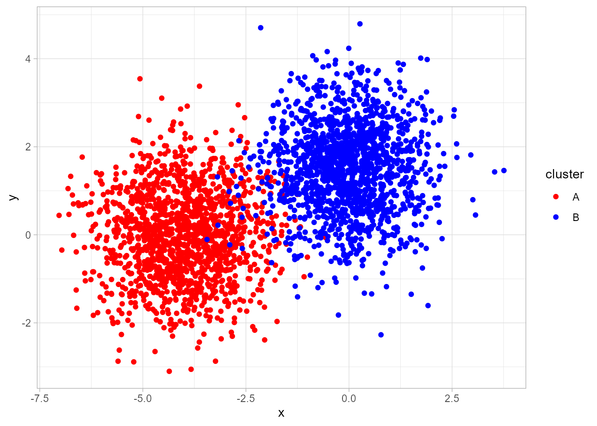
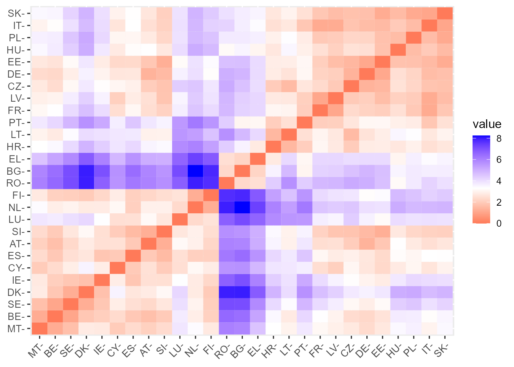
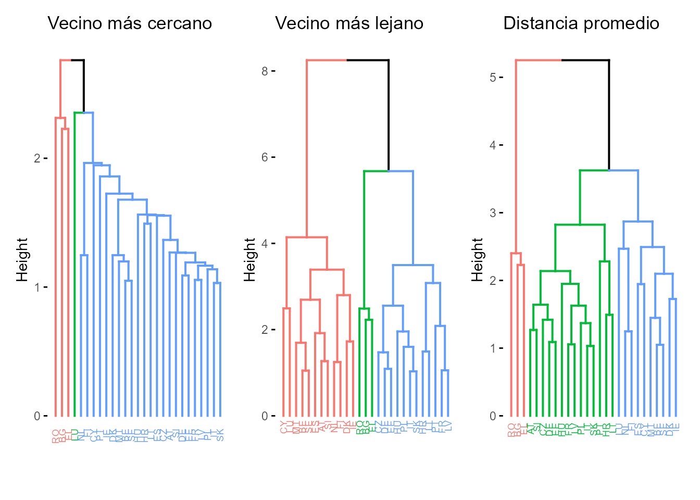
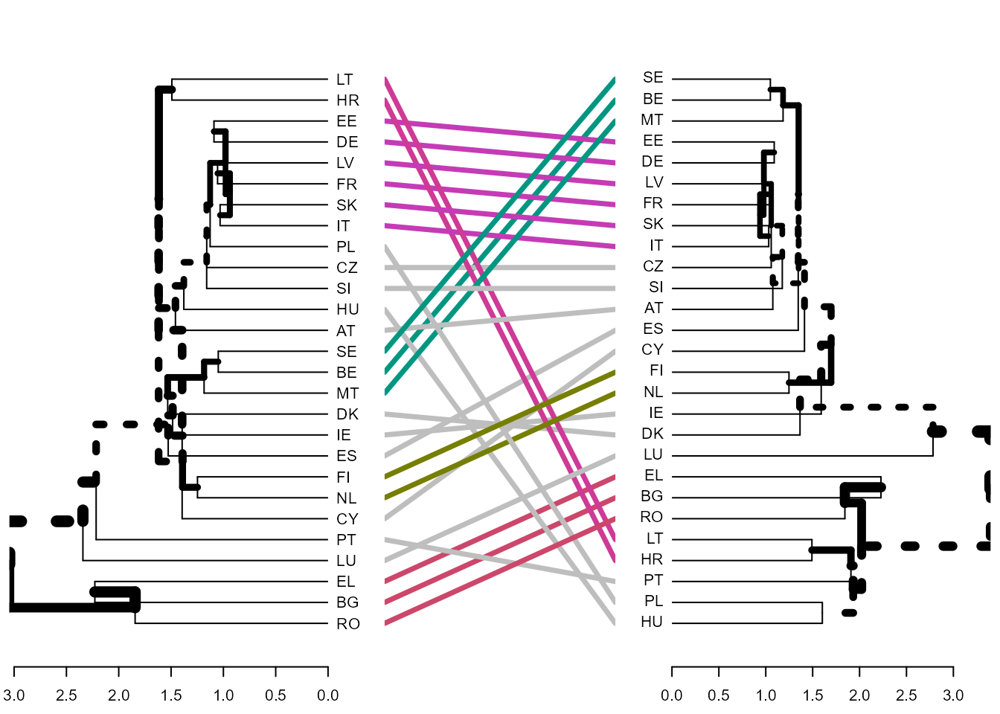
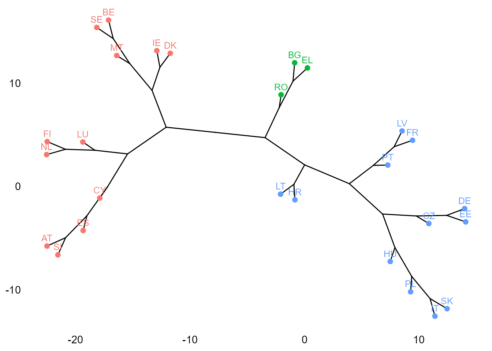
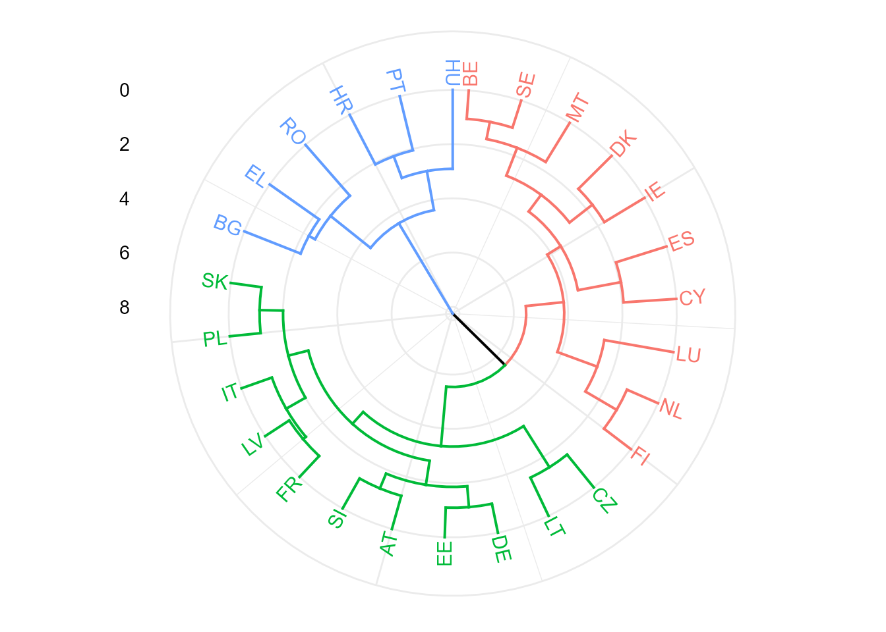
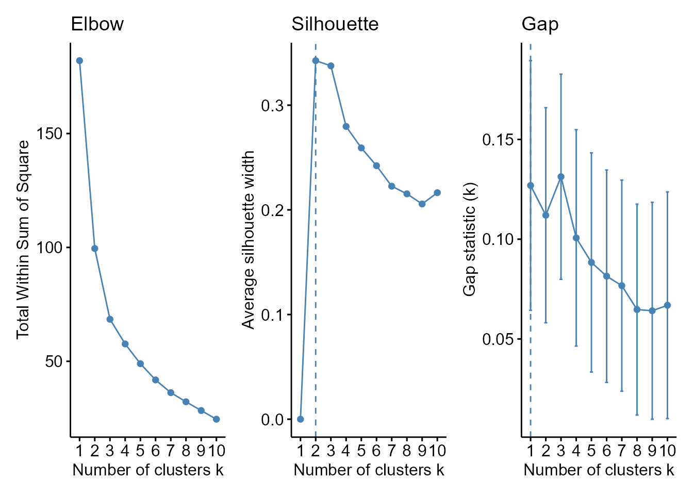

# (PART) Machine learning no supervisado {.unnumbered}

# Análisis clúster: clusterización jerárquica {#cap-cluster}

*José-María Montero*$^{a}$ y *Gema Fernández-Avilés*$^{a}$
 
$^{a}$Universidad de Castilla-La Mancha
\
\index{tecnicas@técnicas de agrupación}

## Introducción {#origen-cluster}

El origen de la actividad agrupatoria, hoy en día conocida como análisis clúster o de conglomerados (AC), taxonomía numérica o reconocimiento de patrones, entre otras denominaciones, se remonta a tiempos de Aristóteles y su discípulo Teofrasto. Por tanto, tiene unas profundas raíces y hoy en día se aplica en todos los campos del saber. Se ha evitado la palabra "clasificación" porque existe una pequeña diferencia entre agrupación y clasificación. En la actividad clasificatoria se conoce el número de grupos y qué observaciones del conjunto de datos pertenecen a cada uno, siendo el objetivo clasificar nuevas observaciones en los grupos ya existentes. En la actividad agrupatoria, el número de grupos puede ser conocido (normalmente no lo es), pero no las observaciones que pertenecen a cada uno de ellos, siendo el objetivo la asignación de dichas observaciones a diferentes grupos. Este y el siguiente capítulo se centran en este último problema, al cual se hará referencia por su denominación más popular: AC.

\index{análisis!clúster}
\index{clusterización}
\index{clusterización!jerárquica}
\index{clusterización!no jerárquica}
\index{agrupación}
\index{clasificación}

El AC está orientado a la síntesis de la información contenida en un conjunto de datos, normalmente una muestra relativa a objetos, individuos o, en general, elementos, definidos por una serie de características, con vistas a establecer una agrupación de los mismos en función de su mayor o menor homogeneidad. En otros términos, el AC trata de agrupar dichos elementos en grupos mutuamente excluyentes, de tal forma que los elementos de cada grupo sean lo más parecidos posible entre sí y lo más diferentes posible de los pertenecientes a otros grupos (Fig. \@ref(fig:cluster-sim-ch27)).

Para llevar a cabo un AC, se debe tomar una serie de decisiones:

-   Selección de las variables en función de las cuales se van a agrupar los elementos.
-   Elección del tipo de distancia o medida de similitud que se va a utilizar para medir la disimilitud entre los elementos objeto de clasificación.
-   Elección de la técnica para formar los grupos o conglomerados.
-   Determinación del número óptimo de clústeres (si no se determina *a priori*).

<div class="figure" style="text-align: center">

<p class="caption">(\#fig:cluster-sim-ch27)Datos simulados que presentan clústeres.</p>
</div>


En este capítulo se abordarán la primera y, sobre todo, la segunda cuestión, dejando las otras dos para el capítulo siguiente.

Como ilustración práctica, se utilizará la base de datos `TIC2021` del paquete `CDR`, relativa a las estadísticas de uso de las TIC en la Unión Europea en 2021.

## Selección de las variables

La selección de las $p$ variables o características, $\{X_1, X_2, ..., X_p\}$, en función de las cuales se va a proceder a la agrupación de los $n$ elementos disponibles es crucial, ya que determina la agrupación final, independientemente de los procedimientos técnicos utilizados. Una vez determinadas estas, la información disponible sobre los  elementos objeto de agrupación será la que se muestra en la Tabla \@ref(tab:info-muestral).

|              | $X_1$    | $X_2$    | $X_3$    | $\cdots$ | $X_p$    |
|:------------:|----------|----------|----------|----------|----------|
| Elemento $1$ | $x_{11}$ | $x_{21}$ | $x_{31}$ | $\cdots$ | $x_{p1}$ |
| Elemento $2$ | $x_{12}$ | $x_{22}$ | $x_{32}$ | $\cdots$ | $x_{p2}$ |
| Elemento $3$ | $x_{13}$ | $x_{23}$ | $x_{33}$ | $\cdots$ | $x_{p3}$ |
|   $\cdots$   | $\cdots$ | $\cdots$ | $\cdots$ | $\cdots$ | $\cdots$ |
| Elemento $n$ | $x_{1n}$ | $x_{2n}$ | $x_{3n}$ | $\cdots$ | $x_{pn}$ |

: (#tab:info-muestral) Información muestral

En definitiva, la información de partida (véase Tabla \@ref(tab:info-muestral)) es una matriz $\bf X_{\textit n\times \textit p}$ donde cada elemento viene representado por un punto en el espacio $p$-dimensional de variables, es decir, una matriz que proporciona los valores de las variables para cada elemento.[^cluster-1]

[^cluster-1]: También podría observarse $\bf X$ por columnas (la *j*-ésima columna muestra los valores de la *j*-ésima variable para cada elemento de la muestra). Aparentemente, no hay razón alguna para no poder agrupar las variables que describen cada elemento (clúster de variables en vez de elementos). \index{cluster@clúster de variables}

Una cuestión a tener en cuenta es el número de variables a considerar en el AC. La exclusión de variables relevantes generará una agrupación deficiente. La inclusión de variables irrelevantes complicará el proceso de agrupamiento sin procurar ganancias sustantivas. Dado que el miedo del investigador vendrá por el lado de la exclusión de variables relevantes, tenderá a incluir un número excesivo de variables (muchas de ellas correlacionadas). Por ello, se recomienda realizar previamente un análisis de componentes principales (véase Cap. \@ref(acp)), lo que reduce la dimensionalidad del problema, y llevar a cabo el AC a partir de las componentes principales retenidas (incorrelacionadas, evitando así redundancias). La eliminación de información redundante es una cuestión importante en el proceso de clusterización, porque dicha información estaría sobreponderada en el resultado obtenido. Una solución menos drástica a este problema es la utilización de la distancia de Mahalanobis, que, como se verá posteriormente, corrige estas redundancias.

\index{componentes principales}
Otra cuestión importante en este momento es decidir si las variables (o componentes principales en su caso) seleccionadas se utilizarán estandarizadas o no. No existe consenso sobre la cuestión, si bien se suele recomendar su estandarización para evitar consecuencias no deseadas derivadas de la distinta escala y/o unidades de medida. No obstante, autores tan relevantes como @edelbrock1979mixture y @brian1993cluster están en contra y proponen las siguientes alternativas: ($i$) recategorizar todas las variables en variables binarias y aplicar a estas una distancia apropiada para ese tipo de medidas; $(ii)$ realizar distintos AC con grupos de variables homogéneas (en cuanto a su métrica) y sintetizar después los diferentes resultados; y $(iii)$ utilizar la distancia de Gower, que es aplicable con cualquier tipo de métrica.


## Elección de la distancia entre elementos {#clusterdist}

Una vez se dispone de la matriz de información $\bf X_{\textit n\times \textit p}$ , \index{distancia} la segunda etapa en el AC consiste en la creación de una nueva matriz $\bf D_{\textit n\times \textit n}$ cuyos elementos $\{d_{r,s}\}$ sean las distancias o disimilaridades entre los elementos objeto de agrupamiento.

\index{distancia}
\index{matriz! de distancias}
\index{disimilaridad}

En caso de variables cuantitativas, la distancia entre dos elementos en un espacio de $p$ dimensiones, $d({\bf x}_r;{\bf{x}}_{s})$, se define como una función que asocia un número real a cada dos puntos de $\mathbb{R}^{p}$ y que verifica:[^cluster-2]

[^cluster-2]: Si se cumple el cuarto requisito la función distancia suele llamarse distancia métrica.

-   $d({\bf x}_r;{\bf{x}}_{s}) \geq0$,

-   $d({\bf x}_r;{\bf{x}}_{s})=0$ si y solo si ${\bf{x}}_{r}={\bf x}_{s}$,

-   $d({\bf x}_r;{\bf{x}}_{s})=d({\bf x}_s;{\bf{x}}_{r})$,

-   $d({\bf x}_r;{\bf{x}}_{s})+d({\bf x}_j;{\bf{x}}_{h}) \geq d({\bf x}_r;{\bf{x}}_{h}), \quad \forall{\bf{x}}_{k} \in \mathbb{R}^{p}$.

Con variables cualitativas, la similitud entre dos elementos, $s({\bf x}_r;{\bf{x}}_{s})$, es una función que 
asocia un número real a cada dos puntos de $\mathbb{R}^{p}$ y que verifica:  \index{similitud}

-   $s({\bf x}_r;{\bf{x}}_s) \leq s_0$, donde $s_0$ es un número real finito arbitrario (normalmente 1),
-   $s({\bf x}_r;{\bf{x}}_{s})=s_0$ si y solo si ${\bf{x}}_{r}={\bf x}_{s}$,
-   $s({\bf x}_r;{\bf{x}}_{s})=s({\bf x}_s;{\bf{x}}_{r})$,
-   $|s({\bf x}_r;{\bf{x}}_{s})+s({\bf x}_s;{\bf{x}}_{h})|s({\bf x}_r;{\bf{x}}_{h}) \geq s({\bf x}_r;{\bf{x}}_{s})s({\bf x}_s;{\bf{x}}_{h}) \quad \forall{\bf{x}}_{h}\in \mathbb{R}^{p}$.

Las formas de medir la distancia o similaridad entre dos elementos que satisfacen las condiciones expuestas son muy numerosas. Las más populares son las siguientes:

**Variables cuantitativas**

-   **Distancia euclídea.** \index{distancia!euclídea} Se define como: \begin{equation}
    d_{e}({\bf x}_r;{\bf{x}}_{s})=\sqrt{\sum_{j=1}^{p}\left(  x_{jr}-x_{js}\right)  ^{2}}.
    \end{equation}
\index{distancia!euclídea}
\index{distancia!euclídea al cuadrado}

Ignora las unidades de medida de las variables y, en consecuencia, aunque es invariante a los cambios de origen, no lo es a los cambios de escala. También ignora las relaciones entre ellas. Resulta de utilidad con variables cuantitativas incorrelacionadas y medidas en las mismas unidades. El cuadrado de la distancia euclídea \index{distancia!euclídea al cuadrado} también suele utilizarse como distancia. Para el conjunto de datos `TIC2021`, la distancia euclídea se obtiene ejecutando el siguiente código:

```r
library("CDR")
data("TIC2021")
library("factoextra")

tic <- scale(TIC2021) # estandariza las variables
d_euclidea <- get_dist(x = tic, method = "euclidea")
as.matrix(d_euclidea)[1:5, 1:5]
#>          BE       BG       CZ       DK       DE
#> BE 0.000000 6.421631 2.417212 1.870962 2.304686
#> BG 6.421631 0.000000 4.616177 7.988106 4.871235
#> CZ 2.417212 4.616177 0.000000 3.765714 1.366011
#> DK 1.870962 7.988106 3.765714 0.000000 3.607589
#> DE 2.304686 4.871235 1.366011 3.607589 0.000000
```


```r
fviz_dist(dist.obj = d_euclidea, lab_size = 10)
```

<div class="figure" style="text-align: center">

<p class="caption">(\#fig:plot-dist-euclidea)$Heatmap$ de  distancias euclídeas.</p>
</div>


La Fig. \@ref(fig:plot-dist-euclidea) muestra un *heatmap*[^cluster-3] de distancias euclídeas entre los países de la UE-27 a partir de las estadísticas de uso de las TIC en 2021.

[^cluster-3]: Un *heatmap* es una representación visual de fácil lectura e interpretación basada en un código de colores, típica del análisis de páginas web. Normalmente proporciona un patrón visual en forma de "F", que es el del seguimiento ocular de un sitio o plataforma tecnológica.


-   **Distancia Manhattan o** ***city block.*** \index{distancia!Manhattan} Se define como: \begin{equation}
    d_{MAN}({\bf x}_r;{\bf{x}}_{s})=\sum_{j=1}^{p}\left\vert x_{jr}-x_{js}\right\vert.
    \end{equation}
\index{distancia!Manhattan}
\index{heatmap@\textit{heatmap}}

Viene afectada por los cambios de escala en alguna de las variables y es menos sensible que la distancia euclídea a los valores extremos. Por ello, es recomendable cuando las variables son cuantitativas, con las mismas unidades de medida, sin relaciones entre ellas y con valores extremos.


-   **Distancia de Minkowski.** Se define como:\index{distancia!de Minkowski} \begin{equation}
    d_{MIN}({\bf x}_r;{\bf{x}}_{s})=\left(  \sum_{j=1}^{p}\left\vert x_{jr}-x_{js}\right\vert
    ^{\lambda}\right)  ^{\frac{1}{\lambda}}.
    \end{equation}
\index{distancia!de Minkowski}

Las distancias euclídea y Manhattan son casos particulares de la distancia de Minkowski. En la distancia euclídea $\lambda=2$ y en la Manhattan $\lambda=1.$


-   **Norma del supremo o distancia de Chebyshev.** Su expresión es: 
\begin{equation}
    d_{CHE}({\bf x}_r;{\bf{x}}_{s})=\max_{1\leq j\leq p}\sum_{j=1}^{p}\left\vert x_{jr} - x_{js}\right\vert.
\end{equation}

Únicamente influye en ella la variable con los valores más extremos y, en este sentido, es muy sensible a los cambios de escala en una de las variables.

\index{distancia!de Chebyshev}

-   **Distancia de Mahalanobis.** Se define como: \index{distancia!de Mahalanobis} \begin{equation}
    d_{MAH}=({\bf x}_r;{\bf{x}}_{s})=(\mathbf{x}_{r}-\mathbf{x}_{s})^{\prime}\mathbf{S}^{-1} (\mathbf{x}_{r}-\mathbf{x}_{s}).
    \end{equation}

\index{distancia!de Mahalanobis}

Coincide con la distancia euclídea calculada sobre las componentes principales. Es invariante a cambios de origen y de escala (por tanto, la matriz de covarianzas entre las variables agrupadoras, $\bf S$, se puede sustituir por su homónima de correlaciones, $\bf R$). Además, tiene en cuenta, explícitamente, las correlaciones lineales que puedan existir entre las variables, corrigiendo así el efecto redundancia. Es, por tanto, una distancia apropiada cuando se trabaja con variables cuantitativas con relaciones aproximadamente lineales. 

Su principal desventaja es que $\bf S$ involucra, conjuntamente, a todos los elementos, y no únicamente, y de forma separada, a los elementos de cada clúster.

-   **Coeficiente de correlación de Pearson.** Se define como:
\begin{equation}
    d_{P}({\bf x}_r;{\bf{x}}_{s})=\frac{\sum_{j=1}^{p}\left(  x_{jr}-\overline{x}_{r}\right)  \left(  x_{js}-\overline{x}_{s}\right)  }{\sqrt{\sum_{j=1}
    ^{p}\left(  x_{rj}-\overline{x}_{r}\right)  ^{2}\sum_{j=1}^{p}\left(
    x_{sj}-\overline{x}_{s}\right)  ^{2}}}.
\end{equation}

\index{distancia!coseno}
\index{coeficiente!de correlación!de Pearson}
\index{coeficiente!de congruencia}
En  realidad no es una distancia, sino un indicador de similitud. Por tanto, valores altos indican elementos similares y valores bajos, elementos distintos.

Su campo de variación es $[-1,1]$, por lo que se utiliza su valor absoluto. Cuando las variables están centradas, se denomina coeficiente de congruencia o distancia coseno, puesto que coincide con el coseno formado por los vectores representativos de cada pareja de elementos. 

Tiene un inconveniente importante: un valor unitario no significa que los dos elementos sean iguales, puesto que también pueden obtenerse valores unitarios cuando los valores de las $p$ variables en uno de los elementos sean combinación lineal de los valores de las $p$ variables del otro.

Se utiliza en escasas ocasiones y preferentemente con datos cuantitativos y con el algoritmo de distancia mínima. Los coeficientes de correlación por rangos de Kendall y Spearman se utilizan también en casos de variables ordinales.

\index{coeficiente!de correlación!de Kendall}
\index{coeficiente!de correlación!de Spearman}

A efectos prácticos, cambiando el argumento `method` de la función `get_dist` (`euclidea`, `maximum`, `manhattan`, `minkowski`, `pearson`, `spearman`, `kendall`) se obtienen distintas matrices de distancias entre los elementos.


**Variables cualitativas (dicotómicas)**

En este caso, se pueden establecer distintas medidas de similaridad en base a una tabla de contingencia $2\times 2$ (véase la Tabla \@ref(tab:vle-cualitativas)):  \index{similaridad}

|           |           |  Elem. $s$   |              |              |
|----------:|:----------|:------------:|:------------:|:------------:|
|           |           |  Presencia   |   Ausencia   |    Total     |
| Elem. $r$ | Presencia |   $n_{11}$   |   $n_{12}$   | $n_{1\cdot}$ |
|           | Ausencia  |   $n_{21}$   |   $n_{22}$   | $n_{2\cdot}$ |
|           | Total     | $n_{\cdot1}$ | $n_{\cdot2}$ |     $p$      |

: (#tab:vle-cualitativas) Tabla de contingencia 2 $\times$ 2

A partir de la Tabla \@ref(tab:vle-cualitativas), la similaridad entre dos elementos se puede medir a partir de las coincidencias, ya sea tanto de presencias y ausencias como de solo presencias.

Entre las medidas de similaridad que involucran tanto presencias como ausencias comunes están:

-   El **coeficiente de coincidencias simple**: $c_{cs}=\frac{(n_{11} + n_{22})} {2}$.
-   El **coeficiente de Rogers-Tanimoto**: $c_{RT}=\frac{(n_{11} + n_{22})} {2 (n_{11} + n_{22})+ n_{12}+n_{21}}$.

\index{coeficiente!de coincidencias simple}
\index{coeficiente!de Rogers-Tanimoto}

Estos dos coeficientes tienen una relación monotónica (si la distancia entre dos elementos es igual o superior a la distancia entre otros dos con una de las medidas, también lo es con la otra). Esta circunstancia es realmente importante, dado que algunos procedimientos de agrupación no se ven afectados por la medida utilizada siempre y cuando el ordenamiento establecido por ellas sea el mismo.

Entre aquellas que identifican similaridad con presencias destacan:

-   El **coeficiente de Jaccard**: $c_J=\frac{n_{11}} {n_{11} + n_{12}+ n_{21}}$.

-   El **coeficiente de Czekanowski**: $c_{C}=\frac{2 n_{11}} {2n_{11} + n_{12}+ n_{21}}$.

-   El **coeficiente de Sokal y Sneath**: $c_{SS}=\frac{n_{11} } {n_{11} + 2(n_{12}+n_{21})}$.

-   El **coeficiente de Russell y Rao**: $c_{RR}=\frac {n_{11}}{p}$.

\index{coeficiente!de Jaccard}
\index{coeficiente!de Czekanowski}
\index{coeficiente!de Sokal y Sneath}
\index{coeficiente!de Russell y Rao}

Los tres primeros coeficientes tienen una relación de monotonicidad en el sentido anteriormente apuntado, siendo las dos primeros los más utilizados en la práctica.

También se usan como indicadores de similitud las medidas de asociación para tablas $2\times2$, sobre todo $Q$ y $\phi$ (véase Sec. \@ref(medidas)).

\index{medidas de asociación!en tablas $2\times 2$}


**Variables cualitativas (politómicas)**

Cuando todas las variables son cualitativas y alguna es politómica, para estas últimas se generan tantas variables dicotómicas como categorías tienen, denotando con 1 la presencia y con 0 la ausencia.

**Variables cuantitativas y cualitativas**

Si las variables no son del mismo tipo, se utiliza la medida de similaridad de Gower: \index{coeficiente!de Gower}

\begin{equation}
    S_{rs}({\bf x}_r;{\bf{x}}_{s})=\frac{\sum_{j=1}^{p}s_{rs}}{\sum_{j=1}^{p}w_{rs}},
    \end{equation}

donde $w_{rs}$ vale siempre la unidad, salvo para variables binarias si los dos elementos presentan el valor cero. 

En cuanto al valor de $S_{rs}$, se distinguen tres casos:

-   Variables cualitativas de más de dos niveles: 1 si ambos elementos son iguales en la *j*-ésima variable; 0 si son diferentes.
-   Variables dicotómicas: 1 si la variable considerada está presente en ambos elementos; 0 en los demás casos.
-   Variables cuantitativas: $1-\frac {|x_{jr}-x_{js}|}{R_j}$, donde $R$ es el rango de la *j*-ésima variable.

No es recomendable cuando las variables cuantitativas sean muy asimétricas. En este caso, hay dos procedimientos aproximados: 

- $(i)$ calcular medidas separadas para las variables cuantitativas y cualitativas y combinarlas estableciendo algún tipo de de ponderación, y 
- $(ii)$ pasar las variables cuantitativas a cualitativas y utilizar las medidas propuestas para este tipo de variables.

## Técnicas de agrupación jerárquicas \index{tecnicas@técnicas de agrupación!jerárquicas} \index{tecnicas@técnicas de agrupación!no jerárquicas}


### Introducción {#introac}

Una vez seleccionadas las variables en función de las cuales se van a agrupar los elementos disponibles en clústeres o conglomerados, así como la a distancia utilizar para tal propósito, el siguiente paso del AC es la selección de un criterio o técnica de agrupamiento para formar los conglomerados. Dichas técnicas se pueden clasificar en $(i)$ jerárquicas y $(ii)$ no jerárquicas.

::: {.infobox data-latex=""}
**TÉCNICAS DE CLUSTERIZACIÓN**

1.  **Jerárquicas**
    -   *Aglomerativas*
        -   Vecino más cercano o encadenamiento simple.
        -   Vecino más lejano o encadenamiento completo.
        -   Método de la distancia media.
        -   Método de la distancia entre centroides.
        -   Método de la mediana.
        -   Método de Ward.
        -   Encadenamiento intragrupos.
        -   Método flexible de Lance y Williams.
    -   *Divisivas*
        -   Vecino más cercano o encadenamiento simple.
        -   Vecino más lejano o encadenamiento completo.
        -   Método de la distancia media.
        -   Método de la distancia entre centroides.
        -   Método de la mediana.
        -   Método de Ward.
        -   Encadenamiento intragrupos.
        -   Análisis de la asociación.
        -   Detector automático de interacciones.
2.  **No jerárquicas**
    -   *Técnicas de reasignación*
        -   Basadas en centroides: método de Forgy,  $k$-medias.
        -   Basadas en medoides: $k$-medoides, PAM, CLARA, CLARANS.
        -   Basadas en medianas: $k$-medianas.
    -   *Técnicas basadas en la densidad de elementos* (*mode-seeking*)
        -   Aproximación tipológica: análisis  modal, métodos TaxMap, de Fortin, de Gitman y Levine, de Catel y Coulter.
        -   Aproximación probabilística: método de Wolf.
        -   DBSCAN.
    -   *Otras técnicas no jerárquicas*
        -   Métodos directos: $block$-; bi-; co-; *two-mode* $clustering$
        -   Métodos de reducción de la dimensionalidad: modelos $Q$- y $R$-factorial.
        -   *Clustering* difuso.
        -   Métodos basados en mixturas de modelos.
\index{tecnicas@técnicas de agrupación!jerárquicas!aglomerativas}
\index{tecnicas@técnicas de agrupación!jerárquicas!divisivas}
\index{tecnicas@técnicas de agrupación!no jerárquicas}
\index{tecnicas@técnicas de agrupación!no jerárquicas!de reasignación}
\index{tecnicas@técnicas de agrupación!no jerárquicas!basadas en la densidad de elementos}
\index{tecnicas@técnicas de agrupación!no jerárquicas!otras}

:::

[^ac_0]: Elaboración propia en base a @kassambara2017.  \index{tecnicas@técnicas de agrupación!jerárquicas}


Los procedimientos jerárquicos no particionan el conjunto de elementos de una sola vez, sino que realizan particiones sucesivas a distintos niveles de agrupamiento; es decir, establecen una jerarquía de clústeres; de ahí su nombre. Forman los conglomerados, bien agrupando los elementos en grupos cada vez más grandes, fusionando grupos en cada paso (jerárquicos aglomerativos), o bien desagregándolos en conglomerados cada vez más pequeños (jerárquicos divisivos).

\index{tecnicas@técnicas de agrupación!jerárquicas}
\index{tecnicas@técnicas de agrupación!jerárquicas!aglomerativas}
\index{tecnicas@técnicas de agrupación!jerárquicas!divisivas}

Las técnicas no jerárquicas se caracterizan porque $(i)$ el número de clústeres se suele determinar *a priori*; $(ii)$ utilizan directamente los datos originales, sin necesidad de calcular una matriz de distancias o similaridades; y $(iii)$ los clústeres resultantes no están anidados unos en otros, sino que están separados. La caja informativa proporciona un detalle mayor de la tipología de técnicas de agrupación a la que se aborda en el libro.[^ac_0] En lo que sigue, el capítulo se centra en las técnicas jerárquicas, abordando las no jerárquicas en el Cap. \@ref(no-jerarquico).

### Técnicas jerárquicas aglomerativas

Las técnicas jerárquicas aglomerativas, de amplia utilización, parten de tantos conglomerados como elementos y llegan a un único conglomerado final.

Se parte de un conglomerado constituido por los dos elementos más próximos, de tal manera que en la segunda etapa el conglomerado formado actuará a modo de elemento (como si se tuviesen $n-1$ elementos). En la segunda etapa se agrupan de nuevo los dos elementos más cercanos, que pueden ser dos elementos simples o uno simple y otro compuesto (el conglomerado anterior); en el primer caso se tendrían dos conglomerados (cada uno de ellos formado por dos elementos), y en el segundo, un conglomerado con tres elementos y otro con uno. Sea cual sea el caso, al final de la segunda etapa se tienen $n-2$ elementos, dos de los cuales son conglomerados. En las etapas siguientes se procede de idéntica manera: agrupación de los dos elementos (sean elementos simples o conglomerados formados en las etapas anteriores) más cercanos, y así sucesivamente hasta formar un único conglomerado integrado por todos los elementos. Es importante resaltar que un elemento, una vez forma parte de un conglomerado, ya no sale de él.

La pregunta que surge en este momento es: en el proceso de agrupamiento descrito, ¿cómo se mide la distancia de un elemento a un conglomerado, o entre dos conglomerados?[^cluster-4] Los métodos más populares son los siguientes:

[^cluster-4]: El criterio de inclusión de los elementos en dichos conglomerados citado en la Sec. \@ref(origen-cluster).

-   **Método del encadenamiento simple o vecino más cercano** \index{metodo@método! del vecino más cercano}

Utiliza el criterio de "la distancia más cercana". Por tanto, $(i)$ la distancia entre un elemento y un conglomerado es la menor de las distancias entre dicho elemento y cada uno de los elementos del conglomerado; $(ii)$ la distancia entre dos conglomerados viene dada por la distancia entre sus dos elementos más cercanos. Una vez computada la matriz de distancias se seleccionan los conglomerados más cercanos.

-   **Método del encadenamiento completo o vecino más lejano**
\index{metodo@método! del vecino más lejano}

Funciona igual que el anterior, \index{metodo@método! del vecino más lejano} pero ahora el criterio es "la distancia más lejana".

Nótese que, mientras que con el método del vecino más cercano la distancia entre los elementos más próximos de un clúster es siempre menor que la distancia entre elementos de distintos clústeres, con el criterio del vecino más lejano la distancia entre los dos elementos más alejados de un clúster es siempre menor que la distancia entre cualquiera de sus elementos y los elementos más alejados de los demás clústeres. Nótese también que, mientras que el método del vecino más cercano tiende a separar a los individuos en menor medida que la indicada por sus disimilaridades iniciales (es espacio-contractivo), el criterio del vecino más lejano es espacio-dilatante, es decir, tiende a separar a los individuos en mayor medida que la indicada por sus disimilaridades iniciales [@gallardoyvera2004].

-   **Método de la distancia media** \index{metodo@método! de la distancia media} \index{distancia!media} 

Surge como una solución a la constricción o dilatación del espacio que provocan los dos métodos anteriores (por eso se dice que es espacio-conservativo y es muy utilizado), utilizando "la distancia promedio", es decir, la distancia entre un elemento y un conglomerado es la media aritmética de las distancias de dicho elemento a cada uno de los elementos del conglomerado. En caso de dos conglomerados, la distancia entre ellos viene dada por el promedio aritmético de las distancias, dos a dos, tomándose un elemento de cada conglomerado. Igual que los dos métodos precedentes, es invariante a transformaciones monótonas de la distancia utilizada.

En la Fig. \@ref(fig:cluster-compara) se puede ver la constricción, dilatación y conservación del espacio que producen los métodos del vecino más cercano, más lejano y de la distancia media, respectivamente. En este caso se utiliza como representación gráfica el dendrograma (diagrama de árbol). En figuras posteriores se utilizarán otras alternativas al dendrograma, con el objetivo de mostrar las más populares. \index{dendrograma}

```r
hc_simple <- hcut(tic, k = 3, hc_method = "single")
hc_completo <- hcut(tic, k = 3, hc_method = "complete")
hc_promedio <- hcut(tic, k = 3, hc_method = "average")

library("patchwork")
d1 <- fviz_dend(hc_simple, cex = 0.5, k = 3, main = "Vecino más cercano")
d2 <- fviz_dend(hc_completo, cex = 0.5, k = 3, main = "Vecino más lejano")
d3 <- fviz_dend(hc_promedio, cex = 0.5, k = 3, main = "Distancia promedio")

d1 + d2 + d3
```

<div class="figure" style="text-align: center">

<p class="caption">(\#fig:cluster-compara)Clusterización jerárquica con distancias euclídeas (dendrograma): métodos del vecino más cercano, vecino más lejano y distancia media.</p>
</div>
-   **Método de la distancia entre centroides**  \index{metodo@método! de la distancia entre centroides}

Según este método\index{distancia!entre centroides}, la distancia entre dos grupos o conglomerados es la distancia entre sus centroides, entendiendo por centroide del grupo $g$: $c_{g}=\left(\overline{x}_{1g},\overline{x}_{2g},...,\overline{x}_{pg}\right),$ donde $\overline{x}_{jg}$ es la media de la $j$-ésima variable en dicho grupo.

Igual que el método de la media, este método es también espacio-conservativo. Sin embargo, tiene la limitación de que cuando se agrupan dos conglomerados de diferente tamaño, el conglomerado resultante queda más cerca del conglomerado mayor y más alejado del menor, de forma proporcional a la diferencia de tamaños, lo que lleva a que a lo largo del proceso de clusterización se vayan perdiendo las propiedades de los conglomerados pequeños [@gallardo2022].

-   **Método de la mediana**

\index{metodo@método! de la mediana} Viene a superar la limitación del método del centroide. Para ello, la estrategia natural es suponer que los grupos son de igual tamaño. Dicha estrategia se plasma en suponer que la distancia entre un elemento (o un conglomerado, $h$) y el conglomerado formado por la agrupación de los conglomerados $r$ y $s$ viene dada por la mediana del triángulo formado por sus centroides (de ahí su nombre). Se trata de un método espacio-conservativo, pero, igual que el método del centroide, no es invariante a transformaciones monótonas de la distancia utilizada.

La Fig. \@ref(fig:cluster-compara2), un tanglegrama o diagrama de laberinto, muestra las agrupaciones producidas por los métodos del centroide y la mediana. En ella se puede observar como el método de la mediana corrige la limitación del método del centroide.  \index{tanglegrama}  \index{metodo@método! de la mediana} \index{metodo@método! del centroide}

```r
library("dendextend")
library("cluster")
hc_cent_dend <- as.dendrogram(hclust(d_euclidea, method = "centroid"))
hc_med_dend <- as.dendrogram(hclust(d_euclidea, method = "median"))
tanglegram(hc_cent_dend, hc_med_dend)
```

<div class="figure" style="text-align: center">

<p class="caption">(\#fig:cluster-compara2)Clusterización jerárquica con distancias euclídeas (tanglegrama): método del centroide vs. método de la mediana.</p>
</div>

-   **Método de Ward**  

El método de Ward agrupa, en cada etapa, los dos clústeres que producen el menor incremento de la varianza total intraclúster: 

\begin{equation}
W=\sum_g\sum_{i \in g} (x_{gi}- \bar{x}_g)^{\prime} (x_{gi}- \bar{x}_g),
\end{equation}

donde $\bar{x}_g$ es el centroide del grupo $g$. 

Procediendo de esta manera, los grupos formados no distorsionan los datos originales.[^cluster-5]  \index{varianza! intraclúster}

[^cluster-5]: Específicamente, la propuesta de Ward es que la pérdida de información que se produce al integrar los distintos individuos en clústeres sea la mínima posible.

Es muy utilizado en la práctica, dado que tiene casi todas las ventajas del método de la media y suele ser más discriminatorio en la determinación de los niveles de agrupación. También suele crear conglomerados muy compactos de tamaño similar. Dado que el menor incremento de $W$ es proporcional a la distancia euclídea al cuadrado entre los centroides de los grupos fusionados, $W$ no es decreciente, solventándose, por tanto, los problemas de los otros métodos basados en centroides.

La Fig. \@ref(fig:plot-igraph) muestra el filograma, diagrama filético en forma de árbol filogenético, generado por la librería `igraph` con el método de agrupación de Ward. \index{filograma}

```r
library("igraph")
set.seed(5665)
hc_ward <- hcut(tic, k = 3, hc_method = "ward.D2")
fviz_dend(
  x = hc_ward,
  k = 3,
  type = "phylogenic"
)
```

<div class="figure" style="text-align: center">

<p class="caption">(\#fig:plot-igraph)Clusterización jerárquica con distancias euclídeas al cuadrado (filograma): método de Ward.</p>
</div>
\index{metodo@método! de Ward}

-   **Método del encadenamiento intragrupos** \index{metodo@método! del encadenamiento intragrupos}

Según el método de la distancia promedio (o vinculación entre grupos) la distancia entre dos conglomerados se obtenía calculando las distancias de cada elemento de uno de los grupos con todos los del otro y computando, posteriormente, la media aritmética de dichas distancias. Con el método de la vinculación intragrupos se computa la distancia media entre la totalidad de los elementos de los conglomerados susceptibles de agrupación, con independencia de si pertenecen al mismo conglomerado inicial o a distinto conglomerado. Por ejemplo, si un conglomerado está formado por los elementos $a$ y $b$, y otro por los elementos $c$ y $d$, la distancia intergrupos \index{distancia!intergrupos} entre los dos conglomerados es:

$$d_{intergrupos}=\frac{d_{(a;c)}+d_{(a;d)}+d_{(b;c)}+d_{(b;d)}}{4},$$ mientras que la distancia intragrupos vendrá dada por la media de las distancias entre los elementos $a,b,c$ y $d$: $$d_{intragrupos}=\frac{d_{(a;b)}+d_{(a;c)}+d_{(a;d)}+d_{(b;c)}+d_{(b;d)}
     +d_{(-c;d)}}{6}.$$

-   **Método flexible de Lance y Williams** \index{metodo@método! de Lance y Williams}

Calcula la distancia entre dos conglomerados (el primero formado por la unión de otros dos en la etapa previa) a partir de la siguiente expresión: 
$$d_{\left(  g_{1}\cup g_{2}\right); g_{3}}=\alpha_{1}d_{(g_{1};g_{3})}
+\alpha_{2}d_{(g_{2};g_{3})}+\beta d_{(g_{1};g_{2})}+\gamma\left\vert
d_{(g_{1};g_{2})}-d_{(g_{2};g_{2})}\right\vert,$$ donde $\alpha_{1}+\alpha_{2}+\beta=1; \alpha_{1}=\alpha_{2};\beta<1;\gamma=0$, si bien Lance y Williams sugieren adicionalmente un pequeño valor negativo de $\beta$: por ejemplo, $\beta =-0,25$.

Los métodos anteriormente expuestos son casos particulares de este. Denominando $n_1$, $n_2$ y $n_3$ a los tamaños de los grupos $g_1$, $g_2$ y $g_3$, respectivamente, se tienen los valores presentados en la Tabla
\@ref(tab:lancewill).

| Método                     |           $\alpha_1$            |           $\alpha_2$            |             $\beta$             | $\gamma$ |
|:---------------------------------:|:------------:|:------------:|:------------:|:------------:|
| Vecino más cercano         |               0,5               |               0,5               |                0                |   $-0,5$   |
| Vecino más lejano          |               0,5               |               0,5               |                0                |   0,5    |
| Distancia media            |      $\frac{n_1}{n_1+n_2}$      |      $\frac{n_2}{n_1+n_2}$      |                0                |    0     |
| Distancia entre centroides |      $\frac{n_1}{n_1+n_2}$      |      $\frac{n_2}{n_1+n_2}$      | $\frac{-n_1 n_2} {(n_1+n_2)^2}$ |    0     |
| Método de la mediana       |               0,5               |               0,5               |              -0,25              |    0     |
| Ward                       | $\frac {n_1+n_3} {n_1+n_2+n_3}$ | $\frac {n_2+n_3} {n_1+n_2+n_3}$ |   $\frac{-n_3} {n_1+n_2+n_3}$   |    0     |
| Flexible                   |         $0,5(1-\beta)$          |         $0,5(1-\beta)$          |             $\beta$             |    0     |

Table:(\#tab:lancewill) Valores de $\alpha_1$, $\alpha_2$, $\beta$ y $\gamma$ para distintos procedimientos de agrupación

### Técnicas jerárquicas divisivas  \index{tecnicas@técnicas de agrupación!jerárquicas!divisivas}

En este caso, la secuencia de acontecimientos es justo la inversa. Se parte de un único conglomerado formado por todos los elementos y se llega a $n$ conglomerados formados, cada uno de ellos, por un único elemento (a veces el proceso termina cuando se llega a un número de grupos preestablecido). Ahora bien, dado que ahora se trata de subividir conglomerados, es decir, de identificar los elementos más distantes, o menos similares, para separarlos del resto del conglomerado, la estrategia a seguir estará basada en maximizar las distancias (o minimizar las similitudes). En el proceso disociativo surge una cuestión importante: cuándo debe dejar de dividirse un clúster determinado y pasar a dividir otro, cuestión que se resuelve por el procedimiento propuesto por @macnaughton_et_al1964. Las técnicas divisivas (también llamadas partitivas o disociativas) pueden ser monotéticas o politéticas. En el primer caso las divisiones se basan en una sola característica o atributo. En el segundo se tienen en cuenta todas. \index{tecnicas@técnicas de agrupación!jerárquicas!divisivas!monotéticas} \index{tecnicas@técnicas de agrupación!jerárquicas!divisivas!politéticas}

Las técnicas  divisivas son menos populares que las aglomerativas. Sin embargo, la probabilidad de que lleven a decisiones equivocadas (debido a la variabilidad estadística de los datos) en las etapas iniciales del proceso, lo cual distorsionaría el resultado final del mismo, es menor que en las aglomerativas. En este sentido, los métodos partitivos, al partir del total de elementos, se consideran más seguros que los aglomerativos. Los métodos disociativos más populares son los siguientes:

- **Método de la distancia promedio** \index{metodo@método! de la distancia promedio} \index{tecnicas@técnicasde agrupación!jerárquicas!divisivas!politéticas}

Dentro de las técnicas politéticas, entre las que se cuentan todas las vistas en la clusterización jerárquica aglomerativa, quizás la más popular es la que utiliza el método de la distancia promedio para la partición. Para ilustrarla, supóngase que se tienen 5 elementos y que su matriz de distancias es la siguiente:

$$\bf X=\left(\begin{matrix} .&.&.&.&.\\
8&.&.&.&.\\
7&4&.&.&.\\
6&1&4&.&.\\
3&4&5&4&.
\end {matrix}\right)$$

En la primera etapa hay que dividir el grupo de cinco elementos en dos conglomerados. Hay $2^{2n-1}-1$ posibilidades, pero según el método de la distancia promedio, se calcula la distancia de cada elemento a los demás y se promedia, desgajándose el elemento con distancia promedio máxima. En este caso, se desgajaría el primer elemento, y en la segunda etapa se partiría de dos grupos: $\{e_1 \}$ y $\{e_2, e_3, e_4, e_5\}$.

A partir de la segunda etapa, se procede como sigue (véase Tabla \@ref(tab:cluster1)):

1. Se calculan las (cuatro) distancias promedio de cada elemento del conglomerado principal al elemento desgajado;

2. se calculan las (cuatro) distancias promedio de cada elemento del conglomerado principal al resto de elementos del mismo;

3. se computan las diferencias $(1)-(2)$ para cada uno de los (cuatro) elementos del conglomerado principal;

4. de entre aquellos elementos del grupo principal en los que $(1)-(2)<0$ se selecciona aquel para el cual es máxima. Tras esta segunda etapa los conglomerados son $\{e_1, e_5\}$ y $\{e_2, e_3, e_4\}$.

| Elemento  | Distancia promedio al grupo desgajado $\{e_1\}$ | Distancia promedio al grupo principal | Diferencia |
|:----------------:|:-----------------:|:----------------:|:----------------:|
| $\{e_2\}$ |                        8                        |                   3                   |     5      |
| $\{e_3\}$ |                        7                        |                   3                   |     4      |
| $\{e_4\}$ |                        6                        |                   3                   |     3      |
| $\{e_5\}$ |                        3                        |                 4,33                  |   $-$1,33    |

Table:(\#tab:cluster1) Distancias entre conglomerados: segunda etapa

En las siguientes etapas se procede de igual manera, hasta que todas las diferencias sean positivas (en el caso que se considera, esto ocurre en la tercera etapa; véase Tabla \@ref(tab:cluster2)).

| Elemento  | Distancia promedio al grupo desgajado $\{e_1,e_5\}$ | Distancia promedio al grupo principal | Diferencia |
|:----------------:|:-----------------------:|:----------------:|:-------------:|
| $\{e_2\}$ |                          6                          |                  2,5                  |    3,5     |
| $\{e_3\}$ |                          6                          |                   4                   |     2      |
| $\{e_4\}$ |                          5                          |                  2,5                  |    2,5     |

Table:(\#tab:cluster2) Distancias entre conglomerados: tercera etapa

Cuando esto ocurre, es decir, cuando todos los elementos del conglomerado principal están más cerca de los demás que lo componen que de los del conglomerado disociado, se vuelve a iniciar el algoritmo, pero esta vez para cada uno de los dos conglomerados generados [@macnaughton_et_al1964]. En el caso que nos ocupa, en $\{e_1, e_5\}$ la única partición posible es $\{e_1\}$, $\{e_5\}$. En $\{e_2, e_3, e_4\}$ se desgaja el elemento con mayor distancia promedio a los demás del grupo. Como $\frac{d_{(2,3)}+ d_{(2,4)}}{2}=2,5$, $\frac{d_{(3,2)}+ d_{(3,4)}}{2}=4$ y $\frac {d_{(4,2)} + d_{(4,3)}} {2}=2,5$, se desgaja $\{e_3\}$.

A continuación se aplica el algoritmo anteriormente expuesto a cada elemento del grupo principal $\{e_2, e_4\}$ y $\{e_3\}$ (Tabla \@ref(tab:cluster3)) y, como todas las distancias son positivas, se divide $\{e_2, e_4\}$ en $\{e_2 \}$ y $\{e_4\}$.

| Elemento  | Distancia promedio al grupo desgajado $\{e_3\}$ | Distancia promedio al grupo principal | Diferencia |
|:----------------:|:-----------------:|:----------------:|:----------------:|
| $\{e_2\}$ |                        4                        |                   1                   |     3      |
| $\{e_4\}$ |                        4                        |                   1                   |     3      |

Table:(\#tab:cluster3) Distancia entre conglomerados: etapa final


El algoritmo *DIvisive ANAlysis* (DIANA) \index{DIANA} permite llevar a cabo la partición anterior utilizando el diámetro de los clústeres para decidir el orden de partición de los clústeres cuando se tienen varios con más de un elemento, véase Cap. 6 de @kauf_1990. Proporciona $(i$) el coeficiente divisivo (véase `?diana.object`), que mide la cantidad de estructura de agrupamiento encontrada; y $(ii$) la pancarta, una novedosa presentación gráfica (véase `?plot.diana` para los detalles de la función). \index{coeficiente!divisivo} \index{pancarta}

Para el ejemplo de los datos `TIC2021`, DIANA proporciona el coeficiente divisivo (valores cercanos a 1 sugieren una estructura de agrupación fuerte), y el dendrograma, en este caso circular, representado en la Fig. \@ref(fig:diana).  


```r
hc_diana <- diana(tic, metric = "euclidea")
hc_diana$dc
#> [1] 0.8043393
fviz_dend(
  x = hc_diana,
  k = 3,
  type = "circular",
  ggtheme = theme_minimal()
)
```

<div class="figure" style="text-align: center">

<p class="caption">(\#fig:diana)Clusterización jerárquica divisiva con DIANA.</p>
</div>


- **Análisis de la asociación**

En caso de que los elementos vengan caracterizados por variables cualitativas o factores dicotómicos, $F_1,F_2,..., F_p$ (si alguno fuese politómico, cada una de sus categorías se consideraría como un factor dicotómico), el método del análisis de la asociación (o suma de estadísticos Chi-cuadrado)  es una técnica monotética muy utilizada que procede como sigue: \index{tecnicas@técnicas de agrupación!jerárquicas!divisivas!monotéticas}

$(i)$ Considérese $F_1$ y divídase el conjunto de elementos en dos grupos o categorías: uno con los elementos en los que $F_1$ esté presente y otro con aquellos en los que esté ausente. Hágase lo mismo con los demás factores.

$(ii)$ Constrúyanse las $p\times(p-1)$ tablas de contingencia $2\times2$ que cruzan cada factor con cada uno de los demás (véase Sec. \@ref(notac)), donde $i\neq j$.[^NOte-ac-1]

[^NOte-ac-1]: Se respeta la notación del capítulo de tablas de contingencia.

\index{tabla!de contingencia!$2\times2$}

|            |           |              |              |              |
|-----------:|----------:|:------------:|:------------:|:------------:|
|            |           |  Presencia   | factor *j*   |              |
|            |           |      SÍ      |      NO      |  **Total**   |
|  Presencia |        SÍ |   $n_{11}$   |   $n_{21}$   | $n_{1\cdot}$ |
| factor *i* |        NO |   $n_{21}$   |   $n_{22}$   | $n_{2\cdot}$ |
|            | **Total** | $n_{\cdot1}$ | $n_{\cdot2}$ |    **n**     |

Table:(\#tab:cluster-tab-cont) Ejemplo de tabla de contingencia 2 $\times$ 2
 \index{metodo@método! del análisis de la asociación}

$(iii)$ Calcúlese el estadístico Chi-cuadrado ($\chi_{ij}^2=\frac {n(n_{11}n_{22}-n_{12}n_{21})^2}{n_{1\cdot} n_{2\cdot}n_{\cdot1}n_{\cdot2}}$) para cada una de dichas tablas (véase Sec. \@ref(dise)) y compútese $\sum_{i\neq j}\chi_{ij}^2$.

$(iv)$ Divídase el conglomerado inicial en dos: uno con los elementos que contienen el factor con la máxima $\sum_{i\neq j}\chi_{ij}^2$ y otro con el resto de los elementos (donde dicho factor está ausente).

$(v)$ Procédase así iterativamente.

<!-- Otras alternativas al criterio $\max \sum_{i\neq j}\chi_{ij}^2$ son: $\max \sqrt{\sum_{i\neq j}\chi_{ij}^2}$, $\max\sum_{i\neq j} (n_{11}n_{22}-n_{12}n_{21})^2$ y $\max\sum_{i\neq j} |n_{11}n_{22}-n_{12}n_{21}|$, entre otras. -->

- **Método del detector automático de interacciones (AID)** 

No es propiamente un método de AC, sino de la esfera de los modelos lineales de rango no completo. Sin embargo, se menciona, siquiera mínimamente, porque se utiliza en algunas ocasiones  para combinar categorías de los factores utilizados con la finalidad de generar grupos que difieran lo más posible entre sí respecto de los valores de una variable dependiente medida en una escala métrica (con una escala proporcional o de intervalo) o ficticia (dicotómica con valores 0 y 1).
Específicamente, el AID realiza divisiones secuenciales dicotómicas de la variable a explicar mediante un análisis de la varianza (ANOVA), dividiendo inicialmente el conjunto de elementos objeto de agrupación en dos grupos según la variable que mejor explica las diferencias en el comportamiento a estudiar (en cada etapa se busca la partición que maximiza la varianza intergrupos y minimiza la varianza intragrupos). Cada uno de los dos grupos formados se vuelve a subdividir de acuerdo con la variable que mejor explica las diferencias entre ellos; este proceso continúa hasta que el tamaño de los grupos dicotómicos alcanza un mínimo preestablecido o hasta que las diferencias entre los valores medios de los grupos no sean significativas.

En este algoritmo, el proceso de subdivisión del conjunto de elementos en grupos dicotómicos continúa hasta que se verifica algún criterio de parada.

Las limitaciones más importantes del AID son las siguientes:

- Tiende a seleccionar como más explicativas las variables con mayor número de categorías. Por eso no conviene utilizarlo cuando las variables explicativas difieran mucho en el número de categorías.
- Las particiones resultantes dependen de la variable elegida en primer lugar, condicionando las sucesivas particiones.
- Su naturaleza exclusivamente dicotómica también es una limitación importante. Si se llevasen a cabo particiones con tres o más ramas produciría una mayor reducción de la varianza residual y, además, se facilitaría una mejor selección de otras variables.

El AID basado en tablas de contingencia y el estadístico Chi-cuadrado (CHAID) \index{metodo@método! CHAID} corrige la mayoría de estas limitaciones. Aunque inicialmente fue diseñado para variables categóricas, posteriormente se incluyó la posibilidad de trabajar con variables categóricas nominales, categóricas ordinales y continuas, permitiendo generar tanto árboles de decisión, para resolver problemas de clasificación, como árboles de regresión. Además, los nodos se pueden dividir en más de dos ramas.


## Calidad de la agrupación y número de clústeres
\index{metodo@método! del detector automático de interacciones}

### El coeficiente de correlación lineal cofenético 

Dado que las técnicas jerárquicas imponen una estructura sobre los datos y pueden producir distorsiones significativas en las relaciones entre los datos originales, una vez realizada la jerarquización de los elementos objeto de clusterización, surge la siguiente pregunta: ¿en qué medida la estructura final obtenida representa las similitudes o diferencias entre dichos objetos? En otros términos, ¿en qué medida el dendrograma (la representación gráfica que sea) representa la matriz de distancias o similitudes original?

El coeficiente de correlación lineal cofenético da respuesta a dichas preguntas. Se define como el coeficiente de correlación lineal entre los $n(n-1)$ elementos del triángulo superior de la matriz de distancias o similitudes y sus homónimos en la matriz cofenética, $\bf C$, cuyos elementos $\{c_{rs}\}$ son las distancias o similitudes entre los elementos $r$ y $s$ tras la aplicación de la técnica de jerarquización. Obviamente, se utilizará la técnica jerárquica que origine el mayor coeficiente.

En el ejemplo TIC, el mayor coeficiente cofenético corresponde al método del promedio o del centroide, si bien el de las otras técnicas de agregación es bastante parecido.

```r
# comparación con la distancia euclidea: d_euclidea
cof_simp <- cophenetic(hc_simple)
cof_comp <- cophenetic(hc_completo)
cof_prom <- cophenetic(hc_promedio)
cof_ward <- cophenetic(hc_ward)
cof_dia <- cophenetic(hc_diana)
coef_cofeneticos <- cbind(d_euclidea, cof_simp, cof_comp, cof_prom, cof_ward, cof_dia)

round(cor(coef_cofeneticos)[1, ], 2)
#> d_euclidea   cof_simp   cof_comp   cof_prom   cof_ward    cof_dia 
#>       1.00       0.71       0.61       0.77       0.60       0.65
```
\index{coeficiente!de correlación lineal!cofenético}  \index{matriz! cofenética}

### Número óptimo de clústeres 

\index{numero@número!óptimo de clústeres}

Acabado el procedimiento de clusterización de los $n$ elementos disponibles, sea por un procedimiento jerárquico aglomerativo o divisivo, hay que tomar una decisión sobre el número de óptimo de clústeres, $k$. Esta decisión es ardua y requiere un delicado equilibrio. Valores grandes de $k$ pueden mejorar la homogeneidad de los clústeres; sin embargo, se corre el riesgo de sobreajuste. Lo contrario ocurre con un $k$ pequeño.

Para tomar esta decisión, además del sentido común y el conocimiento que se tenga del fenómeno en estudio, se puede echar mano de distintos procedimientos heurísticos:

- El primero se basa en el **dendrograma** \index{dendrograma} y, en concreto, en la representación de las distintas etapas del algoritmo y las distancias a la que se producen las agrupaciones o particiones de los clústeres. Para cada distancia, el dendrograma produce un número determinado de clústeres que aumenta (o disminuye) con la misma. Por tanto, el número de clústeres dependerá de la distancia a la que se corte el dendrograma (eje de ordenadas del dendrograma, *height*). Dicha distancia debería elegirse de tal forma que los conglomerados estuviesen bien determinados y fuesen interpretables. En las primeras etapas del proceso las distancias no varían mucho, pero en las etapas intermedias y, sobre todo, finales, las distancias aumentan mucho entre dos etapas consecutivas. Por ello, se suele cortar el dendrograma a la *height* a la cual las distancias entre dos etapas consecutivas del proceso empiecen a ser muy grandes, indicador de que los grupos empiezan a ser muy distintos. 

- Otra posibilidad es utilizar el **gráfico de sedimentación** (Sec. \@ref(numcomp)), que relaciona la variablidad entre clústeres (eje de ordenadas) con el número de clústeres (eje de abscisas). Normalmente, decrece bruscamente al principio, y posteriormente más despacio, hasta llegar a la parte de sedimentación (el codo del gráfico), donde el decrecimiento es muy lento. Pues bien, el número óptimo de conglomerados es el correspondiente al codo o comienzo del área de sedimentación del gráfico.

  El algoritmo del gráfico de sedimentación es como sigue:

  1.  Clusterícese variando el número de grupos, $k$, por ejemplo, de 1 a 10.
  2.  Para cada valor de $k$, compútese la suma de cuadrados intragrupo (WSS).
  3.  Trácese la gráfica de WSS $vs.$ $k$.
  4.  Determínese el número óptimo de grupos.

  Con conjuntos de datos de tamaño pequeño a moderado, este proceso se puede     realizar convenientemente con `factoextra::fviz_nbclust()`.
\index{grafico\@{gráfico}!de sedimentación}
- Otra opción es el **ancho de silueta promedio**. El coeficiente o ancho de silueta se basa en la comparación de la distancia media a elementos en el mismo grupo con la distancia media a elementos en otros grupos. \index{ancho de silueta promedio}

  Este método calcula el ancho de silueta promedio (`avg.sil.wid.`) de los elementos objeto de agrupación para diferentes valores de $k$. Como un valor alto del ancho promedio indica una buena agrupación, el número óptimo de conglomerados es el que lo maximiza. El campo de variación del ancho de silueta es $[-1, 1]$, donde 1 significa que los elementos están muy cerca de su propio clúster y lejos de otros clústeres, mientras que $-1$ indica que están cerca de los clústeres vecinos.


- El **criterio del** ***gap*** **(brecha)**, similar al método del codo, tiene como finalidad encontrar la mayor diferencia o distancia entre los diferentes grupos de elementos que se van formando en el proceso de clusterización y que se representan normalmente en un dendrograma. Se computan las distancias de cada uno de los enlaces que forman el dendrograma y se observa cuál es la mayor de ellas. El máximo del gráfico de estas diferencias *vs.* el número de clústeres indica el número óptimo de clústeres (véase Fig. \@ref(fig:plot-kresults-hc)).

\index{criterio!del gap @ del \textit{gap}}


```r
p1 <- fviz_nbclust(tic,
  FUN = hcut, method = "wss",
  k.max = 10
) +
  ggtitle("Elbow")
p2 <- fviz_nbclust(tic,
  FUN = hcut, method = "silhouette",
  k.max = 10
) +
  ggtitle("Silhouette")
p3 <- fviz_nbclust(tic,
  FUN = hcut, method = "gap_stat",
  k.max = 10
) +
  ggtitle("Gap")

p1 + p2 + p3
```

<div class="figure" style="text-align: center">

<p class="caption">(\#fig:plot-kresults-hc)Métodos heurísticos para la determinación del número óptimo de clústeres.</p>
</div>

- Finalmente, el **índice de Dunn** es el cociente entre la mínima distancia intergrupos y la máxima distancia intragrupos. A mayor índice, mayor calidad de clusterización. 

\index{indice@índice!de Dunn}
\index{distancia!intergrupos} \index{distancia!intragrupos}

```r
library("clValid")
cut2_hc_prom <- cutree(hc_promedio, k = 2)
cut3_hc_prom <- cutree(hc_promedio, k = 3)
cut4_hc_prom <- cutree(hc_promedio, k = 4)
cut5_hc_prom <- cutree(hc_promedio, k = 5)

dunn(d_euclidea, cut2_hc_prom)
#> [1] 0.4465593
dunn(d_euclidea, cut3_hc_prom)
#> [1] 0.3751942
dunn(d_euclidea, cut4_hc_prom)
#> [1] 0.4074884
dunn(d_euclidea, cut5_hc_prom)
#> [1] 0.4366356
```

En el ejemplo TIC, el gráfico de sedimentación y criterio del *gap* indican un número óptimo de clústeres de 3. El ancho de silueta alcanza su máximo con dos clústeres, si bien la altura del gráfico para tres clústeres es prácticamente la misma.  Por ello, se opta por 3  clústeres a pesar de que el índice de Dunn también se decanta por dos. El primero lo forman Rumanía, Bulgaria y Grecia, la franja sudeste de la UE-27, que se caracteriza por tener los peores guarismos en dotación y uso de las TIC, tanto a nivel de hogar como de empresa. El segundo lo integran el resto de la franja este más las tres primeras economías de la Unión y Portugal. Tienen unos elevados porcentajes en todas las variables, pero no los mayores, que corresponden a los demás países de la UE-27, el tercer conglomerado.

Además de los procedimientos anteriores, hay otros, no tan populares, $(i)$ basados en el contraste de hipótesis, suponiendo que los datos siguen alguna distribución multivariante (casi siempre la normal) o $(ii)$ procedentes de la abstracción de procedimientos inherentes al análisis multivariante paramétrico; los detalles pueden verse en @gallardo2022. El paquete `NbClust` de **R** contiene la función `NbClust()`, que calcula 30 índices para valorar el número óptimo de clústeres.

<!-- Otra opción complementaria es echar mano de técnicas multivariantes como ANOVA y el análisis discriminante. El ANOVA se aplica a cada una de las variables para estimar las diferencias existentes entre los grupos finales. Si dichas diferencias no fueran significativas, dicha variable o factor debería ser eliminada del proceso de clusterización y proceder a una nueva clusterización con distinto número de grupos. Se trata, pues, de conocer hasta qué punto cada una de las variables o factores es de utilidad para diferenciar significativamente los elementos de cada conglomerado. Con el  análisis discriminante, se calcula el porcentaje de elementos asignados correctamente. En caso de que dicho porcentaje no sea satisfactorio, el investigador debe replantearse el proceso de clusterización realizado. -->


::: {.infobox_resume data-latex=""}

### Resumen {.unnumbered}

El análisis clúster está orientado a la agrupación de un conjunto de elementos en grupos, en función de una serie de características, tal que los elementos de cada grupo sean lo más parecidos posible entre sí y lo más diferentes posible de los de otros grupos. 

Este proceso implica:

1. La selección de las variables en función de las cuales se van a agrupar; 

2. la elección de la distancia o medida de similitud entre ellos; 

3. la elección de la técnica para formar los grupos; y 

4. la determinación del número óptimo de clústeres, cuando sea menester. 

Estos son los asuntos que se estudian en este capítulo, si bien, por cuestiones de espacio, solo se abordan las técnicas de clusterización jerárquicas, estudiándose las no jerárquicas en el siguiente capítulo.
:::


# Análisis clúster: clusterización no jerárquica {#no-jerarquico}


*José-María Montero$^{a}$ y Gema Fernández-Avilés*$^{a}$
 
$^{a}$Universidad de Castilla-La Mancha

## Introducción

Como se avanzó en la Sec. \@ref(introac), aunque las técnicas de agrupación jerárquicas son muy utilizadas, existen otras, también muy populares, que se aglutinan bajo la denominación de no jerárquicas y que se pueden clasificar, sin ánimo de exhaustividad, en $(i)$ **de optimización o reasignación**;  $(ii)$ **basadas en la densidad de elementos**; y $(iii)$ **otras**, como los *métodos directos* (por ejemplo, el *block*-; bi-; co-; *two-mode clustering*), los *de reducción de la dimensionalidad* (como el *Q*- y el *R*-factorial), los *métodos de clusterización difusa*, o los *basados en mixturas de modelos*.


\index{tecnicas@técnicas de agrupación!no jerárquicas!de reasignación}
\index{tecnicas@técnicas de agrupación!no jerárquicas!basadas en la densidad de elementos}
\index{tecnicas@técnicas de agrupación!no jerárquicas!de reducción de la dimensionalidad}
\index{tecnicas@técnicas de agrupación!no jerárquicas!de clusterización@\textit{clustering} difuso}
\index{tecnicas@técnicas de agrupación!no jerárquicas!basadas en mixturas de modelos}
\index{tecnicas@técnicas de agrupación!no jerárquicas!Q-factorial}
\index{tecnicas@técnicas de agrupación!no jerárquicas!R-factorial}
\index{tecnicas@técnicas de agrupación!no jerárquicas!directas}
\index{tecnicas@técnicas de agrupación!no jerárquicas!block-clustering @\textit{block-clustering}}
\index{tecnicas@técnicas de agrupación!no jerárquicas!two-mode clustering @\textit{two-mode clustering}}

Las técnicas no jerárquicas proceden con el criterio de la inercia, maximizando la varianza intergrupos y minimizando la intragrupos. Se caracterizan porque:
\index{varianza! intragrupos}
\index{varianza! intergrupos}

- El número de clústeres se suele determinar *a priori*.
- Utilizan directamente los datos originales, sin necesidad de cómputo de una matriz de distancias o similaridades.
- Los elementos pueden cambiar de clúster.
- Los clústeres resultantes no están anidados unos en otros. 


## Métodos de reasignación

Los métodos de reasignación permiten que un elemento asignado a un grupo en una determinada etapa del proceso de clusterización sea reasignado a otro grupo, en una etapa posterior, si dicha reasignación implica la  optimización del criterio de selección. El proceso finaliza cuando no hay ningún elemento cuya reasignación permita optimizar el resultado conseguido. Estas técnicas suelen asumir un número determinado de clústeres *a priori* y se diferencian entre sí en la manera de obtener la partición inicial y en la medida a optimizar en el proceso. Respecto a esta última cuestión, los procedimientos más populares son: $(i)$ la minimización de la traza de la matriz de covarianzas intragrupos; $(ii)$ la minimización de su determinante; $(iii)$ la maximización de la traza del producto de las matrices de covarianzas intergrupos e intragrupos; y $(iv)$ medidas de información o de estabilidad.

### Técnicas basadas en centroides: métodos de Forgy y $k$-medias

\index{metodo@método! de Forgy} \index{k-medias@\textit{k}-medias}

Los algoritmos de reasignación más populares son el de Forgy y, sobre todo, el $k$-medias. La literatura sobre este tipo de técnicas no es clara y, frecuentemente, se confunden el método de Forgy y el $k$-medias, así como el $k$-medias con algunas de sus otras denominaciones (dándose a entender que son técnicas distintas). Sin embargo, la historia es la siguiente: originalmente, @forgy1965cluster propuso un algoritmo consistente en la iteración sucesiva, hasta obtener convergencia, de las dos operaciones siguientes: $(i)$ representación de los grupos por sus centroides; y $(ii)$ asignación de los elementos al grupo con el centroide más cercano. Posteriormente,  @diday1971nouvelle, @diday1973dynamic, @anderberg1973, @bock1974 y @spath1975cluster desarrollaron una variante del método de Forgy que solo se diferencia de él en que los centroides se recalculan después de asignar cada elemento (con la técnica de Forgy primero se llevan a cabo todas las asignaciones y posteriormente se recalculan los centroides). Diday la llamó método de las nubes dinámicas o clústeres dinámicos, Anderberg se refirió a ella como el criterio de inclusión en el grupo del centroide más cercano, Bock la denominó particionamiento iterativo basado en la mínima distancia y Späth la llamó HMEANS, una versión por lotes del procedimiento de los autores anteriores. Sin embargo, fue @macqueen1967classification quien previamente acuñó la denominación de "$k$-medias” que se usa hasta la fecha.

\index{nubes dinámicas}

$K$-medias[^NOteac101] requiere la especificación previa del número de grupos, $k$, en los que se va a dividir el conjunto de elementos. El algoritmo:

1. Selecciona $k$ elementos por algún procedimiento; 

2. asigna  los restantes elementos al elemento más cercano de los previamente seleccionados; 

3. sustituye los elementos seleccionados en (1) por los centroides de los grupos que se han formado; 

4. asigna  el conjunto de elementos al centroide más cercano del punto (3); 

5. repite iterativamente los dos últimos pasos hasta que la asignación de elementos a los centroides no cambia. Los grupos entonces formados maximizan la distancia intergrupos y minimizan la distancia intragrupos.

Recuérdese que con el método de Forgy la etapa (3) no comienza hasta que no se hayan asignado todos los elementos a un clúster en la etapa (2), mientras que en "$k$-medias" los centroides se recomputan cada vez que un elemento es asignado a un grupo.

[^NOteac101]: Recuérdese que el centro de un conglomerado viene dado por el centroide, vector de medias.

La partición que se obtiene es un óptimo local (pequeños cambios en la reasignación de elementos no lo mejoran), pero no se puede asegurar que sea el global, pues se trata de un método heurístico. Sí se puede asegurar que la partición es de calidad. 

$K$-medias es eficiente y sencillo de implementar, pero tiene algunas desventajas: $(i)$ necesita conocer *a priori* el número de grupos; $(ii)$ la agrupación resultante puede depender de la asignación inicial (normalmente aleatoria) de los centroides, pudiendo converger a mínimos locales, por lo que se recomienda repetir la clusterización 25-50 veces y seleccionar la que tenga menor varianza intragrupos; $(iii)$ no es robusto a valores extremos; y $(iv)$ no trabaja con datos nominales. \index{varianza! intragrupos}

En el ejemplo TIC se ha usado el algoritmo AS 136 de @hartigan1979, una versión eficiente del de  @hartigan1975clustering que no busca óptimos locales (varianza intragrupos mínima en cada grupo), sino soluciones tales que ninguna reasignación de elementos reduzca la varianza (global) intragrupos (véase Fig. \@ref(fig:kmeans)). 


```r
set.seed(123)
kmeans_tic <- eclust(tic, "kmeans", k = 3)
```

<div class="figure" style="text-align: center">

<p class="caption">(\#fig:kmeans)Clusterización no jerárquica con $k$-medias.</p>
</div>

Algunas versiones del $k$-medias como el $k$-medias difuso, el $k$-medias recortadas, el $k$-medias armónicas, el $k$-medias *sparse* y el $k$-medias *sparse* robusto pueden verse en @carrasco2020.

\index{k-medias@\textit{k}-medias!difuso}
\index{k-medias@\textit{k}-medias!recortadas}
\index{k-medias@\textit{k}-medias!armónicas}
\index{k-medias@\textit{k}-medias!sparse@\textit{sparse}}
\index{k-medias@\textit{k}-medias!sparse robusto@\textit{sparse} robusto}


<!-- **Nubes Dinámicas** -->
<!-- Fue introducido por Diday (1972), generalizando el metodo de K-Medias de Forgy. Se basa en que cada cluster debe tener una representación llamada núcleo o centroide de cluster para, posteriormente, hacer una búsqueda iterada de centroides y de cluster, por lo que cada clase estará repsentada por un núcleo, que será un elemento representativo de todos los que intefran la misma. -->

<!-- Es decir, que en lugar de elegir como referencia de clase un solo punto que constituye su centro y reasignar los puntos por proximidad a ese centro, se eligen varios puntos “h” para representar cada clase, siendo estos puntos el “núcleo” de la clase. -->


### Técnicas basadas en medoides  

#### $K$-medoides (PAM)  

Es un método de clusterización similar al $k$-medias que también requiere la especificación *a priori* del número de grupos. La diferencia es que en $k$-medoides cada grupo está representado por uno de sus elementos, denominados medoides (o centrotipos).[^Noteac101] En el $k$-medias están representados por sus centroides, que no tienen por qué coincidir con ninguno de los elementos a agrupar. Se trata, pues, de formar grupos **particionando el conjunto de elementos alrededor de los medoides** (PAM). Un ejemplo se encuentra en la Fig. \@ref(fig:pam).

[^Noteac101]: El medoide de un conglomerado es el elemento del conglomerado con la menor disimilitud promedio entre él y todos los demás miembros del grupo. Es el elemento más céntrico del grupo.

El algoritmo $k$-medoides es más robusto al ruido y a valores grandes de los datos (de hecho es invariante a los *outliers*) que el $k$-medias, ya que minimiza la suma de diferencias por
parejas (utiliza la distancia Manhattan) en lugar de la suma de los cuadrados de las distancias euclídeas.[^Noteac103]   \index{distancia!Manhattan}
Además, sus agrupaciones no dependen del orden en que han sido introducidos los elementos, cosa que puede ocurrir con otras técnicas no jerárquicas, y, como se avanzó anteriormente, propone como centro del clúster un elemento del mismo.

[^Noteac103]: Las técnicas basadas en la minimización de promedios de distancias o de residuos en valor absoluto son más robustas
que las basadas en sumas de cuadrados.

PAM funciona muy bien con conjuntos de datos pequeños (por ejemplo, 100 elementos en 5 grupos) y permite un análisis detallado de la partición realizada, puesto que proporciona las características del agrupamiento y un gráfico de silueta, así como un índice de validez propio para determinar el número óptimo de clústeres. El algoritmo PAM puede verse al completo en @kauf_1990; para un muy buen resumen véase @amat2017. 
\index{grafico\@{gráfico}!de silueta} \index{numero@número!óptimo de clústeres}

\index{k-medoides@\textit{k}-medoides!PAM}


```r
set.seed(123)
pam_tic <- eclust(tic, "pam", k = 3)
```

<div class="figure" style="text-align: center">

<p class="caption">(\#fig:pam)Clusterización no jerárquica con PAM.</p>
</div>


#### CLARA  

La ineficiencia de PAM para bases de datos grandes, junto con su complejidad computacional, llevó al desarrollo de CLARA (*clustering large applications*).[^ac500]

[^ac500]: No obstante, hay una interesante modificación de PAM cambiando el orden de anidamiento de los bucles. La idea es encontrar el mejor intercambio de elementos para cada medoide y ejecutar tantos como sea posible en cada iteración, lo que, de acuerdo con @shubert2021, reduce el número de iteraciones necesarias para la convergencia sin pérdida de calidad. También se puede aplicar a los algoritmos CLARA y CLARANS (este último se presenta en la siguiente subsección).  

La diferencia entre PAM y CLARA es que el segundo se basa en muestreos. Solo una pequeña porción de los datos totales es seleccionada como representativa de los datos y
los medoides son escogidos (en la muestra) usando PAM.
CLARA, pues, combina la idea de $k$-medoides con el remuestreo para que pueda aplicarse a grandes volúmenes de datos. De acuerdo con @amat2017, CLARA selecciona una muestra aleatoria y le aplica el algoritmo de PAM para encontrar los clústeres óptimos dada esa muestra.[^ac-kauf] Alrededor de esos medoides se agrupan los elementos de todo el conjunto de datos. La calidad de los medoides resultantes se cuantifica con la suma total de distancias intragrupos. CLARA repite este proceso un número predeterminado de veces con el objetivo de reducir el sesgo de muestreo. Por último, se seleccionan como clústeres finales los obtenidos con los medoides que minimizaron la suma total de distancias intragrupo. Se presenta un ejemplo en la Fig. \@ref(fig:clara).  \index{distancia!intragrupos}

[^ac-kauf]: Una descripción completa puede verse en @kauf_1990.


```r
set.seed(123)
clara_tic <- eclust(tic, "clara", k = 3)
```

<div class="figure" style="text-align: center">

<p class="caption">(\#fig:clara)Clusterización no jerárquica con CLARA.</p>
</div>

\index{k-medoides@\textit{k}-medoides!CLARA}


#### CLARANS  
\index{k-medoides@\textit{k}-medoides!CLARANS}

CLARANS (del inglés *clustering large applications based upon randomized search*) es una mezcla de PAM y CLARA.
Como CLARA puede dar lugar a una mala clusterización si uno de los medoides de la muestra está lejos de los mejores medoides, CLARANS trata de superar esta limitación. El algoritmo puede verse en @ng2002clarans.


### Técnicas basadas en medianas: $k$-medianas 
\index{k-medianas@\textit{k}-medianas}

Igual que el $k$-medoides, es una variante del $k$-medias que utiliza como centros las medianas para que no le afecten ni el ruido ni los valores atípicos. La diferencia con el $k$-medoides es que la mediana de un grupo no tiene por qué ser una de las observaciones. $K$-medianas utiliza la distancia Manhattan. \index{distancia!Manhattan}

Volviendo al ejemplo TIC, como se ha podido comprobar, la clusterización de los países de la UE-27 en función del uso del las TIC es prácticamente la misma con técnicas jerárquicas aglomerativas como el vecino más lejano, el método de Ward, el del centroide, o algoritmos divisivos como DIANA, que con las técnicas no jerárquicas con preselección de 3 grupos ($k$-medias, PAM y CLARA).


## Métodos basados en la densidad de elementos

Utilizan indicadores de frecuencia, construyendo grupos mediante la detección de aquellas zonas del espacio de las variables (que caracterizan a los elementos) densamente pobladas (clústeres naturales) y de aquellas otras con un escasa densidad de elementos. Los elementos que no forman parte de un conglomerado se consideran ruido. Emulan, pues, el funcionamiento del cerebro humano.

La identificación de los grupos (y los parámetros que los caracterizan, cuando se manejan modelos probabilísticos) se lleva a cabo haciéndolos crecer hasta que la densidad del grupo más próximo sobrepase un cierto umbral. Por tanto, imponen reglas para evitar el problema de obtener un solo grupo cuando existen puntos intermedios. Se suele suponer que la densidad de elementos en los grupos es Gaussiana si las variables son cuantitativas, y multinomial si son cualitativas. 

Se suelen clasificar en: \index{metodo@método! modal de Wishart}  \index{metodo@método! TaxMap} \index{metodo@método! de Fortin}

- Los que tienen un **enfoque tipológico**: los grupos se construyen buscando las zonas con mayor concentración de elementos. Pertenecen a este tipo el *análisis modal de Wishart*, que supone clústeres esféricos y dada la complejidad de su algoritmo no tuvo mucho éxito, el *método TaxMap*, que introduce un valor de corte en caso de que los grupos no estén claramente aislados (ello lleva a que los resultados tengan un cierto grado de subjetividad), y el *método de Fortin*, también con muy escasa difusión en la literatura.

- Los que tienen un **enfoque probabilístico**: las variables que caracterizan los elementos siguen una distribución de probabilidad cuyos parámetros cambian de un grupo a otro. Se trata, pues, de agrupar los elementos que pertenecen a la misma distribución. Un ejemplo es el *método de las combinaciones de Wolf*. \index{metodo@método! de las combinaciones de Wolf}

No obstante, estos algoritmos y otros como, por ejemplo, los de Gitman y Levine, y Catel y Coulter, aunque muy citados en la literatura en español, tuvieron poco éxito. 

Mayor éxito han tenido otros algoritmos como *expectation-maximization* (EM), *model based clustering* (MCLUST), *density-based spatial clustering of applications with noise* (DBSCAN), *ordering points to identify the clustering structure* (OPTICS), que es una generalización  de DBSCAN, *wavelet-based cluster* (WAVECLUSTER) y *density-based clustering* (DENCLUE), entre otros.

\index{EM} \index{MCLUST} \index{DBSCAN} \index{OPTICS} \index{WAVECLUSTER} \index{DENCLUE}

DBSCAN[^ac300] es, quizás, el más popular. Incluso ha recibido premios por sus numerosísimas aplicaciones a lo largo del tiempo. Soluciona los problemas de los métodos de reasignación, que son buenos para clústeres con forma esférica o convexa que no tengan demasiados *outliers* o ruido, pero que fallan cuando los clústeres tienen formas arbitrarias. De acuerdo con @amat2017, DBSCAN evita este problema siguiendo la idea de que $(i)$ para que una observación forme parte de un clúster, tiene que haber un mínimo de observaciones vecinas dentro de un radio de proximidad y $(ii)$ que los clústeres están separados por regiones vacías o con pocas observaciones. Consecuentemente, DBSCAN necesita dos parámetros: el radio ($\epsilon$) que define la región vecina a una observación ($\epsilon$-*neighborhood*); y el número mínimo de puntos (minPts) u observaciones en ella.[^ac400]  \index{DBSCAN} \index{epsilon-neighborhood@\textit{epsilon-neighborhood}}

[^ac300]: La densidad se refiere al número de elementos en una misma zona. Sin embargo, es un concepto subjetivo, porque $(i)$ ¿cuántos puntos son necesarios para considerar a una zona como densa? y $(ii)$ ¿cómo de distantes pueden estar dichos elementos entre sí? Por ello, ambos (número de puntos y distancia) son los dos hiperparámetros del modelo. \index{hiperparámetro}

[^ac400]: Véase @amat2017 para una discusión sobre el valor de ambos hiperparámetros.

Los elementos objeto de agrupación se pueden clasificar, en función de su $\epsilon$-*neighborhood* y minPts, como: 

1. **elementos centrales**, si el número de elementos en su  $\epsilon$-*neighborhood* es igual o mayor que minPts; 

2. **elementos frontera**, si no son elementos centrales pero pertenecen al $\epsilon$-*neighborhood* de otro elemento que sí es central; y 

3. **elementos atípicos o de ruido**, si no verifican ni (1) ni (2). 

A partir de la clasificación anterior, y para $\epsilon$-*neighborhood* y minPts dados, se origina otra:

1. un elemento $Q$ es **denso-alcanzable directamente** desde el elemento $P$ si $Q$ está en el $\epsilon$-*neighborhood* de $P$ y $P$ es un elemento central; 

2. $Q$ es **denso-alcanzable** desde $P$ si existe una cadena de objetos $\{Q_{1}=P, Q_2, Q_3,..., Q_{n}\}$ tal que $Q_{i+1}$ es denso-alcanzable directamente desde $Q_{i}$, $\forall 1 \leq i \leq n$; 

3. $Q$ está **denso-conectado** con $P$ si hay un elemento $R$ desde el cual $P$ y $Q$ son denso-alcanzables.

\index{elemento!central} \index{elemento!frontera} \index{elemento!atípico} \index{elemento!denso-alcanzable directamente} \index{elemento!denso-alcanzable} \index{elemento!denso-conectado}

Los pasos del algoritmo DBSCAN son los siguientes [@amat2017]: \index{DBSCAN}

- Para cada elemento u observación $x_i$ calcúlese su distancia con el resto de observaciones. Márquese como central si lo es y como visitado si no lo es.

- Para cada observación marcada como elemento central, si aún no ha sido asignada a ningún grupo, créese un grupo nuevo y asígnesele a él. Búsquense, recursivamente, todas las observaciones denso-conectadas con ella y asígnense al mismo grupo.

- Itérese el mismo proceso para todas todas las observaciones  no visitadas.

- Aquellas observaciones que tras haber sido visitadas no pertenecen a ningún clúster se marcan como *outliers*.

Como resultado del algoritmo DBSCAN se generan clústeres que verifican: $(i)$ todos los elementos que forman parte de un mismo clúster están denso-conectados entre ellos; y $(ii)$ si un elemento $P$ es denso-alcanzable desde cualquier otro de un clúster, entonces $P$ también pertenece al clúster.

El éxito de DBSCAN se debe a sus importantes ventajas. De nuevo siguiendo a @amat2017, no requiere la especificación previa del número de clústeres; no require esfericidad (ni ninguna forma determinada) en los grupos; y puede identificar valores atípicos, por lo que la clusterización resultante no vendrá influenciada por ellos. También tiene algunas desventajas, como que no es un método totalmente determinista puesto que $(i)$ los puntos frontera que son denso-alcanzables desde más de un clúster pueden asignarse a uno u otro dependiendo del orden en el que se procesen los datos; y $(ii)$ no genera buenos resultados cuando la densidad de los grupos es muy distinta, ya que no es posible encontrar un $\epsilon$-*neighborhood* y un minPts válidos para todos a la vez.

Dado el escaso número de datos de la base de datos `TIC2021` del paquete `CDR` no se puede utilizar DBSCAN. Sin embargo, para ilustrar su utilización, la Fig. \@ref(fig:density-kmeans) muestra la agrupación en 5 clústeres de la base de datos `multishapes` de la librería `factoextra` mediante DBSCAN (función `dbscan()`) y $k$-medias. Se trata de una base de datos que contiene observaciones pertenecientes a 5 grupos distintos y con cierto ruido (*outliers*); en consecuencia, los grupos no deberían ser esféricos y DBSCAN sería un algoritmo de agrupación adecuado.

<div class="figure" style="text-align: center">

<p class="caption">(\#fig:density-kmeans)Comparación entre los algoritmos $k$-means y DBSCAN para el conjunto de datos simulado $multishapes$.</p>
</div>
\index{tecnicas@técnicas de agrupación!no jerárquicas!directas}
\index{tecnicas@técnicas de agrupación!no jerárquicas!bi-clustering@\textit{bi-clustering}}
\index{tecnicas@técnicas de agrupación!no jerárquicas!co-clustering 
@\textit{co-clustering}}
\index{tecnicas@técnicas de agrupación!no jerárquicas!two-mode clustering @\textit{two-mode clustering}}
\index{tecnicas@técnicas de agrupación!no jerárquicas!block-clustering @\textit{block-clustering}}
\index{tecnicas@técnicas de agrupación!no jerárquicas!de reducción de la dimensionalidad} 
\index{tecnicas@técnicas de agrupación!no jerárquicas!Q-factorial}
\index{tecnicas@técnicas de agrupación!no jerárquicas!R-factorial}

## Otros métodos  

Por último, en el cajón de sastre de otras técnicas de clusterización no jerárquicas, merece la pena siquiera mencionar los métodos directos, los de reducción de la dimensionalidad, los de *clustering* difuso y la clusterización basada en modelos.

Los **métodos directos** agrupan simultáneamente los elementos y las variables. El más conocido es el clúster por bloques ($block$-; $bi$-; $co$-; o *two-mode clustering*). El paquete `biclust` proporciona varios algoritmos para encontrar clústeres en dos dimensiones. Además, es muy recomendable para el preprocesamiento de los datos y para la visualización y validación de los resultados.


**Las técnicas de reducción de la dimensionalidad** buscan factores en el espacio de los elementos (modelo $Q$-factorial) o de las variables (modelo $R$-factorial) haciendo corresponder un clúster a cada factor. Centrándonos en el modelo $Q$-factorial, el método parte de la matriz de correlaciones entre los elementos y rota ortogonalmente los factores encontrados. Dado que los elementos pueden pertenecer a varios clústeres y, por tanto, los clústeres pueden solaparse, su interpretación se hace muy difícil.


**Las técnicas de** ***clustering*** **difuso** precisamente permiten la pertenencia de un elemento a varios clústeres, estableciendo un grado de pertenencia a cada uno de ellos. El algoritmo de *clustering* difuso más popular es *fuzzy* *c*-medias, muy similar al *k*-medias, pero que calcula los centroides como una media ponderada (la ponderación es la probabilidad de pertenencia) y, lógicamente, proporciona la probabilidad de pertenencia a cada grupo.

\index{tecnicas@técnicas de agrupación!no jerárquicas!de clusterización@\textit{clustering} difuso} 
\index{c-medias@\textit{c}-medias}


La **clusterización basada en modelos** tiene un enfoque estadístico y consiste en la utilización de una mixtura finita de modelos estocásticos para la construcción de los grupos.   

\index{tecnicas@técnicas de agrupación!no jerárquicas!clustering @\textit{clustering} basado en mixturas de modelos}
Un vector aleatorio $\bf X$ procede de una mixtura finita de distribuciones paramétricas si $\forall \bf x \subset \bf X$ su función de densidad conjunta se puede escribir como
$f{(\bf {x} | \bf {\psi})}=\sum_{g=1}^{G} {\pi_g} f_g {(\bf {x}|\bf {\theta_g})},$ donde $\pi_g$ son las proporciones asignadas a cada grupo en la mixtura, tal que $\sum_{g=1}^{G} \pi_g =1$; $f_g(\bf x|\theta_g)$ es la función de densidad correspondiente al $g$-ésimo grupo y $\bf \psi=(\pi_1, \pi_2,..., \pi_G, \bf \theta_1,\bf \theta_2,...\bf \theta_G$). Las funciones de densidad $f_g {(\bf {x}|\bf {\theta_g})}$ suelen ser idénticas para todos los grupos.

En términos menos formales, el *clustering* basado en modelos considera que los datos observados (multivariantes) han sido generados a partir de una combinación finita de modelos componentes (distribuciones de probabilidad, normalmente paramétricas). A modo de ejemplo, en un modelo resultante de una mixtura de normales multivariantes (el caso habitual), cada componente (clúster) es una normal multivariante y el componente responsable de la generación de una observación específica determina el grupo al que pertenece dicha observación. Para la estimación de la media y matriz de covarianzas se suele recurrir al algoritmo *expectation-maximization*, una extensión del $k$-medias.[^ac200] El paquete `mclust` utiliza la estimación máximo verosímil para estimar dichos modelos con distintos número de clústeres, utilizando el *Bayesian information criterion* (BIC) para la selección del mejor.

[^ac200]: Esta es la razón para incluir este tipo de clusterización en entre las técnicas no jerárquicas.


Sus limitaciones fundamentales son ($i$) considerar que las características de los elementos son independientes y ($ii$) que no es recomendable para grandes bases de datos o distribuciones de probabilidad que impliquen un elevado coste computacional.

Una revisión de la evolución de la clusterización basada en modelos desde sus orígenes en 1965 puede verse en @mcnicholas2016model. Para una idea intuitiva, véase @amat2017.

\index{EM}


## Nota final

La elección de qué técnica de clusterización utilizar, jerárquica o no, es una decisión del investigador, y dependerá de cómo quiera realizar la agrupación, la métrica de las variables y la distancia o medida de similaridad elegida. No obstante, ambos tipos de técnicas tienen sus ventajas y desventajas, y deberán ser tenidas en cuenta a la hora de decidir. Las jerárquicas adolecen de cierta inestabilidad, lo que plantea dudas sobre la fiabilidad de sus resultados. Además, a veces es difícil decidir cuántos grupos deben seleccionarse. Suelen recomendarse en caso de conjuntos de datos pequeños. En caso de grandes conjuntos de datos, la literatura suele recomendar las no jerárquicas; además, tienen una gran fiabilidad, ya que al permitir la reasignación de los elementos, una incorrecta asignación puede ser corregida posteriomente.

::: {.infobox_resume data-latex=""}
### Resumen {.unnumbered}

En este capítulo se pasa revista a las principales técnicas y algoritmos de agrupación no jerárquicas. 

+ Se abordan los principales métodos de reasignación, y en particular los basados en centroides (método de Forgy y $k$-medias), medoides ($k$-medoides, PAM, CLARA, CLARANS) y medianas ($k$-medianas). 

+ Se exponen las técnicas basadas en la densidad de puntos desde las perspectivas tipológica (análisis  modal, métodos TaxMap, de Fortin, de Gitman y Levine, y de Catel y Coulter) y probabilística (método de Wolf), así como se estudia el DBSCAN. 

+ Se muestran otras técnicas de agrupación no jerárquicas como los métodos directos ($block$-; $bi$-; $co$-; *two-mode clustering*), los de reducción de la dimensionalidad (modelos $Q$- y $R$-factorial), el *clustering* difuso y los métodos basados en mixturas de modelos.
:::
