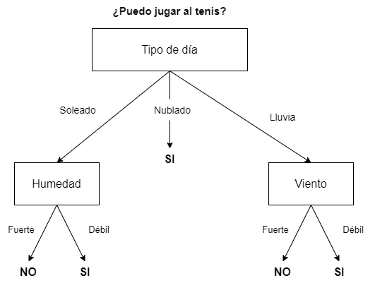
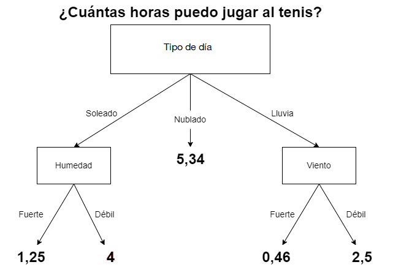
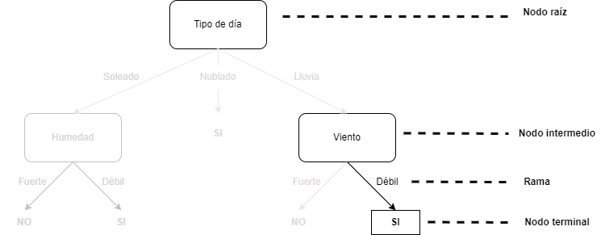
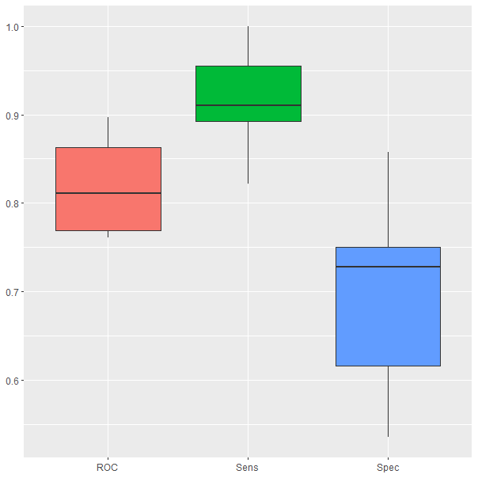
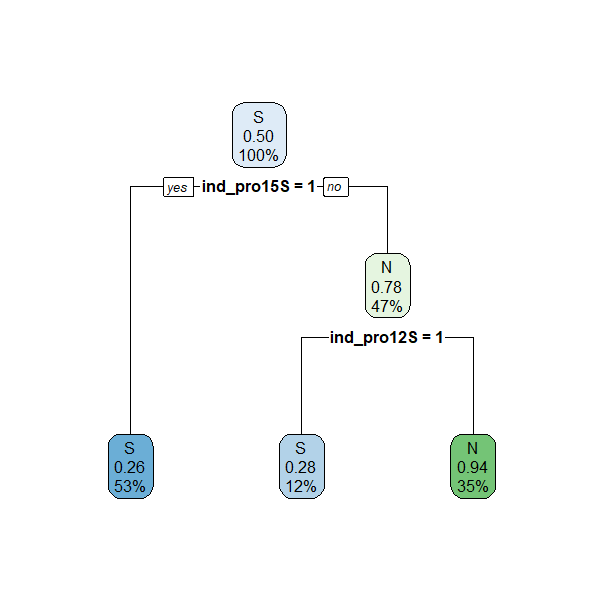
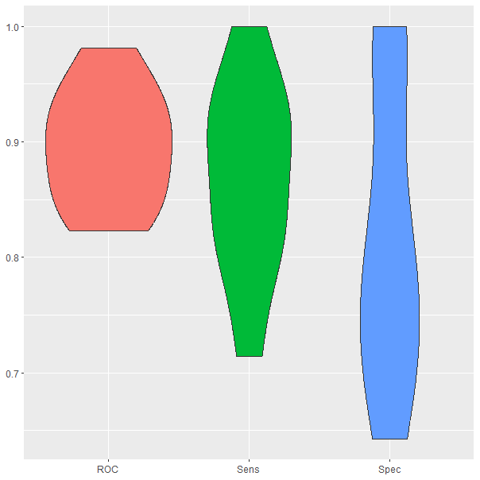
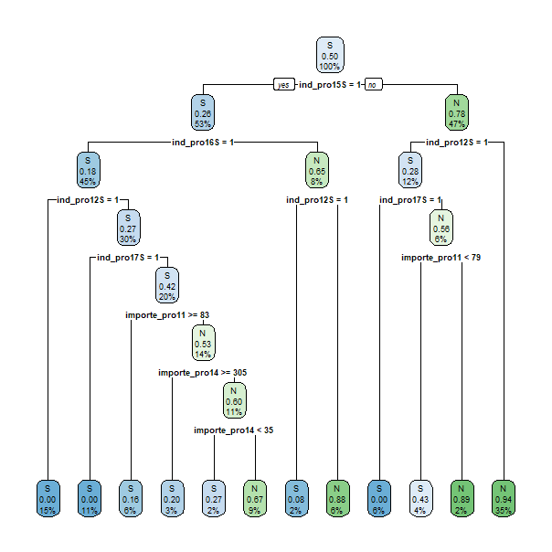
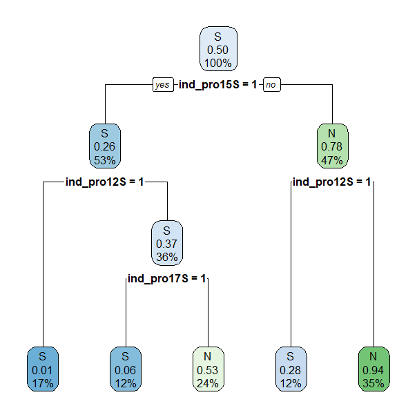
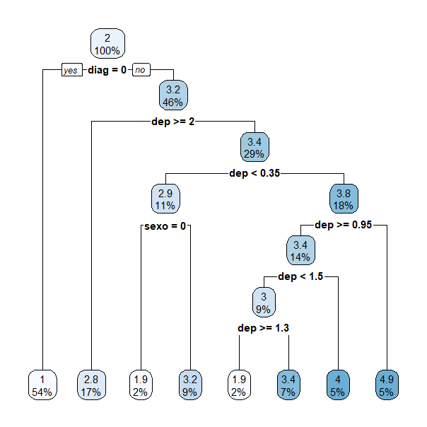
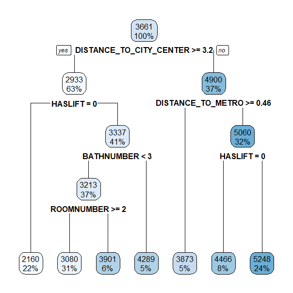

# (PART) Machine learning supervisado {.unnumbered}

# Árboles de clasificación y regresión {#cap-arboles}

*Ramón A. Carrasco*$^{a}$, *Itzcóatl Bueno*$^{b,a}$ y *José-María Montero*$^{c}$

$^{a}$Universidad Complutense de Madrid  
$^{b}$Instituto Nacional de Estadística  
$^{c}$Universidad de Castilla-La Mancha


\nocite{theobald2017machine,burkov2019hundred,boehmke2019hands}

## Introducción {#intro-dectree}

Los árboles de decisión son modelos o algoritmos no paraméticos que se utilizan principalmente para
la resolución de problemas de clasificación, en los que hay que predecir
las distintas categorías de la variable objetivo o dependiente, aunque
también son aplicables a la predicción de valores numéricos de dicha
variable objetivo, esto es, como modelos de regresión. De ahí que sean
conocidos como árboles de clasificación y regresión (CART,
*classification and regression trees*). 


Específicamente, lo que hacen los árboles de decisión es utilizar una serie de reglas de decisión para dividir el espacio de características predictoras en un número menor de regiones disjuntas en cada una de las cuales los valores de la variable respuesta son similares. 


Un árbol de decisión parte del conjunto de datos de entrenamiento, correspondiente a un **nodo raíz**, y lo va dividiendo recursivamente en subconjuntos de datos homogéneos, dando lugar a nuevos **nodos**. La manera de formar los subgrupos es mediante la formulación de preguntas con respuesta binaria (si la variable respuesta es "jugar al tenis" se formula la pregunta ¿Sí o No juega al tenis?; si es "pesa más o menos de 75 kg.", la pregunta es ¿El peso es $\leq 75$ o $>75$?). El proceso de partición se lleva a cabo hasta que se alcanza algún criterio de parada previamente establecido. Es resultado que produce dicho proceso es el valor medio de la variable respuesta en las observaciones incluidas en cada subgrupo (en árboles de regresión) o la clase de la variable respuesta con presencia mayoritaria en ellos (cuando se trata de árboles de clasificación). En este último caso también proporciona, en cada subgrupo, una estimación de la probabilidad de pertenencia a cada clase. 


Algunos ejemplos de árboles de decisión son:\index{árbol!de decisión}

-   **Clasificación**:\index{árbol!de clasificación} en la medida que
    la variable objetivo debe ser categórica, se podrían usar, por ejemplo,
    para tomar la decisión de qué empleados deberían de promocionar
    (variable con dos categorías: sí promocionar o no promocionar) en
    base a sus méritos, capacidades, edad, etc. Otro ejemplo podría ser
    su uso para decidir si se juega o no un partido de tenis en base a
    la climatología prevista. Este ejemplo se muestra gráficamente en la
    Fig. \@ref(fig:dectree-plot). En este último caso, el algoritmo que
    se utilice indicará la decisión a tomar en base a los registros
    climatológicos de los partidos que ya se hayan jugado. Así, si un
    determinado día se quiere jugar al tenis, se deberán tomar como
    datos de entrada las previsiones de las variables (en este caso atributos) Tipo de día (soleado,
    nublado o lluvioso), Fuerza del Viento y Humedad. En caso de
    ser un día nublado, el algoritmo sugerirá que se juegue. En caso de
    ser soleado, comprobará el nivel de humedad y, si no es muy elevada,
    recomendará que se juegue el partido. Lo mismo pasará si la
    previsión es de lluvia pero la fuerza del viento prevista no es lo
    suficientemente elevada como para impedir el normal desarrollo del
    partido.

<div class="figure" style="text-align: center">

<p class="caption">(\#fig:dectree-plot)Ejemplo de árbol de decisión.</p>
</div>

-   **Regresión**:\index{árbol!de regresión} siguiendo con el ejemplo
    del partido de tenis, también se puede utilizar un árbol de decisión
    para determinar cuántas horas jugar de acuerdo a las condiciones
    climatológicas. En la Fig. \@ref(fig:dectree-plot) se sustituirían la predicciones
    dicotómicas SÍ/NO por valores numéricos, como se muestra en la Fig. \@ref(fig:regtree-plot). Por ejemplo, el algoritmo puede sugerir jugar 5 horas si el día está soleado pero la humedad
    es del 30% de vapor de agua por $m^3$; y 3,5 horas si está soleado
    pero la humedad es del 80%. También puede decidir que si el día está
    nublado se jueguen 4 horas. O en caso de lluvia, podría decidir que
    el partido dure 0,75 horas si la fuerza del viento es de 62km/h y
    1,15 horas si es de 27km/h.
   

<div class="figure" style="text-align: center">

<p class="caption">(\#fig:regtree-plot)Ejemplo de árbol de regresión.</p>
</div>

\index{algoritmo!de árbol} Como se ha comentado anteriormente, CART es un término
genérico para describir este tipo de algoritmos de árbol y también un
nombre específico para el algoritmo original de
@breiman1984classification de construcción de árboles de clasificación
y regresión. Sin embargo, existen otros como el ID3 (*induction decision
trees*), o el C4.5, que está basado en el ID3. En la Tabla
\@ref(tab:alg-dectree) se muestra una pequeña comparativa de estos tres
algoritmos:

| Algoritmo | Criterio de división    | Tipo de variables input |           Estrategia de poda           |
|----------:|:--------------------|--------------------------|:---------------------------:|
|       ID3 | Ganancia de información | Solo categóricas        |                No poda                 |
|      CART | Índice de Gini          | Categóricas y numéricas | Poda basada en el coste de complejidad |
|      C4.5 | Ratio de ganancia       | Categóricas y numéricas |        Poda basada en el error         |

: (#tab:alg-dectree) Características de los principales algoritmos de árboles de decisión.


Los árboles de decisión tienen múltiples ventajas. Entre ellas destacan:

-   Son fáciles de entender e interpretar. Su visualización es muy clara y
    permite interpretar fácilmente la salida del modelo, así como entender su proceso como
    un conjunto de condicionantes.
-   El mismo algoritmo incorporado en **R** (`CART`) es válido tanto para
    problemas de clasificación como de regresión y, por tanto, la
    variable objetivo puede ser continua o categórica. Respecto a las variables de entrada, las independientes, pueden ser
    tanto categóricas como numéricas. Al contrario de lo que ocurre con otros
    algoritmos, este último tipo de variables no necesitan ser estandarizadas, puesto que los árboles de decisión se basan en reglas y no en el cálculo de
    distancias entre observaciones.
-   Tratan mejor que otros algoritmos el problema de la no linealidad.
-   Respecto a los datos, llevan a cabo un tratamiento automático de valores
    ausentes (en la mayoría de los árboles de clasificación) y no se ven
    afectados por las observaciones atípicas.

Sin embargo, también tienen ciertas desventajas:

-   Son inestables, ya que la inclusión de una nueva observación en la
    fase de entrenamiento obliga a reconstruirlo, pudiendo modificar la
    estructura del árbol final.
-   No son recomendables en caso de grandes conjuntos de datos, puesto
    que el modelo entrenado puede estar sobreajustado. Este sobreajuste
    es el principal problema de los árboles de decisión, ya que modelos
    demasiados complejos pueden ajustar muy bien los datos observados,
    pero también pueden cometer muchos errores en la fase de predicción.
    Cuando se da esta circunstancia, el modelo ha aprendido los datos de
    entrenamiento pero no la generalidad del problema, que es lo que
    normalmente se pretende. El sobreajuste da lugar también a una
    varianza elevada.
-   Tienen una capacidad predictiva inferior a la de otros algoritmos más complejos, como las      redes neuronales artificiales y los splines de regresión adaptativos multivariantes (MARS),     aunque es cierto que si se combinan adecuadamente un número elevado de árboles de decisión,     mediante las técnicas de *bagging* y *boosting* (véanse Caps. \@ref(cap-bagg-rf) y         \@ref(cap-boosting-xgboost), respectivamente), la potencia predictiva mejora sustancialmente.


## Procedimiento con **R**: la función `rpart()`

En el paquete `rpart` de **R** se encuentra la función `rpart()` que se
utiliza para entrenar un árbol de decisión:


```r
rpart(formula, data, ...)
```

-   `formula`: refleja la relación entre la variable dependiente $Y$ y
    los predictores tal que $Y \sim X_1 + ... + X_p$.
-   `data`: conjunto de datos con el que entrenar el árbol de acuerdo a
    la fórmula indicada.


## Árboles de clasificación\index{árbol!de clasificación}

Como se avanzó en la sección anterior, formalmente, un árbol de decisión es un grafo acíclico (un grafo sin ciclos, siendo un ciclo un circuito completo) que se inicia en un **nodo
raíz**\index{nodo raíz}, el cual se divide en **ramas**\index{rama},
también conocidas como **aristas**\index{arista}. De las ramas salen las
**hojas**\index{hoja}, también denominadas **nodos**.\index{nodo} Estos
nodos pueden ser **nodos finales**, o **puntos de
decisión**,\index{punto!de decisión} (si de ellos no salen nuevas ramas
con nuevos nodos) o no ( si de ellos salen nuevas ramas con nuevas hojas o
nodos) y así hasta que todos los nodos sean puntos de decisión. En el
ejemplo de la Fig. \@ref(fig:dectree-plot) el nodo raíz es la caja *Tipo
de día*. Las ramas o aristas son sus tres niveles o categorías:
*Soleado*, *Nublado* o *Lluvia*. Cada una de estas ramas conecta con una
nueva hoja o nodo: *Humedad* o *Viento* en los casos de soleado o
lluvia, respectivamente. Sin embargo, en ese ejemplo, *Nublado*
representa un nodo terminal, puesto que, llegados a ese punto, la salida
que proporcionaría el árbol es *"Jugar al tenis"*. Este proceso se
repite utilizando el conjunto de datos disponible en cada hoja,
generándose una clasificación final cuando una hoja no tenga ramas
nuevas, en cuyo caso recibe la denominación de nodo final. El objetivo
es que el árbol sea lo más general y pequeño posible. Esto se consigue
seleccionando, en cada paso, la variable que optimice la división de los
datos en subconjuntos homogéneos, de tal forma que se prediga mejor la
clase objetivo.

La Fig. \@ref(fig:form-arbol) ilustra la nomenclatura relativa a los elementos del árbol mencionados anteriormente. 

<div class="figure" style="text-align: center">

<p class="caption">(\#fig:form-arbol)Ejemplo de formación de árbol de decisión.</p>
</div>


### ¿Cómo se va formando el árbol de clasificación? \index{partición}

Como ya se ha mencionado, la construcción de un árbol de decisión se basa en la división recursiva en nuevas ramas, es decir, cada división
está condicionada por las anteriores. El objetivo en cada nodo es
encontrar la variable (o atributo, como en este caso) más adecuada para dividir los datos de ese nodo en dos  nuevos subconjuntos, de tal forma que el error global entre la clase
observada y la predicha por el árbol se minimice. Para la construcción
de árboles de clasificación, el algoritmo CART utiliza la medida de
impureza de Gini para generar las particiones, mientras que los
algoritmos ID3 y C4.5 están basados en medidas de entropía.


#### Impureza de Gini\index{impureza!de Gini}

La **impureza de Gini** es una medida
de la frecuencia con la que una observación elegida aleatoriamente de un
conjunto de observaciones (en este caso los conjuntos de observaciones correspondientes a los nodos) se asignaría a la clase errónea si se etiqueta al azar en una
de las clases que se consideran. Formalmente, sea $\bf{X}$ un conjunto de
datos con $\kappa$ clases, y sea $p_i$ la probabilidad de que una
observación pertenezca a la clase $i=1,...,\kappa$. La impureza de Gini para $\bf{X}$ se
define como:

```{=tex}
\begin{equation}
Gini({\bf{X}}) = 1 - \sum^{\kappa}_{i=1}{p^{2}_{i}},
\end{equation}
```

donde, en este caso, al ser la respuesta binaria, ${\bf{\kappa}}=2$.

A la hora de construir el árbol se selecciona el atributo con menor impureza ponderada de Gini para dividir en dos el conjunto de datos $\bf{X}$ correspondiente al nodo del que se trate: el subconjunto con el primer valor de la variable respuesta, ${\bf{X}}_1$  y el subconjunto con el segundo valor de la variable respuesta, ${\bf{X}}_2$. 

Si en un nodo el subconjunto de datos  se divide en dos subconjuntos $\bf{\bf {X}}_1$ y ${\bf{X}}_2$, con tamaños $n_1$ y $n_2$, respectivamente, la impureza ponderada de Gini se define como:


```{=tex}
\begin{equation}
Gini_{\varphi}({\bf{X}}) = \frac{n_1}{n}{Gini \left(\bf{X}_{1}\right) } +  \frac{n_2}{n}{Gini \left({\bf{X}}_{2}\right)},
\end{equation}
```
donde las probabilidades se computan a partir de las correspondientes frecuencias relativas.


En el ejemplo de la Fig. \@ref(fig:dectree-plot) considérese la
siguiente situación:

| Día | Tipo de día | Humedad | Viento | Decisión |
|-----|:-----------:|:-------:|:------:|:--------:|
| 1   |   Soleado   | Fuerte  | Débil  |    NO    |
| 2   |   Soleado   | Fuerte  | Fuerte |    NO    |
| 3   |   Lluvia    | Fuerte  | Débil  |    SÍ    |
| 4   |   Nublado   | Fuerte  | Débil  |    SÍ    |
| 5   |   Lluvia    |  Débil  | Débil  |    SÍ    |
| 6   |   Lluvia    |  Débil  | Fuerte |    NO    |
| 7   |   Soleado   | Fuerte  | Débil  |    NO    |
| 8   |   Nublado   |  Débil  | Fuerte |    SÍ    |
| 9   |   Soleado   |  Débil  | Débil  |    SÍ    |
| 10  |   Lluvia    |  Débil  | Débil  |    SÍ    |
| 11  |   Soleado   |  Débil  | Fuerte |    SÍ    |
| 12  |   Nublado   | Fuerte  | Fuerte |    SÍ    |
| 13  |   Nublado   |  Débil  | Débil  |    SÍ    |
| 14  |   Lluvia    | Fuerte  | Fuerte |    SÍ    |
| 15  |   Soleado   | Fuerte  | Fuerte |    NO    |

: (#tab:data-imp-gini) Datos para decidir si se juega el partido.

Lo primero que se ha de decidir es cuál es el nodo raíz del árbol (el punto de partida del proceso recursivo de partición).  Hay tres candidaturas: la de *Tipo de día*, la de *Humedad* y la de *Fuerza del viento*. Se elegirá aquella con menor impureza ponderada de Gini. 

Comenzando, por ejemplo, con el *Tipo de día*, el conjunto de datos se divide en tres subconjuntos (de t6,4 y 5 observaciones, respectivamente), tal y como muestra la Tabla
\@ref(tab:data-td-imp-gini):

| Tipo de día | SÍ  | NO  | \# observaciones |
|-------------|:---:|:---:|:----------------:|
| Soleado     |  2  |  4  |        6         |
| Nublado     |  4  |  0  |        4         |
| Lluvia      |  4  |  1  |        5         |

: (#tab:data-td-imp-gini) Días que se juega o no de acuerdo al *Tipo de
día.*


La impureza de Gini para cada una de las tres categorías es:
\begin{equation*}
Gini(Soleado) = 1 - \Bigl(\frac{2}{6}\Bigr)^{2} - \Bigl(\frac{4}{6}\Bigr)^{2} = 0,45
\end{equation*}
\begin{equation*}
Gini(Nublado) = 1 - \Bigl(\frac{4}{4}\Bigr)^{2} = 0
\end{equation*}
\begin{equation*}
Gini(Lluvia) = 1 - \Bigl(\frac{4}{5}\Bigr)^{2} - \Bigl(\frac{1}{5}\Bigr)^{2} = 0,32
\end{equation*}

siendo la pregunta que se formula: ¿Se juega al tenis?, con respuestas SÍ y NO.

La suma ponderada de las anteriores impurezas proporciona la impureza ponderada (de Gini) de
variable *Tipo de día*: 

```{=tex}
\begin{equation*}
Gini(Tipo \hspace{0,1cm}de \hspace{0,1cm} día) = 0,45\cdot\Bigl(\frac{6}{15}\Bigr) + 0\cdot\Bigl(\frac{4}{15}\Bigr) + 0,32\cdot\Bigl(\frac{5}{15}\Bigr) = 0,29
\end{equation*}
```
Del mismo modo, se puede calcular la impureza ponderada de Gini de *Humedad* y *Viento*, los dos nodos candidatos a ser nodo raíz. La Tabla \@ref(tab:hum-imp-gini) y la Tabla
\@ref(tab:wind-imp-gini) presentan los subconjuntos de datos que se forman para cada una de sus categorías, respectivamente. A partir de dichas impurezas, debajo de cada tabla, se calcula la la impureza ponderada de cada uno de estos dos nodos candidatos.

| Humedad | SÍ  | NO  | \# observaciones | $p_{SÍ}$ | $p_{NO}$ | Impureza de Gini |
|---------|:---:|:---:|:----------------:|:--------:|:--------:|:----------------:|
| Fuerte  |  4  |  4  |        8         |   0,50   |   0,50   |       0,50       |
| Débil   |  6  |  1  |        7         |   0,86   |   0,14   |       0,76       |

: (#tab:hum-imp-gini) Impureza de Gini para las categorías de *Humedad.*

```{=tex}
\begin{equation*}
Gini(Humedad) = 0,5\cdot\Bigl(\frac{8}{15}\Bigr) + 0,76\cdot\Bigl(\frac{7}{15}\Bigr) = 0,62
\end{equation*}
```

| Viento | SÍ  | NO  | \# observaciones | $p_{SÍ}$ | $p_{NO}$ | Impureza de Gini |
|--------|:---:|:---:|:----------------:|:--------:|:--------:|:----------------:|
| Fuerte |  4  |  3  |        7         |   0,57   |   0,43   |       0,49       |
| Débil  |  6  |  2  |        8         |   0,75   |   0,25   |       0,38       |

: (#tab:wind-imp-gini) Impureza de Gini para las categorías de *Viento.*


```{=tex}
\begin{equation*}
Gini(Viento) = 0,49\cdot\Bigl(\frac{7}{15}\Bigr) + 0,38\cdot\Bigl(\frac{8}{15}\Bigr) = 0,43
\end{equation*}
```


En la Tabla \@ref(tab:features-imp-gini)  se muestran las impurezas ponderadas de cada una de las variables candidatas a ser nodo raíz. Se puede comprobar que la menor impureza ponderada de Gini corresponde a *Tipo de día*; por consiguiente, se elige como nodo raíz del árbol de clasificación.

| Variable    | Impureza ponderada de Gini |
|-------------|:----------------:|
| Tipo de día |       0,29       |
| Humedad     |       0,62       |
| Viento      |       0,43       |

: (#tab:features-imp-gini) Impureza de Gini para las variables de
entrada.


La siguiente decisión a tomar es: en cada categoría de *Tipo de día*, ¿qué variable (*Humedad* o *Viento*) se elige para llevar a cabo una nueva partición del subconjunto de datos correspondiente cada una de ellas? La respuesta a esta pregunta la proporciona la ganancia de información,  $\Delta Gini()$, correspondiente a cada una de estas dos variables:


```{=tex}
\begin{equation}
\Delta Gini(\varphi) =  Gini({\bf{X}}) - Gini_{\varphi}({\bf{X}}),
\end{equation}
```
si bien, como puede comprobarse, la mayor ganancia de información corresponde a la menor impureza ponderada de Gini. puesto que $Gini({\bf{X}})$ permanece constante.

Por ejemplo, para obtener la ganancia de información para *Humedad* en cada una de las categorías de *Tipo de día*,[^Nota-0-arboles] la impureza
ponderada de *Humedad* se resta de la impureza de cada una de las tres categorías de *Tipo de día*. Lo mismo se haría con *Viento*. 


Dicho lo anterior, para la categoría *Tipo de día: soleado*, la Tabla \@ref(tab:sunfeat-imp-gini) muestra el valor de las impurezas ponderadas de las dos variables candidatas a ser las nuevas "particionadoras": 


| Variable | Impureza ponderada de Gini |
|----------|:----------------:|
| Humedad  |       0,00       |
| Viento   |       0,44       |

: (#tab:sunfeat-imp-gini) Impureza de Gini para las variables en días
soleados.

Entonces, la ganancia de Gini para cada variable es:

```{=tex}
\begin{center}
$\Delta Gini(Humedad) = 0,45-0=0,45$,\\
$\Delta Gini(Viento) =0,45-0,44=0,01$.
\end{center}
```
Puede observarse que, en la categoría *Tipo de día: soleado*, la ganancia de información que se obtiene al particionar el subconjunto de datos correspondiente a dicha categoría según *Humedad* es mayor (en realidad mucho mayor) que al hacerlo según *Viento*, por lo que *Humedad* es la variable elegida para realizar la partición del subconjunto de datos de la categoría *Tipo de día: soleado*, como se observa en la Fig. \@ref(fig:dectree-plot).

[^Nota-0-arboles]: Aunque se utilice el término "variable", por simplicidad, es válido para variables propiamente dichas como para atributos.

En el caso de la categoría *Tipo de día: nublado*, el subconjunto de observaciones es de tamaño 4 y en todas ellas la categoría de la variable respuesta es SÍ (se juega al tenis); su impureza es nula. Por tanto, no tiene sentido realizar partición alguna del subconjunto de datos, ni según *Humedad* ni según *Viento*. Se trata de un punto de decisión final.


Finalmente, para la categoría *Tipo de día: con lluvia*, con un subconjunto de 5 observaciones y una impureza de Gini de 0,32, la impureza ponderada correspondiente a *Humedad* es de $0,26\hat{7}$, mientras que la correspondiente a *Viento* es 0,20, por lo que la ganancia de información de tomar como variable divisora *Humedad* es $0,05\hat{3}$ mientras que se eleva a 0,12 cuando la variable divisora es *Viento* (se deja al lector la labor de comprobar etos cálculos). Es por eso que, como puede verse en Fig.  \@ref(fig:dectree-plot), se elige esta última para realizar una nueva partición en el subconjunto de datos *Tipo de día: con lluvia*.


En este punto del proceso de partición (o crecimiento del árbol) ya se tiene primer nivel de nodos, que surgen del nodo raíz. A partir de este primer nivel, siguiendo el mismo proceso llevado a cabo más arriba, se obtendría un segundo nivel de nodos, y a partir de estos, un  tercero, y así sucesivamente hasta que el criterio de parada pre-establecido indique que el proceso de finalización ha terminado. En el ejemplo propuesto, al ser tan sencillo, pues el conjunto de datos solo cuenta con tres variables predictoras, solo se va a decidir cuál es el nodo raíz y cuáles los que componen el primer nivel de nodos. Con tres variables predictoras no se pueden obtener más niveles de nodos.


<!-- #### -->

<!-- \textcolor{red}{El conjunto de datos lo he denotado como X negrita porque será una matriz de datos. Confirma que es correcto} -->


<!-- \textcolor{red}{La fórmula de arriba no está clara porque no se distinguir entre varphi y X} -->

<!-- Siguiendo con el ejemplo del árbol de clasificación, para saber si se puede -->
<!-- jugar al tenis o no, se tendría que obtener la impureza ponderada de Gini para el -->
<!-- nodo *Humedad* y el nodo *Viento*. Repitiendo el proceso anteriormente -->
<!-- mostrado, dado que el *Tipo de día* sea soleado (nodo raíz), se obtienen los -->
<!-- resultados de . -->


<!-- Al entrenar un árbol de decisión se repite este proceso, y a la hora de -->
<!-- dividir cada nodo (que se denominará "padre"), se elige el atributo (nodo "hijo") con menor impureza de Gini ($Gini_{\varphi}({\bf{X}})$, donde $\varphi$ representa la variable o nodo "hijo"). -->
<!-- \textcolor{red}{ESTO DE DEBAJO NECESITA UNA INTRO DE QUE AHORA, PARA VER COMO SE SIGUE, SE UTILIZA LA GANANCIA DE INFORMACIÓN} -->


<!-- Siguiendo con el ejemplo del árbol de clasificación, para saber si se puede -->
<!-- jugar al tenis o no, se tendría que obtener la impureza ponderada de Gini para el -->
<!-- nodo *Humedad* y el nodo *Viento*. Repitiendo el proceso anteriormente -->
<!-- mostrado, dado que el *Tipo de día* sea soleado (nodo raíz), se obtienen los -->
<!-- resultados de la Tabla \@ref(tab:sunfeat-imp-gini). -->

<!-- | Variable | Impureza ponderada de Gini | -->
<!-- |----------|:----------------:| -->
<!-- | Humedad  |       0,00       | -->
<!-- | Viento   |       0,44       | -->

<!-- : (#tab:sunfeat-imp-gini) Impureza de Gini para las variables en días -->
<!-- soleados -->

<!-- Entonces, la ganancia de Gini para cada variable será: -->

<!-- ```{=tex} -->
<!-- \begin{center} -->
<!-- $\Delta Gini(Humedad) = 0,45-0=0,45$\\ -->
<!-- $\Delta Gini(Viento) =0,45-0,44=0,01$ -->
<!-- \end{center} -->
<!-- ``` -->
<!-- Puede observarse que la ganancia de información al dividir el nodo raíz *Soleado* por *Humedad* -->
<!-- es mayor que al hacerlo por *Viento*, por lo que el árbol se dividirá -->
<!-- respecto a la *Humedad*, como se observa en la Fig. \@ref(fig:dectree-plot). -->


<!-- \textcolor{blue}{En cuanto a los nodos "no raíz", en el caso de *Nublado*, el árbol deja de desarrollarse porque siempre se juega cuando está nublado, y ese nodo ya toma esa decisión. En el caso de *Humedad*... LA FIGURA DA PREVISIONES PARA SUS DOS NIVELES.} -->

<!-- \textcolor{red}{Hay algo que no entiendo: Si el nodo raíz es el Tipo de día, y el árbol crece por ese nodo, ¿Por qué se dan previsiones SI, NO, para las otras variables candidatas a ser nodo raíz? O es que se desarrolla el arbol por el nodo raíz y por los otros nodos solo se dan previsiones para sus niveles} -->


<!-- \textcolor{red}{EN ESTE EPÍGRAFE ME PREOCUPA MUCHO LA DISTINCIÓN DE NOMECLATURA ENTRE VARPHI Y x} -->

#### Entropía \index{entropía}

La entropía es un concepto matemático que mide el grado de incertidumbre que se tiene en relación con un conjunto de datos, es decir, la varianza en los datos entre
diferentes clases. Dada una variable predictora, para los conjuntos de datos de cada una de sus categorías, la entropía se calcula
como:

```{=tex}
\begin{equation}
E = -p_1\log_2 (p_1) - p_2\log_2 (p_2),
(\#eq:entropy)
\end{equation}
```
donde $p_1$ y $p_2$ representan la probabilidad de pertenecer a cada una
de las clases de la variable respuesta (en este caso dos) en ese nodo, y se estiman mediante sus correspondientes frecuencias relativas. En teoría de la información, la base logarítmica varía dependiendo de la aplicación, y con ella varía la
unidad de medida. 


Se denomina entropía ponderada de la variable a la suma ponderada de las entropias correspondientes a sus categorías, siendo las ponderaciones el número de observaciones en cada categoría dividido por el número de observaciones correspondientes a la variable en el nodo del que se trate.

Finalmente, se define ganancia de información, $IG$, como:
como: 

```{=tex}
\begin{equation}
IG = E_{\varkappa} - E_{\varkappa + 1},
\end{equation}
```
donde $E_\varkappa$ representa la entropía en el nodo "padre" (en el conjunto de datos que se está particionando), mientras
que $E_{\varkappa+1}$ representa la entropía en cada categoría de dicho nodo padre (en el conjunto de datos de cada categoría de la variable del nodo padre).

Lógicamente, se elige como variable "particionadora" aquélla en la que que se obtiene mayor ganancia de información con la partición. 

Volviendo de nuevo al ejemplo basado en los datos de la
Tabla \@ref(tab:data-td-imp-gini), para generar el árbol de clasificación se siguen los mismos pasos que en la subsección anterior, pero sustituyendo la medida de impureza por la medida de entropía. 


Se parte de la entropía existente en el conjunto total de datos:


```{=tex}
\begin{equation*}
E = -\frac{10}{15}\log_2 \Bigl(\frac{10}{15}\Bigr) - \frac{5}{15}\log_2 \Bigl(\frac{5}{15}\Bigr) = 0,9183
\end{equation*}
```

y, en cada nodo, se va dividiendo el árbol en función de la variable que más reduzca la entropía existente en dicho nodo.   

La primera decisión es la relativa a cuál de las tres variables predictoras ocupará el nodo raíz. Para ello, se procede como sigue[^Nota_arbloes7]:

1) Para cada una de las variables predictoras se calcula la entropía de cada una de sus categorías o niveles.
2) A partir de dichas entropías, ponderándolas adecuadamente, se calcula la entropía de cada una de las variables predictoras. 
3) Se calcula la ganancia de información que se obtiene al dividir el conjunto de datos según dicha variable restando de la entropía del conjunto de datos total la entropía ponderada de cada variable
4) El conjunto de datos se divide en función de la variable con la que se tenga más ganancia de información

[^Nota_arbloes7]: Aunque nos estamos centrando en la primera división que se lleva a cabo, la del conjunto total de datos, los pasos son los mismos para dividir, posteriormente, el conjunto de datos correspondiente a cualquier nodo del árbol.

Comenzando por la variable *Tipo de día* se calcula:

\begin{equation*}
E_{Soleado} = -\frac{2}{6}\log_2 \Bigl(\frac{2}{6}\Bigr) - \frac{4}{6}\log_2 \Bigl(\frac{4}{6}\Bigr) = 0,9183.
\end{equation*}
\begin{equation*}
E_{Nublado} = -\frac{4}{4}\log_2 \Bigl(\frac{4}{4}\Bigr) - \frac{0}{4}\log_2 \Bigl(\frac{0}{4}\Bigr) = 0.
\end{equation*}
\begin{equation*}
E_{Lluvia} = -\frac{4}{5}\log_2 \Bigl(\frac{4}{5}\Bigr) - \frac{1}{5}\log_2 \Bigl(\frac{1}{5}\Bigr) = 0,7219.
\end{equation*}

Con lo que se tiene que:

```{=tex}
\begin{equation*}
E_{\text{Tipo de día}} = \frac{6}{15}\cdot 0,9183 + \frac{4}{15}\cdot 0 + \frac{5}{15}\cdot 0,7219 = 0,608,
\end{equation*}
```

y que:

\begin{equation*}
IG_{\text{Tipo de día}} = E - E_{\text{Tipo de día}} = 0,918 - 0,608 = 0,31.
\end{equation*}


Repitiendo el mismo procedimiento con las variables *Viento* y *Humedad*
se puede comprobar que $E(Viento) = 0,893$ y $E(Humedad) = 0,809$, con lo que:

\begin{equation*}
IG_{Viento} = E - E_{Viento} = 0,918 - 0,893 = 0,025,
\end{equation*}
\begin{equation*}
IG_{Humedad} = E - E_{Humedad} = 0,918 - 0,809 = 0,109,
\end{equation*}

pudiéndose comprobar que la disminución de la aleatoriedad, o la ganancia
de información, es mayor para la variable *Tipo de día* y, por tanto, se
elige para ser el nodo raíz. Repitiendo este proceso, igual que se hizo en la subsección anterior, se va construyendo
el árbol hasta alcanzar los nodos terminales.


### Sobreajuste \index{sobreajuste}

Ya se ha comentado en la Sec. \@ref(intro-dectree) que una de las
principales desventajas de los árboles de decisión es su propensión a
sobreajustar el modelo al conjunto de datos de entrenamiento y, por
tanto, hay que prestar especial atención a la complejidad del modelo.
Basándose en las observaciones utilizadas en la fase de entrenamiento,
un árbol de decisión puede extraer los patrones presentes en el conjunto
de observaciones de entrenamiento y ser muy preciso en el ajuste de
dichas observaciones. Sin embargo, puede ocurrir que el árbol resultante
no sea capaz de clasificar correctamente ni el conjunto de validación ni con
nuevas observaciones. Esta circunstancia puede ocurrir porque haya
patrones no observados en los datos de entrenamiento que el modelo no es
capaz de detectar, o porque la división de los datos entre entrenamiento
y validación no se realizó correctamente siendo los datos de
entrenamiento no representativos del conjunto de datos completo.
Al intentar que el árbol entrenado tenga la capacidad de aprender
patrones muy complejos, se puede producir este sobreajuste, que se materializa
en árboles muy profundos. La forma de evitar el sobreajuste es
controlar el crecimiento del árbol para evitar que se vuelva
excesivamente complejo.

### ¿Cuánto debe crecer un árbol de clasificación?
\index{profundidad!del árbol}

En cada paso de construcción del árbol se determina la variable óptima
para realizar la división de las observaciones de un nodo padre en sus
nodos hijos. La pregunta es: ¿cuándo se detiene?, ¿cuál es el criterio
de parada? Por ejemplo, se puede utilizar como criterio de parada que el
árbol alcance un tamaño o profundidad determinado, para que no sea
excesivamente complejo y así no tengan lugar las consecuencias derivadas
del sobreajuste\index{sobreajuste}.

En consecuencia, se debe llegar a un equilibrio entre la profundidad y
complejidad\index{complejidad} del árbol para optimizar la predicción de
observaciones futuras. Este equilibrio se puede lograr siguiendo alguno
de los siguientes enfoques: la parada temprana o la poda.

#### La parada temprana
\index{parada temprana}

La parada temprana restringe el crecimiento del árbol, tanto de
clasificación como de regresión, de forma explícita. Existen distintas
maneras de imponer al árbol esta restricción, pero dos de las
técnicas más populares son: $(i)$ restringir la profundidad a un cierto
nivel y $(ii)$ establecer un número mínimo de observaciones permitidas en
un nodo terminal. En el primer caso, el árbol deja de dividirse al
llegar a cierta profundidad. Así, cuanto menos profundo sea el árbol,
menos variación habrá en las predicciones que proporcione. Sin embargo,
existe el riesgo de introducir mucho sesgo al modelo al no ser capaz de
captar interacciones y patrones complejos en los datos. El segundo
enfoque lo que provoca es que no se dividan nodos intermedios con pocas
observaciones. Llevando el razonamiento al extremo, si se permite que un nodo terminal
tenga solo una observación, esta actuaría como predicción, si bien su variabilidad sería muy elevada. Si, por el contrario, se exige un gran número de
observaciones en los nodos terminales, se reduce el número de divisiones y,
por lo tanto, se reduce la varianza, pero puede haber patrones interesantes en los datos que el árbol no es capaz de detectar y aprender.

#### La poda
\index{poda}

El otro enfoque es el de la poda, que consiste en construir un árbol muy
profundo y complejo y después podarlo para encontrar el subárbol óptimo.
En este proceso, se utiliza un hiperparámetro de complejidad
$(\zeta)$ que penaliza la función objetivo de la partición por el número
de nodos terminales del árbol $(\tau)$. El subárbol óptimo es aquél que minimiza:

```{=tex}
\begin{equation}
R_{\zeta}(\tau) = R(\tau) + \zeta|\tau|,
(\#eq:poda)
\end{equation}
```


donde $R(\tau)$ es la tasa total de clasificación errónea en los nodos terminales,
$|\tau|$ es el número total de nodos y $\zeta$ es el hiperparámetro de
complejidad. A medida que $\zeta$ aumenta, más ramas del árbol son
podadas, mientras que para valores más bajos los modelos resultantes son más complejos y, en consecuencia, más grandes. En conclusión, a medida que
el árbol crece, el error de entrenamiento (la tasa total de clasificación errónea en los nodos terminales) debe tener una reducción mayor
que el término de penalización por complejidad.


### Ejemplo: árbol de clasificación para determinar la intención de compra

A continuación se describe el caso que se va a resolver mediante modelos
de clasificación tanto en este como en los siguientes capítulos. Existen
diversas aserciones para definir Comercio Electrónico (CE). Entre ellas,
la Organización para la Cooperación y el Desarrollo Económico (OCDE) lo
define como el proceso de compra, venta o intercambio de bienes,
servicios e información a través de redes de comunicación, comúnmente
Internet. La clasificación más básica del CE se hace en base al tipo de
entes que se relacionan: empresas (businesses, B), consumidores
(consumers, C) y entes públicos (governments, G). De esta forma, una
empresa de CE convencional suele ser B2B si vende a otras empresas, B2G
si su relación comercial es con administraciones o B2C si vende a consumidores finales.

En este caso, se puede considerar que la empresa "Beauty eSheep" lleva a
cabo un CE de tipo B2C. Su producto estrella es una crema hidratante
unisex, denominada internamente como "Crema Luxury", con mucho éxito
entre su clientela. A partir de este producto inicial, la empresa ha ido
ofreciendo un catálogo de productos tanto de belleza como de
bienestar y salud.

Hace tiempo la empresa instauró una estrategia relacional, centrada en
los clientes, de tal manera que han ido recabando diversos datos sobre ellos, incluidas las distintas compras que han realizado.

Basándose en los datos recopilados para cada cliente, la empresa quiere
realizar una campaña para impulsar la venta de tensiómetros digitales.
La empresa tiene acceso a un stock de estos productos, muy flexible en cuanto a fechas de envío, y el precio de los tensiómetros es muy bueno, por lo que
se espera una buena rentabilidad en su venta.

Por tanto, en este proyecto hay que identificar el público objetivo
susceptible de comprar dicho producto para ofrecérselo a través de la
plataforma de CE de la compañía, SMS y/o webmail durante el periodo que
dura la campaña.

La tabla con los datos integrados a nivel de cliente, incluyendo el
consumo de los distintos productos de la empresa, es `dp_ENTR`,
incluida en el paquete `CDR`, y se resume en la Tabla
\@ref(tab:dpentr). Este ejemplo se va a replicar en el resto de
capítulos de *machine learning* supervisado para clasificación.

| VARIABLE     | TIPO[^Note00_arborles] | DESCRIPCIÓN                                                                                              |
|----------------|--------|---------------------------------------------------------------|
| `CLS_PRO_pro13` | Factor | Clase objetivo, es un indicador de si el cliente es consumidor de ese producto "tensiómetro digital" ('S') o no ('N') |
| `ind_pro11`     | Factor | Indicador de si el cliente es consumidor del producto "fragancia luxury" ('S') o no ('N')                             |
| `ind_pro12`     | Factor | Indicador de si el cliente es consumidor del producto "depiladora eléctrica" ('S') o no ('N')                         |
| `ind_pro14`     | Factor | Indicador de si el cliente es consumidor del producto "crema luxury" ('S') o no ('N')                                 |
| `ind_pro15`     | Factor | Indicador de si el cliente es consumidor del producto "smartwatch fitness" ('S') o no ('N')                           |
| `ind_pro16`     | Factor | Indicador de si el cliente es consumidor del producto "kit pesas inteligentes" ('S') o no ('N')                       |
| `ind_pro17`     | Factor | Indicador de si el cliente es consumidor del producto "estimulador muscular" ('S') o no ('N')                         |
| `importe_pro11` | Doble  | Importe neto global gastado por el cliente en ese producto, en euros                                                   |
| `importe_pro12` | Doble  | Importe neto global gastado por el cliente en ese producto, en euros                                                   |
| `importe_pro14` | Doble  | Importe neto global gastado por el cliente en ese producto, en euros                                                   |
| `importe_pro15` | Doble  | Importe neto global gastado por el cliente en ese producto, en euros                                                   |
| `importe_pro16` | Doble  | Importe neto global gastado por el cliente en ese producto, en euros                                                   |
| `importe_pro17` | Doble  | Importe neto global gastado por el cliente en ese producto, en euros                                                   |
| `edad`          | Entero | Edad del cliente                                                                                                      |
| `tamano_fam`    | Entero | Número de miembros de la unidad familiar a la que pertenece el cliente, él incluido                        |
| `anos_exp`      | Entero | Años de trabajo del cliente                                                                                           |
| `ingresos_ano`  | Doble  | Ingresos anuales del cliente, en euros                                                                                 |
| `des_nivel_edu` | Factor | Descripción del nivel de educación del cliente                                                                        |

: (#tab:dpentr) Descripción de las variables del conjunto de datos `dp_entr`.

[^Note00_arborles]: Doble: puede tomar todos los valores en la recta numérica real; es decir, son variables numéricas que pueden tener decimales. Entero: variables numéricas que pueden tomar valores negativos y positivos pero que no tienen decimales. 


A partir del conjunto de entrenamiento, se construye un árbol de clasificación \index{árbol!de clasificación}, tal y como se ha expuesto anteriormente, sin
transformar (en su escala original) mediante el algoritmo CART
implementado en el paquete `rpart` con árboles de regresión y partición
recursiva (*recursive partitioning and regression trees*, RPART), que se
puede usar tanto para regresión como para clasificación.


```r
library("CDR")
library("reshape")
library("caret")
library("rpart")
library("rpart.plot")
library("ggplot2")

data("dp_entr")
head(dp_entr)
    ind_pro11 ind_pro12 ind_pro14 ind_pro15 ind_pro16 ind_pro17 importe_pro11
1           S         N         S         S         S         N           157
497         N         N         S         N         S         N             0
265         N         N         S         S         S         S             0
534         N         S         S         N         N         N             0
415         N         S         S         N         S         N             0
298         S         N         S         N         N         N           115
    importe_pro12 importe_pro14 importe_pro15 importe_pro16 importe_pro17 edad
1               0            40           200           180             0   49
497             0           240             0           180             0   38
265             0           425           200           180           300   61
534           120            60             0             0             0   47
415           120           133             0           180             0   34
298             0           220             0             0             0   43
    tamano_fam anos_exp ingresos_ano des_nivel_edu CLS_PRO_pro13
1            4       24        30000         MEDIO             S
497          2       12        53000         MEDIO             N
265          4       37       172000        BASICO             S
534          3       21        38000         MEDIO             N
415          1       10        38000        BASICO             N
298          2       18        60000          ALTO             N
```


```r
trControl <- trainControl(
  method = "cv",
  number = 10,
  classProbs = TRUE,
  summaryFunction = twoClassSummary
)
```

En primer lugar, se carga la librería necesaria para entrenar el modelo,
así como los datos de compras de los clientes. En este caso se usa el
método de remuestreo de validación cruzada con 10 grupos (10 *folds*), visto en el
Cap. \@ref(chap-herramientas). A continuación se determina la semilla
aleatoria, para que los resultados sean replicables, y se entrena el
modelo.


```r
# se fija una semilla aleatoria
set.seed(101)

# se entrena el modelo
model <- train(CLS_PRO_pro13 ~ .,  # . equivale a incluir todas las variables
             data=dp_entr,
             method="rpart",
             metric="ROC",
             trControl=trControl)
```


```r
model

CART

558 samples
 17 predictor
  2 classes: 'S', 'N'

No pre-processing
Resampling: Cross-Validated (10 fold)
Summary of sample sizes: 502, 502, 502, 503, 503, 502, ...
Resampling results across tuning parameters:

  cp          ROC        Sens       Spec
  0.05017921  0.8172123  0.9214286  0.7026455
  0.10394265  0.7559406  0.8386243  0.6914021
  0.51971326  0.6347222  0.8564815  0.4129630

ROC was used to select the optimal model using the largest value.
The final value used for the model was cp = 0.05017921, where cp is the complexity paramenter.
```


```r
ggplot(melt(model$resample[,-4]), aes(x = variable, y = value, fill=variable)) +
  geom_boxplot(show.legend=FALSE) +
  xlab(NULL) + ylab(NULL)
```

<div class="figure" style="text-align: center">

<p class="caption">(\#fig:006-002-001RPARTRESULTS)Resultados del modelo durante la validación cruzada.</p>
</div>


Los resultados de validación cruzada quedan recogidos en los boxplot,
por lo que se pueden ver los valores entre los que oscilan las
principales medidas de bondad de clasificación en los 10 grupos del proceso de validación. Estas
medidas (ROC, sensibilidad y especificidad) se definieron en el Cap.
\@ref(chap-herramientas), y en el caso de árboles de clasificación se
utilizan para evaluar el modelo. El árbol generado se muestra en la Fig. \@ref(fig:006-002-001RPARTRESULTS2). Se puede observar que este árbol es muy sencillo (téngase en cuenta que se seleccionan las mejores particiones y que las que no aparecen carecen de interes a efectos predictivos) y,
por tanto, fácil de interpretar. En primer lugar decide si
un cliente que compra el *smartchwatch fitness* comprará el nuevo
producto. En caso de no comprar el *smartchwatch fitness* (No a
ind_pro15S=1), pero sí la *depiladora eléctrica* (Yes a
ind_pro12S=1), comprará el *tensiómetro digital*. Si no compra ninguno
de esos dos productos no comprará el nuevo producto.


Se seleccionan las variables que generan las mejores particiones. Aquellas que no aparecen no generan particiones interesantes a nivel predictivo. Esto también se entiende con la importancia de variables explicado más abajo. 


```r
# Gráfico del árbol obtenido
rpart.plot(model$finalModel)
```

<div class="figure" style="text-align: center">

<p class="caption">(\#fig:006-002-001RPARTRESULTS2)Árbol de clasificación sin ajuste automático de hiperparámetros.</p>
</div>


Este modelo se puede mejorar ajustando automáticamente
\index{ajuste automático} el hiperparámetro[^Nota_arboles_1],[^Note_arboles_3]\index{hiperparámetro}
incluido en `rpart` para el entrenamiento de árboles de decisión. Por consiguiente, primero
es necesario conocer el hiperparámetro a optimizar en el algoritmo
implementado en **R** que se esté utilizando. Esto se consigue mediante la
siguiente instrucción, incluida en el paquete `caret`:

[^Nota_arboles_1]: Como se expuso en el Cap. \@ref(chap-herramientas), los hiperparametros de un modelo son los valores de las configuraciones utilizadas durante el proceso de entrenamiento. A diferencia de los parámetros, son valores que no se obtienen a partir de los datos, sino que los propone el científico de datos. Podría decirse que son conjeturas (buenas conjeturas) realizadas sin utilizar las observaciones disponibles. Los hiperparámetros, a diferencia de los parámetros, se fijan antes del entrenamiento. Siendo más específicos, al entrenar un modelo de aprendizaje automático se fijan los valores de los hiperparámetros para que con estos se estimen los parámetros.  Podría decirse que son los ajustes del modelo para que este pueda resolver de manera óptima el problema de aprendizaje automático. En conclusión, hiperparámetros y parámetros son conceptos bien diferentes.

[^Note_arboles_3]: Cuando no se realiza el ajuste automático del hiperparámetro, el paquete `rpart` le asigna tres posibles valores de forma aleatoria: uno bajo, uno medio y uno alto.


```r
modelLookup("rpart")

  model parameter                label forReg forClass probModel
1 rpart        cp Complexity Parameter   TRUE     TRUE      TRUE
```

El hiperparámetro\index{hiperparámetro} a optimizar es la complejidad
del árbol, $\zeta$ (o `cp`), y se aplica en la fase de
parada durante la construcción del árbol. Como se avanzó anteriormente, esta
fase tiene como función principal evitar divisiones que no
valgan la pena. El hiperparámetro de complejidad ($\zeta$ (o `cp` en los resultados) puede entenderse como un umbral que permite divisiones (*splits*) en cada nodo del modelo siempre y cuando haya una mejora mínima en las métricas. Es necesario definir los valores de dicho hiperparámetro que se
quieren evaluar con el objetivo de obtener su valor óptimo.


```r
# Se especifica un rango de valores típicos para el hiperparámetro
tuneGrid <- expand.grid(cp = seq(0.01,0.05,0.01))
```


```r
# se entrena el modelo
set.seed(101)

model <- train(CLS_PRO_pro13 ~ .,
             data=dp_entr,
             method="rpart",
             metric="ROC",
             trControl=trControl,
             tuneGrid=tuneGrid)
```


```r
# se muestra la salida del modelo
model

CART

558 samples
 17 predictor
  2 classes: 'S', 'N'

No pre-processing
Resampling: Cross-Validated (10 fold)
Summary of sample sizes: 502, 502, 502, 503, 503, 502, ...
Resampling results across tuning parameters:

  cp    ROC        Sens       Spec
  0.01  0.8962254  0.8678571  0.8167989
  0.02  0.8663454  0.9000000  0.7667989
  0.03  0.8458097  0.9392857  0.7310847
  0.04  0.8449381  0.9214286  0.7383598
  0.05  0.8172123  0.9214286  0.7026455

ROC was used to select the optimal model using the largest value.
The final value used for the model was cp = 0.01.
```

De forma automática se construyen diversos árboles para cada uno de los
valores explicitados del parámetro de complejdad, $\zeta$ (denominado `cp`en los resultados). Para cada uno de esos árboles se obtienen las siguientes correspondientes métricas: la área bajo la
curva ROC (denotada así por las siglas en inglés de *receiver operating
characteristic*), sensibilidad (Sens) y especificidad (Spec), todas ellas
definidas en el Cap. \@ref(chap-herramientas). El valor ROC[^Note_arboles_2] es el utilizado
para la elección del valor óptimo del hiperparámetro de complejidad, por lo que se determina que
finalmente el óptimo es $cp=0,01$, puesto que en ese caso la área bajo la curva ROC alcanza el valor máximo: 89,6%. Por tanto, ajustando el hiperparámetro se ha aumentado la
precisión del modelo en casi 8 puntos porcentuales respecto al 81,7% que tenía el modelo
sin ajuste automático de `cp`.

[^Note_arboles_2]: La curva ROC es la que se obtiene al graficar la sensibilidad (tasa de verdaderos positivos) frente a la tasa de falsos positivos (también denominada 1-especificidad), se obtiene la curva ROC. Cuanto más grande sea el área bajo la curva ROC, mayor será la precisión obtenida.


En la Fig. \@ref(fig:006-002-003RPARTRESULTS1) se puede ver el
rendimiento de cada una de las métricas del árbol entrenado utilizando
validación cruzada. Dicha figura se obtiene con la siguiente instrucción:


```r
ggplot(melt(model$resample[,-4]), aes(x = variable, y = value, fill=variable)) +
   geom_violin(show.legend=FALSE) +
   xlab(NULL) +
   ylab(NULL)
```

<div class="figure" style="text-align: center">

<p class="caption">(\#fig:006-002-003RPARTRESULTS1)Resultados del modelo con ajuste automático durante la validación cruzada.</p>
</div>

En la Fig. \@ref(fig:006002003RPARTPLOT2) se muestra el árbol generado.
La visualización del arbol se obtiene con el siguiente código:


```r
# Gráfico del árbol obtenido
rpart.plot(model$finalModel)
```

<div class="figure" style="text-align: center">

<p class="caption">(\#fig:006002003RPARTPLOT2)Árbol de clasificación con ajuste automático.</p>
</div>

Con el objetivo de aumentar la generalidad del árbol y facilitar su
interpretación, se procede a reducir su tamaño podándolo. Para ello se
establece el criterio de que un nodo terminal tiene que tener, como mínimo, 50 observaciones El árbol resultante se muestra en la Fig. \@ref(fig:PLOTCLASSPRUNEDTREE).


```r
set.seed(101)
prunedtree <- rpart(CLS_PRO_pro13 ~ ., data=dp_entr,
                    cp= 0.01, control = rpart.control(minbucket = 50))

rpart.plot(prunedtree)
```

<div class="figure" style="text-align: center">

<p class="caption">(\#fig:PLOTCLASSPRUNEDTREE)Árbol de clasificación con ajuste automático y podado.</p>
</div>


Como puede observarse, el número de nodos terminales del árbol se ha reducido considerablemente (de 12 a 5). En tres de ellos el árbol predice que un cliente comprará el nuevo producto si:

1.  Compra el *smartwatch fitness* (`ind_pro15` = S - Yes) y la
    *depiladora eléctrica* (`ind_pro12` = S - Yes).

2.  Compra el *smartwatch fitness* (`ind_pro15` = S - Yes) y el
    *estimulador muscular* (`ind_pro17` = S - Yes), pero no la *depiladora eléctrica* ( `ind_pro12` = S - No).

3.  No compra ni el *smartwatch fitness* (`ind_pro15` = S - No), pero si la
    *depiladora eléctrica* (`ind_pro12` = S - Yes).

Sin embargo, dos nodos terminales predicen que el cliente no comprará el
nuevo producto si:

1.  Compra el *smartwatch fitness* (`ind_pro15` = S - Yes), pero no la
    *depiladora eléctrica* (`ind_pro12` = S - No) ni el *estimulador muscular* (`ind_pro17` = S - No).

2.  No compra el *smartwatch fitness* (`ind_pro15` = S - No) ni la
    *depiladora eléctrica* (`ind_pro12` = S - No).


## Árboles de regresión \index{árbol!de regresión}

Los árboles de decisión también pueden usarse para resolver problemas de regresión. En este caso, la idea es que la
predicción sea un valor numérico en lugar de una categoría. En la Tabla \@ref(tab:dataregtree) se muestran los
datos para un problema de regresión equivalente al presentado en las
secciones anteriores para clasificación. La variable objetivo (*Horas jugadas*) ahora es continua en lugar de
categórica, como ocurría en el ejemplo de clasificación con la variable
*Decisión*.

| Día | Tipo de día | Humedad | Viento | Horas jugadas |
|-----|:-----------:|:-------:|:------:|:-------------:|
| 1   |   Soleado   | Fuerte  | Débil  |      2,3      |
| 2   |   Soleado   | Fuerte  | Fuerte |      1,5      |
| 3   |   Lluvia    | Fuerte  | Débil  |      1,3      |
| 4   |   Nublado   | Fuerte  | Débil  |      2,4      |
| 5   |   Lluvia    |  Débil  | Débil  |      1,9      |
| 6   |   Lluvia    |  Débil  | Fuerte |      2,4      |
| 7   |   Soleado   | Fuerte  | Débil  |      2,3      |
| 8   |   Nublado   |  Débil  | Fuerte |      2,2      |
| 9   |   Soleado   |  Débil  | Débil  |      1,3      |
| 10  |   Lluvia    |  Débil  | Débil  |      1,8      |
| 11  |   Soleado   |  Débil  | Fuerte |      1,2      |
| 12  |   Nublado   | Fuerte  | Fuerte |      2,9      |
| 13  |   Nublado   |  Débil  | Débil  |      2,2      |
| 14  |   Lluvia    | Fuerte  | Fuerte |      1,5      |
| 15  |   Soleado   | Fuerte  | Fuerte |      1,5      |

: (#tab:dataregtree) Datos de Horas jugadas dada la climatología del día.

Las principales medidas descriptivas de la variable respuesta (media, varianza, desviación típica y coeficiente de
variación) son:

```{=tex}
\begin{equation}
\bar{x}_{\text{Horas jugadas}} = \frac{1}{n}\sum{x} = 1,91
(\#eq:mean-horas)
\end{equation}
```
```{=tex}
\begin{equation}
\sigma^{2}_{\text{Horas jugadas}} = \frac{\sum{(x-\bar{x}\Bigr)^{2}}}{n} = 0,25
(\#eq:varhoras)
\end{equation}
```
```{=tex}
\begin{equation}
\sigma_{\text{Horas jugadas}} = \sqrt{\sigma^{2}} = 0,50
(\#eq:sdhoras)
\end{equation}
```
```{=tex}
\begin{equation}
CV_{\text{Horas jugadas}} = \frac{\sigma}{\bar{x}} = 0,26
(\#eq:cvhoras)
\end{equation}
```

De ellas, es de especial interés la desviación típica del conjunto de datos, pues en los árboles de regresión las divisiones que se harán en dicho conjunto conducirán a subconjuntos que, cada vez, tienen menor desviación típica


### ¿Cómo se va formando el árbol de regresión? \index{partición}

Mientras que en los árboles de clasificación se utiliza la entropía o
la impureza de Gini para medir la homogeneidad de un nodo, en los
árboles de regresión se utiliza como métrica la desviación típica
$(\sigma)$ de la variable respuesta. Por tanto, cuando se selecciona una variable para hacer la
división, se calcula la desviación típica para cada una de las ramas, y
se obtiene una media ponderada en función del número de elementos de
cada una de ellas:


```{=tex}
\begin{equation}
\sigma_{X} = \sum_{r\in X}{P(r)\cdot\sigma_{r}},
(\#eq:sigmavar)
\end{equation}
```
donde $X$ es la variable de la cual se quiere obtener la desviación típica (también se podría hablar en términos de conjunto de datos), $r$ son las ramas, y $P(r)$ es la probabilidad de seleccionar cada una de esas ramas, que se puede estimar mediante el cociente entre el número de observaciones  de la rama y el total de las que se consideran en el nodo. 

Siguiendo un proceso idéntico al que se ha mostrado en el caso de los árboles de clasificación,  para los datos mostrados en la Tabla
\@ref(tab:dataregtree), la desviación típica es 0,50 horas jugadas (véase \@ref(eq:sdhoras), y entre las variables predictoras, *Tipo de
día*, *Humedad* y *Viento* se seleccionará como nodo raíz aquella que genere una partición del conjunto inicial más homogénea (con menos desviación típica ponderada)

Para cada una de las tres variables candidatas a nodo raíz, las desviaciones típicas en los subconjuntos correspondientes a cada una de sus ramas o categorías son las siguientes: 
 


<!-- \textcolor{blue}{A continuación, se calcula la desviación típica de cada variable. Aquella con la que se maximice la reducción respecto a la desviación típica de los datos en el nodo padre, es la variable que se seleccionará para hacer la próxima partición.} -->


<!-- \textcolor{red}{A continuación, se seleccionan posibles variables para hacer la -->
<!-- división y se obtiene su desviación típica. Para cada una de estas -->
<!-- variables se calcula el decremento de la desviación, y se selecciona -->
<!-- aquel que introduzca la mayor reducción}. \textcolor{red}{no se entiende} -->


| Tipo de día | \# observaciones | $\sigma_{\text{Horas jugadas}}$ |
|-------------|:----------------:|:-------------------------------:|
| Soleado     |        6         |              0,45               |
| Nublado     |        4         |              0,29               |
| Lluvia      |        5         |              0,38               |

: (#tab:sd-tipodia) Desviación típica en las ramas de la variable *Tipo
de día*.

| Humedad | \# observaciones | $\sigma_{\text{Horas jugadas}}$ |
|---------|:----------------:|:-------------------------------:|
| Fuerte  |        8         |              0,55               |
| Débil   |        7         |              0,43               |

: (#tab:sd-Humedad) Desviación típica en las ramas de la variable
*Humedad*.

| Viento | \# observaciones | $\sigma_{\text{Horas jugadas}}$ |
|--------|:----------------:|:-------------------------------:|
| Fuerte |        7         |              0,57               |
| Débil  |        8         |              0,42               |

: (#tab:sd-Viento) Desviación típica en las ramas de la variable
*Viento*.

A partir de las desviaciones típicas en las ramas de cada variable, se obtiene la desviación típica (ponderada) de cada variable de acuerdo a la
ecuación \@ref(eq:sigmavar). La reducción que se opera en la desviación típica de los valores de la variable respuesta del conjunto inicial (diferencia entre la desviación de la variable
respuesta y la que se obtiene cuando se divide el conjunto de datos en base a
cada una de las variables) puede verse en la Tabla \@ref(tab:sdvars).

| Variable    | $\sigma_{\text{Horas jugadas}}$ | Reducción |
|-------------|:-------------------------------:|:----------:|
| Tipo de día |              0,38               |    0,12    |
| Humedad     |              0,49               |    0,01    |
| Viento      |              0,49               |    0,01    |

: (#tab:sdvars) Desviación típica y reducción de de la desviación para cada
variable.

Dado que la partición del conjunto de datos según la variable *Tipo de día* es la que produce una mayor reducción
en la desviación típica, dicha variable resulta elegida como nodo raíz. 

A continuación, se procede a la partición de los subconjuntos de observaciones correspondientes a las ramas de la variable *Tipo de día*: *soleado*, *nublado* y *con lluvia* en función de *Humedad* o *Viento*. Comenzando con *Tipo de día: soleado*, se tiene que la partición del subconjunto de datos correspondientes a días soleados según la *Humedad* da lugar a los siguientes resultados:

| Humedad | \# observaciones | $\sigma_{\text{Horas jugadas}}$ |
|---------|:----------------:|:-------------------------------:|
| Fuerte  |        4         |               0,4               |
| Débil   |        2         |              0,05               |

: (#tab:sd-sol-Humedad) Desviación típica en las ramas de la variable
*Humedad* en días soleados.

Si la variable de partición fuese la fuerza del *Viento*, entonces se tendría que:

| Viento | \# observaciones | $\sigma_{\text{Horas jugadas}}$ |
|--------|:----------------:|:-------------------------------:|
| Fuerte |        3         |              0,14               |
| Débil  |        3         |              0,47               |

: (#tab:sd-sol-Viento) Desviación típica en las ramas de la variable
*Viento* en días soleados.

En la Tabla \@ref(tab:sdvarssol) se la desviación típica para
cada variable (obtenica como media ponderada de las desviaciones típicas correspondientes a sus ramas) así como la reducción de desviación que produce. Como la mayor reducción se produce en *Humedad*, la siguiente división se realizaría en función de las categorías de esta variable.

| Variable | $\sigma_{\text{Horas jugadas}}$ | Decremento |
|----------|:-------------------------------:|:----------:|
| Humedad  |              0,28               |    0,17    |
| Viento   |              0,31               |    0,14    |


: (#tab:sdvarssol) Desviación típica y decremento de desviación de *Humedad* y *Viento* en la rama *Soleado*.


De igual manera se procedería en el caso de días nublados o lluviosos. En el caso de días nublados la desviación típica (ponderada) del número de horas en los subconjuntos de datos que genera la partición por *Humedad* es 0,2208, mientras la de los subconjuntos que genera la partición por fuerza del *Viento* es 0,2775 (se dejan al lector estos cálculos) por lo cual la reducción en desviación típica (o el aumento de homogenidad en los valores de la variable respuesta) es mayor cuando se particiona por *Humedad*.  En el caso de los días lluviosos, la partición que da lugar a mayor homogeneidad en los subconjuntos que genera también es la que se lleva a cabo mediante la variable *Humedad* (la desviación típica ponderada en los subconjuntos de las ramas de *Humedad* es 0,1975 mientras que la de los subconjuntos generados al particionar por la fuerza del *Viento* es 0,3375; también se dejan al lector estos cálculos

### ¿Cuánto debe crecer el árbol de regresión? \index{profundidad!del árbol}

Como en el caso de los árboles de clasificación, es necesario establecer
reglas que pongan fin al proceso de crecimiento del árbol. Además de los
criterios de parada que se utilizan en árboles de clasificación (número
de elementos mínimos en un nodo y número de niveles máximo en la estructura del árbol), en los árboles de regresión se detiene su crecimiento estableciendo un *threshold* (umbral
de decisión) sobre el coeficiente de variación del nodo. En el ejemplo
expuesto sobre *Horas jugadas*, se puede ver qué nodos podrían seguir
creciendo si se establece que el árbol continúe creciendo en nodos con
un coeficiente de variación de un 15% o más y con al menos 5
observaciones.

| Nodo padre  |  Rama   | CV en nodo hijo | \# observaciones |
|-------------|:-------:|:---------------:|:----------------:|
| Tipo de día | Nublado |     11,80%      |        4         |
| Tipo de día | Lluvia  |     21,14%      |        5         |
| Humedad     | Fuerte  |     21,04%      |        4         |
| Humedad     |  Débil  |      4,04%      |        2         |

: (#tab:cv-nodos) Medidas para decidir si el árbol sigue creciendo.

En este ejemplo, el árbol seguiría creciendo por la rama *Lluvia*, donde
habría que seleccionar la siguiente variable de división. En el resto de
ramas no se supera el número mínimo establecido de observaciones en el
nodo y en *Nublado* y *Débil* tampoco se alcanza el coeficiente de variación
mínimo. Por otra parte, en los árboles de regresión la poda se lleva a
cabo del mismo modo que para árboles de clasificación. Igual que en ecuación \@ref(eq:poda), el error de entrenamiento se mide a través de la suma
de los cuadrados de los errores (en inglés *sum of squared (estimate) of
errors*, SSE), es decir:

```{=tex}
\begin{equation}
SSE_{\zeta}(\tau) = SSE(\tau) + \zeta|\tau|.
(\#eq:regpoda)
\end{equation}
```

### Árbol de regresión para estimar el número de días de hospitalización

En este ejemplo se utilizan los datos `cleveland`, incluidos en el
paquete `CDR`, y que han sido utilizados en el Cap. \@ref(cap-glm) para
estimar la variable *Días de hospitalización*,  `dhosp`. El conjunto de datos contiene información sobre pacientes que llegan a un hospital con dolor de pecho y de los
cuales se han recogido distintas características. Se pretende predecir
el número de días de hospitalización que necesitará un paciente en base
al resto de características observadas:\index{árbol!de regresión} si
el paciente está diagnosticado de accidente coronario o no, su edad, su sexo,
el tipo de dolor que padece y la depresión en el segmento ST inducida
por ejercicio en relación al reposo.


```r
# se cargan los datos
data("cleveland")

# se entrena el modelo
set.seed(101)
model <- rpart(dhosp ~ diag + edad + sexo + tdolor + dep,
               data=cleveland, method="anova")
```


```r
model$cptable

          CP nsplit rel error    xerror       xstd
1 0.37275022      0 1.0000000 1.0128283 0.09213359
2 0.01674747      1 0.6272498 0.6427926 0.06048143
3 0.01132433      4 0.5770074 0.6788431 0.06681871
4 0.01007684      6 0.5543587 0.6825792 0.06505426
5 0.01000000      7 0.5442819 0.6843192 0.06514439
```

En la salida anterior `xerror` es el error de validación cruzada, `rel error` es el `xerror` reescalado para que el valor máximo sea 1 y `xstd` es la desviación típica del error de la validación cruzada.

Se observa que para valores muy altos del hiperparámetro de complejidad (`cp`en los resultados),
SSE es muy elevado. Esto es, produce modelos muy sencillos pero con
nula potencia predictiva. En el otro extremo, para $\zeta=0,01$, SSE
se reduce hasta llegar a $SSE=0,54$, por lo que el árbol se poda de
acuerdo a la ecuación \@ref(eq:regpoda) con dicho valor de $\zeta$. El
resultado del modelo se muestra en el árbol de la Fig.
\@ref(fig:dhosp-plot). La interpretación de este árbol sería:


1.  Si el paciente no tiene diagnóstico de accidente coronario, solo
    necesitará un día de hospitalización.

2.  En el caso de tener este diagnóstico y una depresión mayor o igual
    a dos en el segmento ST inducida por ejercicio en relación al
    reposo, necesitará 2,8 días de hospitalización.

3.  En un último ejemplo, si la depresión en el segmento ST inducida por
    ejercicio en relación al reposo está entre 0,35 y 2, entonces el
    paciente necesitará 3,8 días de hospitalización. Si por el
    contrario, la depresión en el segmento ST inducida por ejercicio en
    relación al reposo es menor a 0,35, el número de días de
    hospitalización depende del sexo del paciente: los hombres
    necesitarán 3,2 días y las mujeres tan solo 1,9 días.


```r
# se pinta el árbol obtenido
rpart.plot(model)
```

<div class="figure" style="text-align: center">

<p class="caption">(\#fig:dhosp-plot)Árbol de regresión para predecir el número de días de hospitalización.</p>
</div>

### Árbol de regresión para la predicción del precio unitario de la vivienda en Madrid

En este ejemplo se entrena un árbol de regresión para predecir el
precio unitario de la vivienda en Madrid. Para ello se  utilizan
los datos de viviendas a la venta en Madrid publicados en Idealista
durante el año 2018. Estos datos están incluidos en el paquete
`idealista18`. Para facilitar la interpretación del modelo, solo se van
a utilizar 8 de las variables incluidas en el conjunto de datos:
superficie construida, número de dormitorios, número de baños, si tiene
terraza, si tiene ascensor, si el precio incluye el parking, distancia
al centro de Madrid y distancia a una parada de metro.


```r
library("idealista18")
data("Madrid_Sale")

Madrid_Sale <- Madrid_Sale |>
  dplyr::select(UNITPRICE, CONSTRUCTEDAREA, ROOMNUMBER, BATHNUMBER,
         HASTERRACE,HASLIFT, ISPARKINGSPACEINCLUDEDINPRICE,
         DISTANCE_TO_CITY_CENTER, DISTANCE_TO_METRO)

head(Madrid_Sale)

  UNITPRICE CONSTRUCTEDAREA ROOMNUMBER BATHNUMBER HASTERRACE HASLIFT
1  2680.851              47          1          1          0       1
2  4351.852              54          1          1          0       0
3  4973.333              75          2          1          0       0
4  5916.667              48          1          1          0       1
5  4560.000              50          0          1          0       0
6  3921.260             127          3          2          0       1
  ISPARKINGSPACEINCLUDEDINPRICE DISTANCE_TO_CITY_CENTER (km) DISTANCE_TO_METRO (Km)
1                             0               8.0584293         0.8720746
2                             0               0.8763693         0.1163821
3                             0               0.9074793         0.1391088
4                             0               0.8454622         0.1442990
5                             0               1.2502313         0.3370982
6                             0               0.5417727         0.1614363
```


```r
# Se entrena el modelo
library("rpart")
set.seed(101)
model <- rpart(UNITPRICE ~ ., Madrid_Sale, method = "anova")
```


```r
# se muestra la salida del modelo
model

n= 94815 

node, split, n, deviance, yval
      * denotes terminal node

 1) root 94815 274173500000 3661.052  
   2) DISTANCE_TO_CITY_CENTER>=3.201972 59706 102376700000 2932.605  
     4) HASLIFT< 0.5 20515  16728050000 2160.029 *
     5) HASLIFT>=0.5 39191  66994050000 3337.019  
      10) BATHNUMBER< 2.5 34662  55189210000 3212.614  
        20) ROOMNUMBER>=1.5 29068  40422630000 3080.170 *
        21) ROOMNUMBER< 1.5 5594  11607120000 3900.833 *
      11) BATHNUMBER>=2.5 4529   7162750000 4289.133 *
   3) DISTANCE_TO_CITY_CENTER< 3.201972 35109  86236590000 4899.840  
     6) DISTANCE_TO_METRO>=0.4584401 4749   9978473000 3873.427 *
     7) DISTANCE_TO_METRO< 0.4584401 30360  70472330000 5060.394  
      14) HASLIFT< 0.5 7293  12520500000 4465.560 *
      15) HASLIFT>=0.5 23067  54555510000 5248.461 *
```


Como en el ejemplo anterior, para $\zeta=0,01$ SSE se reduce hasta $SSE=0,56$, por lo que el árbol se poda de acuerdo a la
ecuación \@ref(eq:regpoda) con dicho valor de $\zeta$. El resultado del
modelo se muestra en el árbol de la Fig. \@ref(fig:idealista-treeplot).
La interpretación de este árbol sería:

1.  Si una vivienda con ascensor se encuentra a menos de 3,2km del
    centro de Madrid y a menos de 0,46km de una estación de Metro, el
    precio por metro cuadrado predicho para esa vivienda será de 5.248€.

2.  Si una vivienda se encuentra a más de 3,2km del centro de Madrid y
    no tiene ascensor, el precio predicho será de
    2.160€ por metro cuadrado$.

3.  Si una vivienda se encuentra a menos de 3,2km del centro de Madrid y
    a más de 0,46km de una estación de Metro, el precio unitario
    predicho para esa vivienda será de 3.873€/$m^{2}$.
4.  Se deja al lector la interpretación de los casos donde, además, se tiene en cuenta el número de baños y de habitaciones.


```r
# se pinta el árbol obtenido
rpart.plot(model)
```

<div class="figure" style="text-align: center">

<p class="caption">(\#fig:idealista-treeplot)Árbol de regresión para predecir el precio por metro cuadrado de las viviendas en Madrid.</p>
</div>

::: {.infobox_resume data-latex=""}
### Resumen {.unnumbered}

En este capítulo se introduce al lector en los árboles de decisión para
abordar problemas de clasificación y regresión. En particular:

-   Se muestra la lógica de la construcción de árboles de decisión,
    ya sean de regresión o clasificación.
-   Se contemplan diferentes medidas con las que el árbol decide avanzar
    hacia un nuevo punto de decisión.
-   Se abordan los conceptos de sobreajuste y complejidad del árbol,
    así como la forma de controlarlos.
-   Se muestra el uso de **R** para la clasificación en clases binarias y
    para la predicción de variables respuesta numéricas en casos
    aplicados.
:::
