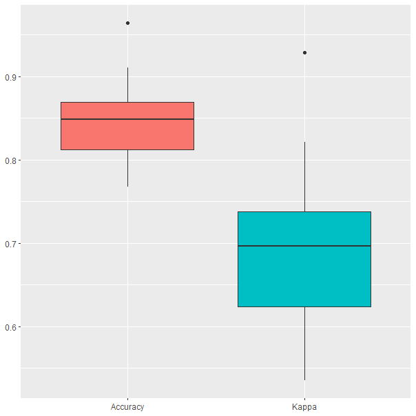

# Naive Bayes {#cap-naive-bayes}

*Ramón A. Carrasco*$^{a}$ e *Itzcóatl Bueno*$^{b,a}$

$^{a}$Universidad Complutense de Madrid 
$^{b}$Instituto Nacional de Estadística

## Introducción {#nb-intro}

*Naive Bayes* es un algoritmo de aprendizaje supervisado que se utiliza principalmente para la clasificación. Como otros algoritmos de aprendizaje supervisado, este algoritmo se entrena con variables de entrada y la categoría asociada a cada observación y que el modelo debe predecir. Sin embargo, se denomina *'naive'* dado que asume que las variables de entrada que se incluyen en el modelo son independientes entre sí. Por lo tanto, si se cambia una de las variables de entrada, las demás no se verán afectadas.

Aunque el algoritmo *Naive Bayes* es sencillo, destaca por su facilidad de implementación y su potencia predictiva. Su ventaja principal es que utiliza un enfoque probabilístico, lo que implica que todos los cálculos se realizan en tiempo real y, por tanto, los resultados se obtienen inmediatamente, como se detalla más adelante. Además, cuando el conjunto de datos tiene un gran número de observaciones, el algoritmo *Naive Bayes* es ventajoso respecto a algoritmos como la SVM (Cap. \@ref(cap-svm)) o el Random Forest (Cap. \@ref(cap-bagg-rf)) debido a su mejor tiempo de computación.

Al utilizar un enfoque probabilístico, el algoritmo *Naive Bayes* está construido sobre conceptos de probabilidad, presentados en el Cap. \@ref(Funda-probab), y en especial, este algoritmo hace uso del **Teorema de Bayes**\index{teorema!de Bayes}. A continuación se repasan los conceptos fundamentales en los que está basado el algoritmo.

## Teorema de Bayes

Sean dos eventos A y B definidos en un espacio muestral, se puede definir la probabilidad condicional de que ocurra el evento A dado que previamente se haya observado B como:

\begin{equation}
P(A|B) = \frac{P(A\cap B)}{P(B)}
\end{equation}

Siempre que $P(B) \neq 0$ y donde $P(A\cap B)$ es la probabilidad de que ocurran ambos eventos a la vez. Los eventos son intercambiables de tal forma que $P(A\cap B) = P(B|A)P(A)$ y si se reemplaza en la primera ecuación tenemos:

\begin{equation}
P(A|B) = \frac{P(B|A)\cdot P(A)}{P(B)}
\end{equation}

Esta fórmula es la definición del teorema de Bayes. El algoritmo de clasificación *Naive Bayes* (NB)\index{Naive Bayes} está basado en este teorema. Para ampliar los conceptos estadísticos aquí presentados pueden consultarse en más detalle en el Cap. \@ref(Funda-probab).

## El algoritmo *naive* Bayes

Si se adapta el teorema de Bayes\index{teorema!de Bayes} a un problema de clasificación, se tendría:

\begin{equation}
P(C=c|\ell)=\frac{P(\ell|C=c)\cdot P(C=c)}{P(\ell)}
\end{equation}

En este caso, $P(C=c|\ell)$ representa el objetivo de estimación en un problema de clasificación, es decir, la probabilidad de que un individuo pertenezca a la clase $c$ después de haber observado la evidencia $\ell$ (incluida en las variables del modelo). Esta es la denominada **probabilidad a posteriori**. El resto de elementos de la fórmula, se definen como:

+ $P(C=c)$ es la **probabilidad a priori** de pertenecer a la clase $c$, es decir, la probabilidad que un individuo tiene de ser asignado a esa clase sin observar sus características previamente.

+ $P(\ell|C=c)$ es la verosimilitud de observar una instancia particular de las variables incluidas en el modelo cuando el individuo pertenece a la clase $c$.

+ $P(\ell)$ es la verosimilitud de observar una instancia particular de las variables incluidas en el modelo, independientemente de a qué clase pertenezca el individuo.

Sin embargo, una gran dificultad para aplicar esta ecuación es la necesidad de conocer que $P(\ell|c)$ es igual a $P(\ell_1\cap\ell_2\cap\dots\cap\ell_\kappa|c)$. La existencia de un ejemplo concreto en el conjunto de datos de entrenamiento que coincida a la perfección con $\ell$ es complicado, y en el caso de existir, no se tendrían suficientes ejemplos para poder estimar una probabilidad de forma fiable. La forma de solucionar este problema es incluir una suposición de independencia particularmente fuerte, que como ya se mencionó en la Sec. \@ref(nb-intro), es lo que aporta la denominación de *'naive'* al algoritmo.

La *independencia condicional*\index{independencia condicional} implica que conocer un evento no aporta información sobre otro evento. Esto es equivalente a:

\begin{equation}
P(AB|C) = P(A|C)\cdot P(B|C)
\end{equation}

De este modo, el problema de clasificación en el que era difícil estimar $P(\ell_1\cap\ell_2\cap\dots\cap\ell_\kappa|c)$, ahora se tendría:

\begin{equation}
P(\ell|c)=P(\ell_1|c)\cdot P(\ell_2|c)\cdots P(\ell_\kappa|c)
\end{equation}

Y cada uno de los elementos $P(\ell_i|c)$ puede obtenerse directamente de los datos. Combinando este resultado con la regla de Bayes\index{teorema!de Bayes} aplicada a un problema de decisión, se obtiene la ecuación dada por el algoritmo *Naive Bayes*\index{Naive Bayes}:

\begin{equation}
P(c|\ell)=P(\ell_1|c)\cdot P(\ell_2|c)\cdots P(\ell_\kappa|c)P(c)
\end{equation}

El algoritmo *Naive Bayes*\index{Naive Bayes} clasifica una nueva observación estimando la probabilidad de que pertenezca a cada clase y asignándole a aquella que tenga la mayor probabilidad.

En definitiva, el clasificador *Naive Bayes*\index{Naive Bayes} es muy eficiente en términos de espacio de almacenamiento necesario, así como tiempos de procesamiento. Además, a pesar de ser muy simple, tiene en cuenta las características observadas. Otra de las ventajas de este clasificador es que es un modelo de aprendizaje incremental. Esto quiere decir que es una técnica de inducción que se actualiza con cada nueva observación de entrenamiento, es decir, no es necesario volver a procesar todo el conjunto de entrenamiento cuando se dispone de nuevas observaciones.

El ejemplo presentado en el Cap. \@ref(cap-arboles) en el que se buscaba predecir si se podría jugar o no al tenis bajo unas condiciones meteorológicas determinadas, puede desarrollarse utilizando el modelo *Naive Bayes*. En este caso, el procedimiento puede resumirse en tres pasos:

+ Resumir los datos en una tabla de frecuencias.
+ Generar una tabla de verosimilitud obteniendo las probabilidades de las variables.
+ Aplicar el teorema de Bayes para calcular la probabilidad a posteriori.

De este modo, las 15 observaciones registradas con el tipo de día (soleado, nublado, lluvioso) y si ese día se jugó, deben resumirse en una tabla de frecuencias como la Tabla \@ref(tab:tenis-freq). En este primer paso no se tiene en cuenta la información sobre humedad o viento.


|           | SI| NO | Total       |
|-----------|:-:|:--:|:-----------:|
| Soleado   | 2 | 4  |  6          |
| Nublado   | 4 | 0  |  4          |
| Lluvia    | 4 | 1  |  5          |
| Total     |10 | 5  |  15         |  
: (#tab:tenis-freq) Tabla de frecuencias - Tipo de día vs Jugar partido

En un segundo paso, se obtienen las probabilidades de cada categoría a partir de la Tabla \@ref(tab:tenis-freq) resultando en la Tabla \@ref(tab:tenis-likelihood).

|           | SI| NO | $P(\textrm{Tipo de día}_i)$     |
|-----------|:-:|:--:|:-------------------------------:|
| Soleado   | 2 | 4  |  $\frac{6}{15} = 0,40$          |
| Nublado   | 4 | 0  |  $\frac{4}{15} = 0,27$          |
| Lluvia    | 4 | 1  |  $\frac{5}{15} = 0,33$          |
| P(Jugar)  |$\frac{10}{15} = 0,67$ | $\frac{5}{15} = 0,33$  |           |  
: (#tab:tenis-likelihood) Tabla de verosimilitud - Tipo de día vs Jugar partido

A partir de la Tabla \@ref(tab:tenis-likelihood) se obtiene la probabilidad de cada tipo de día dado que con esa climatología se jugó o no, es decir, $P(\textrm{Tipo de día}|Jugar)$. Obteniendo las probabilidades mostradas en la Tabla \@ref(tab:probs-tipodia)

|                   |     c = SI     |     c = NO     |
|:-----------------:|:--------------:|:--------------:|
| P(Soleado \| C=c) | $\frac{2}{15}$ | $\frac{4}{15}$ |
| P(Nublado \| C=c) | $\frac{4}{15}$ | $\frac{0}{15}$ |
|  P(Lluvia \| C=c) | $\frac{4}{15}$ | $\frac{1}{15}$ |
: (#tab:probs-tipodia) Probabilidad de Tipo de día sabiendo si se jugó el partido

Este proceso se repite de forma independiente para las variables *viento* y *humedad* obteniendo la Tabla \@ref(tab:probs-viento) y la Tabla \@ref(tab:probs-humedad) respectivamente.


|                   |     c = SI     |     c = NO     |
|:-----------------:|:--------------:|:--------------:|
| P(Débil \| C=c) | $\frac{6}{15}$ | $\frac{2}{15}$ |
| P(Fuerte \| C=c) | $\frac{4}{15}$ | $\frac{3}{15}$ |
: (#tab:probs-viento) Probabilidad fuerza del Viento sabiendo si se jugó el partido

|                   |     c = SI     |     c = NO     |
|:-----------------:|:--------------:|:--------------:|
| P(Débil \| C=c) | $\frac{6}{15}$ | $\frac{1}{15}$ |
| P(Fuerte \| C=c) | $\frac{4}{15}$ | $\frac{4}{15}$ |
: (#tab:probs-humedad) Probabilidad nivel de Humedad sabiendo si se jugó el partido

Finalmente, aplicando el teorema de Bayes se podría predecir si se juega o no el partido ante la previsión de un nuevo día. Por ejemplo, ¿cuál es la probabilidad de no jugar al tenis si el día se espera soleado, con fuertes rachas de viento y escasa humedad? Esto es, $\ell$=[Soleado, Fuerte, Débil] y, de acuerdo al teorema de Bayes, esta pregunta se respondería a través de:

\begin{equation*}
P(c|\ell) = \frac{P(\ell|c)\cdot P(c)}{P(\ell)}
\end{equation*}

A partir de las probabilidades previamente obtenidas y de la asunción de independencia entre las variables, se puede calcular la probabilidad de jugar como:

\begin{equation}
P(Si|\ell) = P(Soleado|Si)\cdot P(Fuerte|Si) \cdot P (Débil|Si) \cdot P(Si) = \frac{2}{15}\frac{4}{15}\frac{2}{15}\frac{10}{15} = 0,0032
\end{equation}

\begin{equation}
P(No|\ell) = P(Soleado|No)\cdot P(Fuerte|No) \cdot P (Débil|No) \cdot P(No) = \frac{4}{15}\frac{3}{15}\frac{1}{15}\frac{5}{15} = 0,0012
\end{equation}

La probabilidad de jugar es superior a la probabilidad de no jugar y, por tanto, dado un día con esas condiciones climáticas se clasificará como un día en el que se puede jugar.

## Procedimiento con **R**: la función `naive_bayes()`

En el paquete `naivebayes` de R se encuentra la función `naive_bayes()` que se utiliza para entrenar un modelo *Naive Bayes*:


```r
naive_bayes(formula, data, prior = ..., ...)
```

+ `formula`: refleja la relación lineal entre la variable dependiente y los predictores $Y \sim X_1 + ... + X_p$.
+ `data`: conjunto de datos con el que se entrena el modelo. 
+ `prior`: vector con las probabilidades a priori de las clases.

## Clasificación de clientes utilizando el modelo *Naive Bayes*

Como en los capítulos precedentes, en este ejemplo se pretende entrenar un modelo *Naive Bayes* utilizando el conjunto de datos de compras realizadas por clientes incluido en el paquete `CDR`. Este conjunto de datos cuenta con unas variables predictoras que indican qué productos han comprado los clientes, el importe que han gastado y otras características como su edad y su nivel educativo. Se utiliza el conjunto de datos sin transformar (`dp_entr`), es decir, en su escala original y con las variables categóricas sin codificar.  La variable objetivo indica si un cliente comprará o no el nuevo producto (*tensiómetro digital*).


```r
library("caret")
library("naivebayes")
library("reshape")
library("ggplot2")
library("CDR")

data("dp_entr")
```


```r
# se fija la semilla aleatoria
set.seed(101)

# se entrena el modelo
model <- train(CLS_PRO_pro13 ~ .,
            data=dp_entr,
            method="nb", 
            metric="Accuracy",
            trControl=trainControl(classProbs = TRUE,
                                   method = "cv",
                                   number = 10))
# se muestra la salida del modelo
model
```


```r
Naive Bayes 

558 samples
 17 predictor
  2 classes: 'S', 'N' 

No pre-processing
Resampling: Cross-Validated (10 fold) 
Summary of sample sizes: 502, 502, 502, 503, 503, 502, ... 
Resampling results across tuning parameters:

  usekernel  Accuracy   Kappa    
  FALSE      0.8512662  0.7026716
   TRUE      0.8512338  0.7025165

Tuning parameter 'fL' was held constant at a value of 0
Tuning parameter
 'adjust' was held constant at a value of 1
Accuracy was used to select the optimal model using the largest value.
The final values used for the model were fL = 0, usekernel = FALSE and adjust = 1.
```

Los resultados del proceso de entrenamiento muestran que, en este caso, es indiferente indicar el argumento `usekernel` como FALSE o TRUE, los resultados de precisión son equivalentes. El resumen del modelo muestra que la precisión media obtenida durante la validación cruzada alcanza el 85,1%, lo cual indica que el modelo ajusta bastante bien la intención de compra de nuevos clientes. 


```r
confusionMatrix(model)
Cross-Validated (10 fold) Confusion Matrix 

(entries are percentual average cell counts across resamples)
 
          Reference
Prediction    S    N
         S 41.8  6.6
         N  8.2 43.4
                            
 Accuracy (average) : 0.8513
```

En la matriz de confusión del modelo se observa para cada celda el promedio porcentual entre remuestreos. Así, se observa que en media el modelo predice mejor cuando un cliente no va a comprar el nuevo producto que cuando sí lo hace, aunque no con mucha diferencia (menos de un 2%). En ambos casos, las clasificaciones erróneas no suponen ni el 10%.


```r
ggplot(melt(model$resample[,-4]), aes(x = variable, y = value, fill=variable)) + 
  geom_boxplot(show.legend=FALSE) + 
  xlab(NULL) + ylab(NULL)
```

<div class="figure" style="text-align: center">

<p class="caption">(\#fig:NBRESULTS)Resultados del modelo Naive Bayes obtenidos durante el proceso de validación cruzada.</p>
</div>

Se puede observar como la precisión oscila entre el 75% y el 95%, aunque en uno de los resultados se obtuvo un 96% de precisión, el cual se marca como un resultado atípico.

::: {.infobox_resume data-latex=""}
### Resumen {-}
En este capítulo se introduce al lector en el algoritmo de *Naive Bayes*, en concreto:

- Se presentan los fundamentos del algoritmo bayesiano, particularmente el Teorema de Bayes.
- Se explica el funcionamiento del algoritmo *Naive Bayes* y su relación con dicho Teorema de Bayes. 
- Se demuestra su aplicabilidad a un caso real de clasificación a través de `R`.
:::
