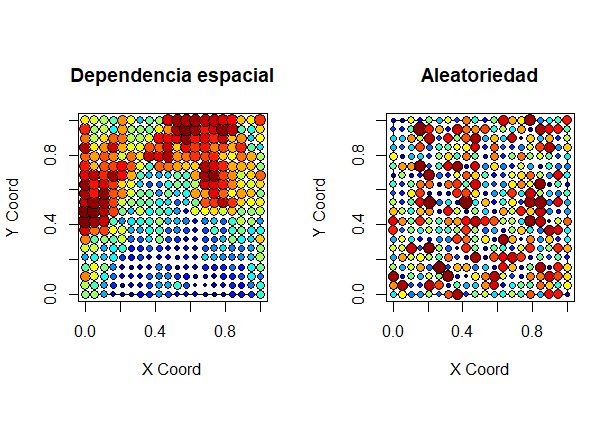
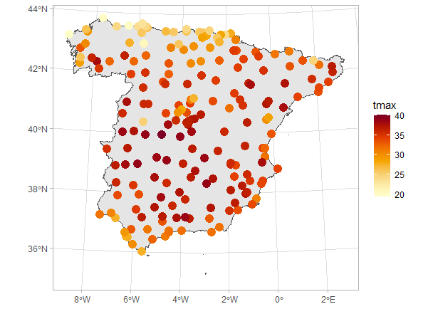
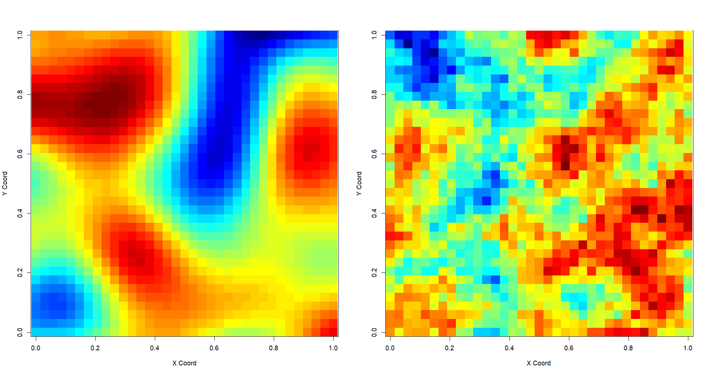
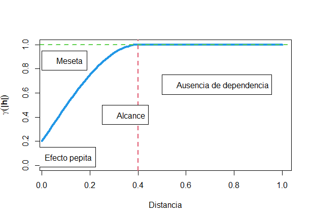
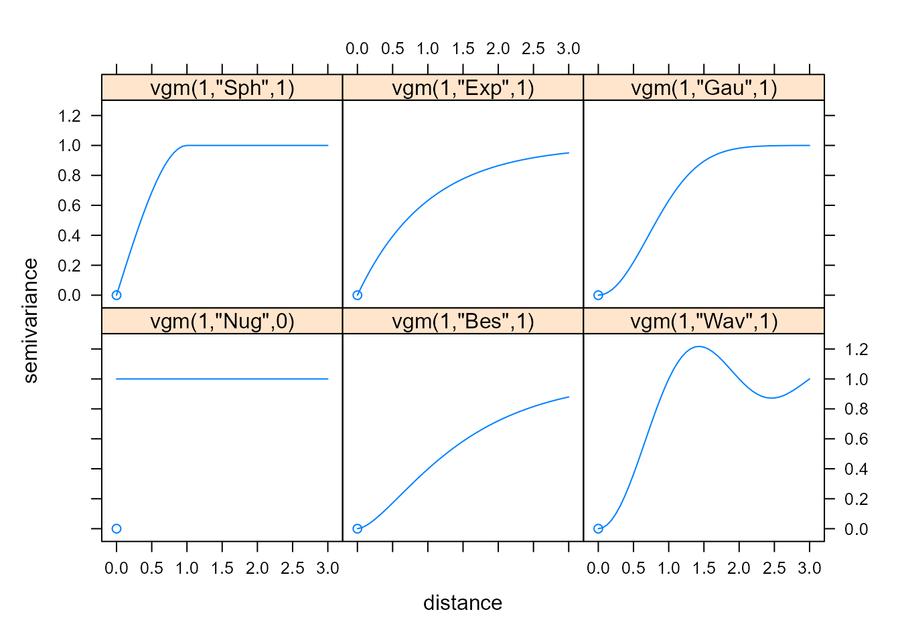
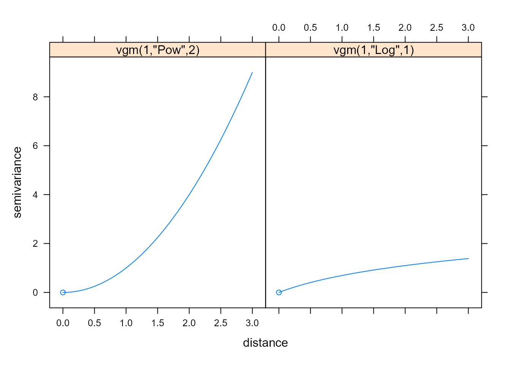
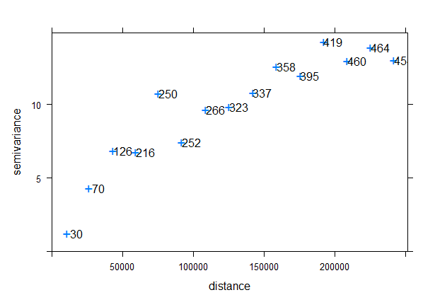
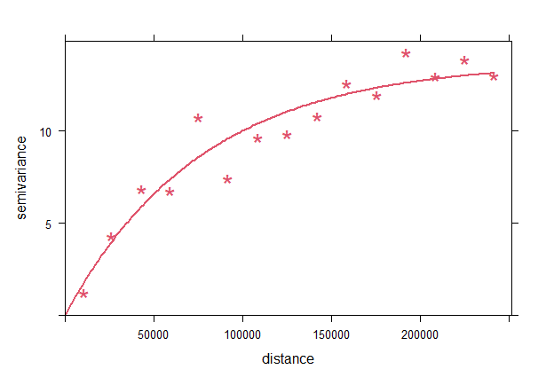
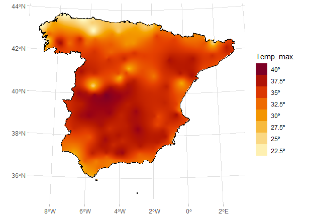
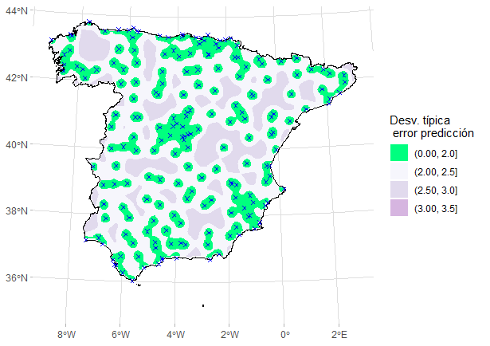

# Geoestadística {#geo}

*Gema Fernández-Avilés$^{a}$ y José-María Montero*$^{a}$ 

$^{a}$Universidad de Castilla-La Mancha

## Introducción

El término **geoestadística** apareció por primera vez en @Matheron1962, y en él "geo" enfatiza la referencia a las Ciencias de la Tierra,
extendiendo el ámbito de la estadística tradicional, cuyo objetivo es el uso de métodos probabilísticos-inferenciales,[^Nota-geo-0] con la incorporación del componente geográfico. \index{geoestadística} 

[^Nota-geo-0]: Véanse Caps. \@ref(Funda-probab) y \@ref(Fundainfer).

La geoestadística estudia los fenómenos regionalizados, que son aquellos que: \index{fenómeno regionalizado}

- Se extienden en el espacio, siendo el dominio espacial, $D$, continuo (se puede observar en cualquiera de sus puntos) y fijo (las ubicaciones observadas, ${\bf s}_i, \hspace{0,1cm} i=1,2,..., n$, no son estocásticas; se seleccionan, por el procedimiento que sea, a juicio del investigador).[^Nota-geo-1]

[^Nota-geo-1]: Los datos geoestadísticos son tan solo una parte de los datos espaciales: otra parte de ellos son los datos *latice*, poligonales o regionales, donde $D$ es discreto (códigos postales, provincias, regiones, países...) y las ubicaciones observadas no son estocásticas. De su estudio se suele encargar la econometría espacial (véase Cap. \@ref(cap-econom-esp)). También hay otro tipo de datos espaciales que surgen en dominios que pueden ser continuos o discretos, pero donde la selección de las ubicaciones observadas no depende del investigador (en este sentido $D$ es aleatorio). Se trata de los denominados procesos de puntos (véase Cap. \@ref(cap-pp)).

- Presentan una organización o estructura debida a la dependencia espacial existente. \index{dependencia espacial}
 
El objetivo fundamental de la geoestadística es sacar provecho de la **dependencia espacial** existente para llevar a cabo predicciones (interpolaciones) óptimas en ubicaciones o áreas de interés (en este sentido se habla de predicciones puntuales o por bloques, respectivamente), o la realización de *mappings* sobre todo el dominio o parte de él. Al ser $D$ continuo, no se puede hacer una representación exhaustiva del fenómeno, pero sí se puede reconstruir a partir de las observaciones disponibles. \index{dependencia espacial}

Las consecuencias de utilizar la estadística clásica, que no considera la dependencia espacial, cuando la hay, son muy graves y pueden verse en @montero2015spatial. 

El ámbito de aplicación de la geoestadística es enorme: minería, industria petrolífera, geología, meteorología, control de la calidad del aire, ecología, epidemiología, salud pública, criminología, economía, etc. Así, por ejemplo, en el ámbito del control de la calidad del aire en las grandes urbes, la concentración de ozono en aire se mide en una serie de estaciones de seguimiento, y a partir de dichas mediciones se reproduce el comportamiento del proceso sobre toda la urbe.

En conclusión, las dos partes del análisis geoestadístico son: el **análisis estructural de la dependencia espacial** y la **predicción** (que se suele acompañar del calificativo "**krigeada**"). Pero antes de estudiarlas, detengámonos en algunos preliminares.

\index{análisis!estructural}
\index{predicción! krigeada}


## Preliminares {#preliminares-geo}

Dado que los procedimientos geoestadísticos no pueden ser aplicados directamente sobre los fenómenos regionalizados como tales, porque son realidades físicas, se necesita una descripción matemática de los mismos a la que puedan ser aplicados: la **variable regionalizada** (*v.r.*) o **regionalización**, definida en un espacio geográfico, y que se supone que mide y representa correctamente dicho fenómeno.

\index{variable!regionalizada}
\index{regionalización}

Formalmente, cuando $\mathbf{s}$ recorre $D$, el conjunto $z(\mathbf{s}), \mathbf{s}\in D,$ se denomina *v.r.*, siendo $z(\mathbf{s_i}), i=1,2,3,...$ una colección de valores regionalizados. \index{valores!regionalizados}

Desde la perspectiva probabilística, cada uno de los valores que toma *v.r.* puede interpretarse como el resultado de un mecanismo aleatorio, la variable aleatoria, *v.a.* (véase Sec. \@ref(prob-va)). Si se tomasen valores regionalizados en todos los puntos del dominio, $D$, es decir, si se considerase *v.r.*, esta podría ser vista como un conjunto infinitamente grande de *v.a.*, una en cada punto de $D$, que se conoce como **función aleatoria** (*f.a.*), **proceso estocástico** o **campo aleatorio** espacial, $Z(\mathbf{s}), \mathbf{s}\in D$, donde $Z$ representa el fenómeno de interés. Pues bien, *v.r.* se interpreta como una realización de una *f.a.* espacial, y esta es una decisión metodológica clave en geoestadística.

\index{función!aleatoria!espacial}
\index{proceso estocástico!espacial}
\index{campo aleatorio espacial}

Es importante tener en cuenta que *v.r.* $(i)$ es, a menudo, muy irregular a escala local, lo que impide su representación mediante una función determinista; y $(ii)$ muestra cierta organización o estructura espacial. La interpretación de *v.r.* como una realización de una *f.a.* espacial permite considerar estos dos aspectos:

- En cada localización $\mathbf{s}$, $Z(\mathbf{s})$ es una *v.a.* (de ahí el aspecto errático).

- Para un conjunto de puntos dado, ${\mathbf{s}_1},{\mathbf{s}_2}, ..., {\mathbf{s}_k}$, las *v.a.* $Z({\mathbf{s}_1}), Z({\mathbf{s}_2}), ..., Z({\mathbf{s}_k})$ están ligadas por una red de correlaciones espaciales que son las responsables de la similitud en los valores que toman (de ahí el aspecto estructurado).

Las *f.a.* $Z(\mathbf{s})$ pueden ser estacionarias (en sentido estricto o de segundo orden), intrínsecamente estacionarias o no estacionarias, y el hecho de que tengan uno u otro tipo de estacionariedad determina el análisis geoestadístico. 


Una *f.a.* espacial es **estrictamente estacionaria** si las familias de *v.a.* $Z(\mathbf{s}_1),Z(\mathbf{s}_2),...,Z(\mathbf{s}_k)$, tienen la misma distribución de probabilidad conjunta que $Z(\mathbf{s}_1+\mathbf{h}),Z(\mathbf{s}_2+\mathbf{h}),...,Z(\mathbf{s}_k+\mathbf{h})$, $\forall k$, $\forall \mathbf{s}_1, \mathbf{s}_2,...,\mathbf{s}_k$ y $\forall \mathbf{h} \in \mathbb{R}^d$  (donde $\mathbf{h}$ es un vector de traslación), siempre que $\mathbf{s}_1+\mathbf{h}, \mathbf{s}_2+\mathbf{h},...,\mathbf{s}_k+\mathbf{h}\in D$. 
Es decir, la distribución de probabilidad conjunta de $Z(\mathbf{s}_1+\mathbf{h}),Z(\mathbf{s}_2+\mathbf{h}),...,Z(\mathbf{s}_k+\mathbf{h})$ no se ve afectada por una traslación $\mathbf{h}$, y por tanto, ni ella ni las funciones de densidad de dimensión inferior a $k$ dependen de las localizaciones consideradas.

La estacionariedad estricta es una condición muy restrictiva. Por ello, en la práctica lo que se suele asumir es la **estacionariedad de segundo orden**, que limita la estacionariedad a los dos primeros momentos de la *f.a.*[^Note3]
\index{función!aleatoria!estacionaria en sentido estricto}

[^Note3]: En **geoestadística lineal** el interés se centra en los dos primeros momentos de la *f.a.*, por lo cual tan solo es necesaria la estacionariedad de segundo orden. Es decir, la esperanza y la varianza existen, son constantes y no dependen de la localización $\mathbf{s}$. La covarianza existe para cada par de *v.a.*  $Z(\mathbf{s})$ y $Z(\mathbf{s}+\mathbf{h})$ y solo depende de $\mathbf{h}$.

Si una *f.a.* es estrictamente estacionaria, también es estacionaria de segundo orden. Sin embargo, la relación inversa no tiene por qué ser cierta.

La estacionariedad de segundo orden\index{función!aleatoria!estacionaria de segundo orden} implica la existencia de la varianza de la *f.a.* y, por tanto, deja fuera los fenómenos con infinita capacidad de variación. En este caso, si las diferencias $Z(\mathbf{s}+\mathbf{h})-Z(\mathbf{s})$ son estacionarias de segundo orden, se dice que la *f.a.*  es **intrínsecamente estacionaria**.\index{función!aleatoria!intrínsecamente estacionaria}

Aquellas *f.a.* cuya esperanza y/o varianza dependan de la localización (no son invariantes a las traslaciones) se denominan **no estacionarias**.\index{función!aleatoria!no estacionaria}

Salvo indicación de lo contrario, se asumirá la estacionariedad de segundo orden.


Finalmente, unos breves comentarios sobre la importancia de la estacionariedad. Es imposible inferir la ley de probabilidad que gobierna la *f.a.* espacial a partir de una sola realización de la misma (una sola regionalización), pues sería como tener una muestra de tamaño 1. Pero en la práctica ese será el caso. Bueno, ni siquiera eso. Solo se dispondrá de una parte de la regionalización: la correspondiente a las localizaciones observadas. La solución a tan importante limitación es adoptar la hipótesis de estacionariedad u homogeneidad espacial. Es decir, sustituir la repetición de realizaciones de la *f.a.* espacial por repeticiones en el espacio; dicho de otra forma, suponer que los valores observados en distintas localizaciones de $D$ tienen las mismas características estadísticas y pueden ser considerados, en términos estadísticos, como realizaciones de la misma *f.a.*[^Note4] Por tanto, la hipótesis de estacionariedad significa que la ley espacial que gobierna *f.a.*, o parte de ella, es invariante a traslaciones; no depende de las localizaciones específicas observadas sino solo de $\mathbf{h}$.

[^Note4]: Estas realizaciones no son independientes, y se suele asumir también la hipótesis de **ergodicidad** (véase Sec. \@ref(conceptos)). \index{ergodicidad}

La hipótesis de estacionariedad permitirá actuar como si todas las *v.a.* que conforman la *f.a.* tuviesen la misma distribución de probabilidad (o los mismos momentos), haciendo posible el proceso inferencial. Por eso se le da tanta importancia a que la *f.a.* sea estacionaria, del tipo que sea.


## Análisis estructural de la dependencia espacial {#ana-estructural}

### Semivariograma {#semivariograma} 
\index{semivariograma}

La **estadística espacial** se basa en la suposición de que las unidades georreferenciadas cercanas están relacionadas (son dependientes) de alguna manera [@getis1999], y tanto más cuanto más cercanas estén [@tobler1970computer].

Los procesos con dependencia espacial se reconocen, visualmente, porque muestran un patrón en el espacio; en los que no la tienen, el patrón es el de la aleatoriedad. La Fig. \@ref(fig:plot-dep-iid-ch41) muestra una simulación de una *f.a.*  con dependencia espacial (panel izquierdo) frente a unos datos totalmente aleatorios (panel derecho).

```r
library("geoR")
library("fields")
par(mfrow = c(1, 2))
set.seed(728)

sim_dep <- grf(401, grid = "reg", cov.pars = c(1, 0.8), messages = FALSE)
points.geodata(sim_dep,
  main = "Dependencia espacial",
  col = tim.colors(), cex.max = 2
)

sim_indep <- grf(401, grid = "reg", cov.pars = c(0.01, 0), messages = FALSE)
points.geodata(sim_indep,
  main = "Aleatoriedad",
  col = tim.colors(), cex.max = 2
)
```

<div class="figure" style="text-align: center">

<p class="caption">(\#fig:plot-dep-iid-ch41)Dependencia espacial frente a aleatoriedad.</p>
</div>

Pasando del terreno de las simulaciones a la realidad, la Fig. \@ref(fig:plot-temp-max-ch41) muestra la temperatura máxima en España el 6 de agosto de 2022,[^Note-data] en plena ola de calor (este es el ejemplo real que se utilizará a lo largo del capítulo). En ella puede observarse claramente una estructura de dependencia espacial, con máximas cercanas a 40 grados en la meseta central y Extremadura, de 30 grados o menos en la cordillera Cantábrica y las costas atlántica, cantábrica y andaluza, y entre 30 y 35 grados en el resto del país (básicamente Murcia, Comunidad Valenciana y Cataluña). 

[^Note-data]: Los datos ya procesados para el análisis se encuentran en `CDR::tempmax_data`. Una descripción puede verse con `summary(CDR::tempmax_data)`. Estos datos han sido descargados con la librería `climaemet` y `mapSpain`. Un desarrollo completo de manipulación de datos espaciales puede verse en @R-climaemet.


```r
library("CDR")
#summary(CDR::tempmax_data)
```


```r
library("ggplot2")
br_paper <- c(-Inf, seq(17.5, 45, 2.5), Inf)
pal_paper <- hcl.colors(15, "YlOrRd", rev = TRUE)

ggplot(ESP_utm) +
  geom_sf() +
  geom_sf(data = temp_max_utm_sf, aes(col = tmax), size = 4) + # temp_max_utm
  theme_light() +
  scale_color_gradientn(colours = pal_paper)
```

<div class="figure" style="text-align: center">

<p class="caption">(\#fig:plot-temp-max-ch41)Temperatura máxima en España peninsular, 6 de agosto de 2022.</p>
</div>


Ahora bien, para poder llevar a cabo predicciones geoestadísticas es necesario representar previamente los patrones de dependencia espacial observados mediante funciones que indiquen cuál es la estructura de dicha dependencia espacial. Dichas funciones son los **semivariogramas**. Dado que la identificación de la estructura de la dependencia espacial existente en el fenómeno de interés es la clave del éxito del proceso predictivo, al semivariograma\index{semivariograma} se le considera la piedra angular de la predicción geoestadística [@montero2015spatial].  \index{semivariograma} \index{dependencia espacial}

Un semivariograma se define como la semivarianza de los incrementos de la *f.a.*: \begin{equation} (\#eq:vario) 
\gamma(\mathbf{s}_i - \mathbf{s}_j) = \frac{1}{2} V[Z(\mathbf{s}_i)-Z(\mathbf{s}_j)] , \hspace{0,2cm} \forall \mathbf{s}_i, \mathbf{s}_j\in D.
\end{equation}
que, en el caso habitual de *f.a.* estacionarias de segundo orden o intrínsecamente estacionarias (sin deriva), se transforma en: 
\begin{equation}
\gamma (\mathbf{h}) = \frac{1}{2} V \left( Z(\mathbf{s} + \mathbf{h}) - Z(\mathbf{s}) \right) =\frac{1}{2}E\left( {\left( {Z(\mathbf{s} + \mathbf{h}) - Z(\mathbf{s})} \right)^2} \right).
\end{equation}

Nótese que: 

- Si hay dependencia espacial (positiva,[^Note-geo-5] es lo normal), la diferencia entre los valores de la *f.a.* en los puntos separados por una pequeña distancia será poca y más o menos la misma. Es decir, dichas diferencias serán poco variables y el valor del semivariograma a pequeñas distancias será pequeño. 

[^Note-geo-5]: Valores cercanos similares. Si es negativa, los valores vecinos son diferentes.

-  Si aumenta la distancia, la dependencia espacial se reduce y la diferencia entre los valores de la *f.a* en los puntos separados por distancias intermedias y grandes no será tan parecida como en el caso anterior, sino mayor, y variará más. Es decir, el valor del semivariograma aumenta con la distancia.

- Si la distancia aumenta lo suficiente como para que ya no haya dependencia espacial, las diferencias entre los valores de la *f.a.* separados por tal distancia alcanzarán la variabilidad de la *f.a* en estudio, y si esta es estacionaria de segundo orden, el semivariograma se estabilizará en torno a ella. 

En el caso estacionario, las **funciones de covarianza**, $C(\bf h)$, también pueden ser utilizadas para representar la estructura de la dependencia espacial, si bien se prefiere el semivariograma porque no requiere el conocimiento de la media de la *f.a.* en estudio. Además, el semivariograma cubre un espectro más amplio de fenómenos regionalizados \index{regionalización} que la función de covarianza, ya que esta no puede definirse en el caso de estacionariedad intrínseca. Los detalles pueden verse en  @montero2015spatial y @montero_larraz2008.
\index{semivariograma} \index{dependencia espacial} \index{función!de covarianza}

Cuando el semivariograma depende tanto de la dirección como de la longitud del vector $\mathbf{h}$ que une las localizaciones $\mathbf{s}$ y $\mathbf{s}+ \mathbf{h}$, se denomina **anisotrópico**. Cuando solo depende de la distancia ($\lvert \mathbf{h} \rvert=|| \mathbf{h} ||$, porque en el espacio euclídeo el módulo y la norma coinciden) se denomina **isotrópico**. 
\index{semivariograma!isotrópico}  \index{semivariograma!anisotrópico}

Un semivariograma no puede ser cualquier función. Tiene que ser nulo en el origen, no negativo, verificar que $\gamma(\mathbf{h})=\gamma(-\mathbf{h})$, debe ser una función condicionalmente definida negativa y tener un ritmo de crecimiento inferior a $|\mathbf h|^2$, es decir, $lim_{|\mathbf h|\to\infty}  \frac {\gamma(\mathbf{h})}{|\mathbf h|^2}=0$ cuando el proceso es no estacionario (sin deriva), siendo finito en caso de procesos estacionarios de segundo orden. 

El análisis del comportamiento de un semivariograma a pequeñas, medias y grandes distancias es de sumo interés, como se verá a continuación. 

En general, a  distancias medias y grandes, los semivariogramas asociados a *f.a.* estacionarias de segundo orden crecen, monótonamente, desde el origen con la distancia hasta alcanzar un valor límite, la **varianza** ***a priori*** de la *f.a.* (o covarianza para $\mathbf {h}=0$, $C(\mathbf{0})$), bien de forma exacta o asintóticamente. Dicho valor límite se denomina **meseta**, $m$, y la distancia a la cual se alcanza se conoce como **alcance** o **rango**, $a$. Por tanto, el rango es la distancia a partir de la cual ya no hay  dependencia espacial. Cuando $m$ se alcanza asintóticamente, el alcance no queda perfectamente definido y se toma como alcance la distancia a la cual el semivariograma toma el valor $0,95 m$, denominada **alcance efectivo** a efectos prácticos.


\index{varianza! a priori@\textit{a priori}} 
\index{meseta} \index{rango}  \index{alcance}

En el caso no estacionario (por ejemplo, si hay deriva) o intrínsecamente estacionario el semivariograma no tiene meseta.

El comportamiento a pequeñas distancias, sobre todo cerca del origen, que es donde más dependencia espacial hay, está muy relacionado con el grado de continuidad y regularidad de *f.a.* Cuanto más continua y regular sea, más suaves y estructuradas serán las realizaciones que produzca, y más regular será el comportamiento del semivariograma cerca del origen (Fig. \@ref(fig:gauss-sph-plot), panel izquierdo; representación bidimensional).

Los semivariogramas con un **comportamiento lineal cerca del origen** son típicos de *v.r.* continuas, al menos por partes, pero no diferenciables. Su representación gráfica tridimensional está llena de picos. La amplitud de las fluctuaciones aumenta con la distancia entre localizaciones y es proporcional a la pendiente de la tangente en el origen (Fig. \@ref(fig:gauss-sph-plot), panel derecho; representación bidimensional).


```r
par(mfrow = c(1, 2))
set.seed(123)

fa_gauss <- grf(1225, grid = "reg", cov.pars = c(1, .25), cov.model = "gaussian")
image(fa_gauss, col = tim.colors())

fa_sph <- grf(1225, grid = "reg", cov.pars = c(1, .25), cov.model = "spherical")
image(fa_sph, col = tim.colors())
```

<div class="figure" style="text-align: center">

<p class="caption">(\#fig:gauss-sph-plot)Representacion bidimensional de dos $f.a.$: con semivariograma parabólico en el origen (izquierda); con semivariograma lineal en el origen (derecha).</p>
</div>
Las *v.r.* regulares (aquellas cuya gráfica tridimensional no tiene picos) se identifican con un **comportamiento semivariográfico parabólico en el origen**. Si dicho comportamiento persiste a largas distancias, puede que exista una fuerte deriva.

Las discontinuidades en el origen (que teóricamente no pueden darse) son frecuentes en la práctica. Su amplitud se denomina **efecto pepita**
(*nugget effect*) y son típicas de variables regionalizadas muy irregulares y, quizás, discontinuas. Las causas más frecuentes del efecto pepita son la existencia de una estructura con alcance inferior a la distancia más corta entre localizaciones y los errores de posicionamiento o de medida [véase @chiles1999 para más detalle].  \index{semivariograma!comportamiento}  \index{efecto pepita}  \index{nugget effect@\textit{nugget effect}}

El caso límite del efecto pepita es el **efecto pepita puro**. \index{efecto pepita!puro} En ese caso, el semivariograma es constante cualquiera que sea la distancia, indicando ausencia de dependencia espacial.

La Fig. \@ref(fig:plot-partes-sem) muestra gráficamente los principales elementos de un semivariograma.

```r
# función para representar el semivariograma
semivar <- function(x, ...) {
  1 - cov.spatial(x, ...)
}

curve(semivar(x, cov.pars = c(0.8, 0.4), cov.model = "sph"), 0.0, 1,
  xlab = "Distancia",  xlim = c(0.03, 1),
  ylab = expression(bold(gamma("|h|"))), ylim = c(0, 1),
  lwd = 4, lty = 1, col = "4"
)

abline(v = 0.4, col = 2, lty = 2, lwd = 2) # alcance
abline(h = 1, col = 3, lty = 2, lwd = 2) # meseta
legend(-0.05, 0.15, "Efecto pepita")
legend(0, 0.95, "Meseta")
legend(0.25, 0.5, "Alcance")
legend(0.5, 0.75, "Ausencia de dependencia")
```

<div class="figure" style="text-align: center">

<p class="caption">(\#fig:plot-partes-sem)Elementos del semivariograma (meseta unitaria).</p>
</div>

\index{semivariograma}  \index{dependencia espacial}


### Modelos de semivariogramas válidos  
\index{semivariograma!válido}

Las funciones que verifican las condiciones que debe cumplir un semivariograma (véase Sec. \@ref(semivariograma)) se conocen como **semivariogramas válidos**. El incumplimiento de alguna de ellas tiene perversas consecuencias en el proceso predictivo (por ejemplo, varianzas de los errores de predicción negativas). Su tipología, siguiendo el enfoque sugerido en @journel1978  y @montero2015spatial, es la siguiente:[^Nota2]

[^Nota2]: Aquí se presentan los semivariogramas isotrópicos más utilizados en la práctica. Nos centramos en ellos porque las anisotropías (y por tanto los semivariogramas anisotrópicos) pueden ser representadas reduciéndolas al caso isotrópico sin más que llevar a cabo una transformación lineal de las coordenadas, o representando separadamente cada variabilidad direccional, dependiendo del tipo de anisotropía (geométrica o zonal). Para un análisis detallado, consúltese, por ejemplo, @montero2015spatial. 

\index{semivariograma!isotrópico}

#### Semivariogramas con meseta  \index{semivariograma!con meseta}
\index{anisotropías}

Están asociados a *f.a.* estacionarias de segundo orden. Los más utilizados son:

-   **Esférico.** \index{semivariograma!esférico} Válido en $\mathbb{R}^1$, $\mathbb{R}^2$ y
$\mathbb{R}^3$, y viene dado por: 
\begin{equation} 
\gamma(|\mathbf{h}|)= \left\{
\begin{array}{ll}
m \left( 1.5\frac{|\mathbf{h}|}{a}-0.5\left(\frac{|\mathbf{h}|}{a}\right)^{3} \right) & \mbox{si $|\mathbf{h}|\leq a$} \\
m & \mbox{si $|\mathbf{h}| > a.$}
\end{array}
\right.
\end{equation} 

Tiene un comportamiento lineal cerca del origen, indicando continuidad y cierto grado de irregularidad en la *f.a.* A grandes distancias alcanza la meseta cuando $|\mathbf{h}|=a$. Estas dos características son propias de muchas regionalizaciones observadas en la realidad; de ahí su popularidad.

-   **Exponencial. ** \index{semivariograma!exponencial} Válido en $\mathbb{R}^d, d\geq1$, y viene dado por: 
\begin{equation} 
\gamma (|\mathbf{h}|)= m \left( 1-\exp \left( -\frac{|\mathbf{h}|}{a}
\right) \right).
\end{equation}

Igual que el esférico, cerca del origen exhibe un comportamiento lineal, siendo menor la pendiente. A diferencia de él, solo alcanza la meseta asintóticamente. A efectos prácticos, se toma como alcance la distancia para la cual el semivariograma alcanza el valor del 95% de la meseta, $a^\prime \approx 3a$.

-   **Gaussiano.** \index{semivariograma!gaussiano} Válido en $\mathbb{R}^d, d \geq1$. Está definido por: 
\begin{equation}   
\gamma (|\mathbf{h}|)=m\left( 1-\exp \left(-\frac{|\mathbf{h}|^{2}}{a^{2}}\right) \right).
\end{equation}

A diferencia del esférico y el exponencial, tiene un comportamiento parabólico cerca del origen. Por consiguiente, está asociado con *f.a.* estacionarias de segundo orden infinitamente diferenciables y, en consecuencia, muy regulares. Igual que el modelo exponencial, alcanza la meseta solo asintóticamente, con $a^\prime \approx a \sqrt 3$.


-   **Efecto pepita puro.** \index{semivariograma!efecto pepita puro} Refleja la ausencia de dependencia espacial:

\begin{equation}
\gamma(|\mathbf{h}|) = \left\{ {\begin{array}{l}
 m\;\;\mbox{si}\;|\mathbf{h}| = 0 \\
 0\;\;\mbox{ si}\;|\mathbf{h}| > 0 \\
 \end{array}}, \right.\; \;\;\; m> 0.
\end{equation}

-   **K-Bessel**. \index{semivariograma!J-Bessel} Válido en $\mathbb{R}^d, d\geq1$. Su expresión es:
\begin{equation}
\gamma(|\mathbf{h}|)=m \left(1- \frac{1}{2^{\alpha-1} \Gamma(\alpha)}
\left(\frac{|\mathbf{h}|}{a} \right)^\alpha K_\alpha \left(\frac{|\mathbf{h}|}{a} \right) \right), \quad \alpha >0,
\end{equation} 

donde  $K_\alpha$ es la función de segunda especie de orden $\alpha$. Este modelo puede representar cualquier tipo de comportamiento cerca del origen. Por ejemplo, para $\alpha=0,5$ se obtiene el modelo exponencial. 


#### Semivariogramas con meseta y efecto hoyo   \index{semivariograma!con meseta y efecto hoyo}

- **J-Bessel**. \index{semivariograma!J-Bessel}Un semivariograma no tiene por qué ser necesariamente una función monótona no decreciente, sino que puede tener "ondas" (efecto hoyo). Tal es el caso del modelo J-Bessel, que puede ser utilizado en presencia de dependencia espacial negativa o, específicamente, en caso de alternancia entre dependencia positiva y negativa. Válido en $\mathbb{R}^d$, $d\leq 2(\alpha +1)$, su expresión viene dada por:
\begin{equation}
\gamma(|\mathbf{h}|)=m \left(1- \left(\frac{2a}{|\mathbf{h}|}\right)^{\alpha} \Gamma(\alpha + 1)
J_\alpha \left(\frac{|\mathbf{h}|}{a} \right) \right),
\end{equation} 

donde $\alpha$ es un parámetro de forma, $a$ es un parámetro de escala,  \index{parametro@parámetro!de escala} $\Gamma$ es la función de Euler que interpola el factorial y $J_{\alpha}$ es la función J-Bessel de primera especie de orden $\alpha$. 

<!-- El semivariogrmama J-Bessel is the particularization of the J-Bessel -->
<!-- model for $\alpha =1/2$ and is one of the few hole-effect models valid -->
<!-- \index{Valid semivariogram} on $\mathbb{R}^3$ -->

La Fig. \@ref(fig:semivar-teo-sill-ch41) muestra una representación gráfica de los anteriores semivariogramas. 


```r
library("gstat")
show.vgms(models = c("Sph", "Exp", "Gau", "Nug", "Bes", "Wav"))
```

<div class="figure" style="text-align: center">

<p class="caption">(\#fig:semivar-teo-sill-ch41)Representación de semivariogramas con meseta válidos  (meseta y alcance efectivo unitarios; a excepción del efecto pepita puro).</p>
</div>

#### Semivariogramas sin meseta \index{semivariograma!sin meseta}

Estos modelos van más allá de la hipótesis estacionaria de segundo
orden y corresponden a *f.a.* con una
capacidad ilimitada de dispersión espacial, es decir, a *f.a.*  intrínsecamente estacionarias, pero no estacionarias de segundo orden. Los más populares son:

+ **Potencial**. Válido en $\mathbb{R}^d, d\geq1$, y definido por:
\begin{equation}
\gamma (|\mathbf{h}|)=  (|\mathbf{h}|)^{\alpha }, \quad \mbox  {con } 0<\alpha <2.
\end{equation}
\index{semivariograma!potencial}

+ **Logarítmico**.  Válido en $\mathbb{R}^d, d\geq1$, y con expresión:
\begin{equation}
\gamma (|\mathbf{h}|) = b\log |\mathbf{h}|\; \;\mbox{si}\ |\mathbf{h}| \ge 0,
\end{equation}

donde $b$ es una constante.

\index{semivariograma!logarítimico}

Una representación gráfica de ambos semivariogramas puede verse en la Fig. \@ref(fig:semivar-teo-no-sill-ch41).

```r
show.vgms(models = c("Pow", "Log"), sill = 1, range = c(2, 1), nugget = 0)
```

<div class="figure" style="text-align: center">

<p class="caption">(\#fig:semivar-teo-no-sill-ch41)Representación de semivariogramas sin meseta válidos.</p>
</div>


### Semivariograma empírico

Dado que la única información de la que se dispone es una realización observada de la *f.a* objeto de estudio, en la práctica la estructura de la dependencia espacial se estima mediante el semivariograma empírico. 

En el marco de la estacionariedad intrínseca (que incluye la estacionariedead estricta y de segundo orden) y en $\mathbb{R}^d, d\geq1$, se estiman (insesgadamente) los valores semivariográficos para un número determinado de distancias, por el método de los momentos: \index{valores!semivariográficos}
\begin{equation} 
\hat{\gamma} (\mathbf{h}) = \frac{1}{2\#N(\mathbf{h})}\sum\limits_{N(\mathbf{h})} {\left( {Z(\mathbf{s}_i + \mathbf{h}) - Z({\mathbf{s}}_i )} \right)^2},
\end{equation}
donde $\#N(\mathbf{h})$ es el número de parejas de localizaciones separadas por el vector $\mathbf{h}$.

La función que mejor ajusta las estimaciones de los valores semivariográficos anteriormente referidos se denomina **semivariograma empírico** y se suele denotar por $\hat{\gamma} (\mathbf{h})$. 
 
\index{semivariograma!empírico}
Los valores semivariográficos se suelen computar para distancias inferiores a la mitad del diámetro de *D*, porque para distancias superiores el número de parejas de localizaciones suele ser pequeño para proporcionar estimaciones fiables. En la práctica, como en muchas de las direcciones no hay un número de parejas suficiente para calcular el semivariograma con cierta fiabilidad, lo habitual es construir un **semivariograma empírico omnidireccional**, es decir, que depende solo de la distancia (longitud del vector **h**) y no de la dirección. Para ello se crean **regiones de tolerancia**, que no se solapen, basadas en intervalos de distancia (normalmente de la misma longitud) y un **ángulo de tolerancia**.\index{angulo@ángulo de tolerancia} En concreto, la tolerancia se especifica en el módulo de $\mathbf h$ ($\pm\Delta |\mathbf h|$) y en su dirección ($\pm\Delta\theta$). Para más detalles y ejemplos, véase @montero2015spatial.   

\index{semivariograma!empírico!direccional} \index{semivariograma!empírico!omnidireccional} \index{region@región!de tolerancia} 

La Fig. \@ref(fig:plot-semivar-emp) muestra la ubicación de los puntos semivariográficos, indicando el número de parejas a cada distancia, en el caso de las temperaturas máximas en España (06/08/2022).


```r
vgm_tmax <- variogram(tmax ~ 1, temp_max_utm_sf,
  cutoff = 250000 # 250 km
)
plot(vgm_tmax, plot.numbers = TRUE, pch = "+", lwd = 2, cex = 2)
```

<div class="figure" style="text-align: center">

<p class="caption">(\#fig:plot-semivar-emp)Valores semivariográficos. Temperaturas máximas (06/08/2022).</p>
</div>


En el ejemplo ilustrado, la distancia mínima entre dos estaciones meteorológicas es 1.125 m y la máxima 1.027.597 m. Sin embargo, dada la geometría del mapa de España (aunque de Huelva a Gerona hay 987 km en línea recta, más de dos terceras partes de las ciudades españolas no están separadas más de 500 km), se consideró 250.000 m (1/4 de la distancia máxima) como distancia máxima a la hora de calcular los valores semivariográficos, ya que a partir de dicha distancia el número de parejas no es lo suficientemente grande como para obtener resultados fiables. Por convenio, `gstat` divide la distancia en 15 intervalos (`geoR` la divide en 13 porque los autores lo hicieron un viernes 13).  \index{valores!semivariográficos}

### Ajuste semivariográfico  

\index{ajuste!semivariográfico}  \index{valores!semivariográficos} \index{semivariograma!válido}

Cualquier función que dependa de una distancia y una dirección no es necesariamente un semivariograma, pues para ello tienen que cumplir los requisitos especificados en la Sec. \@ref(semivariograma). Esta es la razón por la que el semivariograma empírico no puede utilizarse directamente para realizar predicciones geoestadísticas. Por ello, a los valores semivariográficos estimados se les ajusta una función que represente un semivariograma válido. Sin embargo, esta tarea, clave para el éxito del posterior proceso predictivo, no es sencilla ni existe consenso en torno a ella. 
El ajuste puede ser **manual**, utilizando métodos visuales y gráficos,  o **automático**, que usa procedimientos estadísticos. Una combinación de ambos es muy recomendable. \index{ajuste!semivariográfico!manual} \index{ajuste!semivariográfico!automático}

El ajuste manual pudiera parecer "no muy científico" pero, dado que lo más importante a la hora del ajuste no es tanto la bondad del ajuste para todos los puntos semivariográficos sino lo bien que un semivariograma válido representa las principales características del fenómeno, especialmente el tipo de estacionariedad (comportamiento a largas distancias)  y, sobre todo, el tipo de continuidad (comportamiento cerca del origen), resulta ser un procedimiento muy práctico si se guía por las anteriores consideraciones. En este sentido, cualquier conocimiento sobre el fenómeno en estudio es bienvenido.


El ajuste automatizado mediante procedimientos estadísticos incluye los **métodos de mínimos cuadrados** (tanto ordinarios como generalizados y ponderados), que son los más populares en la práctica, y los **métodos basados en máxima verosimilitud**, que incluyen, entre otros, el tradicional método máximo verosímil, la máxima verosimilitud restringida y el método de la verosimilitud compuesta. 

\index{metodo@método! de mínimos cuadrados!ordinarios}
\index{metodo@método! de mínimos cuadrados!generalizados}
\index{metodo@método! de mínimos cuadrados!ponderados}
\index{metodo@método! de máxima verosimilitud}
\index{metodo@método! de máxima verosimilitud!restringida}
\index{metodo@método! de máxima verosimilitud!compuesta}

La Fig. \@ref(fig:plot-fit-semivar) muestra el semivariograma empírico correspondiente a los puntos semivariográficos de la Fig. \@ref(fig:plot-semivar-emp). De todos los modelos con meseta, el semivariograma ajustado ha sido un exponencial con alcance 76.404,64 metros y meseta 13,74.


```r
fit_vgm_tmax <- fit.variogram(vgm_tmax,
                              model = vgm(model = c("Sph", "Exp", "Gau", "Nug", "Bes", "Wav")), fit.sills = TRUE, fit.ranges = TRUE, fit.kappa = TRUE, fit.method = 7)
fit_vgm_tmax
#>   model    psill    range
#>1   Exp 13.74102 76404.64
attr(fit_vgm_tmax, "SSErr") 
#> [1] 6.200657e-07
plot(vgm_tmax, fit_vgm_tmax, lwd = 2, col = "2", pch = "*", cex = 3)
```


<div class="figure" style="text-align: center">

<p class="caption">(\#fig:plot-fit-semivar)Semivariograma empírico. Temperaturas máximas (06/08/2022).</p>
</div>


El método de ajuste ha sido el que figura por defecto en la función `vgm`: mínimos cuadrados ponderados con ponderaciones $\frac {N_{\bf |h|}} {|\bf h|^2}$, que funciona bien en la práctica y selecciona el semivariograma que mejor ajusta cuando el número de parejas es elevado y la distancia pequeña, que es la parte del semivariograma que hay que ajustar bien porque a pequeñas distancias es cuando más dependencia espacial hay. Respecto a los parámetros iniciales, aunque el investigador puede especificar los que considere convenientes, se recomienda utilizar los que tiene la función por defecto: $(i)$ alcance igual a 1/3 de la distancia máxima en la muestra; $(ii)$ como efecto pepita se toma la media de los tres primeros valores semivariográficos; y $(iii)$ como meseta parcial (meseta menos efecto pepita), la media de los cinco últimos valores semivariográficos.

\index{meseta!parcial} \index{dependencia espacial}


## *Kriging*

Seleccionado el semivariograma válido que mejor se ajusta a los puntos semivariográficos, se aborda el proceso predictivo. El método predictivo que usa la geoestadística es conocido como **_kriging_** en honor al ingeniero de minas D.G. Krige. \index{Daniel G. Krige} \index{kriging@\textit{kriging}}

El *kriging* tiene como objetivo predecir el valor de una *f.a.*,  $Z(\mathbf{s})$, en uno o más puntos (o bloques) no observados, a partir de la regionalización observada (pueden ser puntos o bloques) en un
dominio \emph{D}, y proporciona el mejor predictor lineal insesgado 
de la *v.r.* de interés \index{regionalización} en tales puntos o bloques no observados.[^Nota-geo-6] La limitación a la clase de predictores lineales
obedece a que, bajo estacionariedad de segundo orden, solo se requiere el conocimiento de los momentos de segundo orden de la *f.a.* Con más información estructural, pueden definirse predictores no lineales.

[^Nota-geo-6]: En lo que sigue, la exposición se centrará en la predicción puntual a partir de datos puntuales (es decir, en el soporte puntual). La generalización a bloques puede verse en @montero2015spatial.

Las principales ventajas del *kriging* sobre los métodos de interpolación espacial deterministas \index{interpolación} (método de la distancia inversa, *splines*, regresión polinomial, etc.)\index{spline@\textit{spline}}, es que ($i$) considera la estructura de la dependencia espacial (dando lugar a mejores predicciones),  ($ii$) proporciona, junto con la predicción, la varianza del error de predicción y ($iii$) es un interpolador exacto.

Dependiendo del tipo de estacionariedad que se considere en la *f.a.* el *kriging* puede ser universal (no estacionariedad en media) u ordinario (estacionariedad de segundo orden o intrínseca). Este manual se centra en el **_kriging_ ordinario** (KO). La generalización al caso universal (hay deriva: la media depende de las localizaciones en vez de ser constante) puede verse en @montero2015spatial.

En términos formales, KO se plantea como sigue: Sea $Z =\left\{ Z(\mathbf{s}),\,\, \mathbf{s} \in D\right\}$ una *f.a.* con estacionariedad de segundo orden o intrínseca y con media desconocida (cuando se conoce, KO se denomina **_kriging_ simple**). Sea el **predictor lineal krigeado** $Z^{\ast} (\mathbf{s}_0 ) = \sum\limits_{i = 1}^n {\lambda _i } Z(\mathbf{s}_i )$, donde las ponderaciones $\lambda _i, i=1,2,...,n$ se obtienen imponiendo al error de predicción las condiciones de esperanza nula y mínima varianza.  
\index{kriging@\textit{kriging}!ordinario} 
\index{kriging@\textit{kriging}!universal}  
\index{kriging@\textit{kriging}!simple}


El sistema de ecuaciones que proporciona dichas ponderaciones óptimas es:
\begin{equation}  
\left\{ {\begin{array}{l}
 \sum\limits_{j = 1}^n {\lambda _j \gamma (\mathbf{s}_i - \mathbf{s}_j)
 + \alpha = \gamma (\mathbf{s}_i - \mathbf{s}_0 ), \quad \ i = 1,...,n} \\
 \sum\limits_{i = 1}^n {\lambda _i = 1}, \; \\
 \end{array}} \right.
\end{equation}
siendo la **varianza del error de predicción**: 
$\sigma_{OK}^2 (\mathbf{s}_0) = \sum\limits_{i = 1}^n {\lambda _i \gamma (\mathbf{s}_i - \mathbf{s}_0 ) + \alpha }$, donde $\alpha$ es el multiplicador de Lagrange involucrado en el proceso de optimización.

Retomando el ejemplo de las temperaturas máximas en la España peninsular el 6 de agosto de 2022, a continuación se muestra el código necesario para la creación de un *mapping* de predicción de dichas temperaturas. 


```r
kriged_tmax <- krige(tmax ~ 1,
  temp_max_utm_sp,
  grd_sp,
  model = fit_vgm_tmax
)
#> [using ordinary kriging]
```


```r
kriged_df <- as.data.frame(kriged_tmax, xy = T, na.rm = T)

ggplot() +
  geom_tile(data = kriged_df,
    aes(x = coords.x1, y = coords.x2, fill = var1.pred)
  ) +
  geom_sf(data = ESP_utm, col = "black", fill = NA) +
  scale_fill_gradientn(colours = pal_paper,
    breaks = br_paper,
    labels = function(x) {
      paste0(x, "º")
    },
    guide = guide_legend(reverse = TRUE, title = "Temp. max.")
  ) +
  theme_light() +
  theme(panel.background = element_blank(),
    panel.border = element_blank(),
    axis.title = element_blank(),
  )
```

<div class="figure" style="text-align: center">

<p class="caption">(\#fig:plot-kriging-pred)$Mapping$ de temperaturas máximas (06/08/2022).</p>
</div>

El *mapping* de la Fig. \@ref(fig:plot-kriging-pred) tiene poco valor si no se acompaña de otro que muestre la desviación típica de los errores de predicción. \index{error!de predicción}  \index{mapping@\textit{mapping}}


```r
ggplot(kriged_df) +
  geom_contour_filled(aes(coords.x1, coords.x2, z = sqrt(var1.var)),
    breaks = c(0, 2, 2.5, 3, 3.5, 4, max(sqrt(kriged_df$var1.var)))
  ) +
  geom_sf(data = ESP_utm, col = "black", fill = NA) +
  geom_sf(data = temp_max_utm_sf, col = "blue", shape = 4) +
  scale_fill_manual( # paleta colores
    values = c("springgreen", hcl.colors(8, "PuRd", rev = TRUE)),
    guide = guide_legend(title = "Desv. típica\n error predicción")
  ) +
  theme_light() +
  theme(panel.background = element_blank(),
    panel.border = element_blank(),
    axis.title = element_blank(),
  )
```

<div class="figure" style="text-align: center">

<p class="caption">(\#fig:plot-sd-error)Desviaciones típicas del error de predicción.</p>
</div>


Como se aprecia en la Fig. \@ref(fig:plot-sd-error), cuanto mayor es el número de localizaciones observadas alrededor del punto de predicción, menor es la desviación típica del error de predicción.
\index{error!de predicción!desviación típica}

::: {.infobox_resume data-latex=""}
### Resumen {-}

+ La geoestadística estudia los fenómenos regionalizados, que son aquellos que se extienden en el espacio y presentan una organización o estructura debida a la dependencia espacial existente. 


+ Su objetivo es sacar provecho de dicha dependencia espacial para llevar a cabo predicciones (interpolaciones) óptimas en ubicaciones o áreas de interés, o la realización de *mappings* sobre todo el dominio o parte de él. 

+ Las dos partes del análisis geoestadístico son: $(i)$ el análisis estructural de la dependencia espacial y $(ii)$ la predicción “krigeada”. 

+ La estructura de dependencia espacial se representa mediante un semivariograma. La elección del semivariograma entre el elenco de funciones semivariográficas válidas es la clave del éxito de la predicción geoestadística, y por ello al semivariograma se le considera la piedra angular de la geoestadística. 

+ La técnica que utiliza la geoestadística para predecir se denomina *kriging* y presenta un buen número de ventajas sobre los tradicionales  métodos  de interpolación espacial deterministas al considerar la estructura espacial de las observaciones. 
:::

