# Análisis de grafos y redes sociales {#grafos}

*José J. Galán*

Universidad Complutense de Madrid

\index{grafo}
\index{siete puentes de Königsberg}

## Introducción

El origen de la teoría de grafos se debe al problema de los siete puentes de Königsberg, planteado en @Euler1736, que es considerado el primer artículo sobre teoría de grafos. El problema se centra en la ciudad Königsberg (antigua Prusia), ahora Kaliningrado (Rusia), donde existen varios puentes y el problema consiste en trazar una ruta que cruce todos los puentes una única vez (véase Fig. \@ref(fig:puentes)). Euler, mediante el uso de grafos, demostró que no era posible.

<div class="figure" style="text-align: center">
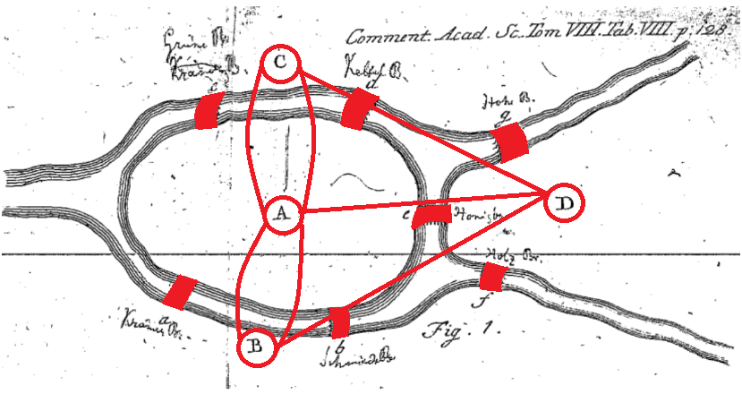
<p class="caption">(\#fig:puentes)Los siete puentes de Königsberg, Euler (1736).</p>
</div>

Pero ¿qué relación tiene un concepto creado en 1736, el de grafo, con algo tan reciente como las redes sociales? Sin ser extremadamente rigurosos, se puede hablar de las redes sociales (RR. SS.) como  las relaciones existentes entre personas, es decir, un hilo invisible que une a las personas que tienen algo en común. En algunos casos es muy evidente porque se crean grupos específicos de personas que comparten una afición y, en otros, es menos evidente porque, por ejemplo, pueden compartir un amigo en común sin saberlo. Estos hilos "invisibles" se unen y forman una red que se puede representar como un grafo, el mismo concepto de grafo que describió Euler y que permite establecer diferentes caminos para unir a las personas que forman la red.


\index{nodo}
\index{arista}
\index{Facebook}
\index{red!social}
\index{grafo}

## Teoría de grafos

Un **grafo**  es un conjunto de **nodos** (vértices) que pueden estar unidos por **aristas** (enlaces). Si se piensa en cada nodo como una persona y en cada arista como la relación que los une, entonces una **red social** puede representarse mediante grafos (véase Fig. \@ref(fig:grafo-comunidades2)).

En el primer ejemplo que se plantea en este capítulo, relativo a una red social, se utiliza el conjunto `datos_facebook` incluido en el paquete `CDR`. Para llevarlo a cabo, primeramente se cargan las librerías y se representan las relaciones entre los miembros que la componen mediante un grafo (Fig. \@ref(fig:grafo)).


```r
library("igraph")
library("CDR")
```


```r
grafo_facebook <- graph.data.frame(datos_facebook, directed = F)
plot(grafo_facebook, vertex.label = NA, vertex.size = 8)
```

<div class="figure" style="text-align: center">
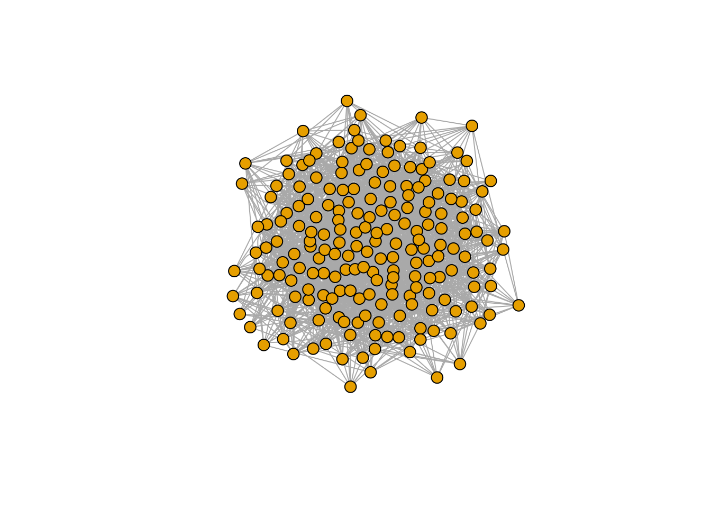
<p class="caption">(\#fig:grafo)Estructura de una red social representada como grafo.</p>
</div>

Formalmente, una red social puede modelizarse con una estructura de red invisible (relación familiar, amistad, trabajo...) que une a distintos actores con intereses o valores comunes, estableciendo una relación personal entre los individuos o grupos de individuos conectados. Existen distintos tipos de grafos dependiendo de las características de la red social representada. Algunos ejemplos son:

- El grafo de amistad (véase Fig. \@ref(fig:grafo-comunidades2)), donde cada nodo representa una persona y una arista conecta dos personas si dentro de la red social son amigos.


```r
amistades <- data.frame(
  persona = c("A", "B", "C", "D", "E"), amigo = c("B", "C", "A", "E", "A")
)
grafo_amistades <- graph_from_data_frame(amistades)
```

- El grafo de comunidades (véase Fig. \@ref(fig:grafo-comunidades2)), donde también cada nodo representa una persona y una arista conecta dos personas si dentro de la red social pertenecen a la misma comunidad, entendiendo por comunidad un grupo de individuos que comparten intereses o características en común.


```r
comunidades <- data.frame(
  persona = c("A", "B", "C", "D", "E"), comunidad = c("1", "2", "1", "2", "1")
)
grafo_comunidades <- graph_from_data_frame(comunidades)
```


```r
par(mfrow = c(1, 2))
plot(grafo_amistades, vertex.label = V(grafo_amistades)$name, main = "Grafo amistades")
plot(grafo_comunidades, vertex.label = V(grafo_comunidades)$name, main = "Grafo comunidades")
```

<div class="figure" style="text-align: center">
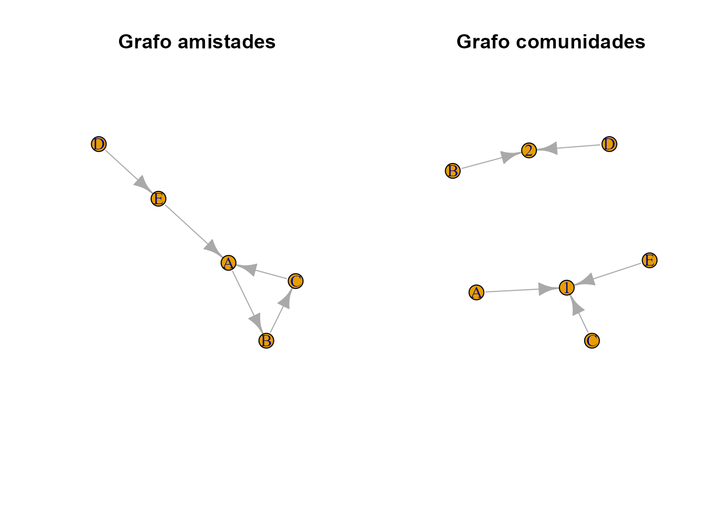
<p class="caption">(\#fig:grafo-comunidades2)Grafo de amistades y comunidades.</p>
</div>


## Elementos de un grafo

El análisis de RR. SS. mediante la teoría de grafos requiere conocer previamente una serie de conceptos básicos [@Perez2021] que se listan y definen a continuación:

-	los **vértices**: representan nodos que se unen mediante aristas. En una red social cada vértice representa una de las personas de dicha red, unidas en ocasiones por intereses comunes a otras;

-	las **aristas**: son las relaciones que unen los nodos. Son **dirigidas** 
(Fig. \@ref(fig:grafo-dirigido-nodirigido-sencillo)) si tienen un sentido definido y **no dirigidas** 
(Fig. \@ref(fig:grafo-dirigido-nodirigido-sencillo)) en caso contrario. 

El siguiente código genera un grafo dirigido:


```r
grafo_dirigido <- graph.data.frame(datos_grafos, directed = T)
```

Para un grafo no dirigido basta con especificar `directed = F`:

```r
grafo_nodirigido <- graph.data.frame(datos_grafos, directed = F)
```

En otras RR. SS., como LinkedIn, las aristas podrían representar la relación que une a las personas. Las personas forman parte de un grupo con intereses comunes, formando un grafo no dirigido. Pero también se puede seguir a alguien sin necesariamente ser seguido; en ese caso las relaciones se pueden representar como un grafo dirigido. 


-	Un **grafo** es un conjunto de vértices y aristas que se puede representar mediante $G = (V, E)$, donde $V$ es el conjunto de nodos o vértices del grafo y $E$ es un conjunto de aristas, arcos o *edges*. En la Fig. \@ref(fig:grafo-dirigido-nodirigido-sencillo) se incluye un grafo "sencillo", representado por el objeto `grafo` (solo se indican las aristas y el software **R** es capaz de interpretar los vértices), sobre el cual se explican a continuación los conceptos de matriz de adyacencia, grado y camino:


```r
grafo <- graph(edges = c(1, 2, 1, 3, 1, 4, 2, 4, 3, 5, 4, 5))
```


```r
par(mfrow = c(1, 3), mai = c(0, 0, 0, 0))
plot(grafo_dirigido, vertex.label = V(grafo_dirigido)$name, main = " ")
plot(grafo_nodirigido, vertex.label = V(grafo_nodirigido)$name, main = " ")
plot(grafo, main = " ")
```

<div class="figure" style="text-align: center">
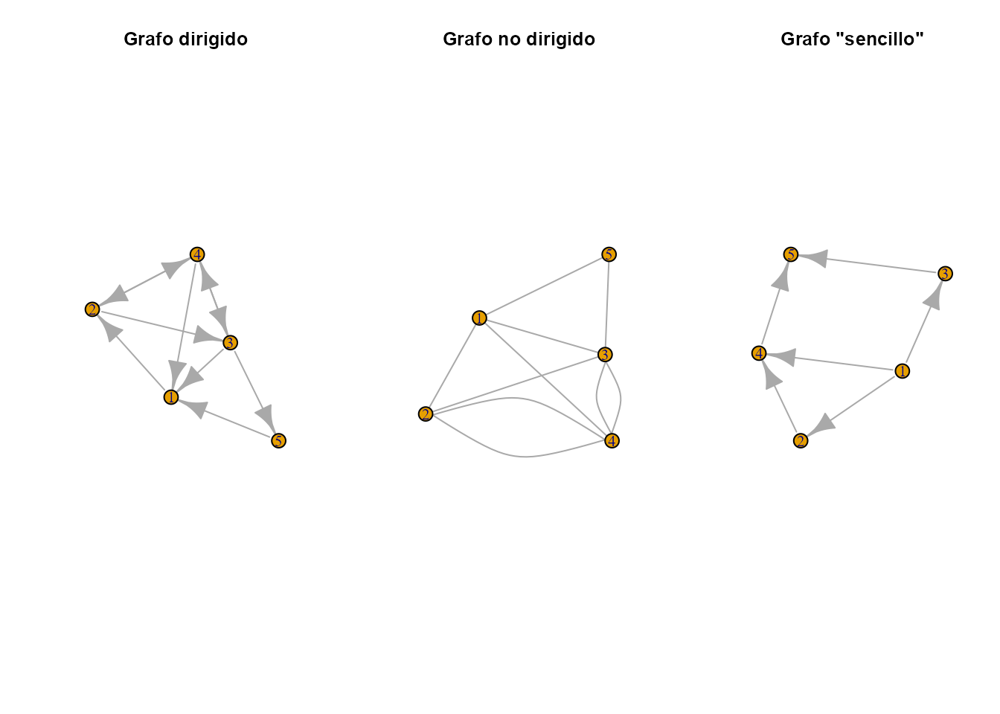
<p class="caption">(\#fig:grafo-dirigido-nodirigido-sencillo)De izquierda a derecha: grafo dirigido, grafo no dirigido y grafo sencillo.</p>
</div>

\index{matriz! de adyacencia}

-	La información recogida en un grafo también se puede expresar mediante números, organizados en una matriz denominada **matriz de adyacencia**, ${\bf A}_{n\times n}$ (donde $n$ es el número de nodos), lo que facilita los cálculos computacionales en grandes redes. Cada entrada de la matriz, $a_{ij}$, indica el número de aristas que salen del $i$-ésimo vértice y llegan al $j$-ésimo; cada fila de la matriz indica el número de aristas que salen del vértice $i$-ésimo con destino a cada uno de los otros  vértices. En los grafos no dirigidos ${\bf A}_{n \times n}$ es simétrica, ya que si el vértice o nodo $1$ conecta con el $2$, entonces el $2$ también conecta con el $1$. En los grafos dirigidos, donde cada arista tiene una orientación, esto no tiene por qué ocurrir: el vértice o nodo $1$ puede conectar con el $2$, pero no al revés. En este tipo de grafos la matriz de adyacencia no es simétrica. A continuación se obtiene la matriz de adyacencia del objeto `grafo`:


```r
matriz_adyacencia <- get.adjacency(grafo, sparse = FALSE)
matriz_adyacencia
#>      [,1] [,2] [,3] [,4] [,5]
#> [1,]    0    1    1    1    0
#> [2,]    0    0    0    1    0
#> [3,]    0    0    0    0    1
#> [4,]    0    0    0    0    1
#> [5,]    0    0    0    0    0
```


\index{grado}

-	El **grado** o **valencia** de un nodo *x* en un grafo es el número de aristas que concurren en él (que "entran a" o "salen de" dicho nodo), y se representa mediante $grado(x)$, $g(x)$ o $gr(x)$, siendo un vértice de grado 0 un vértice aislado. En un grafo $G$, el grado máximo ($\Delta (G)$) es el valor más grande entre los grados de los nodos, mientras que el grado mínimo ($\delta (G)$) es el valor más pequeño. El grado de un grafo $g(G)$ es la suma de los grados de los vértices, lo que mide la cantidad de conexiones en el grafo. En redes sociales, el grado representa el número de relaciones.

La función ` degree()` proporciona un vector que contiene los grados de cada vértice en el grafo, ayudando a analizar la estructura y la importancia de los nodos en la red. A continuación se muestra el grado de cada uno de los 5 vértices anteriores, así como el grado del grafo (mediante la función `sum()`) y los grados máximo y mínimo mediante las funciones `max()` y `min()`:


```r
grado_nodos <- degree(grafo)
grado_nodos
#> [1] 3 2 2 3 2
sum(grado_nodos)
#> [1] 12
max(grado_nodos)
#> [1] 3
min(grado_nodos)
#> [1] 2
```

\index{camino}

-	Un **camino** es un conjunto de aristas no recursivas. La longitud de un camino es su número de aristas. Entre dos vértices puede haber más de dos caminos y se puede incluir el mismo vértice en el camino más de una vez. Evidentemente, siempre habrá un **camino más corto**, que será aquel que menos aristas ha recorrido. Si entre todos los pares de vértices existe un camino, entonces el grafo se denomina **conexo**. El siguiente código muestra el camino más corto entre los vértices 2 y 5 del objeto `grafo` utilizado de ejemplo.


```r
# Camino más corto entre el nodo 2 y el 5
caminos <- get.shortest.paths(grafo, from = "2", to = "5")
V(grafo)[caminos$vpath[[1]]]
#> + 3/5 vertices, from 81b7f87:
#> [1] 2 4 5
```


## Procedimiento con **R**: el paquete `igraph`

Existen diversos paquetes en **R** para representar grafos, pero el más utilizado y popularizado, por su sencillez y eficacia, es `igraph` [@igraph]. Se trata de un paquete que permite crear y manipular grafos para analizar redes en **R** de forma muy sencilla (Fig. \@ref(fig:grafobasico)). A continuación se muestra un sencillo ejemplo sobre cómo crear un grafo dirigido a partir de un *dataframe*  usando la función `graph_from_data_frame()` con los siguientes argumentos:

- **`edges`**: *dataframe* en el que las dos primeras columnas representan una lista o conjunto de aristas.

- **`directed`**: un valor lógico que indica si es un grafo dirigido o no dirigido.

- **`vertices`**: un *dataframe* con los valores de los vértices o NULL.


```r
nodes <- data.frame("nodos" = c("A", "B", "C", "D", "E"))
edges <- data.frame(
  "from" = c("A", "C", "B", "A", "A", "A"),
  "to" = c("B", "D", "C", "C", "D", "E")
)
red <- graph_from_data_frame(edges, directed = TRUE, vertices = nodes)
plot(red, vertex.size = 50)
```

<div class="figure" style="text-align: center">
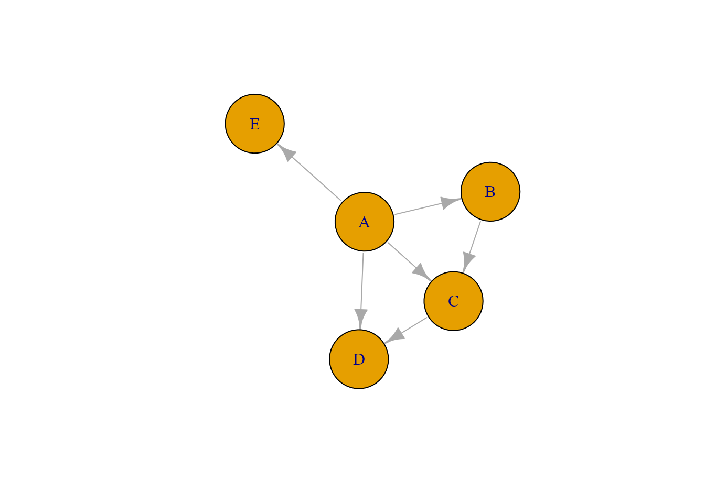
<p class="caption">(\#fig:grafobasico)Ejemplo de grafo con $igraph$.</p>
</div>


A continuación se muestra otro ejemplo con las relaciones entre los actores de dos películas.
`nodes` contiene el nombre de cada actor y su descripción, es decir, si se trata de un actor o una actriz (es imprescindible que los nombres que más adelante se introducen en `edges` existan en `nodes`). Sin embargo, no es obligatorio declarar los nodos, ya que pueden ser extraídos de las relaciones.
`edges` contiene la relaciones, `from` y `to`, además de la película donde coinciden. No obstante,  este último dato es meramente descriptivo y no resulta necesario.


```r
nodes <- data.frame("actores" = c("Jim Carrey", "Arnold Schwarzenegger", "George Clooney", "Cameron Díaz"), 
                    "descripcion" = c("actor", "actor", "actor", "actriz")
)

edges <- data.frame(
  "from" = c("Jim Carrey", "Jim Carrey", "George Clooney", "Jim Carrey"),
  "to" = c("Arnold Schwarzenegger", "George Clooney", "Arnold Schwarzenegger", "Cameron Díaz"), 
  "pelicula" = c("Batman y Robin", "Batman y Robin", "Batman y Robin", "La mascara")
)

red <- graph_from_data_frame(edges, directed = F, vertices = nodes)
plot(red, vertex.size = 50)
```

<div class="figure" style="text-align: center">
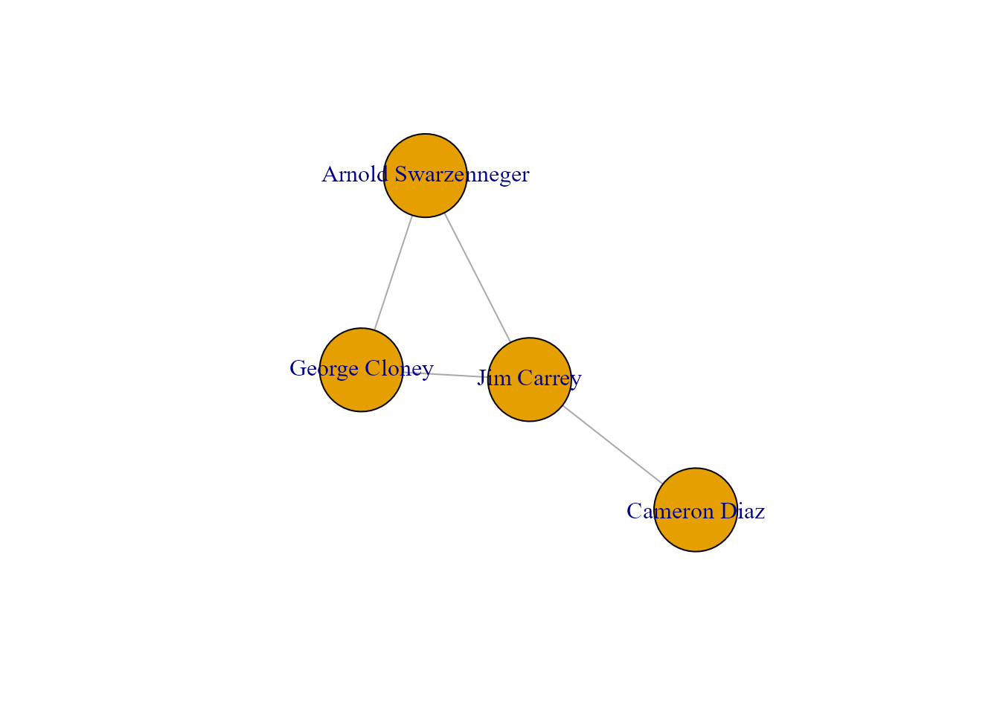
<p class="caption">(\#fig:grafoactores)Grafo representativo de la relación de actores respecto a películas.</p>
</div>

En la Fig. \@ref(fig:grafoactores) se puede observar que el actor Jim Carrey tuvo relación con todos los actores de la red propuesta, mientras que la actriz Cameron Díaz solo participó con uno de ellos (el propio Jim Carrey).


## Análisis de influencia en un grafo aplicado a RR. SS.

Existen paquetes para obtener información de distintas RR. SS.; por ejemplo, en **R** se puede utilizar el paquete `Rfacebook` para conectarse a Facebook y obtener información de los contactos existentes. Para ello, es necesario activar la API, Interfaz de Programación de Aplicaciones, desde **https://developers.facebook.com**. La información necesaria se puede encontrar en su página web **https://developers.facebook.com/docs**. Para ilustrar un ejemplo didáctico, sin que el lector necesite conocimientos de desarrollo para descargar los datos, se ha simulado la relación entre amigos de una red social, como podría ser Facebook, en el conjunto de datos `datos_facebook` contenido en el paquete `CDR` del libro.

En esta ocasión se utiliza la función `graph.data.frame()` del paquete `igraph` para crear un objeto de tipo grafo, dirigido en este caso, a partir de un *dataframe* en **R**. Seguidamente, mediante `plot()`, se muestra el grafo al mismo tiempo que se establecen sus propiedades (véase Fig. \@ref(fig:grafofacebook1)).


```r
datos_faceboook <- graph.data.frame(datos_facebook, directed = F)
# datos_faceboook # descomentar para ver las relaciones
```


```r
grafo_facebook <- graph.data.frame(datos_facebook, directed = T)
plot.igraph(grafo_facebook,
  layout = layout.fruchterman.reingold,
  vertex.label = NA, vertex.label.cex = 1, vertex.size = 3, edge.curved = TRUE
)
```

<div class="figure" style="text-align: center">
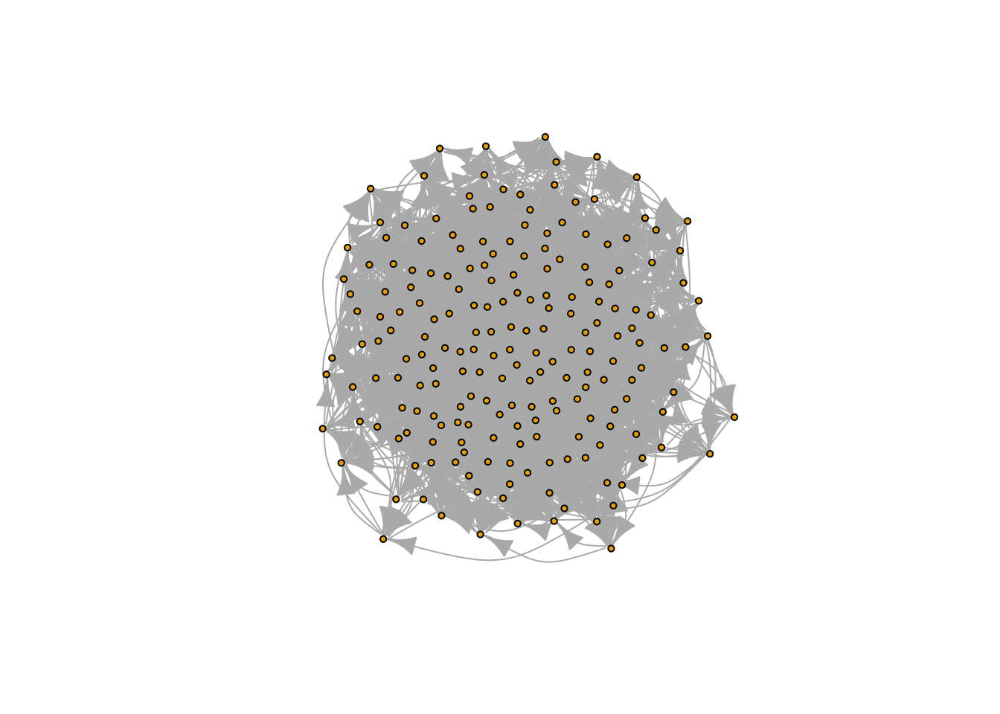
<p class="caption">(\#fig:grafofacebook1)Representación de un grafo con RR. SS.</p>
</div>

::: {.infobox data-latex=""}
**Nota**

Obsérvese cómo varía la estructura de los datos de entrada para construir un grafo.
:::

Siguiendo con el ejemplo, a continuación se analizan las relaciones de la red social. Como se avanzó anteriormente, el número de aristas que entran o salen de cada vértice indica el número de personas con las que se relaciona el individuo representado por dicho vértice. En la salida de debajo se muestra cuántos vértices (segunda línea) tiene cada grado específico (primera línea):


```r
table(degree(grafo_facebook))
#> 
#>  9 10 11 12 13 14 15 16 17 18 19 20 21 22 23 24 25 26 27 28 29 30 31 
#>  1  2  4  4  7  4  8 14 19 15 14 19 22 15 11 13  9  5  3  3  4  1  4
```


Ahora se procede a personalizar los nodos. Las RR. SS. son enormes y, por tanto, es útil centrarse en una subred para estudios concretos. A modo de ejemplo, para focalizar este caso de estudio, se tendrán en cuenta únicamente aquellos vértices o nodos cuyo grado sea igual o superior a 26, asignándoles su nombre.


```r
bad_network <- V(grafo_facebook)[degree(grafo_facebook) <= 26]
grafo_facebook <- delete.vertices(grafo_facebook, bad_network)
V(grafo_facebook)$name <- c(
  "Gema", "Patricia", "Ramon", "José", "Maria", "Ángeles",
  "Gabriel", "Javier", "Victor", "Leonor", "Ana", "Isabel", "Cristóbal", "Rosa", "Aurora"
)
plot(grafo_facebook, vertex.size = 20)
```

<div class="figure" style="text-align: center">
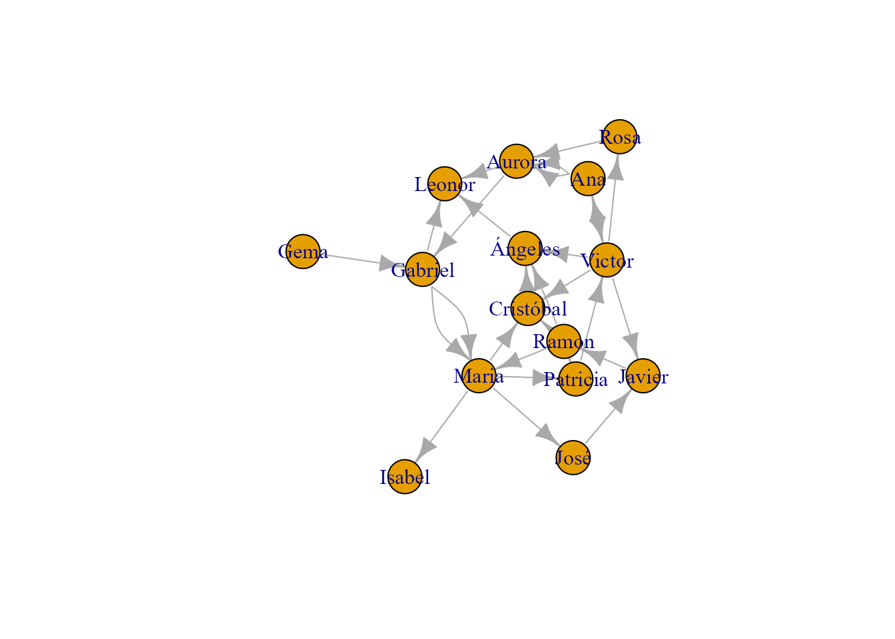
<p class="caption">(\#fig:grafofacebook3)Subgrafo en RR. SS.</p>
</div>

En la Fig. \@ref(fig:grafofacebook3) se pueden ver las relaciones entre las personas incluidas en el grafo (a quién siguen y por quiénes son seguidas). Por ejemplo, a Gema no la sigue nadie. Leonor, otro caso extremo igual que Gema, es seguida por Aurora, Ángeles y Gabriel, pero ella no sigue a nadie.


### Centralidad
\index{centralidad}

En teoría de grafos y análisis de RR. SS., el concepto de **centralidad** se refiere a la importancia o prominencia de los vértices o nodos en un determinado grafo o red social. En el caso de una red social de amigos, como Facebook, la centralidad de un nodo (persona) representa el número de amigos que tiene.

Un grafo no tiene una centralidad real porque no tiene coordenadas [@Easly2010], pero existen distintas medidas de centralidad que, en una red/grafo social, permiten identificar el *networking* social de cada individuo, es decir, su influencia.


Son innumerables las medidas de **centralidad** (generalmente normalizadas o estandarizadas) que pueden encontrarse en la literatura sobre la cuestión para determinar y comparar, de forma cuantitativa, la importancia relativa de un nodo en el conjunto de la red.

La **centralidad** no es un atributo intrínseco de los nodos, sino un atributo estructural: un valor que depende de las relaciones de dicho nodo con los demás de la red. Generalmente, el nodo central suele tener la mayor centralidad, mientras que la mínima suele corresponder a los nodos periféricos.

En los grafos dirigidos, cuantas más aristas reciba un nodo (persona en el caso de una RR. SS.) más nodos (personas) están intentando interactuar con él y más importancia tendrá en el grafo (más "prestigio" tendrá la persona en la red). Pero si la conexión de un nodo con otro  (la influencia de una persona sobre otra en una RR. SS.) no es directa, sino que tiene lugar a través de un camino más largo (pasando por más nodos), entonces  quiere decir que su influencia es mayor, ya que, en el caso de la RR. SS. más personas han recibido esa influencia, unas directamente y otras de forma indirecta.

En la literatura existen diversas medidas de la centralidad [@Stanley1995]. Entre ellas, a continuación se definen la centralidad de grado, la centralidad de intermediación (o simplemente centralidad) y la centralidad de vector propio.

- La **centralidad de grado** (en inglés, *degree centrality*) fue la primera de las medidas de centralidad y también es la más sencilla. Más concretamente, la centralidad del $i$-ésimo nodo es su grado, es decir, el número de aristas que posee un nodo con los demás:

$$ C_{D}^{(i)}=\sum _{j \neq i} a_{ij},$$
donde $a_{ij}$ es el $j$-ésimo elemento de la $i$-ésima fila de la matriz de adyacencia.

Para normalizar la centralidad de grado, lo normal es dividirla por el número total de nodos de la red. En el caso de grafos simples (sin bucles), basta con dividir por el número total de nodos menos 1. Cuando el grado máximo de un grafo sea demasiado bajo, también se podría dividir por dicho grado máximo. Por tanto, se consideran aceptables las siguientes medidas de centralidad de grado normalizadas:
$$C_{Dnorm}^{(i)}=\frac {C_{D}^{(i)}}{n}, \hspace{0,5cm} C_{Dnorm}^{(i)}=\frac {C_{D}^{(i)}}{n-1},
\hspace{0,5cm} C_{Dnorm}^{(i)}=\frac {C_{D}^{(i)}} {\max_{i \in V} C_{D}^{(i)}}.$$


- La **centralidad de intermediación** (*betweenness*) del $i$-ésimo nodo  es la proporción que el número de caminos entre cualesquiera otros dos nodos ($j$ y $k$) cuya conexión pasa por el nodo $i$ supone respecto del número de caminos mínimos (más cortos) desde el nodo $j$ hasta el nodo $k$. Por lo tanto, en el caso de una RR. SS., una persona tendrá mayor influencia cuanto mayor centralidad de información tenga porque comunicará mucha información a través de los nodos de la red (supuesto que la transferencia de la información a través de la red siempre se lleve a cabo a través de los caminos más cortos).


Formalmente, la centralidad de intermediación del $i$-ésimo nodo se define como sigue:

$$C_B^{(i)}=\sum_{i \neq k \in V} \frac {B_{jk}^{(i)}}{B_{jk}},$$

donde $B_{jk}^{(i)}$ es el número de caminos más cortos desde $j$ hasta $k$ que pasan por el nodo
$i$  y $B_{jk}$ el número de caminos más cortos desde el nodo $j$ hasta el nodo $k$.

La centralidad de intermediación normalizada (para que sus valores estén siempre entre 0 y 1) se obtiene dividiendo la centralidad de intermediación por el mayor número posible de pares de nodos, excluyendo el nodo en el que se está midiendo el grado de centralidad.[^Note-grafos-1]

[^Note-grafos-1]: En caso de que el gráfico tenga bucles, estos no se consideran.

En caso de grafos no dirigidos:
$$C_{B(norm)}^{(i)}=\frac {C_B^{(i)}}{ \frac {(n-1)(n-2)}{2}}. $$

En caso de grafos dirigidos:

$$C_{B(norm)}^{(i)}=\frac {C_B^{(i)}}{ (n-1)(n-2)}. $$

El siguiente código muestra la centralidad de intermediación normalizada correspondiente a los nodos del ejemplo de Facebook (para obtenerla sin normalizar, hay que especificar `normalized = FALSE` al llamar a la función `betweenness()`):


```r
betweenness_centrality <- betweenness(grafo_facebook)
betweenness_centrality
#>      Gema  Patricia     Ramon      José     Maria   Ángeles   Gabriel    Javier 
#>  0.000000 33.500000 30.200000 10.500000 53.300000  7.000000 37.800000 27.200000 
#>    Victor    Leonor       Ana    Isabel Cristóbal      Rosa    Aurora 
#> 42.700000  0.000000  9.333333  0.000000  6.000000  4.666667 23.800000
```


Como puede apreciarse, María es el nodo con mayor centralidad, es decir, es la persona con mayor influencia en la transferencia de información entre los nodos a través de la red, bajo el supuesto de que cada nodo transfiere la información siguiendo los caminos más cortos.


- La **centralidad de vector propio** (*eigencentrality*), $C_E^{(i)}$. Es una medida de centralidad recursiva que se basa en la centralidad de los nodos con los que se relaciona. En concreto, la centralidad de valor propio es proporcional a la suma de las centralidades de sus nodos vecinos. A modo de ejemplo, un relaciones públicas de una discoteca puede conocer a mucha gente mientras que un político puede conocer a menos gente; sin embargo, la gente que conoce el relaciones públicas de la discoteca es gente normal, sin grandes influencias en otra gente, mientas que las personas que conoce el político son personas altamente influyentes. Por ello, el político está mejor posicionado en términos de influencia que el relaciones públicas de la discoteca, aunque conozca a menos gente.

En términos matemáticos, la expresión de la centralidad de vector propio del $i$-ésimo nodo es:
$C_E^{(i)} = \lambda \sum_{j} a_{ij}C_E^{(j)}$, donde $\lambda$ es la constante de proporcionalidad, $a_{ij}$ es el valor de la fila $i$  y la columna $j$ de la matriz de adyacencia **A** y $C_E^{(j)}$ es la centralidad de valor propio de los nodos con los que se relaciona el nodo $i$. La denominación de "centralidad de vector propio" se debe a que el vector de dicha centralidad corresponde al vector propio de $\bf A$ asociado al mayor valor propio de la matriz, $\lambda$.


El siguiente código muestra la centralidad mediante vector propio correspondiente a los nodos del ejemplo actual:

```r
eigencentrality <- eigen_centrality(grafo_facebook)$vector
eigencentrality
#>      Gema  Patricia     Ramon      José     Maria   Ángeles   Gabriel    Javier 
#> 0.1618269 0.6090993 0.7768737 0.3148866 0.9257523 0.6787138 0.7180398 0.4714266 
#>    Victor    Leonor       Ana    Isabel Cristóbal      Rosa    Aurora 
#> 1.0000000 0.4725741 0.7663131 0.2086397 0.7620632 0.3831565 0.7000984
```

Como puede apreciarse, la mayor centralidad de autovalor corresponde al nodo Víctor. Este nodo es, por tanto, central en términos de conexión con otros nodos importantes de la red, identificándose como el nodo líder o de mayor influencia de la red.


### Detección de comunidades

\index{comunidades}

En el análisis de una RR. SS. es importante detectar las distintas comunidades que la componen, entendiendo por comunidad un grupo de personas afines. La detección de dichas comunidades permite estudiar los distintos grupos que conforman la RR. SS. en función de sus relaciones y afinidad [@Missaouri2015].

En principio, podría identificarse la detección de comunidades con la agrupación o clusterización. Aunque esta última podría aplicarse a grafos/RR. SS., en la agrupación en clústeres los elementos con atributos similares se agrupan en el mismo clúster, mientras que la detección de comunidades está especialmente diseñada para analizar redes en función de un único tipo de atributo: los bordes. Además, los algoritmos de agrupación tienden a separar nodos periféricos individuales de las comunidades a las que deberían pertenecer, cosa que no ocurre con las técnicas de detección de comunidades.


Existen diversos algoritmos en **R** para detectar comunidades [@borgatti2022analyzing], pero ninguno ha demostrado que pueda actuar a la perfección con todos los grafos debido a la gran tipología existente. En el ejemplo anterior se detectan las siguientes comunidades:

- Detección de comunidades mediante **centralidad de intermediación**:


```r
communities <- edge.betweenness.community(grafo_facebook)
#head(communities, 10) # descomentar para ver las comunidades
```


- Detección de comunidades mediante **centralidad de vector propio** (*eigencentality*):


```r
communities <- leading.eigenvector.community(grafo_facebook)
#head(communities, 10) # descomentar para ver las comunidades
```

- Detección de comunidades mediante Walktrap: este procedimiento no está basado en una medida de centralidad,  sino en la idea de que la distancia entre vértices se mide a través de caminatas aleatorias en la red. Específicamente, la idea básica del algoritmo `walktrap` es que los recorridos aleatorios en un gráfico/red tienden a quedar atrapados en partes densamente conectadas que se identifican con comunidades. `Walktrap` utiliza el resultado de caminatas aleatorias para fusionar comunidades de forma aglomerativa. La calidad de las agrupaciones se puede evaluar utilizando cualquier criterio de calidad disponible, si bien el de modularidad es el más popular.

A continuación se presenta el código del algoritmo `walktrap` para detectar dos comunidades:


```r
communities <- walktrap.community(grafo_facebook)
#head(communities, 10) # descomentar para ver las comunidades
```

Otro método de detección de comunidades que merece la pena mencionar es el **método de detección de comunidades de Louvain**, que es el algoritmo más popular por su fácil interpretación, flexibilidad, alta calidad de las comunidades y eficiencia en tiempo de ejecución. Se basa en la modularidad, que trata de maximizar la diferencia entre el número real y el número esperado de aristas en una comunidad. Sin embargo, la optimización de la modularidad en una red es *NP-difícil* (acrónimo del término de teoría de la computación *nondeterministic polynomial time-hard*) y, por lo tanto, tiene que usar heurística.

El algoritmo de Louvain se divide en dos fases que se repiten iterativamente: $(i)$ movimiento local de nodos y $(ii)$ agregación de la red. El algoritmo comienza con una red ponderada de *n* nodos. En la primera fase, el algoritmo asigna una comunidad diferente a cada nodo de la red. Luego, para cada nodo, considera los vecinos y evalúa la ganancia de modularidad eliminando dicho nodo particular de la comunidad a la que pertenece y colocándolo en la comunidad vecina donde la ganancia (positiva) se hace máxima. El nodo permanecerá en la misma comunidad si no hay ganancia positiva. Este proceso se aplica repetidamente y para todos los nodos hasta que no haya más ganancias. Esta primera fase del algoritmo se detiene cuando se obtiene un máximo local de modularidad. En la segunda fase, el algoritmo construye una nueva red considerando como nodos las comunidades encontradas en la primera fase. Una vez completada la segunda fase, el algoritmo vuelve a aplicar la primera fase a la red resultante. Estos pasos se repiten hasta que no haya cambios en la red y se obtenga la máxima modularidad.

Una ventaja del algoritmo es que descubre comunidades de comunidades durante el proceso. Una limitación importante es que tiene tendencia a descubrir comunidades que están internamente desconectadas (mal conectadas) ya que al mover un nodo que ha actuado como un puente entre dos componentes en una comunidad a una nueva comunidad puede desconectar la comunidad anterior. Otra limitación, esta vez desde la perspectiva computacional, es el uso del almacenamiento de la red en la memoria principal.


### Representación con grafos

Una vez detectadas las comunidades, se procede a su representación final mediante grafos.


- El grafo de tipo centralidad de vector propio (*eigencentrality*)\index{grafo!eigenvector@\textit{eigenvector}} muestra la existencia de tres comunidades. Según este método, no es tan importante tener muchos amigos, sino que lo importante es que tus amigos sean muy influyentes (véase Fig. \@ref(fig:grafo-Betweenness-Walktrap)).


```r
eigen_grafo <- leading.eigenvector.community(grafo_facebook)
```


\index{grafo!betweenness@\textit{betweenness}}

- El grafo de tipo centralidad de intermediación (*betweenness*), respresentado en la Fig. \@ref(fig:grafo-Betweenness-Walktrap) muestra siete comunidades.


```r
betweenness_grafo <- edge.betweenness.community(grafo_facebook)
```

\index{grafo!walktrap@\textit{walktrap}}

- En el grafo de tipo *walktrap* se pueden observar dos comunidades (véase Fig. \@ref(fig:grafo-Betweenness-Walktrap)).


```r
Walktrap_grafo <- walktrap.community(grafo_facebook, steps = 5, modularity = TRUE)
# Debe indicarse el largo de la caminata aleatoria, se recomienda usar 5 caminatas.
```


```r
par(mfrow = c(1, 3), mai = c(0, 0, 0, 0))
plot(eigen_grafo, grafo_facebook, edge.arrow.size = 0.25, vertex.size = 50,  main = " " )
plot(betweenness_grafo, grafo_facebook, edge.arrow.size = 0.25, vertex.size = 50, main = " ")
plot(Walktrap_grafo, grafo_facebook, edge.arrow.size = 0.25, vertex.label = (grafo_facebook)$name, vertex.size = 50, main = " "
)
```

<div class="figure" style="text-align: center">
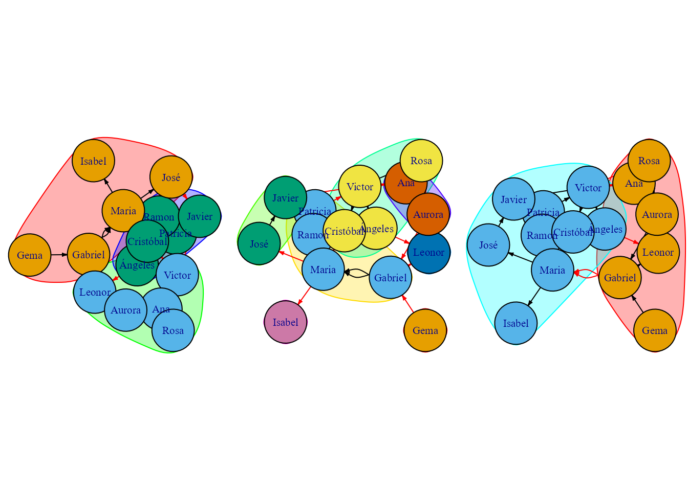
<p class="caption">(\#fig:grafo-Betweenness-Walktrap)De izquierda a derecha: grafo $eigencentrality$, grafo $betweenness$ y grafo $Walktrap$.</p>
</div>


## Entorno social en el universo cinematográfico de Marvel

\index{Marvel}

En esta sección se analiza el Universo Cinematográfico de Marvel[^Note-grafos-2] como una RR. SS. donde cada héroe tiene un grado de relación con otro. Para ello, se utiliza el conjunto de datos `marvel_edges` del paquete `CDR`, que contiene dos columnas formateadas para representar la RR. SS. de Marvel, donde la primera columna es el nombre de un personaje del universo cinematográfico de Marvel y la segunda, el nombre de otro personaje con el que coincide en alguna película (la relación viene representada por una arista que une los dos nodos). Con estos datos se genera el grafo correspondiente a la RR. SS. de Marvel, en la cual cada héroe es un nodo y las relaciones son las coincidencias de dichos héroes en la misma película. Con el código que se expone a continuación se carga el fichero y se crea el `grafo_marvel`.

[^Note-grafos-2]: El Universo Cinematográfico de Marvel comprende todas las series, películas, cortometrajes y demás productos audiovisuales creados por Marvel Studios y basados en los personajes y aventuras de los cómics de Marvel.


```r
grafo_marvel <- graph.data.frame(marvel_edges, directed = F)
plot(grafo_marvel)
```

<div class="figure" style="text-align: center">
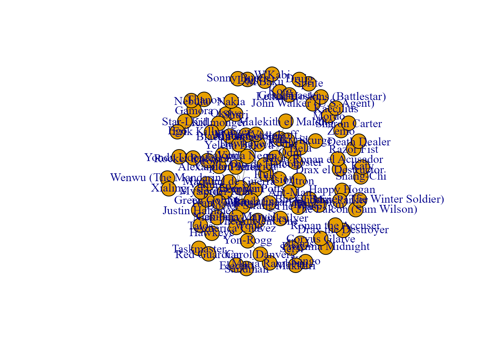
<p class="caption">(\#fig:marvel1)Grafo original sobre el Universo Cinematográfico de Marvel.</p>
</div>

Como puede apreciarse en la Fig. \@ref(fig:marvel1), son muchos los héroes y muchas las relaciones entre ellos, por lo que, a continuación, se seleccionan solo aquellos héroes que tienen dos o más relaciones. De esta forma se obtiene un grafo más agradable a la vista y más interpretable (véase panel izquierdo de la Fig. \@ref(fig:grafo-relaciones-comunidades), que se acompaña de un gráfico de comunidades en el panel derecho).


```r
nodos_poca_realacion <- which(degree(grafo_marvel) < 2)
grafo <- delete.vertices(grafo_marvel, nodos_poca_realacion)
```

En el panel izquierdo de la Fig. \@ref(fig:grafo-relaciones-comunidades) se presenta el número de relaciones que tiene cada nodo (cada héroe) mediante la centralidad de grado.  Se puede apreciar que Iron Man y Capitán América son quienes mayor número de relaciones tienen y, por lo tanto, quienes gozan de más popularidad e influencia.

```r
grado_nodos <- degree(grafo)
# sort(grado_nodos) # descomentar para ver la centralidad de grado de los héroes.
```

En el panel derecho pueden verse las comunidades formadas, cada una de ellas identificada con un color distinto. Para formar las comunidades se ha utilizado el algoritmo Louvain. El resultado se muestra en la Fig. \@ref(fig:grafo-relaciones-comunidades).

```r
comunidades <- cluster_louvain(grafo)
```


```r
par(mfrow = c(1, 2))
plot(grafo, vertex.label = V(grafo)$name, main = "Relaciones de héroes")
plot(grafo, vertex.color = comunidades$membership, vertex.label = V(grafo)$name, main = "Comunidades de héroes")
```

<div class="figure" style="text-align: center">
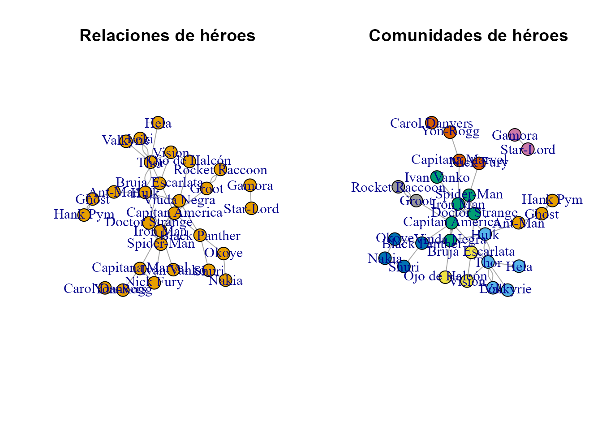
<p class="caption">(\#fig:grafo-relaciones-comunidades)Grafo de relaciones y comunidades de héroes.</p>
</div>


En la Fig. \@ref(fig:marvel5) se puede apreciar que la comunidad 3 es la que tiene más miembros y, por lo tanto, la más popular y la que más personas incluye con intereses comunes.
<div class="figure" style="text-align: center">
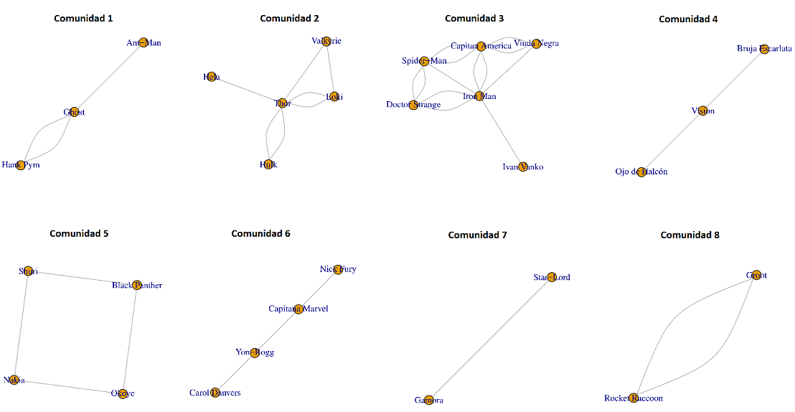
<p class="caption">(\#fig:marvel5)Comunidades.</p>
</div>


```r
comunidades <- cluster_louvain(grafo)
num_comunidades <- length(unique(comunidades$membership))

for (i in 1:num_comunidades) {
  nodos_comunidad <- which(comunidades$membership == i)
  subgrafo <- induced_subgraph(grafo, nodos_comunidad)
}
```


Para profundizar en el análisis de la Comunidad 3, se genera un subgrafo con diferentes colores y tamaños, que permite una mejor visualización e interpretación de lo que pasa en la comunidad (Fig. \@ref(fig:grafo-relaciones)). Para visualizarlo se utiliza la función `igraph::induced_subgraph()`.

```r
comunidades <- cluster_louvain(grafo)
tamanos_comunidades <- table(comunidades$membership)
indice_comunidad_max <- which.max(tamanos_comunidades)
nodos_comunidad_max <- which(comunidades$membership == indice_comunidad_max)

subgrafo <- induced_subgraph(grafo, nodos_comunidad_max)
```

La Fig. \@ref(fig:grafo-color) muestra el tamaño de los héroes según el número de relaciones y utiliza un color distinto por cada héroe, lo que hace que el gráfico final sea más llamativo y fácil de interpretar.

```r
# Calcular el grado de cada nodo
grados <- degree(subgrafo)

# Ajustar el tamaño de los nodos proporcionalmente a su grado
tamaños <- 80 * grados / max(grados)

# Generar un vector de colores aleatorios
set.seed(1)
colores <- sample(colors(), vcount(subgrafo), replace = TRUE)
```


```r
plot(subgrafo, vertex.label.cex= 1.7)
```

<div class="figure" style="text-align: center">
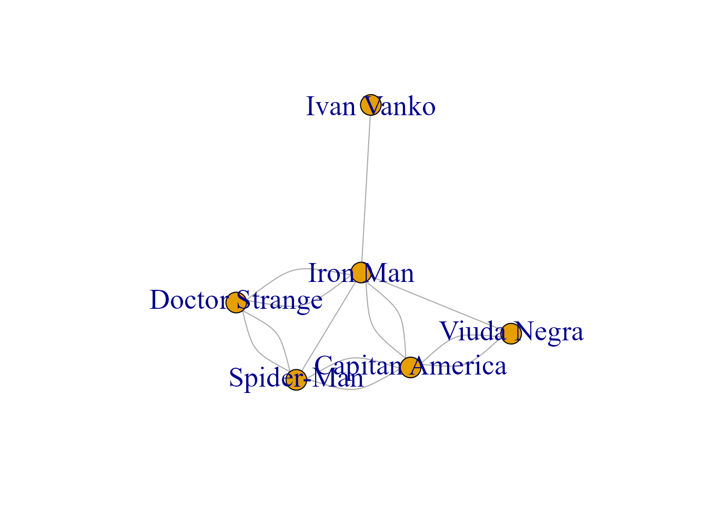
<p class="caption">(\#fig:grafo-relaciones)Grafo estándar con más relaciones.</p>
</div>


```r
set.seed(2)
plot(subgrafo, vertex.color = colores, vertex.size = tamaños, vertex.label.cex= 1.7)
```

<div class="figure" style="text-align: center">
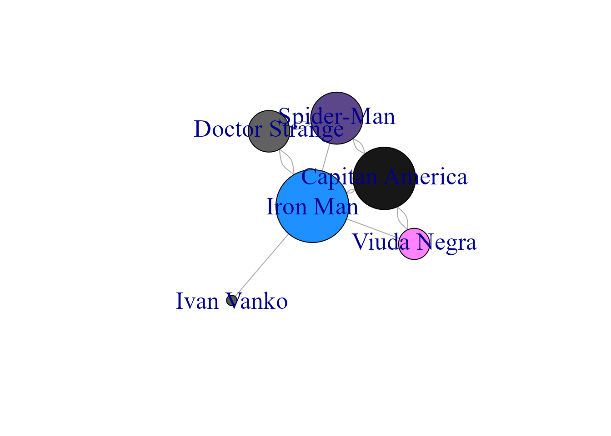
<p class="caption">(\#fig:grafo-color)Grafo adaptado con color y tamaño.</p>
</div>

Las comunidades pueden ser representadas por otros algoritmos. A continuación, se representan las formadas con los algoritmos ya comentados: `Betweenness`, de utilidad cuando los nodos que conectan distintas comunidades son los más importantes y se quiere asegurar que se incorporen en una comunidad y el `Walktrap`, que detecta eficazmente comunidades de tamaños similares (Fig. \@ref(fig:marvel11)).


```r
# edge_betweenness
comunidades <- cluster_edge_betweenness(grafo)
# walktrap
comunidades <- cluster_walktrap(grafo)
```

<div class="figure" style="text-align: center">
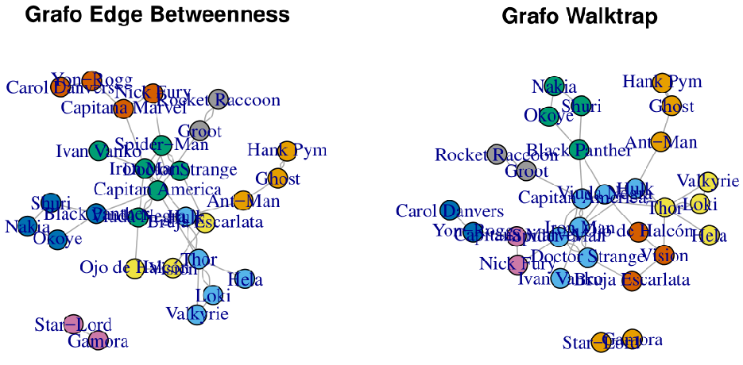
<p class="caption">(\#fig:marvel11)Grafo de comunidades: algoritmos $betweeness$ y $Walktrap$.</p>
</div>


::: {.infobox_resume data-latex=""}
### Resumen {-}

Este capítulo ha introducido la teoría de grafos y su relación con las RR. SS., destacando:

- Los conceptos elementales de la teoría de grafos: vértice, arista, grafo dirigido y no dirigido, grado y camino, entre otros.

- El procedimiento con **R** para el análisis de grafos a través del paquete `igraph`, mostrando la estructura necesaria para componer un grafo.

- El análisis de influencia en un grafo aplicado a RR. SS., introduciendo los conceptos de centralidad y comunidad.

- El análisis del entorno social de los personajes del Universo Cinematográfico de Marvel, aplicando los conocimientos teóricos presentados a lo largo del capítulo.
:::
