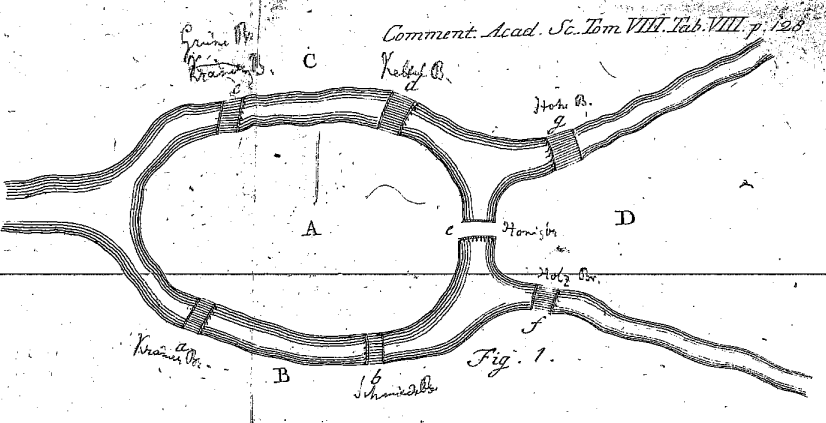
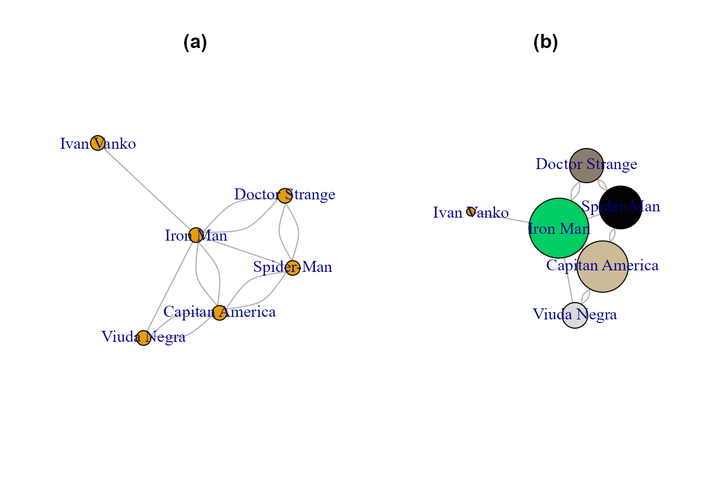
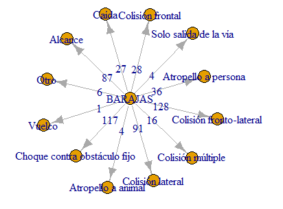
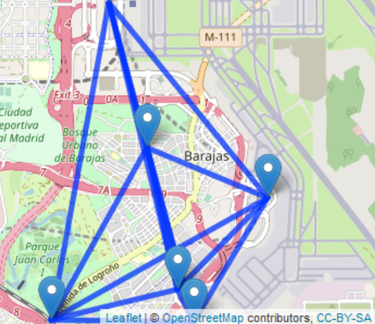

# Análisis de grafos y redes sociales {#grafos}

*José J. Galán*

Universidad Complutense de Madrid

\index{grafo}
\index{siete puentes de Königsberg}

## Introducción

El origen de la teoría de grafos se debe al problema de los siete puentes de Königsberg [@Euler1736], que es considerado el primer artículo sobre teoría de grafos. El problema se centra en la ciudad Königsberg en Prusia, ahora Kaliningrado (Rusia), donde existen varios puentes y el problema plantea trazar una ruta que cruce todos los puentes una única vez (ver Fig. \ref{fig:puentes}). Euler mediante el uso de grafos demostró que no era posible.

<div class="figure" style="text-align: center">

<p class="caption">(\#fig:puentes)Siete puentes de Königsberg, Euler (1736).</p>
</div>

Pero, ¿qué relación tiene un concepto creado en 1736, el de grafo, con algo tan reciente como las redes sociales?. Informalmente se puede hablar de las redes sociales (RRSS) como las relaciones existentes entre personas, un hilo invisible que une a las personas en relación con algo que tienen en común. En algunos casos es muy evidente porque se crean grupos específicos de personas que comparten una afición y en otros casos es menos evidente porque, por ejemplo, pueden compartir un amigo en común sin saberlo. Estos hilos "invisibles" se unen y forman una red que se puede representar como un grafo, el mismo concepto de grafo que describió Euler, y que permite establecer diferentes caminos para unir a las personas que forman la red.


\index{nodo}
\index{arista}
\index{facebook}
\index{red social}
\index{grafo}

## Teoría de grafos

Informalmente se puede decir que un **grafo**  es un conjunto de **nodos** (vértices) que pueden estar unidos por **aristas** (enlaces).

Si se piensa en cada nodo como una persona y en cada arista como la relación que los une, entonces se podría representar mediante grafos una **red social** (ver Fig. \ref{fig:grafo}).

Antes de ver el primer ejemplo se muestran las librerías necesarias en este capítulo.


```r
library("igraph") 
library("CDR") 
```

En este primer ejemplo en **R** se puede observar cómo se obtienen los datos de una red social. El conjunto `datos_facebook` está incluido en el paquete `CDR`. A continuación, se representan las relaciones de los miembros que la componen mediante un grafo.

```r
grafo_facebook <- graph.data.frame(datos_facebook, directed = F)
plot(grafo_facebook, vertex.label = NA, vertex.size = 8)
```

Más formalmente una **red social** puede modelizarse con una estructura de red invisible (relación familiar, amistad, trabajo ...) que une mediante relaciones a distintos actores a través de sus intereses o valores comunes, estableciendo una relación personal entre individuos o grupos de individuos conectados.

Existen distintos grafos dependiendo de las características de la red social representada, algunos ejemplos de estos grafos son:

- El grafo de amistad (ver Fig. \@ref{fig:grafo-comunidades2}), donde cada nodo representa una persona y la arista conecta dos personas si dentro de la red social son amigos.


```r
amistades <- data.frame(
  persona = c("A", "B", "C", "D", "E"),  amigo = c("B", "C", "A", "E", "A") )
grafo_amistades <- graph_from_data_frame(amistades)
```

- El grafo de comunidades (ver Fig. \@ref{fig:grafo-comunidades2}), donde también cada nodo representa una persona y la arista les conecta si dentro de la red social pertenecen  a la misma comunidad, entendiendo por comunidad un grupo de individuos que comparten intereses o características en común.


```r
comunidades <- data.frame(
  persona = c("A", "B", "C", "D", "E"), comunidad = c("1", "2", "1", "2", "1") )
grafo_comunidades <- graph_from_data_frame(comunidades)
```


```r
par(mfrow=c(1,2))
plot(grafo_amistades, vertex.label = V(grafo_amistades)$name, main="Grafo amistades")
plot(grafo_comunidades, vertex.label = V(grafo_comunidades)$name, main="Grafo comunidades")
```

<div class="figure" style="text-align: center">

<p class="caption">(\#fig:grafo-comunidades2)Grafo de amistades y comunidades.</p>
</div>


## Elementos de un grafo

El análisis de RRSS mediante la teoría de grafos requiere conocer previamente una serie de conceptos básicos [@Perez2021] que se enumeran a continuación.

-	Los **vértices** representan nodos que se unen mediante aristas. En una red social cada vértice representa una de las personas de dicha red, unidas en ocasiones por intereses comunes a otras.

-	Las **aristas** son las relaciones que unen los nodos. Son **dirigidas** (Fig.\ref{fig:grafo-dirigido-nodirigido-sencillo}) si tienen un sentido definido y **no dirigidas** (Fig. \ref{fig:grafo-dirigido-nodirigido-sencillo}) en caso contrario. 

El siguiente código computa un grafo dirigido:


```r
grafodirigido <- graph.data.frame(datos_grafos, directed = T)
```

Para un grafo no dirigido, basta con especificar `directed = F` en la función `graph.data.frame()`:

```r
grafonodirigido <- graph.data.frame(datos_grafos, directed = F)
```

En otras RRSS, como **LinkedIn**, las aristas podrían representar la relación que une las personas. Las personas forman parte de un grupo con intereses comunes, formando un grafo no dirigido. Pero también se pueden seguir a alguien sin necesariamente ser seguido; en ese caso las relaciones se pueden representar como un grafo dirigido. 


-	Un **grafo** es un conjunto de vértices y aristas que se puede representar mediante $G = (V, E)$, donde $V$ es el conjunto de nodos o vértices del grafo y $E$ es un conjunto de pares de vértices llamado arista, arco o edge.

Se presenta un grafo "sencillo" en la Fig. \ref{fig:grafo-dirigido-nodirigido-sencillo} (sólo se indican las aristas y **R** es capaz de interpretar los vértices), sobre el cual se explicará la matriz de adyacencia, grado y camino:


```r
grafo <- graph(edges = c(1, 2, 1, 3, 1, 4, 2, 4, 3, 5, 4, 5))
```


```r
par(mfrow=c(1,3))
plot(grafodirigido, vertex.label = V(grafodirigido)$name, main="Grafo dirigido")
plot(grafonodirigido, vertex.label = V(grafonodirigido)$name, main="Grafo no dirigido")
plot(grafo,  main="Grafo \"sencillo\"")
```

<div class="figure" style="text-align: center">

<p class="caption">(\#fig:grafo-dirigido-nodirigido-sencillo)Grafo dirigido, no dirigido y sencillo.</p>
</div>

\index{matriz de adyacencia}

-	La información recogida en un grafo también se puede expresar mediante números, organizados en una matriz denominada **matriz de adyacencia**, $A_{n\times n}$, lo que facilita los cálculos computacionales en grandes redes. Cada entrada de la matriz, $a_{ij}$, indica el número de aristas que comparten los vértices (o nodos) i-ésimo y j-ésimo (si no existe relación entre ellos, entonces $a_{ij}=0$); cada fila de la matriz indica el número de aristas que comparte el vértice i-ésimo con cada uno de los otros  vértices. La suma de todas las entradas $a_{ij}$ de una fila es el grado del vértice correspondiente. 
En los grafos no dirigidos $A_{n \times n}$ es simétrica, ya que si el vértice o nodo $1$ conecta con el $2$, entonces el $2$ también conecta con el $1$. En los grafos dirigidos, donde cada arista tiene una orientación, esto no tiene por qué ocurrir: el vértice o nodo $1$ puede conectar con el $1$ pero no al revés. En este tipo de grafos la matriz de adyacencia no es simétrica.

\index{grado}

-	El **grado** o valencia de un nodo x es el numero de aristas que concurren en dicho nodo, y se representa mediante *grado(x)*, *g(x)* o *gr(x)*, lo cual en **R** se calcula con la función *degree*, siendo un vértice de grado 0 un vértice aislado. En un grafo $G$ hay un grado máximo $\Delta (G)$ y un grado mínimo $\delta (G)$; el grado del grafo, *g(G)*, es la suma de los grados de todos sus vértices. En una red social representa el número de relaciones que existen; en una red social como Facebook podría significar conocer cuántos amigos tiene cada persona.

A continuación se muestra la matriz de adyacencia del grafo visto previamente:


```r
matriz_adyacencia <- get.adjacency(grafo, sparse = FALSE)
matriz_adyacencia
#>      [,1] [,2] [,3] [,4] [,5]
#> [1,]    0    1    1    1    0
#> [2,]    0    0    0    1    0
#> [3,]    0    0    0    0    1
#> [4,]    0    0    0    0    1
#> [5,]    0    0    0    0    0
```

Ahora muestra el grado del mismo grafo:


```r
degree(grafo)
#> [1] 3 2 2 3 2
```

\index{camino}

-	Un **camino** es un conjunto de aristas no recursivas. Entre dos vértices puede existir más de un camino, además puede haber varios y se puede incluir el mismo vértice en el camino más de una vez. Evidentemente, siempre habrá un **camino más corto**: que será aquel que menos aristas ha recorrido. Si entre todos los pares de vértices existe un camino, entonces el grafo se denomina *conexo*.

El siguiente código se utiliza para mostrar el camino más corto entre los vértices 2 y 5 de grafo utilizado de ejemplo.


```r
# Camino más corto entre el nodo 2 y el 5
caminos <- get.shortest.paths(grafo, from = "2", to = "5")
V(grafo)[caminos$vpath[[1]]]
#> + 3/5 vertices, from 2a6bb3c:
#> [1] 2 4 5
```


## Procedimiento con **R**: el paquete `igraph`

Existen diversos paquetes en **R** para representar grafos, pero el más utilizado y popularizado, por sencillez y eficacia, es `igraph` [@igraph]. Se trata de un paquete que permite crear y manipular grafos para analizar redes en **R** de forma muy sencilla (Fig. \@ref{fig:grafobasico}). 

A continuación se muestra un sencillo ejemplo sobre cómo crear un grafo dirigido con la librería `igraph`


```r
nodes <- data.frame("nodos" = c("A", "B", "C", "D", "E"))
edges <- data.frame(
  "from" = c("A", "C", "B", "A", "A", "A"), 
  "to" = c("B", "D", "C", "C", "D", "E"))
red <- graph_from_data_frame(edges, directed = TRUE, vertices = nodes)
plot(red, vertex.size = 50)
```

<div class="figure" style="text-align: center">

<p class="caption">(\#fig:grafobasico)Ejemplo de grafo con `igraph`</p>
</div>
Para crear un grafo, Fig. \@ref{fig:grafobasico}, a partir de un *data frame* se ha usado la función `graph_from_data_frame()` con los siguientes argumentos:

`graph_from_data_frame(edges, directed = TRUE, vertices = nodes)` donde:

- **`edges:`** es un data frame donde las dos primeras columnas representan una lista de aristas.

- **`directed:`** es un valor lógico que indica si es un grafo dirigido o no dirigido.

- **`vertices`** es un data frame con los valores de los vértices o NULL.

El siguiente código muestra las relaciones entre los actores de dos películas.
`nodes` contiene el nombre de cada actor y su descripción, es imprescindible que los nombres que más adelante se introducen en edges existan en nodes. Al mismo tiempo no es obligatorio declarar los nodos ya que pueden ser extraídos de las relaciones.
`edges` contiene la relaciones, `from` y `to`, además de la película donde coinciden. Siendo este último dato descriptivo y no necesario.


```r
nodes <- data.frame("actores" = c(
  "Jim Carrey", "Arnold Swarzenneger", "George Cloney",
  "Cameron Diaz"
), "descripcion" = c("actor", "actor", "actor", "actriz"))
edges <- data.frame(
  "from" = c("Jim Carrey", "Jim Carrey", "George Cloney", "Jim Carrey"),
  "to" = c(
    "Arnold Swarzenneger", "George Cloney", "Arnold Swarzenneger",
    "Cameron Diaz"
  ), "pelicula" = c(
    "Batman y Robin", "Batman y Robin",
    "Batman y Robin", "La mascara")
)
red <- graph_from_data_frame(edges, directed = F, vertices = nodes)
plot(red, vertex.size = 50)
```

<div class="figure" style="text-align: center">

<p class="caption">(\#fig:grafoactores)Grafo representativo de la relacion de actores respecto a películas</p>
</div>

En la Fig. \@ref{fig:grafoactores} se puede observar como el actor Jim Carrey tuvo relación con todos los actores de la red propuesta, mientras que la actriz Cameron Diaz solo participó con uno de ellos (el propio Jim Carrey).


## Análisis de influencia en un grafo aplicado a RRSS

Existen paquetes para obtener información de distintas RRSS; por ejemplo, en **R** se puede utilizar el paquete `Rfacebook` para conectarse a **Facebook** y obtener información de los contactos existentes. Para ello será necesario activar la API, Interfaz de Programación de Aplicaciones, desde **https://developers.facebook.com**. La información necesaria se puede encontrar en su página web **https://developers.facebook.com/docs**. Para ilustrar un ejemplo didáctico, sin que el lector necesite conocimientos de desarrollo para descargar los datos, se ha generado un fichero Excel que simula la relación entre amigos de una red social como podría ser Facebook generando un grafo dirigido, tipo de grafo habitual en este tipo de redes. 

Se incorporan los datos y se muestra su cabecera.

En primer lugar, se utiliza el siguiente código para recoger los datos de un fichero CSV, con dos columnas, separadas por un espacio. Cada columna mediante un número identificador representa una persona, la unión de estas dos personas es el resultado de una relación, estas relaciones pueden visualizarse con el siguiente código.


```r
datos_faceboook <- graph.data.frame(datos_facebook, directed = F)
#datos_faceboook # descomentar para ver las relaciones
```

En esta ocasión se utiliza la función `graph.data.frame()` del paquete `igraph` para crear un objeto de tipo grafo, dirigido en este caso, a partir de un data frame en **R**. Seguidamente, mediante `plot()` se muestra el grafo al mismo tiempo que se establecen sus propiedades. Ver Fig. \ref{fig:grafofacebook1}. Nótese que la estructura de los datos de entrada para construir el grafo es diferente a la  función `graph_from_data_frame()` vista en el apartado anterior, pero ambas cumple el objetivo de construir un grafo y por ello se presentan ambas opciones.


```r
grafo_facebook <- graph.data.frame(datos_facebook, directed = T)
plot.igraph(grafo_facebook,
  layout = layout.fruchterman.reingold,
  vertex.label = NA, vertex.label.cex = 1, vertex.size = 3, edge.curved = TRUE
)
```

<div class="figure" style="text-align: center">

<p class="caption">(\#fig:grafofacebook1)Aplicación de `igraph` a RRSS.</p>
</div>

Siguiendo con el ejemplo, se ven las relaciones de la red social, se puede observar que el número de aristas que concurren en cada vértice indica el número de personas con las que se relaciona el individuo, representado por dicho vértice. Indica, por tanto, el número de relaciones que mantiene dicho individuo.


```r
table(degree(grafo_facebook))
#> 
#>  9 10 11 12 13 14 15 16 17 18 19 20 21 22 23 24 25 26 27 28 29 30 31 
#>  1  2  4  4  7  4  8 14 19 15 14 19 22 15 11 13  9  5  3  3  4  1  4
```


Ahora sobre el mismo ejemplo se personalizan los datos. Las RRSS son enormes y, por tanto,es útil centrarse en una subred para estudios concretos. A modo de ejemplo, para focalizar este caso de estudio el ejemplo se centrará en aquéllos cuyo grado sea igual o superior a 26, asignándoles su nombre.


```r
bad_network <- V(grafo_facebook)[degree(grafo_facebook) <= 26]
grafo_facebook <- delete.vertices(grafo_facebook, bad_network)
V(grafo_facebook)$name <- c(
  "Gema", "Patricia", "Ramon", "José", "Maria", "Ángeles",
  "Gabriel", "Javier", "Victor", "Leonor", "Ana", "Isabel", "Cristóbal", "Rosa", "Aurora"
)
plot(grafo_facebook, vertex.size = 20)
```

<div class="figure" style="text-align: center">

<p class="caption">(\#fig:grafofacebook3)Aplicación de `Igraph` a RRSS.</p>
</div>
En la Fig. \ref{fig:grafofacebook3} se pueden ver las relaciones entre las personas incluidas en el grafo (a quién siguen y por quiénes son seguidas). Por ejemplo, a Gema no la sigue nadie. Leonor, otro caso extremo igual que Gema, es seguida por Aurora, Ángeles y Gabriel, pero ella no sigue a nadie.    

### Centralidad
\index{centralidad}

Un grafo no tiene una centralidad real porque no tiene coordenadas [@Easly2010], pero existen distintas medidas de centralidad que, en una red/grafo social, permitirán identificar el networking social de cada individuo, es decir, su influencia.

En teoría de grafos y análisis de RRSS, el concepto de **centralidad** refiere a la importancia o prominencia de los vértices o nodos en un determinado grafo o red social. En el caso de una red social de amigos, como, por ejemplo, Facebook, la centralidad de un nodo (persona) representa el número de amigos que tiene.

Son innumerables las medidas de **centralidad** (generalmente normalizadas o estandarizadas) que pueden encontrarse en la literatura sobre la cuestión para determinar y comparar, de forma cuantitativa, la importancia relativa de un nodo en el conjunto de la red. 
La **centralidad** no es un atributo intrínseco de los nodos, sino un atributo estructural: un valor que depende de las relaciones de dicho nodo con los demás de la red. Generalmente, el nodo central suele tener la mayor centralidad, mientras que la mínima suele corresponder a los nodos periféricos

En los grafos dirigidos, cuantas más aristas reciba un nodo (persona) más personas estan intentando interactuar con ella y más prestigio tendrá en la red. Pero si la interacción hacia esta persona no es directa y se realiza a través de un camino más largo pasando por más nodos quiere decir que su influencia es elevada, ya que más personas han recibido esa influencia.

Existen diversas técnicas de obtener la centralidad [@Stanley1995], entre las que destacamos la centralidad por intermediación y la de vector propio por ser dos conceptos diferentes en el análisis de redes. Ahora se vera más en detalle como la primera mide la influencia de un nodo en la transmisión de información, mientras que la segunda es una medida mas amplia de la centralidad global de un nodo en un grafo.

- La técnica de **centralidad de intermediación (betweenness)** se basa en el número de caminos mínimos (camino más corto entre dos vértices en un grafo ponderado) en los que un nodo esta involucrado. Por lo tanto, en una red social una persona tendrá mayor influencia cuanto mayor betweenness tenga, porque comunicará mucha información a través de los nodos de la red. Si puede llegar a un grupo grande, aunque sea a través de un nodo a quien nadie sigue, como Gema, puede alcanzar un gran nivel de viralización porque su información llegara hasta muchas personas.

El siguiente código muestra la centralidad mediante intermediación correspondiente a los nodos del ejemplo actual

```r
betweenness_centrality <- betweenness(grafo_facebook)
betweenness_centrality
#>      Gema  Patricia     Ramon      José     Maria   Ángeles   Gabriel    Javier 
#>  0.000000 33.500000 30.200000 10.500000 53.300000  7.000000 37.800000 27.200000 
#>    Victor    Leonor       Ana    Isabel Cristóbal      Rosa    Aurora 
#> 42.700000  0.000000  9.333333  0.000000  6.000000  4.666667 23.800000
```

Maria es el nodo con mayor porcentaje, ello quiere decir que es quien tiene un mayor número de enlaces o conexiones con otros nodos, siendo el nodo de mayor importancia en términos de conectividad.


- La **Centralidad de vector propio (eigenvector)**. Se basa en la centralidad de los nodos con los que se relaciona. En concreto la centralidad de valor propio es proporcional a la suma de las centralidades de sus nodos vecinos. 
Se representa mediante $c_{i} = \lambda \sum_{j} a_{ij}c_{j}$, donde $\lambda$ es la constante de proporcionalidad y $a_{ij}$ es el valor de la fila $i$  y la columna $j$ de la matriz de adyacencia **A** de la red social.


El siguiente código muestra la centralidad mediante vector propio correspondiente a los nodos del ejemplo actual

```r
eigencentrality <- eigen_centrality(grafo_facebook)$vector
eigencentrality
#>      Gema  Patricia     Ramon      José     Maria   Ángeles   Gabriel    Javier 
#> 0.1618269 0.6090993 0.7768737 0.3148866 0.9257523 0.6787138 0.7180398 0.4714266 
#>    Victor    Leonor       Ana    Isabel Cristóbal      Rosa    Aurora 
#> 1.0000000 0.4725741 0.7663131 0.2086397 0.7620632 0.3831565 0.7000984
```
Observamos que según esta centralidad, basada en el número de enlaces y conexiones con otros nodos importantes, el mayor porcentaje es obtenido por el nodo Victor. Este nodo es por tanto central en términos de conexión con otros nodos importantes de la red siendo identificado como el nodo líder o de mayor influencia de la red.


### Detección de comunidades
\index{comunalidades}
En el análisis de una red social es importante detectar las distintas comunidades que la componen, entendiendo por comunidad un grupo de personas afines, gracias a las comunidades podremos estudiar los distintos grupos que lo forman en función de sus relaciones y afinidad [@Missaouri2015].

Existen diversos algoritmos en **R** para detectar comunidades [@Borgatti2022], pero ninguno ha demostrado que pueda actuar a la perfección con todos los grafos debido a la gran tipología que existe. Así, según el ejemplo anterior podemos detectar las siguientes comunidades: 

- La **detección de comunidades mediante betweenness** tiene implementado en el paquete `igraph` un algoritmo para detectar comunidades por lo que a continuación se expone. 

```r
communities <- cluster_edge_betweenness(grafo_facebook)
# head(communities, 10) # descomentar para ver las comunidades
```

- La **detección de comunidades mediante walktrap** es también muy utilizada en RRSS, se basa en el concepto de que las caminatas aleatorias cortas permanecen a la misma comunidad y no esta basado en una medida de centralidad.

A continuación, se presenta el código del algoritmo walktrap, mediante el cual se detectan dos comunidades:


```r
communities <- walktrap.community(grafo_facebook)
```


### Representación con grafos

Ahora que se ha observado la detección de comunidades se realiza su representación final mediante grafos.

\index{grafo!eigenvector}
- El siguiente código muestra la red mediante un **grafo de tipo Eigenvector** donde se han detectado mediante este algoritmo tres comunidades. Según este método, no es tan importante que tengas muchos amigos, lo importante es que tus amigos sean muy influyentes (ver Fig. \ref{fig:grafofacebook8})

```r
cl_g_network <- leading.eigenvector.community(grafo_facebook)
plot(cl_g_network, grafo_facebook,
  edge.arrow.size = 0.25, main =
    "Leading Eigenvector Community", vertex.size = 50
)
```

<div class="figure" style="text-align: center">

<p class="caption">(\#fig:grafofacebook8)Aplicación de `Igraph` a RRSS</p>
</div>


\index{grafo!betweenness}
- A continuación el código que muestra la red mediante el **grafo de tipo betweenness** donde en la Fig.\ref{fig:grafo-Betweenness-Walktrap} se observan siete comunidades. 

```r
betweenness_grafo <- edge.betweenness.community(grafo_facebook)
```


\index{grafo!walktrap}
- Ahora se puede observar el código para obtener el **grafo de tipo Walktrap**. Se pueden observar dos comunidades detectadas con **Walktrap**, ver Fig.\ref{fig:grafo-Betweenness-Walktrap}


```r
Walktrap_grafo <- walktrap.community(grafo_facebook, steps = 5, modularity = TRUE)
#Debe indicarse el largo de la caminata aleatoria, se recomienda usar 5 caminatas.
```


```r
par(mfrow=c(1,2))
plot(betweenness_grafo, grafo_facebook, edge.arrow.size = 0.25, vertex.size = 50, main="Grafo Betweenness")
plot(Walktrap_grafo, grafo_facebook, edge.arrow.size = 0.25,
vertex.label = (grafo_facebook)$name, vertex.size = 50, main="Grafo Walktrap")
```

<div class="figure" style="text-align: center">

<p class="caption">(\#fig:grafo-Betweenness-Walktrap)Grafo Betweenness y Walktrap.</p>
</div>


## Entorno social en el universo cinematográfico Marvel

\index{Marvel}

Se va a analizar el Universo Cinematográfico de Marvel como una red social donde cada héroe tiene un grado de relación con otro. Se realiza este estudio utilizando los datos `marvel_edges` del paquete `CDR` que contiene dos columnas formateadas para representar la red social del Universo Marvel, donde la primera columna es el nombre de un personaje del Universo cinematográfico Marvel y la segunda el nombre de otro con el que coincide en alguna película, representado cada relación una arista entre dos nodos. Con estos datos se forma el grafo correspondiente a su red social, donde las coincidencias en la misma película entre héroes representan relaciones y cada héroe un nodo. En el siguiente código cargamos el fichero y formamos el `grafo_marvel`.


```r
grafo_marvel <- graph.data.frame(marvel_edges, directed = F)
plot(grafo_marvel)
```

<div class="figure" style="text-align: center">

<p class="caption">(\#fig:marvel1)Grafo original sobre el Universo cinematografico Marvel</p>
</div>
Son muchas las relaciones mostradas en la \ref{fig:marvel1}, por lo que a continuación se muestran aquellos héroes que tienen dos o más relaciones. Esto crea un grafo más visible, incluido un subgrafo de dos nodos (véase  \ref{fig:grafo-relaciones-comunidades}).

```r
nodos_poca_realacion <- which(degree(grafo_marvel) < 2)
grafo <- delete.vertices(grafo_marvel, nodos_poca_realacion)
```
A continuación, se presenta el número de relaciones que tiene cada nodo, cada héroe, mediante la centralidad de grado en R usando la función degree() del paquete igraph. Se puede apreciar como Iron Man y Capitán América son quienes mayor número de relaciones tiene y por lo tanto quienes más gozan de popularidad e influencia.

```r
grado_nodos <- degree(grafo)
#sort(grado_nodos)# descomentar para ver la centralidad de grado de los héroes.
```

Ahora, se analizan las comunidades que tiene, identificando cada una con un color distinto. En esta ocasión se utiliza el algoritmo Louvain, se considera
el algoritmo más popular por su fácil interpretación, flexibilidad, alta calidad de las comunidades y eficiencia en tiempo de ejecución. El resultado podemos verlos en la \ref{fig:grafo-relaciones-comunidades}.

```r
comunidades <- cluster_louvain(grafo)
```


```r
par(mfrow=c(1,2))
plot(grafo, vertex.label = V(grafo)$name, main="Relaciones de héroes")
plot(grafo, vertex.color = comunidades$membership, vertex.label = V(grafo)$name, main="Comunidades de héroes")
```

<div class="figure" style="text-align: center">

<p class="caption">(\#fig:grafo-relaciones-comunidades)Grafo de relaciones y comunidades de héroes.</p>
</div>


Por otra parte, se observan las comunalidades, es decir, grupos de personas que tienen algo en común, en este caso héroes que comparten escenas en películas.
De esta manera recorremos el grafo anterior para mostrar por separado cada una de las comunidades encontradas, rápidamente se observa que la Comunidad 3 es la
comunidad con más miembros por lo tanto es la comunidad más popular y la que posee un mayor interés compartido.
<div class="figure" style="text-align: center">

<p class="caption">(\#fig:marvel5)Distintas comunidades</p>
</div>


```r
comunidades <- cluster_louvain(grafo)
num_comunidades <- length(unique(comunidades$membership))

for (i in 1:num_comunidades) {
  nodos_comunidad <- which(comunidades$membership == i)
  subgrafo <- induced_subgraph(grafo, nodos_comunidad)
}
```


A continuación, el análisis se centra en la comunidad con más relaciones (Fig. \@ref{fig:grafo-relaciones-color}). Para ello, se identifica la comunidad más grande y se genera un subgrafo, mediante la función `induced_subgraph()` del paquete `igraph`, para su visualización.

```r
comunidades <- cluster_louvain(grafo)
tamanos_comunidades <- table(comunidades$membership)
indice_comunidad_max <- which.max(tamanos_comunidades)
nodos_comunidad_max <- which(comunidades$membership == indice_comunidad_max)

subgrafo <- induced_subgraph(grafo, nodos_comunidad_max)
```

La Fig. \@ref{fig:grafo-relaciones-color} muestra el tamaño de los héroes según el número de relaciones y con un color distinto por cada héroe, lo que hace que el gráfico final sea más llamativo y fácil de interpretar.

```r
# Calcular el grado de cada nodo
grados <- degree(subgrafo)

# Ajustar el tamaño de los nodos proporcionalmente a su grado
tamaños <- 80 * grados / max(grados)

# Generar un vector de colores aleatorios
colores <- sample(colors(), vcount(subgrafo), replace = TRUE)
```


```r
par(mfrow=c(1,2))
plot(subgrafo, main="(a)")
plot(subgrafo, vertex.color = colores, vertex.size = tamaños, main="(b)")
```

<div class="figure" style="text-align: center">

<p class="caption">(\#fig:grafo-relaciones-color)Grafo estandar con más relaciones (a) y grafo adaptado con color y tamaño (b)</p>
</div>

Las comunidades pueden ser representadas por otros algoritmos. A continuación se representan los algoritmos ya comentados, Betweenness, el cual es útil cuando los nodos que conectan distintas comunidades son los más importantes y se quiere asegurar que se incorporen en una comunidad y el algoritmo Walktrap, el cual detecta eficazmente comunidades de tamaños similares.


```r
# edge_betweenness
comunidades <- cluster_edge_betweenness(grafo)
# walktrap
comunidades <- cluster_walktrap(grafo)
```

<div class="figure" style="text-align: center">

<p class="caption">(\#fig:marvel11)Comunidades según el algoritmo utilizado</p>
</div>


<!-- ## Otras utilidades de los grafos -->

<!-- Los grafos son estructuras esenciales en la ciencia de datos, fundamentales en redes, pero también tienen otras utilidades en **R**. A modo de ejemplo, se presenta una introducción a una representación espacial donde cada nodo es una ubicación geográfica y cada arista la conexión de proximidad.  -->

<!-- Mediante el siguiente código, primero, se forma la Fig \ref{fig:gmapaaccidentes1} donde se muestran los tipos de accidente ocurridos en Madrid durante el año 2020 que tiene como relación la zona en la que sucedió, en este caso en "Barajas". Además se añade a las aristas el número de accidentes sucedido por cada tipo. -->


<!-- ```{r accidentalidad,  fig.cap="Accidentalidad en Barajas", eval =FALSE} -->
<!-- options(dplyr.summarise.inform = FALSE) # Evita mensaje información dplyr -->
<!-- datos_accidentalidad_2020 <- accidentes2020_data -->
<!-- conjunto <- datos_accidentalidad_2020[, c("distrito", "tipo_accidente")] -->

<!-- distrito <- datos_accidentalidad_2020[, c("distrito")] -->
<!-- tipo_accidente <- datos_accidentalidad_2020[, c("tipo_accidente")] -->

<!-- grupos <- group_by(conjunto, distrito, tipo_accidente) -->
<!-- contados <- summarise(grupos, num = n()) -->

<!-- zona_Barajas <- filter(contados, distrito == "BARAJAS") -->
<!-- g3 <- graph_from_data_frame(zona_Barajas) -->
<!-- plot.igraph(g3, edge.label = zona_Barajas$num, vertex.size = 50) -->
<!-- ``` -->
<!-- Con este código se muestran los accidentes sucedidos en el distrito de Barajas. -->
<!-- ```{r gmapaaccidentes1, echo=FALSE, fig.cap= "Accidentes en Barajas"} -->
<!--  -->
<!-- ``` -->


<!-- El siguiente código muestra los principales puntos conflictivos de Barajas unidos para ver si existen caminos que pasen por otros accidentes y así poder evitarlos, ver los resultados en la Fig. \ref{fig:gmapaaccidentes2}. -->

<!-- ```{r gmapa, eval =FALSE, fig.cap= "Grafo sobre mapa"} -->
<!-- datos <- accidentes2020_data -->
<!-- datos <- datos[, c("localizacion", "distrito", "coordenada_x_utm", "coordenada_y_utm")] -->
<!-- # Se ha establecido el nombre de las columnas. -->
<!-- datos <- filter(datos, distrito == "BARAJAS") -->
<!-- datos <- datos[, c("localizacion", "coordenada_x_utm", "coordenada_y_utm")] -->
<!-- datos <- distinct(datos) -->
<!-- # Se ha filtrado por distrito Barajas, limpiado datos repetidos y seleccionando solo -->
<!-- # las columnas necesarias -->
<!-- meta <- data.frame( -->
<!--   name = datos[["localizacion"]], lon = datos[["coordenada_x_utm"]], -->
<!--   lat = datos[["coordenada_y_utm"]] -->
<!-- ) -->
<!-- # Se renombran las columnas para un uso mas comodo -->
<!-- proj4string <- "+proj=utm +zone=30 +ellps=WGS84 +datum=WGS84 +units=m +no_defs " -->
<!-- # proj4string define la proyección cartográfica y el sistema de coordenadas espaciales -->
<!-- # de un objeto geoespacial. Se definela proyección cartográfica como la proyección UTM -->
<!-- # (Universal Transverse Mercator) en la zona 30, utilizando el elipsoide WGS84 y la -->
<!-- # unidad de medida en metros -->
<!-- xy <- data.frame(meta$lon, meta$lat) # data frame con utm -->
<!-- pj <- project(xy, proj4string, inverse = TRUE) -->
<!-- meta <- data.frame(name = datos[["localizacion"]], lat = pj$y, lon = pj$x) -->
<!-- df <- data.frame(from = datos[["localizacion"]], to = datos[["localizacion"]]) -->
<!-- meta <- head(distinct(meta)) -->
<!-- df <- head(distinct(df)) -->
<!-- # Con project se transforma las coordenadas al sistema de referencia valido, se -->
<!-- # prepara from y to -->
<!-- mat <- matrix(ncol = 0, nrow = 0) -->
<!-- df2 <- data.frame(mat) -->
<!-- for (f in df[, 1]) -->
<!-- { -->
<!--   for (t in df[, 2]) -->
<!--   { -->
<!--     fila_nueva <- c(f, t) -->
<!--     df2 <- rbind(df2, fila_nueva) -->
<!--   } -->
<!-- } -->
<!-- df <- df2 -->
<!-- # df contiene ahora todas las combinaciones posibles entre las columnas -->
<!-- # del data.frame df -->
<!-- g <- graph.data.frame(df, directed = FALSE, vertices = meta) -->
<!-- # aplicamos la creación de un grafo -->
<!-- gg <- get.data.frame(g, "both") -->
<!-- vert <- gg$vertices -->
<!-- coordinates(vert) <- ~ lon + lat -->
<!-- edges <- gg$edges -->
<!-- edges <- lapply(1:nrow(edges), function(i) { -->
<!--   as( -->
<!--     rbind( -->
<!--       vert[vert$name == edges[i, "from"], ], -->
<!--       vert[vert$name == edges[i, "to"], ] -->
<!--     ), -->
<!--     "SpatialLines" -->
<!--   ) -->
<!-- }) -->
<!-- # crea una lista de objetos SpatialLines, objeto espacial que representa una o -->
<!-- # varias líneas continuas en un espacio geográfico , para representar las aristas -->
<!-- # del grafo igraph. -->
<!-- for (i in seq_along(edges)) { -->
<!--   edges[[i]] <- spChFIDs(edges[[i]], as.character(i)) -->
<!-- } -->
<!-- edges <- do.call(rbind, edges) -->
<!-- # se cambian los identificadores del objeto SpatialLinesDataFrame -->
<!-- leaflet(vert) |> -->
<!--   addTiles() |> -->
<!--   addMarkers(data = vert) |> -->
<!--   addPolylines(data = edges) -->
<!-- ``` -->

<!-- A continuación, se utiliza el grafo para ver sobre un mapa la relación de los accidentes. -->
<!-- ```{r gmapaaccidentes2,  echo=FALSE, fig.cap= "Grafo sobre mapa"} -->
<!-- #out.width='100%' -->
<!--  -->
<!-- ``` -->


::: {.infobox_resume data-latex=""}
### Reumen {-}

Este capítulo ha introducido la teoría de grafos y su relación con las RRSS, destacando:

- Los conceptos elementales de la teoría de grafos: vértice, arista, gráfico dirigido y no dirigido, grado y camino entre otros.

- El procedimiento con **R** para el análisis de grafos a través del paquete `igraph`, mostrando la estructura necesaria para componer un grafo.

- El análisis de influencia en un grafo aplicado a RRSS, introduciendo los conceptos de centralidad y comunidad.

- El análisis del entorno social de los personajes del universo cinematográfico Marvel,  aplicando los conocimientos teoricos presentados a lo largo del capítulo.
:::


