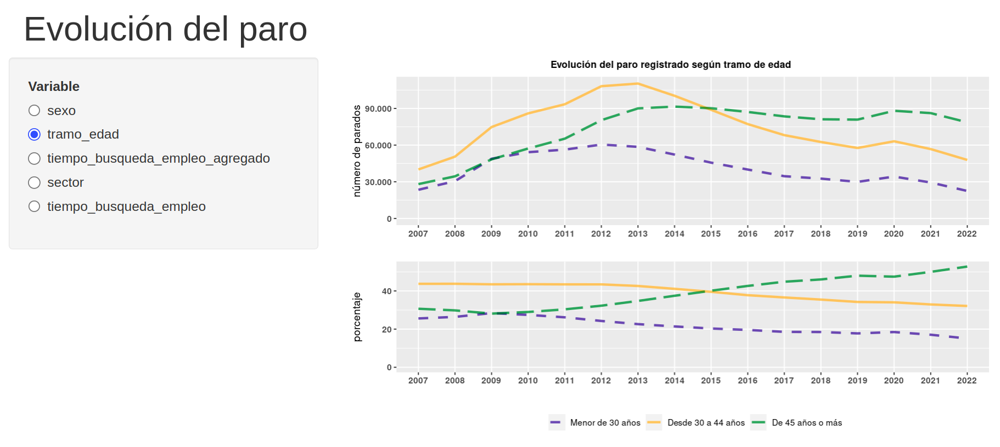
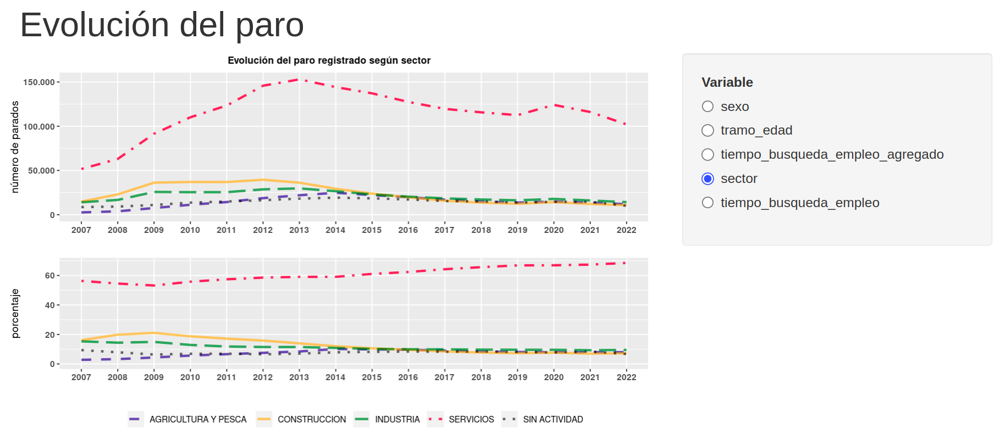
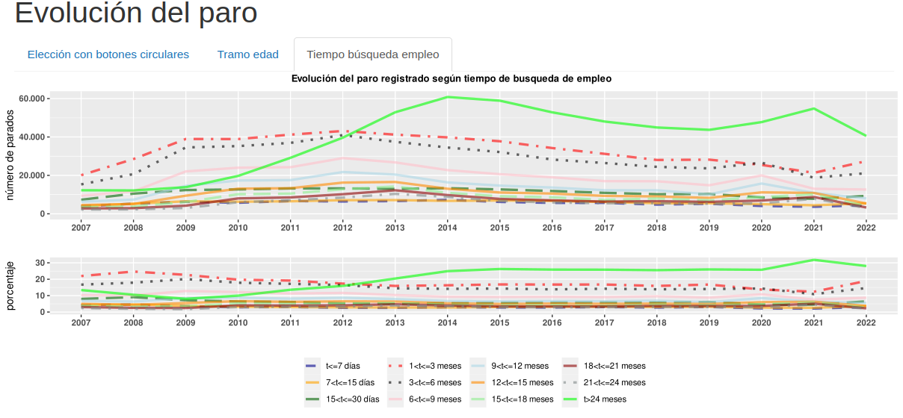
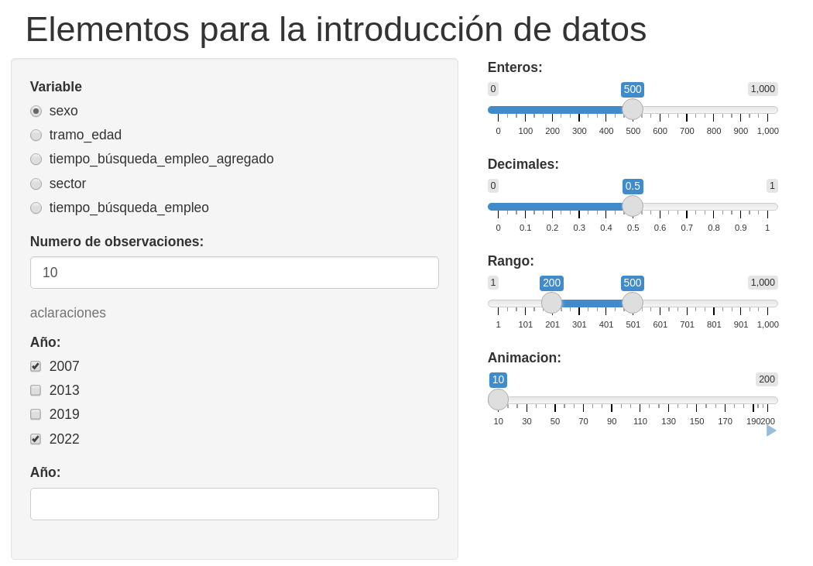
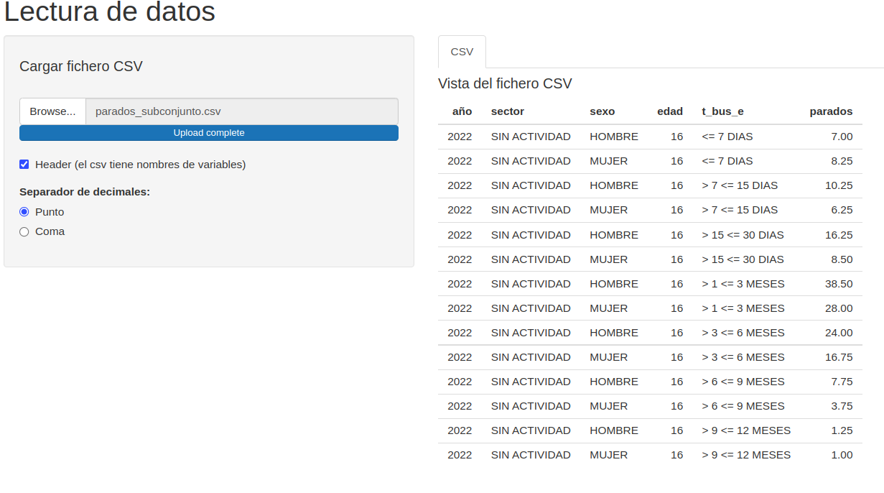
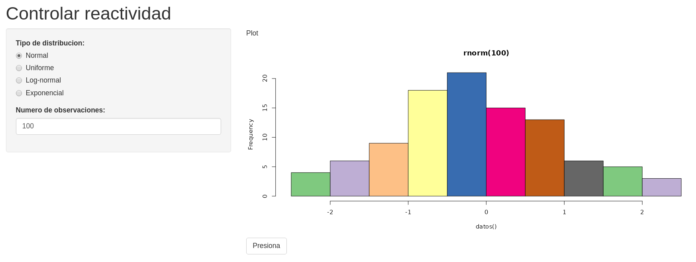

# Creación de aplicaciones web interactivas con Shiny {#shiny}
 

*Aurora González Vidal*

Universidad de Murcia


## Introducción

\index{Shiny}
`Shiny` es un paquete de **R** que permite crear aplicaciones web interactivas \index{aplicaciones web interactivas} que cuentan con todos los elementos de **R**. `Shiny` se ha convertido en un referente ya que, para aquellos que tienen conocimiento de **R**, es muy sencillo crear una aplicación en cuestión de horas [@chang2017shiny]. Para crear una aplicación mínima no se necesitan conocimientos de HTML  (*HyperText Markup Language*), CSS (*Cascading Style Sheets*) o *JavaScript* y sus dependencias. Además, no es necesario pensar en elementos técnicos para hacerla accesible en la web como, por ejemplo, el puerto, ya que `Shiny` se encarga de esos detalles si no se cambian las opciones por defecto. Esas son algunas de las razones principales por las cuales `Shiny` se ha vuelto tan popular a lo largo de los años, ya que se pueden crear pruebas de concepto de un producto, mostrar algoritmos o presentar resultados de investigación con claridad a través de interfaces de usuario accesibles, reproducibles y amigables [@fay2021engineering].

El primer paso para usar `Shiny` es instalar el paquete que está disponible en CRAN:


```r
install.packages("shiny")
```

Para asegurarse de que la versión instalada es igual o superior a la 1.5.0. hay que usar `packageVersion("shiny")`.
A continuación, se puede cargar el paquete y ver algunos ejemplos que se incluyen directamente en el mismo utilizando distintas opciones para el argumento `example`.


```r
library("shiny")
runExample(example = "01_hello")
# otras: 02_text, 03_reactivity, 04_mpg, 05_sliders, 06_tabsets, 07_widgets, 08_html, 09_upload, 10_download,  11_timer.
```

## Componentes mínimos de una aplicación `Shiny` y disposición básica

Las aplicaciones `Shiny` tienen dos componentes:

1. una \index{interfaz de usuario} interfaz de usuario `ui`, que es un script, y
2. un `server`, que es un script de \index{servidor} servidor  o secuencia de comandos de servidor.

Estos componentes pueden encontrarse en el mismo script o estar separados en dos scripts con nombres fijos: `ui.R` y `server.R`. En este caso, se ha elegido la segunda opción para ilustrar los ejemplos con mayor claridad. 
Una aplicación `Shiny` es un directorio que contiene estos scripts y otros ficheros adicionales (conjuntos de datos, ficheros donde se definen funciones no dinámicas, etc.).

El código mínimo para crear una aplicación con un título, panel lateral y panel principal es el que sigue:

- `ui.R`


```r
shinyUI(fluidPage(
  titlePanel("TITULO"), # panel de encabezado TÍTULO
  sidebarPanel(), # panel lateral
  mainPanel() # panel principal
  ))
```

- `server.R`


```r
shinyServer(function(input, output) {}
            )
```

La aplicación se puede lanzar de dos maneras diferentes. La primera es mediante el comando `runApp()`, que tiene como argumento la ruta del directorio que almacena los ficheros que componen la aplicación.


```r
library("shiny")
runApp("ruta al directorio")
```

La segunda es lanzar la aplicación directamente desde RStudio mediante el botón `RunApp` que aparece en cualquiera de los dos scripts `ui.R` o `server.R` reemplazando, al `Run` habitual.

En este capítulo, además de ver los distintos componentes de `Shiny`, se construye una aplicación para la visualización de algunos gráficos presentados en el Cap. \@ref(paro-clm). Los datos relacionados se encuentran en el paquete `CDR` del libro.

Además del `ui.R` y del `sever.R`, puede ser muy útil tener un fichero donde recoger las funciones, paquetes y datos necesarios para el funcionamiento de la aplicación. Este fichero se puede cargar mediante la función `source()` desde el `ui.R` o desde el `server.R`. Una recomendación es denominarlo `source.R` para mejor organización y legibilidad. 


## Diseño de una aplicación `Shiny`

`Shiny` incluye una serie de opciones para el diseño o la disposición de los distintos componentes de una aplicación. En esta sección se ven dos muy sencillos:

  - `sidebarLayout()`: para colocar un `sidebarPanel()`, es decir, un panel lateral de entradas junto a un `mainPanel()` de contenido de salida.
  - `tabsetPanel()` y `navlistPanel()`, para la segmentación de diseños. 

Hasta ahora se ha utilizado el primero, sin introducirlo específicamente, para mostrar distintos ejemplos, por ser el más sencillo. 

### Diseño de las páginas: `fluidPage()` {#dispag}

Un diseño de página fluido `fluidPage()` \index{fluidPage()} consiste en filas que a su vez incluyen columnas. Las filas tienen como propósito asegurar que sus elementos aparezcan en la misma línea (si el navegador tiene el ancho adecuado). El objetivo de las columnas es definir cuánto espacio horizontal, dentro de una cuadrícula de 12 unidades de ancho, deben ocupar sus elementos. Las páginas fluidas escalan sus componentes en tiempo real para llenar todo el ancho disponible del navegador.


Una `fluidPage()` tiene 2 argumentos: `headerPanel()` con el título de la aplicación 
y `sidebarLayout()`, que es un punto de partida útil para la mayoría de las aplicaciones. Este, a su vez, tiene 2 argumentos más:  `sidebarPanel()`, que es  una barra lateral para las entradas y `mainPanel()`, 
una gran área principal para la salida.
Un ejemplo sencillo de un diseño de página fluido se muestra en el siguiente código, que tiene como resultado la Fig. \@ref(fig:izda).


```r
shinyUI(fluidPage(
  headerPanel("Evolución del paro"), # panel de encabezado
  sidebarLayout(
    sidebarPanel( # panel lateral
      radioButtons(
        "vble", "Variable", # botones circulares: nombre y etiqueta
        c(
          "sexo" = "sexo",
          "tramo_edad" = "tramo_edad",
          "tiempo_búsqueda_empleo_agregado" = "tiempo_búsqueda_empleo_agregado",
          "sector" = "sector",
          "tiempo_búsqueda_empleo" = "tiempo_búsqueda_empleo"
        ), "sexo"
      )
    ),
    mainPanel(
      plotOutput("gra1")
    )
  )
))
```


<div class="figure" style="text-align: center">

<p class="caption">(\#fig:izda)Mi primer Shiny: evolución del paro regisrado en Castilla-La Mancha (España) por tramos de edad (sidebarPanel en la izquierda, por defecto).</p>
</div>

La barra lateral puede posicionarse a la izquierda (por defecto) o a la derecha del área principal. Por ejemplo, para posicionar la barra lateral a la derecha se debe utilizar `position = 'right'`, como se aprecia en la Fig. \@ref(fig:dcha), donde el resto de argumentos son los mismos que para generar la Fig. \@ref(fig:izda).


```r
shinyUI(fluidPage(
  headerPanel("Evolución del paro"),
  sidebarLayout(position = "right", ...)
))
```

<div class="figure" style="text-align: center">

<p class="caption">(\#fig:dcha)Aplicación Shiny con sidebarPanel a la derecha: evolución del paro regisrado en Castilla-La Mancha (España) por tramos de edad.</p>
</div>

Las funciones `radioButtons()` y `plotOutput()` que aparecen en la salida anterior se abordarán en detalle en las respectivas secciones de este capítulo.


### Segmentación de diseños: `tabsetPanel()` y `navlistPanel()` 

Para subdividir el panel principal en varias secciones discretas, es decir, para crear pestañas, se puede usar `tabsetPanel()` \index{tabsetPanel()} y `tabPanel()` \index{tabPanel()} como sigue:


```r
mainPanel(
  tabsetPanel(
    tabPanel(
      "Elección con botones circulares",
      radioButtons(
        "vble", "Variable", # botones circulares: nombre y etiqueta
        c(
          "sexo" = "sexo",
          "tramo_edad" = "tramo_edad",
          "tiempo_búsqueda_empleo_agregado" = "tiempo_búsqueda_empleo_agregado",
          "sector" = "sector",
          "tiempo_búsqueda_empleo" = "tiempo_búsqueda_empleo"
        ), "sexo"
      ),
      plotOutput("gra1")
    ),
    tabPanel("Tramo edad fijo", plotOutput("gra2")),
    tabPanel("Tiempo búsqueda empleo fijo", plotOutput("gra3"))
  )
)
```


<div class="figure" style="text-align: center">

<p class="caption">(\#fig:sh-ventanas)Aplicación Shiny con varias pestañas: evolución del paro regisrado en Castilla-La Mancha (España) por tiempo de búsqueda de empleo.</p>
</div>

En el ejemplo de la Fig. \@ref(fig:sh-ventanas) se aprecia que hay 3 pestañas. Se muestra la tercera, que es la evolución del paro registrado en Castilla-La Mancha (España) por tiempo de búsqueda de empleo. Obsérvese que no es una gráfica reactiva, sino estática.

`navlistPanel()` es una alternativa a `tabsetPanel()` cuando existan muchas separaciones. Un `navlist` presenta los distintos componentes como una lista de la barra lateral en lugar de utilizar pestañas y no se hace en el `mainPanel()`.


```r
ui <- fluidPage(
  titlePanel("Application Title"),
  navlistPanel(
    "Header A",
    tabPanel("Component 1"),
    tabPanel("Component 2"),
    "Header B",
    tabPanel("Component 3")
  )
)
```


## Elementos para la introducción de datos  {#sh-elementos}

Para que el usuario de la aplicación `Shiny` introduzca datos manualmente, los elementos más importantes se enumeran a continuación.

### Control deslizante

Un \index{control!deslizante} control deslizante permite que el usuario seleccione entre un intervalo de valores moviendo un control de posición por una pista.  En `Shiny` se crea con la función `sliderInput()`, que tiene, entre otros, los siguientes argumentos:

```r
sliderInput(inputId, label, min, max, value, step = NULL, animate = FALSE)
```

  - `inputId`: la entrada que se utiliza para acceder al valor,

  - `label`: etiqueta o nombre que aparece en la interfaz,

  - `min`: el mínimo del control deslizante,
  
  - `max`: el máximo del control deslizante,
  
  - `value`: el valor inicial,
  
  - `step`: el intervalo entre cada valor seleccionable. NULL significa que va de uno en uno,
  
  - `animate`: booleano que indica si los valores se cambian automáticamente para animar la aplicación. 

Sus características incluyen (i) la posibilidad de introducir un único valor y rangos, (ii) formatos personalizados (por ejemplo, para entradas relativas al dinero) y (iii) pueden ser animados y recorrer los valores de forma automática (argumento `animate`).

Algunos ejemplos se muestran en el siguiente código:


```r
sliderInput("enteros", "Enteros:", min = 0, max = 1000, value = 500)
sliderInput("decimales", "Decimales:", min = 0, max = 1, value = 0.5, step = 0.1)
sliderInput("rango", "Rango:", min = 1, max = 1000, value = c(200, 500))
sliderInput("animacion", "Animacion:", 10, 200, 10, step = 10, animate = animationOptions(loop = T))
```


### Botón circular

Un \index{botón circular} botón circular es un tipo de selector que proporciona una lista de opciones entre las cuales solo se puede seleccionar una.  En `Shiny` se crean con la función `radioButtons()`, que tiene, entre otros, los argumentos autoexplicativos que se muestran en el siguente *chunk*:


```r
radioButtons(inputId, label, choices, selected = NULL)
```

Un ejemplo donde la variable `sexo` se elige por defecto se puede ver en el primer trozo de código (*chunk*) de la subsección \@ref(dispag): `sidebarLayout()`.

### Selección múltiple

Un cuadro de selección múltiple es un tipo de selector que proporciona una lista de opciones entre las cuales se pueden seleccionar varias. En `Shiny` se crean con la función `selectInput()`, que tiene, entre otros, los siguientes argumentos autoexplicativos:


```r
selectInput(inputId, label, choices, multiple = FALSE)
```


```r
selectInput("año", "Año:",
  c(
    "año1" = "2007",
    "año2" = "2013",
    "año3" = "2019",
    "año4" = "2022"
  ),
  multiple = TRUE
)
```

### Entrada de grupo 

Este componente, muy similar al anterior, crea un grupo de casillas que se pueden utilizar para alternar varias opciones de forma independiente. 


```r
checkboxGroupInput(inputId, label, choices, multiple = FALSE)
```


```r
checkboxGroupInput(
  "variable", "Variables to show:",
  c(
    "año1" = "2007",
    "año2" = "2013",
    "año3" = "2019",
    "año4" = "2022"
  )
)
```


### Entrada numérica 

Crea un control de entrada de valores numéricos.


```r
numericInput("obs", "Numero de observaciones:", 10)
```

### Entrada de texto 

Crea un texto de ayuda que se pueda agregar a un formulario de entrada para proporcionar una explicación o contexto adicional.


```r
helpText("aclaraciones")
```


Otras opciones de entrada que se invita a analizar al lector están relacionadas con las fechas: `dateInput()`, `dateRangeInput()` y con una área de texto: `textAreaInput()`. Un ejemplo de lo expuesto anteriormente puede verse en la Fig \@ref(fig:sh-intro-datos).


<div class="figure" style="text-align: center">

<p class="caption">(\#fig:sh-intro-datos)Distintos elementos para la introducción de datos.</p>
</div>


### Lectura de ficheros de datos 

Es posible introducir información a través de la lectura de ficheros de datos con la función `fileInput()`. Se pueden combinar valores por defecto de esta función con algunos de los elementos anteriores para definir las características del dataset (separador, decimal, cabecera). En el siguiente ejemplo se utiliza la función `read.csv()` y se da a elegir si tiene cabecera  o no con el `checkboxInput()`, así como el tipo de decimal con el `radioButtons`. Otra particularidad del ejemplo es que se asume que los datos están separados por punto y coma, tal y como se aprecia en el argumento `sep` del `read.csv()`.


```r
shinyUI(fluidPage(
  headerPanel("Lectura de datos"),
  sidebarPanel(
    h4("Cargar fichero CSV"),
    fileInput("file1", "",
      accept = c("text/csv", "text/comma-separated-values,text/plain", ".csv")
    ),
    checkboxInput("header", "Header (el csv tiene nombres de variables)", TRUE),
    radioButtons(
      "dec", "Separador de decimales:",
      c(
        "Punto" = ",",
        "Coma" = "."
      )
    )
  ),
  mainPanel(
    tabsetPanel(
      tabPanel(
        "CSV",
        h4("Vista del fichero CSV"),
        tableOutput("contents")
      )
    )
  )
))

shinyServer(function(input, output) {
  output$contents <- renderTable({
    inFile <- input$file1

    if (is.null(inFile)) {
      return(NULL)
    }

    read.csv(inFile$datapath, header = input$header, dec = input$dec, sep = ";")
  })
})
```


<div class="figure" style="text-align: center">

<p class="caption">(\#fig:shiny-lee)Lectura de datos.</p>
</div>


## Elementos para visualización  

Tras la introducción de ciertos parámetros en el `ui.R`, estos se pueden utilizar en el script `server.R` mediante la expresión `input`. El código de **R** que construye el objeto basado en esos datos se desarrolla en el servidor, y para generar dicho objeto  se utilizan las funciones `renderX()`, donde X es el tipo de objeto a devolver. Por último, este objeto se referencia nuevamente en el `ui.R` en el lugar que se desea mostrar (panel) a través de la expresión `XOutput`.

El hecho de colocar una función en `ui` le dice a `Shiny` dónde mostrar su objeto. A continuación, hay que decirle a `Shiny` cómo construir el objeto.
Esto se hace proporcionando el código **R** que construye el objeto en la función del servidor.

En concreto, algunas posibilidades se pueden ver en la Tabla \@ref(tab:sh-tabla1).


+---------------+-------------------+----------------+
| Server        | UI                |  Crea          |
+===============+===================+================+
| renderImage   | imageOutput       | Imagen         |
+---------------+-------------------+----------------+
| renderPlot    | plotOutput        | Gráfico        |
+---------------+-------------------+----------------+
| renderTable   | tableOutput       | Tabla          |
+---------------+-------------------+----------------+
| renderText    | textOutput        | Texto          |
+---------------+-------------------+----------------+
|               | htmlOutput        | HTML           |
+---------------+-------------------+----------------+
|               | verbatimTextOutput| Texto verbatim |
+---------------+-------------------+----------------+

: (#tab:sh-tabla1) Distintos elementos para la salida


Los elementos más importantes son los gráficos y las tablas.

- **Gráficos**: para generar la aplicación de la Fig. \@ref(fig:sh-ventanas) se utiliza `renderPlot()` en el `server.R` como sigue:


```r
source("source.R")
shinyServer(function(input, output) {
  output$gra1 <- renderPlot({
    graf_evol(input$vble)
  })
})
```

Se ha llamado `gra1` a la variable que es el gráfico y que se crea con `renderPlot()`. En el interior se utiliza una función denominada `graf_evol()` que es compleja y se crea en el `source.R` que se carga al principio. Lo que interesa de esta función es que tiene como único argumento el nombre de la variable de interés cuya evolución se desea mostrar. Esta puede ser una de las diversas opciones que se dan a través del `radioButton` denominado `vble` que ha sido creado anteriormente. Como se puede apreciar, se utiliza `input$vble` para invocar a la selección realizada en la interfaz de usuario.

- **Tablas**: para mostrar la tabla de la Fig. \@ref(fig:shiny-lee) se utiliza `renderTable()` en el `server` y `tableOutput()` en el `ui`.


```r
shinyServer(function(input, output) {
  output$contents <- renderTable({
    inFile <- input$file1
    if (is.null(inFile)) {
      return(NULL)
    }
    read.csv(inFile$datapath, header = input$header, dec = input$dec, sep = ";")
  })
})
```


## Reactividad

La programación reactiva es un paradigma de programación que se encarga de los flujos de datos y la propagación de los cambios. Esto significa que cuando un flujo de datos es emitido por un componente, el cambio se propagará a otros componentes.

El modelo de \index{reactividad} reactividad que utiliza `Shiny` es el siguiente: hay una fuente reactiva, un conductor reactivo y un punto final de la reactividad [@wickham2021mastering].
La fuente reactiva suele ser lo que el usuario introduce y el punto de parada, lo que  se muestra por pantalla. A lo que el usuario introduce se accede con el objeto `input` y a lo que se muestra por pantalla, con el objeto `output`.
Un ejemplo que ya se ha usado es el siguiente:


```r
output$gra1 <- renderPlot({
  graf_evol(input$vble)
})
```
El objeto `output$gra1` es un punto final de la reactividad y usa la fuente reactiva `input$vble`. Cuando `input$vble` cambia, a `output$gra1` se le notifica que necesita ejecutarse de nuevo. 


### Conductores reactivos y control de la reactividad

También es posible crear \index{componentes reactivos} componentes reactivos que conecten los *inputs* y los *outputs*. En el siguiente ejemplo se ha creado un objeto reactivo `datos` que genera datos que siguen una distribución que el usuario selecciona a través del radioButton `dist` y cuya muestra tiene tantos elementos como el usuario haya especificado en el numericInput `obs`.

`Shiny`, además, permite controlar la reactividad a través de los actionButtons. Se pueden modificar las entradas sin obtener una respuesta hasta que se apriete dicho botón.

Se ha creado un panel nuevo dentro del `mainPanel` que contiene, además del `plot` previo, un `actionButton` con la etiqueta `Presiona` (véase Fig. \@ref(fig:sh-react))

```r
shinyUI(fluidPage(
  headerPanel("Controlar reactividad"),
  sidebarPanel(
    radioButtons("dist", "Tipo de distribucion:",
      c(
        "Normal" = "norm",
        "Uniforme" = "unif",
        "Log-normal" = "lnorm",
        "Exponencial" = "exp"
      ),
      selected = "Exponencial"
    ),
    numericInput("obs", "Numero de observaciones:", 10),
  ),
  mainPanel(
    tabPanel(
      "Histograma distribucion RadioButton",
      "Plot", plotOutput("plot"), actionButton("botonReac", "Presiona")
    )
  )
))
```

A continuación, se hace referencia a ese botón para cada una de las expresiones reactivas que se aislarán con la función `isolate()`:


```r
shinyServer(function(input, output) {
  datos <- reactive({
    if (input$botonReac == 0) {
      return(dist(rexp(input$obs)))
    }
    isolate({
      dist <- switch(input$dist,
        norm = rnorm,
        unif = runif,
        lnorm = rlnorm,
        exp = rexp,
        rnorm
      )

      dist(input$obs)
    })
  })

  output$plot <- renderPlot({
    if (input$botonReac == 0) {
      return(NULL)
    }
    isolate({
      hist(datos(),
        main = paste("r", input$dist, "(", input$obs, ")", sep = "")
      )
    })
  })
})
```


<div class="figure" style="text-align: center">

<p class="caption">(\#fig:sh-react)Control de la reactividad en un histograma.</p>
</div>


## Publicación de la aplicación en la web

Después del desarrollo de una aplicación `Shiny`, suele ser interesante publicarla para su explotación científica o empresarial. RStudio ofrece diversas soluciones, con distintos niveles de complejidad y libertad, para poder publicar la aplicación web: ($i$) shinyapps.io, ($ii$) Shiny Server y ($iii$) RStudio Connect.

A continuación se introduce, muy brevemente, cada uno de ellos y se proporcionan los enlaces para que el lector pueda indagar en profundidad.

- Shinyapps.io

RStudio ofrece un servicio de hospedaje denominado `Shinyapps.io` que permite subir la aplicación directamente desde la sesión de **R** a un servidor que se mantiene por RStudio. Hay un control casi completo sobre la aplicación, incluyendo la administración del servidor. Tiene distintos planes, desde  gratuito hasta profesional, siendo el primero más restringido en cuanto a servicios (número de aplicaciones, horas activo...) y el último más completo (autenticación, personalización, etc). 

Lo único que se necesita es:


- Un entorno de desarrollo de **R**, como RStudio IDE.

- La última versión del paquete `rsconnect`.

En la web [shinyapps.io](shinyapps.io), en el apartado "Dashboard", se realiza el registro.  Shinyapps.io genera de forma automática un *token* que el paquete `rsconnect` utiliza para acceder a la cuenta.


```r
rsconnect::setAccountInfo(name = "<ACCOUNT>", token = "<TOKEN>", secret = "<SECRET>")
```

Para desplegar la aplicación se utiliza `deployApp()` como sigue:


```r
library(rsconnect)
deployApp()
```


Existen opciones gratuitas que carecen de ciertas ventajas, como la posibilidad de restringir el acceso a la aplicación Shiny, es decir, la aplicación no será privada con el plan gratuito, aunque sí existen las opciones de autentificación con otros planes. Para más información sobre este método, consúltese la página [https://shiny.rstudio.com/articles/shinyapps.html](https://shiny.rstudio.com/articles/shinyapps.html).

- Shiny Server

Shiny Server construye un servidor web diseñado para hospedar aplicaciones Shiny. Es gratuito, de código abierto y está disponible en GitHub.

Para usar el Shiny Server es necesario tener un servidor Linux que tenga soporte explícito para Ubuntu 12.04 o superior (64 bit) y CentOS/RHEL 5 (64 bit). Aunque no se esté utilizando una distribución con soporte explícito, también se puede utilizar, si bien hay que construirlo desde el paquete fuente.

En el mismo Shiny Server se pueden hospedar múltiples aplicaciones Shiny. Para ver instrucciones detalladas para su instalación y configuración, se recomienda la guía `Shiny` Server [https://docs.rstudio.com/shiny-server](https://docs.rstudio.com/shiny-server).

La seguridad y privacidad quedarán supeditadas a los conocimientos del usuario, ya que dependerán de su propio servidor.

- RStudio Connect

Cuando Shiny se utiliza en entornos con fines lucrativos, existen herramientas de servidor que se pueden comprar y que vienen equipadas con los programas habituales de un servidor de pago:

  a) Soporte SSL.
  b) Herramientas de administrador.
  c) Soporte prioritario.
  d) Privilegios de usuario.
  e) Opción con Docker.


Para tener dichas herramientas de servidor, la plataforma de publicación RStudio Connect puede ser una solución. Esta herramienta permite compartir aplicaciones `Shiny`, informes RMarkdown, cuadros de mando, gráficos, Jupyter Notebooks y más. 
Con RStudio Connect se puede programar la ejecución de informes y políticas de seguridad flexibles.

Además, RStudio Connect permite seleccionar privilegios de usuario en aplicaciones Shiny. La aplicación Shiny puede reconocer a un usuario basándose en la información de inicio de sesión y ofrecerle contenido personalizado, de manera que se puede controlar quién ve qué contenido y cuándo lo ve.

## Extensiones de  `Shiny`

`Shiny` es una herramienta totalmente expansible.  Lo que se ha mostrado en este capítulo hasta ahora es un aperitivo en relación a todas las posibilidades que existen en el mundo de `Shiny`. Hay repositorios que recopilan información sobre paquetes que proveen de mejoras a las aplicaciones `Shiny` en su estilo y funcionalidad [@awesome; @awesome2]. En esta sección se mencionan algunos de ellos pero, sobre todo, se recomienda al lector visitar dichos repositorios para una mayor profundidad en este tema.


### Temas de estilo 

En temas de estilo, merece la pena destacar estos tres paquetes: `shinydashboard`,  `shinydashboardPlus` y `flexdashboards`. Los dos primeros presentan una serie de plantillas predefinidas para la creación de las aplicaciones `Shiny`, de manera que los colores combinan y los elementos visuales tienen cierta armonía. Por su parte, `flexdashboards` tiene como base un documento R Markdown y los distintos niveles del mismo definen los paneles de la aplicación a crear.


### *Widgets* 

El paquete `shinyWidgets` ofrece *widgets*[^Note-shiny-1] personalizados y diversos componentes para mejorar las aplicaciones. Se pueden reemplazar los `checkboxes` por `switch buttons`, añadir colores a los `radioButtons` y al grupo de casillas de verificación (`checkboxGroupInput`), etc. Cada *widget* tiene un método de actualización para cambiar el valor de una entrada del *server*.

[^Note-shiny-1]: Los *widgets* son pequeñas aplicaciones cuyo objetivo es proporcionar información visual y facilitar el acceso a las funciones que se utilizan de forma frecuente.

### Temporizador animado

Cuando una salida de `Shiny` (un gráfico, una tabla, etc.) se está calculando, permanece visible pero en gris. Si hay procesos algo más complejos, pueden tardar en mostrarse. Utilizando `shinycssloaders` se puede añadir una rueda de carga (*spinner*) a las salidas en lugar de hacerlas grises. Envolviendo una salida `Shiny` en `withSpinner()`, el *spinner* aparecerá automáticamente mientras la salida se recalcula. Hay ocho tipos de animación incorporadas y personalizables en color y tamaño, pero también se pueden cargar otras animaciones.


### Visualizaciones interactivas

Paquetes como `heatmaply` o `leaflet` se pueden combinar perfectamente con `shiny` para crear mapas de calor y mapas geográficos interactivos, y utilizarlos en las aplicaciones.


::: {.infobox data-latex=""}
**Nota**

Se ha puesto a disposición del lector un paquete con [los ejemplos implementados en el capítulo](shiny/apps_cap_shiny.zip) en la versión online del libro: https://cdr-book.github.io/index.html
:::


::: {.infobox_resume data-latex=""}
### Resumen {-}

`shiny` es un paquete de **R** que permite crear aplicaciones web interactivas requiriendo únicamente conocimientos de **R**. En este capítulo:

+ Se muestran los elementos básicos de una aplicación `Shiny`: user interface (ui.R) y servidor (server.R), así como los posibles diseños en relación con los componentes que una aplicación puede tener: barra lateral, paneles discretos, paneles de navegación, etc. 

+ Se repasan los elementos de introducción de datos en una aplicación `Shiny`, incluyendo la carga de conjuntos de datos y también los elementos de salida, como gráficas y tablas. Además, se aborda el modelo de reactividad, es decir, cómo al cambiar algo en los parámetros de entrada, de forma dinámica, cambia la salida y cómo controlar este proceso. También se muestran distintas opciones para la publicación de las aplicaciones `Shiny`. 

+ Se mencionan algunas de las posibles extensiones al paquete.
:::
