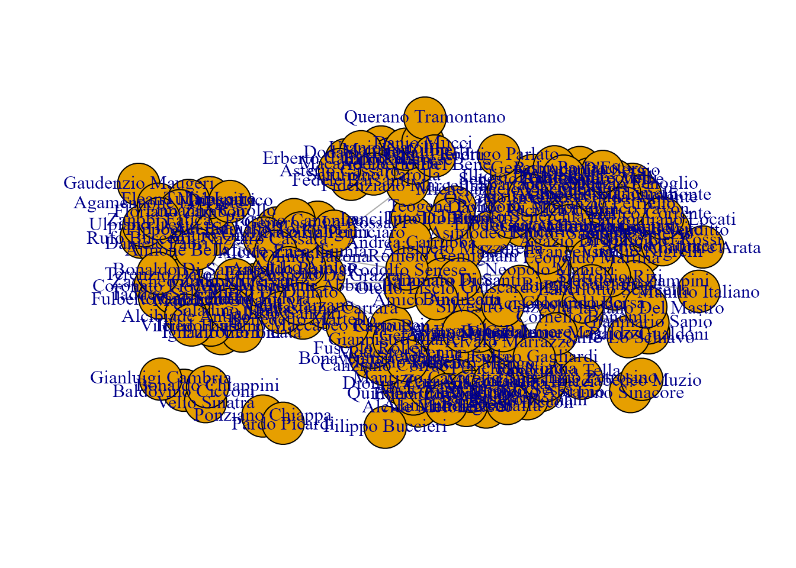
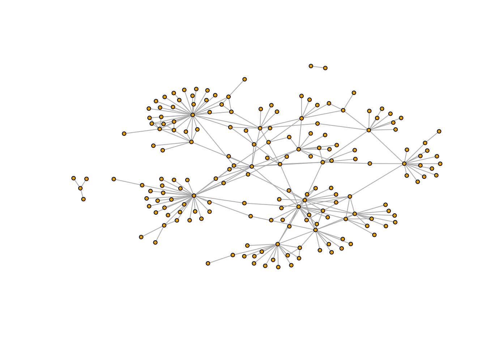
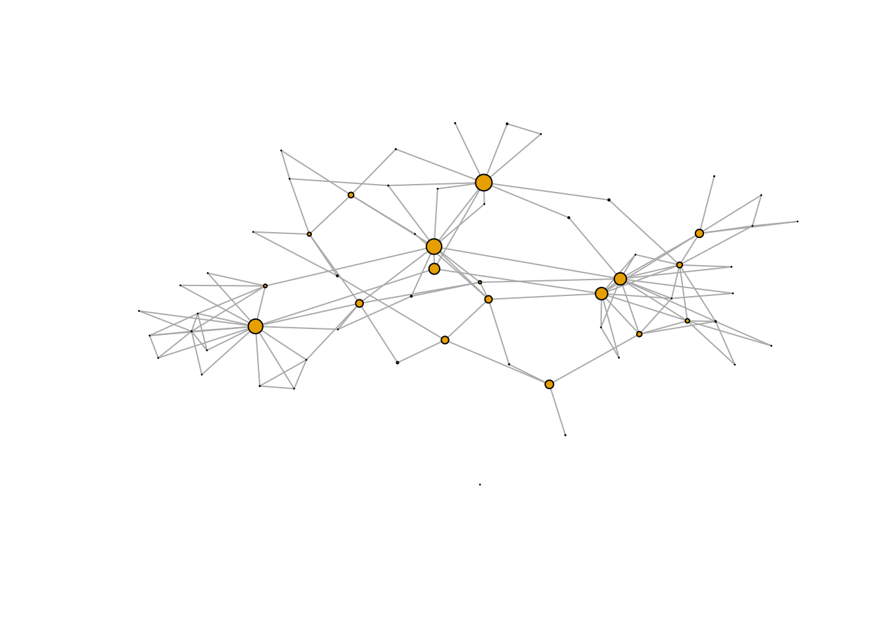
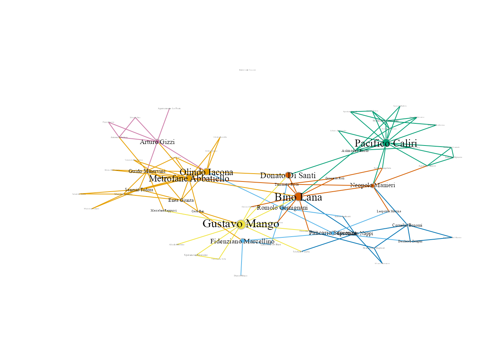
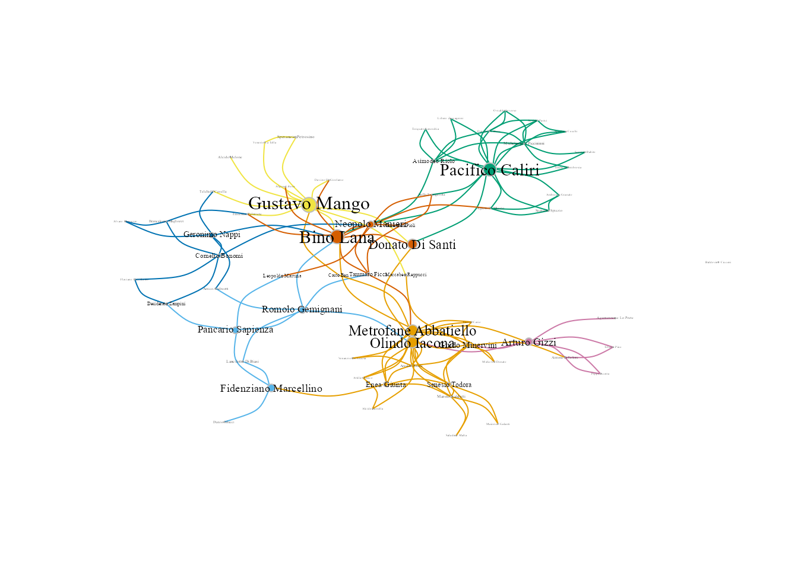

# (PART) Casos de estudio en ciencia de datos {.unnumbered}

# Análisis de una red criminal  {#cap-crimen}

*F. Liberatore*$^{a}$, *L. Quijano-Sánchez*$^{b}$, *M. Camacho-Collados*$^{c}$

$^{a}$Cardiff University  
$^{b}$Universidad Autónoma de Madrid  
$^{c}$Ministerio del Interior

## Introducción
En este capítulo se plantea la idea de realizar un **análisis de una red de crimen organizado**. Para ello, se estudia la red derivada de un dataset real, relativo a la operación *Oversize*. El estudio se llevará a cabo usando la librería `igraph`.
\index{crimen organizado}

## El conjunto de datos *Oversize*

Los datos que se van a analizar se han obtenido de la operación *Oversize* [@berlusconi2016; @oversize1; @oversize2], un proceso italiano contra un grupo mafioso. La investigación duró del 2000 al 2006, y se enfocó en más de 50 sospechosos involucrados en tráfico internacional de drogas, homicidios y robos. El juicio empezó en el 2007 y duró hasta el 2009, cuando se dictó la sentencia y los principales sospechosos fueron condenados con penas de 5 a 22 años de cárcel. La mayoría de los sospechosos eran afiliados de la '*Ndrangheta*, una mafia de Calabria (una región del sur de Italia) con ramificaciones en otras regiones y en el extranjero.

En particular, se va a estudiar la red obtenida de las escuchas telefónicas. Los datos hacen referencia a todas las conversaciones telefónicas transcritas por la policía y consideradas relevantes. En esta red, los nodos representan sospechosos (los datos son anónimos y los nombres asignados en la red se han generado de forma aleatoria). Las aristas conectan los sospechosos que han tenido al menos una conversación telefónica relevante al caso durante la investigación.

## Creación de la red mafiosa
\index{red!mafiosa}


El dataset `Oversize_nodes` contiene el listado de nodos con sus propiedades, en este caso el nombre (ficticio) del sospechoso. `Oversize_edges` contiene las aristas del grafo, representadas como parejas de nodos, a su vez identificados por su ID. A partir de estos datasets la librería `igraph` permite crear un grafo, tal y como se ilustra a continuación. 


```r
library("igraph")
library("CDR")
data(oversize_edges, oversize_nodes)
net <- graph_from_data_frame(d=oversize_edges, 
                             vertices=oversize_nodes, 
                             directed=F) 
net
#> IGRAPH 9498030 UN-- 182 247 -- 
#> + attr: name (v/c)
#> + edges from 9498030 (vertex names):
#>  [1] Casto Ben          --Gustavo Mango          
#>  [2] Casto Ben          --Metrofane Abbatiello   
#>  [3] Uranio Natoli      --Fidenziano Marcellino  
#>  [4] Lancilotto Di Biasi--Romolo Gemignani       
#>  [5] Lancilotto Di Biasi--Fidenziano Marcellino  
#>  [6] Senesio Rabito     --Pacifico Caliri        
#>  [7] Senesio Rabito     --Michelangelo Piccininni
#>  [8] Romolo Gemignani   --Alighiero Mazzarella   
#> + ... omitted several edges
```

La vista previa del grafo indica lo siguiente:

-   el grafo es no dirigido (*UN*) y está compuesto por 182 nodos y 247 aristas;

-   el único atributo es el nombre de los nodos (*attr: name (v/c)*);

-   finalmente, se proporciona una previsualización de un subconjunto de aristas, indicando para cada una los dos nodos conectados (ej.: *Casto Ben*---*Gustavo Mango*).


\index{grafo}
\index{vertices@vértices}


## Visualización de la red mafiosa

Para hacerse una idea de qué aspecto tiene el grafo, se procede a su visualización usando el comando `plot()` de **R**.


```r
plot(net, asp=0)
```

<div class="figure" style="text-align: center">

<p class="caption">(\#fig:vis-red1)Grafo básico de la red mafiosa.</p>
</div>

Tal y como se aprecia en la Fig. \@ref(fig:vis-red1), el resultado no es muy claro. Todos los nodos tienen el mismo tamaño y se solapan entre ellos. Además, se muestran los nombres de todos los actores dentro de la red, lo cual dificulta ulteriormente su interpretación.

Se puede mejorar esta presentación usando unos parámetros de `plot()`  específicos de la librería `igraph`. En particular:

-   `vertex.size`: determina el tamaño de los nodos.

-   `vertex.label`: define el texto asociado a cada nodo. Por defecto se asume que es su nombre. En el ejemplo de abajo, se excluyen los nombres de la visualización.


```r
plot(net, vertex.size=2, vertex.label=c(''),  asp=0)
```

<div class="figure" style="text-align: center">

<p class="caption">(\#fig:vis-red2)Grafo básico de la red mafiosa (mejorado).</p>
</div>

En la Fig. \@ref(fig:vis-red2) se observa cómo el grafo permite una mejor valoración de la distribución de los actores dentro de la red. Por ejemplo, hay dos grupos pequeños (de cuatro y dos actores) completamente desconectados de la red principal.

## Importancia de los actores (delincuentes)

Las medidas de centralidad permiten asignar un valor a cada actor que establece su importancia relativa a los demás. Existen diversas medidas, cada una con sus características y finalidad. En este ejemplo se van a usar las siguientes:

-   **grado**: número de aristas que llegan al nodo o salen de él. Cuanto más alto sea este valor, más vecinos tendrá el nodo;

-   **intermediación**: cuantifica el número de veces que un nodo se encuentra en el camino más corto entre otros actores. Cuanto más alto sea este valor, más información pasará por el nodo.
\index{grado}
\index{intermediación}


```r
dgr <-  degree(net) # Centralidad de grado
btwn <- betweenness(net) # Centralidad de intermediación
```

A continuación, se muestran los actores con los valores más altos en cada medida de centralidad.


```r
head(sort(dgr, decreasing = T))
#>        Gustavo Mango      Pacifico Caliri Metrofane Abbatiello 
#>                   32                   31                   18 
#>        Olindo Iacona         Arturo Gizzi      Guido Minervini 
#>                   17                   16                   16
```


```r
head(sort(btwn, decreasing = T))
#>        Gustavo Mango            Bino Lana      Pacifico Caliri 
#>             4602.167             4292.902             4056.435 
#>        Olindo Iacona Metrofane Abbatiello      Donato Di Santi 
#>             3397.907             3387.931             2978.427
```

Las medidas de centralidad se pueden usar para mejorar la visualización del grafo. Primero, se filtran todos los nodos que tengan grado menor que dos, ya que representan actores muy marginales en la red. Luego, se representa el tamaño de cada nodo en función de su valor de intermediación, escalando con un tamaño máximo de cinco.
\index{centralidad}


```r
vertex_filter <- dgr > 1 # deteccion actores marginales
scaled_btwn = 0.1+ 4.9*btwn/max(btwn) # Escalado del tamaño del nodo en funcion de la intermediación
net2 = induced.subgraph(net, which(vertex_filter)) # creación subgrafo
plot(net2, 
     vertex.size=scaled_btwn[vertex_filter], 
     vertex.label=c(''), 
     rescale=T, 
     asp = 0) # visualización subgrafo
```

<div class="figure" style="text-align: center">

<p class="caption">(\#fig:red-centralidad)Grafo de la red mafiosa (mejorado con medidas de centralidad).</p>
</div>

Como se puede apreciar en la Fig. \@ref(fig:red-centralidad), gracias a las medidas de centralidad se consigue tener una mejor idea de cómo se configura la red respecto a sus actores más importantes.

## Identificación de comunidades de la mafia

A continuación, se procede a identificar las comunidades existentes en el grafo de la operación *Overdrive*. `igraph` proporciona una gran variedad de algoritmos para la detección de comunidades en redes sociales. En el siguiente ejemplo, se usa el algoritmo Louvain [@blondel2008fast], que es el más popular.


```r
louvain_partition <- cluster_louvain(net) # Ejecución del algoritmo Louvain
net$community <- louvain_partition$membership # Asignación de las comunidades al grafo
unique(net$community) # Visualización de las comunidades encontradas
#> [1] 1 2 3 4 5 6 7 8 9
```

El algoritmo identifica distintas comunidades, cada una con su número asignado.

## Visualización de comunidades de la mafia
\index{algoritmo!Fruchterman-Reingold}

Se procede a visualizar las comunidades detectadas en el subgrafo, representando cada una de ellas en un color distinto. Además, para mejorar la calidad de la información representada, se resalta la importancia de cada actor representando los nodos asociados y sus nombres en tamaños proporcionales a su centralidad en toda la red (Fig. \@ref(fig:com-mafia)).


```r
V(net2)$size <- scaled_btwn[vertex_filter] # Tamaño del nodo en funcion de su centralidad
V(net2)$frame.color <- "grey"
V(net2)$color <- net$community[vertex_filter] # Color del nodo en función de su comunidad
V(net2)$label <- V(net2)$name
V(net2)$label.cex <- (1+scaled_btwn[vertex_filter])/6 # Escalado del nombre en función de su centralidad
V(net2)$label.color <- 'black'

# Definicion del color de las aristas en funcion de la comunidad de origen
edge.start <- ends(net2, es = E(net2), names = F)[,1] 
E(net2)$color <- V(net2)$color[edge.start]

plot(net2, asp=0) # Los resultados puede ser distintos con cada ejecución
```

<div class="figure" style="text-align: center">

<p class="caption">(\#fig:com-mafia)Visualización de comunidades de la mafia.</p>
</div>

Se puede mejorar aún más el aspecto del grafo. Para ello, se va a experimentar con una disposición diferente de los nodos. En este ejemplo, se usa el algoritmo Fruchterman-Reingold [@fruchterman1991graph]. Además, se aplica un efecto de curvatura a las aristas asignando un valor positivo al parámetro `edge.curved`. El resultado se puede ver en la Fig. \@ref(fig:red-fr).


```r
l1 <- layout_with_fr(net2) # algoritmo Fruchterman-Reingold
plot(net2, 
     layout=l1, 
     asp = 0, 
     edge.curved=0.5) # Los resultados pueden ser distintos con cada ejecución
```

<div class="figure" style="text-align: center">

<p class="caption">(\#fig:red-fr)Visualización de comunidades de la mafia con el algoritmo Fruchterman-Reingold.</p>
</div>


Finalmente, se puede exportar el grafo como PDF usando la función `pdf()` de **R**.


```r
pdf('grafo_final.pdf')
plot(net2, layout=l1, asp = 0, edge.curved=0.5) # Los resultados puede ser distintos con cada ejecucion
dev.off()
```

Como se ha podido observar tras las acciones anteriores, en la red se aprecian siete distintas comunidades. Tres destacan por su importancia, lideradas por Gustavo Mango, Bino Lana y Pacifico Caliri. Bino Lana, en particular, tiene especial relevancia ya que actúa como un puente entre Gustavo Mango y Pacificio Caliri.


<!-- ```{r img-paq-cdr, echo=FALSE, out.width='15%',} -->
<!-- knitr::include_graphics("img/LogoCDR_transparente.png") -->
<!-- ``` -->
