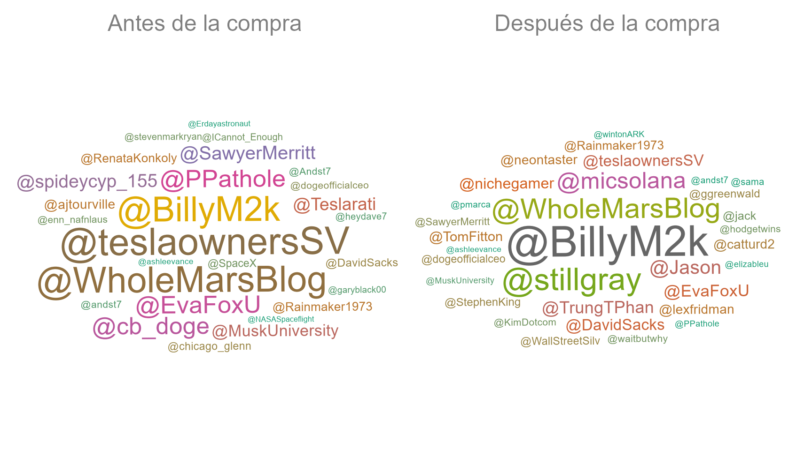
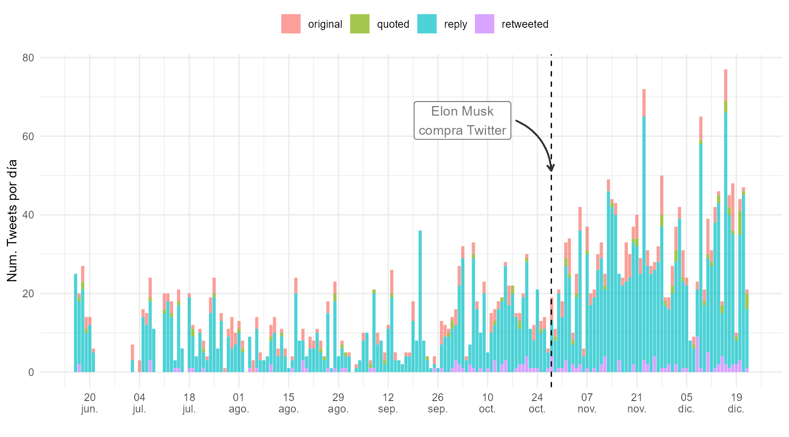
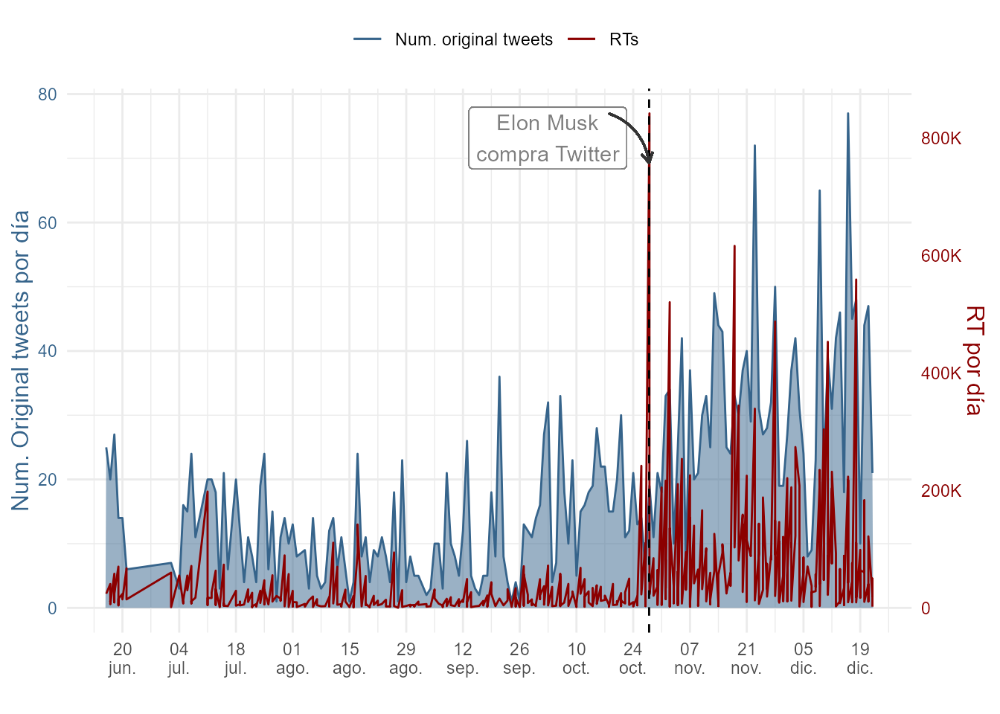

# ¿Cómo tuitea Elon Musk? {#cap-twitter}

*Mariluz Congosto*

Universidad Carlos III de madrid

## Introducción 
\index{Twitter}

El objetivo de este caso de uso es arrojar luz, de manera objetiva, sobre un **fenómeno social** de interés general: el uso de Twitter por parte de **Elon Musk**. Este multimillonario adquirió la red social el 28 de octubre de 2022 y desde entonces ha tomado decisiones drásticas, como reducir la plantilla y lanzar nuevos servicios de pago de manera apresurada. Su constante cambio de rumbo queda reflejado en su actividad frenética en Twitter, donde es un usuario muy activo.

Este caso de estudio aborda, una vez descargados los *tweets* mediante las **API de Twitter**,[^Elon-1] cómo adaptarlos mediante minería de textos (Cap.\@ref(mineria-textos)) para su **análisis** y **visualización**. El contenido de estos mensajes se representa mediante nubes de palabras, *scatter plots* y *timelines*. Este conjunto de gráficas ofrece distintas perspectivas de los datos que, sin duda, ayudarán a comprender los cambios de comunicación desde que adquirió Twitter.

[^Elon-1]: Para el caso de estudio que se desarrolla se ha usado la librería `rtweet` para acceder a la **API Standard (V1.1)** (accesible a todo el mundo). Para obtener las credenciales que permiten trabajar en **modo usuario** se facilita el *script* de **python make_token_Twitter.ipynb** en GitHub <https://github.com/congosto/token_API_V1.1**>. Este *script* se puede ejecutar en el entorno Google Colab <https://colab.research.google.com/>.

## Análisis visual de los *tweets* de Elon Musk \index{visualización}

Las librerías que se utilizan son las siguientes:


```r
library("tidyverse")    # manipulación de datos
library("lubridate")    # formato de fechas
library("scales")       # manejo de escalas numéricas
library("tidytext")     # manipulación de textos
library("ggwordcloud")  # creación de una nube de palabras
library("RColorBrewer") # paleta de colores
```


El rango de fechas elegido para delimitar temporalmente los *tweets* de Elon Musk va desde el 16-06-2022 hasta el 22-12-2022. Este rango es adecuado para visualizar la actividad e impacto del perfil de Elon Musk antes y después de la adquisición de Twitter.

Se cargan los datos de la librería `CDR` del libro.


```r
tweets_user <- CDR::elon_musk |>
  # Cambiar a formato fecha
  mutate(created_at = as.POSIXct(created_at, format = "%Y-%m-%dT%H:%M:%S", tz = "UTC" )) 
```

Una vez obtenidos los datos, se les puede dar forma. Los datos incluyen fechas, textos, tipos de *tweets* y métricas que pueden representarse mediante gráficos. A continuación, se definen unos parámetros generales a todas las gráficas: la fecha de la compra de Twitter, el color de los distintos tipos de mensajes (*original*, *quoted*, *reply*, *retweeted*).


```r
# Fecha en la que Elon Musk compró Twitter
compra_twitter <- as.POSIXct("2022-10-28")

# Se ordena la leyenda del tipo de tweet
order_tipo_tweet <- c("original", "quoted", "reply", "retweeted")
tweets_user$tipo_tweet <- factor(tweets_user$tipo_tweet, levels = order_tipo_tweet)

# Se define el color de los elementos de la leyenda del tipo de tweet
my_color <- c("retweeted" = "purple", "reply" = "blue", "quoted" = "green", "original" = "red")
```

### ¿Cuáles son los temas más recurrentes? \index{nube de palabras}

Para representar los términos más frecuentes en los *tweets* de Elon Musk se utiliza una nube de palabras. Esta representación gráfica se crea mediante la librería `ggwordcloud`, que funciona en el entorno `ggplot`.

El texto de los mensajes se encuentra en la variable `full_text`, la cual se limpia eliminando las URL y los *handles* de los usuarios. Además, se añade una columna para distinguir los textos anteriores y posteriores a la compra de Twitter.

Después, se descomponen los textos en palabras independientes, se eliminan las *stop words* y se calcula la frecuencia de aparición de cada palabra.


```r
data(stop_words) # Descarga las stop words de la librería tidytext

corpus_text <- tweets_user |>
  mutate(text_plain = gsub("http\\S+\\s*", "", full_text)) |> # Quita las URL
  mutate(text_plain = gsub("RT @\\w+:", "", text_plain)) |> # Quita los RTs
  mutate(text_plain = gsub("&amp;", "&", text_plain)) |> # Rectifica el &
  mutate(text_plain = gsub("@\\w+", "", text_plain)) |> # Quita las menciones
  # Crea una columna para distinguir el período antes/después de la compra
  mutate(periodo = ifelse(created_at < compra_twitter,
    "Antes de la compra", "Después de la compra" )) |>
  select(text_plain, periodo) |>
  unnest_tokens(word, text_plain) |> # Convierte las frases en un conjunto de palabras
  anti_join(stop_words) |> # Elimina las stop words
  group_by(word, periodo) |> # Agrupa por palabras
  summarise( freq = n(), .groups = "drop" ) |> # Calcula la frecuencia de cada palabra
  ungroup() |>
  arrange(desc(freq)) # Ordena de mayor a menor frecuencia de aparición

# print (corpus_text) # Descomentar para ver el resultado final 
```

Para generar la nube de palabras de Elon Musk se utiliza la función `geom_text_wordcloud_area()`. Esta función toma como entrada la lista de palabras y su frecuencia y genera una comparación entre antes y después de la compra de Twitter (Fig. \@ref(fig:elon-musk-nube-words)).

La proporción del tamaño de las palabras en la nube está en función de su frecuencia y se utiliza la librería `RColorBrewer` para definir la paleta de colores.

El resultado muestra que antes de la compra de Twitter Elon Musk centraba su atención en sus empresas y en la guerra de Rusia-Ucrania. Sin embargo, tras la adquisición, su temática se relaciona con su nueva propiedad.


```r
paleta <- brewer.pal(8, "Dark2")

ggplot() +
  geom_text_wordcloud_area(
    data = corpus_text |> 
      top_n(300),
    aes(label = word, group = periodo, size = freq, color = freq),
    angle = 0.35
  ) +
  scale_size_area(max_size = 24) + # tamaño de las letras según frecuencia
  scale_color_gradientn(colors = paleta) +
  facet_wrap(~periodo) + # desdobla gráfica
  theme_minimal() +
  theme (strip.text = element_text(color = "grey50", size = 18))
```

<div class="figure" style="text-align: center">

<p class="caption">(\#fig:elon-musk-nube-words)Palabras más frecuentes de Elon Musk en Twitter antes y después de su compra.</p>
</div>

### ¿Quiénes son los usuarios con los que más conversa? \index{nube de palabras}

Es posible visualizar con quiénes ha conversado Elon Musk con mayor frecuencia. Para ello, se pueden utilizar las respuestas que ha dado a otros usuarios en Twitter. Estas respuestas se obtienen de la variable `full_text`.

Para identificar con quiénes ha interactuado más Elon Musk se extraen los *handles* de los comentarios y se añade una columna para distinguir las menciones antes y después de la adquisición de Twitter. A continuación, se calcula la frecuencia de aparición de cada *handle*.


```r
data(stop_words)
corpus_menciones <- tweets_user |>
  # Extrae los handles de los comentarios con una expresión regular "@\\w+"
  mutate(mentions = ifelse(tipo_tweet == "reply", str_extract(full_text, "@\\w+"), NA)) |>
  # Crea una columna para distinguir el período antes/después de la compra
  mutate(periodo = ifelse(created_at < compra_twitter,
    "Antes de la compra", "Después de la compra" )) |>
  filter(!is.na(mentions)) |>    # elimina las filas vacías
  select(mentions, periodo) |>   # selecciona menciones y período
  group_by(mentions, periodo) |>
  summarise( freq = n(),  .groups = "drop" ) |> # calcula frec. de palabra
  ungroup() |>
  arrange(desc(freq)) # ordena de mayor a menor frec. de aparición

# print (corpus_menciones) # Descomentar para ver el resultado final 
```

Una vez que los datos han sido procesados, se utiliza la función `geom_text_wordcloud_area()` para generar la nube de palabras correspondiente a las menciones en los *tweets* de Elon Musk.

Para ello, se toma la lista de menciones y su frecuencia y se utiliza la misma operación que se realizó con la nube de palabras anterior.

El resultado (Fig. \@ref(fig:elon-musk-nube-menciones)) muestra que algunos interlocutores se mantienen, otros pierden protagonismo y aparecen otros nuevos. Se mantienen \@BillyM2k (comediante) y \@WholeMarsBlog (relacionado con temas de Marte). Pierden protagonismo \@teslaownersSVm, \@EvaFoxU, \@PPathole y \@Teslarati (relacionados con Tesla). Ganan protagonismo \@stillgray (*influencer*), \@micsolana (capital riesgo) y \@Jason (emprendedor).


```r
paleta <- brewer.pal(8, "Dark2")
ggplot() +
  geom_text_wordcloud_area( #  dibuja la nube de palabras
    data = corpus_menciones |> top_n(50),
    aes(label = mentions, size = freq, color = freq), angle = 0.35
  ) +
  scale_size_area(max_size = 12) +
  scale_color_gradientn(colors = paleta) +
  facet_wrap(~periodo) +
  theme_minimal()+
  theme (strip.text = element_text(color = "grey50", size = 18))
```

<div class="figure" style="text-align: center">

<p class="caption">(\#fig:elon-musk-nube-menciones)Usuarios con los que dialoga Elon Musk antes y después de la compra de Twitter.</p>
</div>

### ¿Cuál es su rutina de publicación? \index{gráfico de dispersión}

Para analizar la distribución horaria de los *tweets* de Elon Musk se examina la frecuencia de publicación de *tweets* cada hora de cada día. Dado que su residencia declarada es Austin (Texas), se ajusta la hora de los *tweets* al huso horario de esta ciudad, ya que la hora proporcionada por Twitter está en GMT.

Debido a que los datos abarcan un período largo, desde junio hasta diciembre, se acotan a 15 días antes y después de la compra de Twitter. Es importante tener en cuenta que la fecha de creación de los *tweets* (`created_at`) se presenta en formato fecha-hora y que cada día consta de 86.400 segundos (60 segundos $\times$ 60 minutos $\times$ 24 horas).


```r
tweets_user_hour <- tweets_user |>
  # Cambiamos al huso horario de Texas
  mutate(created_at = lubridate::with_tz(created_at, "US/Central")) |>
  # Filtra los tweets anteriores a la compra de de Twitter
  filter(created_at >= (compra_twitter - (60 * 60 * 24 * 15))) |>
  filter(created_at <= (compra_twitter + (60 * 60 * 24 * 15))) |>
  # Creamos una nueva columna para la fecha
  mutate(time_in_days = as.POSIXct(floor_date(created_at, "day"))) |>
  # Creamos una nueva columna para la hora
  mutate(hour_tweet = hour(created_at)) |>
  # Agrupamos el número de tweets por tipo y hora
  group_by(time_in_days, hour_tweet, tipo_tweet) |>
  # Calculamos el número de tweets por día, hora y tipo
  summarise( num_tweets = n(), .groups = "drop" ) |>
  ungroup()

# print (tweets_user_hour) # Descomentar para ver el resultado final 
```

A continuación, se recalcan los días de la semana que son festivos en color rojo para apreciar si cambia la rutina.


```r
festivos <- tweets_user |>
  # Cambiamos al huso horario de Texas
  mutate(created_at = lubridate::with_tz(created_at, "US/Central")) |>
  # Filtramos los tweets anteriores a la compra de de Twitter
  filter(created_at >= (compra_twitter - (60 * 60 * 24 * 15))) |>
  filter(created_at <= (compra_twitter + (60 * 60 * 24 * 15))) |>
  # Creamos una columna con el tiempo en días
  mutate(time_in_days = floor_date(created_at, "1 day")) |>
  # Agrupamos por día
  group_by(time_in_days) |>
  # calculamos el número de tweets por día
  summarise( num_tweets = n(), .groups = "drop" ) |>
  ungroup() |>
  # Creamos una columna con el día de la semana
  mutate(week_day = wday(time_in_days)) |>
  # Creamos una columna para colorear los días según sean festivos o no
  mutate(festivo = ifelse(wday(time_in_days) == 7 |
    (wday(time_in_days) == 1), "red", "black"))

# print (festivos) # Desencomentar para ver el resultado final 
```

Finalmente, se representa un gráfico de dispersión (*scatter plot*) con las coordenadas de las horas del día (eje X) y los días seleccionados (eje Y) utilizando la función `geom_point()`. El tamaño del punto es proporcional al número de *tweets* en esa hora y día y el color indica el tipo de *tweet* (*original*, *reply*, *quoted* y *retweeted*). Se marca una línea horizontal con la función `geom_hline()` en la fecha de compra de Twitter y se crea un eje X doble para que sea más fácil ver las horas debido a la altura de la gráfica.

La Fig. \@ref(fig:elon-musk-rutina) muestra que no hay una rutina clara en la publicación de *tweets* de Elon Musk. Esto podría deberse a que viaja mucho. La mayoría de sus mensajes son comentarios y han aumentado considerablemente desde la compra de Twitter. El máximo número de *tweets* por hora fue 10.


```r
ggplot() +
  geom_point(
    data = tweets_user_hour,
    aes(
      x = hour_tweet,
      y = time_in_days, 
      size = num_tweets,
      color = tipo_tweet
     ),
    alpha = 0.5
  ) +
  # separa las fechas antes y después de la compra
  geom_hline(aes(yintercept = compra_twitter), linetype = 2) +
  # define una etiqueta de tiempo por día
  scale_y_datetime(
    date_labels = "%d-%b-%y(%a)", # formato fecha (día semana abreviado)
    date_breaks = "1 day", # una marca de tiempo cada día
    expand = c(0, 0, 0.02, 0.02)
  ) + # ajustes de márgenes
  # Definimos una etiqueta para cada hora
  scale_x_continuous(
    breaks = seq(0, 23, 1), # crea un vector de 0 a 23
    sec.axis = dup_axis() # duplica el eje X
  ) +  
  labs( x = "", y = "", color = "", size = "N. tweets") +
  # ajusta las leyendas en dos filas para que no se trunquen
  guides(color = guide_legend(nrow = 2, override.aes = list(size = 4))) +
  theme_minimal() +
  # indica la posición de la leyenda y el color de las fechas
  theme(
    panel.grid.major.x = element_line(),
    legend.position = "top",
    axis.text.y = element_text(colour = festivos$festivo)
  )
```

<div class="figure" style="text-align: center">

<p class="caption">(\#fig:elon-musk-rutina)Rutina de publicación de Elon Musk (huso horario de Texas).</p>
</div>

### ¿Cuál es su *timeline* de publicación? \index{diagrama lineal}

Ahora se analiza cómo se distribuyen los *tweets* en el tiempo por tipo de *tweet*. Se resalta la fecha de compra de Twitter con una anotación para facilitar la comparación de la frecuencia anterior y posterior a esta fecha.

Se crea una columna con la fecha redondeada a días, se agrupan los *tweets* por fecha y el tipo de *tweet* y se calcula su número para cada día.


```r
tweets_user_day <- tweets_user |>
  # Creamos una columna con el tiempo en días
  mutate(time_in_days = floor_date(created_at, "1 day")) |>
  # Agrupamos el número de tweets por día y tipo
  group_by(time_in_days, tipo_tweet) |>
  # calculalos el número de tweets por día y tipo
  summarise( num_tweets = n(),  .groups = "drop" ) |>
  ungroup()

# print (tweets_user_day) # descomentar para ver el resultado
```

En la Fig. \@ref(fig:elon-musk-line-chart) se puede observar un incremento en el número de publicaciones después de la compra de Twitter. De hecho, se publicaron casi el doble de *tweets* en comparación con el período anterior a la adquisición de la plataforma. Asimismo, se puede ver que, al igual que en la Fig. \@ref(fig:elon-musk-rutina), la mayoría de los *tweets* de Elon Musk fueron comentarios.

<!-- fig.height=5, fig.width=9, -->


```r
ggplot(data = tweets_user_day) +
  geom_col(aes(x = time_in_days, y = num_tweets, fill = tipo_tweet),alpha = 0.7 ) +
  geom_vline(aes(xintercept = compra_twitter), linetype = 2) + # compra de Twitter
  geom_label( # señala el evento
    aes(
      x = compra_twitter - (60 * 60 * 24 * 25),
      y = max(num_tweets),
      label = "Elon Musk\ncompra Twitter"
    ),
    color = "gray45"
  ) +
  geom_curve(   # flecha con curva para señalar el evento
    aes(
      x = compra_twitter - (60 * 60 * 24 * 10),
      y = max(num_tweets),
      xend = compra_twitter,
      yend = max(num_tweets) * 0.80
    ),
    arrow = arrow(length = unit(0.08, "inch")), linewidth = 0.5,
    color = "gray20", curvature = -0.3
  ) +
  scale_x_datetime( # ajusta la escala de tiempo y su formato
    date_labels = "%d\n%b",
    date_breaks = "2 week"
  ) +
  scale_y_continuous(  # ajusta el formato del eje Y
    name = "Num. Tweets por día",
    labels = label_number(scale_cut = cut_short_scale())
  ) +
  scale_color_manual(values = my_color) + # aplica colores definidos
  labs( x = "", y = "Num. Tweets por día", fill = "") +
  theme_minimal() +
  theme(legend.position = "top")
```

<div class="figure" style="text-align: center">

<p class="caption">(\#fig:elon-musk-line-chart)Publicación de $tweets$ por día de Elon Musk.</p>
</div>

### ¿Cuál es el impacto de sus *tweets*? \index{diagrama de doble escala}

Para comparar los *tweets* propios publicados (sin *retweets*) y el impacto que reciben (*retweets* recibidos) se utiliza una gráfica de doble escala. Dado que ambas variables tienen diferentes órdenes de magnitud, este tipo de gráfica permitirá una mejor comparación. Además, se incluye una anotación con la fecha de compra de Twitter para distinguir los cambios antes y después de este evento.

En esta gráfica se puede ver cómo se van superponiendo capas de dibujo.

Se preparan los datos en dos `data.frames` y se calcula la relación de escala:

-   `tweets_propios_day`, con los *tweets* propios por día y los mensajes originales/hora:


```r
tweets_propios_day <- tweets_user |>
  # Creamos una columna con el tiempo en días
  mutate(time_in_days = floor_date(created_at, "1 day")) |>
  filter(tipo_tweet != "RT") |>   # elimina los retweets
  group_by(time_in_days) |>  # agrupa los tweets por día
  summarise( num_tweets = n(), .groups = "drop" ) |> 
  ungroup()

# print (tweets_propios_day) # Descomentar para ver el resultado
```

-   `tweets_RT_day`, con los *retweets* recibidos por día:


```r
tweets_RT_day <- tweets_user |>
  # Creamos una columna con el tiempo en días
  mutate(time_in_days = floor_date(created_at, "1 day")) |>
  filter(tipo_tweet != "RT") |>
  group_by(time_in_days, tipo_tweet) |>
  summarise( num_tweets = sum(retweet_count), .groups = "drop" ) |>
  ungroup()

# print(tweets_RT_day) # descomentar para ver el resultado
```

-   Se calculan las escalas:


```r
# Máximo número de tweets propios
max_tweets <- max(tweets_propios_day$num_tweets, na.rm = TRUE)
# Máximo número de retweets recibidos
max_RT <- max(tweets_RT_day$num_tweets, na.rm = TRUE)
ajuste_escala <- max_RT / max_tweets # Ajsute de escala
# print (ajuste_escala)  # desencomentar para ver el ajuste
my_color <- c("Num. original tweets" = "steelblue4", "RTs" = "red4")
```

La Fig. \@ref(fig:elon-musk-impacto) muestra un incremento masivo de los *retweets* recibidos desde la compra de Twitter, siendo el día que tomó posesión el que generó el mayor pico: 800.000 RT.


```r
ggplot() +
  # Pinta la evolución de los tweets propios/día
  # Pinta el área que representa los tweets propios por día
  geom_area(
    data = tweets_propios_day,
    aes(x = time_in_days, y = num_tweets), fill = "steelblue4",
    alpha = 0.5
  ) +
  # Pinta el borde del área por estética
  geom_line( data = tweets_propios_day,
    aes(x = time_in_days, y = num_tweets, color = "Num. original tweets")
  ) +
  # Pinta la evolución de los RT/día
  geom_line(
    data = tweets_RT_day,
    aes(x = time_in_days, y = num_tweets / ajuste_escala, color = "RTs")
  ) +
  # Marcamos la linea de la compra de Twitter por Elon Musk
  geom_vline(aes(xintercept = compra_twitter), linetype = 2) +
  # Anotamos el evento
  geom_label(
    data = tweets_propios_day,
    aes(
      x = compra_twitter - (60 * 60 * 24 * 25),
      y = max(num_tweets) * .95,
      label = "Elon Musk\ncompra Twitter"),
      color = "grey50"
  ) +
  # Dibuja una flecha con curva para señalar el evento
  geom_curve(
    data = tweets_propios_day,
    aes(
      x = compra_twitter - (60 * 60 * 24 * 10),
      y = max(num_tweets),
      xend = compra_twitter,
      yend = max(num_tweets) * 0.90
    ),
    arrow = arrow(length = unit(0.08, "inch")), linewidth = 0.5,
    color = "gray20", curvature = -0.3
  ) +
  # Ajusta la escala de tiempo y su formato
  scale_x_datetime(
    date_labels = "%d\n%b",
    date_breaks = "2 week"
  ) +
  # doble escala, derecha: tweets propios, izquierda: retweets
  scale_y_continuous(
    name = "Num. Original tweets por día",
    labels = label_number(scale_cut = cut_short_scale()),
    sec.axis = sec_axis(
      trans = (~ . * ajuste_escala), name = "RT por día",
      labels = label_number(scale_cut = cut_short_scale())
    )
  ) +
  scale_color_manual(values = my_color) +
  labs(x = "",  color = "" ) +
  theme_minimal(base_family = "sans") +
  theme(
    legend.position = "top",
    axis.title.y = element_text(color = "steelblue4", size = 12),
    axis.title.y.right = element_text(color = "red4", size = 12),
    axis.text.y = element_text(color = "steelblue4"),
    axis.text.y.right = element_text(color = "red4")
  )
```

<div class="figure" style="text-align: center">

<p class="caption">(\#fig:elon-musk-impacto)$Tweets$ $vs.$ $retweets$ de Elon Musk.</p>
</div>


