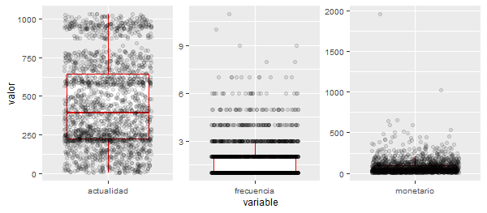
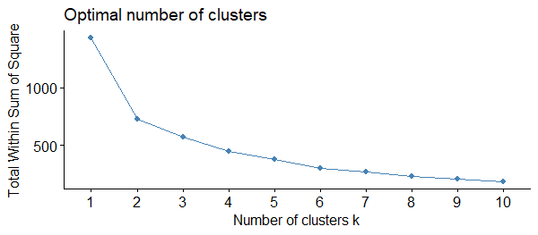
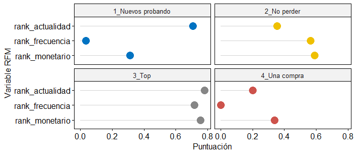

# Segmentación de clientes en el comerico minorista {#cap-rfm}

*Jaime Fierro Martín*$^{a}$, *Rocío González Martínez*$^{a}$ y *Cristina Sánchez Figueroa*$^{b}$

$^{a}$Analyticae, SL  
$^{b}$Universidad Nacional de Educación a Distancia


## Motivación y conceptos clave

Los comercios minoristas (*retailers*) se mueven en un entorno
turbulento y necesitan acercarse a sus clientes para asegurar su
supervivencia. Su producto, o servicio, es nexo clave en dicho proceso.
En este contexto, conocer el **perfil de los
clientes**\index{perfil de los clientes} permitirá detectar en qué
momento de su ciclo de vida con la empresa se encuentran y desarrollar
propuestas de valor que convengan en cada momento.

**Segmentar** \index{segmentar}se define como el proceso de dividir a
los clientes, actuales o potenciales, en diferentes grupos o segmentos
consistentes en individuos con características y niveles similares de
interés (véase el Cap. \@ref(no-jerarquico)) para una explicación detallada de 
las técnicas del clúster no jerárquico). Es un proceso creativo e iterativo con el fin de satisfacer con
mayor acierto las necesidades de los clientes, proporcionando una
ventaja competitiva y sostenible a la compañía. La segmentación viene
dada por las necesidades de los clientes, no de la compañía, y debería
ser revisada periódicamente.

Este caso práctico de negocio está basado en un proyecto real impulsado
por el departamento de marketing de una empresa del sector *retail* que
necesitaba mejorar el conocimiento de sus clientes, agrupándolos en
función de su comportamiento de compra. Los resultados obtenidos fueron
clave para definir la estrategia de marketing relacional de la compañía.

## El modelo RFM tradicional 

El **modelo RFM** (*recency*, *frequency*, *monetary*) \index{modelo RFM} es una técnica popular que se
utiliza para analizar el comportamiento de compra de los clientes: cómo
compran, su frecuencia de compra y cuánto gastan. Es un método útil para
enriquecer la segmentación de los clientes en varios grupos que permitan
la personalización e identificación de los clientes más proclives a
responder a las promociones. El análisis RFM depende de las medidas de
actualidad **(*recency*)**\index{recency} (R), frecuencia
**(*frequency*)**\index{frequency} (F) y valor monetario
 **(*monetary*)**\index{monetary} (M), que son tres importantes
variables relacionadas con la compra que influyen en las posibilidades
de compra futura de los clientes.

El **modelo RFM tradicional** categoriza el valor de las variables
dividiéndolas en quintiles, a partir de los cuales se calcula una
puntuación única que representa el valor del cliente. Sin embargo, no es
muy preciso. Si el intervalo de frecuencia de compras se fija entre 0 y
20, en términos de negocio podría interpretarse como que un cliente con
una sola compra será igual que otro que tenga 20. Por ello, os enfoques
de conjuntos clásicos pueden resultar poco funcionales
[@martinez2019comparison]. En este caso práctico, se propone una mejora
en la definición de los intervalos mediante la aplicación del **ranking
de percentiles**\index{ranking de percentiles}. Este método, que se ha
denominado **modelo RFM extendido**, proporciona un procedimiento robusto para
tratar los valores atípicos (*outliers*) y además normaliza las
variables entre 0 y 1 para evitar la diferencias de peso entre las
variables, permitiendo así la correcta implementación del **algoritmo de
segmentación**.

## El modelo RFM extendido

Los autores de este caso práctico recomiendan seguir una metodología de
gestión de proyectos. La **metodología
CRISP-DM**\index{metodología!CRISP-DM} [@chapman2000crisp], presentada
en el Cap. \@ref(metodologia), es un estándar ampliamente utilizado
en los proyectos de ciencia de datos.

Una vez definido el problema (mejorar el conocimiento que una empresa de
comercio minorista tiene de sus clientes, agrupándolos en función de su
comportamiento de compra), la recopilación y comprensión de los datos
(primera etapa del modelo CRISP-DM) se establece como etapa esencial
para el desarrollo del proyecto.

### Recopilación y comprensión de los datos

Hoy en día, la mayoría de las empresas de *e-commerce* y comercio
minorista tradicional cuentan con sistemas que permiten registrar los
datos básicos de cada una de sus ventas (fecha, artículo, cantidad e
importe), asociados a un código único de cliente. La información
contenida en estos datos de compra atesora gran valor, ya que carecen
del sesgo y subjetividad propias de otras informaciones obtenidas
mediante encuestas de opinión, estudios de mercado, entrevistas y grupos
de discusión, etc. Estos datos suelen encontrarse en las plataformas ERP
(*Enterprise Resource Planning*) de gestión de pedidos y ventas o CRM
(*Customer Relationship Management*) de las empresas.

El lector es, o será, consciente de que la fase de extracción, carga y
limpieza de los datos es la más exigente del proyecto, y donde se
empleará gran parte de los recursos y tiempo de todo el proyecto. **R**
cuenta con gran cantidad de paquetes y recursos que facilitan la
extracción desde diferentes tipos de bases de datos.

Para este caso práctico serán necesarias las siguientes librerías:


```r
library("tidyverse")
library("lubridate")
library("factoextra")
library("ggpubr")
library("CDR")
data("datos_retail")
```

Cualquier tipo de estudio o proyecto de ciencia de datos requiere
familiarizarse con los datos y determinar si presentan suficiente
exactitud, completitud, consistencia, credibilidad y actualidad
[@munoz2018calidad]. Los datos de transacciones de venta registrados por
las empresas pueden contener valores perdidos,
inexactos, *outliers*, etc. Para determinar la acción a tomar, o no, de
limpieza o corrección de los datos de partida, es esencial conocer el
negocio y las consecuencias que éstas operaciones tendrán en el
resultado final de la segmentación.

El conjunto de datos de muestra contiene 200.000 observaciones
correspondientes a transacciones de compra. Las siguientes variables
iniciales están explicadas en el set de datos:


```r
head(datos_retail)
#> # A tibble: 6 x 4
#> id_ticket fecha importe_venta codigo_socio
#> <chr> <date> <dbl> <chr>
#> 1 num_1646673 2021-10-30 12.4 id_1076134
#> 2 num_2762559 2021-12-03 38.8 id_0552641
#> 3 num_0309422 2022-01-07 67.8 id_0537369
```

### Cálculo de las variables del modelo RFM

Identificadas las variables iniciales, es necesario calcular los
factores clave del modelo RFM:

-   La variable actualidad, *recency* (R), es el intervalo de tiempo
    transcurrido desde la última compra de un cliente hasta la fecha de
    elaboración del modelo RFM.

-   La variable frecuencia, *frequency* (F), se obtiene agrupando las
    compras por cliente y contando el número total de tickets únicos.

-   La variable valor monetario, *monetary* (M), se calcula sumando
    todos los importes de venta por cliente.


```r
fecha_estudio_rfm <- ymd("2022-08-01")

rfm <- datos_retail |>
  group_by(codigo_socio) |>
  summarise(
    frecuencia = n_distinct(id_ticket),
    monetario = sum(importe_venta, na.rm = TRUE),
    fecha_transaccion_reciente = first(fecha, order_by = desc(fecha))
  ) |>
  mutate(actualidad = time_length(interval(start = fecha_transaccion_reciente, end = fecha_estudio_rfm), unit = "days"), .keep = "unused")
```


```r
head(rfm) # el lector puede ver las variables del Modelo RFM
```

### Breve análisis exploratorio de las variables del modelo RFM

Del análisis puede concluirse que:

-   107.929 clientes han realizado una media de 1,85 compras, con un
    importe medio total de 70,56€ y 450,4 días de media desde la última
    compra hasta la fecha de realización del estudio, con una fuerte
    asimetría positiva de los valores *frequency* y *monetary* (véase Fig. \@ref(fig:imagen1)).

-   Se detecta una gran estacionalidad de las compras, como se puede
    apreciar en la agrupación de las observaciones de *recency*.
    Teniendo en cuenta la fecha en la que ser realiza el análisis, los
    valores obtenidos en la variable *recency* se pueden interpretar
    como el periodo de ventas de la campaña navideña.


```r
set.seed(12345)
plot_data <- rfm |>
  slice_sample(n = 2000) |>
  pivot_longer(!codigo_socio, names_to = "variable", values_to = "valor")
plot_data |>
  ggplot(aes(x = variable, y = valor)) +
  geom_boxplot(outlier.shape = NA, color = "red") +
  geom_jitter(alpha = 1 / 10) +
  facet_wrap(~variable, ncol = 6, scales = "free") +
  theme(strip.text.x = element_blank(), text = element_text(size = 9))
```

<div class="figure" style="text-align: center">

<p class="caption">(\#fig:imagen1)Box-plot de las variables RFM.</p>
</div>

### Cálculo del ranking de percentiles

Los valores de ranking son relativos entre clientes y no pueden ser
utilizados para objetivos de negocio, basados en valores absolutos de
puntuación por cliente.


```r
rfm_rank <- rfm |>
  mutate(across(.cols = c("frecuencia", "monetario"), percent_rank, .names = "rank_{.col}")) |>
  mutate(across(.cols = c("actualidad"), ~ percent_rank(-.x), .names = "rank_{.col}")) # menor recency indica mayor puntuación en rank
```

Se podría decir que el análisis RFM combina tres atributos clave de los
clientes para construir un ranking que permite agruparlos de forma útil
para el negocio. Así, a un cliente que compró en una fecha reciente
(*recency*) se le otorgan más puntos. Si compró muchas veces (*frecuency*),
también se le coloca más arriba en el ranking. Finalmente, si gastó más
en el total de sus compras (*Monetary*), también se le puntúa más alto.
Combinando estas tres puntuaciones se obtiene un ranking RFM. Para la
elaboración de este ranking se parte del concepto de percentil. La idea
es asignar a cada cliente una puntuación según las tres variables o
factores clave del modelo RFM, de modo que los mejores clientes serán
los que tengan una puntuación mayor.


```r
head(rfm_rank) # el lector puede ver la puntuación del ranking
```

Una vez que se tienen los rankings de percentiles en las tres variables
para todos los clientes, se procede a su clusterización mediante el
método *k*-means.

### Modelado: RFM mediante *k*-means

El modelo establecido debe proporcionar una segmentación de clientes con
sentido de negocio. En este caso práctico se opta por el algoritmo de
clustering estándar que presenta la ventaja de que es muy intuitivo y
permite trabajar con grandes conjuntos de datos. Como el lector ha
podido comprobar en la Parte VI de este manual, existen otros muchos algoritmos de aprendizaje no
supervisado que pueden ser empleados.

El número óptimo de clústeres (o segmentos, en la jerga del marketing)
es uno de los retos a la hora de aplicar técnicas de *clustering*. No
existe una manera exclusiva de encontrar el número adecuado de clusters.
Se trata de un proceso subjetivo que depende de los datos, del tipo de
*clustering* empleado y, en este caso, de que el número elegido tenga
sentido y utilidad en el negocio. Existen numerosos métodos para
facilitar la elección del número de clústeres; entre ellos destacan el
*Elbow method,* el *Average silhouette method* y el *Gap statistic
method* (véase Cap.\@ref(no-jerarquico)), que  se pueden calcular con la función `fviz_nbclust()` del paquete
`factoextra` para realizar una buena
elección.

Con el método Elbow, el número óptimo de clústeres se calcula como sigue:


```r
set.seed(123)
muestra_clusters <- rfm_rank |>
  slice_sample(n = 5000) |>
  select(matches("rank"))

fviz_nbclust(x = muestra_clusters, FUNcluster = kmeans, method = "wss", k.max = 10)
```

<div class="figure" style="text-align: center">

<p class="caption">(\#fig:imagen2)Número óptimo de clusters (método Elbow).</p>
</div>

En la Fig. \@ref(fig:imagen2) se observa que la varianza total *intra-cluster* apenas mejora a partir
del cuarto *cluster*.

El algoritmo de clustering $k$-means se entrena con las variables R-F-M
normalizadas con el ranking. La salida de la función `kmeans()` del
paquete base `stats` es un objeto que, entre otros componentes, ofrece
un vector numérico indicativo del clúster al que pertenece cada uno
de los clientes.


```r
set.seed(123)
km_fit <- kmeans(x = rfm_rank[, 5:7], centers = 4, nstart = 10)

clientes_segmentos <- rfm_rank |>
  mutate(segmento = km_fit$cluster)
```


```r
head(clientes_segmentos) # el lector puede ver el segmento al que pertence el cliente
```

### Descriptivos e interpretación de los segmentos

Los segmentos obtenidos deben tener sentido y utilidad de negocio. Para
ello es imprescindible proporcionar los estadísticos descriptivos de
cada segmento y proceder a su interpretación de perfil de cliente.


```r
descriptivo_segmentos <- clientes_segmentos |>
  group_by(segmento) |>
  summarise(across(c("monetario", "frecuencia", "actualidad"),
    .fns = mean, .names = "md_{.col}" ), n_clientes = n()) |>
  ungroup() |>
  relocate(segmento, n_clientes)

head(descriptivo_segmentos)
#> # A tibble: 4 x 5
#> segmento n_clientes md_monetario md_frecuencia md_actualidad
#> <int> <int> <dbl> <dbl> <dbl>
#> 1 1 23551 36.2 1.07 239.
#> 2 2 23632 77.0 2.26 567.
#> 3 3 28809 128. 3.11 188.
#> 4 4 31937 39.3 1.00 757.
```

Interpretación de los segmentos:

-   1-*Nuevos probando*: segmento que agrupa nuevos clientes que están
    realizando compras desde hace poco tiempo y tienen un gran potencial
    de desarrollo. Es un segmento de clientes con interés para la
    empresa.
-   2-*No podemos perder*: se trata de los clientes *churn*[^segmentacion-1] que
    fueron buenos clientes en términos monetarios y de frecuencia pero
    que hace tiempo que no realizan nuevas compras. La compañía debe
    hacer un esfuerzo en recuperar estos clientes para convertirlos al
    segmento TOP.
-   3-*Top*: reúne a los mejores clientes de la empresa. Son clientes
    que compran con frecuencia, están activos y aportan ventas a la
    compañía. Es el segmento de clientes con mayor interés para la
    empresa.
-   4-*Una compra*: segmento formado por aquellos clientes que han
    realizado una única compra hace tiempo. Presentan frecuencia,
    actualidad y valor monetario bajo. Se trata de un segmento de
    clientes con escaso interés para la compañía.

[^segmentacion-1]: El término *customer churn* se suele traducir como perdida de
    clientes o rotación de clientes. Se compone de las palabras inglesas
    *change* (en castellano cambio) y *turn* (en castellano abandonar).


```r
segmentos_descriptivo <- clientes_segmentos |>
  mutate(segmento = case_when(
    segmento == 1 ~ "1_Nuevos probando",
    segmento == 2 ~ "2_No perder",
    segmento == 3 ~ "3_Top",
    segmento == 4 ~ "4_Una compra")) |>
  group_by(segmento) |>
  summarise(across( .cols = where(is.numeric), .fns = mean),
            n_clientes = n()) |>
  ungroup() |>
  relocate(segmento, n_clientes)

table_dot_plot <- segmentos_descriptivo |>
  pivot_longer(cols = c("rank_monetario", "rank_frecuencia", "rank_actualidad"), names_to = "Variable RFM", values_to = "Puntuación")

ggdotchart(table_dot_plot, x = "Variable RFM", y = "Puntuación",
  group = "segmento", color = "segmento", palette = "jco",
  add = "segment", position = position_dodge(0.3),
  sorting = "none", facet.by = "segmento", dot.size = 5,
  rotate = TRUE, legend = "none")
```

La Fig \@ref(fig:imagen3) muestra cada uno de los segmentos indicados. El ranking obtenido ayuda a identificar las diferencias en los tipos de clientes y es útil para decidir a qué segmentos enfocarse y qué estrategias usar para cada uno.

<div class="figure" style="text-align: center">

<p class="caption">(\#fig:imagen3)Lollipop de variables RFM.</p>
</div>

### Puesta en producción

Calculado el modelo RFM $k$-means, la compañía puede incorporar
periódicamente los datos de los clientes nuevos o actualizarlos. De este
modo, los segmentos de clientes se actualizarán y, más allá de las
acciones de *marketing mix* que realicen las compañías gracias a la
segmentación, podrán analizarse las migraciones de clientes entre los
diferentes segmentos en el periodo estudiado. La función `cl_predict()`
facilita la actualización periódica de los segmentos con el modelo
entrenado.


