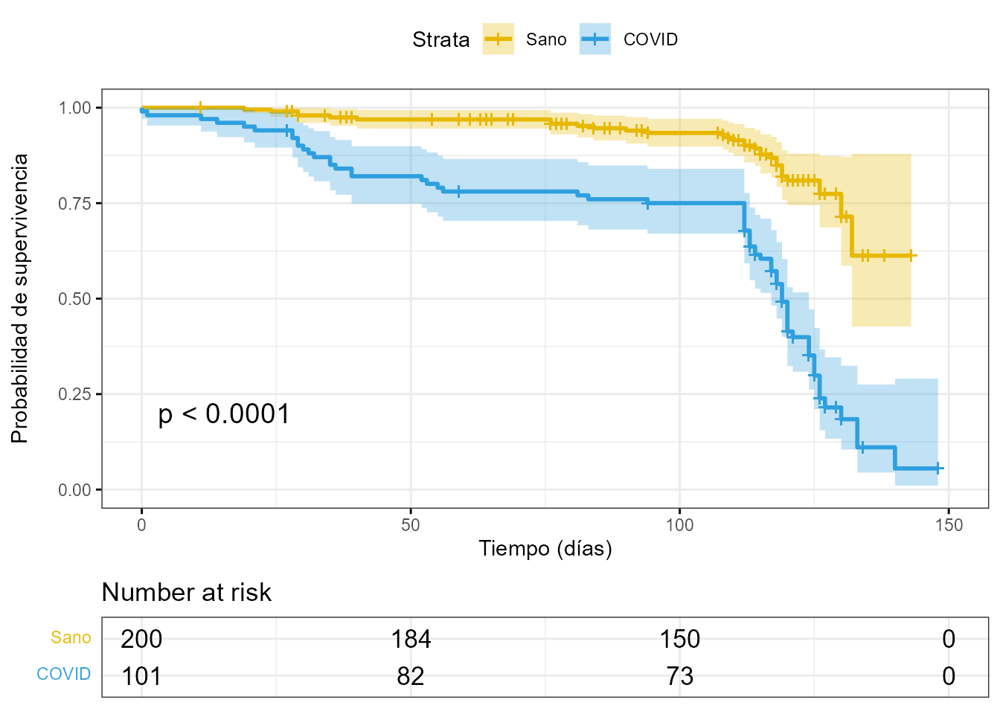

# Análisis de datos en medicina {#cap-medicina}

*Alberto M. Borobia*$^{a}$ y *María Jiménez-González*$^{a}$

$^{a}$Hospital Universitario La Paz - IdiPAZ


## Justificación 

La aplicación de la estadística en la investigación clínica ha sido una de las herramientas clave en los últimos dos años. La enfermedad por coronavirus (COVID-19) es una enfermedad infecciosa provocada por el virus SARS-CoV-2 que causó una pandemia mundial.
Durante el año 2020, más de 13 millones de casos diagnosticados en España arrojaban un diagnóstico claro: se necesitaba más investigación. 

El primer apartado de este capítulo señala la importancia de la identificación de los sesgos (en concreto, del sesgo de selección) que aparecen en los estudios de investigación no aleatorizados. Tras ello, se aborda un ejemplo práctico de una de las aplicaciones más significativas de la bioestadística: el análisis de supervivencia, con el que se contestan preguntas tan importantes como: ¿qué factores de riesgo están asociados a la mortalidad provocada por coronavirus?
\index{coronavirus}
\index{bioestadística}
\index{COVID-19}
\index{virus SARS-CoV-2}


## Datos en investigación clínica y ensayos clínicos

Se abordarán tres tipos de análisis a partir de los conjuntos de datos `datos_observacional` y `datos_supervivencia`, incluidos en el paquete `CDR` de este manual: (i) eliminación de sesgos, o más concretamente, la eliminación del sesgo de selección; (ii) estimación e interpretación de las curvas de supervivencia; y (iii) estimación e interpretación de la regresión de Cox.


### ¿Qué es un ensayo clínico?
\index{ensayo clínico}
\index{estudio observacional}

En la investigación clínica existen dos tipos de estudios: **ensayos clínicos** y **estudios observacionales**. Los ensayos clínicos aleatorios son el diseño experimental óptimo para proporcionar evidencia, eficacia y seguridad de una intervención [@Lium3164]. En este tipo de diseño, los tratamientos estudiados o investigados son asignados aleatoriamente a distintos grupos, lo que permitirá afirmar que las diferencias en los resultados después del tratamiento, si es que las hay, reflejen los efectos de dichos tratamientos y no de otras características de los individuos participantes en el ensayo [@rosenbaum2005observational]. Cuando estas condiciones ideales no son posibles (falta de recursos, financiación, tiempo, etc.), ya no se habla de ensayos clínicos aleatorizados, sino de estudios observacionales.

Previo a la puesta en marcha de un ensayo clínico, es imprescindible la redacción de un **protocolo** y un **plan de análisis estadístico (PAE)**. El protocolo, elaborado por los investigadores del estudio, precisa y justifica los métodos y planes del proceso que se llevará a cabo en el ensayo clínico [@rivera2020guidelines]; el PAE detalla las características principales del análisis estadístico de los datos, que deben describirse en la sección estadística del protocolo [@lewis1999statistical].

Los trabajos anteriormente mencionados, y el resto de directrices necesarias para un ensayo clínico, están regulados por la *Conferencia Internacional sobre Armonización de Requisitos Técnicos para el Registro de Productos Farmacéuticos para Uso Humano* (ICH, por sus siglas en inglés).


### Limitaciones de los estudios observacionales

En la sección anterior se puso de manifiesto la importancia de los ensayos clínicos aleatorizados. Sin embargo, la posible falta de recursos, financiación, tiempo o materiales dificultan la puesta en marcha y realización de los mismos. En consecuencia, la puesta en práctica de la investigación puede no ser la ideal. Los estudios observacionales, sin embargo, son una herramienta elemental en circunstancias no tan óptimas, ya que permiten analizar e investigar (contra viento y marea).

La limitación principal de los estudios observacionales es que introducen sesgos en el análisis. Los ensayos clínicos tienen como principal objetivo eliminar el **sesgo de selección**: cuando los sujetos no son asignados aleatoriamente, los resultados diferentes con distintos tratamientos pueden reflejar diferencias en las características del pacientes en lugar del efecto de los tratamientos [@rosenbaum2005observational]. 


Abundando en la cuestión, a la hora de valorar el efecto de un tratamiento determinado en la evolución de los pacientes, el diseño ideal es el del estudio aleatorizado. Si la decisión sobre quién recibirá o no el tratamiento no es aleatoria, las conclusiones que se obtengan del análisis no serán fiables porque pueden estar influidas por otros factores vinculados con la evolución del paciente (variables confusoras) que, en realidad,  son los verdaderos responsables de dicha evolución y no el tratamiento.

Por ejemplo, si para determinar si es mejor cirugía o tratamiento médico se aplica cirugía a los pacientes más jóvenes y con menos comorbilidades y tratamiento médico a los más enfermos, no se podrá concluir posteriormente que la mejor evolución de los pacientes corresponde a la cirugía, porque dicha mejor evolución podría deberse a las diferencias en el patrón de covariables.

La aleatorización, al asegurar que las características basales conocidas y las desconocidas son similares en los pacientes a los que se les aplica cirugía y en aquellos a los que se le aplica tratamiento médico, elimina, en principio, el sesgo de selección, y permite afirmar que si hay diferencias en la evolución de los pacientes con cirugía y con tratamiento médico, dichas diferencias se deben precisamente a la forma de tratar a esos pacientes.

\index{sesgo!de selección}
\index{indice@índice!de propensión}

### Índice de propensión

Una solución aconsejable y recomendable ante los sesgos "escondidos" en los estudios observacionales es utilizar la técnica del **índice de propensión** (*propensity score*). El índice de propensión  normalmente se formula en forma de probabilidad condicionada. Hablando en términos de pacientes a los que se les puede aplicar cirugía o tratamiento médico, es una forma de expresar en términos probabilísticos si el reparto de pacientes entre ambos grupos (cirugía y tratamiento) se ha hecho homogéneamente o no respecto a una serie de variables confusoras que podrían provocar una mala interpretación del resultado obtenido.

En concreto se trata de contrastar dos probabilidades. Utilizando el ejemplo de cirugía o tratamiento médico, la primera probabilidad es P(Ser sometido a una cirugía | Ciertos valores de las variables confusoras) mientras que la segunda es 
P(Ser sometido a cirugía). Si ambas probabilidades son iguales, entonces los valores de las variables confusoras están repartidos más o menos igualmente entre el grupo de pacientes al que se le aplica cirugía y el grupo al que se le aplica tratamiento médico. En caso de ser distintas, dicho reparto sería heterogéneo y, en consecuencia, debería reconducirse la muestra para conseguir una situación de homogeneidad.

La pregunta que surge ahora es ¿cómo se consigue dicha homogeneización?[^Note-medicina-1] Se pueden contemplar tres modalidades básicas: $(i)$ emparejamiento (*matching*); $(ii)$ estratificación y $(iii)$ regresión logística.

[^Note-medicina-1]: Para profundizar en esta cuestión, así como en el concepto de índice de propensión, véase [https://jllopisperez.com/2013/03/04/tema-24-analisis-de-propensiones-propensity-score-analysis/](https://jllopisperez.com/2013/03/04/tema-24-analisis-de-propensiones-propensity-score-analysis/).

El emparejamiento consiste en seleccionar entre los grupos en función del posicionamiento de los puntos en el espacio de tantas dimensiones como variables se quieran contemplar en el estudio. La estratificación, como su propio nombre indica, consiste en  crear estratos, es decir, subconjuntos en cada uno de los grupos que sean homogéneos entre sí. Posteriormente se mezclan los estratos y se deja fuera a los individuos que no encajen en esos estratos. Para construir los estratos se utiliza el análisis clúster. Se trata de elegir estratos generados a través del dendrograma, estratos homogéneos que tengan representantes de los dos grupos que se quieran comparar y que, al estar cerca en el dendrograma, tendrán propensiones similares. La tercera modalidad consiste en hacer una regresión logística con variable respuesta dicotómica: ser de un grupo (por ejemplo, cirugía) o del otro (tratamiento médico), y como variables independientes, las variables confusoras. Y se trata, entonces, de ver cómo se comportan los coeficientes de esa regresión. Cuando los coeficientes de la regresión logística no sean significativos los grupos serán homogéneos.


### Ejemplo práctico en **R** de un estudio observacional

El dataset sintético `datos_observacional` contenido en la librería `CDR` del libro contiene los datos de un hipotético estudio observacional sobre coronavirus a partir de personas hospitalizadas por dicha enfermedad. El objetivo del estudio es analizar los factores de riesgo asociados a la mortalidad causada por dicha enfermedad.


```r
library("CDR")
library("kableExtra")
library("dplyr")
datos_observacional <- datos_observacional |>
  mutate(comorbilidades = recode(comorbilidades,
                                 `1 o más comorbilidades` = "1 o más", No = "No"))
head(datos_observacional, 3)
#> # A tibble: 3 × 8
#>      ID fecha_hospitalizacion sexo    edad comorbilidades fecha_alta exitus
#>   <dbl> <dttm>                <chr>  <dbl> <chr>          <chr>       <dbl>
#> 1     1 2015-04-17 00:00:00   Mujer     76 1 o más        17/04/2020      1
#> 2     2 2015-03-21 00:00:00   Mujer     64 1 o más        31/03/2020      0
#> 3     3 2015-04-09 00:00:00   Hombre    65 1 o más        16/04/2020      0
#> # ℹ 1 more variable: fecha_exitus <dttm>
```


En la literatura sobre la cuestión, se ha evidenciado que las mujeres de mayor edad y con una o más comorbilidades tienen más riesgo de fallecer (*exitus*) por coronavirus. En investigación, la estructura de
los resultados en un *paper* o en un informe estadístico, independientemente de la revista o PAE,
comienza en el mismo punto: una tabla resumen de las características basales de la población
objeto de estudio. El paquete `tableone` (sencillo juego de palabras) integra funciones específicas para la creación de dichas tablas. La función principal de este paquete es `CreateTableOne()`.


```r
library("tableone")
my_vars <- c("sexo", "edad", "comorbilidades")
nonnormal <- c("edad")
factor_vars <- c("sexo", "comorbilidades")

# crea la tabla
tab1 <- CreateTableOne(
  vars = my_vars, factorVars = factor_vars,
  strata = "exitus", data = datos_observacional
)

# imprime la tabla
tab1 <- print(tab1,
  showAllLevels = TRUE, formatOptions = list(big.mark = ","),
  exact = "stage", nonnormal = nonnormal
)
```


Para presentar la tabla de resultados formateada basta con usar la función `kable()`:


```r
add_footnote(knitr::kable(tab1[,-5], booktabs=TRUE,
                          caption = "Características basales de la población",
                          col.names = c("Nivel","Vivo", "Exitus","p-valor")),
             c("Median = Mediana","IQR = Rango intercuartílico"), notation = "number")
```

<table>
<caption>(\#tab:tabla1)Características basales de la población</caption>
 <thead>
  <tr>
   <th style="text-align:left;">   </th>
   <th style="text-align:left;"> Nivel </th>
   <th style="text-align:left;"> Vivo </th>
   <th style="text-align:left;"> Exitus </th>
   <th style="text-align:left;"> p-valor </th>
  </tr>
 </thead>
<tbody>
  <tr>
   <td style="text-align:left;"> n </td>
   <td style="text-align:left;">  </td>
   <td style="text-align:left;"> 79 </td>
   <td style="text-align:left;"> 21 </td>
   <td style="text-align:left;">  </td>
  </tr>
  <tr>
   <td style="text-align:left;"> sexo (%) </td>
   <td style="text-align:left;"> Hombre </td>
   <td style="text-align:left;"> 28 (35.4) </td>
   <td style="text-align:left;"> 2 ( 9.5) </td>
   <td style="text-align:left;"> 0.042 </td>
  </tr>
  <tr>
   <td style="text-align:left;">  </td>
   <td style="text-align:left;"> Mujer </td>
   <td style="text-align:left;"> 51 (64.6) </td>
   <td style="text-align:left;"> 19 (90.5) </td>
   <td style="text-align:left;">  </td>
  </tr>
  <tr>
   <td style="text-align:left;"> edad (median [IQR]) </td>
   <td style="text-align:left;">  </td>
   <td style="text-align:left;"> 64.00 [53.00, 73.00] </td>
   <td style="text-align:left;"> 82.00 [72.00, 85.00] </td>
   <td style="text-align:left;"> &lt;0.001 </td>
  </tr>
  <tr>
   <td style="text-align:left;"> comorbilidades (%) </td>
   <td style="text-align:left;"> 1 o más </td>
   <td style="text-align:left;"> 43 (54.4) </td>
   <td style="text-align:left;"> 18 (85.7) </td>
   <td style="text-align:left;"> 0.018 </td>
  </tr>
  <tr>
   <td style="text-align:left;">  </td>
   <td style="text-align:left;"> No </td>
   <td style="text-align:left;"> 36 (45.6) </td>
   <td style="text-align:left;"> 3 (14.3) </td>
   <td style="text-align:left;">  </td>
  </tr>
</tbody>
<tfoot>
<tr>
<td style = 'padding: 0; border:0;' colspan='100%'><sup>1</sup> Median = Mediana</td>
</tr>
<tr>
<td style = 'padding: 0; border:0;' colspan='100%'><sup>2</sup> IQR = Rango intercuartílico</td>
</tr>
</tfoot>
</table>


La Tabla \@ref(tab:tabla1) confirma los resultados anteriormente publicados en la literatura: el sesgo de selección que provoca el desequilibrio en los totales marginales de los dos niveles la variable principal (`exitus`) en las variables `sexo`, `edad` y `comorbilidades` se evidencia a través de la significación de estas.[^Note-medicina-significacion] Por consiguiente, para llevar a cabo cualquier análisis estadístico de los datos, por ejemplo, para estimar un modelo predictivo, se hace absolutamente necesaria la aplicación del índice de propensión; en otro caso, los resultados no serán fiables. 

[^Note-medicina-significacion]: Esto ocurre porque el *p*-valor combina la magnitud de la relación observada entre una variable explicativa y la variable respuesta con la cantidad de información disponible. Por eso, una relación puede ser no significativa porque realmente la relación sea inexistente o bien porque se posee poca información (muestra insuficiente) para considerar una determinada relación como significativa. Y al contrario, cuando existe mucha información, aunque la relación no exista, puede salir significativa debido a la gran cantidad de información disponible.


El paquete `MatchIt` integra las funciones principales para la aplicación del índice de propensión. Concretamente, la función `matchit()` integra la teoría de @ho2007matching para el emparejamiento óptimo de los grupos estudiados. Los argumentos más importantes de esta función son:

  - `formula`: modelo de regresión que estudia la relación entre la variable dependiente (*exitus*) con las variables sesgadas (sexo, edad y comorbilidades).
    
  - `method`: especifica el método de emparejamiento (*matching*). 
  
  - `distance`: especifica el método para la estimación del índice de propensión.

La función `get_matches()` empareja las coincidencias que resultan del `MatchIt`.

::: {.infobox data-latex=""}
**Nota**

Es imprescindible que los casos del dataset estén completos. 
:::


```r
library("MatchIt")
match <- matchit(exitus ~ edad + as.factor(sexo) + as.factor(comorbilidades),
  method = "nearest", distance = "mahalanobis",
  data = datos_observacional
)
datos_observacional_match <- get_matches(match, datos_observacional)
```

Para comprobar que el sesgo de selección ha desaparecido, se reproduce la Tabla \@ref(tab:tabla1).


```r
tab1_corregida <- CreateTableOne(
  vars = my_vars, factorVars = factor_vars,
  strata = "exitus", data = datos_observacional_match
)

# se imprime en el objeto tab1_corregida
tab1_corregida <- print(tab1_corregida,
  showAllLevels = TRUE, formatOptions = list(big.mark = ","),
  exact = "stage", nonnormal = nonnormal
)
```

Se formatea la salida de la tabla con el siguiente código. En la Tabla \@ref(tab:tab1-corregida) se observa que el sesgo de selección existente en la muestra se ha resuelto equilibrando las variables (aunque reduciendo la muestra). Tras este paso previo, podría realizarse un análisis estándar de esta muestra intentando aproximarse lo máximo posible a un estudio aleatorizado.


```r
add_footnote(knitr::kable(tab1_corregida[,-5], booktabs=TRUE,
                          caption = "Características basales de la población tras la aplicación del índice de propensión",                           col.names = c("Nivel","Vivo", "Exitus","p-valor")),
             c("Median = Mediana","IQR = Rango intercuartílico"), notation = "number")
```

<table>
<caption>(\#tab:tab1-corregida)Características basales de la población tras la aplicación del índice de propensión</caption>
 <thead>
  <tr>
   <th style="text-align:left;">   </th>
   <th style="text-align:left;"> Nivel </th>
   <th style="text-align:left;"> Vivo </th>
   <th style="text-align:left;"> Exitus </th>
   <th style="text-align:left;"> p-valor </th>
  </tr>
 </thead>
<tbody>
  <tr>
   <td style="text-align:left;"> n </td>
   <td style="text-align:left;">  </td>
   <td style="text-align:left;"> 21 </td>
   <td style="text-align:left;"> 21 </td>
   <td style="text-align:left;">  </td>
  </tr>
  <tr>
   <td style="text-align:left;"> sexo (%) </td>
   <td style="text-align:left;"> Hombre </td>
   <td style="text-align:left;"> 2 ( 9.5) </td>
   <td style="text-align:left;"> 2 ( 9.5) </td>
   <td style="text-align:left;"> 1.000 </td>
  </tr>
  <tr>
   <td style="text-align:left;">  </td>
   <td style="text-align:left;"> Mujer </td>
   <td style="text-align:left;"> 19 (90.5) </td>
   <td style="text-align:left;"> 19 (90.5) </td>
   <td style="text-align:left;">  </td>
  </tr>
  <tr>
   <td style="text-align:left;"> edad (median [IQR]) </td>
   <td style="text-align:left;">  </td>
   <td style="text-align:left;"> 72.00 [69.00, 84.00] </td>
   <td style="text-align:left;"> 82.00 [72.00, 85.00] </td>
   <td style="text-align:left;"> 0.182 </td>
  </tr>
  <tr>
   <td style="text-align:left;"> comorbilidades (%) </td>
   <td style="text-align:left;"> 1 o más </td>
   <td style="text-align:left;"> 18 (85.7) </td>
   <td style="text-align:left;"> 18 (85.7) </td>
   <td style="text-align:left;"> 1.000 </td>
  </tr>
  <tr>
   <td style="text-align:left;">  </td>
   <td style="text-align:left;"> No </td>
   <td style="text-align:left;"> 3 (14.3) </td>
   <td style="text-align:left;"> 3 (14.3) </td>
   <td style="text-align:left;">  </td>
  </tr>
</tbody>
<tfoot>
<tr>
<td style = 'padding: 0; border:0;' colspan='100%'><sup>1</sup> Median = Mediana</td>
</tr>
<tr>
<td style = 'padding: 0; border:0;' colspan='100%'><sup>2</sup> IQR = Rango intercuartílico</td>
</tr>
</tfoot>
</table>


## Análisis de supervivencia

Durante la pandemia ocasionada por el SARS-CoV-2, la pregunta principal de los investigadores clínicos se centró en un mismo objetivo: los factores de riesgo asociados a la mortalidad causada por COVID-19. El análisis de supervivencia ha permitido a los investigadores detectar las causas que hay detrás de una mayor probabilidad de fallecer. El análisis de supervivencia permite estudiar los factores de riesgo asociados a la mortalidad. La ventaja principal de este análisis frente a un análisis estándar (como puede ser una regresión logística) es la integración en la variable respuesta del evento y del tiempo hasta el evento, que tiene como consecuencia la interpretación de los resultados en términos de riesgo y no de probabilidad.
\index{riesgo}
\index{análisis!de supervivencia}


El dataset utilizado, `datos_supervivencia`, está incluido en el paquete `CDR` y está formado por 301 pacientes, 101 diagnosticados con infección por SARS-CoV-2 y 100 *exitus*.


```r
head(datos_supervivencia, 3)
#> # A tibble: 3 × 7
#>      id EXITUS_TIME DIAG_COVID EXITUS N_COMORBIDITIES SEX     EDAD
#>   <dbl>       <dbl>      <dbl>  <dbl>           <dbl> <chr>  <dbl>
#> 1   262           0          1      1               5 Hombre    83
#> 2   236           1          1      1               5 Hombre    72
#> 3   170          11          0      0               2 Mujer     65
```


### Estimación y comparación de curvas de supervivencia

La **función (o curva) de supervivencia** estudia la probabilidad de que el paciente o sujeto sobreviva a un tiempo X. El estimador más utilizado para el ajuste de la función de supervivencia es el estimador no paramétrico de **Kaplan-Meier** y su función escalonada. Una vez generadas estas curvas de supervivencia, existen diferentes métodos (paramétricos y no paramétricos) para su comparación. En este apartado, se utiliza el **test de Mantel-Cox** (o **test** ***log-rank***) para el contraste de funciones.

Los paquetes `survival` y `survminer` integran las funciones principales de la técnica:

- `survival::Surv()` crea un objeto de supervivencia formado por el evento (*exitus*) y el tiempo hasta la ocurrencia del evento;

- `survival::survfit()` estima la función de supervivencia mediante el método Kaplan-Meier del objeto `Surv` y los factores de riesgo asociados;

- la función `ggsurvplot()` genera el gráfico de la curva de supervivencia (basada en la librería `ggplot2`). El argumento principal de la función es la función de supervivencia estimada, `survfit()`. Los argumentos más importantes (y recomendables) a la hora de graficar la función de supervivencia son: `pval`, que muestra el $p$-valor correspondiente al test *log-rank*; `conf.int` que muestra los intervalos de confianza de la(s) curva(s) de supervivencia y `risk.table`, que añade el número de sujetos (absoluto o relativo) en riesgo en cada momento del período objeto de estudio.

Se cargan los paquetes:

```r
library("survival")
library("survminer")
```

Se ajusta el modelo y, posteriormente, se representa:

```r
fit <- survfit(Surv(EXITUS_TIME, EXITUS) ~ DIAG_COVID,
  data = datos_supervivencia)
```


```r
ggsurvplot(fit,
  data = datos_supervivencia,
  pval = TRUE,
  conf.int = TRUE,
  ggtheme = theme_bw(),
  palette = c("#E7B800", "#2E9FDF"),
  xlab = "Tiempo (días)",
  ylab = "Probabilidad de supervivencia",
  legend.labs = c("Sano", "COVID"),
  # añade tabla de supervivencia
  risk.table = TRUE,
  tables.height = 0.2,
  tables.theme = theme_cleantable()
)
```

<div class="figure" style="text-align: center">

<p class="caption">(\#fig:survplot)Probabilidades de supervivencia de pacientes con COVID-19.</p>
</div>

En la Fig. \@ref(fig:survplot), donde el eje X corresponde al tiempo en días y el eje Y a la probabilidad de supervivencia, se observa que la probabilidad de supervivencia de las personas expuestas a COVID-19 es significativamente menor ($p$-valor < 0,001) que la de las personas sanas. La mediana de supervivencia (línea trazada desde el 0,5 del eje Y, correspondiente al 50% de la probabilidad de supervivencia) corresponde a los 120 días, es decir, el 50% de los sujetos diagnosticados por COVID-19 y objeto de estudio sobrevivieron, al menos, 120 días. Por tanto, se puede concluir que se ha encontrado evidencia sobre el aumento de mortalidad asociada a la enfermedad COVID-19.


## Regresión de Cox

La regresión de Cox,[^cox1] o modelo de riesgos proporcionales, es una técnica utilizada para el estudio del efecto de covariables sobre el tiempo hasta la ocurrencia de un evento (*exitus*, recaída, progresión, etc). La regresión de Cox es realmente una regresión en la que  la variable dependiente es siempre una función de riesgo o supervivencia (están íntimamente relacionadas) y los predictores son una función del tiempo y una función de las variables consideradas como explicativas. En general, se suele expresar así: 
$$h(t, x_1, x_2,..., x_ p)=h_0(t)+g(x_1,x_2,...,x_p),$$
y más concretamente: 
$$h(t, x_1, x_2,..., x_ p)=h_0(t)+e^{[g(x_1,x_2,...,x_p)]},$$ donde $g$, normalmente, indica una combinación lineal de las covariables o variables explicativas. Es, por tanto, una técnica semiparamétrica.

[^cox1]: Es importante distinguir la regresión de Cox de la regresión logística (véase el Cap. \@ref(cap-glm)). La regresión logística relaciona la variable dependiente dicotómica con un conjunto de variables independientes sin contemplar el tiempo o contemplándolo solo de forma estática, viendo en un punto fijo del tiempo si el suceso estudiado ha acontecido o no, pero no teniendo en consideración en qué momento ha sucedido.  La regresión de Cox proporciona un análisis más fino. No analiza, en un instante de tiempo dado, si un acontecimiento de interés ha sucedido o no, sino cuándo ha sucedido, si es que ha sucedido, y lo hace teniendo en cuenta el comportamiento de una o varias variables independientes. Es por ello que la regresión logística trabaja con la *odds ratio* y la regresión de Cox, con la *hazard ratio*.

La función principal para el ajuste de un modelo de regresión de Cox es `coxph()`. Esta función, al igual que la función `survfit()`, está formada por un objeto `Surv` y las covariables del modelo.


```r
fit_cox <- coxph(Surv(EXITUS_TIME, EXITUS) ~ DIAG_COVID + EDAD + SEX + N_COMORBIDITIES,
                 data = datos_supervivencia
)
```

\index{regresión!de Cox}
\index{razón de riesgo}

El *output* principal de una regresión de Cox, $h(t, x_1, x_2,..., x_ p),$
son las **razones de riesgos** o **_hazard ratios_** (HR), es decir, la relación entre las dos funciones de riesgo  en función de los cambios operados en las variables explicativas. En concreto, la exponencial del coeficiente estimado para la variable explicativa $X_i$ indica el incremento en el riesgo de fallecer cuando la variable explicativa aumenta en una unidad y las demás permanecen constantes. La razón de riesgos oscila entre 0 y $\infty$, siendo el intervalo [0, 1] una relación de riesgo bajo y [1,	$\infty$] una relación de riesgo alto. 

::: {.infobox data-latex=""}
**Nota** 

- Los HR localizados entre 1 y 2 se interpretan en porcentaje. Es decir, HR = 1,5 indica un aumento del riesgo del 50%.

- Los HR localizados entre 2 e	$\infty$	se interpretan en "veces". Es decir, HR = 3 indica a un aumento del riesgo de 3 veces.

- Los HR localizados entre 0 y 1 se interpretan como una reducción del riesgo del $(1-HR)\times 100 \%$. Es decir, HR = 0,8 indica a una disminución del riesgo del 20%.
:::


```r
summary(fit_cox)
#> Call:
#> coxph(formula = Surv(EXITUS_TIME, EXITUS) ~ DIAG_COVID + EDAD + 
#>     SEX + N_COMORBIDITIES, data = datos_supervivencia)
#> 
#>   n= 271, number of events= 100 
#>    (30 observations deleted due to missingness)
#> 
#>                       coef  exp(coef)   se(coef)      z Pr(>|z|)    
#> DIAG_COVID       1.3023581  3.6779594  0.5184547  2.512   0.0120 *  
#> EDAD             0.0006006  1.0006008  0.0116113  0.052   0.9587    
#> SEXMujer        -1.1256901  0.3244285  0.2360183 -4.770 1.85e-06 ***
#> N_COMORBIDITIES  0.1643743  1.1786554  0.0774043  2.124   0.0337 *  
#> ---
#> Signif. codes:  0 '***' 0.001 '**' 0.01 '*' 0.05 '.' 0.1 ' ' 1
#> 
#>                 exp(coef) exp(-coef) lower .95 upper .95
#> DIAG_COVID         3.6780     0.2719    1.3314   10.1605
#> EDAD               1.0006     0.9994    0.9781    1.0236
#> SEXMujer           0.3244     3.0823    0.2043    0.5153
#> N_COMORBIDITIES    1.1787     0.8484    1.0127    1.3717
#> 
#> Concordance= 0.815  (se = 0.025 )
#> Likelihood ratio test= 130.1  on 4 df,   p=<2e-16
#> Wald test            = 117.9  on 4 df,   p=<2e-16
#> Score (logrank) test = 165.9  on 4 df,   p=<2e-16
```

En la salida del modelo deben resaltarse y explicarse los siguientes puntos: $(i)$ la fórmula del modelo, tamaño muestral y número de eventos; $(ii)$ los coeficientes del modelo y sus $p$-valores; $(iii)$ las *hazard ratios* (exponencial de los coeficientes del modelo) y sus intervalos de confianza del 90% y $(iv)$ las medidas de bondad de ajuste del modelo.

Por tanto, de este modelo se deduce que: un paciente diagnosticado de COVID-19 tiene 3,6 veces más riesgo de fallecer que un paciente sano; una mujer tiene un 67,6% menos riesgo de fallecer que un hombre y por cada comorbilidad, el riesgo de fallecer aumenta un 17,9%.


##  Conclusión

Ha sido necesaria una pandemia mundial para que la sociedad empiece a dar visibilidad y reconocimiento no solo a la bioestadística, sino a la investigación clínica y a la necesidad de gestionar el uso masivo de datos en el ámbito de la salud. A pesar de los múltiples estudios y experiencias pasadas que llamaban a la prudencia y a la acción concreta si se daba una situación similar, el mundo ha sido incapaz de actuar convenientemente. Esto último se ve reflejado en el mínimo aumento de inversión, reconocimiento y notoriedad no solo en investigación o desarrollo, sino también en el apoyo a la ciencia. Es, quizá, la paradoja más extraña pero que representa el dicho popular: "la sociedad no avanzará si la ciencia no lo hace primero".


