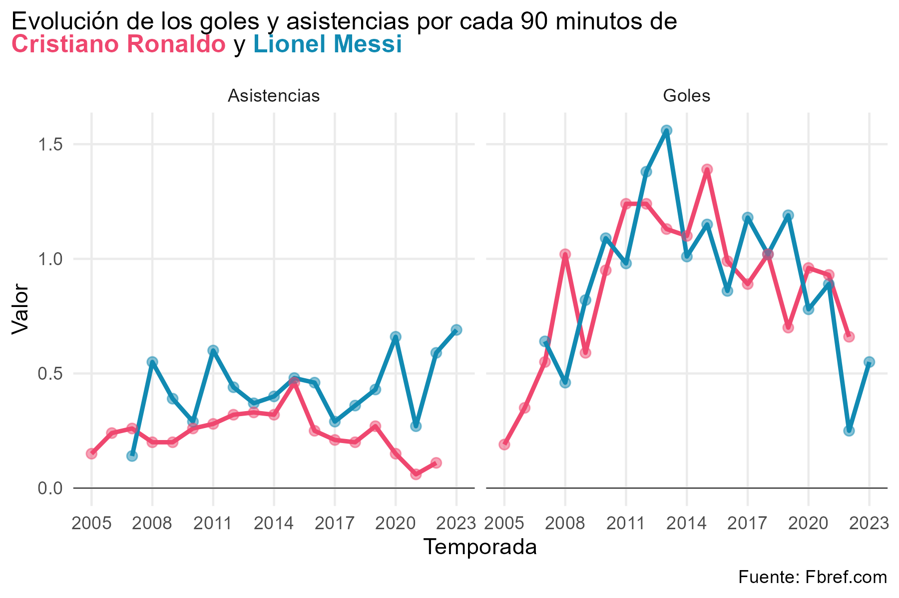
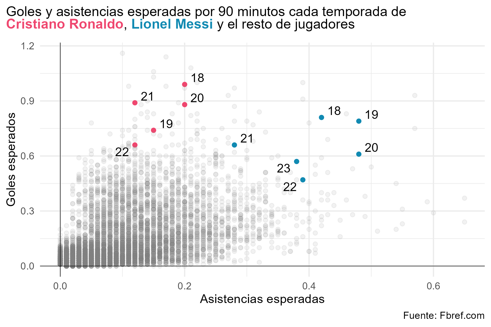
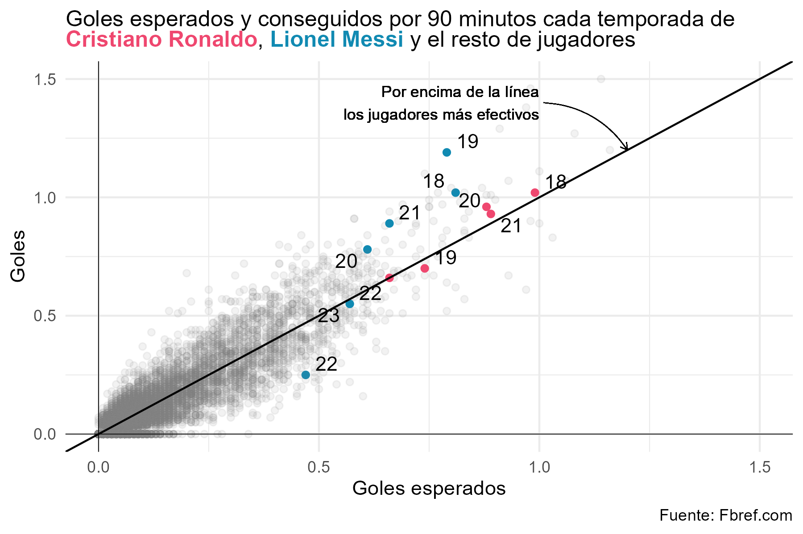

# Messi y Ronaldo: dos ídolos desde la perspectiva de los datos {#cap-futbol}

*Borja Andrino Turón*

EL PAÍS

## Motivación

El uso de estadísticas avanzadas en los deportes, especialmente en el fútbol, ha despegado en los últimos años. Una buena señal de su irrupción es la apuesta de algunos medios deportivos —como FiveThirtyEight o The Athletic— por contenidos basados en el análisis y la visualización de estas estadísticas para explicar las fortalezas y debilidades de jugadores y equipos. Además, la generación de estadísticas avanzadas, como los goles esperados, la amenaza o el valor con balón están comenzando a sustituir a las métricas tradicionales en la narración y las crónicas de los encuentros. 

\index{fútbol}
\index{Ronaldo}
\index{Messi}

## Las estadísticas y el fútbol

En el presente capítulo se usarán estadísticas de la web especializada Fbref.com para visualizar el dominio de Cristiano Ronaldo y Lionel Messi durante más de 15 años. Para usar estos datos podríamos usar técnicas de *web scraping*\index{web scraping}  esta página web o usar la librería `worldfootballR`, desarrollada por Jason Zivkovic. La librería permite obtener datos de diferentes plataformas. 

La publicación y explotación de estadísticas avanzadas es reciente, de las últimas seis temporadas, con lo que para analizar las carreras completas de estos dos jugadores tendremos que conformarnos, de momento, con métricas tradicionales.

En la Fig. \@ref(fig:pplot-goals1) se ve la evolución de las principales cifras que definen a un atacante: los goles y las asistencias. Esta estandarización nos permite poder comparar ambos jugadores independientemente del número de minutos, aunque se ha añadido un filtro de al menos 1.000 minutos jugados en la temporada para evitar ruido. 
\index{goles}
\index{asistencias}

Para realizar el gráfico, se toman los datos originales y se filtran para que solo aparezcan los jugadores seleccionados, en las temporadas con muestra suficiente. A continuación, se seleccionan las columnas que se usarán en el *plot* y se giran las dos métricas para poder añadirlas en un único `geom_line()`. 


```r
pacman::p_load(CDR, tidyverse, janitor, ggbeeswarm, here, 
               patchwork, ggtext, ggrepel)


datos_players |>
  filter(player %in% c("Cristiano Ronaldo", "Lionel Messi"),
         min_playing > 1000) |>
  select(season_end_year, player, Goles = gls_per, Asistencias = ast_per) |>
  pivot_longer(c(Goles, Asistencias), names_to = "metric", values_to = "value") |>
  ggplot(aes(x = season_end_year, y = value, color = player)) +
  geom_line(size = 1) +
  geom_point(size = 2, alpha = 0.5) +
  scale_color_manual(values = c("Lionel Messi" = "#118ab2",
                                "Cristiano Ronaldo" = "#ef476f")) +
  scale_x_continuous(breaks = seq(2005, 2023, 3)) +
  geom_hline(yintercept = 0, size = 0.2) +
  facet_wrap(~metric) +
  labs(title = "Evolución de los goles y asistencias por cada 90 minutos de<br><b style='color:#ef476f;'>Cristiano Ronaldo</b> y <b style='color:#118ab2;'>Lionel Messi</b>",
       x = "Temporada", y = "Valor", caption = "Fuente: Fbref.com") +
  theme_minimal() +
  theme(legend.position = "none", 
        panel.grid.minor = element_blank(),
        plot.title = element_markdown(margin=margin(0,0,10,-30), 
                                      size=12))
```

<div class="figure" style="text-align: center">

<p class="caption">(\#fig:pplot-goals1)Evolución de goles y asistencias por 90 minutos de Cristiano y Messi desde 2005</p>
</div>


La Fig. \@ref(fig:pplot-goals1) arroja un dato increíble, durante 10 años, tener a Messi o Cristiano en el campo significaba contar en ese partido con un gol y casi media asistencia. 

Pero la visualización solo nos habla de estos dos futbolistas. Para compararlos con otros jugadores se puede calcular el percentil de goles y asistencias por 90 minutos, temporada a temporada, de los jugadores que hayan jugado más de 1.000 minutos (véase Fig. \@ref(fig:pplot-goals2)). El resultado de nuevo es impactante: durante 13 temporadas Messi y Cristiano han estado entre el 1% de jugadores con más goles. Además, el argentino ha terminado la temporada entre el 1% con más asistencias en 9 ocasiones.


```r
percentiles_to_plot <- 
  datos_players |>
  clean_names() |>
  filter(min_playing > 1000) |>
  select(season_end_year, player, min_playing, gls_per, ast_per) |> 
  group_by(season_end_year) |>
  mutate(across(c(gls_per, ast_per), ntile, 100,
                .names = "{.col}_centil")) |> 
  ungroup() |>
  mutate(highlighted_player = if_else(player %in%
                                        c("Cristiano Ronaldo", "Lionel Messi"),
                                      T,
                                      F)) |>
  select(season_end_year, player, highlighted_player, 
         Goles = gls_per_centil, Asistencias = ast_per_centil)

percentiles_to_plot |>
  pivot_longer(c(Goles, Asistencias), names_to = "metric", values_to = "value") |>
  ggplot(aes(x = season_end_year, y = value, group = season_end_year)) +
  geom_jitter(aes(alpha = highlighted_player, color = player)) +
  scale_color_manual(values = c("Lionel Messi" = "#118ab2",
                                "Cristiano Ronaldo" = "#ef476f")) +
  geom_hline(yintercept = 0, size = 0.1) +
  labs(title = "Percentil de goles y asistencias por cada 90<br>minutos de <b style='color:#ef476f;'>Cristiano Ronaldo</b> y <b style='color:#118ab2;'>Lionel Messi</b>",
       x = "Temporada", y = "Percentil", caption = "Fuente: Fbref.com") +
  facet_wrap(~metric, scales = "free") +
  scale_x_continuous(breaks = seq(2005,2023)) +
  scale_alpha_manual(values = c(0.01, 1)) +
  coord_flip() +
  guides(alpha = "none") +
  theme_minimal() +
  theme(legend.position = "none", 
        panel.grid.minor = element_blank(),
        plot.title = element_markdown(margin=margin(0,0,0,-30), size=12))
```

<div class="figure" style="text-align: center">

<p class="caption">(\#fig:pplot-goals2)Percentil de goles y asistencias por 90 minutos cada temporada desde 2005</p>
</div>

Desde la temporada 2017/18 en esta web publican estadísticas avanzadas de jugadores por partido y temporada. En la Fig. \@ref(fig:pplot-goals3) se representan los goles esperados (miden cómo de probable es el gol dado un disparo) y las asistencias esperadas (suma de los goles esperados que suman los pases que desembocan en un tiro) por 90 minutos de los jugadores con más de 1.000 minutos. De nuevo el gráfico destaca a nuestros dos protagonistas, que se sitúan en el arco más alejado del origen de coordenadas, donde se juntan los jugadores con mejores números de asistencias y goles esperados.
\index{goles esperados}


```r
expected_data <- 
  datos_players |> 
  clean_names() |> 
  filter(season_end_year >= 2018,
         min_playing > 1000, 
         x_g_per > 0 | x_ag_per > 0) |> 
  mutate(highlighted_player = if_else(player %in% c("Cristiano Ronaldo", "Lionel Messi"), 
                                      T, 
                                      F), 
         label = if_else(player %in% c("Cristiano Ronaldo", "Lionel Messi"), 
                         as.character(season_end_year), 
                         NA_character_))

expected_data |> 
  select(season_end_year, player, highlighted_player, label,
         Goles = x_g_per, Asistencias = x_ag_per) |> 
  ggplot(aes(x = Asistencias, y = Goles)) + 
  geom_point(aes(alpha = highlighted_player, 
                 color = player)) +
  geom_text_repel(aes(label = str_sub(label, 3, 4))) + 
  scale_color_manual(values = c("Lionel Messi" = "#118ab2",
                                "Cristiano Ronaldo" = "#ef476f")) +
  geom_hline(yintercept = 0, size = 0.2) +
  geom_vline(xintercept = 0, size = 0.2) +
  scale_alpha_manual(values = c(0.1, 1)) + 
  labs(title = "Goles y asistencias esperadas por 90 minutos cada temporada de<br><b style='color:#ef476f;'>Cristiano Ronaldo</b>, <b style='color:#118ab2;'>Lionel Messi</b> y el resto de jugadores",
       x = "Asistencias esperadas", y = "Goles esperados", caption = "Fuente: Fbref.com") +
  guides(alpha = "none") + 
  theme_minimal() + 
  theme(legend.position = "none",
        plot.title = element_markdown(margin=margin(0,0,10,-30), 
                                      size=12), 
        legend.title = element_blank())
```

<div class="figure" style="text-align: center">

<p class="caption">(\#fig:pplot-goals3)Goles y asistencias por jugador y temporada</p>
</div>


La métrica de goles esperados permite también hablar de efectividad. Cuando un jugador suma más goles con sus disparos de lo que era esperable su efectividad es alta; cuando por el contrario el jugador termina anotando menos goles de los que se preveían por sus disparos su efectividad es baja. En la Fig. \@ref(fig:pplot-goals4) se muestra para cada jugador y temporada esta relación. Se vuelve a observar cómo Cristiano y Messi destacan en la generación de goles esperados, aunque hay una ligera diferencia: entre 2018 y 2021 la efectividad del argentino fue mayor que la del portugués. Los puntos de Cristiano se sitúan sobre la línea que representa lo esperado: mismo número de goles que probabilidad de que los disparos acaben en gol. Los de Messi se sitúan por encima, ha anotado más goles que los que sus disparos hacían prever.


```r

expected_data |> 
  select(season_end_year, player, highlighted_player, label,
         Goles = gls_per, `Goles esperados` = x_g_per) |> 
  ggplot(aes(x = `Goles esperados`, y = Goles)) + 
  geom_point(aes(alpha = highlighted_player, 
                 color = player)) +
  geom_text_repel(aes(label = str_sub(label, 3, 4))) + 
  scale_color_manual(values = c("Lionel Messi" = "#118ab2",
                                "Cristiano Ronaldo" = "#ef476f")) +
  geom_hline(yintercept = 0, size = 0.2) +
  geom_vline(xintercept = 0, size = 0.2) +
  geom_abline(slope = 1) +
  geom_text(x = 1, y = 1.4, 
            label = "Por encima de la línea\nlos jugadores más efectivos", 
            size = 3, hjust = 1, vjust = 0.5) + 
  geom_curve(x = 1.01, y = 1.4, xend = 1.2, yend = 1.2, 
             size = 0.2, curvature = -0.25, arrow = arrow(length = unit(0.02, "npc"))) + 
  scale_alpha_manual(values = c(0.1, 1)) + 
  scale_x_continuous(limits = c(0, 1.5)) + 
  scale_y_continuous(limits = c(0, 1.5)) + 
  labs(title = "Goles esperados y conseguidos por 90 minutos cada temporada de<br><b style='color:#ef476f;'>Cristiano Ronaldo</b>, <b style='color:#118ab2;'>Lionel Messi</b> y el resto de jugadores",
       x = "Goles esperados", y = "Goles", caption = "Fuente: Fbref.com") +
  guides(alpha = "none") + 
  theme_minimal() + 
  theme(legend.position = "none", 
        plot.title = element_markdown(size=12), 
        legend.title = element_blank())
```

Con estos gráficos se puede hacer una primera evaluación de los datos de estos dos grandes jugadores (y de cualquier otro) y quizás no logremos contestar a la pregunta de quién ha sido el mejor, aunque para algunos con esto ya esté claro. 

<div class="figure" style="text-align: center">

<p class="caption">(\#fig:plot-goals-assists-4)Goles esperados y anotados por jugador y temporada</p>
</div>
