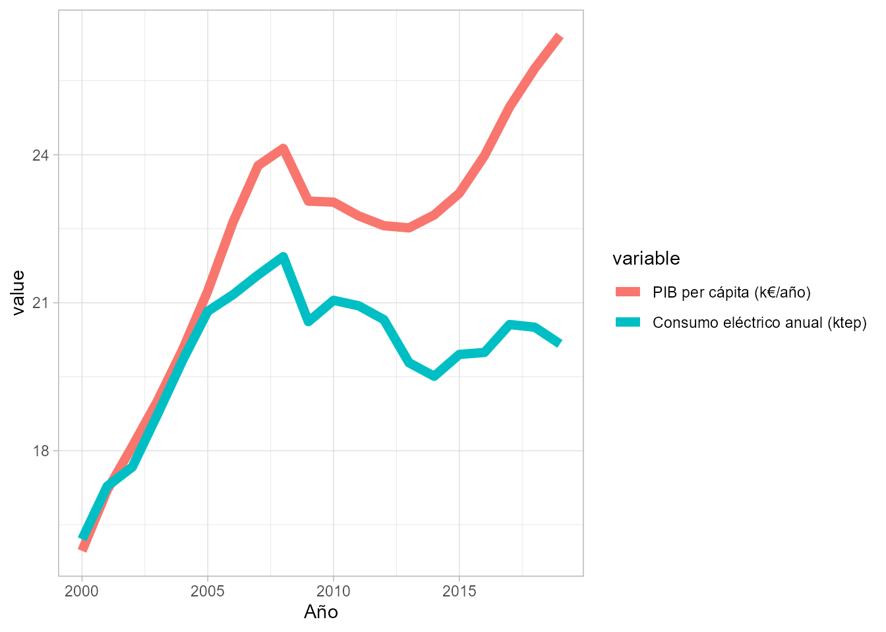
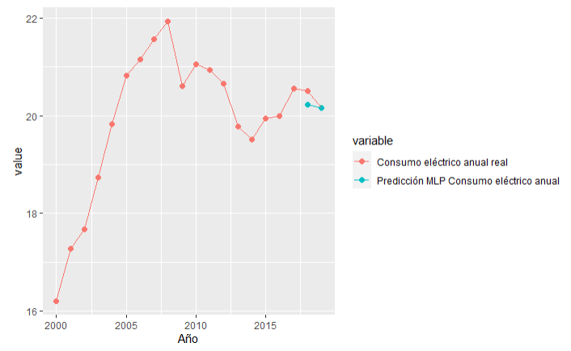

# Predicción de consumo eléctrico con redes neuronales  {#cap-ree}

*Jose Manuel Sanz Candales*

Red Eléctrica de España

## Introducción
\index{consumo eléctrico}
\index{red neuronal}

Red Eléctrica, como Operador del Sistema, tiene como principal misión garantizar la continuidad del suministro eléctrico en España. Para ello, entre otras muchas tareas, se desarrollan, evolucionan y mantienen algoritmos de previsión del consumo eléctrico y de la producción con las principales energías renovables (eólica y solar) para distintos horizontes (próximas horas, días, meses, años, etc.) y a distintas escalas temporales (anual, horario, quinceminutal).

Este caso de uso se sitúa en el departamento de Ciencia de Datos del Operador del Sistema. Es el principio del año 2018, y el área de planificación de la empresa solicita una **predicción de el consumo eléctrico en España** para el año actual y el siguiente (2018 y 2019).

**IMPORTANTE:** Este desarrollo no está previsto en el presupuesto del año, por lo que tanto el software como los datos de entrada deben ser, a ser posible, gratuitos.

## Datos de entrada {#ree-datos}

Respecto a los datos de entrada para el modelo, se requiere tanto una serie histórica de la variable a predecir así como de otras variables que sean capaces de explicar adecuadamente el comportamiento del consumo eléctrico. En este caso es necesario utilizar un modelo de aprendizaje supervisado de regresión, dado que el consumo eléctrico es una variable numérica continua.

En cuanto a la serie histórica de consumo eléctrico anual, Red Eléctrica, en su Web corporativa, publica datos estadísticos accesibles de forma abierta. Sin embargo, el histórico publicado comienza en 2012 y sería conveniente tener un periodo de tiempo más amplio para un entrenamiento adecuado de los modelos potencialmente candidatos a ser utilizados. Se realiza una búsqueda de otras fuentes y, afortunadamente, se encuentra que el Instituto para la Diversificación y Ahorro de la Energía (en adelante IDAE) publica datos desde 1990, con agregación anual, del consumo final de energía eléctrica en miles de toneladas equivalentes de petróleo -ktep-.  

Como los datos se deben entregar en MWh, las unidades de la predicción resultante se tendrán que convertir con el coeficiente que indican en la Web del IDAE (1 MWh = 0,086 tep), pero en los modelos se utilizarán las unidades originales porque más adelante se comprobará que dichas unidades resultan muy útiles para ver cómo se relaciona el consumo eléctrico con la variable predictora que se va a utilizar.

De este modo se consigue, por tanto, una parte de los datos necesarios para entrenar los modelos predictivos: **la serie histórica de nuestra variable target (o variable a predecir)**.

Para completar el conjunto de datos del modelo se necesitan, además, **las features o variables explicativas**. Se sabe que, históricamente, las variaciones interanuales de el consumo eléctrico dependen del comportamiento de la economía de una forma directa: si la economía crece, también crece el consumo eléctrico. Como indicador del comportamiento de la economía se decide tomar el PIB per cápita que se puede encontrar en el siguiente enlace, disponible de forma pública en Expansión - datos macro: https://datosmacro.expansion.com/pib/espana.

Adicionalmente, se utilizarán otras dos variables explicativas, relacionadas con el mercado inmobiliario y con el empleo, respectivamente. Dado que no son públicas, están anonimizadas y escaladas entre 0 y 1 (dividiendo todos los valores de cada variable entre el mayor de su serie). Debido a que se dispone de datos de estas dos variables desde el año 2000, el dataset comienza en este año.

Una vez definido el dataset de entrada para los modelos (como se verá a continuación, es un conjunto de datos muy pequeño y sencillo), se puede comenzar a construir el modelo en **R**.


## Modelización

En la siguiente celda de código se lee el conjunto de datos, `consumoelectricoanual_2`,  del paquete `CDR`, se convierte al formato `data.table` a `data.frame` y se visualizan sus primeras 3 filas:


```r
library(CDR)
df <- CDR::consumoelectricoanual_2
class(df) <- class(as.data.frame(df))
head(df, 3)
#>    Año   PIB Consumo     Inmob    Empleo
#> 1 2000 15.97  16.205 0.7525093 0.6561190
#> 2 2001 17.20  17.279 0.7687356 0.6832698
#> 3 2002 18.09  17.671 0.7836143 0.7104178
```


En este caso, ya se dispone de los datos reales de 2018 y 2019 (esto permitirá validar la precisión del modelo), pero en un caso real, a principios de 2018 el PIB per cápita de 2018 y 2019 será una predicción. Lógicamente, el consumo eléctrico anual también será desconocido, ya que es lo que se necesita predecir. Es decir, se supone que los datos de consumo eléctrico de 2018 y 2019 para el modelo que se va a construir no existen, y no se pueden utilizar ni para entrenar ni para evaluar la precisión del modelo (para ello habrá que utilizar datos pasados).

La siguiente celda de código proporciona la matriz de varianzas-covarianzas de las variables `PIB`, `Consumo`, `Inmob`, `Empleo`:


```r
cormat <- round(cor(df[c("PIB", "Consumo", "Inmob", "Empleo")]), 2)
head(cormat)
#>          PIB Consumo Inmob Empleo
#> PIB     1.00    0.81  0.90   0.93
#> Consumo 0.81    1.00  0.64   0.71
#> Inmob   0.90    0.64  1.00   0.99
#> Empleo  0.93    0.71  0.99   1.00
```

Como se puede observar en la matriz anterior, la correlación entre la variable a predecir y las distintas variables explicativas es fuerte y positiva (es decir, cuando crece una también crece la otra). Si, además, se visualiza la gráfica entre PIB y Consumo en el tiempo, se apreciará de forma aún más clara esta intensa correlación:


```r
library("ggplot2")
library("reshape2")
df_m <- melt(df[c("Año","PIB","Consumo")], id.vars = "Año")
options(repr.plot.width = 15, repr.plot.height = 8)
ggplot(df_m, aes(Año, value, col = variable)) +
  geom_line(size = 2.5)
```

<div class="figure" style="text-align: center">

<p class="caption">(\#fig:plot-ree1)Evolución del PIB y el Consumo</p>
</div>


En la Fig. \@ref(fig:plot-ree1) se observa que las curvas que representan la evolución temporal de ambas variables están prácticamente superpuestas, pero desde 2006 líneas se separan. ¿A qué puede deberse? Uno de los principales motivos probablemente sean las medidas de eficiencia energética que se han ido introduciendo en los últimos lustros (iluminación led, electrodomésticos, dispositivos con menor consumo, etc.).

Una vez se han explorado los datos (en este caso ha sido muy breve, pero es muy habitual en proyectos reales que la exploración y limpieza de los datos requiera en torno al 80% del tiempo), se procederá a dividir el conjunto de datos (desde 2000 hasta 2017, ya que 2018 y 2019 son los años a los que se pretende dar respuesta, por lo que se supone que no es conocido todavía) en dos partes: 

(i) entrenamiento+validación (90% de las filas)
(ii) test (10% restante)

Previamente a esto, se debe escalar también la variable PIB a valores entre 0 y 1, para que la red neuronal funcione de forma correcta:


```r
# estandarizar la variable explicativa "PIB" entre 0 y 1
df$PIB = df$PIB/max(df$PIB)
set.seed(123)
df_aux <- df[df$Año < 2018, ]
n <- nrow(df_aux)
trainIndex <- sample(1:n, size = round(0.85 * n), replace = FALSE)
df_train <- df_aux[trainIndex, ]
df_test <- df_aux[-trainIndex, ]
df_test
```

Ahora se deberían probar distintos modelos de machine learning \index{machine learning} y comparar sus resultados para determinar cuál es el más preciso para este conjunto de datos. En este ejemplo, por simplicidad no se incluye este proceso de prueba y comparación entre distintos modelos, que en el caso de uso real da lugar elegir una red neuronal \index{red neuronal} simple o  perceptrón multicapa  (véase Cap. \@ref(capNN)), también conocido por su acrónimo en inglés MLP (*Multi Layer Perceptron*), que se utilizará más adelante en este capítulo al obtener los mejores resultados.

Para elegir los hiperparámetros \index{hiperparámetros} que mejor resultado obtienen para el modelo se van a utilizar dos técnicas que son *grid search* (para probar distintas combinaciones de hiperparámetros) y cross validation (para entrenar y validar aprovechando todos los registros del conjunto de entrenamiento-validación).

En este caso de uso, se van a hacer distintas pruebas combinando el número de neuronas por cada capa oculta. En concreto, en la primera y la segunda capa oculta se va a dejar un número constante de neuronas (5), y es en la tercera capa oculta donde se va a probar con 4 neuronas y 6 neuronas. Es decir, se entrenará un modelo con 5 neuronas en cada capa oculta y otro con 5 neuronas en las dos primeras capas y 6 neuronas en la tercera capa.

En la siguiente celda, se importan los paquetes necesarios (neuralnet y caret), se construye la estructura de la red en la variable 'grid' y se define el número de *folds* (en cuántas partes se divide en conjunto de entrenamiento para entrenar y validar con todos los datos del conjunto) de la validación cruzada. Por último, se entrena el modelo.

El proceso está muy simplificado para que sea fácil de entender. No obstante, lo habitual en la práctica es probar más opciones de *grid search* y hacer una división mayor del conjunto de datos para *cross validation* \index{cross validation} (es bastante habitual entre 5 y 10 folds):

```r
# lee paquetes
library("neuralnet")
library("caret")
# define la estructura de la red
grid <- expand.grid(layer1 = c(5), layer2 = c(5), layer3 = c(4,5))
# establece semilla para que los resultados del entrenamiento sean siempre los mismos
set.seed(123)
# define el número de folds en validación cruzada
train_control <- trainControl(method = "cv",
                              number = 2,
                              verbose = TRUE)
# entrenar el modelo
model <- train(Consumo ~ PIB+Inmob+Empleo,
               data = df_train,
               trControl = train_control,
               method = "neuralnet",
               tuneGrid = grid)
```

Para mostrar los resultados se aplica la función 'print' sobre la variable 'model', cuya salida es el texto comentado debajo de la línea de 'print'.

```r
print(model)
#> Neural Network
#>
#> 15 samples
#> 3 predictor
#>
#> No pre-processing
#> Resampling: Cross-Validated (2 fold)
#> Summary of sample sizes: 8, 7
#> Resampling results across tuning parameters:
#>
#>  layer3  RMSE       Rsquared  MAE      
#>  4       0.9713547  0.7631649 0.8521702
#>  5       0.9452518  0.72532010.8165410
#>
#> Tuning parameter 'layer1' was held constant at a value of 5
#> Tuning parameter 'layer2' was held constant at a value of 5
#> RMSE was used to select the optimal model using the smallest value.
#> The final values used for the model were layer1 = 5, layer2 = 5 and layer3 = 5.
```
El modelo con mejor resultado (menor error en el conjunto de entrenamiento / validación) es el que tiene 3 capas con 5 neuronas cada una. Con este modelo, se predice el consumo eléctrico con el modelo entrenado para la parte del conjunto de datos que se habían reservado para test (años 2006 y 2007), para comprobar que el modelo generaliza bien (es decir, para datos nuevos los resultados de las predicciones tienen un error del orden de los que resultan del entrenamiento del modelo). Para ello, se calcula, por ejemplo, el MAE de las predicciones para dicho conjunto de test:


```r
df_test[c("Año", "Consumo")]
#> Año     Consumo
#> 7  2006 21.163
#> 8  2007 21.564
#> 18 2017 20.559

predict(model, df_test)
#>       7        8       18
#>   21.50816 21.83445 20.12596

MAE_test = (abs(21.163-21.50816)+abs(21.564-21.83445)+abs(20.559-20.12596))/3
MAE_test
```

El modelo seleccionado ya está listo para realizar predicciones de consumo eléctrico para los años solicitados (2018 y 2019). Como se avanzó anteriormente, el objetivo del conjunto de test es comprobar la precisión del modelo con datos totalmente desconocidos para él (es decir, no utilizados en la fase de entrenamiento-validación), principalmente para asegurar que el modelo funciona bien para datos distintos a los utilizados en el entrenamiento.

Para predecir el consumo eléctrico anual para 2018 y 2019, que es el dato que solicitaron desde el área de planificación de la empresa. Simplemente se utiliza la función `predict()` del modelo. Previamente, añade una columna en el conjunto de datos original -df- que contendrá los valores predichos, para más adelante comprobar gráficamente el valor predicho frente al real que, en este caso ficticio, ya es conocido:


```r
df["Prediccion_MLP"] <- NA
```

Ahora se hace la predicción del año 2018 y se añade el resultado a esta nueva columna del conjunto de datos:


```r
df_pred_2018 <- df[df$Año == 2018, ]
df$Prediccion_MLP[df$Año == 2018] <- predict(model, df_pred_2018[c("PIB","Inmob","Empleo")])
```

Se hace también la predicción para el año 2019 y se visualizan las predicciones añadidas al conjunto de datos para ambos años:


```r
df_pred_2019 <- df[df$Año == 2019, ]
df$Prediccion_MLP[df$Año == 2019] <- predict(model, df_pred_2019[c("PIB","Inmob","Empleo")])
tail(df, 3)
#>    Año Consumo Prediccion_MLP
#> 18 2017 20.559          NA
#> 19 2018 20.504    20.22787
#> 20 2019 20.166    20.16409
```

Estos son los datos que se entregarían como resultado de la petición de información (convertidos a MWh aplicando el coeficiente que se mencionó en la Secc. \ref{ree-datos}).

Claro está, en el momento que se entregan las predicciones para 2018 y 2019 todavía no se sabría cómo de precisas han sido, pero a principios de 2020 sí es posible calcular la bondad del modelo seleccionado, y es lo que se hará en las siguientes celdas:


```r
df_m_mlp <- melt(df[c("Año","Consumo","Prediccion_MLP")], id.vars = "Año")
ggplot(df_m_mlp, aes(Año, value, col = variable)) +  
  geom_point(size = 2) + 
  geom_line()
```

<div class="figure" style="text-align: center">

<p class="caption">(\#fig:reshape-plot-ree2)Consumo y predicción del modelo de red neuronal MLP</p>
</div>


En la Fig. \@ref(fig:reshape-plot-ree2), las predicciones (puntos azules) tienen unos errores del orden de los que se habían visto en el conjunto de test cuando se hizo el entrenamiento de los modelos, por lo que parece que no hay sobreentrenamiento\index{sobreentrenamiento} en el modelo.
