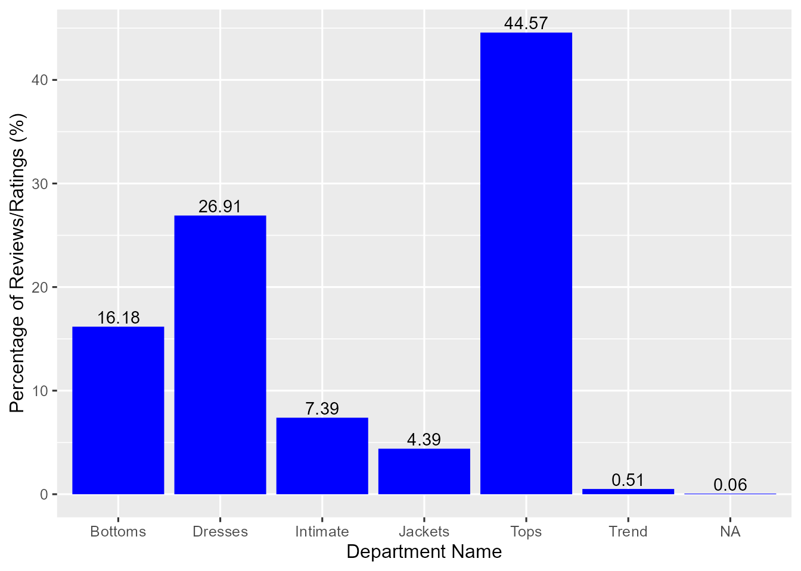
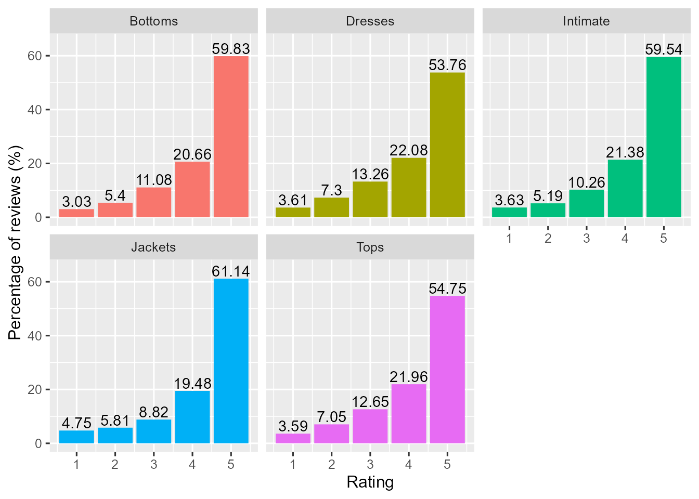
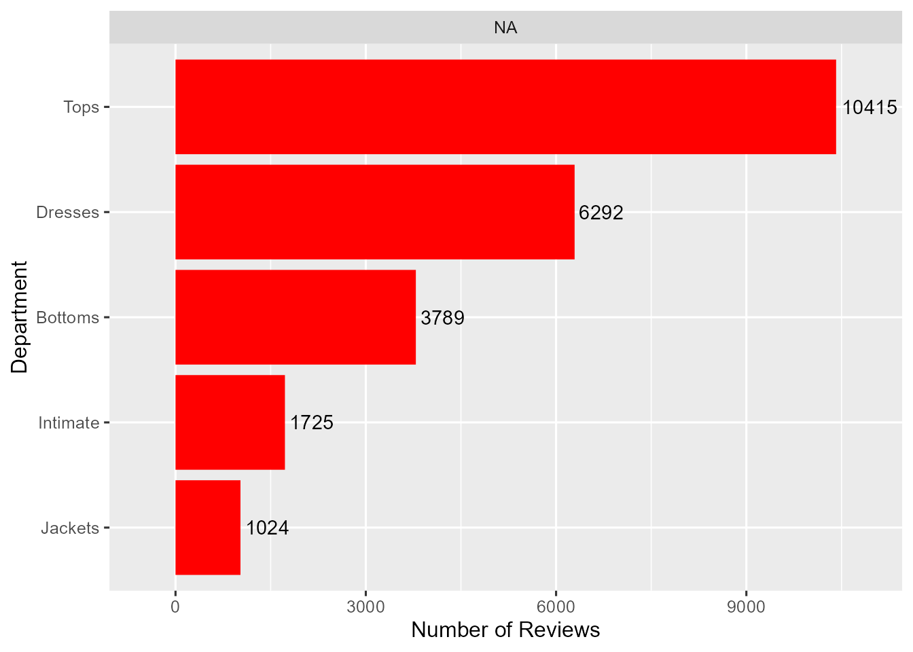

# El procesamiento del lenguaje natural para tendencias de moda en textil {#nlp-textil}

*Ambrosio Nguema Ansue*


\index{procesamiento del lenguaje natural, NLP}

## Introducción

El Procesamiento del Lenguaje Natural (NLP, por sus siglas en inglés), abarca una amplia gama de técnicas y algoritmos, entre los que se encuentra el modelado de temas.
El modelado de temas no es un modelo de predicción en sí mismo. En cambio, es una técnica de aprendizaje no supervisado que tiene como objetivo descubrir estructuras ocultas (temas) dentro de un conjunto de documentos o textos aunque está relacionado con el NLP, no son lo mismo, el modelado de temas es una de las muchas técnicas que forman parte del NLP. La relación entre ambos radica en que el modelado de temas utiliza enfoques del NLP para analizar y procesar el lenguaje en los textos, pero se enfoca en una tarea específica: extraer temas. 
En este capítulo, exploraremos cómo el modelado de temas y otras técnicas de NLP pueden aplicarse al análisis de tendencias en el mundo de la moda. El modelado de temas aplicado a la industria textil puede proporcionar información valiosa sobre las preferencias y opiniones de los clientes, lo que puede mejorar la toma de decisiones y la experiencia del cliente en el ámbito del comercio electrónico de ropa.


## Análisis de tendencias de moda en textil

El conjunto `clothes` de datos incluido en el paquete `CDR` de reseñas y calificaciones de ropa de comercio electrónico para mujeres contiene 23.486 entradas relacionadas con la edad y la revisión dada por el cliente y sus opiniones sobre la ropa de mujer de varios minoristas.

```r
library("CDR")
library("readr")
library("tidyverse")
library("tidytext")
```


Las variables incluidas pueden verse con la ejecutando `names(clothes)` y una descripción de las variables 
con el comando `??clothes`. El primer registro presenta la siguiente estructura la información:

```r
head(clothes)[1, ]
#>    ID Age Title                                                Review Rating
#> 1 767  33  <NA> Absolutely wonderful - silky and sexy and comfortable      4
#>   Recommend Liked  Division     Dept     Class
#> 1         1     0 Initmates Intimate Intimates
```

El conjunto de datos consta de 23.486 entradas que incluyen información acerca de la edad del cliente, las calificaciones otorgadas y las opiniones sobre la ropa comprada en comercios electrónicos para mujeres. Los datos se organizan en columnas, algunas de las cuales contienen valores enteros y otras almacenan caracteres. Todas las columnas con valores enteros están completas, mientras que algunas columnas de caracteres presentan valores faltantes (NA). La variable con la mayor cantidad de valores NA `Título`.


\index{bigramas}
\index{análisis!de texto}
\index{latent dirichlet allocation, LDA}

En el presente capítulo, se explora la aplicación de técnicas de análisis de texto en un conjunto de datos de reseñas y calificaciones de ropa de comercio electrónico para mujeres. En primer lugar, se realiza un análisis del porcentaje de reseñas y calificaciones en cada departamento, destacando los departamentos con mayor y menor porcentaje. Además, se lleva a cabo un análisis de bigramas para identificar las frases más comunes asociadas con diferentes calificaciones. Finalmente, se utiliza el modelado de temas con *Latent Dirichlet Allocation* (LDA) para explorar las características clave de las revisiones en el departamento de Tendencias. Los resultados del análisis proporcionan información valiosa para las empresas sobre el grupo demográfico objetivo, las preferencias de los clientes y las características clave de las prendas.


```r
library("ggplot2")
clothes |>
  dplyr::count(Dept) |>
  dplyr::mutate(prop = n / sum(n)) |>
  ggplot(aes(x = Dept, y = prop * 100)) +
  geom_bar(stat = "identity", fill="blue") +
  xlab("Department Name") +
  ylab("Percentage of Reviews/Ratings (%)") +
  geom_text(aes(label = round(prop * 100, 2)), vjust = -0.25) 
```

<div class="figure" style="text-align: center">

<p class="caption">(\#fig:unnamed-chunk-3)Percentage of Reviews by Department</p>
</div>

Los tops y vestidos son los departamentos que cuentan con la mayoría de las reseñas y calificaciones en el conjunto de datos, mientras que las chaquetas y la sección de tendencias tienen la menor cantidad. Dado que la sección de tendencias presenta una mezcla de ropa que puede pertenecer a otros departamentos, y solo representa un 0,51% del conjunto de datos, se ha decidido excluir esta sección del análisis.


```r
clothes |>
  filter(!is.na(Dept), Dept != "Trend") |>
  mutate(Dept = factor(Dept)) |>
  group_by(Dept, Rating) |>
  summarize(n = n()) |>
  mutate(perc = n / sum(n)) |>
  ggplot(aes(x = Rating, y = perc * 100, fill = Dept)) +
  geom_bar(stat = "identity", show.legend = FALSE) +
  facet_wrap(~Dept) +
  ylab("Percentage of reviews (%)") +
  geom_text(aes(label = round(perc * 100, 2)), vjust = -.2) +
  scale_y_continuous(limits = c(0, 65))
```

<div class="figure" style="text-align: center">

<p class="caption">(\#fig:unnamed-chunk-4)Percentage of reviews in each department</p>
</div>

Se ha observado que en todos los departamentos, la calificación de 5 estrellas es la más común. A pesar de tener una menor cantidad de reseñas en general, las chaquetas tienen la mayor proporción de calificaciones de 5 estrellas en su categoría. Una posible razón de esto es que las chaquetas suelen ser más fáciles de ajustar a diferentes formas corporales en comparación con vestidos y blusas, que pueden ser más difíciles de adaptarse correctamente, especialmente cuando se compran en línea.


```r
clothes |>
  filter(!is.na(Age), !is.na(Dept), Dept != "Trend") |>
  select(ID, Age, Dept) |>
  mutate(Age_group = cut(Age, breaks = c(18, 29, 39, 49, 59, 69, 79, 89, 99))) |>
  mutate(Age_group = as.character(Age_group)) |>
  mutate(Age_group = factor(Age_group, levels = c("18-29", "30-39", "40-49", "50-59", "60-69", "70-79", "80-89", "90-99"))) |>
  mutate(Dept = factor(Dept, levels = rev(c("Tops", "Dresses", "Bottoms", "Intimate", "Jackets")))) |>
  filter(Age < 80) |>
  group_by(Age_group, Dept) |>
  summarize(n = n()) |>
  ggplot(aes(Dept, n, fill = Age_group)) +
  geom_bar(stat = "identity", fill="red") +
  facet_wrap(~Age_group, scales = "free") +
  xlab("Department") +
  ylab("Number of Reviews") +
  geom_text(aes(label = n), hjust = -0.1) +
  scale_y_continuous(expand = c(.1, 0)) +
  coord_flip() +
  scale_fill_manual(values = hcl.colors(8))
```

<div class="figure" style="text-align: center">

<p class="caption">(\#fig:unnamed-chunk-5)Number of Reviews by Department</p>
</div>
Se ha observado que la tendencia en la distribución de reseñas por departamento (es decir, tops con el mayor número de reseñas y vestidos con el segundo mayor número) es similar en la mayoría de los grupos de edad. Esto indica que la popularidad de los diferentes tipos de ropa se mantiene en gran medida constante entre los grupos de edad más jóvenes y de mediana edad.


**Análisis de bigramas**

\index{bigrama}
El análisis de bigramas es una técnica útil para identificar patrones y tendencias en el lenguaje utilizado en las reseñas de productos. Un bigrama es un par consecutivo de palabras en un texto y puede proporcionar información valiosa sobre la frecuencia con la que ciertas palabras aparecen juntas y las combinaciones de palabras que son relevantes en las opiniones de los clientes. Al utilizar el análisis de bigramas, se espera comprender mejor las opiniones de los clientes sobre los productos de ropa en el conjunto de datos.


```r
clothesr <- clothes |> filter(!is.na(Review))
notitle <- clothesr |>
  filter(is.na(Title)) |>
  select(-Title)
wtitle <- clothesr |>
  filter(!is.na(Title)) |>
  unite(Review, c(Title, Review), sep = " ")

main <- bind_rows(notitle, wtitle)
```

Para llevar a cabo el análisis de bigramas, se procede a procesar las palabras de las reseñas eliminando las palabras vacías (también conocidas como *stop words*), que son palabras comunes sin un significado contextual importante, y los dígitos que representan la calificación de las reseñas. Una vez procesadas las palabras, se agrupan según sus calificaciones y se representan gráficamente los 10 bigramas más comunes para cada nivel de calificación. De esta forma, se puede identificar y comprender mejor las combinaciones de palabras que son relevantes para las opiniones de los clientes y para cada nivel de calificación.
\index{bigrama}


```r
bigramming <- function(data) {
  cbigram <- data |> unnest_tokens(bigram, Review, token = "ngrams", n = 2)
  cbigram_sep <- cbigram |> separate(bigram, c("first", "second"), sep = " ")
  cbigram2 <- cbigram_sep |>
    filter(!first %in% stop_words$word, !second %in% stop_words$word, !str_detect(first, "\\d"), !str_detect(second, "\\d")) |>
    unite(bigram, c(first, second), sep = " ")
  return(cbigram2)
}
```


```r
top_bigrams <- bigramming(main) |>
  mutate(Rating = factor(Rating, levels <- c(5:1))) |>
  mutate(bigram = factor(bigram, levels = rev(unique(bigram)))) |>
  group_by(Rating) |>
  count(bigram, sort = TRUE) |>
  top_n(10, n) |>
  ungroup()

top_bigrams |> ggplot(aes(bigram, n, fill = Rating)) +
  geom_col(show.legend = FALSE) +
  facet_wrap(~Rating, ncol = 3, scales = "free") +
  labs(x = NULL, y = "frequency") +
  coord_flip()
```

<div class="figure" style="text-align: center">

<p class="caption">(\#fig:unnamed-chunk-7)Most Common Bigrams (By Ratings)</p>
</div>


**Modelado de temas con Latent Dirichlet Allocation** 

El enfoque de modelado de temas de Latent Dirichlet Allocation (LDA) es una técnica ampliamente utilizada en NLP para extraer temas latentes de un corpus de texto. LDA es un algoritmo no supervisado que utiliza el aprendizaje automático para identificar patrones en grandes conjuntos de datos de texto, agrupando palabras similares en temas y asignando probabilidades a cada tema en cada documento.


En este estudio, se ha utilizado el enfoque de modelado de temas de LDA para explorar las 118 revisiones del Departamento de Tendencias. Se ajustó un modelo LDA utilizando muestreo de Gibbs y se eligió `k = 5` para los departamentos de Bottoms, Dresses, Intimate, Jackets y Tops. A través del análisis de los resultados, se pudieron identificar las 5 palabras principales de cada tema y obtener una mejor comprensión de las características clave de las revisiones en cada departamento. De esta forma, se pudo obtener información valiosa sobre las preferencias y opiniones de los clientes en diferentes departamentos de ropa en el conjunto de datos.


```r
library("topicmodels")
library("tm")
library("LDAvis")

trend_count <- main |>
  filter(Dept == "Trend") |>
  unnest_tokens(word, Review) |>
  anti_join(stop_words, by = "word") |>
  filter(!str_detect(word, "\\d")) |>
  count(ID, word, sort = TRUE) |>
  ungroup()

trend_dtm <- trend_count |> cast_dtm(ID, word, n)
trendy <- tidy(LDA(trend_dtm, k = 5, method = "GIBBS", control = list(seed = 4444, alpha = 1)), matrix = "beta")
top_trendy <- trendy |>
  group_by(topic) |>
  top_n(5, beta) |>
  ungroup() |>
  arrange(topic, desc(beta))

top_trendy |>
  mutate(term = reorder(term, beta)) |>
  ggplot(aes(term, beta, fill = factor(topic))) +
  geom_col(show.legend = FALSE) +
  facet_wrap(~topic, scales = "free") +
  coord_flip()
```

<div class="figure" style="text-align: center">

<p class="caption">(\#fig:lda)Modelo LDA (K=5)</p>
</div>

En el modelo LDA, cada tema se representa por un conjunto de palabras que aparecen juntas con mayor frecuencia en las revisiones. Por ejemplo, al observar el tema 3, se puede identificar que está caracterizado por palabras como "colors", "wear", "bit", "jacket" y "price", lo que sugiere que los clientes pueden estar comentando sobre la variedad de colores disponibles, la durabilidad de la prenda y su precio. Por otro lado, el tema 1 se caracteriza por palabras como "love", "fit", "fabric", "wear" y "length", lo que sugiere que los clientes pueden estar hablando sobre su experiencia con la prenda en términos de comodidad, ajuste y calidad de la tela. Al identificar estos temas, se pueden obtener ideas valiosas sobre las opiniones y preferencias de los clientes para mejorar la calidad de la ropa y satisfacer sus necesidades y deseos. Esto permite a las empresas tomar decisiones informadas para satisfacer las necesidades de sus clientes y mejorar la experiencia del usuario en el ámbito del comercio electrónico de ropa.


Como conclsuión, destacar que el análisis de este conjunto de datos proporciona información valiosa sobre las preferencias y opiniones de los clientes en cuanto a la ropa femenina. Las reseñas de 5 estrellas son dominantes en cada departamento, y las chaquetas son las prendas que obtienen la proporción más alta de calificaciones positivas. Además, se ha observado que los clientes de entre 30 y 40 años dejan la mayoría de las reseñas y que factores como el ajuste, la comodidad/calidad del material y la estética de la prenda influyen en la calificación. La realización de análisis de datos exploratorios y de bigramas puede ayudar a las empresas a comprender mejor lo que funciona y lo que no, y seleccionar artículos con telas flexibles y cómodas puede conducir a una mayor satisfacción del cliente y mayores ventas. Por último, el modelado de temas con LDA es una herramienta útil en situaciones en las que se tienen reseñas sin marcar y puede proporcionar información valiosa sobre las características clave de las revisiones. En general, estos análisis pueden ayudar a las empresas a tomar decisiones informadas y mejorar la experiencia del usuario en el ámbito del comercio electrónico de ropa.


