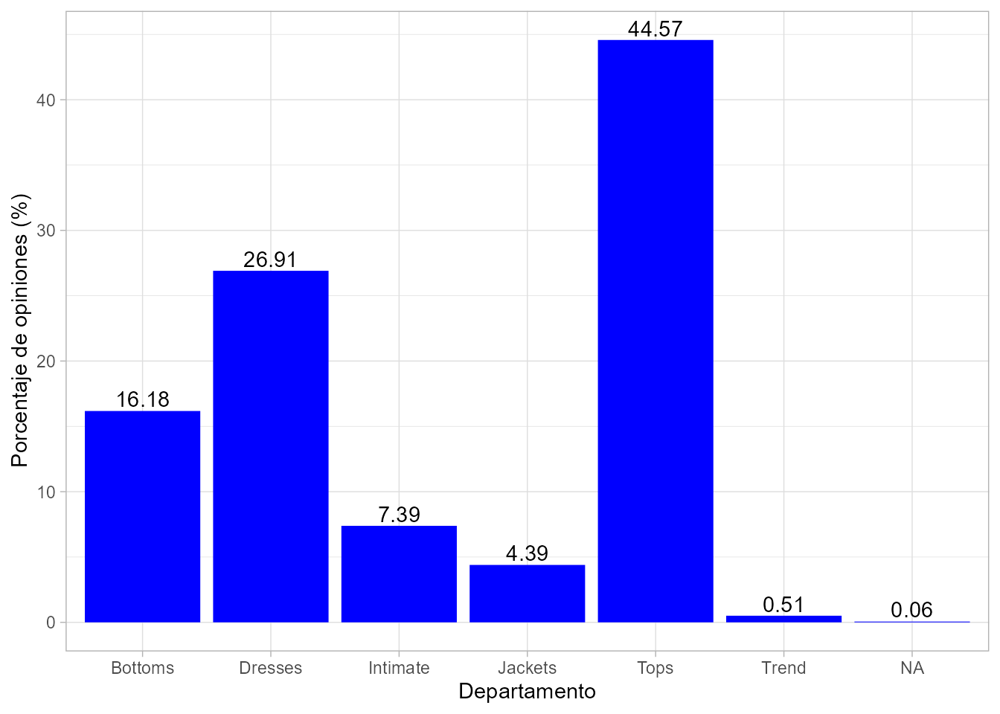
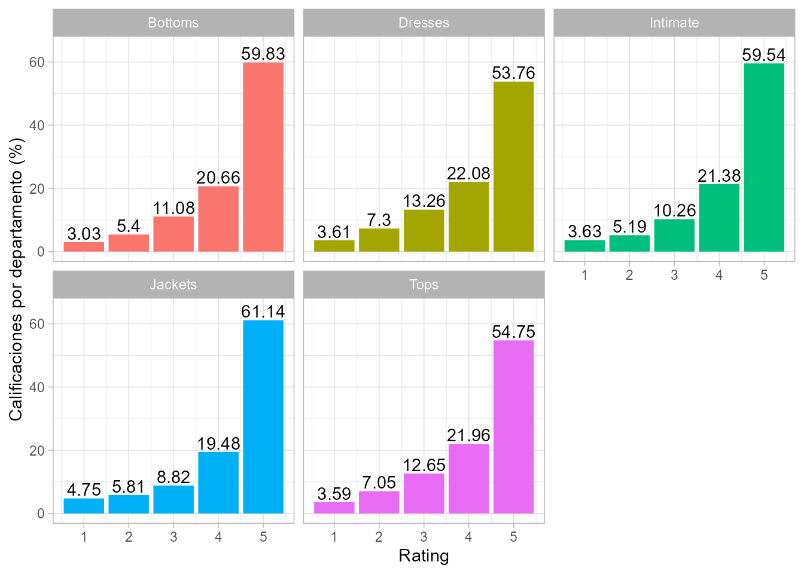
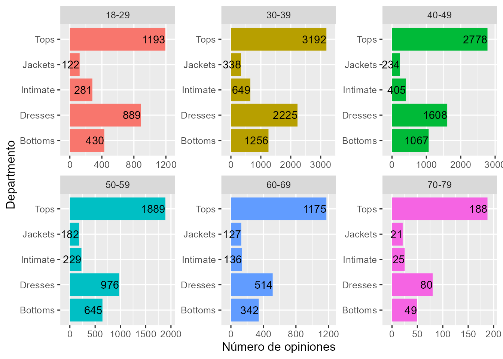
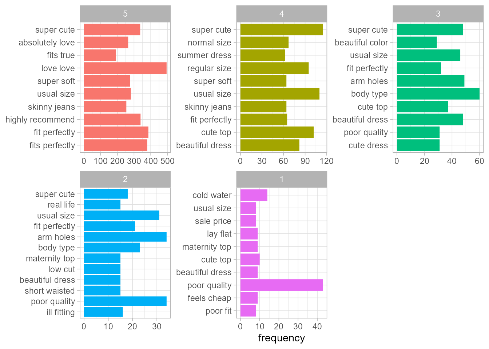
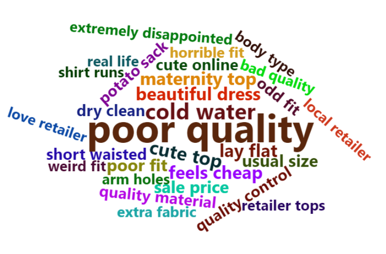
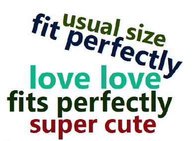
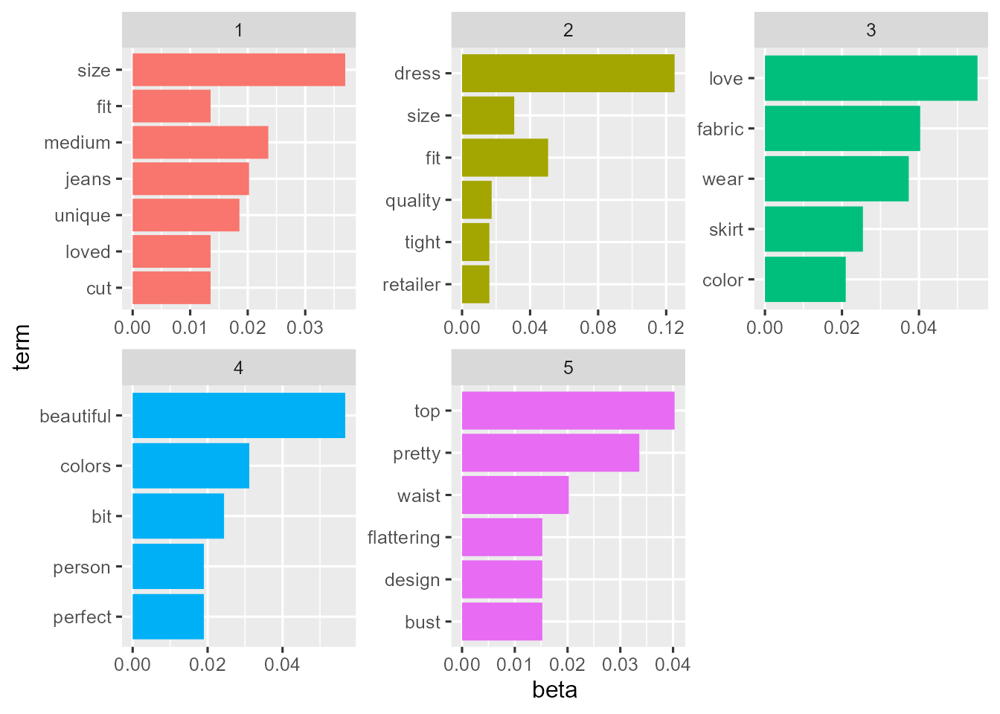

# El procesamiento del lenguaje natural para tendencias de moda en textil {#nlp-textil}

*Ambrosio Nguema Ansue*

Diverger


## Introducción
\index{procesamiento del lenguaje natural}
\index{modelado de temas}
\index{análisis!de tendencias}

El **procesamiento del lenguaje natural** (NLP, por sus siglas en inglés) es una rama de la inteligencia artificial que ayuda a los ordenadores a entender, interpretar y manipular el lenguaje humano. Abarca una amplia gama de técnicas y algoritmos, que incluyen: la categorización de contenido, el descubrimiento y modelado de temas, la extracción contextual, el análisis de sentimientos, la conversión de habla a texto y de texto a habla, el resumen de documentos y la traducción automática de texto o habla de un idioma a otro.

La técnica de NLP sobre la que descansa el caso de uso que se analiza en este capítulo, aunque no la única, es el  modelado de temas, que no es un modelo de predicción en sí mismo, sino una técnica de aprendizaje no supervisado que tiene como objetivo descubrir estructuras ocultas (temas) dentro de un conjunto de documentos o textos.  

En este capítulo, se muestra cómo el modelado de temas y otras técnicas de NLP pueden aplicarse al análisis de tendencias en el mundo de la moda. El modelado de temas aplicado a la industria textil puede proporcionar información muy valiosa sobre las preferencias y opiniones de los clientes, lo que puede mejorar la toma de decisiones y la experiencia del cliente en el ámbito del comercio electrónico de ropa.


## Análisis de tendencias de moda en textil

En este caso de uso se analiza el conjunto de datos `clothes` incluido en el paquete `CDR`. Dicho conjunto contiene datos, reseñas y calificaciones proporcionadas por personas que compraron ropa de mujer a través del comercio electrónico. 

```r
library("CDR")
library("readr")
library("tidyverse")
library("tidytext")
```


Las variables incluidas pueden verse ejecutando `names(clothes)`. La descripción de dichas variables se lleva a cabo con el comando `??clothes`. El primer registro presenta la siguiente información:

```r
head(clothes)[1, ]
#>    ID Age Title                                                Review Rating
#> 1 767  33  <NA> Absolutely wonderful - silky and sexy and comfortable      4
#>   Recommend Liked  Division     Dept     Class
#> 1         1     0 Initmates Intimate Intimates
```

El conjunto de datos consta de 23.486 entradas que incluyen información acerca de la edad del cliente, las calificaciones otorgadas, sus opiniones, el *rating* que le asigna al producto comprado, el departamento y las recomendaciones sobre la ropa comprada en comercios electrónicos para mujeres. Estas variables se organizan en columnas. `Rating` y `Recommend` contienen valores enteros y el resto almacena caracteres. Todas las columnas con valores enteros están completas, mientras que algunas columnas de caracteres presentan valores faltantes (NA). La variable con la mayor cantidad de valores NA es `Title` (se refiere al encabezado del comentario). 


\index{bigrama}
\index{análisis!de textos}
\index{latent Dirichlet allocation@\textit{latent Dirichlet allocation}, LDA}

El objetivo de este capítulo es explorar la aplicación de técnicas de análisis de texto en un conjunto de datos de opiniones, reseñas y calificaciones sobre ropa de comercio electrónico para mujeres. En primer lugar, se realiza el análisis del porcentaje de reseñas y calificaciones por departamento, destacándose aquellos con mayor y menor porcentaje. Posteriormente, se lleva a cabo un **análisis de bigramas** para identificar las frases asociadas con diferentes calificaciones. Finalmente, se utiliza el modelado de temas con el algoritmo **_latent Dirichlet allocation_** (LDA) para explorar las características clave de las opiniones correspondientes al departamento de "Tendencias". Los resultados del análisis proporcionan información muy valiosa para las empresas sobre el grupo demográfico objetivo, las preferencias de los clientes y las características clave de las prendas.

En cuanto al porcentaje de revisiones en cada departamento, el código necesario es el siguiente:

```r
clothes |>
  count(Dept) |>
  mutate(prop = n / sum(n)) |>
  ggplot(aes(x = Dept, y = prop * 100)) +
  geom_bar(stat = "identity", fill="blue") +
  xlab("Departamento") +
  ylab("Porcentaje de opiniones (%)") +
  geom_text(aes(label = round(prop * 100, 2)), vjust = -0.25) 
```

<div class="figure" style="text-align: center">

<p class="caption">(\#fig:rev-departamento)Porcentaje de revisiones por departamento.</p>
</div>

La Fig. \@ref(fig:rev-departamento) muestra que un gran porcentaje de las opiniones y calificaciones corresponden a los departamentos o secciones de tops (44,57%) y vestidos (*dresses*) (26,91%). Por el contrario, el departamento de chaquetas (*jackets*) y la sección de tendencias (*trend*) apenas si reciben, entre ambos, el 5% de dichas opiniones y calificaciones. Dado que la sección de tendencias presenta una mezcla de ropa que puede pertenecer a varias secciones y únicamente representa el 0,51% del conjunto de datos (opiniones y calificaciones), por simplicidad, se ha decidido excluirla del análisis. 

A continuación se analiza la calificación (`Rating`) que recibe cada uno de estos departamentos. Esta calificación varía de 1 (muy mala) a 5 (muy buena).


```r
clothes |>
  filter(!is.na(Dept), Dept != "Trend") |>
  mutate(Dept = factor(Dept)) |>
  group_by(Dept, Rating) |>
  summarize(n = n()) |>
  mutate(perc = n / sum(n)) |>
  ggplot(aes(x = Rating, y = perc * 100, fill = Dept)) +
  geom_bar(stat = "identity", show.legend = FALSE) +
  facet_wrap(~Dept) +
  ylab("Calificaciones por departamento (%)") +
  geom_text(aes(label = round(perc * 100, 2)), vjust = -.2) +
  scale_y_continuous(limits = c(0, 65))
```

<div class="figure" style="text-align: center">

<p class="caption">(\#fig:rating-departamento)Distribución porcentual de las calificaciones por departamento.</p>
</div>

En la Fig. \@ref(fig:rating-departamento) se observa que en todos los departamentos la calificación de 5 estrellas es, de largo, la más común. Aunque las chaquetas solo tienen un 4,39 % de reseñas (Fig. \@ref(fig:rev-departamento)), este departamento es el que tiene la mayor proporción de calificaciones de 5 estrellas. Una posible razón de esto es que las chaquetas suelen ser más fáciles de ajustar a diferentes formas corporales en comparación con vestidos y blusas, que pueden ser más difíciles de adaptarse correctamente, especialmente cuando se compran online.

Si se analizan las reseñas u opiniones en cada departamento por grupos de edad (véase Fig. \@ref(fig:coment-edad-dto)), se observa, en primer lugar, que las personas de 30 a 40 años realizan la mayoría de las reseñas, seguidas por las de 40 a 50 y las de 50 a 60 años. Esto les da a las empresas una idea de quién es el grupo demográfico objetivo y qué tipo de ropa (camisas, vestidos) tiene más demanda. También se aprecia que la distribución del número de
reseñas por departamento se mantiene dentro de cada uno de los grupos de edad.


```r
ages <- clothes |>
  filter(!is.na(Age), !is.na(Dept), Dept != "Trend") |>
  select(ID, Age, Dept) |>
  mutate(Age_group = ifelse(Age < 30, "18-29", ifelse(Age < 40,
"30-39", ifelse(Age < 50, "40-49", ifelse(Age < 60, "50-59", ifelse(Age <
70, "60-69", ifelse(Age < 80, "70-79", ifelse(Age < 90, "80-89",
"90-99")
)))))))

ages |>
  filter(Age < 80) |>
  group_by(Age_group) |>
  count(Dept) |>
  ggplot(aes(Dept, n, fill = Age_group)) +
  geom_bar(stat = "identity", show.legend = FALSE) +
  facet_wrap(~Age_group, scales = "free") +
  xlab("Departmento") +
  ylab("Número de opiniones") +
  geom_text(aes(label = n), hjust = 1) +
  scale_y_continuous(expand = c(.1, 0)) +
  coord_flip()
```

<div class="figure" style="text-align: center">

<p class="caption">(\#fig:coment-edad-dto)Número de opiniones en cada departamento, por grupo de edad.</p>
</div>


También se aprecia que la tendencia en la distribución de reseñas por departamentos (es decir, tops con el mayor número de reseñas y vestidos con el segundo mayor número) es similar en la mayoría de los grupos de edad. Esto indica que, en general, la popularidad de los diferentes tipos de ropa se mantiene en gran medida constante entre los grupos de edad más jóvenes y de mediana edad.


### Análisis de bigramas para el modelado de temas

\index{bigrama}
El análisis de bigramas es una técnica útil para identificar patrones y tendencias en el lenguaje utilizado en las opiniones sobre los productos. Un bigrama es un par de palabras consecutivas en un texto. El análisis de bigramas puede proporcionar una valiosa información sobre la frecuencia con la que ciertas palabras aparecen juntas y las combinaciones de palabras que son relevantes en las opiniones de los clientes. Lógicamente, el análisis de bigramas puede ser de gran ayuda para entender mejor las opiniones de los clientes.


```r
clothesr <- clothes |> filter(!is.na(Review))
notitle <- clothesr |>
  filter(is.na(Title)) |>
  select(-Title)
wtitle <- clothesr |>
  filter(!is.na(Title)) |>
  unite(Review, c(Title, Review), sep = " ")

main <- bind_rows(notitle, wtitle)
```

Para llevar a cabo el análisis de bigramas, se procede al procesamiento de las palabras incluidas en las opiniones, eliminando las palabras vacías, que son palabras de uso común sin un significado contextual importante. Una vez procesadas las palabras, se agrupan según sus calificaciones y se representan gráficamente
los 10 bigramas más comunes para cada nivel de calificación (véase Fig. \@ref(fig:bigramas)). De esta forma, se pueden identificar y comprender mejor las combinaciones de palabras relevantes en las opiniones de los clientes para cada nivel de calificación.
\index{bigrama}


```r
bigramming <- function(data) {
  cbigram <- data |> unnest_tokens(bigram, Review, token = "ngrams", n = 2)
  cbigram_sep <- cbigram |> separate(bigram, c("first", "second"), sep = " ")
  cbigram2 <- cbigram_sep |>
    filter(!first %in% stop_words$word, !second %in% stop_words$word, 
           !str_detect(first, "\\d"), !str_detect(second, "\\d")) |>
    unite(bigram, c(first, second), sep = " ")
  return(cbigram2)
}
```


```r
top_bigrams <- bigramming(main) |>
  mutate(Rating = factor(Rating, levels <- c(5:1))) |>
  mutate(bigram = factor(bigram, levels = rev(unique(bigram)))) |>
  group_by(Rating) |>
  count(bigram, sort = TRUE) |>
  top_n(10, n) |>
  ungroup()

top_bigrams |> ggplot(aes(bigram, n, fill = Rating)) +
  geom_col(show.legend = FALSE) +
  facet_wrap(~Rating, ncol = 3, scales = "free") +
  labs(x = NULL, y = "frequency") +
  coord_flip()
```

<div class="figure" style="text-align: center">

<p class="caption">(\#fig:bigramas)Bigramas más frecuentes (por nivel de calificación).</p>
</div>
No hace falta decir que los bigramas tienen un tono positivo en las calificaciones más altas y negativo en las más bajas.


Finalmente, se genera una nube de palabras para mostrar
las palabras compartidas por los bigramas más comunes. Se analizan solo las reseñas de 1
y 5 estrellas para visualizar lo malo y lo bueno, respectivamente, de las opiniones (o prendas de vestir).


```r
onerating <- main |> filter(Rating == 1)
fiverating <- main |> filter(Rating == 5)
one <- bigramming(onerating) |> count(bigram, sort = TRUE)
five <- bigramming(fiverating) |> count(bigram, sort = TRUE)
```


Nube de palabras para 1 estrella (Fig. \@ref(fig:nube1)):

```r
library(wordcloud2)
wordcloud2(one |>
  filter(n > 5) |>
  mutate(n = sqrt(n)), size = .4 )
```
<div class="figure" style="text-align: center">

<p class="caption">(\#fig:nube1)Nube de palabras para la peor calificación (1 estrella).</p>
</div>


Nube de palabras para 5 estrellas (Fig. \@ref(fig:nube5)):

```r
wordcloud2(five |>
             filter(n > 10) |>
             mutate(n = sqrt(n)), size = .4)
```
<div class="figure" style="text-align: center">

<p class="caption">(\#fig:nube5)Nube de palabras para la mejor calificación (5 estrellas).</p>
</div>


### Modelado de temas con LDA

El enfoque de modelado de temas con LDA es una técnica ampliamente utilizada en NLP para extraer temas latentes de un corpus de texto. LDA es un algoritmo no supervisado que utiliza el aprendizaje automático para identificar patrones en grandes conjuntos de datos de texto, agrupando palabras similares en temas y asignando probabilidades a cada tema en cada documento.


En este caso de uso se ha utilizado el enfoque de modelado de temas de LDA para explorar las 118 opiniones vertidas sobre prendas del departamento de Tendencias. Se ajusta un modelo LDA utilizando muestreo de Gibbs y se elige $k = 5$ (donde *k* es el número de palabras principales de cada tema) para los departamentos de *Bottoms* (pantalones/faldas), *Dresses* (vestidos), *Intimate* (ropa interior), *Jackets* (chaquetas) y Tops. Como resultado se identifican las 5 palabras principales de cada tema. De esta forma, se obtiene una información muy valiosa sobre las preferencias y opiniones de los clientes en diferentes departamentos.


```r
library("topicmodels")
library("tm")
library("LDAvis")

trend_count <- main |>
  filter(Dept == "Trend") |>
  unnest_tokens(word, Review) |>
  anti_join(stop_words, by = "word") |>
  filter(!str_detect(word, "\\d")) |>
  count(ID, word, sort = TRUE) |>
  ungroup()

trend_dtm <- trend_count |> cast_dtm(ID, word, n)
trendy <- tidy(LDA(trend_dtm, k = 5, method = "GIBBS",
                   control = list(seed = 4444, alpha = 1)), matrix = "beta")

top_trendy <- trendy |>
  group_by(topic) |>
  top_n(5, beta) |>
  ungroup() |>
  arrange(topic, desc(beta))

top_trendy |>
  mutate(term = reorder(term, beta)) |>
  ggplot(aes(term, beta, fill = factor(topic))) +
  geom_col(show.legend = FALSE) +
  facet_wrap(~topic, scales = "free") +
  coord_flip()
```

<div class="figure" style="text-align: center">

<p class="caption">(\#fig:lda)Modelo LDA ($k=5$).</p>
</div>

En el modelo LDA (Fig. \@ref(fig:lda)) cada tema se representa por un conjunto de palabras que aparecen juntas con mayor frecuencia en las opiniones de los clientes. Por ejemplo, el tema 3 se caracteriza por palabras como *colors* (colores), *wear* (vestir), *bit* (un poco), *jacket* (chaqueta) y *price* (precio), lo que sugiere que los clientes pueden estar comentando sobre la variedad de colores disponibles, la durabilidad de la prenda y su precio. Por otro lado, el tema 1 se caracteriza por palabras como *love* (adorar), *fit* (ajuste), *fabric* (tejido), *wear* (vestir) y *length* (largo), lo que sugiere que los clientes pueden estar hablando sobre su experiencia con la prenda en términos de comodidad, ajuste y calidad de la tela. Al identificar estos temas, se pueden obtener ideas valiosas sobre las opiniones y preferencias de los clientes que ayuden a mejorar la calidad de la ropa y satisfacer sus necesidades y deseos. Esto permite a las empresas tomar decisiones informadas para satisfacer las necesidades de sus clientes y mejorar la experiencia del usuario en el ámbito del comercio electrónico de ropa.


Como conclusión, cabe destacar que el análisis de este conjunto de datos proporciona información valiosa sobre las preferencias y opiniones de los clientes en cuanto a la ropa femenina. Las reseñas de 5 estrellas son dominantes en cada departamento, y las chaquetas son las prendas que obtienen la proporción más alta de calificaciones positivas. Además, se ha observado que los clientes de entre 30 y 40 años dejan la mayoría de las reseñas y que factores como el ajuste, la comodidad/calidad del material y la estética de la prenda influyen en la calificación. La realización de análisis de datos exploratorios y de bigramas puede ayudar a las empresas a comprender mejor lo que funciona y lo que no. Por último, el modelado de temas con LDA es una herramienta útil en situaciones en las que se tienen reseñas sin marcar y puede proporcionar mucha información sobre las características clave de las opiniones. En general, estos análisis pueden ayudar a las empresas a tomar decisiones informadas y mejorar la experiencia del usuario en el ámbito del comercio electrónico de ropa.

