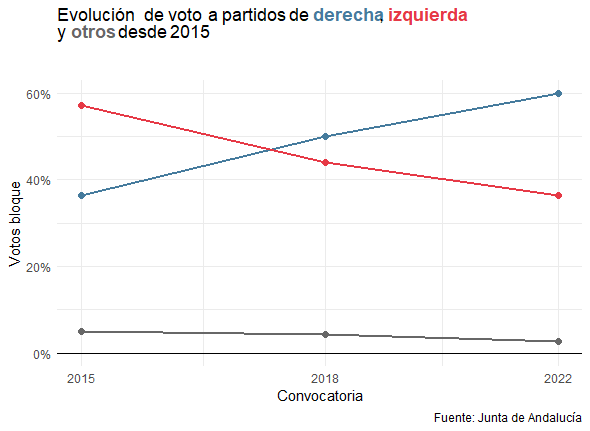
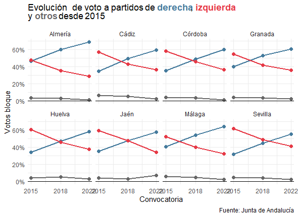
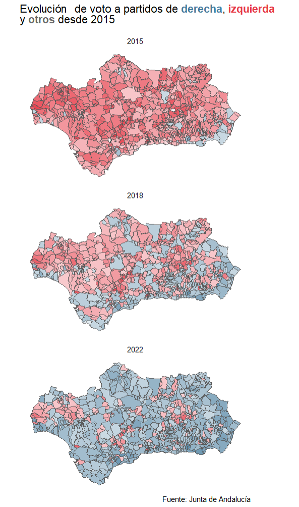

# Análisis electoral: de Rstudio a su periódico {#cap-periodismo}

*Borja Andrino Turón*

EL PAÍS

\index{periódico}
\index{elecciones Andaluzas}

## Motivación

El uso de **R** en el entorno profesional ha llegado también a los periódicos. Cada vez es más habitual encontrar en los medios analistas de datos que lo utilizan en su día a día. En EL PAÍS, muchos de los contenidos que se publican en la Unidad de Datos surgen de un notebook de RStudio. A continuación se muestra un análisis sobre las últimas elecciones andaluzas bajo el título "De RStudio a su periódico favorito".

## Obtención de los datos
Los datos electorales no siempre son igual de accesibles. Los de las elecciones que dependen del Ministerio del Interior se publican en el portal [Infoelectoral](https://infoelectoral.interior.gob.es/opencms/es/inicio/) https://infoelectoral.interior.gob.es/opencms/es/inicio/. En el caso de las elecciones andaluzas, los resultados a nivel de mesa se han publicado en los portales de cada convocatoria, si bien pueden encontrarse en el paquete `CDR` del libro los necesarios para replicar este capítulo.

En primer lugar, se compone un diccionario de municipios que se usará para filtrar y agrupar los resultados por provincia. Primero se escrapea de la web del INE la relación de códigos de provincia con la librería `rvest`. Se lee el código HTML de la página y se buscan los elementos table con clase `miTabla`. A continuación, se usa la función `html_table()` para convertir las tres tablas en un objeto `tibble`. La información con los nombres de municipios y provincias se leerá de la web del INE.

\index{Instituto Nacional de Estadística, INE}


```r
# lee las librerías necesarias para el análisis
pacman::p_load(CDR, ggplot2, dplyr, rvest, lubridate, sf, ggtext, 
               rio, janitor, here, purrr, stringr, scales)
```


```r
url_provincias <- 
  "https://www.ine.es/daco/daco42/codmun/cod_provincia.htm"

cod_provincias <- 
  read_html(url_provincias) |> 
  html_nodes("table.miTabla") |> 
  html_table() |> 
  map_df(as_tibble) |> 
  rename(codigo_prov = 1, name_prov = 2) |> 
  mutate(codigo_prov = str_pad(codigo_prov, width = 2, pad = "0", side = "left"))

url_municipios <- 
  "https://www.ine.es/daco/daco42/codmun/codmun20/20codmun.xlsx"

cod_municipios <- 
  import(url_municipios, skip = 1) |>
  clean_names() |> 
  transmute(codigo_prov = cpro, 
            codigo_mun = str_glue("{codigo_prov}{cmun}"), 
            name_mun = nombre) |> 
  left_join(cod_provincias) |> 
  select(codigo_mun, name_mun, name_prov)
```
Se añade la información sobre municipios al dataset de elecciones que tiene los datos de cada sección censal.


```r
datos_elecciones <- 
  datos_elecciones |> 
  left_join(cod_municipios) |> 
  select(codigo_secc, codigo_mun, name_mun, name_prov, convocatoria, everything())
```

## Transformación de variables y visualización de resultados

En el primer gráfico (Fig. \@#ref(fig:plot-voto-and)) se muestra la evolución de los votos a partidos de izquierda y de derecha en toda Andalucía desde 2015. Primero se calculan los votos válidos en cada convocatoria. Como en la estructura de datos ese dato está repetido para cada combinación de convocatoria-sección-partido se usa la función `distinct()` antes de agrupar y sumar los votos validos de todas las secciones. 


```r
datos_elecciones_validos_total <- 
  datos_elecciones |> 
  distinct(convocatoria, codigo_secc, .keep_all = T) |> 
  mutate(region = "Andalucía") |>  
  group_by(convocatoria, region) |> 
  summarise(validos = sum(validos), .groups = "drop")

datos_elecciones_validos_provs <- 
  datos_elecciones |> 
  distinct(convocatoria, codigo_secc, .keep_all = T) |> 
  mutate(region = name_prov) |>  
  group_by(convocatoria, region) |> 
  summarise(validos = sum(validos), .groups = "drop")

datos_elecciones_validos <- 
  datos_elecciones_validos_total |>
  bind_rows(datos_elecciones_validos_provs)
```

Ahora se calcula la suma de votos de cada bloque en cada convocatoria. En este caso, como cada fila tiene el dato de votos de un partido distinto no es necesaria la función `distinct()`. 


```r
datos_bloques_total <- 
  datos_elecciones |> 
  mutate(region = "Andalucía") |> 
  group_by(convocatoria, region, bloque) |> 
  summarise(votos_bloque = sum(votos_partido), .groups = "drop")

datos_bloques_provs <- 
  datos_elecciones |> 
  mutate(region = name_prov) |> 
  group_by(convocatoria, region, bloque) |> 
  summarise(votos_bloque = sum(votos_partido), .groups = "drop")

datos_bloques <- 
  datos_bloques_total |>
  bind_rows(datos_bloques_provs) |> 
  left_join(datos_elecciones_validos) |> 
  mutate(votos_bloque_pc = votos_bloque / validos)
```

A continuación, se construye el gráfico con los datos que se han calculado antes. Se definen los colores que representan a cada bloque, las fechas para poder etiquetar en el gráfico los *ticks* del eje x y se programa el gráfico.


```r
title <- 
  "Evolución de voto a partidos de <b style='color:#457b9d;'>derecha</b>, <b style='color:#e63946;'>izquierda</b><br>y <b style='color:#676767;'>otros</b> desde 2015"

convocatorias_dates <- 
  datos_bloques |> 
  distinct(convocatoria) |> 
  pull(convocatoria)

datos_bloques |> 
  filter(region == "Andalucía") |>
  ggplot(aes(x = convocatoria, y = votos_bloque_pc, 
                color = bloque, group = bloque)) + 
  geom_line(size = 1) +
  geom_point(size = 2) + 
  geom_hline(yintercept = 0, width = 0.2) + 
  scale_color_manual(values = colors_bloques) +
  scale_x_date(breaks = convocatorias_dates, date_labels = "%Y") +
  scale_y_continuous(labels = percent) + 
  labs(title = title, x = "Convocatoria", y = "Votos bloque", 
       caption = "Fuente: Junta de Andalucía") +
  theme_minimal() + 
  theme(legend.position = "none", 
        plot.title = element_markdown(margin=margin(0,0,30,0)))
```


<div class="figure" style="text-align: center">

<p class="caption">(\#fig:plot-voto-and)Evolución del voto en Andalucía.</p>
</div>


Replicar la Fig. \@ref(fig:plot-voto-and) para cada provincia no es complicado. ünicamente hay que descartar los datos de toda Andalucía y usar la función `facet_wrap()`, que genera el mismo gráfico con el mismo estilo para cada provincia. 

```r
datos_bloques |> 
  filter(region != "Andalucía") |>
  ggplot(aes(x = convocatoria, y = votos_bloque_pc, 
                color = bloque, group = bloque)) + 
  geom_line(size = 1) +
  geom_point(size = 2) + 
  geom_hline(yintercept = 0, width = 0.2) + 
  scale_color_manual(values = colors_bloques) +
  scale_x_date(breaks = convocatorias_dates, date_labels = "%Y") +
  scale_y_continuous(labels = percent) + 
  labs(title = title, x = "Convocatoria", y = "Votos bloque", 
       caption = "Fuente: Junta de Andalucía") +
  facet_wrap(~region, ncol = 4) + 
  theme_minimal() + 
  theme(legend.position = "none", 
        plot.title = element_markdown(margin=margin(0,0,10,0)))
```

<div class="figure" style="text-align: center">

<p class="caption">(\#fig:plot-voto-pro)Evolución del voto provincial en Andalucía.</p>
</div>


La Fig. \@ref(fig:plot-voto-pro) cuenta una historia complementaria (más detallada) a la relatada por la Fig. \@ref(fig:plot-voto-and). El giro no se ha producido igual en toda Andalucía, no es igual el de Almería que el de Sevilla. Para intentar buscar nuevas diferencias territoriales se explorarán los mapas de ganadores a nivel municipal. Se procede de igual manera que con los datos de provincias, salvo que en este caso se agrega a partir de la columna `codigo_mun`. Para calcular el ganador se agrupa por esta columna y se usa la función `slice_max()`, que tomará para cada municipio la fila del partido con el mayor número de votos. 


```r
datos_elecciones_validos_muns <- 
  datos_elecciones |> 
  distinct(convocatoria, codigo_secc, .keep_all = T) |> 
  group_by(convocatoria, codigo_mun) |> 
  summarise(validos = sum(validos), 
            .groups = "drop")

datos_bloques_muns <- 
  datos_elecciones |> 
  group_by(convocatoria, codigo_mun, bloque) |> 
  summarise(votos_bloque = sum(votos_partido), .groups = "drop") |> 
  left_join(datos_elecciones_validos_muns) |> 
  mutate(votos_bloque_pc = votos_bloque / validos, 1)

# Ahora calculamos los ganadores
datos_winners_muns <- 
  datos_bloques_muns |>
  group_by(convocatoria, codigo_mun) |> 
  slice_max(votos_bloque, n = 1, with_ties = F) |> 
  select(convocatoria, codigo_mun, 
         winner = bloque, votos_bloque_pc) 
```

Para crear el gráfico de la Fig. \@ref(fig:plot-voto-pro) se toma el objeto `sf` con los recintos de los municipios andaluces y se les añaden los datos de ganadores calculados anteriormente con la función `left_join()`. Se usa el color del bloque para el relleno y el porcentaje de votos que suma el bloque ganador para la transparencia[^transparencia], de forma que de un vistazo se pueden encontrar feudos de uno u otro bloque.
[^transparencia]: La transparencia en diseño gráfico se refiere al grado de opacidad de una imagen.


```r
map_munis |> 
  left_join(datos_winners_muns) |> 
  mutate(convocatoria = year(convocatoria)) |> 
  ggplot() + 
  geom_sf(aes(fill = winner, alpha = votos_bloque_pc), 
          size = 0.01) + 
  scale_fill_manual(values = colors_bloques) + 
  facet_wrap(~convocatoria, ncol = 1) + 
  labs(title = title, 
       caption = "Fuente: Junta de Andalucía") + 
  coord_sf(label_graticule = "", ndiscr=0) +
  theme_minimal() + 
  theme(legend.position = "none", 
        plot.title = element_markdown(margin=margin(0,0,10,0)))
```


<div class="figure" style="text-align: center">

<p class="caption">(\#fig:plot-voto-andalucia-muni)Evolución del voto municipal en Andalucía (2015-2018-2022).</p>
</div>


En los mapas de la Fig. \@ref(fig:plot-voto-andalucia-muni) se encuentran nuevas historias. En 2015 la derecha era fuerte en la costa de Almería y Málaga. Su presencia creció en 2018, aunque la izquierdas seguía ganando el interior de la comunidad. En 2018 el dominio del bloque de derechas se extendió por casi todo el territorio, en especial en las zonas donde ya era fuerte en 2015.


